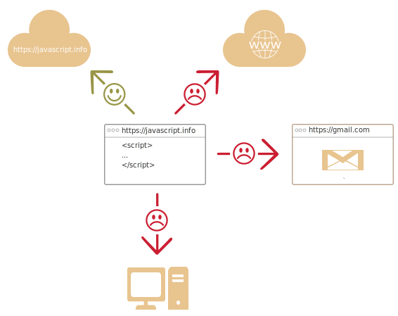

# บทนำสู่ JavaScript

มาดูกันว่า JavaScript มีลักษณะพิเศษอะไรบ้าง ทำอะไรได้บ้าง และเข้ากันได้ดีกับเทคโนโลยีใดบ้าง

## JavaScript คืออะไร?

*JavaScript* ถือกำเนิดขึ้นมาเพื่อ "ทำให้เว็บเพจมีชีวิตชีวา"

โปรแกรมที่เขียนด้วยภาษานี้เรียกว่า *สคริปต์* ซึ่งสามารถแทรกลงในโค้ด HTML ของเว็บเพจได้โดยตรง และทำงานโดยอัตโนมัติเมื่อเพจนั้นโหลดขึ้นมา

สคริปต์เขียนและส่งให้เบราว์เซอร์รันในรูปแบบข้อความธรรมดา ไม่ต้องมีขั้นตอนคอมไพล์ใดๆ ก่อนเลย

ในแง่นี้ JavaScript แตกต่างจากภาษา [Java](https://en.wikipedia.org/wiki/Java_(programming_language)) อย่างชัดเจน

```smart header="ทำไมถึงมีชื่อว่า <u>Java</u>Script?"
ในยุคแรก JavaScript มีชื่อว่า "LiveScript" แต่เนื่องจาก Java กำลังได้รับความนิยมอย่างสูงในขณะนั้น จึงมีการตัดสินใจนำเสนอภาษาใหม่นี้ในฐานะ "น้องชาย" ของ Java เพื่อให้เป็นที่สนใจมากขึ้น

แต่เมื่อค่อยๆ พัฒนาต่อมา JavaScript ก็กลายเป็นภาษาที่มีเอกลักษณ์เฉพาะตัวอย่างสมบูรณ์ มีมาตรฐานของตัวเองที่เรียกว่า [ECMAScript](http://en.wikipedia.org/wiki/ECMAScript) และปัจจุบันไม่มีความเกี่ยวข้องใดๆ กับ Java อีกต่อไป
```

ทุกวันนี้ JavaScript ไม่ได้จำกัดอยู่แค่ในเบราว์เซอร์อีกต่อไป แต่รันได้บนเซิร์ฟเวอร์หรืออุปกรณ์ใดก็ตามที่มีโปรแกรมพิเศษที่เรียกว่า [JavaScript engine](https://en.wikipedia.org/wiki/JavaScript_engine)

เบราว์เซอร์แต่ละตัวมี engine ของตัวเองฝังอยู่ในตัว บางครั้งเรียกว่า "JavaScript virtual machine"

Engine แต่ละตัวมีชื่อเรียก (codename) ที่แตกต่างกัน เช่น:

- [V8](https://en.wikipedia.org/wiki/V8_(JavaScript_engine)) -- ใน Chrome, Opera และ Edge
- [SpiderMonkey](https://en.wikipedia.org/wiki/SpiderMonkey) -- ใน Firefox
- ...มีชื่อเรียกอื่นๆ อีก เช่น "Chakra" ใน IE, "JavaScriptCore", "Nitro" และ "SquirrelFish" ใน Safari เป็นต้น

จำชื่อเหล่านี้ไว้จะเป็นประโยชน์ เพราะมักปรากฏในบทความสำหรับนักพัฒนาอยู่เสมอ เราก็จะใช้ชื่อเหล่านี้เช่นกัน ตัวอย่างเช่น ถ้าได้ยินว่า "ฟีเจอร์ X รองรับโดย V8" ก็หมายความว่าน่าจะทำงานได้ใน Chrome, Opera และ Edge

```smart header="engine ทำงานอย่างไร?"

Engine มีกระบวนการทำงานที่ค่อนข้างซับซ้อน แต่หลักการพื้นฐานไม่ยากเลย

1. Engine (ที่ฝังมากับเบราว์เซอร์) อ่าน ("parse") สคริปต์
2. แล้วแปลง ("compile") สคริปต์ให้เป็นภาษาเครื่อง
3. จากนั้นก็รันโค้ดภาษาเครื่องได้อย่างรวดเร็ว

Engine จะใช้เทคนิคการปรับแต่งในทุกขั้นตอน โดยติดตามข้อมูลของสคริปต์ที่ผ่านการคอมไพล์แล้ว วิเคราะห์การไหลของข้อมูล และนำข้อมูลที่ได้มาปรับแต่งรหัสภาษาเครื่องให้ดีขึ้นไปอีก
```

## JavaScript ในเบราว์เซอร์ทำอะไรได้บ้าง?

JavaScript สมัยใหม่เป็นภาษาโปรแกรมที่ "ปลอดภัย" ไม่สามารถเข้าถึงระดับล่างของหน่วยความจำหรือซีพียูได้โดยตรง เพราะออกแบบมาสำหรับเบราว์เซอร์ที่ไม่จำเป็นต้องใช้ฟีเจอร์เหล่านั้น

ความสามารถของ JavaScript ขึ้นอยู่กับสภาพแวดล้อมที่ใช้งานเป็นอย่างมาก ตัวอย่างเช่น [Node.js](https://wikipedia.org/wiki/Node.js) เสริมความสามารถให้ JavaScript อ่านหรือเขียนไฟล์ใดๆ ก็ได้ ส่งคำขอผ่านเน็ตเวิร์ค และอื่นๆ อีกมาก

ส่วน JavaScript ในเบราว์เซอร์นั้น ทำได้ทุกอย่างที่เกี่ยวกับการจัดการเว็บเพจ การโต้ตอบกับผู้ใช้ และเว็บเซิร์ฟเวอร์

ตัวอย่างเช่น JavaScript ในเบราว์เซอร์สามารถ:

- เพิ่ม HTML ใหม่ลงในหน้าเว็บ เปลี่ยนแปลงเนื้อหาที่มีอยู่ แก้ไขรูปแบบ (style) ของหน้าเว็บ
- ตอบสนองต่อการกระทำของผู้ใช้ เช่นการคลิกเมาส์ การเลื่อนเคอร์เซอร์ และการกดปุ่ม
- ส่งคำขอไปยังเซิร์ฟเวอร์ผ่านเครือข่าย ดาวน์โหลดและอัปโหลดไฟล์ (เรียกกันว่า [AJAX](https://en.wikipedia.org/wiki/Ajax_(programming)) และ [COMET](https://en.wikipedia.org/wiki/Comet_(programming)))
- รับและตั้งค่าคุกกี้ ถามคำถามผู้ใช้ แสดงข้อความ
- จำข้อมูลฝั่งไคลเอนต์ ("local storage")

## JavaScript ในเบราว์เซอร์ทำอะไรไม่ได้บ้าง? 

JavaScript ในเบราว์เซอร์มีข้อจำกัดด้านความสามารถ เพื่อปกป้องความปลอดภัยของผู้ใช้ เป้าหมายคือป้องกันไม่ให้หน้าเว็บอันตรายเข้าถึงข้อมูลส่วนตัวหรือทำให้ข้อมูลเสียหาย

ตัวอย่างของข้อจำกัดเหล่านั้น ได้แก่:

- JavaScript ในหน้าเว็บไม่สามารถอ่าน/เขียน/คัดลอกไฟล์ในฮาร์ดดิสก์ หรือเรียกโปรแกรมอื่นๆ ได้โดยตรง ไม่มีสิทธิ์เข้าถึงฟังก์ชันระบบของระบบปฏิบัติการโดยตรง

    เบราว์เซอร์รุ่นใหม่อนุญาตให้ทำงานกับไฟล์ได้บ้าง แต่การเข้าถึงมีขอบเขตจำกัดอย่างเข้มงวดและต้องได้รับความยินยอมจากผู้ใช้ก่อน เช่น การ "ลาก" ไฟล์มาวางในหน้าเว็บ หรือเลือกผ่านแท็ก `<input>`

    มีวิธีโต้ตอบกับกล้อง ไมโครโฟน และอุปกรณ์อื่นๆ ได้ แต่ต้องขออนุญาตผู้ใช้อย่างชัดเจนทุกครั้ง ดังนั้นหน้าเว็บจึงไม่มีทางแอบเปิดเว็บแคมดูโดยที่ผู้ใช้ไม่รู้ตัวแล้วส่งข้อมูลไปยัง [NSA](https://en.wikipedia.org/wiki/National_Security_Agency) ได้
- แท็บ/วินโดว์ต่างๆ โดยปกติแล้วไม่รู้จักกัน แม้บางครั้งอาจทำได้ เช่นเมื่อหน้าต่างหนึ่งใช้ JavaScript เปิดหน้าต่างอื่นขึ้นมา แต่แม้ในกรณีนี้ JavaScript จากหน้าหนึ่งก็ยังไม่สามารถเข้าถึงอีกหน้าได้ หาก URL นั้นมาจากโดเมน โปรโตคอล หรือพอร์ตที่ต่างกัน นโยบายนี้เรียกว่า "Same Origin Policy"

    การจะแลกเปลี่ยนข้อมูลระหว่างหน้าเว็บได้นั้น *ทั้งสองฝ่ายต้องตกลงยินยอม* และต้องมีโค้ด JavaScript พิเศษเพื่อจัดการ ซึ่งเราจะพูดถึงในบทเรียนข้างหน้า

<<<<<<< HEAD
    ข้อจำกัดนี้ก็เพื่อความปลอดภัยของผู้ใช้เช่นกัน ลองนึกดูว่าจะเป็นอย่างไรถ้าหน้า `http://anysite.com` ที่เปิดอยู่ในแท็บหนึ่งแอบเข้าถึง `http://gmail.com` ในอีกแท็บแล้วขโมยข้อมูลออกไป
- JavaScript ติดต่อกับเซิร์ฟเวอร์ต้นทางของหน้านั้นได้สะดวก แต่การรับข้อมูลจากโดเมนหรือไซต์อื่นมีข้อจำกัดเข้มงวด จะทำได้ก็ต่อเมื่อได้รับความยินยอมชัดเจนจากเซิร์ฟเวอร์ปลายทาง (ผ่าน HTTP header) ซึ่งก็เป็นมาตรการด้านความปลอดภัยอีกเช่นกัน
=======
    This limitation is, again, for the user's safety. A page from `http://anysite.com` which a user has opened must not be able to access another browser tab with the URL `http://gmail.com`, for example, and steal information from there.
- JavaScript can easily communicate over the net to the server where the current page came from. But its ability to receive data from other sites/domains is severely limited. Though possible, it requires explicit agreement (expressed in HTTP headers) from the remote side. Once again, that's a safety limitation.
>>>>>>> 52c1e61915bc8970a950a3f59bd845827e49b4bf



ข้อจำกัดเหล่านี้จะหมดไปทันทีหาก JavaScript ทำงานนอกเบราว์เซอร์ เช่นบนเซิร์ฟเวอร์ นอกจากนี้ เบราว์เซอร์สมัยใหม่ยังอนุญาตให้ปลั๊กอิน/ส่วนขยายขอสิทธิ์เพิ่มเติมได้

## อะไรทำให้ JavaScript โดดเด่น?

JavaScript มีอย่างน้อย *3 จุดเด่น* ที่ทำให้มันแตกต่าง:

```compare
+ ผสานเข้ากับ HTML/CSS ได้อย่างลงตัว
+ ทำสิ่งง่ายๆ ได้อย่างง่ายดาย  
+ รองรับโดยเบราว์เซอร์หลักทั้งหมด และเปิดใช้งานเป็นค่าเริ่มต้น
```

JavaScript เป็นเทคโนโลยีเบราว์เซอร์เพียงอย่างเดียวที่รวม 3 จุดเด่นนี้เข้าด้วยกัน

นั่นคือสิ่งที่ทำให้ JavaScript โดดเด่น และนั่นคือเหตุผลที่ JavaScript กลายเป็นเครื่องมือที่แพร่หลายที่สุดสำหรับสร้างส่วนติดต่อผู้ใช้บนเบราว์เซอร์

อย่างไรก็ตาม ปัจจุบัน JavaScript ยังใช้สร้างเซิร์ฟเวอร์ แอปมือถือ และอื่นๆ ได้อีกด้วย

## ภาษาที่ "transpile" เป็น JavaScript

ไวยากรณ์ของ JavaScript อาจไม่ตอบโจทย์ความต้องการของทุกคน แต่ละคนอยากได้ฟีเจอร์ที่ต่างกัน เรื่องนี้เป็นเรื่องปกติ เพราะแต่ละโปรเจกต์และแต่ละคนมีบริบทที่ไม่เหมือนกัน

ดังนั้น ในช่วงไม่กี่ปีมานี้จึงมีภาษาโปรแกรมใหม่ๆ เกิดขึ้นมากมาย โดยภาษาเหล่านี้จะถูก *transpile* (แปลง) เป็น JavaScript ก่อนรันในเบราว์เซอร์

เครื่องมือสมัยใหม่ทำให้ขั้นตอน transpile รวดเร็วและโปร่งใส นักพัฒนาสามารถเขียนโค้ดด้วยภาษาอื่นแล้วให้แปลงเป็น JavaScript เบื้องหลังโดยอัตโนมัติ

ตัวอย่างของภาษาเหล่านั้น ได้แก่:

- [CoffeeScript](https://coffeescript.org/) เป็น "syntactic sugar" สำหรับ JavaScript โดยนำเสนอไวยากรณ์ที่กระชับกว่า ช่วยให้เราเขียนโค้ดได้ชัดเจนและถูกต้องมากขึ้น เป็นที่นิยมในหมู่นักพัฒนา Ruby
- [TypeScript](https://www.typescriptlang.org/) เน้นการเพิ่ม "strict data typing" เพื่อให้การพัฒนาและดูแลระบบที่ซับซ้อนง่ายขึ้น พัฒนาโดย Microsoft 
- [Flow](https://flow.org/) ก็เพิ่ม data typing เช่นกัน แต่ในรูปแบบที่แตกต่างออกไป พัฒนาโดย Facebook
- [Dart](https://www.dartlang.org/) เป็นภาษาแยกต่างหากที่มี engine เป็นของตัวเอง สามารถทำงานในสภาพแวดล้อมที่ไม่ใช่เบราว์เซอร์ได้ (เช่น แอปมือถือ) และยังสามารถ transpile เป็น JavaScript ได้ พัฒนาโดย Google
- [Brython](https://brython.info/) เป็น transpiler ที่แปลง Python เป็น JavaScript ทำให้สามารถเขียนแอปด้วย Python บริสุทธิ์ได้โดยไม่ต้องใช้ JavaScript  
- [Kotlin](https://kotlinlang.org/docs/reference/js-overview.html) เป็นภาษาโปรแกรมสมัยใหม่ที่กระชับและปลอดภัย สามารถกำหนดเป้าหมายไปที่เบราว์เซอร์หรือ Node ได้

ยังมีภาษาอื่นๆ อีกมากมาย แม้จะใช้ภาษาเหล่านี้ก็ตาม แต่การเรียนรู้ JavaScript โดยตรงก็ยังจำเป็น เพื่อให้เข้าใจอย่างถ่องแท้ว่ากำลังทำอะไรอยู่

## สรุป

- JavaScript เกิดมาเพื่อใช้กับเบราว์เซอร์โดยเฉพาะ แต่ปัจจุบันแพร่หลายไปในสภาพแวดล้อมอื่นๆ อีกมากมาย
- ปัจจุบัน JavaScript เป็นภาษาเบราว์เซอร์ที่ได้รับการยอมรับกว้างขวางที่สุด ทำงานร่วมกับ HTML/CSS ได้อย่างลงตัว
- มีหลายภาษาที่ "transpile" เป็น JavaScript และมีฟีเจอร์เสริมบางอย่าง แนะนำให้ลองศึกษาคร่าวๆ หลังจากเชี่ยวชาญ JavaScript แล้ว
