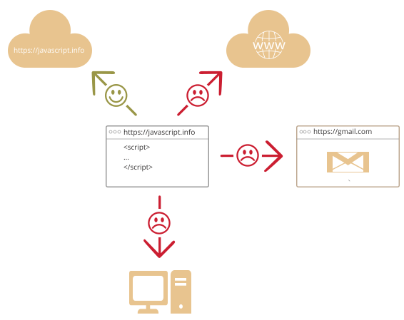

# ทำความรู้จัก JavaScript

JavaScript มีอะไรพิเศษ ทำอะไรได้บ้าง แล้วเข้ากับเทคโนโลยีไหนได้ดี? บทนี้จะพาไล่ดูทีละเรื่อง

## JavaScript คืออะไร?

*JavaScript* เกิดมาเพื่อ "ทำให้เว็บเพจมีชีวิต"

โปรแกรมที่เขียนด้วยภาษานี้เรียกว่า *สคริปต์* เราใส่สคริปต์ลงใน HTML ของเว็บเพจได้เลย พอหน้าเว็บโหลด สคริปต์ก็เริ่มทำงานเอง

สคริปต์เป็นข้อความธรรมดา เบราว์เซอร์เอาไปรันได้ทันที ไม่ต้องเตรียมหรือคอมไพล์ก่อน

ตรงนี้เองที่ JavaScript ต่างจากอีกภาษาหนึ่งชื่อ [Java](https://en.wikipedia.org/wiki/Java_(programming_language)) แบบคนละเรื่องเลย

```smart header="ทำไมถึงชื่อ <u>Java</u>Script?"
ช่วงแรก JavaScript ใช้ชื่อว่า "LiveScript" แต่ตอนนั้น Java กำลังดังมาก เลยตั้งใจวางภาพให้ภาษาใหม่นี้เป็นเหมือน "น้องชาย" ของ Java เผื่อจะช่วยดึงความสนใจได้

แต่พอพัฒนาต่อมา JavaScript ก็กลายเป็นภาษาเต็มตัว มีข้อกำหนดมาตรฐานของตัวเองชื่อ [ECMAScript](http://en.wikipedia.org/wiki/ECMAScript) และทุกวันนี้ก็ไม่ได้เกี่ยวอะไรกับ Java แล้ว
```

ทุกวันนี้ JavaScript ไม่ได้รันแค่ในเบราว์เซอร์ จะรันบนเซิร์ฟเวอร์หรืออุปกรณ์อะไรก็ได้ ขอแค่มีโปรแกรมพิเศษที่เรียกว่า [JavaScript engine](https://en.wikipedia.org/wiki/JavaScript_engine)

ในเบราว์เซอร์จะมี engine นี้ฝังอยู่ บางครั้งเราเรียกว่า "JavaScript virtual machine"

Engine แต่ละตัวมี "ชื่อเล่น" (codename) ต่างกัน เช่น:

- [V8](https://en.wikipedia.org/wiki/V8_(JavaScript_engine)) -- ใช้ใน Chrome, Opera และ Edge
- [SpiderMonkey](https://en.wikipedia.org/wiki/SpiderMonkey) -- ใช้ใน Firefox
- ...ยังมีชื่ออื่นอีก เช่น "Chakra" ของ IE ส่วน Safari ก็มี "JavaScriptCore", "Nitro" และ "SquirrelFish"

ชื่อพวกนี้ควรจำไว้หน่อย เพราะเจอบ่อยในบทความของนักพัฒนา และบทเรียนนี้ก็จะใช้เหมือนกัน เช่น ถ้าอ่านเจอว่า "ฟีเจอร์ X รองรับบน V8" ก็พอเดาได้ว่าใช้กับ Chrome, Opera และ Edge

```smart header="engine ทำงานยังไง?"

ข้างใน engine ซับซ้อนมาก แต่ภาพรวมมีแค่นี้

1. Engine (ถ้าอยู่ในเบราว์เซอร์ก็จะฝังมากับตัวเบราว์เซอร์) อ่านสคริปต์ หรือ "parse"
2. จากนั้นแปลงสคริปต์เป็นภาษาเครื่อง หรือ "compile"
3. แล้วโค้ดภาษาเครื่องก็เริ่มทำงาน แถมเร็วมากด้วย

ระหว่างทาง engine จะคอยเร่งความเร็วทุกขั้น แม้แต่ตอนที่สคริปต์ที่คอมไพล์แล้วกำลังทำงาน ก็ยังเฝ้าดูข้อมูลที่ไหลผ่าน แล้วใช้ข้อมูลนั้นปรับโค้ดภาษาเครื่องให้เร็วขึ้นอีก
```

## JavaScript ในเบราว์เซอร์ทำอะไรได้บ้าง?

JavaScript ยุคนี้ถือเป็นภาษา "ปลอดภัย" เพราะแตะหน่วยความจำ (memory) หรือ CPU ระดับล่างตรงๆ ไม่ได้ ตั้งแต่แรกก็ออกแบบมาให้รันในเบราว์เซอร์ ซึ่งไม่จำเป็นต้องใช้สิทธิ์ระดับนั้น

JavaScript ทำอะไรได้แค่ไหนขึ้นอยู่กับสภาพแวดล้อมที่รันอยู่ อย่าง [Node.js](https://wikipedia.org/wiki/Node.js) ก็มีฟังก์ชันให้ JavaScript อ่านเขียนไฟล์ ส่ง request ผ่านเน็ต และทำอย่างอื่นได้อีกหลายอย่าง

พออยู่ในเบราว์เซอร์ JavaScript ก็จัดการทุกอย่างที่เกี่ยวกับหน้าเว็บ การโต้ตอบกับผู้ใช้ และการคุยกับเซิร์ฟเวอร์ได้

ตัวอย่างที่ทำได้มีพวกนี้:

- เพิ่ม HTML ลงในหน้า แก้เนื้อหาที่มีอยู่ หรือเปลี่ยน style
- ตอบสนองการกระทำของผู้ใช้ เช่น คลิกเมาส์ ขยับตัวชี้ หรือกดปุ่ม
- ส่ง request ผ่านเน็ตไปหาเซิร์ฟเวอร์อื่น รวมถึงดาวน์โหลดและอัปโหลดไฟล์ (เทคโนโลยีที่เรียกว่า [AJAX](https://en.wikipedia.org/wiki/Ajax_(programming)) และ [COMET](https://en.wikipedia.org/wiki/Comet_(programming)))
- อ่านและตั้งค่าคุกกี้ ถามข้อมูลผู้ใช้ หรือแสดงข้อความ
- จำข้อมูลไว้ฝั่งเครื่องผู้ใช้ ("local storage")

## JavaScript ในเบราว์เซอร์ทำอะไรไม่ได้บ้าง?

เพื่อความปลอดภัยของผู้ใช้ เบราว์เซอร์จะจำกัดสิ่งที่ JavaScript ทำได้ ไม่อย่างนั้นหน้าเว็บอันตรายอาจแอบอ่านข้อมูลส่วนตัวหรือทำข้อมูลในเครื่องเสียหาย

ข้อจำกัดหลักๆ มีแบบนี้:

- JavaScript บนหน้าเว็บไม่มีสิทธิ์เปิดอ่าน เขียน หรือคัดลอกไฟล์ในฮาร์ดดิสก์ตามใจชอบ จะสั่งรันโปรแกรมหรือเรียกฟังก์ชันของระบบปฏิบัติการ (OS) ตรงๆ ก็ไม่ได้

    เบราว์เซอร์สมัยใหม่ยอมให้เว็บทำงานกับไฟล์ได้บ้าง แต่ผู้ใช้ต้องเป็นคนเริ่มก่อน เช่น ลากไฟล์มาวางในหน้าต่างเบราว์เซอร์ หรือเลือกผ่านแท็ก `<input>`

    กล้อง ไมโครโฟน และอุปกรณ์อื่นๆ ก็ใช้ได้ แต่ต้องขอสิทธิ์จากผู้ใช้ให้ชัดเจน หน้าเว็บเลยแอบเปิดเว็บแคมดูรอบห้องแล้วส่งข้อมูลไป [NSA](https://en.wikipedia.org/wiki/National_Security_Agency) ไม่ได้
- ปกติแต่ละแท็บหรือหน้าต่างจะไม่รู้จักกัน มีข้อยกเว้นบ้าง เช่น หน้าต่างหนึ่งใช้ JavaScript เปิดอีกหน้าต่างขึ้นมา แต่ถึงอย่างนั้น ถ้าสองหน้ามาจากคนละเว็บไซต์—ต่างกันทั้งโดเมน โปรโตคอล หรือพอร์ต—JavaScript ของหน้าหนึ่งก็เข้าอีกหน้าไม่ได้

    กฎนี้เรียกว่า "Same Origin Policy" ถ้าจะแลกข้อมูลกัน *ทั้งสองหน้าต้องยอม* และมีโค้ด JavaScript พิเศษคอยจัดการ เดี๋ยวเราจะเจอเรื่องนี้ในบทต่อๆ ไป

    ข้อจำกัดนี้มีไว้เพื่อความปลอดภัยเหมือนเดิม ลองนึกดูว่าถ้า `http://anysite.com` ที่เราเปิดไว้ แอบเข้าแท็บ `http://gmail.com` แล้วขโมยข้อมูลออกมาได้จะเป็นยังไง
- JavaScript คุยผ่านเน็ตกับเซิร์ฟเวอร์ต้นทางได้สบาย แต่รับข้อมูลจากเว็บไซต์หรือโดเมนอื่นได้จำกัดมาก ทำได้ก็ต่อเมื่อฝั่งปลายทางยอมชัดเจนผ่าน HTTP header นี่ก็เป็นกำแพงความปลอดภัยอีกชั้น



ข้อจำกัดเหล่านี้ไม่มีเมื่อ JavaScript รันนอกเบราว์เซอร์ เช่น บนเซิร์ฟเวอร์ ส่วนเบราว์เซอร์สมัยใหม่ก็ยอมให้ปลั๊กอินหรือส่วนขยายขอสิทธิ์เพิ่มได้

## JavaScript มีอะไรพิเศษ?

จุดเด่นของ JavaScript มีอย่างน้อย *3 ข้อ*:

```compare
+ ทำงานร่วมกับ HTML/CSS ได้เต็มที่
+ เรื่องง่ายๆ ก็เขียนได้ตรงไปตรงมา
+ ใช้ได้กับเบราว์เซอร์หลักทุกตัว แถมเปิดไว้เป็นค่าเริ่มต้น
```
JavaScript เป็นเทคโนโลยีเดียวในเบราว์เซอร์ที่รวมครบทั้ง 3 ข้อนี้

นี่แหละที่ทำให้ JavaScript ไม่เหมือนใคร เลยกลายเป็นเครื่องมือยอดนิยมที่สุดสำหรับสร้างส่วนติดต่อผู้ใช้ (UI) ในเบราว์เซอร์

แต่ JavaScript ไม่ได้จบแค่หน้าเว็บ ยังเอาไปสร้างเซิร์ฟเวอร์ แอปมือถือ และอย่างอื่นได้อีก

## ภาษาที่แปลงเป็น JavaScript

วิธีเขียน JavaScript ไม่ได้ถูกใจทุกคน เพราะแต่ละคนก็อยากได้ความสามารถคนละแบบ

เรื่องนี้ไม่แปลก—แต่ละโปรเจกต์มีโจทย์และความต้องการต่างกัน

ช่วงหลังเลยมีภาษาใหม่เกิดขึ้นเยอะ ก่อนจะรันในเบราว์เซอร์ เครื่องมือจะ *transpile* (แปลง) ภาษาเหล่านี้ให้เป็น JavaScript ก่อน

เครื่องมือสมัยใหม่ทำเรื่องนี้เร็วและเนียนจนแทบไม่รู้สึก เราเขียนอีกภาษาได้ตามปกติ แล้วปล่อยให้เครื่องมือแปลงเป็น JavaScript "หลังบ้าน" ให้เอง

ตัวอย่างมีพวกนี้:

- [CoffeeScript](https://coffeescript.org/) เป็น "syntactic sugar" ของ JavaScript เพิ่มรูปแบบการเขียนที่สั้นลง ทำให้เขียนโค้ดได้ชัดและกระชับขึ้น มักถูกใจนักพัฒนาสาย Ruby
- [TypeScript](https://www.typescriptlang.org/) เน้นเพิ่มการกำหนดชนิดข้อมูลแบบเข้มงวด ("strict data typing") เพื่อให้พัฒนาและดูแลระบบซับซ้อนได้ง่ายขึ้น พัฒนาโดย Microsoft
- [Flow](https://flow.org/) เพิ่มการกำหนดชนิดข้อมูลเหมือนกัน แต่ใช้คนละแนว พัฒนาโดย Facebook
- [Dart](https://www.dartlang.org/) เป็นภาษาแยกที่มี engine ของตัวเอง รันนอกเบราว์เซอร์ได้ เช่น ในแอปมือถือ และยัง transpile เป็น JavaScript ได้ด้วย พัฒนาโดย Google
- [Brython](https://brython.info/) ใช้ transpile Python เป็น JavaScript เราเลยเขียนแอปด้วย Python ล้วนๆ ได้ โดยไม่ต้องแตะ JavaScript
- [Kotlin](https://kotlinlang.org/docs/reference/js-overview.html) เป็นภาษาสมัยใหม่ที่กระชับและปลอดภัย ใช้กับเบราว์เซอร์หรือ Node.js ก็ได้

ยังมีอีกหลายภาษา ถึงจะเลือกใช้ภาษาเหล่านี้ เราก็ควรรู้ JavaScript อยู่ดี เพราะสุดท้ายต้องเข้าใจว่าโค้ดเบื้องหลังกำลังทำอะไรจริงๆ

## สรุป

- JavaScript เริ่มต้นจากภาษาสำหรับเบราว์เซอร์ แต่ทุกวันนี้ใช้ในสภาพแวดล้อมอื่นได้อีกหลายแบบ
- ตอนนี้ JavaScript เป็นภาษาที่ใช้ในเบราว์เซอร์แพร่หลายที่สุด และทำงานร่วมกับ HTML/CSS ได้เต็มที่
- มีหลายภาษาที่ transpile เป็น JavaScript เพื่อเพิ่มความสามารถแบบต่างๆ พอพื้นฐาน JavaScript แน่นแล้ว ค่อยลองดูภาษาเหล่านี้คร่าวๆ ก็ได้
