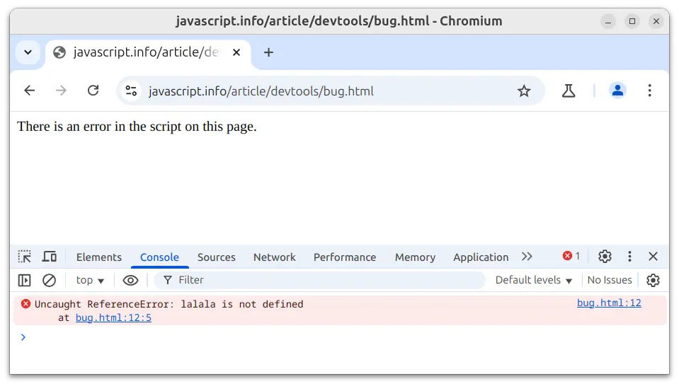
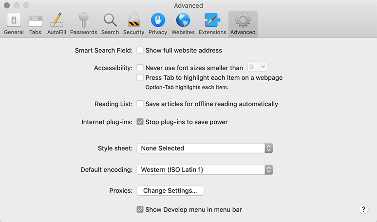

# คอนโซลนักพัฒนา

เขียนโค้ดยังไงก็มีบั๊กแหละ... เอ ไม่ใช่สิ ต้องพูดใหม่ — ถ้าเป็นมนุษย์ *ย่อมต้อง* พลาดแน่นอน ยกเว้นเป็น[หุ่นยนต์](https://en.wikipedia.org/wiki/Bender_(Futurama))

แต่ปกติผู้ใช้จะไม่เห็น error บนหน้าเว็บ ถ้าสคริปต์พัง เราก็ไม่รู้ว่าพังตรงไหน แก้ไม่ได้เลย

เบราว์เซอร์เลยมี "developer tools" ติดมาให้ — ไว้ดู error กับข้อมูล debug ต่างๆ ของสคริปต์

dev ส่วนใหญ่ชอบใช้ Chrome หรือ Firefox เพราะ dev tools แรงที่สุด เบราว์เซอร์อื่นก็มีเหมือนกัน บางทีมีฟีเจอร์เด็ดๆ ด้วย แต่มักตามหลัง Chrome/Firefox อยู่ เลยมักจะมีเบราว์เซอร์ "ตัวโปรด" ไว้ทำงาน แล้วค่อยสลับไปตัวอื่นเมื่อเจอบั๊กเฉพาะเบราว์เซอร์นั้น

Dev tools มีฟีเจอร์เยอะมาก แต่ตอนนี้เราจะเริ่มจากเปิดใช้ ดู error แล้วก็รันคำสั่ง JavaScript กันก่อน

## Google Chrome

ลองเปิดหน้า [bug.html](bug.html) ดู 

ในโค้ด JavaScript บนหน้านั้นมีบั๊กซ่อนอยู่ ผู้ใช้ทั่วไปมองไม่เห็น ลองเปิด dev tools ขึ้นมาดู

กด `key:F12` หรือหากใช้ Mac ให้กด `key:Cmd+Opt+J`

Dev tools จะเปิดมาที่แท็บ Console เป็นค่าเริ่มต้น

หน้าตาจะออกมาประมาณนี้:



หน้าตาอาจต่างกันบ้างตามเวอร์ชัน Chrome แต่โดยรวมคล้ายๆ กัน

- จะเห็น error สีแดง — ในตัวอย่างนี้สคริปต์มีคำสั่งที่ไม่รู้จักชื่อ "lalala"
- ทางขวาจะมีลิงก์คลิกได้ ระบุไฟล์ `bug.html:12` พร้อมเลขบรรทัดที่เกิด error

ใต้ error จะมีสัญลักษณ์ `>` สีฟ้า — นี่คือ command line ที่พิมพ์คำสั่ง JavaScript แล้วกด `key:Enter` เพื่อรันได้เลย

ตอนนี้เราเห็น error ได้แล้ว แค่นี้ก็พอสำหรับเริ่มต้น เดี๋ยวจะกลับมาคุยเรื่อง dev tools อีกที แล้วจะดูเรื่อง debug ละเอียดขึ้นในบท <info:debugging-chrome>

```smart header="การป้อนหลายบรรทัด"
ปกติพิมพ์โค้ดบรรทัดเดียวในคอนโซลแล้วกด `key:Enter` ก็รันเลย

แต่ถ้าอยากพิมพ์หลายบรรทัด ให้กด `key:Shift+Enter` แทน — ใส่โค้ดยาวๆ ได้สบาย
```

## Firefox, Edge และอื่นๆ 

เบราว์เซอร์ส่วนใหญ่กด `key:F12` ก็เปิด dev tools ได้เลย

หน้าตาและการใช้งานคล้ายกันหมด พอรู้วิธีใช้ตัวนึงแล้ว (เช่น เริ่มจาก Chrome) ก็สลับไปตัวอื่นได้สบาย

## Safari

Safari (เบราว์เซอร์ของ Mac ไม่มีบน Windows/Linux) ต่างจากตัวอื่นนิดนึง — ต้องเปิด "Develop menu" ก่อน

เปิด Settings แล้วไปที่แท็บ "Advanced" จะเห็นช่องทำเครื่องหมายที่ด้านล่างของหน้า:



ทีนี้กด `key:Cmd+Opt+C` ก็เปิด/ปิดคอนโซลได้แล้ว แล้วจะเห็นเมนูใหม่ชื่อ "Develop" โผล่มาที่ด้านบน — มีคำสั่งและตัวเลือกต่างๆ เพียบ

## สรุป

- Dev tools ช่วยให้เห็น error รันคำสั่ง เช็คตัวแปร และอีกเพียบ
- เปิดได้ด้วย `key:F12` ในเบราว์เซอร์ส่วนใหญ่บน Windows ส่วน Chrome บน Mac ใช้ `key:Cmd+Opt+J`, Safari ใช้ `key:Cmd+Opt+C` (ต้องเปิดก่อน)

เตรียมพร้อมหมดแล้ว บทถัดไปเราจะเริ่มเขียน JavaScript กัน!
