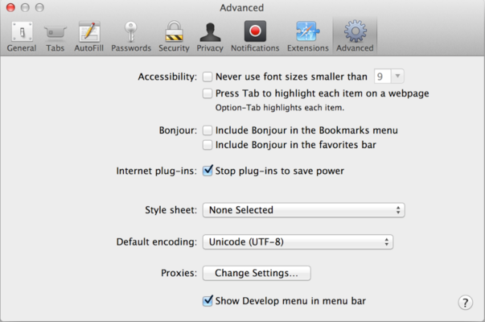

# Developer console

โค้ดที่เขียนหลายครั้งมักจะมีข้อผิดพลาด และเหล่านักพัฒนามักจะทำพลาดอยู่บ่อยๆด้วย อันที่จริงปกติมนุษย์เราก็มักจะผิดพลาดอยู่บ่อยครั้ง 

แต่ในเบราเซอร์ ผู้ใช้งานมักจะไม่เห็นข้อผิดพลาดที่เหล่านักพัฒนาซ่อนไว้ ดังนั้นหากสคริปต์ที่เราเขียนมีข้อผิดพลาด เราจะไม่รู้และแก้ไขมันได้เลย

เพื่อย้อนไปดูว่าเราพลาดอะไรไป "เครื่องมือสำหรับนักพัฒนา (developer tools)" จึงติดมากับเบราเซอร์ด้วย

นักพัฒนาส่วนใหญ่มักจะใช้ Chrome และ Firefox นั่นก็เพราะว่าทั้งสองตัวมี เครื่องมือสำหรับการพัฒนาที่ดีที่สุดในตลาดแล้ว ดังนั้นนักพัฒนามักเลือกใช้เบราเซอร์เพียงตัวเดียวในการพัฒนา แต่จะใช้เบราเซอร์อื่นร่วมด้วย แต่หลังจากที่ปัญหาเกิดแล้ว เช่น โค้ดที่เขียนไม่ซัพพอร์ตใน IE

เครื่องมือเหล่านี้มาพร้อมฟีเจอร์ที่ตอบโจทย์การพัฒนามากมาย เราจะเริ่มไล่ดูกันไปทีละอย่าง

## Google Chrome

ลองเปิดหน้า [bug.html](bug.html).

หากเปิด developer tools ดู จะเห็นว่ามี error ในโค้ดจาวาสคริปต์ แต่ผู้ใช้จะมองไม่เห็นสิ่งเหล่านี้ 

กด `F12` บน Windows หรือ `Cmd+Opt+J` บน Macs

developer tools จะเปิดหน้า console ขึ้นมาโดย default

หน้าตาจะคล้ายๆแบบนี้

หน้าตาตัว developer tools จะเปลี่ยนไปตามเวอร์ชั่น ถึงหน้าตาที่เปิดออกมาจะไม่เป๊ะเว่อร์ แต่โครงหน้าจะคล้ายๆกัน

- ลองมองไปที่ console จะเห็นว่ามี error อยู่ แถบและตัวอักษรสีแดงอยู่ นั่นเพราะว่าเบราเซอร์ไม่รู้จักคำสั่ง "lalala"
- ซ้ายมือของแถบ จะเห็นว่ามีการบอกบรรทัดที่ error นี้เกิดขึ้น

ข้างล่างข้อความ error จะสังเกตเห็นว่ามีลูกศรสีน้ำเงินอยู่ ตัวมันเองแทน "command line" เราสามารถพิมพ์จาวาสคริปต์ลงไป แล้วกด `enter` เพื่อ execute คำสั่ง หรือ `shift-enter` เพื่อพิมพ์โค้ดหลายคำสั่งแทน

ทีนี้เราก็พร้อมที่จะจัดการกับ error ตัวนี้แล้ว บทนี้เป็นแค่ออเดิร์ฟ เราจะเสิร์ฟจานหลักอีกทีในบท <info:debugging-chrome>

## Firefox, Edge, และเบราเซอร์ตัวอื่นๆ

นักพัฒนาส่วนใหญ่ใช้ `F12` เพื่อเปิดหน้า console

developer tools มักจะคล้ายๆกันไม่ว่าจะต่างเวอร์ชั่น ต่างเบราเซอร์ หากเชี่ยวชาญเพียงหนึ่ง ก็ใช้ตัวอื่นได้สูสีกัน

## Safari

Safari (เบราเซอร์ของผู้ใช้ Mac) ตัวนี้มาพร้อมความไม่เหมือนใคร เพี่ะเราต้องไปเปิด "Develop menu" ก่อน

เปิดหน้า "Preferences" ไปที่ "Advanced" และติ๊ก checkbox ด้านล่าง

ทีนี้กด `Cmd+Opt+C` หน้า console จะปรากฎขึ้น แถมเมนูด้านบน ยังปรากฎแถบ "Develop" เมื่อคลิกก็จะมีคำสั่งหลากหลายให้เลือกใช้

## พิมพ์โค้ดหลายบรรทัด

อย่าลืมว่า `Enter` ในคอนโซลไม่ใช่ขึ้นบรรทัดใหม่ เพราะมันคือสั่งให้โค้ดเราทำงาน

ถ้าจะเขียนโค้ดหลายบรรทัด ใช้ `Shift+Enter` แทน

## สรุป

- Developer tools ช่วยให้เห็น error, สั่งโค้ดทำงาน, ตรวจค่าตัวแปร และอื่นๆ
- เปิดโดยกด `F12` สำหรับเบราเซอร์ส่วนใหญ่บน Windows แต่ Chrome บน Mac จะใช้ `Cmd+Opt+J` Safari จะเป็น `Cmd+Opt+C` อย่าลืมไปเปิดโหมดนักพัฒนาบน Safari ก่อน

ทีนี้ปูพื้นเรื่อง environment กันมาสักพักแล้ว พระเอกอย่างจาวาสคริปต์ก็พร้อมออกโรงแล้ว
