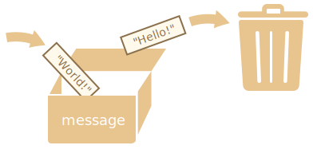

# ตัวแปร

ในการพัฒนาแอปพลิเคชัน JavaScript ส่วนใหญ่ เรามักจะต้องทำงานกับข้อมูล ยกตัวอย่างเช่น
1. ร้านค้าออนไลน์ -- ข้อมูลอาจประกอบด้วยสินค้าที่จำหน่ายและตะกร้าสินค้า
2. แอปพลิเคชันแชท -- ข้อมูลอาจประกอบด้วยผู้ใช้ ข้อความ และอื่นๆ อีกมากมาย

ตัวแปรใช้เก็บข้อมูลเหล่านี้

## ตัวแปรคืออะไร

[ตัวแปร](https://en.wikipedia.org/wiki/Variable_(computer_science)) คือ "พื้นที่จัดเก็บข้อมูลที่มีชื่อกำกับ" เราสามารถใช้ตัวแปรเพื่อเก็บสินค้า ข้อมูลผู้เยี่ยมชม และข้อมูลอื่นๆ ได้

ในการสร้างตัวแปรใน JavaScript ให้ใช้คีย์เวิร์ด `let`

คำสั่งด้านล่างจะสร้าง (หรือที่เรียกอีกอย่างว่า *ประกาศ*) ตัวแปรที่มีชื่อว่า "message":

```js
let message;
```

ตอนนี้เราสามารถใส่ข้อมูลลงในตัวแปรได้ด้วยการใช้เครื่องหมาย `=` หรือที่เรียกว่าตัวดำเนินการกำหนดค่า (assignment operator):

```js
let message;

*!*
message = 'สวัสดี'; // เก็บข้อความ 'สวัสดี' ในตัวแปรที่ชื่อว่า message
*/!*
```

ข้อความจะไปเก็บอยู่ในพื้นที่หน่วยความจำที่สัมพันธ์กับตัวแปรนั้น และเข้าถึงได้ด้วยการอ้างชื่อตัวแปร:

```js run
let message;
message = 'สวัสดี!';

*!*
alert(message); // แสดงค่าในตัวแปร
*/!*
```

เพื่อความกระชับ เราสามารถรวมการประกาศตัวแปรและกำหนดค่าเริ่มต้นไว้ในบรรทัดเดียวกันได้:

```js run
let message = 'สวัสดี!'; // ประกาศตัวแปรและกำหนดค่าในคำสั่งเดียว

alert(message); // สวัสดี!
```

นอกจากนี้ เรายังสามารถประกาศตัวแปรหลายตัวในบรรทัดเดียวได้ด้วย:

```js no-beautify
let user = 'จอห์น', age = 25, message = 'สวัสดี';
```

วิธีนี้อาจจะดูสั้นกระชับดี แต่เราไม่แนะนำให้ใช้ เพื่อความสะดวกในการอ่านโค้ด ควรประกาศตัวแปรแต่ละตัวแยกเป็นคนละบรรทัดจะดีกว่า

แบบนี้อาจยาวกว่าเล็กน้อย แต่อ่านง่ายขึ้นมาก:

```js
let user = 'จอห์น';
let age = 25;
let message = 'สวัสดี';
```

บางคนยังชอบประกาศตัวแปรหลายตัวแบบหลายบรรทัดแบบนี้:

```js no-beautify
let user = 'จอห์น',
  age = 25,
  message = 'สวัสดี';
```

หรือแม้กระทั่งเขียนในรูปแบบ "เริ่มต้นด้วยเครื่องหมายจุลภาค":

```js no-beautify
let user = 'จอห์น'
  , age = 25
  , message = 'สวัสดี';
```

ในเชิงเทคนิคแล้ว ตัวแปรทั้งหมดที่ยกตัวอย่างมาทำงานในลักษณะเดียวกัน จึงเป็นเรื่องของรสนิยมและความชอบส่วนตัว

````smart header="`var` กับ `let`"
ในสคริปต์เก่าๆ อาจเจอการใช้คีย์เวิร์ด `var` แทน `let` ในการประกาศตัวแปร:

```js
*!*var*/!* message = 'สวัสดี';
```

คีย์เวิร์ด `var` นั้น*เกือบจะ*เหมือนกับ `let` คือใช้ประกาศตัวแปร แต่จะมีความแตกต่างเล็กน้อยในสไตล์ที่ค่อนข้าง "เชย"

ความแตกต่างระหว่าง `let` กับ `var` นั้นไม่ใช่ประเด็นสำคัญสำหรับเราในตอนนี้ เราจะกล่าวถึงรายละเอียดในบทเรียน <info:var>

````

# การเปรียบเทียบกับสถานการณ์ในชีวิตจริง

ลองนึกภาพ "ตัวแปร" เป็น "กล่อง" ไว้ใส่ข้อมูล แปะสติกเกอร์ชื่อไว้ด้านนอก

ยกตัวอย่างเช่น ตัวแปร `message` จะเปรียบได้กับกล่องที่มีป้ายชื่อ `"message"` และมีค่า `"สวัสดี!"` ข้างใน:


ใส่ค่าอะไรก็ได้ลงในกล่อง และเปลี่ยนค่าได้ตามใจชอบ:

```js run
let message;

message = 'สวัสดี!';

message = 'ชาวโลก!'; // เปลี่ยนค่าแล้ว

alert(message);
```

เมื่อเปลี่ยนค่า ข้อมูลเก่าก็จะหายไปจากตัวแปร:



นอกจากนี้ เรายังสามารถประกาศตัวแปรสองตัว แล้วคัดลอกข้อมูลจากตัวหนึ่งไปอีกตัวหนึ่งได้ด้วย

```js run
let hello = 'สวัสดีชาวโลก!';

let message;

*!*
// คัดลอก 'สวัสดีชาวโลก!' จาก hello มาเก็บใน message
message = hello;
*/!*

// ตอนนี้ตัวแปรทั้งสองมีข้อมูลชุดเดียวกัน
alert(hello); // สวัสดีชาวโลก!
alert(message); // สวัสดีชาวโลก!
```

````warn header="การประกาศตัวแปรซ้ำจะเกิดข้อผิดพลาด"
ควรประกาศตัวแปรเพียงครั้งเดียวเท่านั้น 

หากประกาศตัวแปรเดิมซ้ำอีก จะถือเป็นข้อผิดพลาด:

```js run
let message = "นี่";

// ประกาศ 'let' ซ้ำ ทำให้เกิด error
let message = "นั่น"; // SyntaxError: 'message' ถูกประกาศไปแล้ว
```

ดังนั้น ประกาศตัวแปรแค่ครั้งเดียว จากนั้นอ้างถึงได้เลยโดยไม่ต้องมี `let` อีก
````

```smart header="ภาษาการเขียนโปรแกรมแบบฟังก์ชัน"
น่าสนใจว่า มีภาษาโปรแกรมที่เรียกว่า [ฟังก์ชันเชิงบริสุทธิ์](https://en.wikipedia.org/wiki/Purely_functional_programming) เช่น [Haskell](https://en.wikipedia.org/wiki/Haskell) ซึ่งห้ามไม่ให้เปลี่ยนค่าตัวแปรเด็ดขาด

ในภาษาเหล่านี้ เมื่อเก็บค่าใส่ "กล่อง" ไปแล้ว มันจะอยู่ในนั้นตลอดกาล หากต้องการเก็บข้อมูลอย่างอื่น ภาษาจะบังคับให้เราต้องสร้างกล่องใหม่ (ประกาศตัวแปรใหม่) จะนำกล่องเก่ามาใช้ใหม่ไม่ได้ 

ฟังดูแปลกๆ ใช่ไหม? แต่ภาษาพวกนี้ก็พัฒนาโปรแกรมจริงจังได้นะ ยิ่งไปกว่านั้น ในบางด้านอย่างการประมวลผลแบบขนาน ข้อจำกัดนี้กลับมีประโยชน์เสียด้วยซ้ำ
```

## การตั้งชื่อตัวแปร [#variable-naming]

ในภาษา JavaScript มีข้อจำกัด 2 ประการในการตั้งชื่อตัวแปร:

1. ชื่อต้องประกอบด้วยตัวอักษร ตัวเลข หรือสัญลักษณ์ `$` และ `_` เท่านั้น
2. ตัวอักษรตัวแรกต้องไม่ใช่ตัวเลข

ตัวอย่างชื่อที่ใช้ได้:

```js
let userName;
let test123;
```

เมื่อชื่อประกอบด้วยหลายคำ มักนิยมใช้รูปแบบ [camelCase](https://en.wikipedia.org/wiki/CamelCase) นั่นคือเขียนคำต่อกันเรื่อยๆ โดยขึ้นต้นคำแรกด้วยตัวพิมพ์เล็ก ส่วนคำถัดๆ ไปให้ขึ้นต้นด้วยตัวพิมพ์ใหญ่ เช่น `myVeryLongName`

ที่น่าสนใจคือ เครื่องหมายดอลลาร์ `'$'` และอันเดอร์สกอร์ `'_'` ก็ใช้เป็นส่วนหนึ่งของชื่อได้ เป็นแค่สัญลักษณ์ธรรมดาเหมือนตัวอักษร ไม่ได้มีความหมายพิเศษอะไร

ชื่อเหล่านี้ใช้ได้:

```js run untrusted
let $ = 1; // ประกาศตัวแปรชื่อ "$"
let _ = 2; // และนี่ตัวแปรชื่อ "_"

alert($ + _); // 3
```

ตัวอย่างชื่อตัวแปรที่ใช้ไม่ได้:

```js no-beautify
let 1a; // ห้ามขึ้นต้นด้วยตัวเลข

let my-name; // เครื่องหมายขีด '-' ไม่อนุญาตให้ใช้ในชื่อ
```

```smart header="ตัวพิมพ์ใหญ่-เล็กมีผล"
ตัวแปร `apple` กับ `APPLE` ถือเป็นคนละตัวกัน
```

```smart header="อักษรที่ไม่ใช่ภาษาอังกฤษใช้ได้ แต่ไม่แนะนำ"
เราสามารถใช้ภาษาอื่นๆ ได้ รวมถึงอักษรภาษารัสเซีย อักษรจีน หรืออื่นๆ เช่น:

```js
let имя = '...';
let 我 = '...';
```

ในทางเทคนิคแล้ว ตัวอย่างข้างบนไม่มีข้อผิดพลาด การตั้งชื่อแบบนั้นใช้ได้ แต่เรามีข้อตกลงสากลว่าควรใช้ภาษาอังกฤษในการตั้งชื่อตัวแปร เพราะถึงแม้จะเป็นสคริปต์สั้นๆ แต่ก็อาจจะมีชีวิตอยู่ได้นานมาก และในอนาคตอาจมีคนจากประเทศอื่นต้องเข้ามาอ่านด้วยก็เป็นได้
```

```warn header="ชื่อที่สงวนไว้"
มี[รายการคำสงวน](https://developer.mozilla.org/en-US/docs/Web/JavaScript/Reference/Lexical_grammar#Keywords) ที่ตัวภาษาจองไว้ใช้เอง จึงนำมาตั้งเป็นชื่อตัวแปรไม่ได้

ตัวอย่างเช่น: `let`, `class`, `return` และ `function` เป็นคำสงวน

โค้ดด้านล่างจะเกิด syntax error:

```js run no-beautify
let let = 5; // ไม่สามารถตั้งชื่อตัวแปรว่า "let" เพราะเป็นคำสงวน เกิด error!
let return = 5; // เช่นเดียวกัน ห้ามตั้งชื่อเป็น "return" เกิด error!
```
```

```warn header="การกำหนดค่าโดยไม่ใช้ `use strict`"

โดยปกติต้องประกาศตัวแปรก่อนใช้งาน แต่ในสมัยก่อนมีช่องโหว่ทางเทคนิคที่ทำให้สร้างตัวแปรได้โดยแค่กำหนดค่าโดยตรง โดยไม่ต้องใช้ `let` วิธีนี้ยังใช้ได้อยู่หากไม่ใส่ `use strict` ในสคริปต์ เพื่อรักษาความเข้ากันได้กับโค้ดเก่า

```js run no-strict
// หมายเหตุ: ไม่มีการใช้ "use strict" ในตัวอย่างนี้

num = 5; // ถ้าไม่มีตัวแปร "num" จะถูกสร้างขึ้นอัตโนมัติ

alert(num); // 5
```

วิธีนี้ถือเป็นแนวปฏิบัติที่ไม่ดี และจะเกิดข้อผิดพลาดในโหมดเข้มงวด (strict mode):

```js
"use strict";

*!*
num = 5; // error: ตัวแปร num ไม่ได้ถูกประกาศไว้ก่อน
*/!*
```

## ค่าคงที่ (Constants)

เพื่อประกาศตัวแปรค่าคงที่ (ไม่เปลี่ยนแปลงค่า) ให้ใช้ `const` แทน `let`:

```js
const myBirthday = '18.04.1982';
```

ตัวแปรที่ประกาศด้วย `const` จะเรียกว่า "ค่าคงที่" ซึ่งไม่สามารถกำหนดค่าใหม่ได้ หากพยายามทำเช่นนั้นจะเกิดข้อผิดพลาด:

```js run
const myBirthday = '18.04.1982';

myBirthday = '01.01.2001'; // error เพราะไม่สามารถกำหนดค่าใหม่ให้ค่าคงที่ได้!
```

เมื่อโปรแกรมเมอร์มั่นใจว่าตัวแปรจะไม่มีวันเปลี่ยนแปลงค่า ก็สามารถประกาศเป็นค่าคงที่ด้วย `const` เพื่อการันตีและสื่อสารข้อเท็จจริงดังกล่าวให้ทุกคนรับทราบ

### ค่าคงที่ที่เขียนด้วยตัวพิมพ์ใหญ่

ในทางปฏิบัติ มักนิยมใช้ค่าคงที่เป็นนามแทนสำหรับค่าที่จำยาก ซึ่งทราบค่าตายตัวก่อนการประมวลผลโปรแกรมแล้ว

ค่าคงที่ลักษณะนี้มักตั้งชื่อโดยใช้ตัวพิมพ์ใหญ่และอันเดอร์สกอร์

ยกตัวอย่างเช่น ลองสร้างค่าคงที่แทนรหัสสีในฟอร์แมต "web" (เขียนเป็นเลขฐานสิบหก):

```js run
const COLOR_RED = "#F00";
const COLOR_GREEN = "#0F0";
const COLOR_BLUE = "#00F";
const COLOR_ORANGE = "#FF7F00";

// เมื่อต้องการเลือกสีใดสีหนึ่ง
let color = COLOR_ORANGE;
alert(color); // #FF7F00
```

ข้อดี:

- `COLOR_ORANGE` จำได้ง่ายกว่า `"#FF7F00"` มาก
- พิมพ์ผิดเป็น `"#FF7F00"` ได้ง่ายกว่า `COLOR_ORANGE`
- เวลาอ่านโค้ด `COLOR_ORANGE` สื่อความหมายได้ชัดเจนกว่า `#FF7F00`

แล้วเราควรใช้ตัวพิมพ์ใหญ่กับค่าคงที่เมื่อไหร่ และควรตั้งชื่อปกติเมื่อไหร่? ลองมาทำความเข้าใจกัน

คำว่า "ค่าคงที่" หมายถึงค่าของตัวแปรจะไม่มีวันเปลี่ยนแปลงเท่านั้น แต่ค่าคงที่บางตัวเป็นที่รู้จักก่อนการประมวลผล (เช่นค่าฐานสิบหกของสีแดง) ส่วนค่าคงที่อีกประเภทคือถูก*คำนวณ*ระหว่างรันไทม์ ในช่วงการประมวลผล แต่จะไม่เปลี่ยนแปลงหลังจากกำหนดค่าไปแล้ว

ตัวอย่างเช่น:

```js
const pageLoadTime = /* เวลาที่ใช้ในการโหลดเว็บเพจ */;
```

ค่าของ `pageLoadTime` ไม่เป็นที่ทราบก่อนโหลดเพจ จึงตั้งชื่อแบบปกติ แต่ก็ยังเป็นค่าคงที่อยู่ดี เพราะไม่มีการเปลี่ยนแปลงค่าหลังจากกำหนดไปแล้ว

หรือพูดอีกอย่างคือ ค่าคงที่ที่ตั้งชื่อด้วยตัวพิมพ์ใหญ่จะใช้เป็นเพียงแค่นามแทนสำหรับค่าที่ "ฮาร์ดโค้ด" เข้าไปโดยตรงเท่านั้น

## ตั้งชื่อให้ถูกต้อง

ยังมีอีกเรื่องสำคัญมากเกี่ยวกับตัวแปร นั่นคือ ชื่อตัวแปรควรมีความหมายชัดเจน เข้าใจง่าย และสื่อถึงข้อมูลที่เก็บอยู่ภายใน

การตั้งชื่อตัวแปรถือเป็นหนึ่งในทักษะที่สำคัญและซับซ้อนที่สุดในการเขียนโปรแกรม เพียงแค่กวาดตามองผ่านชื่อตัวแปร ก็สามารถบอกได้แล้วว่าโค้ดนั้นเขียนโดยมือใหม่หรือนักพัฒนาที่มีประสบการณ์

ในโปรเจ็กต์จริง เราใช้เวลาส่วนใหญ่ไปกับการแก้ไขและต่อยอดโค้ดเดิม มากกว่าเขียนใหม่จากศูนย์ เมื่อต้องย้อนกลับมาดูโค้ดหลังจากห่างไปสักพัก ตัวแปรที่ตั้งชื่อดีจะช่วยให้หาสิ่งที่ต้องการได้ง่ายขึ้นมาก

ดังนั้น ใช้เวลาคิดชื่อที่เหมาะสมก่อนประกาศตัวแปรสักนิด รับรองว่าคุ้มค่าในภายหลังแน่นอน

ต่อไปนี้คือกฎที่ควรนำไปปฏิบัติ:

- ใช้ชื่อที่มนุษย์อ่านเข้าใจได้ เช่น `userName` หรือ `shoppingCart`
- หลีกเลี่ยงคำย่อหรือชื่อสั้นๆ อย่าง `a`, `b` หรือ `c` ยกเว้นจะมั่นใจว่ากำลังทำอะไรอยู่
- ตั้งชื่อให้อธิบายได้ชัดเจนที่สุดและกระชับ ตัวอย่างชื่อที่ไม่ดี ได้แก่ `data` และ `value` เพราะไม่ได้สื่อความหมายอะไร ยกเว้นบริบทของโค้ดจะบ่งชี้ชัดว่าตัวแปรนั้นหมายถึงข้อมูลหรือค่าใด
- ตกลงศัพท์เฉพาะกันภายในทีม ถ้าเรียกผู้เยี่ยมชมเว็บว่า "user" ก็ควรตั้งชื่อตัวแปรที่เกี่ยวข้องว่า `currentUser` หรือ `newUser` แทนที่จะเป็น `currentVisitor` หรือ `newManInTown`

ฟังดูง่ายใช่ไหม? แต่ในทางปฏิบัติ การตั้งชื่อตัวแปรให้สื่อความหมายและกระชับไม่ใช่เรื่องง่ายเลย ลองทำดู

```smart header="ใช้ซ้ำหรือสร้างใหม่"
และอีกหนึ่งข้อสังเกต มีนักเขียนโปรแกรมบางส่วนที่ขี้เกียจ ชอบเอาตัวแปรที่มีอยู่แล้วมาใช้ซ้ำ แทนที่จะประกาศตัวแปรใหม่

ผลที่ได้ก็คือ ตัวแปรของพวกเขาจะเหมือนกล่องที่มีคนเอาของต่างๆ ใส่ลงไป โดยไม่เปลี่ยนป้ายข้างนอก แล้วตอนนี้ในกล่องมีอะไรบ้าง? ไม่มีใครรู้ ต้องเดินเข้าไปดูใกล้ๆ 

โปรแกรมเมอร์พวกนี้อาจจะประหยัดการประกาศตัวแปรไปได้นิดหน่อย แต่กลับเสียเวลาดีบั๊กไปมากกว่าสิบเท่า

การมีตัวแปรเพิ่มถือว่าดี ไม่ใช่เรื่องไม่ดี

JavaScript minifier และเบราว์เซอร์สมัยใหม่ สามารถปรับแต่งโค้ดได้ดีพอที่จะไม่ก่อให้เกิดปัญหาด้านประสิทธิภาพ และการใช้ตัวแปรต่างกันเพื่อเก็บค่าที่ต่างกัน ยังช่วยให้เอนจินสามารถปรับแต่งโค้ดให้ดีขึ้นได้อีกด้วย
```

## สรุป

เราสามารถประกาศตัวแปรเพื่อเก็บข้อมูลโดยใช้คีย์เวิร์ด `var`, `let` หรือ `const`

- `let` -- เป็นรูปแบบการประกาศตัวแปรแบบสมัยใหม่
- `var` -- เป็นการประกาศตัวแปรแบบเก่า ปกติไม่ค่อยใช้แล้ว แต่จะกล่าวถึงความแตกต่างจาก `let` ในบทเรียน <info:var> สำหรับผู้ที่จำเป็นต้องใช้
- `const` -- คล้ายกับ `let` แต่ค่าของตัวแปรจะไม่สามารถเปลี่ยนแปลงได้

ตัวแปรควรตั้งชื่อให้เข้าใจได้ทันทีว่าข้างในเก็บข้อมูลอะไรไว้
