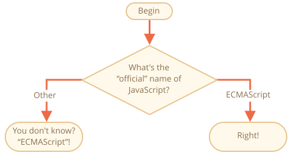

importance: 2

---

# ชื่อทางการของ JavaScript

ใช้รูปแบบ `if..else` เขียนโค้ดที่ถามว่า: 'What is the "official" name of JavaScript?'

ถ้าผู้ใช้กรอก "ECMAScript" ให้โชว์ "Right!" ถ้าไม่ใช่ — โชว์ "You don't know? ECMAScript!"

[demo src="ifelse_task2"]
