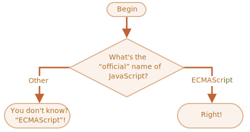

importance: 2

---

# ชื่ออันแท้จริงของ JavaScript

ใช้รูปโยค `if..else` เขียนโค้ดที่ถามว่า: 'What is the "official" name of JavaScript?'

หากผู้เยี่ยมชมป้อน "ECMAScript" ให้ส่งออกเป็น "Right!" มิฉะนั้น -- ให้ออกเป็น: "You don't know? ECMAScript!"

[demo src="ifelse_task2"]
