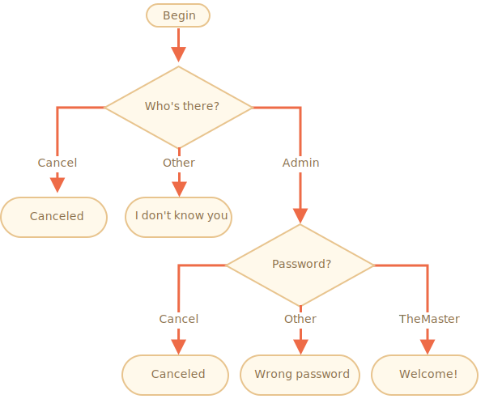

importance: 3

---

# มาเริ่มสร้างฟอร์มล็อคอินผ่าน prompt

สร้างฟอร์มล็อคอินด้วยฟังก์ชั่น `prompt`

หากผู้เยี่ยมชมป้อน `"Admin"` ให้ใช้ฟังก์ชั่น `prompt` ถามรหัสผ่าน หากป้อนสตริงว่าง หรือกด `key:Esc` ให้แสดงคำว่า "Canceled" และหากป้อนสตริงอื่นให้แสดงคำว่า "I don't know you"

กฎการตรวจสอบรหัสผ่านคือดังนี้:

- หากรหัสผ่านเท่ากับ "TheMaster" ให้แสดงคำว่า "Welcome!",
- หากไม่ใช่ให้แสดงคำว่า "Wrong password",
- หากป้อนสตริงว่าง หรือกด `key:Esc` ให้แสดงคำว่า "Canceled"

Schema:

โปรดใช้บล็อค `if` ให้คำนึงถึงความอ่านง่ายของโค้ด

คำใบ้:  หากไม่ใส่อะไรลงในช่องอินพุทมันจะส่งสตริงเปล่ากลับมา `''` หากกด `key:ESC` มันจะส่ง `null` กลับมา

[demo]
