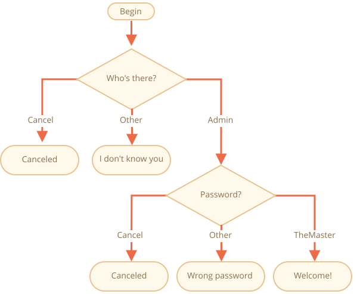

importance: 3

---

# เช็คข้อมูลล็อกอิน

เขียนโค้ดที่ใช้ `prompt` ถามข้อมูลล็อกอิน

ถ้าผู้ใช้กรอก `"Admin"` ให้ใช้ `prompt` ถามรหัสผ่านต่อ ถ้าผู้ใช้ไม่กรอกอะไรหรือกด `key:Esc` ให้แสดงข้อความ "Canceled" แต่ถ้ากรอกสตริงอื่น ให้แสดงข้อความ "I don't know you"

ตรวจรหัสผ่านตามเงื่อนไขต่อไปนี้:

- ถ้ารหัสผ่านเป็น "TheMaster" ให้แสดงข้อความ "Welcome!"
- ถ้าเป็นสตริงอื่น ให้แสดงข้อความ "Wrong password"
- ถ้าไม่กรอกอะไรหรือยกเลิก `prompt` ให้แสดงข้อความ "Canceled"

แผนภาพการทำงาน:

ให้ใช้บล็อก `if` ซ้อนกัน และจัดโค้ดให้อ่านง่าย

คำใบ้: ถ้าไม่กรอกอะไรใน `prompt` จะได้สตริงว่าง `''` แต่ถ้ากด `key:ESC` จะได้ `null`

[demo]
