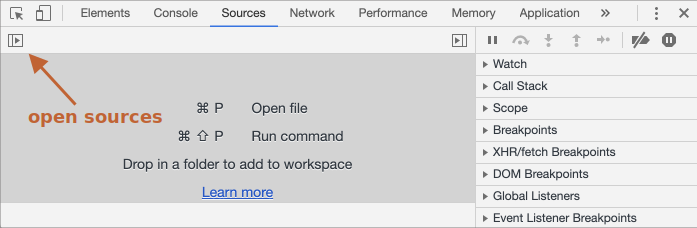
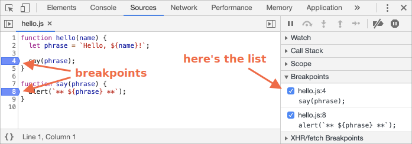

# การดีบักในเบราว์เซอร์

ก่อนเขียนโค้ดซับซ้อนกว่านี้ เรามาพูดถึงเรื่องการดีบักกันก่อน

[การดีบัก (Debugging)](https://en.wikipedia.org/wiki/Debugging) เป็นกระบวนการค้นหาและแก้ไขข้อผิดพลาดภายในสคริปต์ เบราว์เซอร์สมัยใหม่ทั้งหมดและสภาพแวดล้อมอื่นๆ ส่วนใหญ่สนับสนุนเครื่องมือดีบัก ซึ่งเป็น UI พิเศษในเครื่องมือสำหรับนักพัฒนาที่ช่วยให้การดีบักง่ายขึ้นมาก นอกจากนี้ยังช่วยให้ติดตามโค้ดทีละขั้นตอนเพื่อดูว่าเกิดอะไรขึ้น

ตัวอย่างในบทความนี้จะใช้ Chrome เนื่องจากมีฟีเจอร์ที่เพียงพอและเป็นที่นิยมในหมู่นักพัฒนา ในเบราเซอร์อื่นก็จะมีฟีเจอร์ที่การดีบักเช่นกัน

## แท็ป "Sources"

ใน Chrome แต่ละเวอร์ชันหน้าตาอาจดูแตกต่างออกไปเล็กน้อย

- เปิด[หน้าตัวอย่าง](debugging/index.html) ใน Chrome
- เปิดเครื่องมือสำหรับนักพัฒนาด้วย `key:F12` (Mac: `key:Cmd+Opt+I`)
- เลือกแท็ป `Sources`

เราจะเห็นหน้าตาแบบนี้:



ปุ่มสลับ <span class="devtools" style="background-position:-172px -98px"></span> เปิดแท็บที่มีไฟล์

คลิกเลยแล้วเลือก `hello.js` ในมุมมองต้นไม้ และเราควรจะเห็นหน้าตาแบบนี้:


แท็ป "Sources" แบ่งเป็น 3 ส่วน:

1. **File Navigator** แสดงรายการ HTML, JavaScript, CSS และไฟล์อื่นๆ รวมถึงรูปภาพที่แนบมากับเพจ ส่วนขยายของ Chrome อาจปรากฏขึ้นที่นี่เช่นกัน
2. **Code Editor** แสดงซอร์สโค้ด
3. **JavaScript Debugging** สำหรับการดีบัก เราจะมาทำความรู้จักกับส่วนนี้กัน

ตอนนี้เราสามารถคลิกปุ่มสลับเดียวกันได้ <span class="devtools" style="background-position:-172px -122px"></span> เพื่อซ่อนบางรายการและเพิ่มพื้นที่โค้ดบางส่วน

## Console

ถ้าเรากด `key:Esc` จากนั้นคอนโซลจะเปิดขึ้นด้านล่าง เราสามารถพิมพ์คำสั่งจาวาสคริปต์ลงไปได้และกด `key:Enter` เพื่อดำเนินการ

หลังจากดำเนินการคำสั่งแล้ว ผลลัพธ์จะแสดงอยู่ด้านล่าง

ตัวอย่างเช่น `1+2` ได้ผลลัพธ์เป็น `3` และ `hello("debugger")` จะไม่ส่งคืนค่าใด ในหน้าจอจะปรากฎคำว่า `undefined`:


## Breakpoints

มาลองดูว่ามีอะไรเกิดขึ้นบ้างใน[หน้าตัวอย่าง](debugging/index.html) ใน `hello.js` ให้คลิกบรรทัดที่ `4` ด้านขวาที่เป็นเลข `4` ไม่ใช่พิมพ์ `4` ลงในไปโค้ดนะ

ยินดีด้วย! ทีนี่เราก็เลือกบรรทัดสำหรับ Breakpoints ได้แล้ว ทีนี้ลองคลิกกับบรรทัดที่ `8` ดูสิ

ยังตามทันอยู่ไหม ให้ดูภาพด้านล่าง (สีน้ำเงินคือสิ่งที่เราควรคลิก):



*breakpoint* คือจุดของโค้ดที่โปรแกรมดีบักจะหยุดการทำงานของจาวาสคริปต์ชั่วคราวโดยอัตโนมัติ

ในขณะที่โค้ดถูกหยุดชั่วคราว เราสามารถตรวจสอบตัวแปรปัจจุบัน รันคำสั่งในคอนโซล ฯลฯ กล่าวอีกนัยหนึ่ง เราสามารถดีบักมันได้

เราสามารถทำ `breakpoint` ในแผงด้านขวาได้ตลอดเวลา มีประโยชน์เมื่อเรามี `breakpoint` หลายจุดในไฟล์ต่างๆ ช่วยให้เราสามารถ:
- ข้ามไปที่ `breakpoint` ได้อย่างรวดเร็วในโค้ด (โดยคลิกที่มันในแผงด้านขวา)
- ปิดใช้งานเบรกพอยต์ชั่วคราวโดย un-tick ที่ตัวเลือก
- ลบ `breakpoint` โดยคลิกขวาและเลือกลบ
- ...และอื่นๆ.

```smart header="breakpoints แบบมีเงื่อนไข"
*คลิกขวา*ที่หมายเลขบรรทัดเพื่อสร้างเบรกพอยต์ที่มี*เงื่อนไข*จะเกิดขึ้นก็ต่อเมื่อนิพจน์ที่กำหนดเป็น truthy เท่านั้น

มีประโยชน์เมื่อเราต้องหยุดเฉพาะค่าตัวแปรบางค่าหรือพารามิเตอร์ฟังก์ชัน
```

## คำสั่ง debugger

เราสามารถหยุดการทำงานของโค้ดชั่วคราวได้โดยใช้คำสั่ง `debugger` ในลักษณะนี้:

```js
function hello(name) {
  let phrase = `Hello, ${name}!`;

*!*
  debugger;  // <-- คำสั่งทั้งหมดจะหยุดที่บรรทัดนี้
*/!*

  say(phrase);
}
```

คำสั่งนี้สะดวกมากหากเรากำลังเขียนโค้ดอยู่ และไม่ต้องการสลับไปที่หน้าเบราเซอร์เพื่อกดตั้งค่า breakpoint ไปทีละบรรทัด


## หยุดเพื่อสำรวจ

ตามตัวอย่างฟังชั่นก์ `hello()` ถูกเรียกใช้ระหว่างหน้านี้โหลด ให้เรากด `key:F5` (Windows, Linux) หรือ `key:Cmd+R` (Mac) เปิดใช้งาน debugger (หลังจากที่เราตั้งค่า breakpoint แล้ว) 

เมื่อตั้งค่า breakpoint เราจะเห็นว่าการทำงานของโค้ดจะหยุดที่บรรทัดที่ 4:


ให้เปิด information dropdown ทางด้านขวา (มีลูกศรกำกับอยู่) ช่วยให้เราโค้ดปัจจุบัน:

1. **`Watch` -- แสดงค่าปัจจุบันสำหรับนิพจน์ใดๆ**

   เราสามารถคลิกเครื่องหมายบวก `+' และป้อนนิพจน์ใดๆลงไปก็ได้ ตัว debugger จะแสดงค่าของนิพจน์นั้นๆทันที โดยมันจะคำนวณใหม่ให้อัตโนมัติ

2. **`Call Stack` -- แสดงลำดับการทำงานก่อน-หลัง**

   ตอนนี้คำสั่ง `debugger` อยู่ในฟังก์ชั่น `hello()` ที่ถูกเรียกมาจาก `index.html`

   หากเราคลิกที่รายการสแต็ก (เช่น "anonymous") โปรแกรมดีบักจะพาเรามายังโค้ดที่เกี่ยวข้องกับรายการสแต็กนี้ และเราก็สามารถดูค่าของตัวแปรทั้งหมดในรายการนี้ได้ด้วยเช่นกัน
3. **`Scope` -- ตัวแปรปัจจุบัน**

    `Local` แสดงค่าของตัวแปรภายในฟังก์ชั่น

    `Global` แสดงค่าของตัวแปรภายนอกฟังก์ชั่น

   นอกจากนี้ยังมีคีย์เวิร์ด `this` ที่เราสามารถใช้แสดงค่าทั้งหมดของตัวแปรภายในและภายนอกได้ แต่เราจะพูดถึงมันอีกทีในบทเรียนหน้า

## การไล่โค้ด

ตอนนี้ได้เวลา *ไล่โค้ด* ตามสคริปต์แล้ว

มีปุ่มที่ด้านบนของแผงด้านขวา มาลองดูกัน
<!-- https://github.com/ChromeDevTools/devtools-frontend/blob/master/front_end/Images/src/largeIcons.svg -->
<span class="devtools" style="background-position:-146px -168px"></span> -- คำสั่ง "Resume": ให้โค้ดทำงานต่อ คีย์ลัด `key:F8`
: เมื่อเรากด "Resume" โค้ดจะทำงานต่อไป หากเราไม่ได้ตั้งค่า breakpoint ไว้ การทำงานจะไม่หยุดที่บรรทัดใดๆเลย ดังนั้นมันจะทำงานเหมือนปกติ

    นี่คือสิ่งที่เราเห็นหลังจากคลิก:

    

    การดำเนินการกลับมาทำงานต่อ จนถึงจุด breakpoint ในฟังก์ชั่น `say()` ดูที่ "Call Stack" ทางด้านขวา ตอนนี้เราอยู่ในฟังก์ชั่น `say()` แล้ว

<span class="devtools" style="background-position:-200px -190px"></span> -- คำสั่ง "Step": เรียกใช้คำสั่งถัดไป คีย์ลัด `key:F9`
: เรียกใช้คำสั่งถัดไป หากเราคลิก `alert` จะปรากฏขึ้น

    หากเราคลิกไปเรื่อยๆ โปรแกรมจะผ่านเราท่องไปทีละคำสั่งในสคริปต์ทีละบรรทัด

<span class="devtools" style="background-position:-62px -192px"></span> -- คำสั่ง "Step over": เรียกใช้คำสั่งถัดไป แต่ *จะไม่เข้าไปใน function* คีย์ลัด `key:F10`
: คล้ายกับคำสั่ง "Step" ก่อนหน้านี้ แต่จะทำงานแตกต่างออกไปนิดหน่อย นั่นคือหากเป็นฟังก์ชั่นที่เราสร้างเอง โปรแกรมจะพาเราเข้าไปฟังก์ชั่นนั่น ไม่ใช่ฟังก์ชั่นที่ภาษามีมาให้เช่น `alert`

    คำสั่ง "Step" จะเข้าสู่คำสั่งนั้นและหยุดการทำงานชั่วคราวที่บรรทัดแรก ขณะที่ "Step over" จะเรียกใช้ฟังก์ชันที่ซ้อนกันอย่างล่องหน โดยข้ามฟังก์ชันภที่ภาษามีมาให้ไป

    การดำเนินการจะหยุดชั่วคราวทันทีหลังจากฟังก์ชันนั้น

    หากเราไม่สนใจว่าฟังก์ชั่นนั้นทำงานอย่างไร แต่ต้องการให้โปรแกรมทำงานต่อไป ให้ใช้คำสั่ง "Step over"

<span class="devtools" style="background-position:-4px -194px"></span> -- คำสั่ง "Step into" คีย์ลัด `key:F11`.
: คล้ายกับคำสั่ง "Step" แต่ทำงานแตกต่างกันในกรณีที่มีการเรียกใช้ฟังก์ชันแบบ asynchronous หากเราเพิ่งเริ่มเรียนรู้ JavaScript แนะนำให้ข้ามเรื่องนี้กันไปก่อน เราจะยังไม่แตะต้องเรื่องนี้ในบทนี้

    ในอนาคต อย่าลืมว่าคำสั่ง "Step" จะละเว้นฟังก์ชันแบบ asynchronous เช่น `setTimeout' (การเรียกใช้ฟังก์ชันตามกำหนดเวลา) แต่คำสั่ง "Step into" จะเข้าไปฟังก์ชันนั้น และรอจนกว่าฟังก์ชั่นนั้นจะทำงานเสร็จ ดู[คู่มือ DevTools](https://developers.google.com/web/updates/2018/01/devtools#async) สำหรับรายละเอียดเพิ่มเติม

<span class="devtools" style="background-position:-32px -194px"></span> -- คำสั่ง "Step out": ดำเนินการต่อไปจนสิ้นสุดการทำงานฟังก์ชันปัจจุบัน คีย์ลัด `key:Shift+F11`.
: ดำเนินการต่อไปและหยุดที่บรรทัดสุดท้ายของฟังก์ชันปัจจุบัน มีประโยชน์เมื่อเราเรียกฟังก์ชั่นที่ซ้อนกันโดยไม่ตั้งใจโดยใช้ <span class="devtools" style="background-position:-200px -190px"></span> เราไม่ได้ต้องการเข้าไปฟังก์ชั่นนี้ เราจึงต้องการออกจากฟังก์ชั่นที่นี้ให้เร็วที่สุด

<span class="devtools" style="background-position:-61px -74px"></span> -- เปิด/ปิด breakpoints ทั้งหมด
: มีไว้สำหรับการเปิด/ปิด breakpoints ทั้งหมด

<span class="devtools" style="background-position:-90px -146px"></span> -- เปิด/ปิด การหยุดอัตโนมัติในกรณีที่เกิดข้อผิดพลาด (error)
: เมื่อเปิดใช้งาน และเครื่องมือสำหรับนักพัฒนาเปิดอยู่ ข้อผิดพลาดของสคริปต์จะหยุดการทำงานชั่วคราวโดยอัตโนมัติ จากนั้นเราสามารถวิเคราะห์ตัวแปรเพื่อดูว่ามีอะไรผิดพลาด ดังนั้นหากสคริปต์เราหยุดลงเนื่องจากข้อผิดพลาด เราสามารถเปิด debugger ขึ้นมาเพื่อดูบรรทัดที่เกิดข้อผิดพลาด ตัวแปรที่มีค่าผิดพลาด และบริบทการทำงานของสคริปต์ในขณะนั้นได้

```smart header="Continue to here"
คลิกขวาที่บรรทัดของโค้ดมันจะเปิดเมนูขึ้นมา จะเห็นว่ามีตัวเลือก "Continue to here"

ตัวเลือกนี้มีประโยชน์หากเราขี้เกียจจะกำหนด breakpoints มาทีละบรรทัด เราสามารถใช้ตัวเลือกนี้ให้โปรแกรมพาเราไปยังบรรทัดที่เราต้องการได้ โดยไม่ต้องกำหนด breakpoints ให้กับบรรทัดนั้นๆ ก่อน
```

## Logging

ในการส่งผลลัพธ์จากโค้ดของเราออกไปยังคอนโซล เราสามารถใช้ฟังก์ชัน `console.log`

ตัวอย่างเช่น เราจะส่งค่าของ `i` ไปยังคอนโซล เราจะเห็นว่าคอนโซลปริ้นท์ค่า `0` ถึง `4` ออกมา:

```js run
// ลองเปิดคอนโซลดู
for (let i = 0; i < 5; i++) {
  console.log("value,", i);
}
```

ผู้ใช้จะมองไม่เห็นคอนโซลเหล่านี้ หากผู้ใช้ไม่เปิดหน้าคอนโซลขึ้นมาดู เราสามาถเปิดหน้าคอนโซลได้โดยให้เปิดแผงคอนโซลของเครื่องมือสำหรับนักพัฒนาซอฟต์แวร์ หรือกด `key:Esc` ขณะที่อยู่ในแผงอื่น: ซึ่งจะเปิดคอนโซลที่ด้านล่าง

หากว่าเราสามารถ log ออกมาให้ถูกต้อง เราจะสามารถใช้มันเป็นเครื่องมือในการ debug ได้โดยที่ไม่ต้องอาศัย debugger เลย

## สรุป

ดังที่เราเห็น มีสามวิธีหลักในการหยุดการทำงานของสคริปต์ลงชั่วคราว:
1. ใช้ breakpoint
2. คำสั่ง `debugger`
3. เจอข้อผิดพลาด (error) (หากเปิดเครื่องนักพัฒนาขึ้นมา และปุ่มนี้ <span class="devtools" style="background-position:-90px -146px"></span> เปิดอยู่)

เมื่อการทำงานของสคริปต์หยุดลง เราสามารถดีบักและแก้ไขมันได้

ยังมีฟีเจอร์ของเครื่องมือนักพัฒนาอีกมากมายที่เรายังไม่ได้พูดถึงในบทนี้ หากสนใจสามารถไปดูคู่มือฉบับเต็มได้จากลิงค์นี้ <https://developers.google.com/web/tools/chrome-devtools>

แต่ข้อมูลที่เราพูดถึงในบทนี้ก็เพียงพอที่จะใช้ในการดีบักและแก้ไขบัคในสคริปต์ที่เราเขียนเองได้แล้ว

อ้อ เรายังสามารถคลิกที่เครื่องมือสำหรับนักพัฒนาต่างๆเพื่อดูว่ามีอะไรให้เราใช้บ้าง นั่นอาจเป็นเส้นทางที่เร็วที่สุดในการเรียนรู้เครื่องมือสำหรับนักพัฒนา แล้วก็อย่าลืมคลิกขวาเพื่อเปิดเมนูเพิ่มเติมด้วยนะ
