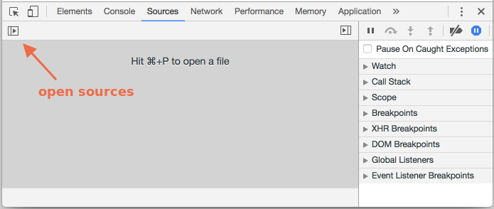
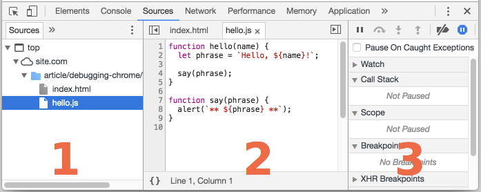
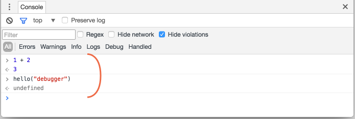
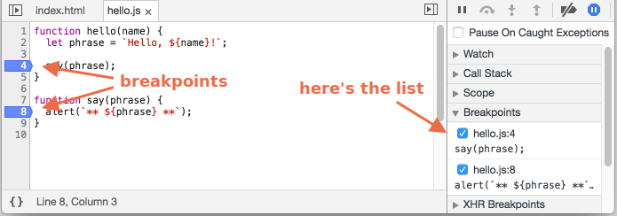
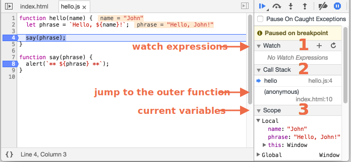
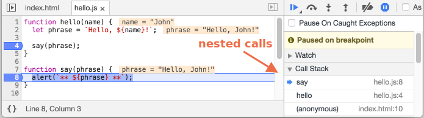

# การดีบักใน Browser

ก่อนที่จะเขียนโค้ดที่ซับซ้อนกว่านี้ มาคุยกันเรื่องการดีบักกันสักหน่อย

[Debugging](https://en.wikipedia.org/wiki/Debugging) คือกระบวนการค้นหาและแก้ไขข้อผิดพลาดในสคริปต์ เบราว์เซอร์สมัยใหม่ทุกตัวรวมถึงสภาพแวดล้อมส่วนใหญ่ต่างมีเครื่องมือสำหรับดีบักมาให้ — เป็น UI พิเศษในเครื่องมือนักพัฒนาที่ช่วยให้ดีบักง่ายขึ้นมาก แถมยังติดตามการทำงานของโค้ดได้ทีละขั้นตอน เพื่อดูว่าเกิดอะไรขึ้นกันแน่

บทความนี้จะใช้ Chrome เป็นหลัก เพราะมีฟีเจอร์ครบถ้วน ส่วนเบราว์เซอร์อื่นๆ ก็มีขั้นตอนคล้ายๆ กัน

## แผง "Sources"

Chrome เวอร์ชันที่ใช้อาจมีหน้าตาแตกต่างกันไปบ้าง แต่ก็น่าจะพอเห็นได้ชัดว่ามีอะไรอยู่ตรงไหน

- เปิด[หน้าตัวอย่าง](debugging/index.html) ใน Chrome
- เปิดเครื่องมือนักพัฒนาด้วย `key:F12` (Mac: `key:Cmd+Opt+I`)
- เลือกแผง `Sources`

ถ้าเป็นครั้งแรกที่ทำ จะเห็นหน้าตาแบบนี้:



ปุ่มสลับ <span class="devtools" style="background-position:-172px -98px"></span> จะเปิดแท็บที่แสดงรายการไฟล์

ลองคลิกแล้วเลือก `hello.js` ในมุมมองแบบต้นไม้ จะเห็นหน้าจอแบบนี้:



แผง Sources ประกอบด้วย 3 ส่วน:

1. บานหน้าต่าง **File Navigator** แสดงรายการไฟล์ HTML, JavaScript, CSS และอื่นๆ รวมถึงรูปภาพที่แนบมากับหน้าเว็บ ส่วนขยายของ Chrome ก็อาจปรากฏที่นี่เช่นกัน
2. บานหน้าต่าง **Code Editor** แสดงซอร์สโค้ด
3. บานหน้าต่าง **JavaScript Debugging** ใช้สำหรับดีบัก — เดี๋ยวเราจะมาดูกันในอีกสักครู่

ตอนนี้ลองคลิกปุ่มสลับ <span class="devtools" style="background-position:-172px -122px"></span> อีกครั้งเพื่อซ่อนรายการไฟล์และเพิ่มพื้นที่ให้โค้ดได้

## Console

ถ้ากด `key:Esc` จะมีคอนโซลเปิดขึ้นมาด้านล่าง พิมพ์คำสั่งลงไปแล้วกด `key:Enter` เพื่อรัน

พอคำสั่งทำงานเสร็จ ผลลัพธ์ก็จะแสดงอยู่ด้านล่าง

เช่น `1+2` ให้ผลลัพธ์เป็น `3` ส่วนการเรียกฟังก์ชัน `hello("debugger")` ไม่ได้คืนค่าอะไร ผลลัพธ์จึงเป็น `undefined`:



## Breakpoints

มาดูกันว่าเกิดอะไรขึ้นในโค้ดของ[หน้าตัวอย่าง](debugging/index.html)บ้าง ใน `hello.js` ให้คลิกที่เลขบรรทัด `4` — ใช่ คลิกที่ตัวเลข `4` เลย ไม่ใช่ที่โค้ด

ยินดีด้วย! ตั้ง breakpoint ได้แล้ว ลองคลิกที่เลขบรรทัด `8` ด้วยนะ

หน้าตาควรเป็นแบบนี้ (สีน้ำเงินคือตำแหน่งที่ควรคลิก):



*breakpoint* คือจุดในโค้ดที่ตัวดีบักเกอร์จะหยุดการทำงานของ JavaScript โดยอัตโนมัติ

ระหว่างที่โค้ดหยุดอยู่ เราตรวจสอบค่าตัวแปร รันคำสั่งในคอนโซล หรือทำอะไรอื่นๆ ก็ได้ — พูดง่ายๆ ก็คือ ดีบักโค้ดได้เลยตรงนั้น

รายการ breakpoint ทั้งหมดจะแสดงอยู่ที่แผงด้านขวาเสมอ ตรงนี้มีประโยชน์มากเวลามี breakpoint หลายจุดกระจายอยู่ในหลายไฟล์ เพราะช่วยให้เรา:
- กระโดดไปยัง breakpoint ในโค้ดได้ทันที (แค่คลิกที่รายการในแผงด้านขวา)
- ปิด breakpoint ชั่วคราวโดยเอาเครื่องหมายถูกออก
- ลบ breakpoint โดยคลิกขวาแล้วเลือก Remove
- ...และอื่นๆ

```smart header="Breakpoint แบบมีเงื่อนไข"
*คลิกขวา* ที่เลขบรรทัดจะสร้าง breakpoint *แบบมีเงื่อนไข* ได้ breakpoint แบบนี้จะทำงานก็ต่อเมื่อนิพจน์ที่กำหนดไว้ (ต้องใส่เองตอนสร้าง) มีค่าเป็นจริงเท่านั้น

วิธีนี้มีประโยชน์มากเวลาอยากหยุดเฉพาะตอนที่ตัวแปรบางตัว หรือพารามิเตอร์ของฟังก์ชันมีค่าตามที่ต้องการ
```

## คำสั่ง "debugger"

นอกจาก breakpoint แล้ว เรายังหยุดโค้ดได้โดยใช้คำสั่ง `debugger` ในโค้ดโดยตรง แบบนี้:

```js
function hello(name) {
  let phrase = `Hello, ${name}!`;

*!*
  debugger;  // <-- ตัวดีบักเกอร์จะหยุดที่ตรงนี้
*/!*

  say(phrase);
}
```

คำสั่งนี้จะทำงานก็ต่อเมื่อเครื่องมือนักพัฒนาเปิดอยู่เท่านั้น ไม่งั้นเบราว์เซอร์จะข้ามไปเฉยๆ

## หยุดแล้วสำรวจดูรอบๆ

ในตัวอย่างของเรา `hello()` ถูกเรียกตอนโหลดหน้าเว็บ ดังนั้นวิธีที่ง่ายที่สุดในการเปิดใช้ตัวดีบักเกอร์ (หลังตั้ง breakpoint แล้ว) ก็คือโหลดหน้าเว็บใหม่ — กด `key:F5` (Windows, Linux) หรือ `key:Cmd+R` (Mac) เลย

เนื่องจากตั้ง breakpoint ไว้แล้ว โปรแกรมจะหยุดที่บรรทัดที่ 4:



ลองเปิดดรอปดาวน์แสดงข้อมูลทางด้านขวา (ที่มีลูกศรชี้อยู่) จะได้ตรวจสอบสถานะของโค้ดในปัจจุบัน:

1. **`Watch` — แสดงค่าปัจจุบันของนิพจน์ต่างๆ**

    คลิกเครื่องหมายบวก `+` แล้วใส่นิพจน์เข้าไป ตัวดีบักเกอร์จะแสดงค่าของนิพจน์นั้น และคำนวณใหม่ให้อัตโนมัติระหว่างรันโค้ด

2. **`Call Stack` — แสดงลำดับการเรียกฟังก์ชันที่ซ้อนกัน**

    ตอนนี้ตัวดีบักเกอร์อยู่ในฟังก์ชัน `hello()` ซึ่งถูกเรียกจากสคริปต์ใน `index.html` (ไม่มีฟังก์ชันตรงนั้น จึงเรียกว่า "anonymous")

    ถ้าคลิกที่รายการใน call stack (เช่น "anonymous") ตัวดีบักเกอร์จะกระโดดไปยังโค้ดส่วนนั้น และตรวจสอบค่าตัวแปรทั้งหมดที่นั่นได้เช่นกัน
3. **`Scope` — ตัวแปรในสโคปปัจจุบัน**

    `Local` แสดงตัวแปรภายในฟังก์ชัน ค่าของตัวแปรเหล่านี้จะถูกไฮไลต์ไว้เหนือโค้ดด้วย

    `Global` แสดงตัวแปรระดับ global (ที่อยู่นอกฟังก์ชันใดๆ)

    นอกจากนี้ยังมีคีย์เวิร์ด `this` ที่เรายังไม่ได้เรียน แต่เดี๋ยวจะได้เรียนกันเร็วๆ นี้แหละ

## การติดตามการทำงานของโค้ด

ตอนนี้ถึงเวลา *ติดตาม* การทำงานของสคริปต์แล้ว

มีปุ่มสำหรับติดตามอยู่ด้านบนของแผงทางขวา มาลองใช้กัน
<!-- https://github.com/ChromeDevTools/devtools-frontend/blob/master/front_end/Images/src/largeIcons.svg -->
<span class="devtools" style="background-position:-146px -168px"></span> — "Resume": รันต่อ, ปุ่มลัด `key:F8`
: รันโค้ดต่อไป ถ้าไม่มี breakpoint เพิ่มเติม โค้ดจะรันต่อจนจบ และตัวดีบักเกอร์จะปล่อยการควบคุม

    นี่คือสิ่งที่เห็นหลังคลิกปุ่มนี้:

    

    โค้ดรันต่อไปจนถึง breakpoint อีกจุดในฟังก์ชัน `say()` แล้วหยุดอยู่ตรงนั้น ลองดูที่ "Call Stack" ทางขวา จะเห็นว่ามีการเรียกเพิ่มขึ้นมาอีกชั้น — ตอนนี้เราอยู่ในฟังก์ชัน `say()` แล้ว

<span class="devtools" style="background-position:-200px -190px"></span> — "Step": รันคำสั่งถัดไป, ปุ่มลัด `key:F9`
: รันคำสั่งถัดไป ถ้าคลิกตอนนี้ `alert` จะปรากฏขึ้น

    คลิกซ้ำๆ จะไล่ผ่านคำสั่งในสคริปต์ไปทีละบรรทัด

<span class="devtools" style="background-position:-62px -192px"></span> — "Step over": รันคำสั่งถัดไป แต่ *ไม่เข้าไปในฟังก์ชัน*, ปุ่มลัด `key:F10`
: คล้ายกับ "Step" แต่ทำงานต่างกันถ้าคำสั่งถัดไปเป็นการเรียกฟังก์ชัน (ไม่ใช่ฟังก์ชันในตัวอย่าง `alert` แต่เป็นฟังก์ชันที่เราเขียนเอง)

    ถ้าเทียบกัน — "Step" จะเข้าไปในฟังก์ชันที่เรียก แล้วหยุดที่บรรทัดแรกของฟังก์ชันนั้น ส่วน "Step over" จะรันฟังก์ชันนั้นจนจบโดยไม่แวะเข้าไปดูข้างใน

    แล้วค่อยหยุดที่บรรทัดถัดไปหลังจบการเรียกฟังก์ชัน

    เหมาะสำหรับเวลาที่ไม่สนใจว่าข้างในฟังก์ชันนั้นทำอะไร

<span class="devtools" style="background-position:-4px -194px"></span> — "Step into", ปุ่มลัด `key:F11`
: คล้ายกับ "Step" แต่ทำงานต่างกันกรณีเรียกฟังก์ชันแบบ async ถ้าเพิ่งเริ่มเรียน JavaScript ข้ามส่วนนี้ไปก่อนได้เลย เพราะยังไม่มีการเรียกแบบ async

    แค่จำไว้ว่า "Step" จะข้ามการทำงานแบบ async เช่น `setTimeout` (ฟังก์ชันที่ตั้งเวลาเรียกทีหลัง) ส่วน "Step into" จะเข้าไปในโค้ดส่วนนั้นและรอจนเสร็จถ้าจำเป็น อ่านรายละเอียดเพิ่มเติมได้ใน [คู่มือ DevTools](https://developers.google.com/web/updates/2018/01/devtools#async)

<span class="devtools" style="background-position:-32px -194px"></span> — "Step out": รันต่อจนจบฟังก์ชันปัจจุบัน, ปุ่มลัด `key:Shift+F11`
: รันโค้ดต่อไปจนถึงบรรทัดสุดท้ายของฟังก์ชันปัจจุบัน เหมาะสำหรับเวลาที่เผลอกด <span class="devtools" style="background-position:-200px -190px"></span> เข้าไปในฟังก์ชันซ้อน แต่ไม่ได้อยากดูข้างใน อยากให้จบไวๆ

<span class="devtools" style="background-position:-61px -74px"></span> — เปิด/ปิด breakpoint ทั้งหมด
: ปุ่มนี้ไม่ได้เลื่อนการทำงานของโค้ด แค่เปิด/ปิด breakpoint ทั้งหมดพร้อมกัน

<span class="devtools" style="background-position:-90px -146px"></span> — เปิด/ปิดการหยุดอัตโนมัติเมื่อเกิด error
: เมื่อเปิดไว้ ถ้าเครื่องมือนักพัฒนากำลังเปิดอยู่แล้วสคริปต์เกิด error ระหว่างรัน โค้ดจะหยุดทันที เราก็ตรวจสอบค่าตัวแปรต่างๆ ในตัวดีบักเกอร์ได้เลยว่ามีอะไรผิดปกติ ดังนั้นถ้าสคริปต์พังเพราะ error ก็แค่เปิดตัวดีบักเกอร์ เปิดตัวเลือกนี้ แล้วโหลดหน้าเว็บใหม่ — จะได้เห็นว่าโค้ดหยุดที่ตรงไหนและสถานะตอนนั้นเป็นยังไง

```smart header="ข้ามไปยังบรรทัดที่ต้องการ (Continue to here)"
คลิกขวาที่บรรทัดโค้ดจะเปิดเมนูบริบทขึ้นมา ซึ่งมีตัวเลือกที่เจ๋งมากคือ "Continue to here"

มีประโยชน์มากเวลาอยากข้ามไปหลายบรรทัดรวดเดียว แต่ขี้เกียจตั้ง breakpoint
```

## การเก็บ Log

ถ้าอยากแสดงผลบางอย่างไปที่คอนโซลจากโค้ดของเรา ก็ใช้ฟังก์ชัน `console.log` ได้

เช่น โค้ดนี้จะแสดงค่าตั้งแต่ `0` ถึง `4` ไปที่คอนโซล:

```js run
// เปิดคอนโซลเพื่อดูผลลัพธ์
for (let i = 0; i < 5; i++) {
  console.log("value,", i);
}
```

ผู้ใช้ทั่วไปจะไม่เห็นผลลัพธ์นี้เพราะแสดงอยู่ในคอนโซล ถ้าต้องการดู ให้เปิดแผง Console ในเครื่องมือนักพัฒนา หรือกด `key:Esc` ขณะอยู่ในแผงอื่น ก็จะเปิดคอนโซลขึ้นมาด้านล่าง

ถ้าใส่ log ไว้ในโค้ดมากพอ ก็จะติดตามได้ว่าเกิดอะไรขึ้นจากข้อมูลที่บันทึกไว้ โดยไม่ต้องใช้ตัวดีบักเกอร์เลย

## สรุป

จะเห็นว่ามีสามวิธีหลักๆ ในการหยุดสคริปต์:
1. Breakpoint
2. คำสั่ง `debugger`
3. Error (ถ้าเครื่องมือนักพัฒนาเปิดอยู่และปุ่ม <span class="devtools" style="background-position:-90px -146px"></span> อยู่ในสถานะ "เปิด")

เมื่อโค้ดหยุดแล้ว เราก็ดีบักได้ — ตรวจสอบค่าตัวแปรและติดตามการทำงานของโค้ดเพื่อหาจุดที่ผิดพลาด

เครื่องมือนักพัฒนายังมีตัวเลือกอีกมากมายนอกเหนือจากที่กล่าวมา อ่านคู่มือฉบับเต็มได้ที่ <https://developers.google.com/web/tools/chrome-devtools>

เนื้อหาในบทนี้เพียงพอสำหรับเริ่มต้นดีบักแล้ว แต่ถ้าต้องทำงานกับเบราว์เซอร์บ่อยๆ แนะนำให้ไปศึกษาความสามารถขั้นสูงของเครื่องมือนักพัฒนาเพิ่มเติม

อ้อ แล้วก็ลองคลิกไปตามส่วนต่างๆ ของเครื่องมือนักพัฒนาแล้วสังเกตดูว่ามีอะไรบ้าง นี่น่าจะเป็นวิธีที่เร็วที่สุดในการเรียนรู้การใช้งาน อย่าลืมลองคลิกขวาเพื่อเปิดเมนูบริบทด้วยนะ!
