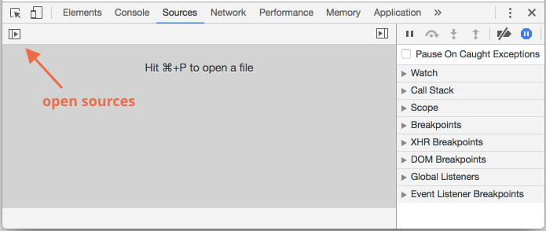
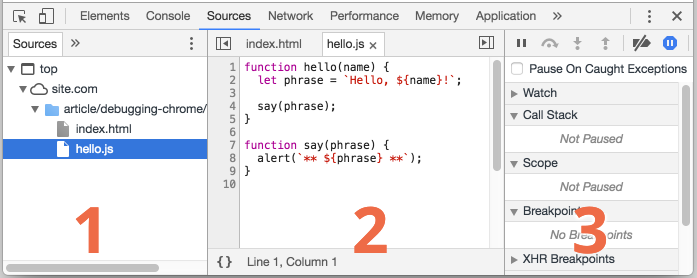
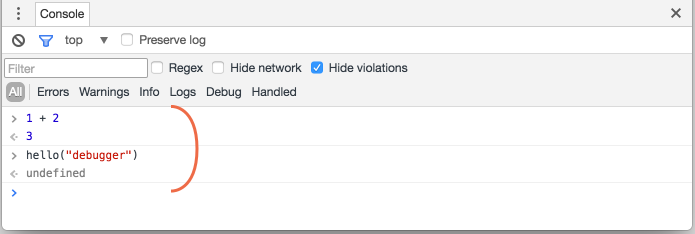
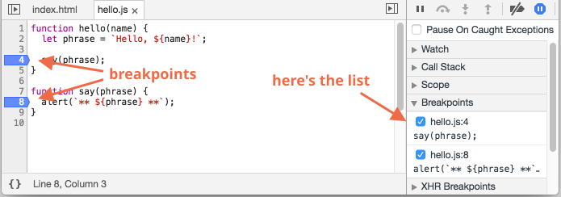
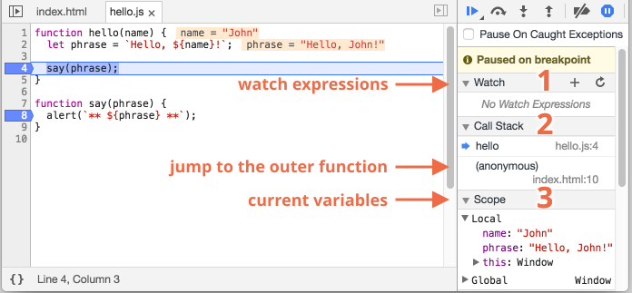
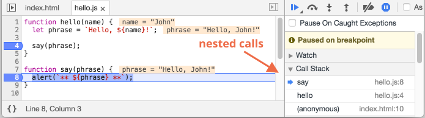

# การดีบักใน Browser

ก่อนเขียนโค้ดที่ซับซ้อนกว่านี้ มาคุยเรื่องดีบักกันก่อนดีกว่า

[Debugging](https://en.wikipedia.org/wiki/Debugging) หรือการ "ดีบัก" พูดง่ายๆ ก็คือการหา bug ในสคริปต์แล้วแก้ — เบราว์เซอร์สมัยใหม่ทุกตัว (และสภาพแวดล้อมอื่นๆ) มีเครื่องมือดีบักมาให้อยู่แล้ว เป็น UI พิเศษในเครื่องมือนักพัฒนาที่ช่วยให้ดีบักง่ายขึ้นมาก แถมยังไล่การทำงานของโค้ดทีละบรรทัดได้ด้วย เพื่อดูว่าเกิดอะไรขึ้นกันแน่

บทความนี้เราจะใช้ Chrome เป็นหลัก เพราะมีฟีเจอร์ครบที่สุด ส่วนเบราว์เซอร์อื่นๆ หน้าตากับขั้นตอนก็คล้ายๆ กัน

## แผง "Sources"

Chrome แต่ละเวอร์ชันหน้าตาอาจจะต่างกันบ้าง แต่น่าจะพอเดาได้ว่าอะไรอยู่ตรงไหน

- เปิด[หน้าตัวอย่าง](debugging/index.html) ใน Chrome
- เปิดเครื่องมือนักพัฒนาด้วย `key:F12` (Mac: `key:Cmd+Opt+I`)
- เลือกแผง `Sources`

ถ้าเพิ่งเปิดครั้งแรก หน้าตาจะประมาณนี้:



ปุ่มสลับ <span class="devtools" style="background-position:-172px -98px"></span> จะเปิดแท็บที่มีรายการไฟล์ขึ้นมา

ลองคลิกแล้วเลือก `hello.js` ในมุมมองแบบต้นไม้ หน้าจอจะออกมาแบบนี้:



แผง Sources มี 3 ส่วนด้วยกัน:

1. บานหน้าต่าง **File Navigator** โชว์รายการไฟล์ HTML, JavaScript, CSS และไฟล์อื่นๆ รวมถึงรูปภาพที่แนบมากับหน้าเว็บ ส่วนขยายของ Chrome ก็อาจโผล่มาตรงนี้ด้วย
2. บานหน้าต่าง **Code Editor** โชว์ซอร์สโค้ด
3. บานหน้าต่าง **JavaScript Debugging** ใช้สำหรับดีบัก เดี๋ยวเราจะไปดูกันในอีกสักครู่

ลองคลิกปุ่มสลับ <span class="devtools" style="background-position:-172px -122px"></span> อีกทีเพื่อซ่อนรายการไฟล์ จะได้มีพื้นที่ให้โค้ดเยอะขึ้น

## Console

ลองกด `key:Esc` ดู — จะมีคอนโซลโผล่ขึ้นมาด้านล่าง พิมพ์คำสั่งใส่แล้วกด `key:Enter` เพื่อรัน

พอคำสั่งทำงานเสร็จ ผลลัพธ์จะโชว์อยู่ข้างล่างนั่นเอง

เช่น `1+2` ได้ผลลัพธ์เป็น `3` ส่วน `hello("debugger")` ไม่ได้คืนค่าอะไร ผลลัพธ์จึงเป็น `undefined`:



## Breakpoints

มาดูกันว่าเกิดอะไรขึ้นในโค้ดของ[หน้าตัวอย่าง](debugging/index.html)บ้าง ใน `hello.js` ให้คลิกที่เลขบรรทัด `4` — ใช่แล้ว คลิกที่ตัวเลข `4` เลย ไม่ใช่ที่โค้ด

ยินดีด้วย! ตั้ง breakpoint สำเร็จ ลองคลิกที่เลขบรรทัด `8` อีกจุดด้วย

หน้าตาควรออกมาแบบนี้ (สีน้ำเงินคือตำแหน่งที่ควรคลิก):



แล้ว *breakpoint* คืออะไรล่ะ? ก็คือจุดในโค้ดที่บอกให้ดีบักเกอร์หยุดการทำงานของ JavaScript ไว้ก่อนโดยอัตโนมัติ

พอโค้ดหยุด เราจะเช็คค่าตัวแปร รันคำสั่งในคอนโซล หรือทำอะไรก็ได้ตรงนั้น — พูดง่ายๆ ก็คือ ดีบักโค้ดได้เต็มๆ

รายการ breakpoint ทั้งหมดจะอยู่ที่แผงด้านขวาเสมอ มีประโยชน์มากเวลามี breakpoint หลายจุดกระจายอยู่ในหลายไฟล์ เพราะช่วยให้:
- กระโดดไปยัง breakpoint ได้ทันที (แค่คลิกที่รายการในแผงด้านขวา)
- ปิด breakpoint ชั่วคราว (เอาเครื่องหมายถูกออก)
- ลบ breakpoint (คลิกขวาแล้วเลือก Remove)
- ...และอื่นๆ อีก

```smart header="Breakpoint แบบมีเงื่อนไข"
ลอง *คลิกขวา* ที่เลขบรรทัดดู — จะสร้าง breakpoint *แบบมีเงื่อนไข* ได้ breakpoint แบบนี้จะทำงานเฉพาะตอนที่นิพจน์ที่เรากำหนดไว้ (ต้องใส่เองตอนสร้าง) เป็นจริงเท่านั้น

สะดวกมากเวลาอยากหยุดแค่ตอนที่ตัวแปรบางตัว หรือพารามิเตอร์ของฟังก์ชันมีค่าตรงตามที่ต้องการ
```

## คำสั่ง "debugger"

อีกวิธีหนึ่ง — หยุดโค้ดได้โดยใช้คำสั่ง `debugger` ในโค้ดโดยตรง แบบนี้:

```js
function hello(name) {
  let phrase = `Hello, ${name}!`;

*!*
  debugger;  // <-- ตัวดีบักเกอร์จะหยุดที่ตรงนี้
*/!*

  say(phrase);
}
```

คำสั่งนี้จะทำงานเฉพาะตอนที่เครื่องมือนักพัฒนาเปิดอยู่เท่านั้น ไม่งั้นเบราว์เซอร์จะข้ามไปเฉยๆ

## หยุดแล้วสำรวจดูรอบๆ

ในตัวอย่างของเรา `hello()` จะทำงานตอนโหลดหน้าเว็บพอดี วิธีง่ายที่สุดที่จะเปิดใช้ดีบักเกอร์ (หลังตั้ง breakpoint แล้ว) ก็คือโหลดหน้าเว็บใหม่ — กด `key:F5` (Windows, Linux) หรือ `key:Cmd+R` (Mac) ได้เลย

เราตั้ง breakpoint ไว้แล้ว โค้ดก็จะหยุดที่บรรทัดที่ 4:



ลองเปิดดรอปดาวน์แสดงข้อมูลทางด้านขวา (ที่มีลูกศรชี้อยู่) จะได้เช็คสถานะของโค้ดตอนนั้น:

1. **`Watch` — โชว์ค่าปัจจุบันของนิพจน์ต่างๆ**

    คลิกเครื่องหมายบวก `+` แล้วใส่นิพจน์เข้าไป ดีบักเกอร์จะโชว์ค่าของนิพจน์นั้นให้ และคำนวณใหม่ให้อัตโนมัติระหว่างรันโค้ด

2. **`Call Stack` — ลำดับการเรียกฟังก์ชันที่ซ้อนกัน**

    ตอนนี้ดีบักเกอร์อยู่ในฟังก์ชัน `hello()` ซึ่งเรียกจากสคริปต์ใน `index.html` (ไม่มีฟังก์ชันตรงนั้น เลยเรียกว่า "anonymous")

    ลองคลิกที่รายการใน call stack (เช่น "anonymous") ดูสิ — ดีบักเกอร์จะกระโดดไปยังโค้ดส่วนนั้น แล้วเช็คค่าตัวแปรทั้งหมดที่นั่นได้เช่นกัน
3. **`Scope` — ตัวแปรในสโคปปัจจุบัน**

    `Local` โชว์ตัวแปรภายในฟังก์ชัน ค่าของตัวแปรเหล่านี้จะถูกไฮไลต์ไว้เหนือโค้ดด้วย

    `Global` โชว์ตัวแปรระดับ global (ที่อยู่นอกฟังก์ชันใดๆ)

    แถมยังมีคีย์เวิร์ด `this` ที่เรายังไม่ได้เรียน แต่เดี๋ยวได้เจอกันเร็วๆ นี้แน่

## การติดตามการทำงานของโค้ด

ทีนี้ ถึงเวลา *ไล่ดู* การทำงานของสคริปต์กันแล้ว

ปุ่มสำหรับไล่ดูอยู่ด้านบนของแผงทางขวา มาลองกันเลย
<!-- https://github.com/ChromeDevTools/devtools-frontend/blob/master/front_end/Images/src/largeIcons.svg -->
<span class="devtools" style="background-position:-146px -168px"></span> — "Resume": รันต่อ, ปุ่มลัด `key:F8`
: รันโค้ดต่อ ถ้าไม่มี breakpoint เพิ่มเติม โค้ดจะรันจนจบ แล้วดีบักเกอร์ปล่อยการควบคุม

    นี่คือสิ่งที่เห็นหลังคลิกปุ่มนี้:

    

    โค้ดรันต่อไปจนถึง breakpoint อีกจุดในฟังก์ชัน `say()` แล้วหยุดตรงนั้น ลองดูที่ "Call Stack" ทางขวา จะเห็นว่ามีการเรียกเพิ่มขึ้นมาอีกชั้น — ตอนนี้อยู่ในฟังก์ชัน `say()` แล้ว

<span class="devtools" style="background-position:-200px -190px"></span> — "Step": รันคำสั่งถัดไป, ปุ่มลัด `key:F9`
: รันคำสั่งถัดไป ถ้าคลิกตอนนี้ `alert` จะโผล่ขึ้นมา

    คลิกซ้ำๆ จะไล่ผ่านคำสั่งในสคริปต์ไปทีละบรรทัด

<span class="devtools" style="background-position:-62px -192px"></span> — "Step over": รันคำสั่งถัดไป แต่ *ไม่เข้าไปในฟังก์ชัน*, ปุ่มลัด `key:F10`
: คล้ายกับ "Step" แต่ทำงานต่างกันถ้าคำสั่งถัดไปเป็นการเรียกฟังก์ชัน (ไม่ใช่ฟังก์ชันในตัวอย่าง `alert` แต่เป็นฟังก์ชันที่เราเขียนเอง)

    เทียบกันดู — "Step" จะเข้าไปในฟังก์ชันที่เรียก แล้วหยุดที่บรรทัดแรก ส่วน "Step over" จะรันฟังก์ชันนั้นจนจบโดยไม่แวะเข้าไปดูข้างใน

    แล้วค่อยหยุดที่บรรทัดถัดไปหลังจบการเรียก

    เหมาะสำหรับเวลาที่ไม่สนใจว่าข้างในฟังก์ชันนั้นทำอะไร

<span class="devtools" style="background-position:-4px -194px"></span> — "Step into", ปุ่มลัด `key:F11`
: คล้ายกับ "Step" แต่ทำงานต่างออกไปในกรณีเรียกฟังก์ชันแบบ async ถ้าเพิ่งเริ่มเรียน JavaScript ข้ามส่วนนี้ไปก่อนได้เลย เพราะยังไม่เจอการเรียกแบบ async

    แค่จำไว้ว่า "Step" จะข้ามการทำงานแบบ async เช่น `setTimeout` (ฟังก์ชันที่ตั้งเวลาเรียกทีหลัง) ส่วน "Step into" จะเข้าไปในโค้ดส่วนนั้นและรอจนเสร็จถ้าจำเป็น อ่านรายละเอียดเพิ่มเติมได้ใน [คู่มือ DevTools](https://developers.google.com/web/updates/2018/01/devtools#async)

<span class="devtools" style="background-position:-32px -194px"></span> — "Step out": รันต่อจนจบฟังก์ชันปัจจุบัน, ปุ่มลัด `key:Shift+F11`
: รันโค้ดต่อไปจนถึงบรรทัดสุดท้ายของฟังก์ชันปัจจุบัน เหมาะสำหรับเวลาเผลอกด <span class="devtools" style="background-position:-200px -190px"></span> เข้าไปในฟังก์ชันซ้อน แต่ไม่อยากดูข้างใน อยากให้จบไวๆ

<span class="devtools" style="background-position:-61px -74px"></span> — เปิด/ปิด breakpoint ทั้งหมด
: ปุ่มนี้ไม่ได้เลื่อนการทำงานของโค้ด แค่เปิด/ปิด breakpoint ทั้งหมดพร้อมกัน

<span class="devtools" style="background-position:-90px -146px"></span> — เปิด/ปิดการหยุดอัตโนมัติเมื่อเกิด error
: ถ้าเปิดไว้ พอสคริปต์เกิด error ระหว่างรัน (ตอนเครื่องมือนักพัฒนาเปิดอยู่) โค้ดจะหยุดทันที แล้วเราก็เช็คค่าตัวแปรต่างๆ ในดีบักเกอร์ได้เลยว่ามีอะไรผิดปกติ — เพราะงั้นถ้าสคริปต์พังเพราะ error ก็แค่เปิดดีบักเกอร์ เปิดตัวเลือกนี้ แล้วโหลดหน้าเว็บใหม่ จะได้เห็นว่าโค้ดหยุดตรงไหนและสถานะตอนนั้นเป็นยังไง

```smart header="ข้ามไปยังบรรทัดที่ต้องการ (Continue to here)"
คลิกขวาที่บรรทัดโค้ดจะเปิดเมนูบริบทขึ้นมา มีตัวเลือกที่เจ๋งมากคือ "Continue to here"

สะดวกเวลาอยากข้ามไปหลายบรรทัดรวดเดียว แต่ขี้เกียจตั้ง breakpoint
```

## การเก็บ Log

อยากโชว์อะไรบางอย่างไปที่คอนโซลจากโค้ดของเรา ใช้ฟังก์ชัน `console.log` ได้เลย

เช่น โค้ดนี้จะพิมพ์ค่าตั้งแต่ `0` ถึง `4` ไปที่คอนโซล:

```js run
// เปิดคอนโซลเพื่อดูผลลัพธ์
for (let i = 0; i < 5; i++) {
  console.log("value,", i);
}
```

ผู้ใช้ทั่วไปจะไม่เห็นผลลัพธ์นี้ เพราะอยู่ในคอนโซล ถ้าอยากดูก็เปิดแผง Console ในเครื่องมือนักพัฒนา หรือกด `key:Esc` ตอนอยู่ในแผงอื่น — คอนโซลจะโผล่ขึ้นมาด้านล่าง

ถ้าใส่ log ไว้ในโค้ดเยอะพอ ก็ไล่ดูจาก log ได้เลยว่าเกิดอะไรขึ้น ไม่ต้องใช้ดีบักเกอร์ก็ได้

## สรุป

จะเห็นว่ามี 3 วิธีหลักๆ ในการหยุดสคริปต์:
1. Breakpoint
2. คำสั่ง `debugger`
3. Error (ถ้าเครื่องมือนักพัฒนาเปิดอยู่และปุ่ม <span class="devtools" style="background-position:-90px -146px"></span> อยู่ในสถานะ "เปิด")

พอโค้ดหยุดแล้ว เราก็ดีบักได้ — เช็คค่าตัวแปรและไล่ดูการทำงานของโค้ดเพื่อหาจุดที่พัง

เครื่องมือนักพัฒนายังมีตัวเลือกอีกเยอะมาก อ่านคู่มือฉบับเต็มได้ที่ <https://developers.google.com/web/tools/chrome-devtools>

เนื้อหาในบทนี้พอสำหรับเริ่มต้นดีบักแล้ว แต่ถ้าต้องทำงานกับเบราว์เซอร์บ่อยๆ ก็ลองไปศึกษาความสามารถขั้นสูงของเครื่องมือนักพัฒนาเพิ่มเติมได้

อ้อ แล้วก็ลองคลิกไปตามส่วนต่างๆ ของเครื่องมือนักพัฒนาแล้วสังเกตดูว่ามีอะไรบ้าง — น่าจะเป็นวิธีที่เร็วที่สุดในการเรียนรู้การใช้งาน อย่าลืมลองคลิกขวาเพื่อเปิดเมนูบริบทดูด้วยนะ!
