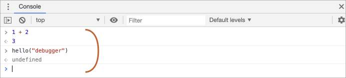

# การดีบั๊กในเบราว์เซอร์

ก่อนที่เราจะเขียนโค้ดที่ซับซ้อนมากขึ้น มาคุยกันเรื่องการดีบั๊กกันก่อน

[การดีบั๊ก](https://en.wikipedia.org/wiki/Debugging) คือกระบวนการค้นหาและแก้ไขข้อผิดพลาดในสคริปต์ เบราว์เซอร์สมัยใหม่ทั้งหมดและสภาพแวดล้อมส่วนใหญ่รองรับเครื่องมือดีบั๊ก -- UI พิเศษในเครื่องมือนักพัฒนาที่ทำให้การดีบั๊กง่ายขึ้นมาก นอกจากนี้ยังอนุญาตให้ติดตามโค้ดทีละขั้นตอนเพื่อดูว่ากำลังเกิดอะไรขึ้นอย่างแน่ชัด

เราจะใช้ Chrome ที่นี่ เพราะมันมีฟีเจอร์เพียงพอ เบราว์เซอร์อื่นๆ ส่วนใหญ่มีขั้นตอนที่คล้ายกัน

## แผงควบคุม "Sources"

Chrome ของคุณอาจดูแตกต่างไปเล็กน้อย แต่ก็ยังควรจะเห็นได้ชัดว่ามีอะไรอยู่ในนั้น

- เปิด [หน้าตัวอย่าง](debugging/index.html) ใน Chrome
- เปิดเครื่องมือนักพัฒนาด้วย `key:F12` (Mac: `key:Cmd+Opt+I`)
- เลือกแผงควบคุม `Sources`

นี่คือสิ่งที่คุณควรเห็นหากคุณทำเป็นครั้งแรก:


ปุ่ม toggler <span class="devtools" style="background-position:-172px -98px"></span> จะเปิดแท็บที่มีไฟล์ต่างๆ

เราลองคลิกมันและเลือก `hello.js` ในมุมมองแบบ tree นี่คือสิ่งที่ควรจะปรากฏขึ้น:


แผงควบคุม Sources มี 3 ส่วน:

1. บานหน้าต่าง **File Navigator** จะแสดงไฟล์ HTML, JavaScript, CSS และไฟล์อื่นๆ รวมถึงรูปภาพที่แนบมากับหน้าเว็บ ส่วนขยายของ Chrome อาจปรากฏที่นี่ด้วย
2. บานหน้าต่าง **Code Editor** จะแสดงโค้ดต้นฉบับ
3. บานหน้าต่าง **JavaScript Debugging** ใช้สำหรับดีบั๊ก เราจะสำรวจมันเร็วๆ นี้

ตอนนี้คุณสามารถคลิกที่ปุ่ม toggler <span class="devtools" style="background-position:-172px -122px"></span> อีกครั้งเพื่อซ่อนรายการทรัพยากรและเว้นช่องให้โค้ดบ้าง

## คอนโซล

ถ้าเรากด `key:Esc` คอนโซลจะเปิดขึ้นด้านล่าง เราสามารถพิมพ์คำสั่งลงไปและกด `key:Enter` เพื่อรันคำสั่ง

หลังจากประโยคคำสั่งรัน ผลลัพธ์จะแสดงอยู่ข้างล่าง

ตัวอย่างเช่น `1+2` จะได้ผลลัพธ์เป็น `3` ในขณะที่การเรียกฟังก์ชัน `hello("debugger")` จะไม่คืนค่าอะไร ดังนั้นผลลัพธ์จะเป็น `undefined`:



## Breakpoints

มาดูกันว่ามีอะไรเกิดขึ้นในโค้ดของ[หน้าตัวอย่าง](debugging/index.html) ใน `hello.js` ให้คลิกที่หมายเลขบรรทัด `4` ใช่ คลิกบนตัวเลข `4` เลย ไม่ใช่บนโค้ด

ยินดีด้วย! คุณได้ตั้ง breakpoint แล้ว โปรดคลิกที่หมายเลขบรรทัด `8` ด้วย

มันควรจะดูเหมือนแบบนี้ (สีน้ำเงินคือตรงที่คุณควรคลิก):


*Breakpoint* คือจุดในโค้ดที่ debugger จะหยุดการทำงานของ JavaScript โดยอัตโนมัติ

ในขณะที่โค้ดหยุดทำงาน เราสามารถตรวจสอบตัวแปรปัจจุบัน รันคำสั่งในคอนโซล ฯลฯ หรือพูดอีกอย่างคือ เราสามารถดีบั๊กได้

เราสามารถหารายการ breakpoint ได้ในแผงควบคุมด้านขวาเสมอ นั่นมีประโยชน์เมื่อเรามี breakpoint หลายจุดในหลายไฟล์ มันช่วยให้เรา:
- กระโดดไปยัง breakpoint ในโค้ดได้อย่างรวดเร็ว (โดยคลิกบน breakpoint ในแผงควบคุมด้านขวา)
- ปิดการใช้งาน breakpoint ชั่วคราวโดยยกเลิกการทำเครื่องหมาย
- ลบ breakpoint โดยคลิกขวาแล้วเลือก Remove
- ...และอื่นๆ

```smart header="Conditional breakpoints"
การคลิก*ขวา* ที่หมายเลขบรรทัดช่วยให้คุณสร้าง *conditional* breakpoint ได้ มันจะทำงานก็ต่อเมื่อนิพจน์ที่คุณกำหนดเป็น truthy เท่านั้น

นั่นมีประโยชน์เมื่อเราต้องการหยุดโค้ดเฉพาะสำหรับค่าตัวแปรบางค่าหรือสำหรับพารามิเตอร์ของฟังก์ชันบางอย่าง
```

## คำสั่ง "debugger"

เราสามารถหยุดโค้ดได้โดยใช้คำสั่ง `debugger` ในโค้ดได้ด้วย แบบนี้:

```js
function hello(name) {
  let phrase = `Hello, ${name}!`;

*!*
  debugger;  // <-- debugger จะหยุดที่นี่
*/!*

  say(phrase);
}
```

คำสั่งดังกล่าวจะทำงานก็ต่อเมื่อเครื่องมือนักพัฒนาถูกเปิดอยู่เท่านั้น ไม่เช่นนั้นเบราว์เซอร์จะไม่สนใจมัน

## หยุดและดูรอบๆ

ในตัวอย่างของเรา `hello()` ถูกเรียกระหว่างการโหลดหน้าเว็บ ดังนั้นวิธีที่ง่ายที่สุดในการเปิดใช้งาน debugger (หลังจากที่เราตั้ง breakpoint แล้ว) คือรีโหลดหน้าเว็บ ดังนั้นให้กด `key:F5` (Windows, Linux) หรือ `key:Cmd+R` (Mac)

เนื่องจากตั้ง breakpoint ไว้แล้ว การทำงานจะหยุดที่บรรทัดที่ 4:


โปรดเปิดเมนูแบบเลื่อนลงที่มีข้อมูลทางด้านขวา (ที่มีลูกศร) มันจะช่วยให้คุณตรวจสอบสถานะโค้ดปัจจุบัน:

1. **`Watch` -- แสดงค่าปัจจุบันสำหรับนิพจน์ใดๆ**

    คุณสามารถคลิกเครื่องหมายบวก `+` และใส่นิพจน์ได้ debugger จะแสดงค่าของนิพจน์นั้นโดยคำนวณใหม่โดยอัตโนมัติระหว่างการทำงาน

2. **`Call Stack` -- แสดงลำดับการเรียกซ้อนกัน** 

    ในขณะนี้ debugger อยู่ในการเรียกฟังก์ชัน `hello()` ซึ่งถูกเรียกโดยสคริปต์ใน `index.html` (ไม่มีฟังก์ชันที่นั่น ดังนั้นจึงเรียกว่า "anonymous")

    หากคุณคลิกที่รายการในสแตก (เช่น "anonymous") debugger จะกระโดดไปยังโค้ดที่สอดคล้องกัน และตัวแปรทั้งหมดก็สามารถตรวจสอบได้เช่นกัน

3. **`Scope` -- ตัวแปรปัจจุบัน**

    `Local` แสดงตัวแปรในฟังก์ชันที่กำลังทำงาน คุณยังสามารถดูค่าของตัวแปรที่ถูกเน้นอยู่ข้างบนโค้ดได้

    `Global` มีตัวแปรระดับโกลบอล (นอกฟังก์ชัน)

    ยังมีคีย์เวิร์ด `this` ที่เรายังไม่ได้ศึกษา แต่เราจะทำในเร็วๆ นี้

## ติดตามการทำงาน

ตอนนี้ถึงเวลา *ติดตาม* การทำงานของสคริปต์แล้ว

มีปุ่มสำหรับการติดตามอยู่ที่ด้านบนของแผงควบคุมด้านขวา มาใช้งานมันกัน
<!-- https://github.com/ChromeDevTools/devtools-frontend/blob/master/front_end/Images/src/largeIcons.svg -->
<span class="devtools" style="background-position:-146px -168px"></span> -- "Resume": ดำเนินการต่อ, คีย์ลัด `key:F8`
: ดำเนินการทำงานต่อไป ถ้าไม่มี breakpoint เพิ่มเติม การทำงานก็จะดำเนินต่อไป และ debugger จะไม่มีการควบคุม

    นี่คือสิ่งที่เราจะเห็นหลังจากคลิกปุ่มนี้:

    

    การทำงานได้ดำเนินต่อไป ไปถึง breakpoint อื่นใน `say()` และหยุดการทำงานที่นั่น ดู "Call Stack" ที่ด้านขวา มันเพิ่มขึ้นอีกหนึ่งการเรียก ตอนนี้เราอยู่ใน `say()` แล้ว

<span class="devtools" style="background-position:-200px -190px"></span> -- "Step": รันคำสั่งถัดไป, คีย์ลัด `key:F9`
: รันคำสั่งถัดไป ถ้าเราคลิกตอนนี้ `alert` จะแสดงออกมา

    คลิกตรงนี้อีกครั้งแล้วอีกครั้ง จะทำให้สามารถติดตามคำสั่งในสคริปต์ทีละคำสั่งได้

<span class="devtools" style="background-position:-62px -192px"></span> -- "Step over": รันคำสั่งถัดไป แต่*ไม่ต้องเข้าไปในฟังก์ชัน*, คีย์ลัด `key:F10`
: คล้ายกับปุ่ม "Step" ก่อนหน้า แต่จะมีพฤติกรรมแตกต่างกันหากคำสั่งถัดไปเป็นการเรียกฟังก์ชัน (ไม่ใช่ฟังก์ชันในตัว เช่น `alert` แต่เป็นฟังก์ชันที่เราสร้างเอง)

    หากเราเปรียบเทียบกัน คำสั่ง "Step" จะเข้าไปในฟังก์ชันที่ถูกเรียกซ้อนและหยุดการทำงานที่บรรทัดแรก ในขณะที่ "Step over" จะรันฟังก์ชันที่ถูกเรียกซ้อนโดยที่เราไม่เห็น โดยข้ามส่วนภายในฟังก์ชันไป

    การทำงานจะหยุดทันทีหลังจากการเรียกฟังก์ชันนั้น

    นั่นเป็นเรื่องดีถ้าเราไม่สนใจที่จะดูว่าเกิดอะไรขึ้นภายในการเรียกฟังก์ชัน

<span class="devtools" style="background-position:-4px -194px"></span> -- "Step into", คีย์ลัด `key:F11`
: คล้ายกับ "Step" แต่จะมีพฤติกรรมแตกต่างกันในกรณีของการเรียกฟังก์ชันแบบ asynchronous ถ้าคุณเพิ่งเริ่มเรียน JavaScript คุณสามารถละเลยความแตกต่างได้ เพราะเรายังไม่มีการเรียกแบบ asynchronous

    ในอนาคต โปรดจำไว้ว่าคำสั่ง "Step" จะเพิกเฉยต่อ async action เช่น `setTimeout` (การเรียกฟังก์ชันที่ถูกกำหนดเวลา) ซึ่งจะรันทีหลัง ส่วน "Step into" จะเข้าไปในโค้ดของ async action และรอถ้าจำเป็น ดูรายละเอียดเพิ่มเติมได้ใน [คู่มือ DevTools](https://developers.google.com/web/updates/2018/01/devtools#async)

<span class="devtools" style="background-position:-32px -194px"></span> -- "Step out": ดำเนินการทำงานต่อจนถึงบรรทัดสุดท้ายของฟังก์ชันปัจจุบัน, คีย์ลัด `key:Shift+F11`
: ดำเนินการทำงานต่อและหยุดที่บรรทัดสุดท้ายของฟังก์ชันปัจจุบัน นั่นมีประโยชน์เมื่อเราเข้าไปในการเรียกฟังก์ชันซ้อนโดยไม่ตั้งใจโดยใช้ <span class="devtools" style="background-position:-200px -190px"></span> แต่เราไม่สนใจมัน และเราต้องการดำเนินต่อจนถึงจุดจบของมันให้เร็วที่สุด

<span class="devtools" style="background-position:-61px -74px"></span> -- เปิด/ปิดใช้งาน breakpoint ทั้งหมด
: ปุ่มนี้ไม่ได้เลื่อนการทำงาน แค่เปิด/ปิดใช้งาน breakpoint ทั้งหมด

<span class="devtools" style="background-position:-90px -146px"></span> -- เปิด/ปิดการหยุดอัตโนมัติเมื่อมีข้อผิดพลาด
: เมื่อเปิดใช้งาน หากเครื่องมือนักพัฒนาถูกเปิดอยู่ ข้อผิดพลาดระหว่างการรันสคริปต์จะหยุดโดยอัตโนมัติ แล้วเราสามารถวิเคราะห์ตัวแปรใน debugger เพื่อดูว่าอะไรผิดพลาด ดังนั้นหากสคริปต์ของเราล้มเหลวด้วยข้อผิดพลาด เราสามารถเปิด debugger เปิดใช้งานตัวเลือกนี้ และรีโหลดหน้าเว็บเพื่อดูว่ามันล้มเหลวที่ไหนและบริบทในขณะนั้นเป็นอย่างไร

```smart header="ดำเนินไปที่นี่"
คลิกขวาบนบรรทัดโค้ด จะเปิดเมนูบริบทที่มีตัวเลือกที่ดีเรียกว่า "Continue to here"

นั่นมีประโยชน์เมื่อเราต้องการเลื่อนหลายขั้นตอนไปยังบรรทัดนั้น แต่เรายังขี้เกียจตั้ง breakpoint
```

## Logging

เพื่อแสดงผลบางอย่างไปที่คอนโซลจากโค้ดของเรา มีฟังก์ชัน `console.log`

ตัวอย่างเช่น นี่จะแสดงค่าจาก `0` ถึง `4` ในคอนโซล:

```js run
// เปิดคอนโซลเพื่อดู
for (let i = 0; i < 5; i++) {
  console.log("ค่า,", i);
}
```

ผู้ใช้ทั่วไปจะไม่เห็นเอาต์พุตนี้ มันจะอยู่ในคอนโซล หากต้องการดูมัน ให้เปิดแผงควบคุม Console ของเครื่องมือนักพัฒนา หรือกด `key:Esc` ในขณะที่อยู่ในแผงควบคุมอื่น: นั่นจะเปิดคอนโซลที่ด้านล่าง

ถ้าเรามีการล็อกในโค้ดของเรามากพอ เราจะสามารถเห็นว่ากำลังเกิดอะไรขึ้นจากบันทึก โดยไม่ต้องใช้ debugger

## สรุป

อย่างที่เราเห็น มีสามวิธีหลักในการหยุดสคริปต์:
1. Breakpoint
2. คำสั่ง `debugger`
3. ข้อผิดพลาด (ถ้าเครื่องมือนักพัฒนาถูกเปิด และปุ่ม <span class="devtools" style="background-position:-90px -146px"></span> เป็น "on")

เมื่อหยุดการทำงาน เราสามารถดีบั๊ก: ตรวจสอบตัวแปรและติดตามโค้ดเพื่อดูว่าการทำงานผิดพลาดที่ไหน

มีตัวเลือกอีกมากมายในเครื่องมือนักพัฒนามากกว่าที่กล่าวถึงที่นี่ คู่มือฉบับเต็มอยู่ที่ <https://developers.google.com/web/tools/chrome-devtools>

ข้อมูลจากบทนี้เพียงพอที่จะเริ่มการดีบั๊ก แต่ในภายหลัง โดยเฉพาะอย่างยิ่งหากคุณทำงานกับเบราว์เซอร์มาก โปรดไปที่นั่นและดูความสามารถขั้นสูงของเครื่องมือนักพัฒนา

โอ้ และคุณยังสามารถคลิกที่ตำแหน่งต่างๆ ของเครื่องมือนักพัฒนาและดูเพียงว่ามีอะไรปรากฏขึ้น นั่นอาจเป็นเส้นทางที่เร็วที่สุดในการเรียนรู้เครื่องมือนักพัฒนา อย่าลืมคลิกขวาและเมนูบริบท!
