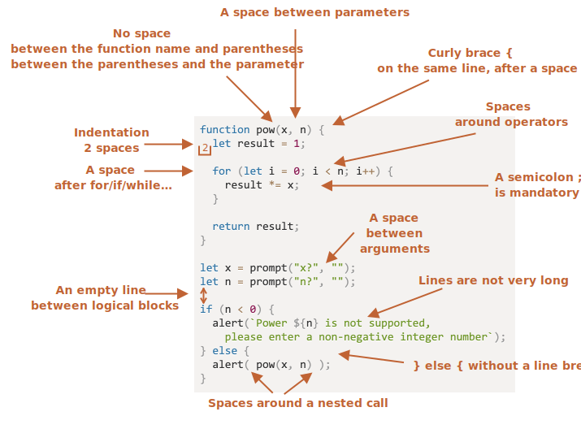

# "รูปแบบการเขียนโค้ด"

โค้ดของเราจะต้องสะอาดและง่ายต่อการอ่านมากที่สุด

นั่นคือศิลปะของการเขียนโปรแกรม -- การใช้โค้ดเข้ารหัสงานที่ซับซ้อนอย่างถูกต้องและอ่านง่ายต่อคนอื่น การเขียนโค้ดที่ดีช่วยอย่างมากในการทำเช่นนั้น 

## ไวยากรณ์

นี่คือ cheat sheet ที่มีกฎที่แนะนำ (ดูข้างล่างสำหรับรายละเอียดเพิ่มเติม):


<!--
```js
function pow(x, n) {
  let result = 1;

  for (let i = 0; i < n; i++) {
    result *= x;
  }

  return result;
}

let x = prompt("x?", "");
let n = prompt("n?", "");

if (n < 0) {
  alert(`Power ${n} is not supported,
    please enter a non-negative integer number`);
} else {
  alert( pow(x, n) );
}
```

-->

ตอนนี้เรามาพูดถึงกฎและเหตุผลที่อยู่เบื้องหลังของกฎเหล่านี้ในรายละเอียดกันบ้างครับ

```warn header="ไม่มีกฎที่บังคับว่า \"คุณต้องทำ\""
ไม่ได้เป็นคำสอนอะไร นี่เป็นความชอบในรูปแบบการเขียน ไม่ใช่หลักเบื้องต้นของศาสนาใด ๆ ที่ควรปฏิบัติตาม แต่เป็นแค่แนวทางที่ดีที่สุดที่เราคิดว่าควรปฏิบัติตาม
```

### เครื่องหมายวงเล็บปีกกา {} (Curly Braces)

ในโปรเจ็กต์ JavaScript ส่วนใหญ่ เครื่องหมายปีกกาจะเขียนในรูปแบบ "Egyptian style" โดยการเปิดปีกกาอยู่ในบรรทัดเดียวกับคำสำคัญที่เกี่ยวข้อง -- ไม่ได้เปิดในบรรทัดใหม่ นอกจากนี้ยังควรมีช่องว่างก่อนเปิดปีกกาดังนี้:

```js
if (condition) {
  // ทำตามนี้
  // ...และนี่ด้วย
  // ...และนี่ด้วย
}
```

การเขียนรูปแบบในบรรทัดเดียว เช่น `if (condition) doSomething()` เป็นกรณีพิเศษที่สำคัญ ควรเราใช้เครื่องหมายปีกกาไหมนะ?

นี่คือรูปแบบต่าง ๆ ที่คอมเมนต์เพื่อให้คุณสามารถตรวจสอบความอ่านง่ายได้ด้วยตนเอง:

1. 😠 ผู้เริ่มต้นเขียนโค้ดบางคนทำแบบนั้น ไม่ดี! เครื่องหมายปีกกาไม่จำเป็น:
    ```js
    if (n < 0) *!*{*/!*alert(`Power ${n} is not supported`);*!*}*/!*
    ```
2. 😠 แยกออกเป็นบรรทัดเดียวโดยไม่ใช้ปีกกา ไม่ควรทำแบบนั้น เพราะว่าง่ายที่จะทำพลาดเมื่อเพิ่มบรรทัดใหม่:
    ```js
    if (n < 0)
      alert(`Power ${n} is not supported`);
    ```
3. 😏 หนึ่งบรรทัดโดยไม่ใช้ปีกกา - ยอมรับได้ หากโค้ดสั้น:
    ```js
    if (n < 0) alert(`Power ${n} is not supported`);
    ```
4. 😃 แบบนี้ดีสุด:
    ```js
    if (n < 0) {
      alert(`Power ${n} is not supported`);
    }
    ```

สำหรับโค้ดที่สั้น ๆ ก็สามารถใช้บรรทัดเดียวได้ เช่น `if (cond) return null` แต่หากเป็นโค้ดบล็อก (รูปแบบสุดท้าย) จะมีความอ่านง่ายกว่าในทั่ว ๆ ไป

### ความยาวของบรรทัด

ไม่มีใครชอบอ่านโค้ดบรรทัดยาว ๆ แบบนั้น เป็นการปฏิบัติที่ดีที่สุดที่จะแยกโค้ดออกเป็นหลายบรรทัด

ตัวอย่างเช่น:
```js
// เครื่องหมาย backtick (`) ช่วยอนุญาตให้แยกสตริงออกเป็นหลายบรรทัดได้
let str = `
  ECMA International's TC39 is a group of JavaScript developers,
  implementers, academics, and more, collaborating with the community
  to maintain and evolve the definition of JavaScript.
`;
```

และสำหรับคำสั่ง `if`:

```js
if (
  id === 123 &&
  moonPhase === 'Waning Gibbous' &&
  zodiacSign === 'Libra'
) {
  letTheSorceryBegin();
}
```

ความยาวสูงสุดของบรรทัดควรตกลงกันระหว่างทีม โดยทั่วไปจะใช้ค่า 80 หรือ 120 ตัวอักษร

### การเยื้อง (Indents)

มีการเยื้อง 2 ประเภท:

- **การเยื้องแนวนอน: 2 หรือ 4 space**

    การเยื้องแนวนอนทำได้โดยใช้ 2 หรือ 4 space หรือ tab (ปุ่ม `key:Tab`) การเลือกใช้ตัวไหนเป็นเรื่องของสงครามศักดิ์สิทธิ์ที่เก่าแก่แล้ว โดยปัจจุบันมักใช้ space เป็นส่วนมาก

    ข้อดีของการใช้ space มากกว่าการกด tab คือ space ช่วยให้สามารถกำหนดการเยื้องได้อย่างยืดหยุ่นมากกว่า tab

    ตัวอย่างเช่น เราสามารถจัดแนวพารามิเตอร์ให้ตรงกับวงเล็บเปิดได้ดังนี้:

    ```js no-beautify
    show(parameters,
         aligned, // เพิ่มระยะห่างด้านซ้าย 5 space 
         one,
         after,
         another
      ) {
      // ...
    }
    ```

- **การเยื้องแนวตั้ง: การเว้นบรรทัดว่างเพื่อแบ่งโค้ดเป็นบล็อกตามลำดับตามตัวแปรผูกข้อมูล (Logical blocks)**

    แม้ว่าฟังก์ชันเดียวก็ยังสามารถแบ่งเป็นบล็อกตามลำดับตามตัวแปรผูกข้อมูล (Logical blocks) ได้ ในตัวอย่างด้านล่างนี้ การกำหนดค่าตัวแปรเริ่มต้น ลูปหลัก และการส่งคืนผลลัพธ์ถูกแบ่งแยกตามลำดับในแนวตั้ง:

    ```js
    function pow(x, n) {
      let result = 1;
      //              <--
      for (let i = 0; i < n; i++) {
        result *= x;
      }
      //              <--
      return result;
    }
    ```

    การเพิ่มบรรทัดว่างเพิ่มเติมสามารถช่วยทำให้โค้ดมีความอ่านง่ายขึ้น ควรมีจำนวนบรรทัดโค้ดไม่เกิน 9 บรรทัดโดยไม่มีการเยื้องแนวตั้ง

### เครื่องหมาย Semicolon (;)

ควรมีเครื่องหมาย semicolon (;) ต่อท้ายแต่ละคำสั่ง โดยไม่ว่าจะสามารถข้ามได้หรือไม่ก็ตาม

ในบางภาษา เครื่องหมาย semicolon (;) อาจไม่จำเป็นและใช้น้อย เช่นใน JavaScript มีกรณีที่การขึ้นบรรทัดใหม่ไม่ได้แปลงเป็น semicolon ซึ่งอาจทำให้เกิดข้อผิดพลาด ดูข้อมูลเพิ่มเติมเกี่ยวกับเรื่องนี้ได้ในบทที่ <info:structure#semicolon>

หากคุณเป็นโปรแกรมเมอร์ JavaScript ที่มีประสบการณ์มากพอ คุณอาจเลือกใช้รูปแบบการเขียนโค้ดที่ไม่ใช้ semicolon ได้ เช่น [StandardJS](https://standardjs.com/) แต่หากไม่แน่ใจควรใช้ semicolon ตอนไหน เพื่อป้องกันความผิดพลาดได้ดีที่สุด ส่วนมากเราจะใช้ semicolon กันเสมอ

### ระดับการซ้อนกัน (Nesting Levels)

ควรหลีกเลี่ยงการซ้อนโค้ดมากเกินไปในระดับการซ้อนกัน

ตัวอย่างเช่นในลูป ในบางครั้งควรใช้คำสั่ง [`continue`](info:while-for#continue) เพื่อหลีกเลี่ยงการซ้อนกันมากเกินไป

เช่น แทนที่จะเพิ่มเงื่อนไขใน `if` ซ้อนต่อเนื่องกันเช่นนี้:

```js
for (let i = 0; i < 10; i++) {
  if (cond) {
    ... // <- เพิ่มระดับการซ้อนกันอีก 1 ระดับ
  }
}
```

เราสามารถเขียนได้ดังนี้:

```js
for (let i = 0; i < 10; i++) {
  if (!cond) *!*continue*/!*;
  ...  // <- no extra nesting level
}
```

เรื่องที่คล้ายกันสามารถทำได้ด้วย  `if/else` และ `return`

ตัวอย่างเช่น สองโครงสร้างด้านล่างทำงานเหมือนกัน

ตัวเลือกที่ 1:

```js
function pow(x, n) {
  if (n < 0) {
    alert("Negative 'n' not supported");
  } else {
    let result = 1;

    for (let i = 0; i < n; i++) {
      result *= x;
    }

    return result;
  }  
}
```

ตัวเลือกที่ 2:

```js
function pow(x, n) {
  if (n < 0) {
    alert("Negative 'n' not supported");
    return;
  }

  let result = 1;

  for (let i = 0; i < n; i++) {
    result *= x;
  }

  return result;
}
```

ตัวเลือกที่สองอ่านง่ายกว่า เนื่องจาก "กรณีพิเศษ" ของ `n < 0` ได้รับการจัดการไว้ตั้งแต่ต้น พอได้ตรวจสอบแล้ว เราสามารถเลื่อนไปยังการทำงานของโค้ดหลักได้โดยไม่ต้องซ้อนบล็อคกันเพิ่มเติม

## การวางฟังก์ชัน (Function Placement)

หากคุณกำลังเขียน "helper" functions หลายฟังก์ชันพร้อมโค้ดที่ใช้งานฟังก์ชันเหล่านั้น มีวิธีการจัดระเบียบฟังก์ชัน 3 วิธีดังนี้:

1. ประกาศฟังก์ชัน *ด้านบน* โค้ดที่ใช้งานฟังก์ชัน:

    ```js
    // *!*ประกาศฟังก์ชัน*/!*
    function createElement() {
      ...
    }

    function setHandler(elem) {
      ...
    }

    function walkAround() {
      ...
    }

    // *!*โค้ดที่ใช้งานฟังก์ชัน*/!*
    let elem = createElement();
    setHandler(elem);
    walkAround();
    ```
2. โค้ดก่อน แล้วจึงเขียนฟังก์ชัน

    ```js
    // *!*โค้ดที่ใช้งานฟังก์ชัน*/!*
    let elem = createElement();
    setHandler(elem);
    walkAround();

    // --- *!*ฟังก์ชันช่วยเหลือ (Helper functions)*/!* ---
    function createElement() {
      ...
    }

    function setHandler(elem) {
      ...
    }

    function walkAround() {
      ...
    }
    ```
3. ผสม: ประกาศฟังก์ชันในส่วนที่ใช้งานฟังก์ชันครั้งแรก

ส่วนมากแล้ว เลือกใช้วิธีที่สองมากกว่า

เนื่องจากเมื่ออ่านโค้ด เราต้องการทราบว่าโค้ดทำอะไร ก่อนจึงสนใจว่าฟังก์ชันทำงานอย่างไร ถ้าโค้ดอยู่ข้างหน้า ก็จะชัดเจนตั้งแต่ต้น อาจไม่จำเป็นต้องอ่านฟังก์ชัน โดยเฉพาะหากชื่อฟังก์ชันบอกให้รู้ว่าฟังก์ชันทำอะไร

## คู่มือการเขียนโค้ด (Style Guides)

คู่มือการเขียนโค้ด (Style Guide) ประกอบด้วยกฎเกณฑ์ทั่วไปเกี่ยวกับ "วิธีการเขียน" โค้ด เช่น การใช้เครื่องหมายคำพูด, การเยื้องตัวหนังสือด้วยช่องว่าง, ความยาวของบรรทัดสูงสุด ฯลฯ ประกอบด้วยรายละเอียดเล็กๆน้อยๆ แต่มีความสำคัญเป็นอย่างมาก

เมื่อสมาชิกทุกคนในทีมใช้คู่มือการเขียนโค้ดเดียวกัน โค้ดจะมีลักษณะเดียวกันไม่ว่าสมาชิกในทีมจะเขียนโค้ดหรือไม่ก็ตาม

แน่นอนว่าทีมสามารถเขียนคู่มือการเขียนโค้ดของตนเองได้เสมอ แต่โดยทั่วไปไม่จำเป็นต้องทำเช่นนั้น เนื่องจากมีคู่มือการเขียนโค้ดอยู่หลายเล่มให้เลือกใช้งาน

คู่มือยอดนิยม:

- [Google JavaScript Style Guide](https://google.github.io/styleguide/jsguide.html)
- [Airbnb JavaScript Style Guide](https://github.com/airbnb/javascript)
- [Idiomatic.JS](https://github.com/rwaldron/idiomatic.js)
- [StandardJS](https://standardjs.com/)
- (plus many more)

หากคุณเป็นนักพัฒนาผู้เริ่มต้น คุณสามารถเริ่มต้นด้วย cheat sheet อยู่ที่จุดเริ่มต้นของบทนี้ จากนั้นคุณสามารถเรียกดูคู่มือการเขียนโค้ดอื่น ๆ เพื่อหยิบไอเดียเพิ่มเติมและตัดสินใจเลือกใช้ได้ตามต้องการ

## ตัวตรวจสอบความถูกต้องของโค้ดอัตโนมัติ (Automated Linters)

ตัวตรวจสอบความถูกต้องของโค้ด (Linter) เป็นเครื่องมือที่สามารถตรวจสอบสไตล์ของโค้ดของคุณอัตโนมัติ และให้คำแนะนำเพื่อปรับปรุงคุณภาพของโค้ดได้

จุดเด่นของตัวตรวจสอบความถูกต้องของโค้ดคือการตรวจสอบสไตล์และการหาข้อผิดพลาดเบื้องต้น เช่น การพิมพ์ผิดชื่อตัวแปรหรือฟังก์ชัน เนื่องจากคุณลักษณะนี้ การใช้ตัวตรวจสอบความถูกต้องของโค้ดเป็นสิ่งที่แนะนำ แม้ว่าคุณจะไม่ต้องการเขียนตาม "สไตล์โค้ด" ใด ๆ ก็ตาม

นี่คือเครื่องมือตรวจสอบความถูกต้องของโค้ดที่โด่งดัง:

- [JSLint](https://www.jslint.com/) -- one of the first linters.
- [JSHint](https://jshint.com/) -- more settings than JSLint.
- [ESLint](https://eslint.org/) -- probably the newest one.

เครื่องมือเหล่านี้สามารถใช้งานได้ทุกตัว ผู้เขียนนำ [ESLint](https://eslint.org/) มาใช้งาน

เครื่องมือตรวจสอบความถูกต้องของโค้ดส่วนใหญ่รองรับการใช้งานกับโปรแกรมแก้ไขโค้ด (Code Editor) ยอดนิยมหลายตัว เพียงเปิดใช้งานปลั๊กอินในโปรแกรมและกำหนดค่าสไตล์ได้เลย

ตัวอย่างเช่นสำหรับ ESLint คุณควรทำตามขั้นตอนต่อไปนี้:

1. ติดตั้ง [Node.js](https://nodejs.org/)
2. ติดตั้ง ESLint โดยใช้คำสั่ง `npm install -g eslint` (npm เป็นตัวติดตั้งแพ็คเกจ JavaScript)
3. สร้างไฟล์คอนฟิกชื่อ `.eslintrc` นรูทของโปรเจกต์ JavaScript ของคุณ (ในโฟลเดอร์ที่มีไฟล์ทั้งหมดในโปรเจคของคุณ)
4. ติดตั้ง / เปิดใช้งานปลั๊กอินสำหรับโปรแกรมแก้ไขโค้ด (Code Editor) ที่เชื่อมต่อกับ ESLint ส่วนใหญ่แล้วโปรแกรมแก้ไขโค้ดจะมีปลั๊กอินสำหรับ ESLint ที่ใช้งานได้

นี่คือตัวอย่างของไฟล์ `.eslintrc`:

```js
{
  "extends": "eslint:recommended",
  "env": {
    "browser": true,
    "node": true,
    "es6": true
  },
  "rules": {
    "no-console": 0,
    "indent": 2
  }
}
```

ในตัวอย่างด้านล่างนี้ คำสั่ง `"extends"` แสดงว่าการกำหนดค่านี้อ้างอิงจากการตั้งค่ารายการ "eslint:recommended" จากนั้นเรากำหนดค่าของเราเองด้วย.

นอกจากนี้ยังสามารถดาวน์โหลดเซตกฏรูปแบบการเขียนโค้ดจากเว็บไซต์และนำมาขยายเพิ่มเติมได้ด้วย ดูรายละเอียดเพิ่มเติมเกี่ยวกับการติดตั้งได้ที่ <https://eslint.org/docs/user-guide/getting-started>

นอกจากนี้ ก็มี IDE บางตัวที่มีการตรวจสอบความถูกต้องของโค้ดที่มีในตัวอยู่แล้ว ซึ่งช่วยให้เราสะดวกขึ้น แต่ไม่สามารถปรับแต่งได้เท่ากับการใช้งาน ESLint

## สรุป

ข้อกำหนดรูปแบบการเขียนโค้ดในบทนี้ (และอ้างอิงสไตล์การเขียนโค้ด) เป็นข้อกำหนดที่จะช่วยเพิ่มความอ่านง่ายของโค้ด และเพิ่มความเข้าใจในการอ่าน ซึ่งเราสามารถคุยกันในทีมได้

เมื่อพิจารณาว่าจะเขียน "โค้ดที่ดีขึ้น" คำถามที่ควรถามตนเองคือ "อะไรทำให้โค้ดมีความอ่านง่ายและเข้าใจได้ง่ายขึ้น?" และ "มีอะไรที่ช่วยให้เราหลีกเลี่ยงข้อผิดพลาดได้?" เป็นสิ่งสำคัญที่ควรจำไว้เมื่อต้องเลือกรูปแบบและรีวิวการเขียนโค้ด

การอ่านสไตล์การเขียนโค้ดที่ได้รับความนิยมจะช่วยให้คุณอัพเดทไอเดียล่าสุดเกี่ยวกับแนวโน้มและข้อบังคับที่ดีที่สุดในการเขียนโค้ด
