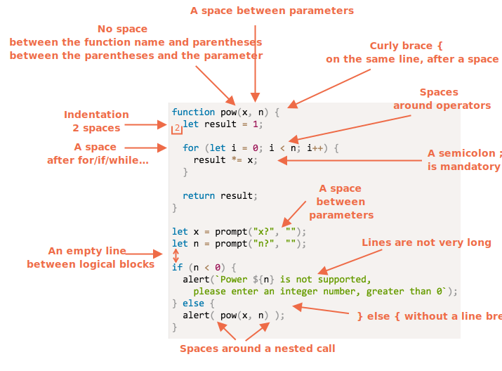

# แนวทางการเขียนโค้ด

โค้ดของเราต้องเขียนให้สะอาดและอ่านง่ายที่สุดเท่าที่จะเป็นไปได้

นี่แหละคือศิลปะของการเขียนโปรแกรม — เขียนโค้ดสำหรับงานที่ซับซ้อนให้ทั้งถูกต้องและอ่านง่าย สไตล์การเขียนโค้ดที่ดีจะช่วยได้มาก

## รูปแบบไวยากรณ์

ต่อไปนี้คือตารางสรุปกฎที่แนะนำ (ดูรายละเอียดเพิ่มเติมด้านล่าง):


<!--
```js
function pow(x, n) {
  let result = 1;

  for (let i = 0; i < n; i++) {
    result *= x;
  }

  return result;
}

let x = prompt("x?", "");
let n = prompt("n?", "");

if (n < 0) {
  alert(`เลขยกกำลัง ${n} ไม่รองรับ,
    กรุณาใส่จำนวนเต็มที่ไม่ติดลบ`);
} else {
  alert( pow(x, n) );
}
```

-->

ทีนี้มาคุยถึงกฎเหล่านี้พร้อมเหตุผลกันอย่างละเอียดเลย

```warn header="ไม่มีกฎ \"ต้องทำ\" ตายตัว"
ไม่มีอะไรที่ตายตัวที่นี่ ข้อเสนอแนะเหล่านี้เป็นแค่รสนิยมในการจัดรูปแบบโค้ด ไม่ใช่หลักคำสอนทางศาสนา
```

### วงเล็บปีกกา

ในโปรเจ็กต์ JavaScript ส่วนใหญ่ วงเล็บปีกกาจะเขียนในสไตล์ "อียิปต์" คือวงเปิดอยู่บรรทัดเดียวกับคีย์เวิร์ด — ไม่ได้ขึ้นบรรทัดใหม่ และมีช่องว่างก่อนวงเปิดด้วย แบบนี้:

```js
if (condition) {
  // ทำอันนี้
  // ...แล้วก็อันนั้น
  // ...แล้วก็อันนู่น 
}
```

กรณีพิเศษที่น่าสนใจคือประโยคบรรทัดเดียว เช่น `if (condition) doSomething()` — แบบนี้ควรใส่วงเล็บปีกกาหรือเปล่า?

ลองดูตัวเลือกต่างๆ พร้อมคำอธิบาย แล้วตัดสินด้วยตัวเองว่าแบบไหนอ่านง่ายกว่า:

1. 😠 มือใหม่บางคนทำแบบนี้ ไม่ดีเลย! ไม่จำเป็นต้องใช้วงเล็บปีกกา:
   ```js
   if (n < 0) *!*{*/!*alert(`เลขยกกำลัง ${n} ไม่รองรับ`);*!*}*/!*
   ``` 
2. 😠 แยกเป็นบรรทัดใหม่โดยไม่ใช้วงเล็บปีกกา อย่าทำแบบนี้เลย เพราะจะผิดพลาดง่ายเวลาเพิ่มบรรทัดใหม่:
   ```js
   if (n < 0)
     alert(`เลขยกกำลัง ${n} ไม่รองรับ`);
   ```
3. 😏 เขียนบรรทัดเดียวโดยไม่ใช้วงเล็บปีกกา - ยอมรับได้ถ้าสั้น:
   ```js
   if (n < 0) alert(`เลขยกกำลัง ${n} ไม่รองรับ`);
   ```
4. 😃 ตัวเลือกที่ดีที่สุด: 
   ```js
   if (n < 0) {
     alert(`เลขยกกำลัง ${n} ไม่รองรับ`); 
   }
   ```

สำหรับโค้ดที่สั้นมากๆ อนุญาตให้เขียนบรรทัดเดียวได้ เช่น `if (cond) return null` แต่โดยทั่วไปแล้วการเขียนเป็นบล็อกโค้ด (ตัวเลือกสุดท้าย) จะอ่านเข้าใจง่ายกว่า

### ความยาวบรรทัด

ไม่มีใครชอบอ่านบรรทัดโค้ดที่ยาวเหยียด แนวปฏิบัติที่ดีคือตัดแบ่งให้สั้นลง

ยกตัวอย่างเช่น:
```js
// เครื่องหมาย backtick ` ทำให้แบ่งสตริงเป็นหลายบรรทัดได้
let str = `
  ECMA International's TC39 เป็นกลุ่มนักพัฒนา JavaScript,
  ผู้ทำระบบ, นักวิชาการ และอีกมากมาย ที่ร่วมกันดูแลรักษากับชุมชน  
  เพื่อปรับปรุงและพัฒนานิยามของ JavaScript
`;
```

และสำหรับประโยค `if`:

```js
if (
  id === 123 &&
  moonPhase === 'Waning Gibbous' && 
  zodiacSign === 'Libra'
) {
  letTheSorceryBegin();
}
```

ความยาวสูงสุดของบรรทัดควรตกลงกันในระดับทีมงาน ปกติแล้วมักเป็น 80 หรือ 120 ตัวอักษร

### การเยื้องบรรทัด

การเยื้องบรรทัดมี 2 แบบ:

- **การเยื้องในแนวนอน: เว้นวรรค 2 หรือ 4 ช่อง**

    ใช้เว้นวรรค 2 หรือ 4 ช่อง หรือใช้แท็บ (ปุ่ม `key:Tab`) ก็ได้ เรื่องนี้เป็นประเด็นถกเถียงกันมานาน แต่ปัจจุบันนิยมใช้เว้นวรรคมากกว่า

    ข้อดีของเว้นวรรคคือ กำหนดระยะเยื้องได้ยืดหยุ่นกว่าแท็บ

    เช่น จัดตำแหน่งพารามิเตอร์ให้ตรงกับวงเล็บเปิดได้แบบนี้:

    ```js no-beautify
    show(parameters,
         aligned, // เว้นวรรค 5 ช่องจากทางซ้าย
         one,
         after,
         another
      ) {
      // ...
    }
    ```

- **การเว้นบรรทัดในแนวตั้ง: เว้นบรรทัดว่างเพื่อแบ่งโค้ดเป็นกลุ่มย่อยตามลำดับขั้นตอน**

    แม้แต่ฟังก์ชันเดียวก็มักแบ่งเป็นกลุ่มย่อยได้ ตัวอย่างด้านล่างนี้ แยกส่วนกำหนดค่าเริ่มต้น, ลูปหลัก และการคืนค่า ออกจากกันด้วยบรรทัดว่าง:

    ```js
    function pow(x, n) {
      let result = 1;
      //              <--
      for (let i = 0; i < n; i++) {
        result *= x;
      }
      //              <--
      return result;
    }
    ```

    เพิ่มบรรทัดว่างในจุดที่ช่วยให้อ่านโค้ดเข้าใจง่ายขึ้น ไม่ควรมีโค้ดยาวเกิน 9 บรรทัดโดยไม่มีการเว้นบรรทัดในแนวตั้ง

### เครื่องหมายอัฒภาค (semicolon)

ควรมีอัฒภาคปิดท้ายแต่ละประโยคเสมอ แม้ในบางกรณีจะละเว้นได้ก็ตาม

บางภาษามีอัฒภาคเป็นตัวเลือกล้วนๆ แทบไม่เห็นใช้เลย แต่ใน JavaScript มีบางกรณีที่ตัวขึ้นบรรทัดใหม่ไม่ได้ถูกตีความเป็นอัฒภาค ทำให้โค้ดเสี่ยงเกิดข้อผิดพลาดได้ อ่านเพิ่มเติมในบท <info:structure#semicolon>

ถ้าเป็นโปรแกรมเมอร์ JavaScript ที่มีประสบการณ์สูง อาจเลือกใช้สไตล์ไม่ใส่อัฒภาค เช่น [StandardJS](https://standardjs.com/) ก็ได้ แต่ถ้ายังไม่มั่นใจ แนะนำให้ใส่อัฒภาคเสมอจะปลอดภัยกว่า นักพัฒนาส่วนใหญ่ก็ใส่อัฒภาคกันเป็นปกติอยู่แล้ว

### ระดับความลึกของการซ้อนโค้ด

พยายามหลีกเลี่ยงการซ้อนโค้ดลึกเกินไปหลายชั้น

ยกตัวอย่างเช่น ในลูป บางครั้งการใช้คำสั่ง [`continue`](info:while-for#continue) เพื่อข้ามการซ้อนโค้ดเพิ่มเติมเป็นวิธีที่ดี

เช่น แทนที่จะเพิ่มเงื่อนไข `if` ซ้อนกันแบบนี้:

```js
for (let i = 0; i < 10; i++) {
  if (cond) {
    ... // <- ซ้อนลึกลงไปอีกชั้น
  }
}
```

เขียนเป็นแบบนี้แทนได้:

```js
for (let i = 0; i < 10; i++) {
  if (!cond) *!*continue*/!*;
  ...  // <- ไม่ต้องซ้อนลึกลงไปอีกชั้น
}
```

ใช้เทคนิคเดียวกันนี้กับ `if/else` และ `return` ก็ได้

ตัวอย่างเช่น โครงสร้างสองแบบด้านล่างนี้ให้ผลลัพธ์เหมือนกัน

แบบที่ 1:

```js
function pow(x, n) {
  if (n < 0) {
    alert("ไม่รองรับ 'n' ติดลบ");
  } else {
    let result = 1;

    for (let i = 0; i < n; i++) {
      result *= x;
    }

    return result;
  }  
}
```

แบบที่ 2:

```js
function pow(x, n) {
  if (n < 0) {
    alert("ไม่รองรับ 'n' ติดลบ");
    return;
  }

  let result = 1;

  for (let i = 0; i < n; i++) {
    result *= x;
  }

  return result;
}
```

แบบที่สองอ่านเข้าใจง่ายกว่า เพราะจัดการ "กรณีพิเศษ" ที่ `n < 0` ตั้งแต่เนิ่นๆ พอตรวจสอบผ่านแล้ว ก็ไปต่อที่โค้ดหลักได้เลยโดยไม่ต้องซ้อนลึกลงไปอีก

## การจัดวางตำแหน่งฟังก์ชัน

ถ้ากำลังเขียนฟังก์ชัน "ผู้ช่วย" หลายตัว พร้อมกับโค้ดที่เรียกใช้ มีวิธีจัดวาง 3 แบบ

1. ประกาศฟังก์ชัน *ก่อน* โค้ดที่เรียกใช้:

   ```js
   // *!*ประกาศฟังก์ชัน*/!*
   function createElement() {
     ...
   }

   function setHandler(elem) {
     ...
   }

   function walkAround() {
     ...
   }

   // *!*โค้ดที่เรียกใช้ฟังก์ชัน*/!*
   let elem = createElement();
   setHandler(elem);
   walkAround();
   ```

2. เขียนโค้ดที่เรียกใช้ฟังก์ชันก่อน จากนั้นตามด้วยฟังก์ชัน

   ```js
   // *!*โค้ดที่เรียกใช้ฟังก์ชัน*/!*
   let elem = createElement();
   setHandler(elem);
   walkAround();

   // --- *!*ฟังก์ชันผู้ช่วย*/!* ---  
   function createElement() {
     ...
   }

   function setHandler(elem) {
     ...
   }

   function walkAround() {
     ...
   }
   ```

3. ผสมกันระหว่างสองแบบข้างต้น: ประกาศฟังก์ชันในตำแหน่งที่มีการเรียกใช้ครั้งแรก

โดยส่วนใหญ่แล้ว นิยมใช้แบบที่ 2 มากกว่า

เพราะเวลาอ่านโค้ด เราอยากรู้ก่อนว่า *โค้ดทำอะไร* ถ้าเขียนโค้ดหลักไว้ข้างบนสุด ความตั้งใจจะชัดเจนตั้งแต่แรก บางทีอาจไม่ต้องอ่านฟังก์ชันเลยก็ได้ — โดยเฉพาะถ้าชื่อฟังก์ชันบ่งบอกหน้าที่ได้ดีอยู่แล้ว

## คู่มือสไตล์การเขียนโค้ด

คู่มือสไตล์รวบรวมกฎทั่วไปเกี่ยวกับ "วิธีเขียน" โค้ด เช่น ใช้เครื่องหมายคำพูดแบบไหน เว้นย่อหน้ากี่ช่อง บรรทัดยาวได้สูงสุดเท่าไร ฯลฯ — เป็นรายละเอียดเล็กๆ น้อยๆ แต่มีมากมาย

เมื่อสมาชิกทุกคนในทีมใช้คู่มือสไตล์ชุดเดียวกัน โค้ดจะมีรูปแบบที่เป็นเอกภาพ ไม่ว่าจะเขียนโดยสมาชิกคนไหนก็ตาม

แน่นอนว่า ทีมสามารถเขียนคู่มือสไตล์เป็นของตัวเองได้เสมอ แต่โดยทั่วไปแล้วมักไม่จำเป็น เพราะมีคู่มือสำเร็จรูปให้เลือกใช้อยู่แล้วมากมาย

ตัวเลือกยอดนิยมบางส่วน ได้แก่:

- [Google JavaScript Style Guide](https://google.github.io/styleguide/jsguide.html)
- [Airbnb JavaScript Style Guide](https://github.com/airbnb/javascript)
- [Idiomatic.JS](https://github.com/rwaldron/idiomatic.js)
- [StandardJS](https://standardjs.com/)
- (และอีกมากมาย)

สำหรับมือใหม่ แนะนำให้เริ่มจากตารางสรุปที่ต้นบทนี้ก่อน จากนั้นค่อยๆ ศึกษาคู่มือสไตล์อื่นๆ เพื่อเก็บไอเดียเพิ่มเติม แล้วเลือกสไตล์ที่ถูกใจที่สุด

## เครื่องมือตรวจสอบโค้ดอัตโนมัติ (Automated Linters)

Linter คือเครื่องมือที่ช่วยตรวจสอบสไตล์โค้ดให้โดยอัตโนมัติ และเสนอแนะจุดที่ควรปรับปรุงแก้ไข

ข้อดีคือ การตรวจสอบสไตล์ยังช่วยค้นพบบั๊กบางอย่างได้ด้วย เช่น สะกดชื่อตัวแปรหรือฟังก์ชันผิด ด้วยเหตุนี้จึงแนะนำให้ใช้ linter แม้จะไม่ได้อยากยึดติดกับ "สไตล์โค้ด" แบบใดแบบหนึ่งโดยเฉพาะก็ตาม

ต่อไปนี้คือเครื่องมือ linting ที่มีชื่อเสียง:

- [JSLint](https://www.jslint.com/) — หนึ่งใน linter รุ่นแรกๆ
- [JSHint](https://jshint.com/) — มีตัวเลือกการตั้งค่ามากกว่า JSLint
- [ESLint](https://eslint.org/) — น่าจะเป็นตัวล่าสุด

ทั้งหมดนี้ใช้งานได้เหมือนกัน ผู้เขียนเองใช้ [ESLint](https://eslint.org/)

Linter ส่วนใหญ่เชื่อมต่อกับ editor ยอดนิยมได้ แค่เปิดใช้ปลั๊กอินแล้วตั้งค่าสไตล์ที่ต้องการก็เสร็จ

ยกตัวอย่างสำหรับ ESLint ให้ทำตามขั้นตอนต่อไปนี้:

1. ติดตั้ง [Node.js](https://nodejs.org/)
2. ติดตั้ง ESLint ด้วยคำสั่ง `npm install -g eslint` (npm คือตัวจัดการแพ็คเกจของ JavaScript)
3. สร้างไฟล์กำหนดค่าชื่อ `.eslintrc` ไว้ที่ root ของโปรเจ็กต์ JavaScript (ในโฟลเดอร์ที่เก็บไฟล์ทั้งหมด)
4. ติดตั้ง/เปิดใช้ปลั๊กอิน ESLint ใน editor ที่ใช้ — editor ส่วนใหญ่จะมีปลั๊กอินนี้ให้อยู่แล้ว

ตัวอย่างไฟล์ `.eslintrc` เป็นดังนี้:

```js
{
  "extends": "eslint:recommended",
  "env": {
    "browser": true,
    "node": true,
    "es6": true
  },
  "rules": {
    "no-console": 0,
    "indent": 2
  }
}
```

ตรงนี้ `"extends"` หมายถึงใช้ค่าพื้นฐานจากชุด "eslint:recommended" แล้วค่อยปรับแต่งเพิ่มเติมเอง

นอกจากนี้ยังดาวน์โหลดชุดกฎสไตล์จากเว็บมาต่อยอดได้ด้วย ดูรายละเอียดการติดตั้งได้ที่ <https://eslint.org/docs/user-guide/getting-started>

IDE บางตัวก็มี linter มาในตัวแล้ว ใช้สะดวกดีแต่ปรับแต่งได้ไม่มากเท่า ESLint

## สรุป

กฎไวยากรณ์ทั้งหมดที่กล่าวถึงในบทนี้ (รวมถึงในคู่มือสไตล์ต่างๆ) ล้วนมีเป้าหมายเดียวกันคือทำให้โค้ดอ่านเข้าใจง่ายขึ้น และทุกกฎก็ถกเถียงกันได้

เวลาคิดจะเขียนโค้ดให้ "ดีขึ้น" ลองถามตัวเองว่า "อะไรช่วยให้โค้ดอ่านง่ายขึ้น?" และ "อะไรช่วยให้หลีกเลี่ยงข้อผิดพลาดได้?" — นี่คือหัวใจสำคัญในการเลือกสไตล์โค้ด

การอ่านคู่มือสไตล์ยอดนิยมจะช่วยให้อัพเดตเทรนด์และแนวปฏิบัติที่ดีที่สุดอยู่เสมอ