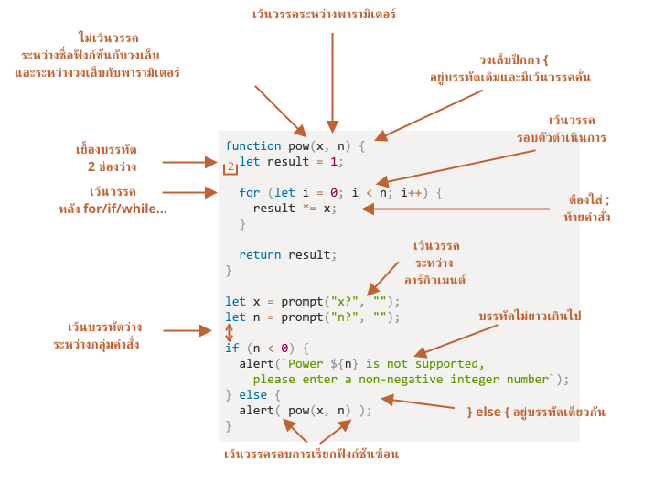

# แนวทางการเขียนโค้ด

โค้ดเราควรเขียนให้สะอาดและอ่านง่ายที่สุดเท่าที่ทำได้

นี่แหละคือศิลปะของการเขียนโปรแกรม — เขียนโค้ดที่ซับซ้อนให้ทั้งถูกต้องและอ่านง่าย สไตล์การเขียนโค้ดที่ดีช่วยได้เยอะเลย

## รูปแบบไวยากรณ์

มาดูตารางสรุปกฎที่แนะนำกัน (รายละเอียดอยู่ด้านล่าง):


<!--
```js
function pow(x, n) {
  let result = 1;

  for (let i = 0; i < n; i++) {
    result *= x;
  }

  return result;
}

let x = prompt("x?", "");
let n = prompt("n?", "");

if (n < 0) {
  alert(`เลขยกกำลัง ${n} ไม่รองรับ,
    กรุณาใส่จำนวนเต็มที่ไม่ติดลบ`);
} else {
  alert( pow(x, n) );
}
```

-->

ทีนี้มาคุยถึงกฎแต่ละข้อพร้อมเหตุผลกันแบบละเอียดเลย

```warn header="ไม่มีกฎ \"ต้องทำ\" ตายตัว"
ไม่มีอะไรตายตัวตรงนี้ ข้อเสนอแนะเหล่านี้เป็นแค่รสนิยมในการจัดรูปแบบโค้ด ไม่ใช่หลักคำสอนทางศาสนา
```

### วงเล็บปีกกา

ในโปรเจ็กต์ JavaScript ส่วนใหญ่ วงเล็บปีกกาจะเขียนในสไตล์ "อียิปต์" คือวงเปิดอยู่บรรทัดเดียวกับคีย์เวิร์ด ไม่ขึ้นบรรทัดใหม่ แถมเว้นวรรคก่อนวงเปิดด้วย แบบนี้:

```js
if (condition) {
  // ทำอันนี้
  // ...แล้วก็อันนั้น
  // ...แล้วก็อันนู่น 
}
```

กรณีน่าสนใจคือประโยคบรรทัดเดียว เช่น `if (condition) doSomething()` — แบบนี้ควรใส่วงเล็บปีกกาหรือเปล่า?

ลองดูตัวเลือกต่างๆ พร้อมคำอธิบาย แล้วตัดสินเอาเองว่าแบบไหนอ่านง่ายกว่า:

1. 😠 มือใหม่บางคนชอบทำแบบนี้ — ไม่ดีเลย! ไม่จำเป็นต้องมีวงเล็บปีกกา:
   ```js
   if (n < 0) *!*{*/!*alert(`เลขยกกำลัง ${n} ไม่รองรับ`);*!*}*/!*
   ``` 
2. 😠 แยกบรรทัดใหม่แต่ไม่ใส่วงเล็บปีกกา อย่าทำเลย เพราะพังง่ายมากเวลาเพิ่มบรรทัดใหม่:
   ```js
   if (n < 0)
     alert(`เลขยกกำลัง ${n} ไม่รองรับ`);
   ```
3. 😏 เขียนบรรทัดเดียวไม่มีวงเล็บปีกกา — ยอมรับได้ถ้าสั้น:
   ```js
   if (n < 0) alert(`เลขยกกำลัง ${n} ไม่รองรับ`);
   ```
4. 😃 ตัวเลือกที่ดีที่สุด:
   ```js
   if (n < 0) {
     alert(`เลขยกกำลัง ${n} ไม่รองรับ`); 
   }
   ```

โค้ดสั้นมากๆ เขียนบรรทัดเดียวก็ได้ เช่น `if (cond) return null` แต่โดยทั่วไปเขียนเป็นบล็อก (แบบที่ 4) จะอ่านง่ายกว่า

### ความยาวบรรทัด

ไม่มีใครชอบอ่านบรรทัดโค้ดที่ยาวเหยียดใช่ไหมล่ะ? เพราะงั้นทางที่ดีคือตัดแบ่งให้สั้นลง

ยกตัวอย่าง:
```js
// เครื่องหมาย backtick ` ทำให้แบ่งสตริงเป็นหลายบรรทัดได้
let str = `
  ECMA International's TC39 เป็นกลุ่มนักพัฒนา JavaScript,
  ผู้ทำระบบ, นักวิชาการ และอีกมากมาย ที่ร่วมกันดูแลรักษากับชุมชน  
  เพื่อปรับปรุงและพัฒนานิยามของ JavaScript
`;
```

และสำหรับประโยค `if`:

```js
if (
  id === 123 &&
  moonPhase === 'Waning Gibbous' && 
  zodiacSign === 'Libra'
) {
  letTheSorceryBegin();
}
```

ความยาวสูงสุดของบรรทัดควรตกลงกันในทีม โดยทั่วไปก็มักจะเป็น 80 หรือ 120 ตัวอักษร

### การเยื้องบรรทัด

การเยื้องบรรทัดมี 2 แบบ:

- **การเยื้องแนวนอน: เว้นวรรค 2 หรือ 4 ช่อง**

    เว้นวรรค 2 หรือ 4 ช่อง หรือจะใช้แท็บ (ปุ่ม `key:Tab`) ก็ได้ เรื่องนี้เถียงกันมานานแล้ว แต่ปัจจุบันนิยมใช้เว้นวรรคกันมากกว่า

    ข้อดีของเว้นวรรคคือปรับระยะเยื้องได้ยืดหยุ่นกว่าแท็บ

    เช่น จัดตำแหน่งพารามิเตอร์ให้ตรงกับวงเล็บเปิดได้แบบนี้:

    ```js no-beautify
    show(parameters,
         aligned, // เว้นวรรค 5 ช่องจากทางซ้าย
         one,
         after,
         another
      ) {
      // ...
    }
    ```

- **การเว้นบรรทัดแนวตั้ง: เว้นบรรทัดว่างเพื่อแบ่งโค้ดเป็นกลุ่มตามลำดับขั้นตอน**

    แม้แต่ฟังก์ชันเดียว ก็มักแบ่งเป็นกลุ่มย่อยๆ ได้ ตัวอย่างด้านล่างนี้ — แยกส่วนกำหนดค่าเริ่มต้น ลูปหลัก และการคืนค่า ออกจากกันด้วยบรรทัดว่าง:

    ```js
    function pow(x, n) {
      let result = 1;
      //              <--
      for (let i = 0; i < n; i++) {
        result *= x;
      }
      //              <--
      return result;
    }
    ```

    เพิ่มบรรทัดว่างตรงจุดที่ช่วยให้อ่านง่ายขึ้น โค้ดไม่ควรยาวเกิน 9 บรรทัดโดยไม่เว้นบรรทัดแนวตั้งเลย

### เครื่องหมายอัฒภาค (semicolon)

ควรมีอัฒภาคปิดท้ายทุกประโยคเสมอ แม้บางกรณีจะละเว้นได้ก็ตาม

บางภาษาอัฒภาคเป็นตัวเลือกล้วนๆ แทบไม่ได้ใช้เลย แต่ใน JavaScript มีบางกรณีที่การขึ้นบรรทัดใหม่ไม่ได้ตีความเป็นอัฒภาค ทำให้โค้ดเสี่ยง error ได้ อ่านเพิ่มเติมในบท <info:structure#semicolon>

โปรแกรมเมอร์ JavaScript ที่มีประสบการณ์สูงอาจเลือกใช้สไตล์ไม่ใส่อัฒภาค เช่น [StandardJS](https://standardjs.com/) ก็ได้ แต่ถ้ายังไม่มั่นใจ ใส่อัฒภาคไว้เสมอจะปลอดภัยกว่า นักพัฒนาส่วนใหญ่ก็ใส่กันเป็นปกติอยู่แล้ว

### ระดับความลึกของการซ้อนโค้ด

พยายามอย่าซ้อนโค้ดลึกเกินไปหลายชั้น

เช่น ในลูป บางครั้งใช้คำสั่ง [`continue`](info:while-for#continue) ข้ามเงื่อนไขบางอย่างเป็นวิธีที่ดีกว่า

เช่น แทนที่จะซ้อนเงื่อนไข `if` กันลึกๆ แบบนี้:

```js
for (let i = 0; i < 10; i++) {
  if (cond) {
    ... // <- ซ้อนลึกลงไปอีกชั้น
  }
}
```

เขียนแบบนี้แทนก็ได้:

```js
for (let i = 0; i < 10; i++) {
  if (!cond) *!*continue*/!*;
  ...  // <- ไม่ต้องซ้อนลึกลงไปอีกชั้น
}
```

เทคนิคเดียวกันนี้ใช้กับ `if/else` และ `return` ได้เหมือนกัน

เช่น 2 โครงสร้างด้านล่างนี้ให้ผลลัพธ์เหมือนกัน

แบบที่ 1:

```js
function pow(x, n) {
  if (n < 0) {
    alert("ไม่รองรับ 'n' ติดลบ");
  } else {
    let result = 1;

    for (let i = 0; i < n; i++) {
      result *= x;
    }

    return result;
  }  
}
```

แบบที่ 2:

```js
function pow(x, n) {
  if (n < 0) {
    alert("ไม่รองรับ 'n' ติดลบ");
    return;
  }

  let result = 1;

  for (let i = 0; i < n; i++) {
    result *= x;
  }

  return result;
}
```

แบบที่ 2 อ่านง่ายกว่า เพราะจัดการ "กรณีพิเศษ" ที่ `n < 0` ตั้งแต่เนิ่นๆ พอเช็คผ่านแล้วก็ไปต่อที่โค้ดหลักได้เลย ไม่ต้องซ้อนลึกลงไปอีก

## การจัดวางตำแหน่งฟังก์ชัน

ถ้ากำลังเขียนฟังก์ชัน "ผู้ช่วย" หลายตัว พร้อมกับโค้ดที่เรียกใช้ — มีวิธีจัดวาง 3 แบบ

1. ประกาศฟังก์ชัน *ก่อน* โค้ดที่เรียกใช้:

   ```js
   // *!*ประกาศฟังก์ชัน*/!*
   function createElement() {
     ...
   }

   function setHandler(elem) {
     ...
   }

   function walkAround() {
     ...
   }

   // *!*โค้ดที่เรียกใช้ฟังก์ชัน*/!*
   let elem = createElement();
   setHandler(elem);
   walkAround();
   ```

2. เขียนโค้ดที่เรียกใช้ฟังก์ชันก่อน จากนั้นตามด้วยฟังก์ชัน

   ```js
   // *!*โค้ดที่เรียกใช้ฟังก์ชัน*/!*
   let elem = createElement();
   setHandler(elem);
   walkAround();

   // --- *!*ฟังก์ชันผู้ช่วย*/!* ---  
   function createElement() {
     ...
   }

   function setHandler(elem) {
     ...
   }

   function walkAround() {
     ...
   }
   ```

3. ผสมกันระหว่าง 2 แบบข้างต้น: ประกาศฟังก์ชันตรงที่มีการเรียกใช้ครั้งแรก

ส่วนใหญ่แล้วนิยมใช้แบบที่ 2 กัน

ทำไมน่ะเหรอ? เพราะเวลาอ่านโค้ด เราอยากรู้ก่อนว่า *โค้ดทำอะไร* ถ้าเขียนโค้ดหลักไว้ข้างบนสุด ความตั้งใจจะชัดตั้งแต่แรก บางทีอาจไม่ต้องอ่านฟังก์ชันเลยก็ได้ — โดยเฉพาะถ้าชื่อฟังก์ชันบอกหน้าที่ไว้ชัดเจนอยู่แล้ว

## คู่มือสไตล์การเขียนโค้ด

คู่มือสไตล์คือที่รวบรวมกฎทั่วไปว่า "เขียนโค้ดยังไง" — เช่น ใช้เครื่องหมายคำพูดแบบไหน เว้นย่อหน้ากี่ช่อง บรรทัดยาวได้สูงสุดเท่าไร ฯลฯ รายละเอียดเล็กๆ น้อยๆ แต่เยอะมาก

พอทุกคนในทีมใช้คู่มือสไตล์ชุดเดียวกัน โค้ดก็จะมีรูปแบบเดียวกัน ไม่ว่าใครเป็นคนเขียน

ทีมจะเขียนคู่มือสไตล์เองก็ได้ แต่โดยทั่วไปไม่จำเป็น เพราะมีคู่มือสำเร็จรูปให้เลือกใช้เยอะแล้ว

ตัวเลือกยอดนิยม ได้แก่:

- [Google JavaScript Style Guide](https://google.github.io/styleguide/jsguide.html)
- [Airbnb JavaScript Style Guide](https://github.com/airbnb/javascript)
- [Idiomatic.JS](https://github.com/rwaldron/idiomatic.js)
- [StandardJS](https://standardjs.com/)
- (และอีกมากมาย)

สำหรับมือใหม่ แนะนำให้เริ่มจากตารางสรุปที่ต้นบทนี้ก่อน จากนั้นค่อยๆ ศึกษาคู่มือสไตล์อื่นๆ เก็บไอเดียเพิ่มเติม แล้วเลือกสไตล์ที่ถูกใจที่สุด

## Linter อัตโนมัติ (Automated Linters)

Linter ก็คือเครื่องมือที่คอยเช็คสไตล์โค้ดให้เราอัตโนมัติ แล้วเสนอแนะจุดที่ควรปรับแก้

เจ๋งตรงที่การเช็คสไตล์ยังช่วยเจอบั๊กบางอย่างด้วย เช่น สะกดชื่อตัวแปรหรือฟังก์ชันผิด เพราะงั้นแนะนำให้ใช้ linter แม้จะไม่ได้อยากยึดติดกับ "สไตล์โค้ด" แบบไหนเป็นพิเศษก็ตาม

Linter ดังๆ ที่มีให้เลือก:

- [JSLint](https://www.jslint.com/) — หนึ่งใน linter รุ่นแรกๆ
- [JSHint](https://jshint.com/) — มีตัวเลือกตั้งค่าเยอะกว่า JSLint
- [ESLint](https://eslint.org/) — น่าจะเป็นตัวใหม่สุด

ทั้งหมดนี้ใช้งานคล้ายๆ กัน ผมเองใช้ [ESLint](https://eslint.org/)

Linter ส่วนใหญ่เชื่อมต่อกับ editor ยอดนิยมได้ — แค่เปิดใช้ปลั๊กอินแล้วตั้งค่าสไตล์ที่ต้องการก็เสร็จ

ลองดูตัวอย่างสำหรับ ESLint — ทำตามขั้นตอนนี้ได้เลย:

1. ติดตั้ง [Node.js](https://nodejs.org/)
2. ติดตั้ง ESLint ด้วยคำสั่ง `npm install -g eslint` (npm ก็คือตัวจัดการแพ็คเกจของ JavaScript)
3. สร้างไฟล์กำหนดค่าชื่อ `.eslintrc` ไว้ที่ root ของโปรเจ็กต์ JavaScript (โฟลเดอร์ที่เก็บไฟล์ทั้งหมด)
4. ติดตั้ง/เปิดใช้ปลั๊กอิน ESLint ใน editor ที่ใช้ — editor ส่วนใหญ่มีปลั๊กอินนี้ให้อยู่แล้ว

ตัวอย่างไฟล์ `.eslintrc`:

```js
{
  "extends": "eslint:recommended",
  "env": {
    "browser": true,
    "node": true,
    "es6": true
  },
  "rules": {
    "no-console": 0,
    "indent": 2
  }
}
```

ตรงนี้ `"extends"` หมายถึงใช้ค่าพื้นฐานจากชุด "eslint:recommended" แล้วค่อยปรับแต่งเพิ่มเติมเอง

แถมยังดาวน์โหลดชุดกฎสไตล์จากเว็บมาต่อยอดได้ด้วย ดูรายละเอียดการติดตั้งได้ที่ <https://eslint.org/docs/user-guide/getting-started>

IDE บางตัวก็มี linter มาในตัวเลย สะดวกดี — แต่ปรับแต่งได้ไม่เยอะเท่า ESLint

## สรุป

กฎไวยากรณ์ทั้งหมดในบทนี้ (รวมถึงในคู่มือสไตล์ต่างๆ) มีเป้าหมายเดียวกันเลย — ทำให้โค้ดอ่านง่ายขึ้น และทุกกฎก็ถกเถียงกันได้ทั้งนั้น

เวลาคิดจะเขียนโค้ดให้ "ดีขึ้น" ลองถามตัวเองว่า "อะไรช่วยให้อ่านง่ายขึ้น?" และ "อะไรช่วยให้เลี่ยง error ได้?" — นี่คือหัวใจของการเลือกสไตล์โค้ด

อ่านคู่มือสไตล์ยอดนิยมบ่อยๆ จะช่วยให้อัพเดตเทรนด์และแนวปฏิบัติที่ดีที่สุดอยู่เสมอ