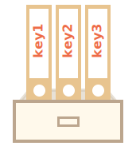
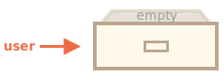
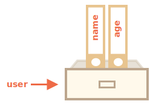
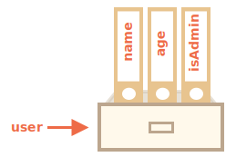
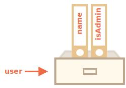
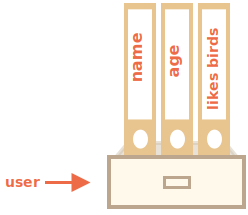

# Object

จากบท <info:types> เรารู้แล้วว่า JavaScript มีชนิดข้อมูลอยู่ 8 ชนิด โดย 7 ชนิดแรกเป็น "primitive" ที่เก็บค่าได้แค่อย่างเดียว (ไม่ว่าจะเป็นสตริง ตัวเลข หรืออะไรก็ตาม)

ส่วนชนิดที่ 8 คือ object — ใช้เก็บข้อมูลเป็นชุดๆ โดยแต่ละชิ้นมี key กำกับไว้ เหมาะสำหรับข้อมูลที่ซับซ้อนขึ้น ใน JavaScript นั้น object มีบทบาทแทบทุกส่วนของภาษา ดังนั้นเราต้องเข้าใจเรื่องนี้ให้ดีก่อนที่จะไปลงลึกเรื่องอื่น

สร้าง object ได้ด้วยวงเล็บปีกกา `{…}` ข้างในใส่ *พร็อพเพอร์ตี้* (property) ได้ตามต้องการ — จะมีกี่ตัวก็ได้ หรือไม่มีเลยก็ได้ พร็อพเพอร์ตี้แต่ละตัวอยู่ในรูป "key: value" โดย `key` เป็นสตริง (เรียกว่า "property name") ส่วน `value` จะเป็นข้อมูลชนิดไหนก็ได้

ลองนึกภาพว่า object ก็เหมือนตู้เอกสารตู้หนึ่ง แต่ละแฟ้มมีป้ายชื่อ (key) กำกับไว้ ทำให้ค้นหาได้ง่าย จะเพิ่มหรือลบแฟ้มก็สะดวก



สร้าง object เปล่าๆ (เปรียบได้กับตู้เอกสารที่ยังไม่มีแฟ้มอยู่เลย) ได้ 2 วิธี:

```js
let user = new Object(); // "object constructor" syntax
let user = {};  // "object literal" syntax
```



โดยทั่วไปจะใช้วงเล็บปีกกา `{...}` กันมากกว่า การประกาศแบบนี้เรียกว่า *object literal*

## Literal และ property

ตอนประกาศ object เราใส่พร็อพเพอร์ตี้เข้าไปใน `{...}` ได้เลย ในรูปแบบ "key: value":

```js
let user = {     // object
  name: "John",  // key ชื่อ "name" เก็บค่า "John"
  age: 30        // key ชื่อ "age" เก็บค่า 30
};
```

พร็อพเพอร์ตี้แต่ละตัวมี key (บางทีเรียกว่า "name" หรือ "identifier") อยู่ก่อนเครื่องหมาย `:` ส่วน value อยู่ทางขวา

ออบเจ็กต์ `user` ที่สร้างขึ้นมามีพร็อพเพอร์ตี้ 2 ตัว:

1. ตัวแรก — key ชื่อ `"name"` เก็บค่า `"John"`
2. ตัวที่สอง — key ชื่อ `"age"` เก็บค่า `30`

เปรียบได้กับตู้เอกสารที่มีแฟ้ม 2 แฟ้ม ติดป้ายว่า "name" และ "age"



จะเพิ่ม ลบ หรืออ่านแฟ้มเมื่อไหร่ก็ได้

เข้าถึงค่าของพร็อพเพอร์ตี้ได้ด้วย dot notation:

```js
// อ่านค่าพร็อพเพอร์ตี้ของออบเจ็กต์:
alert( user.name ); // John
alert( user.age ); // 30
```

ค่าของพร็อพเพอร์ตี้จะเป็นชนิดไหนก็ได้ ลองเพิ่มค่าบูลีนเข้าไปดู:

```js
user.isAdmin = true;
```



ลบพร็อพเพอร์ตี้ออกได้ด้วยตัวดำเนินการ `delete`:

```js
delete user.age;
```



ตั้งชื่อพร็อพเพอร์ตี้เป็นหลายคำ (multiword) ก็ได้ แต่ต้องครอบด้วยเครื่องหมายคำพูด:

```js
let user = {
  name: "John",
  age: 30,
  "likes birds": true  // ชื่อแบบหลายคำต้องอยู่ในเครื่องหมายคำพูด
};
```




พร็อพเพอร์ตี้ตัวสุดท้ายจะลงท้ายด้วย comma ก็ได้:
```js
let user = {
  name: "John",
  age: 30*!*,*/!*
}
```
เครื่องหมายนี้เรียกว่า "trailing" หรือ "hanging" comma — ช่วยให้เพิ่ม/ลบ/ย้ายพร็อพเพอร์ตี้ได้สะดวกขึ้น เพราะทุกบรรทัดมีรูปแบบเหมือนกัน

## Square brackets

พร็อพเพอร์ตี้แบบหลายคำจะใช้ dot notation เข้าถึงไม่ได้:

```js run
// เกิด syntax error
user.likes birds = true
```

เพราะ JavaScript คิดว่าเราต้องการ `user.likes` แล้วเจอ `birds` ที่ไม่คาดคิด จึงฟ้อง syntax error

dot notation กำหนดว่า key ต้องเป็นชื่อที่ถูกต้องตามกฎตั้งชื่อตัวแปร — ห้ามมีช่องว่าง ไม่ขึ้นต้นด้วยตัวเลข และไม่มีอักขระพิเศษ (ยกเว้น `$` กับ `_`)

จึงมีอีกวิธีหนึ่งคือ "square bracket notation" ซึ่งใช้ได้กับชื่อพร็อพเพอร์ตี้แบบไหนก็ได้:

```js run
let user = {};

// กำหนดค่า
user["likes birds"] = true;

// อ่านค่า
alert(user["likes birds"]); // true

// ลบ
delete user["likes birds"];
```

แบบนี้ก็ใช้ได้แล้ว สังเกตว่าสตริงในวงเล็บเหลี่ยมต้องอยู่ในเครื่องหมายคำพูด (จะใช้ single quote หรือ double quote ก็ได้)

วงเล็บเหลี่ยมยังช่วยให้เราดึงชื่อพร็อพเพอร์ตี้จากนิพจน์ใดๆ ได้ด้วย — ไม่จำเป็นต้องเป็นข้อความตายตัว เช่น ดึงจากตัวแปร:

```js
let key = "likes birds";

// เหมือนกันกับ user["likes birds"] = true;
user[key] = true;
```

ตัวแปร `key` อาจถูกกำหนดค่าตอน run-time หรือรับจากผู้ใช้ก็ได้ จากนั้นก็ใช้ค่าตัวแปรเพื่อเข้าถึงพร็อพเพอร์ตี้ — ทำให้ยืดหยุ่นมาก

เช่น:

```js run
let user = {
  name: "John",
  age: 30
};

let key = prompt("ต้องการทราบข้อมูลใดของ user?", "name");

// เข้าถึงข้อมูลด้วยตัวแปร
alert( user[key] ); // John (กรณีที่ผู้ใช้งานป้อนค่า "name")
```

แต่ dot notation ใช้ตัวแปรแทนชื่อพร็อพเพอร์ตี้ไม่ได้:

```js run
let user = {
  name: "John",
  age: 30
};

let key = "name";
alert( user.key ) // undefined
```

### Computed properties

ตอนประกาศ object เราใช้วงเล็บเหลี่ยมใน object literal ได้เช่นกัน เรียกว่า *computed properties*

เช่น:

```js run
let fruit = prompt("ซื้อผลไม้อะไรดี?", "apple");

let bag = {
*!*
  [fruit]: 5, // ชื่อของ property จะรับมาจาก ตัวแปร fruit
*/!*
};

alert( bag.apple ); // 5 กรณีที่ fruit="apple"
```

ความหมายก็ตรงตัว: `[fruit]` หมายถึงเอาค่าจากตัวแปร `fruit` มาเป็นชื่อพร็อพเพอร์ตี้

ถ้าผู้ใช้ป้อน `"apple"` ค่าของ `bag` จะกลายเป็น `{apple: 5}`

ซึ่งทำงานเหมือนกับเขียนแบบนี้:
```js run
let fruit = prompt("Which fruit to buy?", "apple");
let bag = {};

// ใช้ชื่อ property จากตัวแปร fruit
bag[fruit] = 5;
```

...แต่ดูดีกว่า

ใส่นิพจน์ที่ซับซ้อนขึ้นในวงเล็บเหลี่ยมก็ได้:

```js
let fruit = 'apple';
let bag = {
  [fruit + 'Computers']: 5 // bag.appleComputers = 5
};
```

วงเล็บเหลี่ยมทำได้มากกว่า dot notation — ใช้ชื่อพร็อพเพอร์ตี้แบบไหนก็ได้ ตัวแปรก็ได้ แต่เขียนยุ่งกว่า

ดังนั้นถ้าชื่อพร็อพเพอร์ตี้ตายตัวและไม่มีช่องว่าง ก็ใช้ dot notation ไปเลย แต่ถ้าต้องการอะไรซับซ้อนขึ้นก็ค่อยเปลี่ยนมาใช้วงเล็บเหลี่ยม

## Property value shorthand

ในโค้ดจริง เรามักใช้ตัวแปรที่มีชื่อเดียวกับพร็อพเพอร์ตี้เป็นค่า

เช่น:

```js run
function makeUser(name, age) {
  return {
    name: name,
    age: age,
    // ...พร็อพเพอร์ตี้อื่นๆ
  };
}

let user = makeUser("John", 30);
alert(user.name); // John
```

จะเห็นว่าชื่อพร็อพเพอร์ตี้กับชื่อตัวแปรเป็นชื่อเดียวกัน รูปแบบนี้เจอบ่อยมากจนมีวิธีเขียนย่อ เรียกว่า *property value shorthand*

แทนที่จะเขียน `name:name` เราเขียนแค่ `name` ก็พอ:

```js
function makeUser(name, age) {
*!*
  return {
    name, // เหมือนกับเขียนว่า name: name
    age,  // เหมือนกับเขียนว่า age: age
    // ...
  };
*/!*
}
```

จะผสมแบบปกติกับแบบ shorthand ใน object เดียวกันก็ได้:

```js
let user = {
  name,  // เหมือนกับเขียนว่า name:name
  age: 30
};
```


## ข้อจำกัดการตั้งชื่อพร็อพเพอร์ตี้

เรารู้กันแล้วว่าตัวแปรตั้งชื่อเป็น reserved word อย่าง "for", "let", "return" ไม่ได้

แต่พร็อพเพอร์ตี้ของ object ไม่มีข้อจำกัดนี้:

```js run
// ตั้งชื่อพร็อพเพอร์ตี้เป็น reserved word ได้
let obj = {
  for: 1,
  let: 2,
  return: 3
};

alert( obj.for + obj.let + obj.return );  // 6
```

โดยสรุปแล้วไม่มีข้อจำกัดในการตั้งชื่อ — จะเป็นสตริงหรือ symbol (ชนิดข้อมูลพิเศษที่จะกล่าวถึงภายหลัง) ก็ได้

ถ้าใช้ชนิดข้อมูลอื่นเป็นชื่อ จะแปลงเป็นสตริงให้อัตโนมัติ

เช่น ตัวเลข `0` จะกลายเป็นสตริง `"0"` เมื่อใช้เป็น key:

```js run
let obj = {
  0: "test" // same as "0": "test"
};

// alert ทั้งสองเข้าถึงพร็อพเพอร์ตี้ตัวเดียวกัน (ตัวเลข 0 ถูกแปลงเป็นสตริง "0")
alert( obj["0"] ); // test
alert( obj[0] ); // test (พร็อพเพอร์ตี้เดียวกัน)
```

มีข้อควรระวังเล็กน้อยกับพร็อพเพอร์ตี้พิเศษที่ชื่อ `__proto__` — กำหนดค่าที่ไม่ใช่ object ให้ไม่ได้:

```js run
let obj = {};
obj.__proto__ = 5; // กำหนดค่าเป็นตัวเลข
alert(obj.__proto__); // [object Object] - ได้ค่าออกมาเป็น object ไม่ตรงกับที่ตั้งใจไว้
```

จะเห็นว่ากำหนด primitive `5` ไปแต่ไม่เป็นผล

เราจะพูดถึงเรื่อง `__proto__` อีกทีใน[บทถัดๆ ไป](info:prototype-inheritance) พร้อม[วิธีแก้](info:prototype-methods)ปัญหานี้

## การตรวจสอบพร็อพเพอร์ตี้ด้วยตัวดำเนินการ "in"

จุดเด่นอย่างหนึ่งของ object ใน JavaScript ที่ต่างจากหลายภาษาคือ — เข้าถึงพร็อพเพอร์ตี้ใดก็ได้โดยไม่เกิด error แม้ว่าพร็อพเพอร์ตี้นั้นไม่มีอยู่จริงก็ตาม!

ถ้าอ่านพร็อพเพอร์ตี้ที่ไม่มีจะได้ `undefined` กลับมา เราจึงเช็คได้ง่ายๆ แบบนี้:

```js run
let user = {};

alert( user.noSuchProperty === undefined ); // true แปลว่าไม่มีพร็อพเพอร์ตี้นี้
```

นอกจากนี้ยังมีตัวดำเนินการ `"in"` ให้ใช้อีกด้วย

รูปแบบ:
```js
"key" in object
```

เช่น:

```js run
let user = { name: "John", age: 30 };

alert( "age" in user ); // true เพราะ user.age มีอยู่
alert( "blabla" in user ); // false เพราะ user.blabla ไม่มี
```

สังเกตว่าด้านซ้ายของ `in` ต้องเป็น *ชื่อพร็อพเพอร์ตี้* ซึ่งปกติจะเป็นสตริงที่อยู่ในเครื่องหมายคำพูด

ถ้าไม่ใส่เครื่องหมายคำพูด จะกลายเป็นตัวแปรที่เก็บชื่อที่ต้องการเช็ค เช่น:

```js run
let user = { age: 30 };

let key = "age";
alert( *!*key*/!* in user ); // true เพราะ user มีพร็อพเพอร์ตี้ "age"
```

แล้วทำไมต้องมีตัวดำเนินการ `in` อีกล่ะ? เทียบกับ `undefined` ไม่พอเหรอ?

ส่วนใหญ่แล้วเทียบกับ `undefined` ก็ใช้ได้ แต่มีกรณีพิเศษที่ใช้ไม่ได้ ต้องพึ่ง `"in"` แทน

นั่นคือเมื่อพร็อพเพอร์ตี้มีอยู่จริงแต่เก็บค่า `undefined`:

```js run
let obj = {
  test: undefined
};

alert( obj.test ); // ได้ undefined — แปลว่าไม่มีพร็อพเพอร์ตี้นี้จริงเหรอ?

alert( "test" in obj ); // true — จริงๆ แล้วมีอยู่!
```

ในโค้ดด้านบน `obj.test` มีอยู่จริง ตัวดำเนินการ `in` จึงตอบถูก

กรณีแบบนี้เกิดขึ้นน้อยมาก เพราะปกติเราไม่ค่อยกำหนด `undefined` ให้ตรงๆ — ถ้าค่ายัง "ไม่รู้" หรือ "ว่างเปล่า" เรามักใช้ `null` แทน ดังนั้นตัวดำเนินการ `in` จึงไม่ค่อยจำเป็นในโค้ดทั่วไป


## ลูป "for..in" [#forin]

ถ้าต้องการวนทุก key ของ object จะใช้ลูปรูปแบบพิเศษคือ `for..in` ซึ่งต่างจากลูป `for(;;)` ที่เราเรียนมาก่อนหน้านี้อย่างสิ้นเชิง

รูปแบบ:

```js
for (key in object) {
  // โค้ดนี้จะทำงานสำหรับแต่ละ key ของ object
}
```

ลองดูตัวอย่าง — แสดงพร็อพเพอร์ตี้ทั้งหมดของ `user`:

```js run
let user = {
  name: "John",
  age: 30,
  isAdmin: true
};

for (let key in user) {
  // แสดง key
  alert( key );  // ได้ name age และ isAdmin ตามลำดับ
  // แสดงค่าของแต่ละ key
  alert( user[key] ); // ได้ John 30 และ true ตามลำดับ
}
```

สังเกตว่า "for" ทุกแบบให้ประกาศตัวแปรในลูปได้ อย่างตัวอย่างข้างบนคือ `let key`

จะตั้งชื่อตัวแปรเป็นอย่างอื่นก็ได้นะ เช่น `"for (let prop in obj)"` ก็ใช้กันเยอะเหมือนกัน

### การเรียงลำดับของ object

เมื่อทำการลูป object เราจะได้ property ตามลำดับที่เราประกาศไว้หรือไม่?

คำตอบอย่างสั้นคือ: "จะเรียงลำดับแบบพิเศษ": โดย interger property หรือ property ที่มี key เป็นค่าจำนวนเต็มจะถูกเรียงลำดับ ส่วน property ที่เหลือจะเรียงตามลำดับที่สร้าง

ตัวอย่าง พิจารณา object ที่เก็บค่ารหัสโทรศัพท์:

```js run
let codes = {
  "49": "Germany",
  "41": "Switzerland",
  "44": "Great Britain",
  // ..,
  "1": "USA"
};

*!*
for (let code in codes) {
  alert(code); // จะได้ 1, 41, 44, 49 ตามลำดับ
}
*/!*
```

object ด้านบนอาจถูกใช้เก็บตัวเลือกให้ user เลือก สมมติเรากำลังทำเว็บสำหรับชาวเยอรมันเป็นหลัก เราย่อมต้องการให้ `49` แสดงเป็นตัวเลือกแรก

แต่เมื่อเรารันโค้ดเรากลับได้ผลลำดับที่แตกต่างกันกับตอนประกาศอย่างสิ้นเชิง ดังนี้:

- USA (1) มาก่อน
- ตามด้วย Switzerland (41) และอื่นๆ ตามลำดับ

เนื่องมาจากรหัสโทรศัพท์มีค่าเป็นจำนวนเต็มถึงถูกเรียงลำดับจากน้อยไปมาก ดังนี้ `1, 41, 44, 49`

````smart header="Integer properties? What's that?"
คำว่า "integer property" ในที่นี้หมายถึงข้อความสตริงที่สามารถ แปลงเป็นและแปลงจาก จำนวนเต็มได้โดยค่าไม่เปลี่ยนไป

"49" เป็น key ชนิด integer property เพราะไม่ว่าจะแปลงไปหรือแปลงกลับก็จะได้ค่าเดิม แต่สำหรับ "+49" and "1.2" นั้นเมื่อแปลงไปมา จะไม่ได้ค่าเดิม ดังนี้:

```js run
// Math.trunc เป็น built-in function ใช้ตัดส่วนทศนิยมออก
alert( String(Math.trunc(Number("49"))) ); // ได้ "49" เหมือนเดิม เป็น integer property
alert( String(Math.trunc(Number("+49"))) ); // ได้ "49" ไม่เท่ากับ "+49" ⇒ ไม่เป็น integer property
alert( String(Math.trunc(Number("1.2"))) ); // ได้ "1" ไม่เท่ากับ "1.2" ⇒ ไม่เป็น integer property
```
````

...ในทางกลับกัน หาก key เป็นชนิด non-integer หรือก็คือไม่เป็นจำนวนเต็ม จะถูกเรียงตามลำดับของการประกาศ ตัวอย่างเช่น:

```js run
let user = {
  name: "John",
  surname: "Smith"
};
user.age = 25; // เพิ่ม property

*!*
// key ของ property เป็น non-integer จะถูกเรียงตามลำดับการประกาศ
*/!*
for (let prop in user) {
  alert( prop ); // ได้ name surname และ age ตามลำดับ
}
```

ดังนั้น เพื่อแก้ปัญหากรณีรหัสโทรศัพท์ เราสามารถ "โกง" ด้วยการทำให้ key เป็น non-integer โดยการเติมเครื่องหมายบวก `"+"` เข้าไป

Like this:

```js run
let codes = {
  "+49": "Germany",
  "+41": "Switzerland",
  "+44": "Great Britain",
  // ..,
  "+1": "USA"
};

for (let code in codes) {
  alert( +code ); // ได้ 49 41 44 และ 1 เป็นลำดับตามการประกาศ
}
```

ได้โค้ดที่ทำงานตามตั้งใจแล้ว

## สรุป

Object เป็น associative array พร้อมด้วยคุณลักษณะพิเศษหลายอย่าง

ใช้เก็บค่า property (ในรูปแบบคู่ของ key-value) ดังนี้:
- key ของ property ต้องเป็น ข้อความสตริงหรือสัญลักษณ์ (ปรกติจะเป็นข้อความสตริง)
- value เป็นค่าชนิดใดก็ได้

เราสามารถเข้าถึง property โดยการใช้งาน:
- dot notation: `obj.property`.
- วงเล็บเหลี่ยม `obj["property"]` ซึ่งยังอนุญาตให้เราแทนค่า key จากตัวแปร เช่น `obj[varWithKey]` ได้ด้วย

ตัวดำเนินการเพิ่มเติม:
- ลบ property ด้วยตัวกำเนินการ delete: `delete obj.prop`.
- ทดสอบว่ามี property ที่เราสนใจใน object หรือไม่ด้วยตัวดำเนินการ in: `"key" in obj`.
- วนลูปด้วย property ใน object: `for (let key in obj)`

สิ่งที่เราได้ศึกษากันในบทนี้เรียกว่า "plain object" หรือแค่ `Object` เฉยๆ ก็ได้

ยังมี object อยู่อีกหลายชนิดใน JavaScript:

- `Array` สำหรับเก็บข้อมูลเป็นชุดตามลำดับ
- `Date` สำหรับเก็บข้อมูลของวันที่และเวลา
- `Error` สำหรับเก็บข้อมูลของ error
- ...และอื่นๆ อีก

โดยแต่ละชนิดจะมีคุณลักษณะพิเศษที่เราจะศึกษากันต่อไป ในบางครั้งที่มีการพูดถึง "ข้อมูลชนิด array" "ข้อมูลชนิด date" นั้น โดยแท้จริงแล้วไม่ได้มีชนิดข้อมูลเหลานี้แต่อย่างใดแต่เป็นข้อมูลชนิดเดียวกันก็คือ object ซึ่งแต่ละแบบก็ต่อขยายคุณลักษณะเพิ่มเติมแตกต่างกันไป

Object ใน JavaScript มีประโยชน์มาก เราเพิ่งจะได้เรียนรู้หัวข้อที่มีขนาดใหญ่นี้เพียงผิวเผินเท่านั้น เราจะได้ใช้งาน object อยู่ตลอดและจะได้เรียนรู้เพิ่มเติมในส่วนอื่นๆ ของ tutorial ชุดนี้ต่อไปในภายหน้า
