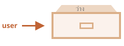
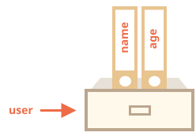
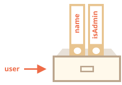

# ออบเจ็กต์

จากบท <info:types> เรารู้แล้วว่า JavaScript มีชนิดข้อมูล 8 ชนิด ในจำนวนนั้นมี 7 ชนิดที่เรียกว่า "primitive" เพราะแต่ละค่าเก็บข้อมูลเพียงอย่างเดียว เช่น สตริงหนึ่งค่า หรือตัวเลขหนึ่งค่า

ส่วนออบเจ็กต์ใช้เก็บข้อมูลหลายค่าโดยมีคีย์กำกับแต่ละค่าไว้ จึงเหมาะกับข้อมูลที่มีโครงสร้างซับซ้อนขึ้น เราจะเจอออบเจ็กต์แทบทุกส่วนของ JavaScript จึงต้องเข้าใจเรื่องนี้ก่อนจะไปลงลึกเรื่องอื่น

เราสร้างออบเจ็กต์ได้ด้วยวงเล็บปีกกา `{…}` ข้างในจะใส่ *พร็อพเพอร์ตี้* กี่ตัวก็ได้ หรือไม่ใส่เลยก็ได้ พร็อพเพอร์ตี้แต่ละตัวเป็นคู่ `คีย์: ค่า` โดยคีย์เป็นสตริง (เรียกอีกอย่างว่า "ชื่อพร็อพเพอร์ตี้") ส่วนค่าจะเป็นข้อมูลชนิดไหนก็ได้

ลองนึกว่าออบเจ็กต์เป็นตู้เอกสาร แต่ละแฟ้มเก็บข้อมูลหนึ่งชิ้นและมีคีย์เป็นป้ายชื่อกำกับ จะหาแฟ้มจากชื่อ หรือเพิ่มและลบแฟ้มก็ทำได้ง่าย


ออบเจ็กต์เปล่า หรือ "ตู้ที่ยังไม่มีแฟ้ม" สร้างได้ 2 รูปแบบ:

```js
let user = new Object(); // รูปแบบ "คอนสตรักเตอร์ของออบเจ็กต์"
let user = {};  // รูปแบบ "object literal"
```



ปกติเราจะใช้วงเล็บปีกกา `{...}` รูปแบบนี้เรียกว่า *object literal*

## Object literal และพร็อพเพอร์ตี้

ตอนสร้างออบเจ็กต์ เราใส่พร็อพเพอร์ตี้ลงใน `{...}` เป็นคู่ `คีย์: ค่า` ได้ทันที:

```js
let user = {     // ออบเจ็กต์
  name: "John",  // คีย์ "name" เก็บค่า "John"
  age: 30        // คีย์ "age" เก็บค่า 30
};
```

ในแต่ละพร็อพเพอร์ตี้ คีย์ (เรียกอีกอย่างว่า "ชื่อ" หรือ "ตัวระบุ" ซึ่งภาษาอังกฤษใช้คำว่า identifier) อยู่หน้าเครื่องหมายโคลอน `:` ส่วนค่าอยู่ด้านขวา

ออบเจ็กต์ `user` มีพร็อพเพอร์ตี้ 2 ตัว:

1. พร็อพเพอร์ตี้แรกชื่อ `"name"` เก็บค่า `"John"`
2. พร็อพเพอร์ตี้ที่สองชื่อ `"age"` เก็บค่า `30`

ถ้าเทียบกับตู้เอกสาร ตอนนี้ตู้ `user` ก็มีแฟ้ม 2 แฟ้ม ติดป้ายว่า "name" และ "age"



เราจะอ่าน เพิ่ม หรือลบแฟ้มเมื่อไรก็ได้

เราอ่านค่าพร็อพเพอร์ตี้ได้ด้วยการเขียนชื่อไว้หลังจุด รูปแบบนี้เรียกว่า dot notation:

```js
// อ่านค่าพร็อพเพอร์ตี้ของออบเจ็กต์:
alert( user.name ); // John
alert( user.age ); // 30
```

ค่าของพร็อพเพอร์ตี้จะเป็นข้อมูลชนิดไหนก็ได้ ลองเพิ่มค่าบูลีนเข้าไป:

```js
user.isAdmin = true;
```


ถ้าต้องการลบพร็อพเพอร์ตี้ ให้ใช้ตัวดำเนินการ `delete`:

```js
delete user.age;
```



ชื่อพร็อพเพอร์ตี้มีหลายคำได้ แต่ต้องครอบชื่อด้วยเครื่องหมายคำพูด:

```js
let user = {
  name: "John",
  age: 30,
  "likes birds": true  // ชื่อพร็อพเพอร์ตี้ที่มีหลายคำต้องครอบด้วยเครื่องหมายคำพูด
};
```


พร็อพเพอร์ตี้ตัวสุดท้ายในรายการจะลงท้ายด้วย comma ก็ได้:
```js
let user = {
  name: "John",
  age: 30*!*,*/!*
}
```
เครื่องหมายนี้เรียกว่า "trailing comma" หรือ "hanging comma" ช่วยให้เพิ่ม ลบ หรือย้ายพร็อพเพอร์ตี้ได้สะดวก เพราะทุกบรรทัดมีรูปแบบเหมือนกัน

## วงเล็บเหลี่ยม

ถ้าชื่อพร็อพเพอร์ตี้มีหลายคำ เราจะเข้าถึงด้วย dot notation ไม่ได้:

```js run
// บรรทัดนี้ทำให้เกิด syntax error
user.likes birds = true
```

JavaScript ไม่เข้าใจว่า `likes birds` เป็นชื่อเดียวกัน แต่จะมองว่าเรากำลังเข้าถึง `user.likes` แล้วพบคำว่า `birds` ในตำแหน่งที่ไม่ควรอยู่ จึงเกิด syntax error

คีย์ที่ใช้กับ dot notation ต้องเขียนได้ในรูป `IdentifierName` เช่น `name`, `_id`, `$value` หรือ `ชื่อ` แต่ห้ามมีช่องว่าง ขึ้นต้นด้วยตัวเลข หรือใส่เครื่องหมายอย่าง `-`

ถ้าต้องใช้ชื่อแบบอื่น ให้เขียนด้วยวงเล็บเหลี่ยม รูปแบบนี้เรียกว่า "square bracket notation" และรองรับสตริงทุกแบบ:

```js run
let user = {};

// กำหนดค่า
user["likes birds"] = true;

// อ่านค่า
alert(user["likes birds"]); // true

// ลบ
delete user["likes birds"];
```

ทีนี้โค้ดก็ทำงานได้ สังเกตว่าสตริงในวงเล็บเหลี่ยมต้องครอบด้วยเครื่องหมายคำพูด จะใช้เครื่องหมายคำพูดแบบไหนก็ได้

วงเล็บเหลี่ยมยังรับชื่อพร็อพเพอร์ตี้ที่ได้จากนิพจน์ ไม่จำเป็นต้องเขียนเป็นสตริงตายตัว เช่น เราใช้ค่าจากตัวแปรได้แบบนี้:

```js
let key = "likes birds";

// เหมือนกับ user["likes birds"] = true;
user[key] = true;
```

ค่าในตัวแปร `key` อาจมาจากการคำนวณตอนโปรแกรมทำงาน หรือมาจากข้อมูลที่ผู้ใช้ป้อนก็ได้ แล้วเราค่อยนำค่านั้นไปเข้าถึงพร็อพเพอร์ตี้ วิธีนี้จึงยืดหยุ่นมาก

ตัวอย่างเช่น:

```js run
let user = {
  name: "John",
  age: 30
};

let key = prompt("What do you want to know about the user?", "name");

// เข้าถึงพร็อพเพอร์ตี้ด้วยตัวแปร
alert( user[key] ); // John (ถ้าป้อน "name")
```

ส่วน dot notation ใช้ตัวแปรแทนชื่อพร็อพเพอร์ตี้แบบนี้ไม่ได้:

```js run
let user = {
  name: "John",
  age: 30
};

let key = "name";
alert( user.key ) // undefined
```

บรรทัดสุดท้ายจะหาเฉพาะพร็อพเพอร์ตี้ชื่อ `key` ไม่ได้นำค่าจากตัวแปร `key` มาใช้ จึงได้ `undefined`

### Computed properties

เรายังใช้วงเล็บเหลี่ยมใน object literal ตอนสร้างออบเจ็กต์ได้ด้วย รูปแบบนี้เรียกว่า *computed properties*

ตัวอย่างเช่น:

```js run
let fruit = prompt("Which fruit to buy?", "apple");

let bag = {
*!*
  [fruit]: 5, // นำค่าจากตัวแปร fruit มาเป็นชื่อพร็อพเพอร์ตี้
*/!*
};

alert( bag.apple ); // 5 ถ้า fruit="apple"
```

ความหมายของ computed property ตรงไปตรงมา: `[fruit]` บอกให้ใช้ค่าจาก `fruit` เป็นชื่อพร็อพเพอร์ตี้

ถ้าผู้ใช้ป้อน `"apple"` ออบเจ็กต์ `bag` ก็จะกลายเป็น `{apple: 5}`

โค้ดนี้ทำงานเหมือนกับ:
```js run
let fruit = prompt("Which fruit to buy?", "apple");
let bag = {};

// นำชื่อพร็อพเพอร์ตี้มาจากตัวแปร fruit
bag[fruit] = 5;
```

แต่เขียน computed property ไว้ใน object literal ตั้งแต่แรกจะกระชับกว่า

ในวงเล็บเหลี่ยมจะใส่นิพจน์ที่ซับซ้อนขึ้นก็ได้:

```js
let fruit = 'apple';
let bag = {
  [fruit + 'Computers']: 5 // bag.appleComputers = 5
};
```

วงเล็บเหลี่ยมยืดหยุ่นกว่า dot notation เพราะรองรับทั้งชื่อพร็อพเพอร์ตี้แบบต่าง ๆ และค่าจากตัวแปร แต่ก็เขียนยาวกว่า

ดังนั้น ถ้ารู้ชื่อพร็อพเพอร์ตี้อยู่แล้วและชื่อไม่ซับซ้อน เรามักใช้ dot notation แต่เมื่อชื่อต้องคำนวณหรือมีรูปแบบพิเศษ ค่อยใช้วงเล็บเหลี่ยม

## Property value shorthand

ในโค้ดจริง เรามักนำค่าจากตัวแปรที่มีอยู่แล้วมาใส่ในพร็อพเพอร์ตี้

ตัวอย่างเช่น:

```js run
function makeUser(name, age) {
  return {
    name: name,
    age: age,
    // ...พร็อพเพอร์ตี้อื่น ๆ
  };
}

let user = makeUser("John", 30);
alert(user.name); // John
```

ในตัวอย่างนี้ ชื่อพร็อพเพอร์ตี้ตรงกับชื่อตัวแปรพอดี รูปแบบนี้ใช้บ่อยจน JavaScript มี *property value shorthand* ให้เขียนสั้นลง

แทนที่จะเขียน `name:name` เราเขียนเพียง `name` ได้:

```js
function makeUser(name, age) {
*!*
  return {
    name, // เหมือนกับ name: name
    age,  // เหมือนกับ age: age
    // ...
  };
*/!*
}
```

จะใช้พร็อพเพอร์ตี้แบบปกติกับแบบ shorthand ในออบเจ็กต์เดียวกันก็ได้:

```js
let user = {
  name,  // เหมือนกับ name:name
  age: 30
};
```


## ข้อจำกัดของชื่อพร็อพเพอร์ตี้

เรารู้แล้วว่าตัวแปรใช้คำสงวนของภาษาอย่าง `for`, `let` หรือ `return` เป็นชื่อไม่ได้

แต่ชื่อพร็อพเพอร์ตี้ของออบเจ็กต์ไม่มีข้อจำกัดนี้:

```js run
// พร็อพเพอร์ตี้เหล่านี้ใช้ได้ทั้งหมด
let obj = {
  for: 1,
  let: 2,
  return: 3
};

alert( obj.for + obj.let + obj.return );  // 6
```

สรุปคือชื่อพร็อพเพอร์ตี้เป็นสตริงหรือ symbol แบบไหนก็ได้ โดย symbol เป็นชนิดข้อมูลพิเศษสำหรับใช้เป็นตัวระบุ ซึ่งเราจะเรียนกันภายหลัง

ถ้าใช้ข้อมูลชนิดอื่นเป็นคีย์ JavaScript จะแปลงค่านั้นเป็นสตริงให้อัตโนมัติ

ตัวอย่างเช่น เมื่อใช้ตัวเลข `0` เป็นคีย์ มันจะกลายเป็นสตริง `"0"`:

```js run
let obj = {
  0: "test" // เหมือนกับ "0": "test"
};

// alert ทั้งสองบรรทัดเข้าถึงพร็อพเพอร์ตี้เดียวกัน (ตัวเลข 0 ถูกแปลงเป็นสตริง "0")
alert( obj["0"] ); // test
alert( obj[0] ); // test (พร็อพเพอร์ตี้เดียวกัน)
```

มีจุดที่ต้องระวังเล็กน้อยเมื่อใช้พร็อพเพอร์ตี้พิเศษชื่อ `__proto__` พร็อพเพอร์ตี้นี้รับเฉพาะออบเจ็กต์หรือ `null` ถ้ากำหนด primitive ค่าอื่น JavaScript จะไม่เปลี่ยนค่าให้:

```js run
let obj = {};
obj.__proto__ = 5; // กำหนดตัวเลข
alert(obj.__proto__); // [object Object] - ค่ายังคงเป็นออบเจ็กต์ ไม่ได้ผลตามที่ตั้งใจ
```

จากโค้ดจะเห็นว่า JavaScript ไม่เปลี่ยนค่า `__proto__` เมื่อเรากำหนด primitive `5` ให้มัน

เราจะอธิบายความพิเศษของ `__proto__` ใน[บทถัดไป](info:prototype-inheritance) พร้อมกับดู[วิธีแก้พฤติกรรมนี้](info:prototype-methods)

## ตรวจว่ามีพร็อพเพอร์ตี้หรือไม่ด้วยตัวดำเนินการ `in`

ออบเจ็กต์ใน JavaScript ต่างจากหลายภาษาตรงที่เราลองเข้าถึงพร็อพเพอร์ตี้ชื่อใดก็ได้ แม้พร็อพเพอร์ตี้นั้นไม่มีอยู่ก็ไม่เกิด error

การอ่านพร็อพเพอร์ตี้ที่ไม่มีอยู่จะได้ `undefined` เราจึงใช้ค่านี้ตรวจได้ว่ามีพร็อพเพอร์ตี้หรือไม่:

```js run
let user = {};

alert( user.noSuchProperty === undefined ); // true หมายถึง "ไม่มีพร็อพเพอร์ตี้นี้"
```

อีกวิธีคือตรวจด้วยตัวดำเนินการ `in`

รูปแบบคือ:
```js
"key" in object
```

ตัวอย่างเช่น:

```js run
let user = { name: "John", age: 30 };

alert( "age" in user ); // true เพราะมี user.age
alert( "blabla" in user ); // false เพราะไม่มี user.blabla
```

ด้านซ้ายของ `in` ต้องเป็น *ชื่อพร็อพเพอร์ตี้* ซึ่งปกติจะเขียนเป็นสตริงในเครื่องหมายคำพูด

ถ้าไม่ใส่เครื่องหมายคำพูด JavaScript จะมองด้านซ้ายเป็นตัวแปร และนำค่าที่ตัวแปรเก็บไว้มาเป็นชื่อที่ต้องการตรวจ ตัวอย่างเช่น:

```js run
let user = { age: 30 };

let key = "age";
alert( *!*key*/!* in user ); // true เพราะมีพร็อพเพอร์ตี้ "age"
```

แล้วทำไมต้องมีตัวดำเนินการ `in` ในเมื่อเทียบกับ `undefined` ได้อยู่แล้ว?

ส่วนใหญ่การเทียบกับ `undefined` ใช้ได้ดี แต่มีกรณีพิเศษที่วิธีนี้แยกไม่ออก ขณะที่ `in` ยังให้คำตอบถูกต้อง

กรณีนั้นคือพร็อพเพอร์ตี้มีอยู่จริง แต่เก็บค่า `undefined`:

```js run
let obj = {
  test: undefined
};

alert( obj.test ); // ได้ undefined แล้วแปลว่าไม่มีพร็อพเพอร์ตี้นี้หรือเปล่า?

alert( "test" in obj ); // true เพราะพร็อพเพอร์ตี้นี้มีอยู่จริง!
```

ในตัวอย่างนี้ `obj.test` มีอยู่จริง ตัวดำเนินการ `in` จึงตรวจได้ถูกต้อง

กรณีแบบนี้พบไม่บ่อย เพราะโดยทั่วไปเราไม่กำหนด `undefined` ให้พร็อพเพอร์ตี้โดยตรง ถ้าต้องการสื่อว่าค่า "ไม่ทราบ" หรือ "ว่าง" เรามักใช้ `null` ดังนั้นจึงไม่ค่อยเจอตัวดำเนินการ `in` ในโค้ดทั่วไป


## ลูป "for..in" [#forin]

ถ้าต้องการวนดูทุกคีย์ของออบเจ็กต์ ให้ใช้ลูปแบบ `for..in` ซึ่งเป็นคนละรูปแบบกับ `for(;;)` ที่เรียนมาก่อนหน้านี้

รูปแบบการเขียนคือ:

```js
for (key in object) {
  // ทำงานหนึ่งรอบต่อหนึ่งคีย์ของพร็อพเพอร์ตี้ในออบเจ็กต์
}
```

ลองแสดงพร็อพเพอร์ตี้ทั้งหมดของ `user`:

```js run
let user = {
  name: "John",
  age: 30,
  isAdmin: true
};

for (let key in user) {
  // คีย์
  alert( key );  // name, age, isAdmin
  // ค่าของแต่ละคีย์
  alert( user[key] ); // John, 30, true
}
```

ลูป `for` ทุกรูปแบบให้เราประกาศตัวแปรสำหรับวนลูปไว้ด้านในได้ ในตัวอย่างนี้คือ `let key`

ตัวแปรนี้ไม่จำเป็นต้องชื่อ `key` จะใช้ชื่ออื่นก็ได้ เช่น `for (let prop in obj)` ก็เป็นรูปแบบที่พบได้บ่อย

### ลำดับของพร็อพเพอร์ตี้ในออบเจ็กต์

พร็อพเพอร์ตี้ในออบเจ็กต์มีลำดับหรือไม่? ถ้าวนลูปออบเจ็กต์ เราจะได้พร็อพเพอร์ตี้ตามลำดับที่เพิ่มเข้าไปเสมอและเชื่อถือได้หรือเปล่า?

คำตอบสั้น ๆ คือ "มีลำดับแบบพิเศษ" พร็อพเพอร์ตี้ที่มีคีย์แบบ array index จะเรียงจากน้อยไปมาก ส่วนพร็อพเพอร์ตี้อื่นจะเรียงตามลำดับที่สร้าง รายละเอียดเป็นแบบนี้

ลองดูออบเจ็กต์ที่เก็บรหัสโทรศัพท์:

```js run
let codes = {
  "49": "Germany",
  "41": "Switzerland",
  "44": "Great Britain",
  // ..,
  "1": "USA"
};

*!*
for (let code in codes) {
  alert(code); // 1, 41, 44, 49
}
*/!*
```

เราอาจใช้ออบเจ็กต์นี้สร้างรายการตัวเลือกให้ผู้ใช้ ถ้าเว็บทำมาเพื่อผู้ใช้ชาวเยอรมันเป็นหลัก ก็คงอยากให้รหัส `49` อยู่เป็นตัวเลือกแรก

แต่เมื่อรันโค้ด ลำดับที่ได้กลับเป็นแบบนี้:

- สหรัฐอเมริกา (1) มาก่อน
- จากนั้นเป็นสวิตเซอร์แลนด์ (41) แล้วจึงตามด้วยประเทศอื่น

รหัสโทรศัพท์เหล่านี้เป็นคีย์แบบ array index จึงเรียงจากน้อยไปมากเป็น `1, 41, 44, 49`

````smart header="คีย์แบบ array index คืออะไร?"
คีย์แบบ array index คือสตริงที่แทนจำนวนเต็มตั้งแต่ `0` ถึง `4294967294` และเมื่อแปลงเป็นตัวเลขแล้วแปลงกลับเป็นสตริงจะต้องได้ค่าเดิม

ดังนั้น `"49"` จึงเป็นคีย์แบบ array index เพราะแปลงไปแล้วแปลงกลับยังได้ค่าเดิม ส่วน `"+49"` และ `"1.2"` ไม่ใช่:

```js run
// Number(...) แปลงค่าเป็นตัวเลขโดยตรง
// Math.trunc เป็นฟังก์ชันที่มีอยู่ในภาษา ใช้ตัดส่วนทศนิยมออก
alert( String(Math.trunc(Number("49"))) ); // "49" ค่าเดิม จึงเป็นคีย์แบบ array index
alert( String(Math.trunc(Number("+49"))) ); // "49" ไม่เหมือน "+49" ⇒ ไม่ใช่คีย์แบบ array index
alert( String(Math.trunc(Number("1.2"))) ); // "1" ไม่เหมือน "1.2" ⇒ ไม่ใช่คีย์แบบ array index
```
````

ส่วนคีย์แบบสตริงที่ไม่ใช่ array index จะเรียงตามลำดับที่สร้าง ตัวอย่างเช่น:

```js run
let user = {
  name: "John",
  surname: "Smith"
};
user.age = 25; // เพิ่มอีกหนึ่งพร็อพเพอร์ตี้

*!*
// คีย์แบบสตริงที่ไม่ใช่ array index จะเรียงตามลำดับที่สร้าง
*/!*
for (let prop in user) {
  alert( prop ); // name, surname, age
}
```

ถ้าต้องการแก้ปัญหาลำดับรหัสโทรศัพท์ เรา "พลิกแพลง" ให้รหัสไม่ใช่คีย์แบบ array index ได้ เพียงเติมเครื่องหมายบวก `"+"` ไว้ข้างหน้าแต่ละรหัส

เขียนแบบนี้:

```js run
let codes = {
  "+49": "Germany",
  "+41": "Switzerland",
  "+44": "Great Britain",
  // ..,
  "+1": "USA"
};

for (let code in codes) {
  alert( +code ); // 49, 41, 44, 1
}
```

ทีนี้ลำดับก็เป็นไปตามที่ต้องการ

## สรุป

ออบเจ็กต์มีลักษณะเหมือนอาร์เรย์ที่จับคู่คีย์กับค่า หรือ associative array แต่มีความสามารถพิเศษเพิ่มเข้ามา

ออบเจ็กต์เก็บพร็อพเพอร์ตี้เป็นคู่คีย์กับค่า โดย:
- คีย์ของพร็อพเพอร์ตี้ต้องเป็นสตริงหรือ symbol ซึ่งส่วนใหญ่เป็นสตริง
- ค่าจะเป็นข้อมูลชนิดไหนก็ได้

การเข้าถึงพร็อพเพอร์ตี้ทำได้ 2 แบบ:
- dot notation: `obj.property`
- square bracket notation: `obj["property"]` วงเล็บเหลี่ยมใช้คีย์จากตัวแปรได้ เช่น `obj[varWithKey]`

ตัวดำเนินการและรูปแบบที่ควรรู้:
- ลบพร็อพเพอร์ตี้ด้วย `delete obj.prop`
- ตรวจว่ามีพร็อพเพอร์ตี้ตามคีย์ที่กำหนดหรือไม่ด้วย `"key" in obj`
- วนดูพร็อพเพอร์ตี้ด้วยลูป `for (let key in obj)`

ออบเจ็กต์ที่เรียนในบทนี้เรียกว่า "plain object" หรือเรียกสั้น ๆ ว่า `Object`

JavaScript ยังมีออบเจ็กต์แบบอื่นอีกมาก เช่น:

- `Array` สำหรับเก็บชุดข้อมูลที่มีลำดับ
- `Date` สำหรับเก็บข้อมูลวันที่และเวลา
- `Error` สำหรับเก็บข้อมูลเกี่ยวกับ error
- และอื่น ๆ

ออบเจ็กต์แต่ละแบบมีความสามารถเฉพาะตัวที่เราจะได้เรียนต่อไป บางครั้งเราอาจได้ยินคำว่า "ชนิด Array" หรือ "ชนิด Date" แต่ตามนิยามแล้ว ทั้งสองอย่างไม่ใช่ชนิดข้อมูลที่แยกออกมาเอง แต่จัดอยู่ในชนิดข้อมูลออบเจ็กต์เหมือนกัน เพียงต่อยอดความสามารถออกไปคนละแบบ

ออบเจ็กต์ใน JavaScript ทำอะไรได้อีกมาก บทนี้เป็นเพียงจุดเริ่มต้นเท่านั้น จากนี้เราจะได้ใช้ออบเจ็กต์และเรียนรู้เรื่องนี้ให้ลึกขึ้นตลอดบทต่อ ๆ ไป
