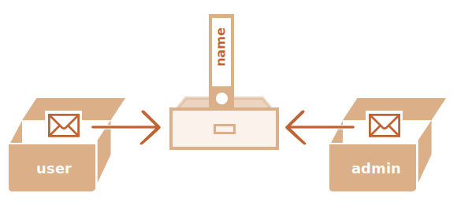

# การอ้างอิงและการคัดลอกออบเจ็กต์

หนึ่งในความแตกต่างสำคัญระหว่างออบเจ็กต์กับข้อมูลพื้นฐาน คือออบเจ็กต์ถูกจัดเก็บและคัดลอก "โดยการอ้างอิง" ในขณะที่ค่าพื้นฐานอย่างเช่น string, number, boolean เป็นต้น จะถูกคัดลอกเป็น "ค่าทั้งหมด" เสมอ

เราจะเข้าใจได้ง่ายขึ้นหากดูลึกลงไปว่ามีอะไรเกิดขึ้นเมื่อเราคัดลอกค่า

เริ่มต้นด้วยข้อมูลพื้นฐาน เช่น string

ที่นี่เราคัดลอก `message` ใส่ในตัวแปร `phrase`:

```js
let message = "Hello!";
let phrase = message;
```

ผลลัพธ์คือเรามีสองตัวแปรที่เป็นอิสระต่อกัน แต่ละตัวเก็บค่า string `"Hello!"` 


ผลลัพธ์ค่อนข้างชัดเจน ใช่ไหม?

แต่ออบเจ็กต์ไม่เป็นแบบนั้น

**ตัวแปรที่กำหนดให้กับออบเจ็กต์จะไม่ได้เก็บตัวออบเจ็กต์เอง แต่จะเก็บ "ที่อยู่ในหน่วยความจำ" หรือพูดอีกอย่างคือ "การอ้างอิง" ไปยังออบเจ็กต์นั้น**

มาดูตัวอย่างของตัวแปรแบบนี้:

```js
let user = {
  name: "John"
};
```

และนี่คือวิธีที่มันถูกเก็บในหน่วยความจำจริงๆ:


ออบเจ็กต์จะถูกเก็บไว้ที่ใดที่หนึ่งในหน่วยความจำ (ทางขวาของภาพ) ในขณะที่ตัวแปร `user` (ทางซ้าย) มี "การอ้างอิง" ไปยังมัน

เราอาจมองตัวแปรออบเจ็กต์อย่าง `user` เหมือนกระดาษแผ่นหนึ่งที่มีที่อยู่ของออบเจ็กต์เขียนอยู่

เมื่อเราดำเนินการกับออบเจ็กต์ เช่น เข้าถึงพร็อพเพอร์ตี้ `user.name` เอนจิ้น JavaScript จะไปดูที่ที่อยู่นั้นและดำเนินการกับออบเจ็กต์ที่เก็บอยู่จริง

ตอนนี้เราจะเข้าใจความสำคัญของเรื่องนี้

**เมื่อตัวแปรออบเจ็กต์ถูกคัดลอก การอ้างอิงจะถูกคัดลอก แต่ตัวออบเจ็กต์เองจะไม่ถูกทำสำเนา**

ตัวอย่างเช่น:

```js no-beautify
let user = { name: "John" };

let admin = user; // คัดลอกการอ้างอิง
```

ตอนนี้เรามีสองตัวแปร แต่ละตัวเก็บการอ้างอิงไปยังออบเจ็กต์เดียวกัน:



อย่างที่เห็น ยังคงมีแค่ออบเจ็กต์เดียว แต่ตอนนี้มีสองตัวแปรที่อ้างอิงถึงมัน

เราสามารถใช้ตัวแปรใดก็ได้เพื่อเข้าถึงออบเจ็กต์และแก้ไขเนื้อหาของมัน:

```js run
let user = { name: 'John' };

let admin = user;

*!*
admin.name = 'Pete'; // เปลี่ยนโดยใช้การอ้างอิง "admin"
*/!*

alert(*!*user.name*/!*); // 'Pete', การเปลี่ยนแปลงจะเห็นได้จากการอ้างอิง "user" ด้วย
```

เปรียบเหมือนเรามีตู้ตั้งอยู่และมีกุญแจสองดอก แล้วเราใช้กุญแจดอกหนึ่ง (`admin`) ในการเข้าไปเปลี่ยนแปลงข้างใน จากนั้นถ้าเราใช้กุญแจอีกดอก (`user`) เราก็ยังคงเปิดตู้ใบเดิมและสามารถเข้าถึงข้อมูลที่ถูกเปลี่ยนไปได้

## การเปรียบเทียบโดยใช้การอ้างอิง

สองออบเจ็กต์จะเท่ากันก็ต่อเมื่อมันเป็นออบเจ็กต์เดียวกันเท่านั้น

ตัวอย่างเช่น ในกรณีนี้ `a` และ `b` อ้างอิงถึงออบเจ็กต์เดียวกัน ดังนั้นจึงเท่ากัน:

```js run
let a = {};
let b = a; // คัดลอกการอ้างอิง

alert( a == b ); // true, ตัวแปรทั้งสองอ้างอิงถึงออบเจ็กต์เดียวกัน
alert( a === b ); // true
```

และในกรณีนี้ ออบเจ็กต์สองตัวที่เป็นอิสระจากกัน ไม่เท่ากัน แม้ว่าจะดูเหมือนกัน (เป็นออบเจ็กต์ว่างทั้งคู่):

```js run
let a = {};
let b = {}; // ออบเจ็กต์สองตัวที่แยกจากกัน

alert( a == b ); // false
```

สำหรับการเปรียบเทียบอย่างเช่น `obj1 > obj2` หรือการเปรียบเทียบกับค่าพื้นฐานอย่าง `obj == 5` ออบเจ็กต์จะถูกแปลงเป็นค่าพื้นฐาน เราจะศึกษาวิธีการแปลงออบเจ็กต์ในเร็วๆ นี้ แต่ตามความเป็นจริงแล้ว การเปรียบเทียบลักษณะนั้นมักไม่ค่อยจำเป็น -- โดยส่วนใหญ่มักเกิดจากข้อผิดพลาดในการเขียนโปรแกรม

````smart header="ออบเจ็กต์ const ยังสามารถแก้ไขได้"
ผลข้างเคียงสำคัญของการเก็บออบเจ็กต์แบบอ้างอิงคือ ออบเจ็กต์ที่ประกาศเป็น `const` *สามารถ* ถูกแก้ไขได้

ตัวอย่างเช่น:

```js run
const user = {
  name: "John"
};

*!*
user.name = "Pete"; // (*)
*/!*

alert(user.name); // Pete
```

ดูเหมือนว่าบรรทัดที่ `(*)` น่าจะทำให้เกิดข้อผิดพลาด แต่จริงๆ แล้วไม่ ค่าของ `user` ยังคงไม่เปลี่ยนแปลง มันยังอ้างอิงถึงออบเจ็กต์เดิม แต่คุณสมบัติของออบเจ็กต์นั้นสามารถเปลี่ยนแปลงได้โดยอิสระ

อีกนัยหนึ่ง `const user` จะให้ข้อผิดพลาดก็ต่อเมื่อเราพยายามกำหนด `user=...` ใหม่ทั้งหมด

อย่างไรก็ตาม หากเราต้องการทำให้คุณสมบัติของออบเจ็กต์คงที่จริงๆ ก็สามารถทำได้ แต่ต้องใช้วิธีที่แตกต่างออกไป เราจะกล่าวถึงเรื่องนี้ในบท <info:property-descriptors>
````

## การโคลนและการรวมออบเจ็กต์ด้วย Object.assign [#cloning-and-merging-object-assign]

ดังนั้น การคัดลอกตัวแปรออบเจ็กต์จะสร้างการอ้างอิงเพิ่มอีกอันไปยังออบเจ็กต์เดียวกัน

แต่ถ้าเราต้องการทำสำเนาออบเจ็กต์ล่ะ?

เราสามารถสร้างออบเจ็กต์ใหม่และทำซ้ำโครงสร้างของออบเจ็กต์เดิมได้ โดยการวนลูปผ่านคุณสมบัติทั้งหมดของมัน แล้วคัดลอกค่าพื้นฐานของแต่ละคุณสมบัติ

แบบนี้:

```js run
let user = {
  name: "John",
  age: 30
};

*!*
let clone = {}; // ออบเจ็กต์เปล่าใหม่

// คัดลอกคุณสมบัติทั้งหมดของ user ใส่ในออบเจ็กต์ clone
for (let key in user) {
  clone[key] = user[key];
}
*/!*

// ตอนนี้ clone เป็นออบเจ็กต์ที่เป็นอิสระอย่างสมบูรณ์แล้ว แต่มีเนื้อหาเหมือนกับ user
clone.name = "Pete"; // เปลี่ยนข้อมูลใน clone

alert( user.name ); // ในออบเจ็กต์ต้นฉบับยังคงเป็น John อยู่
```

เรายังสามารถใช้เมท็อด [Object.assign](https://developer.mozilla.org/en-US/docs/Web/JavaScript/Reference/Global_Objects/Object/assign) ได้ด้วย

รูปแบบการใช้งานคือ:

```js
Object.assign(dest, ...sources)
```

- อาร์กิวเมนต์แรก `dest` คือออบเจ็กต์ปลายทาง (target)
- อาร์กิวเมนต์ถัดๆ ไปคือรายการออบเจ็กต์ต้นทาง (sources)

มันจะคัดลอกคุณสมบัติทั้งหมดจากออบเจ็กต์ต้นทางไปใส่ในออบเจ็กต์ปลายทาง `dest` แล้วคืนค่า `dest` เป็นผลลัพธ์

ตัวอย่างเช่น สมมติเรามีออบเจ็กต์ `user` ลองเพิ่มสิทธิ์การเข้าถึง (permissions) สองอย่างให้กับมัน:

```js run
let user = { name: "John" };

let permissions1 = { canView: true };
let permissions2 = { canEdit: true };

*!*
// คัดลอกคุณสมบัติทั้งหมดจาก permissions1 และ permissions2 ไปใส่ใน user
Object.assign(user, permissions1, permissions2);
*/!*

// ตอนนี้ user = { name: "John", canView: true, canEdit: true }
alert(user.name); // John
alert(user.canView); // true
alert(user.canEdit); // true
```

ถ้าชื่อคุณสมบัติที่คัดลอกซ้ำกับที่มีอยู่แล้ว ค่าจะถูกเขียนทับ:

```js run
let user = { name: "John" };

Object.assign(user, { name: "Pete" });

alert(user.name); // ตอนนี้ user = { name: "Pete" }
```

เรายังสามารถใช้ `Object.assign` เพื่อโคลนออบเจ็กต์อย่างง่ายๆ ได้ด้วย:

```js run
let user = {
  name: "John",
  age: 30
};

*!*
let clone = Object.assign({}, user);
*/!*

alert(clone.name); // John
alert(clone.age); // 30
```

ตรงนี้มันจะคัดลอกคุณสมบัติทั้งหมดของ `user` ไปใส่ในออบเจ็กต์เปล่า แล้วคืนออบเจ็กต์นั้นเป็นผลลัพธ์

มีวิธีอื่นๆ ในการโคลนออบเจ็กต์ด้วย เช่น การใช้ [spread syntax](info:rest-parameters-spread) `clone = {...user}` ซึ่งเราจะกล่าวถึงในภายหลังของบทเรียน

## การโคลนแบบซ้อน (Nested cloning)

จนถึงตอนนี้ เราสมมติว่าคุณสมบัติทั้งหมดของ `user` เป็นข้อมูลพื้นฐาน แต่ในความเป็นจริง คุณสมบัติสามารถเป็นการอ้างอิงไปยังออบเจ็กต์อื่นก็ได้

ตัวอย่างเช่น:
```js run
let user = {
  name: "John",
  sizes: {
    height: 182,
    width: 50
  }
};

alert( user.sizes.height ); // 182
```

ตอนนี้ การคัดลอกแบบ `clone.sizes = user.sizes` ไม่เพียงพออีกต่อไป เพราะ `user.sizes` เป็นออบเจ็กต์ และจะถูกคัดลอกแบบอ้างอิง ทำให้ `clone` กับ `user` จะใช้ออบเจ็กต์ sizes ร่วมกัน:

```js run
let user = {
  name: "John",
  sizes: {
    height: 182,
    width: 50
  }
};

let clone = Object.assign({}, user);

alert( user.sizes === clone.sizes ); // true, เป็นออบเจ็กต์ตัวเดียวกัน

// user กับ clone ใช้ sizes ร่วมกัน
user.sizes.width = 60;    // เปลี่ยนค่าจากที่ user
alert(clone.sizes.width); // 60, ผลลัพธ์เปลี่ยนตามใน clone ด้วย
```

เพื่อแก้ปัญหานี้และทำให้ `user` กับ `clone` เป็นออบเจ็กต์ที่แยกจากกันจริงๆ เราควรใช้ลูปการโคลน ที่จะตรวจสอบค่าของ `user[key]` แต่ละตัว และถ้าเป็นออบเจ็กต์ ก็ให้ทำซ้ำ (replicate) โครงสร้างของมันด้วย นี่เรียกว่า "deep cloning" หรือ "structured cloning" ซึ่งมีเมท็อด [structuredClone](https://developer.mozilla.org/en-US/docs/Web/API/structuredClone) ที่ทำ deep cloning ให้

### structuredClone

การเรียก `structuredClone(object)` จะโคลน `object` พร้อมกับคุณสมบัติซ้อนทั้งหมด

นี่คือวิธีการใช้ในตัวอย่างของเรา:

```js run
let user = {
  name: "John",
  sizes: {
    height: 182,
    width: 50
  }
};

*!*
let clone = structuredClone(user);
*/!*

alert( user.sizes === clone.sizes ); // false, ออบเจ็กต์คนละตัวกันแล้ว

// ตอนนี้ user กับ clone ไม่เกี่ยวข้องกันเลย
user.sizes.width = 60;    // เปลี่ยนค่าที่ user
alert(clone.sizes.width); // 50, ไม่กระทบ clone
```

เมท็อด `structuredClone` สามารถโคลนข้อมูลได้หลากหลายประเภท เช่น objects, arrays, primitive values

นอกจากนี้ยังรองรับการอ้างอิงวนกลับ (circular references) ด้วย เช่นเมื่อคุณสมบัติของออบเจ็กต์อ้างอิงกลับไปที่ตัวออบเจ็กต์เอง (ทั้งโดยตรง หรือผ่านลูกโซ่การอ้างอิง)

ตัวอย่างเช่น:

```js run
let user = {};
// สร้างการอ้างอิงวนกลับ:
// user.me อ้างอิงกลับไปที่ user เอง
user.me = user;

let clone = structuredClone(user);
alert(clone.me === clone); // true
```

อย่างที่เห็น `clone.me` อ้างอิงถึง `clone` ไม่ใช่ `user`! ดังนั้นการอ้างอิงวนกลับก็ถูกโคลนอย่างถูกต้องเช่นกัน

อย่างไรก็ตาม มีบางกรณีที่ `structuredClone` ล้มเหลว

ตัวอย่างเช่น เมื่อออบเจ็กต์มีคุณสมบัติที่เป็นฟังก์ชัน:

```js run
// error
structuredClone({
  f: function() {}
});
```

คุณสมบัติที่เป็นฟังก์ชันไม่ได้รับการสนับสนุน

ในการจัดการกับเคสที่ซับซ้อนแบบนี้ เราอาจต้องใช้วิธีผสมผสานการโคลนหลายแบบ เขียนโค้ดเอง หรือเพื่อไม่ต้องประดิษฐ์ล้อใหม่ อาจใช้การอิมพลีเมนต์ที่มีอยู่แล้ว เช่น [_.cloneDeep(obj)](https://lodash.com/docs#cloneDeep) จากไลบรารี JavaScript อย่าง [lodash](https://lodash.com)

## สรุป

ออบเจ็กต์ถูกกำหนดและคัดลอกแบบอ้างอิง (by reference) กล่าวคือ ตัวแปรไม่ได้เก็บ "ค่าของออบเจ็กต์" แต่เก็บ "การอ้างอิง" (ที่อยู่ในหน่วยความจำ) ของค่านั้นแทน ดังนั้นการคัดลอกตัวแปรหรือส่งมันเป็น argument ของฟังก์ชัน จะเป็นการคัดลอกการอ้างอิงนั้น ไม่ใช่ตัวออบเจ็กต์เอง

การดำเนินการใดๆ ผ่านการอ้างอิงที่คัดลอกมา (เช่นการเพิ่ม/ลบ property) จะเกิดขึ้นบนออบเจ็กต์อันเดียวกันทั้งหมด

ในการสร้าง "สำเนาจริงๆ" (clone) เราสามารถใช้ `Object.assign` สำหรับ "shallow copy" (ออบเจ็กต์ซ้อนจะถูกคัดลอกแบบอ้างอิง) หรือใช้ฟังก์ชัน "deep cloning" อย่าง `structuredClone` หรือเขียนอิมพลีเมนต์การโคลนเอง เช่น [_.cloneDeep(obj)](https://lodash.com/docs#cloneDeep)