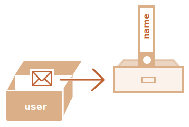

# การอ้างอิงและการคัดลอกออบเจ็กต์

ความแตกต่างสำคัญอย่างหนึ่งระหว่างออบเจ็กต์กับข้อมูลพื้นฐาน คือออบเจ็กต์จะถูกจัดเก็บและคัดลอก "โดยการอ้างอิง (by reference)" ส่วนค่าพื้นฐานอย่าง string, number, boolean จะถูกคัดลอกเป็น "ค่าทั้งหมด" เสมอ

ลองมาดูกันว่าเกิดอะไรขึ้นเบื้องหลังเมื่อเราคัดลอกค่า

เริ่มจากข้อมูลพื้นฐานอย่าง string กันก่อน

ตรงนี้เราคัดลอก `message` ใส่ในตัวแปร `phrase`:

```js
let message = "Hello!";
let phrase = message;
```

ผลลัพธ์คือเราได้ตัวแปรสองตัวที่เป็นอิสระต่อกัน แต่ละตัวเก็บ string `"Hello!"` ไว้คนละชุด


ดูชัดเจนมากใช่ไหม?

แต่ออบเจ็กต์ไม่ได้ทำงานแบบนั้น

**ตัวแปรที่เก็บออบเจ็กต์ ไม่ได้เก็บตัวออบเจ็กต์โดยตรง แต่เก็บ "ที่อยู่ในหน่วยความจำ" — พูดง่ายๆ ก็คือเก็บ "การอ้างอิง (reference)" ไปยังออบเจ็กต์นั้น**

ลองดูตัวอย่างกัน:

```js
let user = {
  name: "John"
};
```

ในหน่วยความจำจริงๆ จะเก็บแบบนี้:



ตัวออบเจ็กต์จะถูกเก็บไว้ที่ใดที่หนึ่งในหน่วยความจำ (ทางขวาของภาพ) ส่วนตัวแปร `user` (ทางซ้าย) เก็บแค่ "การอ้างอิง" ชี้ไปหาออบเจ็กต์นั้น

ลองนึกภาพว่าตัวแปรออบเจ็กต์อย่าง `user` เป็นเหมือนกระดาษแผ่นหนึ่งที่จดที่อยู่ของออบเจ็กต์ไว้

เมื่อเราทำอะไรกับออบเจ็กต์ เช่น เข้าถึง `user.name` — JavaScript engine จะไปดูที่ที่อยู่นั้น แล้วทำงานกับออบเจ็กต์ตัวจริง

ทีนี้มาดูว่าทำไมเรื่องนี้ถึงสำคัญ

**เมื่อคัดลอกตัวแปรออบเจ็กต์ สิ่งที่ถูกคัดลอกคือการอ้างอิง ไม่ใช่ตัวออบเจ็กต์เอง**

ตัวอย่างเช่น:

```js no-beautify
let user = { name: "John" };

let admin = user; // คัดลอกการอ้างอิง
```

ตอนนี้เรามีตัวแปรสองตัว ที่ต่างก็ชี้ไปยังออบเจ็กต์เดียวกัน:


จะเห็นว่ายังคงมีแค่ออบเจ็กต์เดียว แต่มีตัวแปรสองตัวที่อ้างอิงถึง

เราจะใช้ตัวแปรไหนเข้าถึงหรือแก้ไขออบเจ็กต์ก็ได้:

```js run
let user = { name: 'John' };

let admin = user;

*!*
admin.name = 'Pete'; // เปลี่ยนโดยใช้การอ้างอิง "admin"
*/!*

alert(*!*user.name*/!*); // 'Pete', การเปลี่ยนแปลงจะเห็นได้จากการอ้างอิง "user" ด้วย
```

เปรียบเหมือนตู้ที่มีกุญแจสองดอก — ถ้าเราใช้กุญแจดอกหนึ่ง (`admin`) เปิดตู้แล้วเปลี่ยนของข้างใน พอใช้กุญแจอีกดอก (`user`) เปิดดู ก็จะเจอของที่เปลี่ยนไปแล้วเหมือนกัน

## การเปรียบเทียบโดยใช้การอ้างอิง

ออบเจ็กต์สองตัวจะเท่ากันก็ต่อเมื่อเป็นออบเจ็กต์ตัวเดียวกันเท่านั้น

เช่น ในกรณีนี้ `a` กับ `b` อ้างอิงถึงออบเจ็กต์เดียวกัน จึงเท่ากัน:

```js run
let a = {};
let b = a; // คัดลอกการอ้างอิง

alert( a == b ); // true, ตัวแปรทั้งสองอ้างอิงถึงออบเจ็กต์เดียวกัน
alert( a === b ); // true
```

แต่ถ้าเป็นออบเจ็กต์คนละตัวกัน ถึงจะหน้าตาเหมือนกัน (เป็นออบเจ็กต์ว่างทั้งคู่) ก็ไม่เท่ากัน:

```js run
let a = {};
let b = {}; // ออบเจ็กต์สองตัวที่แยกจากกัน

alert( a == b ); // false
```

สำหรับการเปรียบเทียบอย่าง `obj1 > obj2` หรือเปรียบเทียบกับค่าพื้นฐานอย่าง `obj == 5` ออบเจ็กต์จะถูกแปลงเป็นค่าพื้นฐานก่อน เราจะเรียนเรื่องนี้ในเร็วๆ นี้ แต่จริงๆ แล้วการเปรียบเทียบแบบนี้ไม่ค่อยจำเป็น — ส่วนใหญ่ถ้าเจอก็มักเป็นเพราะเขียนโค้ดผิดมากกว่า

````smart header="ออบเจ็กต์ const ยังแก้ไขได้"
เนื่องจากออบเจ็กต์เก็บแบบอ้างอิง ออบเจ็กต์ที่ประกาศด้วย `const` จึง *แก้ไขได้*

เช่น:

```js run
const user = {
  name: "John"
};

*!*
user.name = "Pete"; // (*)
*/!*

alert(user.name); // Pete
```

อาจนึกว่าบรรทัด `(*)` จะ error แต่จริงๆ แล้วไม่ เพราะค่าของ `user` ยังคงเป็นการอ้างอิงไปยังออบเจ็กต์เดิม — สิ่งที่เปลี่ยนคือพร็อพเพอร์ตี้ข้างในออบเจ็กต์ ซึ่งเปลี่ยนได้อิสระ

พูดง่ายๆ ก็คือ `const user` จะ error ก็ต่อเมื่อเราพยายามกำหนด `user=...` ใหม่ทั้งหมดเท่านั้น

อย่างไรก็ตาม ถ้าต้องการทำให้พร็อพเพอร์ตี้ของออบเจ็กต์คงที่จริงๆ ก็ทำได้ แต่ต้องใช้วิธีอื่น ซึ่งเราจะกล่าวถึงในบท <info:property-descriptors>
````

## การโคลนและการรวมออบเจ็กต์ด้วย Object.assign [#cloning-and-merging-object-assign]

การคัดลอกตัวแปรออบเจ็กต์จึงเป็นแค่การสร้างการอ้างอิงเพิ่มอีกอันไปยังออบเจ็กต์เดียวกัน

แล้วถ้าเราต้องการทำสำเนาออบเจ็กต์จริงๆ ล่ะ?

ก็ต้องสร้างออบเจ็กต์ใหม่ แล้ววนลูปผ่านพร็อพเพอร์ตี้ทั้งหมดของออบเจ็กต์เดิม คัดลอกค่าในระดับพื้นฐาน (primitive) ทีละตัว

แบบนี้:

```js run
let user = {
  name: "John",
  age: 30
};

*!*
let clone = {}; // ออบเจ็กต์เปล่าใหม่

// คัดลอกพร็อพเพอร์ตี้ทั้งหมดของ user ใส่ใน clone
for (let key in user) {
  clone[key] = user[key];
}
*/!*

// ตอนนี้ clone เป็นออบเจ็กต์อิสระ มีเนื้อหาเหมือน user
clone.name = "Pete"; // เปลี่ยนข้อมูลใน clone

alert( user.name ); // ในออบเจ็กต์ต้นฉบับยังคงเป็น John อยู่
```

นอกจากนี้ยังใช้เมธอด [Object.assign](https://developer.mozilla.org/en-US/docs/Web/JavaScript/Reference/Global_Objects/Object/assign) ได้ด้วย

รูปแบบการใช้งาน:

```js
Object.assign(dest, ...sources)
```

- อาร์กิวเมนต์แรก `dest` คือออบเจ็กต์ปลายทาง (target)
- อาร์กิวเมนต์ถัดๆ ไปคือรายการออบเจ็กต์ต้นทาง (sources)

เมธอดนี้จะคัดลอกพร็อพเพอร์ตี้ทั้งหมดจากออบเจ็กต์ต้นทาง ไปใส่ใน `dest` แล้วคืนค่า `dest` เป็นผลลัพธ์

เช่น สมมติเรามีออบเจ็กต์ `user` แล้วต้องการเพิ่มสิทธิ์ (permissions) สองอย่างเข้าไป:

```js run
let user = { name: "John" };

let permissions1 = { canView: true };
let permissions2 = { canEdit: true };

*!*
// คัดลอกพร็อพเพอร์ตี้ทั้งหมดจาก permissions1 และ permissions2 ไปใส่ใน user
Object.assign(user, permissions1, permissions2);
*/!*

// ตอนนี้ user = { name: "John", canView: true, canEdit: true }
alert(user.name); // John
alert(user.canView); // true
alert(user.canEdit); // true
```

ถ้าชื่อพร็อพเพอร์ตี้ซ้ำกับที่มีอยู่แล้ว ค่าจะถูกเขียนทับ:

```js run
let user = { name: "John" };

Object.assign(user, { name: "Pete" });

alert(user.name); // ตอนนี้ user = { name: "Pete" }
```

ยังใช้ `Object.assign` เพื่อโคลนออบเจ็กต์อย่างง่ายๆ ได้ด้วย:

```js run
let user = {
  name: "John",
  age: 30
};

*!*
let clone = Object.assign({}, user);
*/!*

alert(clone.name); // John
alert(clone.age); // 30
```

ตรงนี้จะคัดลอกพร็อพเพอร์ตี้ทั้งหมดของ `user` ไปใส่ในออบเจ็กต์เปล่า แล้วคืนออบเจ็กต์นั้นกลับมา

นอกจากนี้ยังมีวิธีอื่นในการโคลนออบเจ็กต์ เช่น [spread syntax](info:rest-parameters-spread) `clone = {...user}` ซึ่งจะกล่าวถึงในภายหลัง

## การโคลนแบบซ้อน (Nested cloning)

จนถึงตอนนี้ เราสมมติว่าพร็อพเพอร์ตี้ทั้งหมดของ `user` เป็นข้อมูลพื้นฐาน แต่จริงๆ แล้วพร็อพเพอร์ตี้ก็อ้างอิงไปยังออบเจ็กต์อื่นได้เช่นกัน

เช่น:
```js run
let user = {
  name: "John",
  sizes: {
    height: 182,
    width: 50
  }
};

alert( user.sizes.height ); // 182
```

แบบนี้การคัดลอก `clone.sizes = user.sizes` ไม่พอแล้ว เพราะ `user.sizes` เป็นออบเจ็กต์ จะถูกคัดลอกแบบอ้างอิง ทำให้ `clone` กับ `user` ใช้ sizes ตัวเดียวกัน:

```js run
let user = {
  name: "John",
  sizes: {
    height: 182,
    width: 50
  }
};

let clone = Object.assign({}, user);

alert( user.sizes === clone.sizes ); // true, เป็นออบเจ็กต์ตัวเดียวกัน

// user กับ clone ใช้ sizes ร่วมกัน
user.sizes.width = 60;    // เปลี่ยนค่าจากที่ user
alert(clone.sizes.width); // 60, ผลลัพธ์เปลี่ยนตามใน clone ด้วย
```

เพื่อแก้ปัญหานี้ให้ `user` กับ `clone` แยกจากกันจริงๆ ต้องวนลูปตรวจค่าของ `user[key]` แต่ละตัว ถ้าเป็นออบเจ็กต์ก็ต้องทำซ้ำโครงสร้างด้วย วิธีนี้เรียกว่า "deep cloning" หรือ "structured cloning" ซึ่งมีเมธอด [structuredClone](https://developer.mozilla.org/en-US/docs/Web/API/structuredClone) ที่ทำ deep cloning ให้เลย

### structuredClone

การเรียก `structuredClone(object)` จะโคลน `object` พร้อมพร็อพเพอร์ตี้ซ้อนทั้งหมด

ลองมาดูการใช้งานในตัวอย่างของเรา:

```js run
let user = {
  name: "John",
  sizes: {
    height: 182,
    width: 50
  }
};

*!*
let clone = structuredClone(user);
*/!*

alert( user.sizes === clone.sizes ); // false, ออบเจ็กต์คนละตัวกันแล้ว

// ตอนนี้ user กับ clone ไม่เกี่ยวข้องกันเลย
user.sizes.width = 60;    // เปลี่ยนค่าที่ user
alert(clone.sizes.width); // 50, ไม่กระทบ clone
```

เมธอด `structuredClone` โคลนข้อมูลได้หลายประเภท ไม่ว่าจะเป็น objects, arrays หรือ primitive values

นอกจากนี้ยังรองรับการอ้างอิงวนกลับ (circular references) — คือเมื่อพร็อพเพอร์ตี้ของออบเจ็กต์อ้างอิงกลับมาหาตัวเอง (ทั้งโดยตรง หรือผ่านลูกโซ่การอ้างอิง)

เช่น:

```js run
let user = {};
// สร้างการอ้างอิงวนกลับ:
// user.me อ้างอิงกลับไปที่ user เอง
user.me = user;

let clone = structuredClone(user);
alert(clone.me === clone); // true
```

จะเห็นว่า `clone.me` อ้างอิงถึง `clone` ไม่ใช่ `user`! การอ้างอิงวนกลับจึงถูกโคลนได้อย่างถูกต้อง

อย่างไรก็ตาม มีบางกรณีที่ `structuredClone` ใช้ไม่ได้

เช่น เมื่อออบเจ็กต์มีพร็อพเพอร์ตี้ที่เป็นฟังก์ชัน:

```js run
// error
structuredClone({
  f: function() {}
});
```

พร็อพเพอร์ตี้ที่เป็นฟังก์ชันนั้นไม่รองรับ

สำหรับกรณีที่ซับซ้อนแบบนี้ อาจต้องใช้วิธีผสมผสานการโคลนหลายแบบ เขียนโค้ดเอง หรือจะใช้ไลบรารีที่ทำไว้แล้วอย่าง [_.cloneDeep(obj)](https://lodash.com/docs#cloneDeep) จาก [lodash](https://lodash.com) ก็ได้

## สรุป

ออบเจ็กต์ถูกกำหนดค่าและคัดลอกแบบอ้างอิง (by reference) กล่าวคือ ตัวแปรไม่ได้เก็บ "ค่าของออบเจ็กต์" แต่เก็บ "การอ้างอิง" (ที่อยู่ในหน่วยความจำ) ไว้แทน ดังนั้นการคัดลอกตัวแปรหรือส่งเป็นอาร์กิวเมนต์ของฟังก์ชัน จะคัดลอกแค่การอ้างอิง ไม่ใช่ตัวออบเจ็กต์

การดำเนินการใดๆ ผ่านการอ้างอิงที่คัดลอกมา (เช่น เพิ่ม/ลบพร็อพเพอร์ตี้) จะเกิดขึ้นบนออบเจ็กต์ตัวเดียวกันทั้งหมด

ถ้าต้องการสร้าง "สำเนาจริงๆ" (clone) ก็ใช้ `Object.assign` สำหรับ "shallow copy" (ออบเจ็กต์ซ้อนยังคัดลอกแบบอ้างอิง) หรือใช้ `structuredClone` สำหรับ "deep cloning" หรือจะเขียนเอง หรือใช้ไลบรารีอย่าง [_.cloneDeep(obj)](https://lodash.com/docs#cloneDeep) ก็ได้
