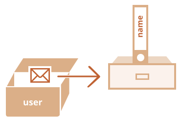
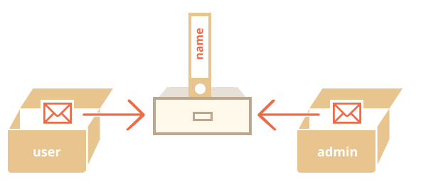

# การอ้างอิงและการคัดลอกออบเจ็กต์

ออบเจ็กต์ต่างจากค่าพื้นฐานตรงวิธีเก็บและคัดลอกข้อมูล ออบเจ็กต์ใช้ "การอ้างอิง" (by reference) ส่วนค่าพื้นฐานอย่างสตริง ตัวเลข และบูลีนจะคัดลอกค่าทั้งหมดไปเลย

ลองไล่ดูเบื้องหลังตอนคัดลอกค่า แล้วภาพจะชัดขึ้น

เริ่มจากค่าพื้นฐานอย่างสตริงก่อน โค้ดนี้คัดลอกค่าของ `message` ไปใส่ใน `phrase`:

```js
let message = "Hello!";
let phrase = message;
```

ผลคือเราได้ตัวแปรสองตัวที่แยกจากกัน แต่ละตัวเก็บสตริง `"Hello!"` ของตัวเอง


กรณีนี้ตรงไปตรงมา แต่พอเป็นออบเจ็กต์ วิธีคัดลอกจะไม่เหมือนกัน

**เมื่อกำหนดออบเจ็กต์ให้ตัวแปร ตัวแปรไม่ได้เก็บตัวออบเจ็กต์ไว้โดยตรง แต่เก็บ "ที่อยู่ในหน่วยความจำ" หรือพูดอีกแบบว่าเก็บ "การอ้างอิง" ไปยังออบเจ็กต์นั้น**

ลองดูตัวแปรนี้:

```js
let user = {
  name: "John"
};
```

ถ้ามองภาพการเก็บข้อมูลในหน่วยความจำ จะได้ประมาณนี้:



ออบเจ็กต์อยู่ในหน่วยความจำทางขวาของภาพ ส่วนตัวแปร `user` ทางซ้ายเก็บการอ้างอิงที่ชี้ไปยังออบเจ็กต์นั้น

ลองนึกว่า `user` เป็นกระดาษที่จดที่อยู่ของออบเจ็กต์ไว้ เมื่อเราอ่าน `user.name` กลไกของ JavaScript จะตามที่อยู่นั้นไปหาออบเจ็กต์ตัวจริง แล้วอ่านพร็อพเพอร์ตี้ `name`

จุดสำคัญอยู่ตรงนี้:

**เมื่อคัดลอกตัวแปรออบเจ็กต์ สิ่งที่ถูกคัดลอกคือการอ้างอิง ไม่ใช่ตัวออบเจ็กต์**

ตัวอย่างเช่น:

```js no-beautify
let user = { name: "John" };

let admin = user; // คัดลอกการอ้างอิง
```

ตอนนี้ตัวแปรทั้งสองเก็บการอ้างอิงที่ชี้ไปยังออบเจ็กต์เดียวกัน:



ในภาพจึงมีออบเจ็กต์เพียงตัวเดียว แต่มีตัวแปรสองตัวที่ใช้เข้าถึงออบเจ็กต์นั้นได้

ไม่ว่าจะเข้าถึงหรือแก้ข้อมูลผ่านตัวแปรไหน เราก็กำลังทำงานกับออบเจ็กต์ตัวเดิม:

```js run
let user = { name: 'John' };

let admin = user;

*!*
admin.name = 'Pete'; // แก้ผ่านการอ้างอิงใน "admin"
*/!*

alert(*!*user.name*/!*); // 'Pete' เพราะ "user" อ้างอิงถึงออบเจ็กต์เดียวกัน
```

นึกภาพว่าออบเจ็กต์เป็นตู้หนึ่งใบ ส่วน `admin` กับ `user` เป็นกุญแจคนละดอกที่เปิดตู้ใบเดียวกัน ถ้าใช้กุญแจดอกหนึ่งเปิดตู้แล้วเปลี่ยนของข้างใน พอเปิดด้วยอีกดอกก็จะเห็นของที่เปลี่ยนไปแล้ว

## การเปรียบเทียบด้วยการอ้างอิง

ออบเจ็กต์สองตัวจะเท่ากันก็ต่อเมื่อเป็นออบเจ็กต์ตัวเดียวกัน

ตัวอย่างนี้ `a` กับ `b` อ้างอิงถึงออบเจ็กต์เดียวกัน ผลการเปรียบเทียบจึงเป็น `true`:

```js run
let a = {};
let b = a; // คัดลอกการอ้างอิง

alert( a == b ); // true ตัวแปรทั้งสองอ้างอิงถึงออบเจ็กต์เดียวกัน
alert( a === b ); // true
```

แต่ตัวอย่างถัดไปสร้างออบเจ็กต์แยกกันสองตัว แม้ทั้งคู่จะเป็นออบเจ็กต์ว่างเหมือนกัน ผลการเปรียบเทียบก็ยังเป็น `false`:

```js run
let a = {};
let b = {}; // ออบเจ็กต์สองตัวที่แยกจากกัน

alert( a == b ); // false
```

ถ้าเปรียบเทียบออบเจ็กต์ด้วย `obj1 > obj2` หรือเปรียบเทียบกับค่าพื้นฐานอย่าง `obj == 5` JavaScript จะแปลงออบเจ็กต์เป็นค่าพื้นฐานก่อน เราจะเรียนเรื่องนี้ในอีกไม่กี่บทข้างหน้า

ในงานจริงแทบไม่จำเป็นต้องเปรียบเทียบแบบนี้ ส่วนใหญ่มักเกิดจากเขียนโค้ดพลาด

````smart header="ออบเจ็กต์ในตัวแปร const ยังแก้ไขได้"
ผลอย่างหนึ่งของการเก็บออบเจ็กต์ด้วยการอ้างอิงคือ เราแก้ข้อมูลข้างในออบเจ็กต์ที่เก็บไว้ในตัวแปร `const` ได้

ตัวอย่างเช่น:

```js run
const user = {
  name: "John"
};

*!*
user.name = "Pete"; // (*)
*/!*

alert(user.name); // Pete
```

บรรทัด `(*)` ดูเหมือนจะทำให้เกิด error แต่โค้ดนี้ทำงานได้ เพราะค่าของ `user` ยังเป็นการอ้างอิงไปยังออบเจ็กต์ตัวเดิม มีเพียงพร็อพเพอร์ตี้ของออบเจ็กต์ที่เปลี่ยนไป

`const user` จะทำให้เกิด error ก็ต่อเมื่อเราพยายามกำหนดค่าให้ `user = ...` ใหม่ทั้งตัว

ถ้าต้องการกำหนดให้พร็อพเพอร์ตี้ของออบเจ็กต์คงที่ ก็ทำได้ด้วยวิธีอื่น เราจะพูดถึงเรื่องนี้ในบท <info:property-descriptors>
````

## การโคลนและรวมออบเจ็กต์ด้วย Object.assign [#cloning-and-merging-object-assign]

ตอนนี้เรารู้แล้วว่า การคัดลอกตัวแปรออบเจ็กต์เป็นเพียงการเพิ่มการอ้างอิงไปยังออบเจ็กต์ตัวเดิม

ถ้าต้องการสร้างออบเจ็กต์อีกตัวที่มีข้อมูลเหมือนกันล่ะ?

วิธีหนึ่งคือสร้างออบเจ็กต์ใหม่ แล้ววนอ่านพร็อพเพอร์ตี้ของออบเจ็กต์เดิมเพื่อคัดลอกค่าพื้นฐานทีละค่า:

```js run
let user = {
  name: "John",
  age: 30
};

*!*
let clone = {}; // ออบเจ็กต์ว่างตัวใหม่

// คัดลอกพร็อพเพอร์ตี้ทั้งหมดของ user ไปยัง clone
for (let key in user) {
  clone[key] = user[key];
}
*/!*

// ตอนนี้ clone เป็นออบเจ็กต์ที่แยกจาก user แต่มีข้อมูลเหมือนกัน
clone.name = "Pete"; // แก้ข้อมูลใน clone

alert( user.name ); // ออบเจ็กต์ต้นฉบับยังเป็น John
```

อีกทางหนึ่งคือใช้เมธอด [Object.assign](https://developer.mozilla.org/en-US/docs/Web/JavaScript/Reference/Global_Objects/Object/assign)

รูปแบบการเรียกมีดังนี้:

```js
Object.assign(dest, ...sources)
```

- อาร์กิวเมนต์แรก `dest` คือออบเจ็กต์ปลายทาง
- อาร์กิวเมนต์ถัดไปคือออบเจ็กต์ต้นทางหนึ่งตัวหรือหลายตัว

เมธอดนี้คัดลอกพร็อพเพอร์ตี้จากออบเจ็กต์ต้นทางไปยัง `dest` แล้วคืนค่า `dest`

สมมติว่ามีออบเจ็กต์ `user` และต้องการเพิ่มสิทธิ์อีกสองอย่าง:

```js run
let user = { name: "John" };

let permissions1 = { canView: true };
let permissions2 = { canEdit: true };

*!*
// คัดลอกพร็อพเพอร์ตี้ทั้งหมดจาก permissions1 และ permissions2 ไปยัง user
Object.assign(user, permissions1, permissions2);
*/!*

// ตอนนี้ user = { name: "John", canView: true, canEdit: true }
alert(user.name); // John
alert(user.canView); // true
alert(user.canEdit); // true
```

ถ้าพร็อพเพอร์ตี้ที่คัดลอกมามีชื่อซ้ำกับของเดิม ค่าใหม่จะเขียนทับค่าเก่า:

```js run
let user = { name: "John" };

Object.assign(user, { name: "Pete" });

alert(user.name); // ตอนนี้ user = { name: "Pete" }
```

เรายังใช้ `Object.assign` โคลนออบเจ็กต์แบบง่าย ๆ ได้ด้วย:

```js run
let user = {
  name: "John",
  age: 30
};

*!*
let clone = Object.assign({}, user);
*/!*

alert(clone.name); // John
alert(clone.age); // 30
```

โค้ดนี้คัดลอกพร็อพเพอร์ตี้ทั้งหมดของ `user` ไปยังออบเจ็กต์ว่าง แล้วคืนออบเจ็กต์นั้นมาเก็บไว้ใน `clone`

อีกวิธีคือใช้ [spread syntax](info:rest-parameters-spread) เช่น `clone = {...user}` เราจะเรียนเรื่องนี้ในบทต่อ ๆ ไป

## การโคลนออบเจ็กต์ที่ซ้อนกัน

ตัวอย่างที่ผ่านมาใช้พร็อพเพอร์ตี้ที่เป็นค่าพื้นฐานทั้งหมด แต่พร็อพเพอร์ตี้ก็อ้างอิงไปยังออบเจ็กต์อื่นได้ เช่น:
```js run
let user = {
  name: "John",
  sizes: {
    height: 182,
    width: 50
  }
};

alert( user.sizes.height ); // 182
```

กรณีนี้แค่คัดลอก `clone.sizes = user.sizes` ยังไม่พอ เพราะ `user.sizes` เป็นออบเจ็กต์ สิ่งที่ถูกคัดลอกจึงเป็นการอ้างอิง ทำให้ `clone` กับ `user` ใช้ออบเจ็กต์ `sizes` ตัวเดียวกัน:

```js run
let user = {
  name: "John",
  sizes: {
    height: 182,
    width: 50
  }
};

let clone = Object.assign({}, user);

alert( user.sizes === clone.sizes ); // true เป็นออบเจ็กต์ตัวเดียวกัน

// user กับ clone ใช้ sizes ร่วมกัน
user.sizes.width = 60;    // แก้พร็อพเพอร์ตี้ผ่าน user
alert(clone.sizes.width); // 60 จึงเห็นค่าที่เปลี่ยนผ่าน clone ด้วย
```

ถ้าต้องการให้ `user` กับ `clone` แยกจากกันจริง ๆ ต้องวนตรวจค่าของ `user[key]` ทีละตัว เมื่อเจอออบเจ็กต์ก็สร้างสำเนาโครงสร้างที่ซ้อนอยู่ข้างในด้วย วิธีนี้เรียกว่าการคัดลอกแบบลึก (deep cloning) หรือ "structured cloning"

เมธอด [structuredClone](https://developer.mozilla.org/en-US/docs/Web/API/structuredClone) ช่วยทำงานนี้ให้เราได้

### structuredClone

เมื่อเรียก `structuredClone(object)` เราจะได้สำเนาของ `object` รวมทั้งพร็อพเพอร์ตี้ที่ซ้อนอยู่ข้างใน

นำมาใช้กับตัวอย่างก่อนหน้าได้แบบนี้:

```js run
let user = {
  name: "John",
  sizes: {
    height: 182,
    width: 50
  }
};

*!*
let clone = structuredClone(user);
*/!*

alert( user.sizes === clone.sizes ); // false เป็นออบเจ็กต์คนละตัวกัน

// ตอนนี้ user กับ clone แยกจากกันโดยสมบูรณ์
user.sizes.width = 60;    // แก้พร็อพเพอร์ตี้ผ่าน user
alert(clone.sizes.width); // 50 ไม่กระทบ clone
```

`structuredClone` โคลนได้ทั้งออบเจ็กต์ อาร์เรย์ และค่าพื้นฐานหลายชนิด

เมธอดนี้ยังรองรับการอ้างอิงแบบวนกลับ (circular reference) ซึ่งเกิดขึ้นเมื่อพร็อพเพอร์ตี้อ้างอิงกลับมาหาออบเจ็กต์ตัวเดิม จะชี้กลับมาโดยตรงหรือผ่านออบเจ็กต์อื่นเป็นทอด ๆ ก็ได้

ตัวอย่างเช่น:

```js run
let user = {};
// สร้างการอ้างอิงแบบวนกลับ:
// user.me อ้างอิงกลับมายัง user เอง
user.me = user;

let clone = structuredClone(user);
alert(clone.me === clone); // true
```

หลังโคลนแล้ว `clone.me` จะอ้างอิงไปยัง `clone` ไม่ใช่ `user` แสดงว่า `structuredClone` คัดลอกความสัมพันธ์แบบวนกลับมาด้วย

อย่างไรก็ตาม `structuredClone` ใช้ไม่ได้กับข้อมูลบางอย่าง เช่น ออบเจ็กต์ที่มีพร็อพเพอร์ตี้เป็นฟังก์ชัน:

```js run
// เกิดข้อผิดพลาด
structuredClone({
  f: function() {}
});
```

สาเหตุคือ `structuredClone` โคลนฟังก์ชันไม่ได้

กรณีที่ซับซ้อนแบบนี้ เราอาจใช้วิธีโคลนหลายแบบร่วมกัน หรือเขียนโค้ดให้ตรงกับข้อมูลของเราเอง ถ้าไม่อยากเริ่มใหม่ทั้งหมด ก็ใช้ของที่มีอยู่แล้วอย่าง [_.cloneDeep(obj)](https://lodash.com/docs#cloneDeep) จากไลบรารี [lodash](https://lodash.com) ได้

## สรุป

เมื่อกำหนดออบเจ็กต์ให้ตัวแปร ตัวแปรจะเก็บการอ้างอิงหรือที่อยู่ในหน่วยความจำของออบเจ็กต์นั้น ไม่ได้เก็บตัวออบเจ็กต์ไว้โดยตรง

ดังนั้นเมื่อคัดลอกตัวแปรหรือส่งตัวแปรเป็นอาร์กิวเมนต์ให้ฟังก์ชัน สิ่งที่ตามไปด้วยคือการอ้างอิง ไม่ใช่ตัวออบเจ็กต์

การเพิ่ม ลบ หรือแก้พร็อพเพอร์ตี้ผ่านการอ้างอิงที่คัดลอกมา ล้วนเกิดขึ้นกับออบเจ็กต์ตัวเดียวกัน

ถ้าต้องการสำเนาของออบเจ็กต์ ใช้ `Object.assign` เพื่อคัดลอกแบบตื้น (shallow copy) ได้ แต่ถ้ามีออบเจ็กต์ซ้อนอยู่ข้างใน `Object.assign` จะคัดลอกเพียงการอ้างอิงของออบเจ็กต์นั้น

ส่วนการคัดลอกแบบลึก (deep cloning) ใช้ `structuredClone` ได้ หาก `structuredClone` ไม่รองรับข้อมูลที่ต้องการ ค่อยเขียนวิธีโคลนขึ้นเองหรือใช้เครื่องมืออย่าง [_.cloneDeep(obj)](https://lodash.com/docs#cloneDeep)
