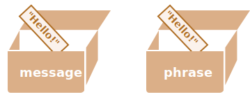

# การอ้างอิงและการคัดลอกออบเจ็กต์

หนึ่งในความแตกต่างสำคัญระหว่างออบเจ็กต์กับข้อมูลพื้นฐาน คือออบเจ็กต์ถูกจัดเก็บและคัดลอก "โดยการอ้างอิง" ในขณะที่ค่าพื้นฐานอย่างเช่น string, number, boolean เป็นต้น จะถูกคัดลอกเป็น "ค่าทั้งหมด" เสมอ

เราจะเข้าใจได้ง่ายขึ้นหากดูลึกลงไปว่ามีอะไรเกิดขึ้นเมื่อเราคัดลอกค่า

เริ่มต้นด้วยข้อมูลพื้นฐาน เช่น string

ที่นี่เราคัดลอก `message` ใส่ในตัวแปร `phrase`:

```js
let message = "Hello!";
let phrase = message;
```

ผลลัพธ์คือเรามีสองตัวแปรที่เป็นอิสระต่อกัน แต่ละตัวเก็บค่า string `"Hello!"` 



ผลลัพธ์ค่อนข้างชัดเจน ใช่ไหม?

แต่ออบเจ็กต์ไม่เป็นแบบนั้น

**ตัวแปรที่กำหนดให้กับออบเจ็กต์จะไม่ได้เก็บตัวออบเจ็กต์เอง แต่จะเก็บ "ที่อยู่ในหน่วยความจำ" หรือพูดอีกอย่างคือ "การอ้างอิง" ไปยังออบเจ็กต์นั้น**

มาดูตัวอย่างของตัวแปรแบบนี้:

```js
let user = {
  name: "John"
};
```

และนี่คือวิธีที่มันถูกเก็บในหน่วยความจำจริงๆ:


ออบเจ็กต์จะถูกเก็บไว้ที่ใดที่หนึ่งในหน่วยความจำ (ทางขวาของภาพ) ในขณะที่ตัวแปร `user` (ทางซ้าย) มี "การอ้างอิง" ไปยังมัน

เราอาจมองตัวแปรออบเจ็กต์อย่าง `user` เหมือนกระดาษแผ่นหนึ่งที่มีที่อยู่ของออบเจ็กต์เขียนอยู่

เมื่อเราดำเนินการกับออบเจ็กต์ เช่น เข้าถึงพร็อพเพอร์ตี้ `user.name` เอนจิ้น JavaScript จะไปดูที่ที่อยู่นั้นและดำเนินการกับออบเจ็กต์ที่เก็บอยู่จริง

ตอนนี้เราจะเข้าใจความสำคัญของเรื่องนี้

**เมื่อตัวแปรออบเจ็กต์ถูกคัดลอก การอ้างอิงจะถูกคัดลอก แต่ตัวออบเจ็กต์เองจะไม่ถูกทำสำเนา**

ตัวอย่างเช่น:

```js no-beautify
let user = { name: "John" };

let admin = user; // คัดลอกการอ้างอิง
```

ตอนนี้เรามีสองตัวแปร แต่ละตัวเก็บการอ้างอิงไปยังออบเจ็กต์เดียวกัน:


อย่างที่เห็น ยังคงมีแค่ออบเจ็กต์เดียว แต่ตอนนี้มีสองตัวแปรที่อ้างอิงถึงมัน

เราสามารถใช้ตัวแปรใดก็ได้เพื่อเข้าถึงออบเจ็กต์และแก้ไขเนื้อหาของมัน:

```js run
let user = { name: 'John' };

let admin = user;

*!*
admin.name = 'Pete'; // เปลี่ยนโดยใช้การอ้างอิง "admin"
*/!*

alert(*!*user.name*/!*); // 'Pete', การเปลี่ยนแปลงจะเห็นได้จากการอ้างอิง "user" ด้วย
```

เปรียบเหมือนเรามีตู้ตั้งอยู่และมีกุญแจสองดอก แล้วเราใช้กุญแจดอกหนึ่ง (`admin`) ในการเข้าไปเปลี่ยนแปลงข้างใน จากนั้นถ้าเราใช้กุญแจอีกดอก (`user`) เราก็ยังคงเปิดตู้ใบเดิมและสามารถเข้าถึงข้อมูลที่ถูกเปลี่ยนไปได้

## การเปรียบเทียบโดยใช้การอ้างอิง

สองออบเจ็กต์จะเท่ากันก็ต่อเมื่อมันเป็นออบเจ็กต์เดียวกันเท่านั้น

ตัวอย่างเช่น ในกรณีนี้ `a` และ `b` อ้างอิงถึงออบเจ็กต์เดียวกัน ดังนั้นจึงเท่ากัน:

```js run
let a = {};
let b = a; // คัดลอกการอ้างอิง

alert( a == b ); // true, ตัวแปรทั้งสองอ้างอิงถึงออบเจ็กต์เดียวกัน
alert( a === b ); // true
```

และในกรณีนี้ ออบเจ็กต์สองตัวที่เป็นอิสระจากกัน ไม่เท่ากัน แม้ว่าจะดูเหมือนกัน (เป็นออบเจ็กต์ว่างทั้งคู่):

```js run
let a = {};
let b = {}; // ออบเจ็กต์สองตัวที่แยกจากกัน

alert( a == b ); // false
```

สำหรับการเปรียบเทียบอย่างเช่น `obj1 > obj2` หรือการเปรียบเทียบกับค่าพื้นฐานอย่าง `obj == 5` ออบเจ็กต์จะถูกแปลงเป็นค่าพื้นฐาน เราจะศึกษาวิธีการแปลงออบเจ็กต์ในเร็วๆ นี้ แต่ตามความเป็นจริงแล้ว การเปรียบเทียบลักษณะนั้นมักไม่ค่อยจำเป็น -- โดยส่วนใหญ่มักเกิดจากข้อผิดพลาดในการเขียนโปรแกรม

````smart header="ออบเจ็กต์ const ยังสามารถแก้ไขได้"
ผลข้างเคียงสำคัญของการเก็บออบเจ็กต์แบบอ้างอิงคือ ออบเจ็กต์ที่ประกาศเป็น `const` *สามารถ* ถูกแก้ไขได้

ตัวอย่างเช่น:

```js run
const user = {
  name: "John"
};

*!*
user.name = "Pete"; // (*)
*/!*

alert(user.name); // Pete
```

ดูเหมือนว่าบรรทัดที่ `(*)` น่าจะทำให้เกิดข้อผิดพลาด แต่จริงๆ แล้วไม่ ค่าของ `user` ยังคงไม่เปลี่ยนแปลง มันยังอ้างอิงถึงออบเจ็กต์เดิม แต่คุณสมบัติของออบเจ็กต์นั้นสามารถเปลี่ยนแปลงได้โดยอิสระ

อีกนัยหนึ่ง `const user` จะให้ข้อผิดพลาดก็ต่อเมื่อเราพยายามกำหนด `user=...` ใหม่ทั้งหมด

อย่างไรก็ตาม หากเราต้องการทำให้คุณสมบัติของออบเจ็กต์คงที่จริงๆ ก็สามารถทำได้ แต่ต้องใช้วิธีที่แตกต่างออกไป เราจะกล่าวถึงเรื่องนี้ในบท <info:property-descriptors>
````