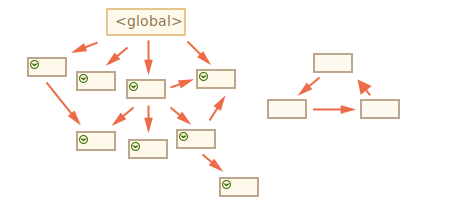

# การเก็บขยะ

การจัดการหน่วยความจำใน JavaScript นั้นทำโดยอัตโนมัติและเป็นไปอย่างไม่เห็นกับเรา เมื่อเราสร้าง primitives, objects, functions... สิ่งเหล่านั้นต่างใช้หน่วยความจำ

แล้วเกิดอะไรขึ้นเมื่อมีบางสิ่งที่ไม่จำเป็นต้องใช้อีกต่อไป? JavaScript engine ค้นพบและทำความสะอาดมันได้อย่างไร?

## ความสามารถในการเข้าถึง (Reachability)

แนวคิดหลักของการจัดการหน่วยความจำใน JavaScript คือ *ความสามารถในการเข้าถึง (reachability)*

พูดง่ายๆ คือ ค่าที่ "เข้าถึงได้ (reachable)" คือค่าที่เข้าถึงหรือใช้งานได้ในทางใดทางหนึ่ง มันได้รับการรับประกันว่าจะถูกเก็บไว้ในหน่วยความจำ

1. มีชุดพื้นฐานของค่าที่เข้าถึงได้โดยธรรมชาติ ซึ่งไม่สามารถลบทิ้งได้ด้วยเหตุผลที่ชัดเจน

    ยกตัวอย่างเช่น:

    - ฟังก์ชันที่กำลังถูกประมวลผลอยู่ และตัวแปรภายในหรือพารามิเตอร์ของมัน
    - ฟังก์ชันอื่นๆ บนลูกโซ่ปัจจุบันของการเรียกฟังก์ชันซ้อนกัน และตัวแปรภายในหรือพารามิเตอร์ของมัน 
    - ตัวแปรโกลบอล
    - (ยังมีบางอย่างที่อยู่เบื้องหลังด้วย)

    ค่าเหล่านี้เรียกว่า *roots*

2. ค่าอื่นๆ จะถือว่าเข้าถึงได้ หากมันเข้าถึงได้จาก root โดยการอ้างอิง (reference) หรือลูกโซ่ของการอ้างอิง

    ตัวอย่างเช่น ถ้ามีอ็อบเจ็กต์อยู่ในตัวแปรโกลบอล และอ็อบเจ็กต์นั้นมีคุณสมบัติที่อ้างอิงถึงอ็อบเจ็กต์อื่น อ็อบเจ็กต์ *นั้น* จะถูกพิจารณาว่าเข้าถึงได้ และอ็อบเจ็กต์อื่นๆ ที่มันอ้างอิงถึงก็เข้าถึงได้เช่นกัน ตัวอย่างโดยละเอียดจะตามมา

มีกระบวนการที่ทำงานอยู่เบื้องหลังใน JavaScript engine ที่เรียกว่า [garbage collector](https://en.wikipedia.org/wiki/Garbage_collection_(computer_science)) โดยจะคอยจับตาดูอ็อบเจ็กต์ทั้งหมด และลบทิ้งอ็อบเจ็กต์ที่ไม่สามารถเข้าถึงได้อีกต่อไป

## ตัวอย่างง่ายๆ

นี่คือตัวอย่างที่เรียบง่ายที่สุด: 

```js
// user มีการอ้างอิงถึงอ็อบเจ็กต์
let user = {
  name: "John"
};
```


ที่นี้ลูกศรแสดงถึงการอ้างอิงอ็อบเจ็กต์ ตัวแปรโกลบอล `"user"` อ้างอิงถึงอ็อบเจ็กต์ `{name: "John"}` (เราจะเรียกมันว่า John เพื่อให้สั้นกระชับ) คุณสมบัติ `"name"` ของ John เก็บค่า primitive จึงถูกวาดอยู่ภายในอ็อบเจ็กต์

ถ้าค่าของ `user` ถูกเขียนทับ การอ้างอิงจะหายไป:

```js
user = null;
```


ตอนนี้ John ไม่สามารถเข้าถึงได้อีกต่อไป ไม่มีวิธีเข้าถึงมันอีก ไม่มีการอ้างอิงถึงมันอีก Garbage collector จะเก็บข้อมูลและเพื่อคืนหน่วยความจำ

## การอ้างอิงสองรายการ

ทีนี้ลองนึกภาพว่าเราได้คัดลอกการอ้างอิงจาก `user` ไปยัง `admin`:

```js
// user มีการอ้างอิงถึงอ็อบเจ็กต์
let user = {  
  name: "John"
};

*!*
let admin = user;
*/!*  
```

  

ถ้าตอนนี้เราทำแบบเดิม:
```js
user = null;
```

...อ็อบเจ็กต์ก็ยังคงเข้าถึงได้ผ่านตัวแปรโกลบอล `admin` ดังนั้นมันต้องยังคงอยู่ในหน่วยความจำ แต่ถ้าเราเขียนทับ `admin` ด้วย มันก็จะสามารถถูกลบทิ้งได้

## อ็อบเจ็กต์ที่เชื่อมโยงกัน

ตอนนี้มาดูตัวอย่างที่ซับซ้อนกว่า ครอบครัว:

```js
function marry(man, woman) {
  woman.husband = man;
  man.wife = woman;

  return {
    father: man,
    mother: woman
  }
}

let family = marry({
  name: "John"
}, {
  name: "Ann"
});
```

ฟังก์ชัน `marry` "แต่งงาน" อ็อบเจ็กต์สองตัวให้กัน โดยทำให้มีการอ้างอิงถึงกัน และคืนอ็อบเจ็กต์ใหม่ที่มีทั้งคู่อยู่ด้วย

โครงสร้างหน่วยความจำที่ได้:


ณ ตอนนี้ อ็อบเจ็กต์ทั้งหมดสามารถเข้าถึงได้

เราลองลบการอ้างอิงสองรายการ:

```js
delete family.father;
delete family.mother.husband;
```


การลบการอ้างอิงเพียงรายการเดียวไม่เพียงพอ เพราะว่าอ็อบเจ็กต์ทั้งหมดจะยังคงเข้าถึงได้อยู่

แต่ถ้าเราลบทั้งสองรายการ จะเห็นว่า John ไม่มีการอ้างอิงเข้าอีกแล้ว:


การอ้างอิงออกไม่มีความสำคัญ มีเพียงการอ้างอิงเข้าเท่านั้นที่ทำให้อ็อบเจ็กต์เข้าถึงได้ ดังนั้น John ตอนนี้จึงไม่สามารถเข้าถึงได้อีกต่อไป และจะถูกลบทิ้งจากหน่วยความจำ พร้อมข้อมูลทั้งหมดที่ไม่สามารถเข้าถึงได้อีก

หลังจากการเก็บขยะ:

 

## เกาะที่เข้าถึงไม่ถึง

มันเป็นไปได้ว่าทั้งเกาะของอ็อบเจ็กต์ที่เชื่อมโยงกันจะกลายเป็นสิ่งที่เข้าถึงไม่ได้และถูกลบออกจากหน่วยความจำ

อ็อบเจ็กต์ต้นทางเป็นเหมือนเดิมดังข้างบน หลังจากนั้นเมื่อ:

```js
family = null;
```

สถานการณ์ในหน่วยความจำจะเป็น: 


ตัวอย่างนี้สาธิตให้เห็นว่าแนวคิดเรื่องความสามารถในการเข้าถึงมีความสำคัญขนาดไหน

มันเป็นเรื่องชัดเจนว่า John และ Ann ยังคงเชื่อมโยงกันอยู่ ทั้งคู่ยังมีการอ้างอิงเข้า แต่นั่นไม่เพียงพอ

อดีต `"family"` อ็อบเจ็กต์ถูกยกเลิกการเชื่อมโยงจาก root ไม่มีการอ้างอิงไปยังมันอีก ดังนั้นทั้งเกาะก็เลยไม่สามารถเข้าถึงได้และจะถูกลบทิ้งไป

## อัลกอริธึมภายใน

อัลกอริธึมการเก็บขยะพื้นฐานเรียกว่า "mark-and-sweep"

ขั้นตอนการ "เก็บขยะ" ต่อไปนี้ถูกดำเนินอย่างสม่ำเสมอ:

- Garbage collector รวบรวม roots และ "ทำเครื่องหมาย" (จดจำ) ไว้
- จากนั้นมันจะไปตามการอ้างอิงจาก roots และทำเครื่องหมายการอ้างอิงทั้งหมด
- หลังจากนั้นจะไปที่อ็อบเจ็กต์ที่ถูกทำเครื่องหมายและทำเครื่องหมาย *การอ้างอิง* ของพวกมัน อ็อบเจ็กต์ที่ไปถึงทั้งหมดจะถูกบันทึกไว้เพื่อไม่ให้ไปที่อ็อบเจ็กต์เดิมซ้ำในอนาคต
- ...และทำต่อไปเรื่อยๆ จนกว่าทุกการอ้างอิงที่เข้าถึงได้ (จาก roots) จะถูกไปเยี่ยม 
- อ็อบเจ็กต์ทั้งหมด ยกเว้นที่มีเครื่องหมาย จะถูกลบทิ้ง

ตัวอย่างเช่น สมมติว่าโครงสร้างอ็อบเจ็กต์ของเราเป็นแบบนี้:


เราเห็นได้ชัดว่ามี "เกาะที่เข้าถึงไม่ถึง" อยู่ด้านขวา ทีนี้มาดูกันว่า garbage collector แบบ "mark-and-sweep" จัดการกับมันอย่างไร

ขั้นแรกคือการทำเครื่องหมาย roots:


จากนั้นเราก็ไปตามการอ้างอิงของพวกมันและทำเครื่องหมายอ็อบเจ็กต์ที่ถูกอ้างอิงถึง:


...และทำต่อไปเรื่อยๆ จนกว่าจะไม่มีทางไปต่อ:

 

ตอนนี้อ็อบเจ็กต์ที่ไม่มีการไปหาระหว่างขั้นตอนจะถูกถือว่าเข้าถึงไม่ได้และจะถูกลบทิ้ง:


เราสามารถจินตนาการว่ากระบวนการนี้เปรียบเสมือนการใช้ถังสีขนาดใหญ่ราดจากจุด roots ซึ่งสีจะไหลไปตามการอ้างอิงต่างๆ และทำเครื่องหมายอ็อบเจ็กต์ทั้งหมดที่สามารถเข้าถึงได้ ส่วนอ็อบเจ็กต์ที่ไม่มีเครื่องหมายจะถูกลบทิ้ง

นี่คือหลักการว่า garbage collection ทำงานอย่างไร JavaScript engines ใช้การปรับปรุงหลายอย่างเพื่อให้มันทำงานได้เร็วขึ้นและไม่ทำให้เกิดความล่าช้าในการประมวลผลโค้ด

การปรับปรุงบางส่วน:

- **Generational collection** -- อ็อบเจ็กต์จะถูกแบ่งออกเป็นสองกลุ่ม: "อ็อบเจ็กต์ใหม่" และ "อ็อบเจ็กต์เก่า" ในโค้ดทั่วไป อ็อบเจ็กต์หลายตัวจะมีอายุขัยสั้น: พวกมันถูกสร้างขึ้น ทำหน้าที่ของมัน และตายอย่างรวดเร็ว ดังนั้นจึงมีเหตุผลที่จะติดตามอ็อบเจ็กต์ใหม่และเคลียร์หน่วยความจำจากพวกมัน หากเป็นเช่นนั้นจริงๆ สำหรับอ็อบเจ็กต์ที่อยู่นานพอจะกลายเป็นอ็อบเจ็กต์ "เก่า" และจะถูกตรวจสอบน้อยลง  
- **Incremental collection** -- หากมีอ็อบเจ็กต์จำนวนมาก และเราพยายามเดินไปรอบๆ และทำเครื่องหมายกลุ่มอ็อบเจ็กต์ทั้งหมดในครั้งเดียว มันอาจใช้เวลานานและทำให้เกิดความล่าช้าที่เห็นได้ชัดในการประมวลผล ดังนั้น engine จะแบ่งกลุ่มอ็อบเจ็กต์ทั้งหมดที่มีอยู่เป็นหลายๆ ส่วน จากนั้นลบทิ้งทีละส่วน การเก็บขยะจึงเกิดขึ้นหลายครั้งแบบเล็กๆ แทนที่จะทำครั้งเดียวทั้งหมด ซึ่งต้องมีการจัดการพิเศษระหว่างการเก็บขยะแต่ละครั้งเพื่อติดตามการเปลี่ยนแปลง แต่เราจะได้ความล่าช้าหลายครั้งแบบเล็กๆ แทนที่จะเป็นครั้งใหญ่
- **Idle-time collection** -- garbage collector จะพยายามทำงานเฉพาะช่วงที่ CPU ว่างเท่านั้น เพื่อลดผลกระทบที่อาจเกิดขึ้นกับการประมวลผล

อัลกอริธึมการเก็บขยะยังมีการปรับปรุงและหลากหลายรูปแบบอื่นๆ อีก แม้ว่าผมจะอยากอธิบายพวกมันที่นี่ก็ตาม แต่ผมต้องหยุดไว้ก่อน เพราะแต่ละ engine จะใช้เทคนิคและรายละเอียดปลีกย่อยที่แตกต่างกัน และที่สำคัญไปกว่านั้น สิ่งต่างๆ มักจะเปลี่ยนแปลงไปเมื่อ engine มีการพัฒนา ดังนั้นการศึกษาลึกๆ "ล่วงหน้า" โดยไม่มีความจำเป็นจริงๆ อาจจะไม่คุ้มค่านัก เว้นเสียแต่ว่า เป็นเรื่องที่คุณอยากรู้จริงๆ ซึ่งหากเป็นเช่นนั้นจะมีลิงค์ให้ได้อ่านเพิ่มเติมข้างล่างนี้

## สรุป

สิ่งสำคัญที่ควรรู้:

- การเก็บขยะเกิดขึ้นโดยอัตโนมัติ เราไม่สามารถบังคับให้ทำหรือป้องกันมันได้
- อ็อบเจ็กต์จะยังคงถูกเก็บในหน่วยความจำตราบเท่าที่ยังเข้าถึงได้ (reachable)
- การถูกอ้างอิงถึงไม่เหมือนกับการเข้าถึงได้ (จาก root): กลุ่มของอ็อบเจ็กต์ที่เชื่อมโยงกันสามารถกลายเป็นการเข้าถึงไม่ได้ทั้งหมด เช่นในตัวอย่างข้างบน

JavaScript engine สมัยใหม่ใช้อัลกอริธึมขั้นสูงในการเก็บขยะ

หนังสือเล่มหนึ่งที่ชื่อ "The Garbage Collection Handbook: The Art of Automatic Memory Management" (R. Jones et al) เขียนเกี่ยวกับอัลกอริธึมบางส่วนนี้

ถ้าคุณคุ้นเคยกับการเขียนโปรแกรมระดับต่ำ คุณจะหาข้อมูลเกี่ยวกับ garbage collector ของ V8 ได้โดยละเอียดในบทความ [A tour of V8: Garbage Collection](https://jayconrod.com/posts/55/a-tour-of-v8-garbage-collection)

[บล็อกของ V8](https://v8.dev/) ยังมีการเผยแพร่บทความเกี่ยวกับการเปลี่ยนแปลงในการจัดการหน่วยความจำเป็นครั้งคราวด้วย เป็นธรรมดาที่ในการเรียนรู้เพิ่มเติมเกี่ยวกับการเก็บขยะ คุณควรเตรียมความรู้เกี่ยวกับการทำงานภายในของ V8 โดยทั่วไปก่อน และอ่านบล็อกของ [Vyacheslav Egorov](https://mrale.ph) ผู้ซึ่งเคยเป็นหนึ่งในวิศวกรของ V8 ผมพูดอยู่ตลอดว่า "V8" เพราะมันถูกกล่าวถึงในบทความทางอินเทอร์เน็ตค่อนข้างมาก สำหรับ engine อื่นๆ หลายแนวคิดก็คล้ายกัน แต่การเก็บขยะนั้นจะแตกต่างกันในหลายแง่มุม

ความรู้เชิงลึกเกี่ยวกับ engines มีประโยชน์เมื่อคุณต้องการปรับแต่งประสิทธิภาพในรายละเอียด จะเป็นการฉลาดหากจะวางแผนเรียนรู้สิ่งนี้เป็นขั้นต่อไปหลังจากที่คุณคุ้นเคยกับตัวภาษา