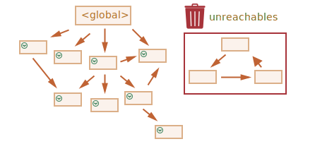

# การเก็บขยะ

การจัดการหน่วยความจำใน JavaScript เป็นไปโดยอัตโนมัติและเกิดขึ้นแบบไม่เปิดเผย เมื่อเราสร้าง primitives, objects, functions ฯลฯ ทั้งหมดนั้นใช้หน่วยความจำ

แล้วเกิดอะไรขึ้นเมื่อมีสิ่งที่ไม่จำเป็นต้องใช้อีกต่อไป? JavaScript engine จะพบและทำความสะอาดได้อย่างไร?

## ความสามารถในการเข้าถึง

แนวคิดหลักของการจัดการหน่วยความจำใน JavaScript คือ *ความสามารถในการเข้าถึง (reachability)*

อย่างง่ายๆ คือ ค่าที่ "เข้าถึงได้" หมายถึงค่าที่สามารถเรียกใช้หรือใช้งานได้ในทางใดทางหนึ่ง มีการรับประกันว่าจะถูกเก็บไว้ในหน่วยความจำ

1. มีชุดพื้นฐานของค่าที่สามารถเข้าถึงได้โดยธรรมชาติ ซึ่งไม่สามารถถูกลบได้ด้วยเหตุผลที่ชัดเจน

    ตัวอย่างเช่น:

    - ฟังก์ชันที่กำลังทำงานอยู่ ตัวแปรท้องถิ่น (local) และพารามิเตอร์ของมัน
    - ฟังก์ชันอื่นๆ บนสายการเรียกแบบซ้อนกันในปัจจุบัน ตัวแปรท้องถิ่นและพารามิเตอร์ของมัน 
    - ตัวแปรโกลบอล
    - (และอื่นๆ อีกบางอย่างที่ซ่อนอยู่)

    ค่าเหล่านี้เรียกว่า *roots*

2. ค่าอื่นๆ ถือว่าเข้าถึงได้ หากมันสามารถเข้าถึงได้จาก root โดยการอ้างอิงหรือสายของการอ้างอิง

    ยกตัวอย่างเช่น หากมีออบเจ็กต์อยู่ในตัวแปรโกลบอล และออบเจ็กต์นั้นมีคุณสมบัติที่อ้างอิงไปยังออบเจ็กต์อื่น ออบเจ็กต์ *นั้น* ก็ถือว่าเข้าถึงได้ และออบเจ็กต์ที่มันอ้างอิงถึงก็เข้าถึงได้เช่นกัน ตัวอย่างโดยละเอียดจะอธิบายต่อไป

มีกระบวนการที่ทำงานอยู่เบื้องหลังใน JavaScript engine ที่เรียกว่า [garbage collector](https://en.wikipedia.org/wiki/Garbage_collection_(computer_science)) มันคอยตรวจสอบออบเจ็กต์ทั้งหมด และลบทิ้งออบเจ็กต์ที่กลายเป็นขยะ ไม่สามารถเข้าถึงได้อีกต่อไป

## ตัวอย่างง่ายๆ 

นี่คือตัวอย่างที่เรียบง่ายที่สุด:

```js
// user มีการอ้างอิงไปยังออบเจ็กต์
let user = {
  name: "John"
};
```


ที่นี่ลูกศรหมายถึงการอ้างอิงออบเจ็กต์ ตัวแปรโกลบอล `"user"` อ้างอิงไปยัง ออบเจ็กต์ `{name: "John"}` (เราจะเรียกมันสั้นๆ ว่า John) ส่วนคุณสมบัติ `"name"` ของ John เก็บค่า primitive ไว้ จึงถูกแสดงอยู่ภายในออบเจ็กต์

ถ้าค่าของ `user` ถูกเขียนทับ การอ้างอิงจะหายไป:

```js
user = null;
```


ตอนนี้ John ไม่สามารถเข้าถึงได้อีกต่อไป ไม่มีทางเข้าถึงมันได้ ไม่มีการอ้างอิงใดๆ ถึงมันแล้ว Garbage collector จะเก็บข้อมูลขยะและคืนหน่วยความจำ

## การอ้างอิงสองรายการ

ลองจินตนาการว่าเราได้คัดลอกการอ้างอิงจาก `user` ไปยัง `admin`:

```js
// user มีการอ้างอิงไปยังออบเจ็กต์
let user = {
  name: "John"
};

*!*
let admin = user;
*/!*
```


ตอนนี้ถ้าเราทำแบบเดิม:
```js
user = null;
```

...แล้วออบเจ็กต์ก็ยังคงเข้าถึงได้ผ่านตัวแปรโกลบอล `admin` ดังนั้นจึงต้องยังคงอยู่ในหน่วยความจำ แต่ถ้าเราเขียนทับ `admin` ด้วย มันก็สามารถถูกลบทิ้งได้

## ออบเจ็กต์ที่เชื่อมโยงกัน

ตอนนี้เป็นตัวอย่างที่ซับซ้อนกว่าเดิมเล็กน้อย ออบเจ็กต์ครอบครัว:

```js
function marry(man, woman) {
  woman.husband = man;
  man.wife = woman;

  return {
    father: man,
    mother: woman
  }
}

let family = marry({
  name: "John"
}, {
  name: "Ann"
});
```

ฟังก์ชัน `marry` "แต่งงาน" ให้ออบเจ็กต์สองตัว โดยให้มีการอ้างอิงถึงกันและกัน และคืนออบเจ็กต์ใหม่ที่มีทั้งสองอยู่ด้วย

โครงสร้างหน่วยความจำที่ได้:


ณ ตอนนี้ ออบเจ็กต์ทั้งหมดเข้าถึงได้

มาลองลบการอ้างอิงสองรายการ:

```js
delete family.father;
delete family.mother.husband;
```


การลบแค่หนึ่งในสองรายการยังไม่เพียงพอ เพราะออบเจ็กต์ทั้งหมดจะยังคงเข้าถึงได้อยู่

แต่ถ้าเราลบทั้งสองรายการ จะเห็นว่า John ไม่มีการอ้างอิงมาหามันอีกต่อไป:


การอ้างอิงขาออกไม่มีความสำคัญ มีเพียงการอ้างอิงขาเข้าเท่านั้นที่สามารถทำให้ออบเจ็กต์เข้าถึงได้ ดังนั้นตอนนี้ John จึงไม่สามารถเข้าถึงได้ และจะถูกลบทิ้งพร้อมกับข้อมูลทั้งหมดที่ไม่สามารถเข้าถึงได้อีก

หลังจากการเก็บขยะ:


## เกาะที่เข้าถึงไม่ถึง

มันเป็นไปได้ที่เกาะทั้งเกาะของออบเจ็กต์ที่เชื่อมโยงกันจะกลายเป็นสิ่งที่เข้าถึงไม่ได้และถูกลบออกจากหน่วยความจำ

ออบเจ็กต์ต้นทางคือออบเจ็กต์เดิมเหมือนข้างบน จากนั้นเมื่อ:

```js
family = null;
```

สถานการณ์ในหน่วยความจำจะเป็น:


ตัวอย่างนี้แสดงให้เห็นว่าแนวคิดเรื่องความสามารถในการเข้าถึงนั้นสำคัญขนาดไหน

มันเป็นที่ชัดเจนว่า John และ Ann ยังคงเชื่อมโยงกันอยู่ ทั้งคู่ยังมีการอ้างอิงขาเข้า แต่นั่นยังไม่เพียงพอ

ออบเจ็กต์ `"family"` ที่เคยมีได้ถูกยกเลิกการเชื่อมโยงจาก root ไม่มีการอ้างอิงใดๆ ถึงมันอีกแล้ว ดังนั้นเกาะทั้งหมดจึงกลายเป็นสิ่งที่เข้าถึงไม่ได้และจะถูกลบทิ้ง

## อัลกอริธึมภายใน

อัลกอริธึมการเก็บขยะแบบพื้นฐานเรียกว่า "mark-and-sweep"

ขั้นตอนการ "เก็บขยะ" ต่อไปนี้จะถูกดำเนินการเป็นระยะ:

- Garbage collector รวบรวม roots และ "ทำเครื่องหมาย" (จดจำไว้)
- จากนั้นมันจะเยี่ยมและทำเครื่องหมายการอ้างอิงทั้งหมดจาก roots
- แล้วจะไปยังออบเจ็กต์ที่ถูกทำเครื่องหมายและทำเครื่องหมาย *การอ้างอิง* ของพวกมัน ออบเจ็กต์ทั้งหมดที่ไปเยี่ยมจะถูกจดจำไว้ เพื่อไม่ให้ไปที่ออบเจ็กต์เดิมซ้ำ 
- ...และทำแบบนี้ต่อไปเรื่อยๆ จนกว่าทุกการอ้างอิงที่เข้าถึงได้ (จาก roots) จะถูกไปเยี่ยมแล้ว
- ออบเจ็กต์ทั้งหมด ยกเว้นที่มีเครื่องหมาย จะถูกลบทิ้ง

ยกตัวอย่างเช่น สมมติว่าโครงสร้างออบเจ็กต์ของเราเป็นแบบนี้:


เราเห็นได้ชัดว่ามี "เกาะที่เข้าถึงไม่ได้" ที่ด้านขวา มาดูกันว่า garbage collector แบบ "mark-and-sweep" จัดการกับมันอย่างไร 

ขั้นแรกคือการทำเครื่องหมายที่ roots:


จากนั้นเราก็ไปตามการอ้างอิงของพวกมันและทำเครื่องหมายออบเจ็กต์ที่ถูกอ้างอิงถึง:


...และทำต่อไปเรื่อยๆ จนไม่มีออบเจ็กต์ให้ทำเครื่องหมายต่อ:


ในตอนนี้ ออบเจ็กต์ที่ไม่มีการไปเยี่ยมระหว่างขั้นตอนจะถือว่าเข้าถึงไม่ได้แล้วและจะถูกลบทิ้งไป:



เราจะจินตนาการว่ากระบวนการทำงานเหมือนการใช้ถังสีขนาดใหญ่ราดจากจุด roots สีจะไหลไปตามการอ้างอิงทั้งหมดและทำเครื่องหมายที่ออบเจ็กต์ทุกตัวที่เข้าถึงได้ ส่วนที่ไม่มีเครื่องหมายก็จะถูกลบทิ้ง

นี่คือแนวคิดพื้นฐานของการทำงานของ garbage collection JavaScript engines มีการใช้เทคนิคปรับปรุงประสิทธิภาพหลายอย่างเพื่อให้มันทำงานได้เร็วขึ้นและไม่ทำให้เกิดความล่าช้าในการประมวลผลโค้ด

บางส่วนของเทคนิคเหล่านี้ได้แก่:

- **Generational collection** -- ออบเจ็กต์จะถูกแบ่งเป็นสองชุด: "ออบเจ็กต์ใหม่" และ "ออบเจ็กต์เก่า" ในโค้ดทั่วไป ออบเจ็กต์หลายตัวจะมีช่วงชีวิตสั้น: พวกมันถูกสร้างขึ้น ทำหน้าที่ และหายไปอย่างรวดเร็ว ดังนั้นจึงมีเหตุผลที่จะติดตามออบเจ็กต์ใหม่และคืนหน่วยความจำจากพวกมัน หากกรณีเป็นเช่นนั้นจริงๆ ส่วนที่อยู่นานพอจะกลายเป็น "ออบเจ็กต์เก่า" และถูกตรวจสอบน้อยลง
- **Incremental collection** -- หากมีออบเจ็กต์จำนวนมาก และเราพยายามที่จะวนรอบและทำเครื่องหมายทีเดียวให้หมด อาจจะใช้เวลาพอสมควรและทำให้เกิดความล่าช้าที่สังเกตได้ชัดในการทำงาน ดังนั้น engine จะแบ่งชุดออบเจ็กต์ทั้งหมดที่มีอยู่ออกเป็นหลายส่วน แล้วค่อยๆ เก็บแต่ละส่วนทีละนิด จะมีการเก็บขยะหลายครั้งแบบเล็กๆ แทนที่จะเก็บครั้งเดียวทั้งหมด ซึ่งจำเป็นต้องมีการจัดการพิเศษระหว่างการเก็บแต่ละครั้งเพื่อติดตามการเปลี่ยนแปลง แต่เราจะได้ความล่าช้าเล็กๆ หลายครั้งแทนที่จะเป็นครั้งใหญ่ครั้งเดียว
- **Idle-time collection** -- garbage collector จะพยายามทำงานเฉพาะในช่วงที่ CPU ว่างเท่านั้น เพื่อลดผลกระทบต่อการทำงานของโปรแกรมให้มากที่สุด 

ยังมีการปรับแต่งและอัลกอริธึมการเก็บขยะในรูปแบบอื่นๆ อีกมากมาย ถึงแม้ผมอยากจะอธิบายถึงพวกมันที่นี่ก็ตาม แต่คงต้องยับยั้งไว้ก่อน เพราะแต่ละ engine จะมีเทคนิคและรายละเอียดปลีกย่อยที่แตกต่างกัน และที่สำคัญไปกว่านั้น สิ่งต่างๆ มักจะเปลี่ยนแปลงไปเมื่อ engine ถูกพัฒนา ดังนั้นการศึกษาเชิงลึก "ล่วงหน้า" โดยไม่มีความจำเป็นจริงๆ อาจจะไม่คุ้มค่านัก เว้นเสียแต่ว่ามันเป็นเรื่องที่คุณสนใจจริงๆ ซึ่งในกรณีนั้นจะมีลิงก์สำหรับอ่านเพิ่มเติมให้ด้านล่างนี้

## สรุป

สิ่งสำคัญที่ควรรู้มีดังนี้:

- Garbage collection เกิดขึ้นโดยอัตโนมัติ เราไม่สามารถบังคับให้มันทำงานหรือป้องกันมันได้
- ออบเจ็กต์จะยังคงอยู่ในหน่วยความจำตราบเท่าที่ยังเข้าถึงได้
- การถูกอ้างอิงไม่เท่ากับการเข้าถึงได้ (จาก root): หมู่ออบเจ็กต์ที่เชื่อมต่อกันอาจกลายเป็นสิ่งที่เข้าถึงไม่ได้ทั้งหมด เหมือนอย่างในตัวอย่างข้างต้น

JavaScript engines สมัยใหม่ได้นำอัลกอริธึมขั้นสูงมาใช้ในการเก็บขยะ

หนังสือทั่วไปเล่มหนึ่งชื่อ "The Garbage Collection Handbook: The Art of Automatic Memory Management" (R. Jones et al) ได้อธิบายถึงอัลกอริธึมบางส่วนเหล่านี้

หากคุณคุ้นเคยกับการเขียนโปรแกรมระดับต่ำ ข้อมูลเพิ่มเติมโดยละเอียดเกี่ยวกับ garbage collector ของ V8 มีอยู่ในบทความ [A tour of V8: Garbage Collection](https://jayconrod.com/posts/55/a-tour-of-v8-garbage-collection)

[บล็อกของ V8](https://v8.dev/) เองก็มีการเผยแพร่บทความเกี่ยวกับการเปลี่ยนแปลงในการจัดการหน่วยความจำเป็นระยะๆ แน่นอนว่าในการเรียนรู้เพิ่มเติมเกี่ยวกับ garbage collection คุณควรเตรียมพื้นฐานเกี่ยวกับการทำงานภายในของ V8 โดยทั่วไปก่อน และอ่านบล็อกของ [Vyacheslav Egorov](https://mrale.ph) ผู้ซึ่งเคยเป็นหนึ่งในทีมวิศวกรของ V8 ที่ผมพูดถึง "V8" เพราะมันเป็น engine ที่มีบทความเกี่ยวกับมันมากที่สุดในอินเทอร์เน็ต สำหรับ engine อื่นๆ หลายแนวคิดก็คล้ายคลึงกัน แต่การเก็บขยะจะมีความแตกต่างกันในรายละเอียดหลายอย่าง

การมีความรู้เชิงลึกเกี่ยวกับ engines จะมีประโยชน์มากเมื่อคุณต้องการปรับแต่งประสิทธิภาพในระดับล่างสุด มันจะเป็นการฉลาดที่จะวางแผนเรียนรู้เรื่องนี้เป็นขั้นตอนถัดไปหลังจากที่คุณคุ้นเคยกับภาษาเป็นอย่างดีแล้ว