# การเก็บขยะ

JavaScript จัดการหน่วยความจำให้เราโดยอัตโนมัติ ไม่ต้องทำอะไรเอง ไม่ว่าจะสร้าง primitive, ออบเจ็กต์, ฟังก์ชัน ฯลฯ ทุกอย่างล้วนใช้หน่วยความจำทั้งสิ้น

แล้วพอมีอะไรที่ไม่ต้องใช้แล้วล่ะ? JavaScript engine รู้ได้อย่างไร แล้วจัดการทำความสะอาดยังไง?

## การเข้าถึงได้ (Reachability)

แนวคิดหลักของการจัดการหน่วยความจำใน JavaScript คือ *การเข้าถึงได้ (reachability)*

พูดง่ายๆ ก็คือ ค่าที่ "เข้าถึงได้" คือค่าที่ยังเรียกใช้หรือใช้งานได้อยู่ ค่าเหล่านี้จะถูกเก็บไว้ในหน่วยความจำอย่างแน่นอน

1. มีค่าพื้นฐานบางกลุ่มที่เข้าถึงได้โดยธรรมชาติ และลบทิ้งไม่ได้อยู่แล้ว

    เช่น:

    - ฟังก์ชันที่กำลังทำงานอยู่ รวมถึงตัวแปรภายในฟังก์ชันและพารามิเตอร์ของฟังก์ชันนั้น
    - ฟังก์ชันอื่นๆ ที่อยู่ในสายการเรียกแบบซ้อนกัน พร้อมตัวแปรภายในฟังก์ชันและพารามิเตอร์ของแต่ละตัว
    - ตัวแปรโกลบอล
    - (รวมถึงค่าภายในอื่นๆ อีกบางอย่าง)

    ค่าเหล่านี้เรียกว่า *roots*

2. ค่าอื่นๆ จะถือว่าเข้าถึงได้ ก็ต่อเมื่อเข้าถึงได้จาก root ผ่านการอ้างอิง (reference) หรือสายโซ่ของการอ้างอิง

    เช่น ถ้ามีออบเจ็กต์อยู่ในตัวแปรโกลบอล และออบเจ็กต์นั้นมีพร็อพเพอร์ตี้ที่อ้างอิงไปยังออบเจ็กต์อื่น — ออบเจ็กต์ *นั้น* ก็ถือว่าเข้าถึงได้ด้วย รวมถึงออบเจ็กต์ที่ถูกอ้างอิงต่อไปเรื่อยๆ ก็เข้าถึงได้เช่นกัน เดี๋ยวจะมีตัวอย่างให้ดูกัน

ใน JavaScript engine จะมีกระบวนการทำงานอยู่เบื้องหลังที่เรียกว่า [garbage collector](https://en.wikipedia.org/wiki/Garbage_collection_(computer_science)) คอยตรวจสอบออบเจ็กต์ทั้งหมด แล้วลบตัวที่เข้าถึงไม่ได้แล้วทิ้งไป

## ตัวอย่างง่ายๆ

ลองดูตัวอย่างที่ง่ายที่สุดกัน:

```js
// user มีการอ้างอิงไปยังออบเจ็กต์
let user = {
  name: "John"
};
```

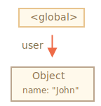

ลูกศรในรูปแสดงถึงการอ้างอิงออบเจ็กต์ ตัวแปรโกลบอล `"user"` อ้างอิงไปยังออบเจ็กต์ `{name: "John"}` (เราจะเรียกสั้นๆ ว่า John) ส่วนพร็อพเพอร์ตี้ `"name"` ของ John เก็บค่า primitive ไว้ จึงแสดงอยู่ภายในออบเจ็กต์

ถ้าเขียนทับค่าของ `user` การอ้างอิงก็จะหายไป:

```js
user = null;
```

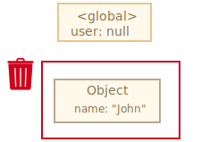

ตอนนี้ John เข้าถึงไม่ได้แล้ว ไม่มีทางเข้าถึงได้ ไม่มีการอ้างอิงใดๆ เหลืออยู่ Garbage collector ก็จะเก็บกวาดข้อมูลทิ้งแล้วคืนหน่วยความจำ

## การอ้างอิงสองตัว

ทีนี้ลองนึกภาพว่าเราคัดลอกการอ้างอิงจาก `user` ไปให้ `admin`:

```js
// user มีการอ้างอิงไปยังออบเจ็กต์
let user = {
  name: "John"
};

*!*
let admin = user;
*/!*
```

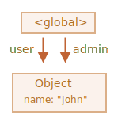

ตอนนี้ถ้าเราทำแบบเดิม:
```js
user = null;
```

...ออบเจ็กต์ก็ยังเข้าถึงได้ผ่านตัวแปรโกลบอล `admin` จึงยังคงอยู่ในหน่วยความจำ แต่ถ้าเขียนทับ `admin` ด้วยเช่นกัน ออบเจ็กต์ก็จะถูกลบทิ้งได้

## ออบเจ็กต์ที่เชื่อมโยงกัน

คราวนี้มาดูตัวอย่างที่ซับซ้อนขึ้นอีกหน่อย — ครอบครัว:

```js
function marry(man, woman) {
  woman.husband = man;
  man.wife = woman;

  return {
    father: man,
    mother: woman
  }
}

let family = marry({
  name: "John"
}, {
  name: "Ann"
});
```

ฟังก์ชัน `marry` "แต่งงาน" ให้ออบเจ็กต์สองตัว โดยสร้างการอ้างอิงถึงกันและกัน แล้วคืนค่าเป็นออบเจ็กต์ใหม่ที่รวมทั้งคู่ไว้ด้วยกัน

โครงสร้างหน่วยความจำที่ได้:

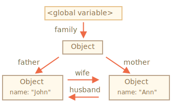

ตอนนี้ออบเจ็กต์ทุกตัวเข้าถึงได้หมด

ทีนี้ลองลบการอ้างอิงออกสองตัว:

```js
delete family.father;
delete family.mother.husband;
```

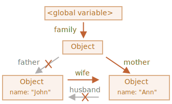

ถ้าลบแค่ตัวเดียวยังไม่พอ เพราะออบเจ็กต์ทุกตัวจะยังเข้าถึงได้อยู่

แต่พอลบทั้งสองตัว จะเห็นว่า John ไม่มีการอ้างอิงขาเข้าเหลืออยู่เลย:

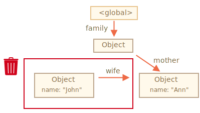

การอ้างอิงขาออกไม่สำคัญ สิ่งที่ทำให้ออบเจ็กต์ยังอยู่ได้คือการอ้างอิงขาเข้าเท่านั้น ดังนั้น John จึงเข้าถึงไม่ได้แล้ว และจะถูกลบทิ้งพร้อมข้อมูลทั้งหมดที่เข้าถึงไม่ได้ด้วย

หลังจากการเก็บขยะ:

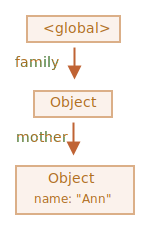

## เกาะที่เข้าถึงไม่ได้

บางครั้งกลุ่มออบเจ็กต์ที่เชื่อมโยงกันทั้งกลุ่ม อาจกลายเป็น "เกาะ" ที่เข้าถึงไม่ได้ แล้วก็ถูกลบออกจากหน่วยความจำทั้งหมดเลย

สมมติใช้ออบเจ็กต์เดิมจากตัวอย่างข้างบน แล้วทำแบบนี้:

```js
family = null;
```

ภาพในหน่วยความจำจะกลายเป็น:

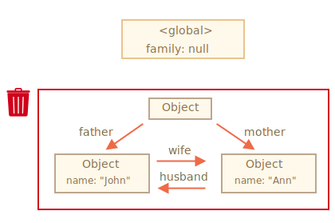

ตัวอย่างนี้แสดงให้เห็นว่าแนวคิดเรื่อง "การเข้าถึงได้" สำคัญแค่ไหน

จะเห็นว่า John กับ Ann ยังเชื่อมโยงกันอยู่ ทั้งคู่มีการอ้างอิงขาเข้า แต่แค่นั้นไม่พอ

เพราะออบเจ็กต์ `"family"` ถูกตัดออกจาก root แล้ว ไม่มีการอ้างอิงใดๆ ชี้มาที่ตัวมันอีก เกาะทั้งเกาะจึงเข้าถึงไม่ได้และจะถูกลบทิ้งทั้งหมด

## อัลกอริธึมภายใน

อัลกอริธึมการเก็บขยะแบบพื้นฐานเรียกว่า "mark-and-sweep"

ขั้นตอน "เก็บขยะ" ต่อไปนี้จะทำงานเป็นระยะ:

- Garbage collector เริ่มจาก roots แล้ว "ทำเครื่องหมาย" (จดจำ) ไว้
- จากนั้นไล่ตามการอ้างอิงทั้งหมดจาก roots แล้วทำเครื่องหมายไปเรื่อยๆ
- แล้วก็ไปต่อที่ออบเจ็กต์ที่ทำเครื่องหมายไว้แล้ว ทำเครื่องหมาย *การอ้างอิง* ของออบเจ็กต์เหล่านั้นอีกที โดยจดจำทุกออบเจ็กต์ที่เคยไปเยี่ยมแล้ว เพื่อไม่ให้ไปซ้ำ
- ...ทำแบบนี้ต่อไปเรื่อยๆ จนไม่เหลือการอ้างอิงที่เข้าถึงได้ (จาก roots) ให้ไปเยี่ยมอีกแล้ว
- ออบเจ็กต์ใดที่ไม่มีเครื่องหมาย ก็จะถูกลบทิ้ง

สมมติว่าโครงสร้างออบเจ็กต์เป็นแบบนี้:

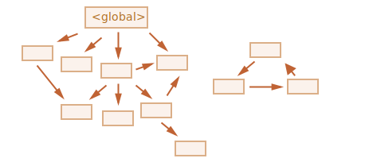

จะเห็นว่ามี "เกาะที่เข้าถึงไม่ได้" อยู่ทางด้านขวา มาดูกันว่า garbage collector แบบ "mark-and-sweep" จัดการยังไง

ขั้นแรกคือการทำเครื่องหมายที่ roots:

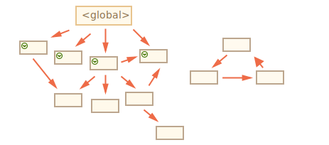

จากนั้นไล่ตามการอ้างอิง แล้วทำเครื่องหมายออบเจ็กต์ที่อ้างอิงถึง:

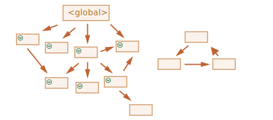

...แล้วไล่ตามต่อไปเรื่อยๆ จนไม่เหลือออบเจ็กต์ให้ทำเครื่องหมาย:


ออบเจ็กต์ที่ไม่ได้ถูกเยี่ยมระหว่างกระบวนการนี้ จะถือว่าเข้าถึงไม่ได้แล้ว และจะถูกลบทิ้ง:

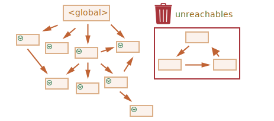

ลองจินตนาการว่ากระบวนการนี้เหมือนเอาถังสีใบใหญ่ราดลงจาก roots — สีจะไหลไปตามการอ้างอิงทั้งหมด ทำเครื่องหมายออบเจ็กต์ที่เข้าถึงได้ทุกตัว ส่วนตัวไหนไม่โดนสี ก็จะถูกลบทิ้ง

นี่คือแนวคิดพื้นฐานของ garbage collection ซึ่ง JavaScript engine ยังมีเทคนิคเพิ่มเติมอีกหลายอย่าง เพื่อให้ทำงานเร็วขึ้นและไม่ทำให้โค้ดสะดุด

เทคนิคที่น่าสนใจ เช่น:

- **Generational collection** — แบ่งออบเจ็กต์เป็นสองกลุ่ม: "ใหม่" กับ "เก่า" ในโค้ดทั่วไป ออบเจ็กต์จำนวนมากมีอายุสั้น — สร้างขึ้นมา ทำหน้าที่ แล้วก็หายไปอย่างรวดเร็ว จึงสมเหตุสมผลที่จะคอยติดตามออบเจ็กต์ใหม่แล้วคืนหน่วยความจำโดยเร็ว ส่วนตัวที่อยู่นานพอก็จะกลายเป็น "ออบเจ็กต์เก่า" แล้วถูกตรวจสอบน้อยลง
- **Incremental collection** — ถ้ามีออบเจ็กต์จำนวนมากแล้วพยายามวนทำเครื่องหมายทีเดียวหมด อาจใช้เวลานานจนโค้ดสะดุดได้ engine จึงแบ่งออบเจ็กต์ออกเป็นหลายส่วน แล้วค่อยๆ เก็บทีละส่วน วิธีนี้ต้องจัดการเพิ่มเติมเพื่อติดตามการเปลี่ยนแปลงระหว่างรอบ แต่ข้อดีคือเจอแค่ความล่าช้าเล็กๆ หลายครั้ง แทนที่จะหยุดนานครั้งเดียว
- **Idle-time collection** — garbage collector จะพยายามทำงานเฉพาะช่วงที่ CPU ว่างเท่านั้น เพื่อลดผลกระทบต่อการทำงานของโปรแกรม

ยังมีเทคนิคและอัลกอริธึมการเก็บขยะอื่นๆ อีกมาก อยากจะอธิบายเพิ่มแต่คงต้องหยุดไว้ก่อน เพราะแต่ละ engine ใช้เทคนิคที่ต่างกัน และที่สำคัญกว่านั้น — สิ่งเหล่านี้เปลี่ยนแปลงอยู่เรื่อยๆ ตามที่ engine ถูกพัฒนา การศึกษาเชิงลึก "ล่วงหน้า" โดยไม่มีความจำเป็นจริงๆ อาจไม่คุ้ม เว้นแต่ว่าสนใจจริงๆ ซึ่งถ้าเป็นเช่นนั้นก็มีลิงก์ให้อ่านเพิ่มด้านล่างนี้

## สรุป

สิ่งสำคัญที่ควรจำ:

- Garbage collection ทำงานโดยอัตโนมัติ เราบังคับหรือป้องกันไม่ได้
- ออบเจ็กต์จะยังอยู่ในหน่วยความจำตราบเท่าที่ยังเข้าถึงได้
- "ถูกอ้างอิง" ไม่ได้แปลว่า "เข้าถึงได้" เสมอไป — กลุ่มออบเจ็กต์ที่เชื่อมต่อกันอาจกลายเป็นเกาะที่เข้าถึงไม่ได้ทั้งกลุ่ม อย่างที่เราเห็นในตัวอย่างข้างต้น

JavaScript engine สมัยใหม่ใช้อัลกอริธึมขั้นสูงในการเก็บขยะ

หนังสือ "The Garbage Collection Handbook: The Art of Automatic Memory Management" (R. Jones et al) อธิบายอัลกอริธึมเหล่านี้ไว้อย่างละเอียด

ถ้ามีพื้นฐานเรื่อง low-level programming อยู่แล้ว รายละเอียดเกี่ยวกับ garbage collector ของ V8 อ่านได้ในบทความ [A tour of V8: Garbage Collection](https://jayconrod.com/posts/55/a-tour-of-v8-garbage-collection)

[บล็อกของ V8](https://v8.dev/) ก็มีบทความเกี่ยวกับการเปลี่ยนแปลงในการจัดการหน่วยความจำออกมาเป็นระยะ ถ้าอยากเรียนรู้เพิ่มเติมเรื่อง garbage collection ควรทำความเข้าใจการทำงานภายในของ V8 ก่อน แล้วก็อ่านบล็อกของ [Vyacheslav Egorov](https://mrale.ph) ซึ่งเคยเป็นวิศวกรของ V8 ที่พูดถึง "V8" เพราะเป็น engine ที่มีบทความเกี่ยวกับเรื่องนี้มากที่สุดในอินเทอร์เน็ต สำหรับ engine อื่นๆ แนวคิดหลายอย่างก็คล้ายกัน แต่รายละเอียดของการเก็บขยะจะต่างกันไป

ความรู้เชิงลึกเรื่อง engine จะเป็นประโยชน์มากเมื่อต้องทำ low-level optimization แต่ควรวางแผนศึกษาเรื่องนี้ในขั้นถัดไป หลังจากที่คุ้นเคยกับตัวภาษาดีแล้ว
