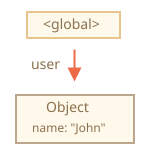
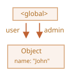
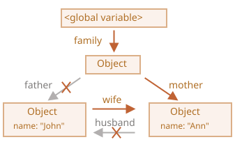
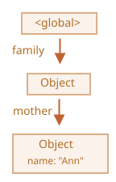
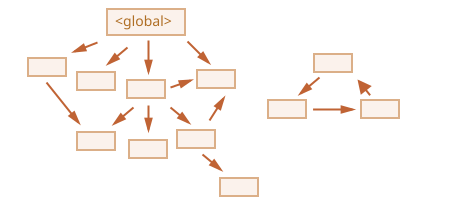
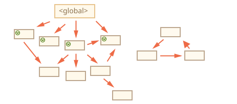
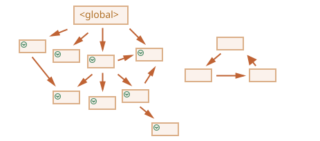

# การเก็บขยะ (Garbage collection)

JavaScript จัดการหน่วยความจำให้เราเองโดยอัตโนมัติ เวลาสร้างค่าพื้นฐาน (primitive) ออบเจ็กต์ หรือฟังก์ชัน ทุกอย่างล้วนต้องใช้หน่วยความจำ แต่เราไม่ต้องคอยจัดสรรเอง

แล้วเมื่อค่าไหนไม่จำเป็นต้องใช้อีก JavaScript engine รู้ได้อย่างไรว่าควรเก็บค่านั้นทิ้งและคืนพื้นที่หน่วยความจำ?

## การเข้าถึงได้ (Reachability) [#reachability]

แนวคิดหลักที่ JavaScript ใช้จัดการหน่วยความจำคือ *การเข้าถึงได้ (reachability)*

พูดง่าย ๆ คือ ค่าที่ยัง "เข้าถึงได้" เป็นค่าที่โปรแกรมยังมีทางหยิบมาใช้งาน ค่าเหล่านี้จึงต้องอยู่ในหน่วยความจำต่อไป

1. มีค่ากลุ่มหนึ่งที่เป็นจุดตั้งต้นและเข้าถึงได้อยู่เสมอ จึงลบทิ้งไม่ได้

    ตัวอย่างเช่น:

    - ฟังก์ชันที่กำลังทำงานอยู่ รวมถึงตัวแปรภายในและพารามิเตอร์ของฟังก์ชันนั้น
    - ฟังก์ชันอื่น ๆ ที่อยู่ในสายการเรียกซ้อนกัน รวมถึงตัวแปรภายในและพารามิเตอร์ของแต่ละฟังก์ชัน
    - ตัวแปรโกลบอล
    - ค่าภายในบางอย่างของ engine

    จุดตั้งต้นเหล่านี้เรียกว่า *roots*

2. ค่าอื่นจะถือว่ายังเข้าถึงได้ เมื่อมีการอ้างอิงจาก root มาถึงค่านั้น ไม่ว่าจะอ้างอิงโดยตรงหรือต่อกันเป็นทอด ๆ

    สมมติตัวแปรโกลบอลเก็บออบเจ็กต์หนึ่งไว้ และพร็อพเพอร์ตี้ของออบเจ็กต์นั้นอ้างอิงไปยังออบเจ็กต์อีกตัว ออบเจ็กต์ตัวที่สองก็ยังเข้าถึงได้ รวมถึงออบเจ็กต์อื่นที่มันอ้างอิงต่อไปอีกด้วย เดี๋ยวเราจะไล่ดูตัวอย่างทีละขั้น

JavaScript engine มีกระบวนการเบื้องหลังที่เรียกว่า [garbage collector](https://en.wikipedia.org/wiki/Garbage_collection_(computer_science)) คอยตรวจออบเจ็กต์ทั้งหมดและนำตัวที่เข้าถึงไม่ได้ออกจากหน่วยความจำ

## ตัวอย่างง่าย ๆ [#a-simple-example]

เริ่มจากตัวอย่างที่ง่ายที่สุด:

```js
// user อ้างอิงออบเจ็กต์นี้อยู่
let user = {
  name: "John"
};
```



ลูกศรในรูปแทนการอ้างอิงออบเจ็กต์ ตัวแปรโกลบอล `"user"` อ้างอิงออบเจ็กต์ `{name: "John"}` ซึ่งต่อจากนี้เราจะเรียกสั้น ๆ ว่า John ส่วนพร็อพเพอร์ตี้ `"name"` ของ John เก็บค่า primitive ไว้ ค่านี้จึงแสดงอยู่ข้างในออบเจ็กต์

ถ้าเขียนค่าใหม่ทับ `user` การอ้างอิงเดิมก็จะหายไป:

```js
user = null;
```


ทีนี้ไม่มีเส้นทางจาก root มาถึง John แล้ว และไม่มีการอ้างอิงอื่นชี้มาหา John จึงเข้าถึงไม่ได้ เมื่อ garbage collector ทำงาน มันจะนำข้อมูลของ John ออกจากหน่วยความจำแล้วคืนพื้นที่นั้น

## ออบเจ็กต์เดียว การอ้างอิงสองเส้น [#two-references]

ต่อไปลองคัดลอกการอ้างอิงจาก `user` ไปเก็บใน `admin`:

```js
// user อ้างอิงออบเจ็กต์นี้อยู่
let user = {
  name: "John"
};

*!*
let admin = user;
*/!*
```



ถ้าทำแบบเดิม:
```js
user = null;
```

ถึงอย่างนั้น ออบเจ็กต์ยังเข้าถึงได้ผ่านตัวแปรโกลบอล `admin` จึงต้องอยู่ในหน่วยความจำต่อไป แต่ถ้าเขียนค่าใหม่ทับ `admin` ด้วย garbage collector ก็จะเก็บออบเจ็กต์นี้ทิ้งได้

## ออบเจ็กต์ที่เชื่อมโยงกัน [#interlinked-objects]

คราวนี้เพิ่มความซับซ้อนขึ้นอีกหน่อยด้วยตัวอย่างครอบครัว:

```js
function marry(man, woman) {
  woman.husband = man;
  man.wife = woman;

  return {
    father: man,
    mother: woman
  }
}

let family = marry({
  name: "John"
}, {
  name: "Ann"
});
```

ฟังก์ชัน `marry` จับออบเจ็กต์สองตัวมา "แต่งงาน" กัน โดยเพิ่มการอ้างอิงจากแต่ละฝ่ายไปหาอีกฝ่าย แล้วคืนออบเจ็กต์ใหม่ที่เก็บทั้งคู่ไว้

โครงสร้างในหน่วยความจำจึงเป็นแบบนี้:


ตอนนี้ออบเจ็กต์ทุกตัวยังเข้าถึงได้

ทีนี้ลองลบการอ้างอิงสองเส้นออก:

```js
delete family.father;
delete family.mother.husband;
```



ถ้าต้องการให้ John เข้าถึงไม่ได้ การลบเพียงเส้นใดเส้นหนึ่งยังไม่พอ เพราะออบเจ็กต์ทุกตัวจะยังเข้าถึงได้อยู่

เมื่อลบครบแล้ว John จะไม่มีการอ้างอิงที่ชี้เข้ามาหาอีก:


ถ้าจะดูว่า John ยังเข้าถึงได้หรือไม่ การอ้างอิงที่ชี้ออกจาก John ไม่ได้ช่วยอะไร ต้องมีการอ้างอิงจากออบเจ็กต์ที่เข้าถึงได้ชี้เข้ามาหา ตอนนี้ John จึงเข้าถึงไม่ได้ และ garbage collector จะนำ John ออกจากหน่วยความจำพร้อมข้อมูลทั้งหมดที่เข้าถึงไม่ได้ตามไปด้วย

หลัง garbage collection ทำงาน โครงสร้างจะเหลือแบบนี้:



## เกาะที่เข้าถึงไม่ได้ [#unreachable-island]

ออบเจ็กต์ที่เชื่อมโยงกันทั้งกลุ่มอาจกลายเป็น "เกาะ" ที่เข้าถึงไม่ได้ แล้ว garbage collector จะเก็บทั้งกลุ่มออกจากหน่วยความจำ

ใช้โครงสร้างเดิมจากตัวอย่างก่อนหน้า แล้วกำหนดค่าใหม่ให้ `family`:

```js
family = null;
```

ภาพในหน่วยความจำจะกลายเป็นแบบนี้:


ตัวอย่างนี้ทำให้เห็นชัดว่าการเข้าถึงได้สำคัญอย่างไร

แม้ John กับ Ann จะยังเชื่อมโยงและอ้างอิงถึงกัน แต่เท่านั้นยังไม่พอ

เมื่อ `family` ไม่อ้างอิงออบเจ็กต์เดิมแล้ว เส้นทางจาก root มายังออบเจ็กต์นั้นก็หายไป ออบเจ็กต์ทั้งเกาะจึงเข้าถึงไม่ได้และ garbage collector จะเก็บทิ้ง

## อัลกอริทึมเบื้องหลัง [#internal-algorithms]

อัลกอริทึมพื้นฐานของ garbage collection เรียกว่า "mark-and-sweep"

กระบวนการนี้จะทำงานเป็นระยะตามขั้นตอนต่อไปนี้:

- Garbage collector เริ่มจาก roots แล้ว "ทำเครื่องหมาย" เพื่อจดจำไว้
- จากนั้นตามการอ้างอิงจาก roots ไปทำเครื่องหมายออบเจ็กต์ทุกตัวที่พบ
- เมื่อเจอออบเจ็กต์ที่ทำเครื่องหมายแล้ว ก็ไล่ตามการอ้างอิงของออบเจ็กต์นั้นต่อ โดยจดจำออบเจ็กต์ที่เคยผ่านไปแล้วเพื่อไม่ให้วนกลับไปซ้ำ
- ทำแบบนี้ต่อไปจนไล่ครบทุกเส้นทางที่ต่อออกมาจาก roots
- Garbage collector จะเก็บออบเจ็กต์ที่ไม่มีเครื่องหมายทิ้ง

สมมติโครงสร้างออบเจ็กต์เป็นแบบนี้:



ด้านขวามี "เกาะที่เข้าถึงไม่ได้" อยู่หนึ่งกลุ่ม ลองไล่ดูว่า garbage collector แบบ mark-and-sweep จัดการกับกลุ่มนี้อย่างไร

ขั้นแรก ทำเครื่องหมายที่ roots:



จากนั้นตามการอ้างอิงออกไป แล้วทำเครื่องหมายออบเจ็กต์ที่พบ:


ไล่ต่อไปตามการอ้างอิงทุกเส้นที่ตามได้:



เมื่อไล่ครบ garbage collector จะถือว่าออบเจ็กต์ที่กระบวนการนี้ไปไม่ถึงนั้นเข้าถึงไม่ได้และเก็บทิ้ง:


นึกภาพว่าเราเทสีลงตรง roots แล้วปล่อยให้ไหลไปตามการอ้างอิง สีจะแต้มออบเจ็กต์ทุกตัวที่เข้าถึงได้ ส่วนตัวที่สีไปไม่ถึง garbage collector ก็จะเก็บทิ้ง

นี่คือหลักพื้นฐานของ garbage collection ส่วน JavaScript engine จะใช้เทคนิคอื่นมาช่วยให้กระบวนการนี้เร็วขึ้นและลดช่วงที่การทำงานของโค้ดต้องสะดุด

ตัวอย่างเทคนิคที่ใช้กัน ได้แก่:

- **Generational collection** — แบ่งออบเจ็กต์เป็นกลุ่ม "ใหม่" กับ "เก่า" โค้ดทั่วไปสร้างออบเจ็กต์จำนวนมากมาใช้เพียงไม่นาน พอทำหน้าที่เสร็จ ออบเจ็กต์ก็หมดความจำเป็น การติดตามออบเจ็กต์ใหม่จึงช่วยคืนหน่วยความจำจากออบเจ็กต์กลุ่มนี้ได้เร็ว ส่วนออบเจ็กต์ที่อยู่รอดนานพอจะย้ายไปอยู่ในกลุ่ม "เก่า" ซึ่ง engine จะตรวจไม่บ่อยเท่ากลุ่มใหม่
- **Incremental collection** — ถ้ามีออบเจ็กต์จำนวนมาก การไล่ทำเครื่องหมายทั้งหมดในรอบเดียวอาจกินเวลาจนโปรแกรมสะดุด engine จึงแบ่งงานออกเป็นส่วนย่อยแล้วทยอยเก็บทีละส่วน วิธีนี้ต้องคอยบันทึกการเปลี่ยนแปลงระหว่างแต่ละรอบเพิ่มขึ้น แต่แลกกับการสะดุดสั้น ๆ หลายครั้งแทนการหยุดยาวครั้งเดียว
- **Idle-time collection** — garbage collector พยายามทำงานในช่วงที่ CPU ว่าง เพื่อลดผลกระทบต่อการทำงานของโปรแกรม

ยังมีอัลกอริทึมและเทคนิคปรับปรุง garbage collection อีกหลายแบบ แต่ละ engine ก็เลือกใช้รายละเอียดต่างกัน และรายละเอียดเหล่านี้เปลี่ยนตามการพัฒนาของ engine ด้วย ถ้ายังไม่มีเหตุให้ต้องใช้งานจริง การลงลึกล่วงหน้าอาจไม่คุ้มเท่าไร แต่ถ้าสนใจเรื่องนี้โดยตรง ท้ายบทมีแหล่งให้อ่านต่อ

## สรุป [#summary]

สรุปสิ่งที่ควรจำ:

- Garbage collection ทำงานอัตโนมัติ โค้ด JavaScript ทั่วไปสั่งให้กระบวนการนี้เริ่มหรือหยุดตามต้องการไม่ได้
- ออบเจ็กต์จะอยู่ในหน่วยความจำตราบใดที่ยังเข้าถึงได้
- การมีออบเจ็กต์อื่นอ้างอิงอยู่ ไม่ได้แปลว่ายังเข้าถึงได้จาก root เสมอไป ออบเจ็กต์ที่เชื่อมโยงกันอาจกลายเป็นเกาะที่เข้าถึงไม่ได้พร้อมกันทั้งกลุ่ม ดังที่เห็นในตัวอย่าง

JavaScript engine ที่ใช้กันทั่วไปมีอัลกอริทึม garbage collection ที่ซับซ้อนกว่านี้อีกมาก

หนังสือ "The Garbage Collection Handbook: The Art of Automatic Memory Management" (R. Jones และคณะ) อธิบายอัลกอริทึมเหล่านี้บางส่วนไว้อย่างละเอียด

ถ้าคุ้นเคยกับการเขียนโปรแกรมระดับ low-level และอยากรู้รายละเอียดของ garbage collector ใน V8 เพิ่ม ลองอ่านบทความ [A tour of V8: Garbage Collection](https://jayconrod.com/posts/55/a-tour-of-v8-garbage-collection)

[บล็อกของ V8](https://v8.dev/) มีบทความที่เล่าความเปลี่ยนแปลงด้านการจัดการหน่วยความจำ ถ้าอยากศึกษา garbage collection ให้ลึกขึ้น ควรทำความรู้จักโครงสร้างภายในของ V8 ก่อน แล้วลองอ่านบล็อกของ [Vyacheslav Egorov](https://mrale.ph) ซึ่งเคยเป็นวิศวกรของ V8 บทนี้ยก V8 เป็นหลักเพราะมีแหล่งอธิบายให้อ่านต่อได้ง่ายกว่า engine อื่น ส่วน engine อื่นใช้แนวคิดหลายอย่างร่วมกัน แต่รายละเอียดของ garbage collection อาจต่างออกไป

ความรู้เชิงลึกเรื่อง engine มีประโยชน์เมื่อต้องปรับประสิทธิภาพในระดับ low-level แนะนำให้ค่อยกลับมาศึกษาหลังจากใช้ภาษา JavaScript ได้คล่องแล้ว
