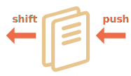
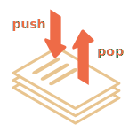
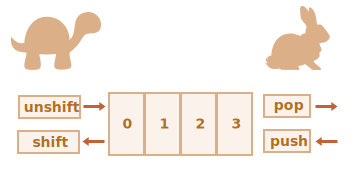
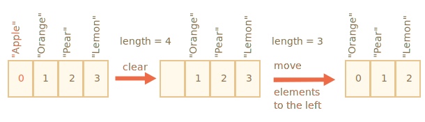
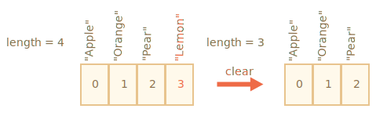

# อาร์เรย์

ออบเจ็กต์ช่วยให้เราเก็บข้อมูลแบบ key-value ได้ดี

แต่บ่อยครั้งเราต้องการ *คอลเล็กชันที่มีลำดับ (ordered collection)* ซึ่งมีสมาชิกตัวที่ 1, ตัวที่ 2, ตัวที่ 3 และต่อๆ ไป เช่น เมื่อต้องการเก็บรายการบางอย่าง: รายชื่อผู้ใช้, สินค้า, HTML elements และอื่นๆ

การใช้ออบเจ็กต์ในกรณีนี้ไม่ค่อยเหมาะ เพราะออบเจ็กต์ไม่มีเมธอดสำหรับจัดการลำดับของสมาชิก เราไม่สามารถแทรกพร็อพเพอร์ตี้ใหม่ "ระหว่าง" พร็อพเพอร์ตี้ที่มีอยู่ได้ ออบเจ็กต์ไม่ได้ออกแบบมาเพื่องานแบบนี้

จึงมีโครงสร้างข้อมูลพิเศษที่ชื่อว่า `Array` ไว้สำหรับเก็บคอลเล็กชันที่มีลำดับโดยเฉพาะ

## การประกาศ

มีสองวิธีในการสร้างอาร์เรย์ว่าง:

```js
let arr = new Array();
let arr = [];
```

เกือบทุกครั้งเราใช้วิธีที่สอง และสามารถใส่สมาชิกเริ่มต้นไว้ในวงเล็บได้เลย:

```js
let fruits = ["Apple", "Orange", "Plum"];
```

สมาชิกในอาร์เรย์มีหมายเลขกำกับ โดยเริ่มจากศูนย์

เราดึงสมาชิกออกมาด้วยหมายเลขดัชนีในวงเล็บเหลี่ยม:

```js run
let fruits = ["Apple", "Orange", "Plum"];

alert( fruits[0] ); // Apple
alert( fruits[1] ); // Orange
alert( fruits[2] ); // Plum
```

เราแทนที่สมาชิกได้:

```js
fruits[2] = 'Pear'; // ตอนนี้กลายเป็น ["Apple", "Orange", "Pear"]
```

...หรือเพิ่มสมาชิกใหม่เข้าไปในอาร์เรย์:

```js
fruits[3] = 'Lemon'; // ตอนนี้กลายเป็น ["Apple", "Orange", "Pear", "Lemon"]
```

จำนวนสมาชิกทั้งหมดในอาร์เรย์ดูได้จาก `length`:

```js run
let fruits = ["Apple", "Orange", "Plum"];

alert( fruits.length ); // 3
```

นอกจากนี้ยังใช้ `alert` แสดงอาร์เรย์ทั้งหมดได้ด้วย:

```js run
let fruits = ["Apple", "Orange", "Plum"];

alert( fruits ); // Apple,Orange,Plum
```

อาร์เรย์สามารถเก็บสมาชิกที่เป็นชนิดข้อมูลใดก็ได้

เช่น:

```js run no-beautify
// รวมข้อมูลหลายชนิด
let arr = [ 'Apple', { name: 'John' }, true, function() { alert('hello'); } ];

// ดึงออบเจ็กต์ที่ index 1 แล้วแสดงชื่อ
alert( arr[1].name ); // John

// ดึงฟังก์ชันที่ index 3 แล้วเรียกใช้
arr[3](); // hello
```


````smart header="จุลภาคท้าย (Trailing comma)"
อาร์เรย์ เช่นเดียวกับออบเจ็กต์ สามารถจบด้วยจุลภาคได้:
```js
let fruits = [
  "Apple",
  "Orange",
  "Plum"*!*,*/!*
];
```

รูปแบบ "trailing comma" ทำให้เพิ่มหรือลบสมาชิกได้ง่ายขึ้น เพราะทุกบรรทัดมีรูปแบบเหมือนกัน
````

## ดึงสมาชิกตัวสุดท้ายด้วย "at"

[recent browser="new"]

สมมติว่าเราต้องการสมาชิกตัวสุดท้ายของอาร์เรย์

บางภาษาโปรแกรมอนุญาตให้ใช้ดัชนีลบแบบนี้ได้เลย เช่น `fruits[-1]`

แต่ใน JavaScript ทำแบบนี้ไม่ได้ — ผลลัพธ์จะเป็น `undefined` เพราะดัชนีในวงเล็บเหลี่ยมจะถูกตีความตรงตัว

ทางหนึ่งคือคำนวณดัชนีเอง: `fruits[fruits.length - 1]`

```js run
let fruits = ["Apple", "Orange", "Plum"];

alert( fruits[fruits.length-1] ); // Plum
```

ดูยุ่งยากนิดหน่อยใช่ไหม? ต้องเขียนชื่อตัวแปรซ้ำถึงสองครั้ง

โชคดีที่มีวิธีสั้นกว่า: `fruits.at(-1)`:

```js run
let fruits = ["Apple", "Orange", "Plum"];

// เหมือนกับ fruits[fruits.length-1]
alert( fruits.at(-1) ); // Plum
```

พูดง่ายๆ ก็คือ `arr.at(i)`:
- ทำงานเหมือน `arr[i]` ทุกประการ ถ้า `i >= 0`
- สำหรับค่า `i` ที่เป็นลบ จะนับถอยหลังจากท้ายอาร์เรย์

## เมธอด pop/push, shift/unshift

[คิว (queue)](https://en.wikipedia.org/wiki/Queue_(abstract_data_type)) เป็นหนึ่งในการใช้งานอาร์เรย์ที่พบบ่อยที่สุด ในศาสตร์คอมพิวเตอร์ คิวคือคอลเล็กชันที่มีลำดับซึ่งรองรับสองการทำงาน:

- `push` เพิ่มสมาชิกไว้ที่ท้าย
- `shift` ดึงสมาชิกออกจากต้น พร้อมเลื่อนคิว ทำให้สมาชิกตัวที่ 2 กลายเป็นตัวที่ 1



อาร์เรย์รองรับทั้งสองการทำงาน

ในทางปฏิบัติ เราต้องการสิ่งนี้บ่อยมาก เช่น คิวของข้อความที่ต้องแสดงบนหน้าจอ

ยังมีการใช้งานอาร์เรย์อีกแบบหนึ่ง นั่นคือโครงสร้างข้อมูลที่เรียกว่า [สแต็ก (stack)](https://en.wikipedia.org/wiki/Stack_(abstract_data_type))

สแต็กรองรับสองการทำงาน:

- `push` เพิ่มสมาชิกไว้ที่ท้าย
- `pop` ดึงสมาชิกออกจากท้าย

สมาชิกใหม่จะถูกเพิ่มหรือดึงออกจาก "ท้าย" เสมอ

สแต็กมักเปรียบเหมือนสำรับไพ่: ไพ่ใหม่วางทับบนกองหรือหยิบออกจากด้านบน:



สำหรับสแต็ก สมาชิกที่เพิ่งใส่เข้าไปล่าสุดจะถูกดึงออกมาก่อน นี่คือหลักการ LIFO (Last-In-First-Out) ส่วนคิวใช้ FIFO (First-In-First-Out)

อาร์เรย์ใน JavaScript ทำงานได้ทั้งแบบคิวและสแต็ก รองรับการเพิ่ม/ลบสมาชิกทั้งที่ต้นและท้าย

ในศาสตร์คอมพิวเตอร์ โครงสร้างข้อมูลที่ทำแบบนี้ได้เรียกว่า [deque](https://en.wikipedia.org/wiki/Double-ended_queue)

**เมธอดที่ทำงานกับท้ายอาร์เรย์:**

`pop`
: ดึงสมาชิกตัวสุดท้ายออกจากอาร์เรย์แล้วคืนค่า:

    ```js run
    let fruits = ["Apple", "Orange", "Pear"];

    alert( fruits.pop() ); // ลบ "Pear" และแสดงค่า

    alert( fruits ); // Apple, Orange
    ```

    ทั้ง `fruits.pop()` และ `fruits.at(-1)` ต่างคืนค่าสมาชิกตัวสุดท้าย แต่ `fruits.pop()` ยังลบสมาชิกนั้นออกจากอาร์เรย์ด้วย

`push`
: เพิ่มสมาชิกไว้ที่ท้ายอาร์เรย์:

    ```js run
    let fruits = ["Apple", "Orange"];

    fruits.push("Pear");

    alert( fruits ); // Apple, Orange, Pear
    ```

    การเรียก `fruits.push(...)` มีผลเหมือนกับ `fruits[fruits.length] = ...`

**เมธอดที่ทำงานกับต้นอาร์เรย์:**

`shift`
: ดึงสมาชิกตัวแรกออกจากอาร์เรย์แล้วคืนค่า:

    ```js run
    let fruits = ["Apple", "Orange", "Pear"];

    alert( fruits.shift() ); // ลบ Apple และแสดงค่า

    alert( fruits ); // Orange, Pear
    ```

`unshift`
: เพิ่มสมาชิกไว้ที่ต้นอาร์เรย์:

    ```js run
    let fruits = ["Orange", "Pear"];

    fruits.unshift('Apple');

    alert( fruits ); // Apple, Orange, Pear
    ```

`push` และ `unshift` เพิ่มหลายสมาชิกพร้อมกันได้:

```js run
let fruits = ["Apple"];

fruits.push("Orange", "Peach");
fruits.unshift("Pineapple", "Lemon");

// ["Pineapple", "Lemon", "Apple", "Orange", "Peach"]
alert( fruits );
```

## กลไกภายใน

อาร์เรย์เป็นออบเจ็กต์ชนิดพิเศษ วงเล็บเหลี่ยมที่ใช้เข้าถึงพร็อพเพอร์ตี้ `arr[0]` มาจาก syntax ของออบเจ็กต์นั่นเอง นั่นแทบไม่ต่างจาก `obj[key]` เลย โดยที่ `arr` คือออบเจ็กต์ และตัวเลขเป็น key

อาร์เรย์ขยายออบเจ็กต์ด้วยเมธอดพิเศษสำหรับจัดการคอลเล็กชันที่มีลำดับ รวมถึงพร็อพเพอร์ตี้ `length` แต่แกนกลางก็ยังคงเป็นออบเจ็กต์

พึงระวังว่า JavaScript มีชนิดข้อมูลพื้นฐานแปดชนิด (ดูเพิ่มเติมในบท <info:types>) อาร์เรย์คือออบเจ็กต์ จึงทำงานเหมือนออบเจ็กต์

เช่น การคัดลอกจะเป็นแบบอ้างอิง (by reference):

```js run
let fruits = ["Banana"]

let arr = fruits; // คัดลอกแบบ reference (ตัวแปรสองตัวอ้างถึงอาร์เรย์เดียวกัน)

alert( arr === fruits ); // true

arr.push("Pear"); // แก้ไขอาร์เรย์ผ่าน reference

alert( fruits ); // Banana, Pear - ตอนนี้มี 2 รายการ
```

...แต่สิ่งที่ทำให้อาร์เรย์พิเศษจริงๆ คือกลไกการจัดเก็บภายใน — engine พยายามเก็บสมาชิกในพื้นที่หน่วยความจำที่ต่อเนื่องกัน เรียงทีละตัว เหมือนที่เห็นในภาพประกอบ นอกจากนี้ยังมีการปรับแต่งอื่นๆ อีก เพื่อให้อาร์เรย์ทำงานได้เร็วจริงๆ

แต่ทั้งหมดนั้นจะพังถ้าเราเลิกใช้อาร์เรย์เป็น "คอลเล็กชันที่มีลำดับ" แล้วหันไปใช้เหมือนออบเจ็กต์ทั่วไป

ในทางเทคนิคแล้ว ทำแบบนี้ได้:

```js
let fruits = []; // สร้างอาร์เรย์

fruits[99999] = 5; // กำหนดพร็อพเพอร์ตี้ที่มีดัชนีใหญ่กว่า length มาก

fruits.age = 25; // สร้างพร็อพเพอร์ตี้ด้วยชื่อที่กำหนดเอง
```

ทำแบบนี้ได้ เพราะอาร์เรย์เป็นออบเจ็กต์ที่แกนกลาง เราเพิ่มพร็อพเพอร์ตี้อะไรก็ได้

พอ engine เห็นว่าเราใช้อาร์เรย์เหมือนออบเจ็กต์ทั่วไป การปรับแต่งพิเศษสำหรับอาร์เรย์ก็จะถูกปิด — ประโยชน์ทั้งหมดหายไปเลย

ตัวอย่างการใช้อาร์เรย์ผิดวิธี:

- เพิ่มพร็อพเพอร์ตี้ที่ไม่ใช่ตัวเลข เช่น `arr.test = 5`
- สร้างช่องว่าง เช่น เพิ่ม `arr[0]` แล้วก็ `arr[1000]` (โดยไม่มีอะไรระหว่างนั้น)
- ใส่ข้อมูลย้อนหลัง เช่น `arr[1000]`, `arr[999]` และต่อๆ ไป

จำไว้ว่าอาร์เรย์คือโครงสร้างพิเศษสำหรับ *ข้อมูลที่มีลำดับ* — มีเมธอดพิเศษให้ใช้ และ JavaScript engine ปรับแต่งมาอย่างดีเพื่อให้ทำงานกับข้อมูลต่อเนื่องได้เร็ว ใช้อาร์เรย์ในแบบนี้เถอะ แต่ถ้าต้องการ key ที่กำหนดเอง ส่วนใหญ่แล้วใช้ออบเจ็กต์ธรรมดา `{}` จะเหมาะกว่า

## ประสิทธิภาพ

เมธอด `push/pop` ทำงานได้เร็ว ส่วน `shift/unshift` ช้ากว่า



ทำไมการทำงานกับท้ายอาร์เรย์ถึงเร็วกว่าต้นอาร์เรย์? มาดูกันว่าเกิดอะไรขึ้นตอนที่รัน:

```js
fruits.shift(); // ดึงสมาชิก 1 ตัวออกจากต้น
```

แค่ดึงสมาชิกที่ดัชนี `0` ออกไปยังไม่พอ — ต้องเลื่อนสมาชิกตัวอื่นและกำหนดหมายเลขใหม่ด้วย

การทำงาน `shift` ต้องทำ 3 สิ่ง:

1. ลบสมาชิกที่ดัชนี `0`
2. เลื่อนสมาชิกทั้งหมดไปทางซ้าย กำหนดหมายเลขใหม่จากดัชนี `1` เป็น `0`, จาก `2` เป็น `1` และต่อๆ ไป
3. อัปเดตพร็อพเพอร์ตี้ `length`



**ยิ่งอาร์เรย์มีสมาชิกมาก ยิ่งใช้เวลาในการเลื่อน และใช้การทำงานในหน่วยความจำมากขึ้น**

เช่นเดียวกับ `unshift`: การเพิ่มสมาชิกที่ต้นอาร์เรย์ ต้องเลื่อนสมาชิกที่มีอยู่ไปทางขวาก่อน และเพิ่มดัชนีของทุกตัว

แล้ว `push/pop` ล่ะ? ไม่ต้องเลื่อนอะไรเลย — `pop` แค่ดึงสมาชิกจากท้ายออก ลบดัชนี แล้วย่อ `length`

การทำงานของ `pop`:

```js
fruits.pop(); // ดึงสมาชิก 1 ตัวออกจากท้าย
```



**`pop` ไม่ต้องเลื่อนอะไรเลย เพราะสมาชิกตัวอื่นยังคงดัชนีเดิม — จึงเร็วมาก**

`push` ก็เช่นกัน

## ลูป

วิธีดั้งเดิมที่สุดในการวนซ้ำสมาชิกในอาร์เรย์คือลูป `for` แบบใช้ดัชนี:

```js run
let arr = ["Apple", "Orange", "Pear"];

*!*
for (let i = 0; i < arr.length; i++) {
*/!*
  alert( arr[i] );
}
```

แต่สำหรับอาร์เรย์มีรูปแบบลูปอีกแบบหนึ่ง คือ `for..of`:

```js run
let fruits = ["Apple", "Orange", "Plum"];

// วนซ้ำสมาชิกในอาร์เรย์
for (let fruit of fruits) {
  alert( fruit );
}
```

`for..of` จะไม่บอกหมายเลขดัชนี ให้แค่ค่าของสมาชิกเท่านั้น แต่ส่วนใหญ่แค่นี้ก็พอแล้ว แถมเขียนสั้นกว่าด้วย

เนื่องจากอาร์เรย์คือออบเจ็กต์ จึงใช้ `for..in` ได้เหมือนกัน:

```js run
let arr = ["Apple", "Orange", "Pear"];

*!*
for (let key in arr) {
*/!*
  alert( arr[key] ); // Apple, Orange, Pear
}
```

แต่จริงๆ แล้วนี่เป็นความคิดที่ไม่ดี มีปัญหาที่อาจเกิดขึ้น:

1. ลูป `for..in` วนซ้ำ *ทุกพร็อพเพอร์ตี้* ไม่ใช่แค่ที่เป็นตัวเลข

    ในเบราว์เซอร์และสภาพแวดล้อมอื่นๆ มีออบเจ็กต์ที่เรียกว่า "array-like" ซึ่ง *ดูเหมือนอาร์เรย์* นั่นคือมีพร็อพเพอร์ตี้ `length` และดัชนี แต่ยังอาจมีพร็อพเพอร์ตี้และเมธอดที่ไม่ใช่ตัวเลขอื่นๆ ที่เราไม่ต้องการ ลูป `for..in` จะวนซ้ำผ่านสิ่งเหล่านั้นด้วย ดังนั้นถ้าต้องการทำงานกับออบเจ็กต์แบบ array-like พร็อพเพอร์ตี้ "พิเศษ" เหล่านี้อาจกลายเป็นปัญหา

2. ลูป `for..in` ถูกปรับประสิทธิภาพสำหรับออบเจ็กต์ทั่วไป ไม่ใช่อาร์เรย์ จึงช้ากว่า 10-100 เท่า แน่นอนว่าก็ยังเร็วอยู่ ความแตกต่างอาจเห็นได้ชัดเฉพาะในจุด bottleneck แต่เราควรรู้ถึงความแตกต่างนี้

โดยทั่วไปแล้ว ไม่ควรใช้ `for..in` กับอาร์เรย์


## เรื่องของ "length"

พร็อพเพอร์ตี้ `length` จะอัปเดตอัตโนมัติเมื่อเราแก้ไขอาร์เรย์ พูดให้แม่นยำกว่านั้น — จริงๆ แล้วไม่ใช่จำนวนสมาชิกในอาร์เรย์ แต่เป็นดัชนีตัวเลขสูงสุดบวกหนึ่ง

เช่น สมาชิกตัวเดียวที่มีดัชนีสูงมาก ก็ทำให้ length ใหญ่ตาม:

```js run
let fruits = [];
fruits[123] = "Apple";

alert( fruits.length ); // 124
```

โดยทั่วไปเราไม่ใช้อาร์เรย์แบบนี้

สิ่งที่น่าสนใจอีกอย่างเกี่ยวกับพร็อพเพอร์ตี้ `length` คือมันเขียนได้

ถ้าเพิ่มค่าด้วยตัวเอง จะไม่มีอะไรเกิดขึ้น แต่ถ้าลดค่าลง อาร์เรย์จะถูกตัด — และย้อนกลับไม่ได้ ลองดูตัวอย่าง:

```js run
let arr = [1, 2, 3, 4, 5];

arr.length = 2; // ตัดให้เหลือ 2 สมาชิก
alert( arr ); // [1, 2]

arr.length = 5; // คืน length กลับ
alert( arr[3] ); // undefined: ค่าที่ถูกลบไปแล้วไม่กลับมา
```

ดังนั้น วิธีง่ายที่สุดในการล้างอาร์เรย์คือ: `arr.length = 0;`


## new Array() [#new-array]

มีวิธีสร้างอาร์เรย์อีกแบบหนึ่ง:

```js
let arr = *!*new Array*/!*("Apple", "Pear", "etc");
```

ไม่ค่อยมีคนใช้ เพราะวงเล็บเหลี่ยม `[]` สั้นกว่า และยังมีกับดักอยู่ด้วย

ถ้าเรียก `new Array` ด้วยอาร์กิวเมนต์เดียวที่เป็นตัวเลข จะสร้างอาร์เรย์ *ที่ไม่มีสมาชิก แต่มี length ตามที่ระบุ*

มาดูว่าอาจพลาดได้ยังไง:

```js run
let arr = new Array(2); // จะสร้างอาร์เรย์ [2] ไหม?

alert( arr[0] ); // undefined! ไม่มีสมาชิกเลย

alert( arr.length ); // length เป็น 2
```

เพื่อหลีกเลี่ยงเรื่องแบบนี้ จึงนิยมใช้วงเล็บเหลี่ยมกันมากกว่า ยกเว้นจะรู้แน่ชัดว่าทำอะไรอยู่

## อาร์เรย์หลายมิติ

สมาชิกของอาร์เรย์เป็นอาร์เรย์ซ้อนอีกทีก็ได้ ใช้สำหรับอาร์เรย์หลายมิติ เช่น เก็บเมทริกซ์:

```js run
let matrix = [
  [1, 2, 3],
  [4, 5, 6],
  [7, 8, 9]
];

alert( matrix[0][1] ); // 2 ค่าที่สองของอาร์เรย์ด้านในตัวแรก
```

## toString

อาร์เรย์มีเมธอด `toString` ของตัวเอง ซึ่งคืนค่าเป็นสมาชิกทั้งหมดคั่นด้วยจุลภาค

เช่น:

```js run
let arr = [1, 2, 3];

alert( arr ); // 1,2,3
alert( String(arr) === '1,2,3' ); // true
```

ลองดูอีกตัวอย่าง:

```js run
alert( [] + 1 ); // "1"
alert( [1] + 1 ); // "11"
alert( [1,2] + 1 ); // "1,21"
```

อาร์เรย์ไม่มี `Symbol.toPrimitive` และไม่มี `valueOf` ที่ใช้งานได้ มีเพียงการแปลงแบบ `toString` ดังนั้น `[]` จึงกลายเป็นสตริงว่าง, `[1]` กลายเป็น `"1"` และ `[1,2]` กลายเป็น `"1,2"`

เมื่อตัวดำเนินการบวก `"+"` บวกบางอย่างเข้ากับสตริง จะแปลงสิ่งนั้นเป็นสตริงด้วย ดังนั้นขั้นตอนถัดไปจะเป็นแบบนี้:

```js run
alert( "" + 1 ); // "1"
alert( "1" + 1 ); // "11"
alert( "1,2" + 1 ); // "1,21"
```

## อย่าเปรียบเทียบอาร์เรย์ด้วย ==

อาร์เรย์ใน JavaScript ไม่ควรเปรียบเทียบด้วยตัวดำเนินการ `==` ต่างจากภาษาโปรแกรมบางภาษา

ตัวดำเนินการนี้ไม่ได้จัดการอาร์เรย์เป็นพิเศษ — จะปฏิบัติกับอาร์เรย์เหมือนออบเจ็กต์ทั่วไป

มาทบทวนกฎกัน:

- ออบเจ็กต์สองตัวเท่ากัน `==` ก็ต่อเมื่อทั้งคู่อ้างถึงออบเจ็กต์เดียวกัน
- ถ้าอาร์กิวเมนต์ตัวหนึ่งของ `==` เป็นออบเจ็กต์ และอีกตัวเป็น primitive ออบเจ็กต์จะถูกแปลงเป็น primitive ตามที่อธิบายในบท <info:object-toprimitive>
- ...ยกเว้น `null` และ `undefined` ซึ่งเท่ากัน `==` กันและกัน แต่ไม่เท่ากับอะไรอื่น

ตัวดำเนินการเปรียบเทียบแบบเข้มงวด `===` ง่ายกว่าอีก เพราะไม่แปลงชนิดข้อมูล

ดังนั้น ถ้าเปรียบเทียบอาร์เรย์ด้วย `==` จะไม่มีทางเท่ากันเลย — ยกเว้นตัวแปรสองตัวจะอ้างถึงอาร์เรย์เดียวกันพอดี

เช่น:
```js run
alert( [] == [] ); // false
alert( [0] == [0] ); // false
```

อาร์เรย์เหล่านี้เป็นคนละออบเจ็กต์กัน จึงไม่เท่ากัน — `==` ไม่ได้เปรียบเทียบสมาชิกทีละตัว

การเปรียบเทียบกับ primitive ก็อาจให้ผลที่ดูแปลกๆ ได้เช่นกัน:

```js run
alert( 0 == [] ); // true

alert('0' == [] ); // false
```

ทั้งสองกรณีเป็นการเปรียบเทียบ primitive กับออบเจ็กต์อาร์เรย์ อาร์เรย์ `[]` จึงถูกแปลงเป็น primitive ก่อน — ซึ่งก็คือสตริงว่าง `''`

จากนั้นก็เปรียบเทียบ primitive กันต่อ ตามที่อธิบายไว้ในบท <info:type-conversions>:

```js run
// หลังจาก [] ถูกแปลงเป็น ''
alert( 0 == '' ); // true เพราะ '' ถูกแปลงเป็นตัวเลข 0

alert('0' == '' ); // false ไม่มีการแปลงชนิด เป็นสตริงต่างกัน
```

แล้วจะเปรียบเทียบอาร์เรย์ยังไงดี?

ง่ายมาก — อย่าใช้ `==` แต่ให้เปรียบเทียบสมาชิกทีละตัวในลูป หรือใช้เมธอด iteration ที่จะอธิบายในบทถัดไป

## สรุป

อาร์เรย์เป็นออบเจ็กต์ชนิดพิเศษ เหมาะสำหรับการเก็บและจัดการข้อมูลที่มีลำดับ

การประกาศ:

```js
// วงเล็บเหลี่ยม (ใช้บ่อย)
let arr = [item1, item2...];

// new Array (ใช้น้อยมาก)
let arr = new Array(item1, item2...);
```

การเรียก `new Array(number)` จะสร้างอาร์เรย์ที่มี length ตามที่ระบุ แต่ไม่มีสมาชิก

- พร็อพเพอร์ตี้ `length` คือความยาวของอาร์เรย์ หรือพูดให้แม่นยำคือดัชนีตัวเลขสุดท้ายบวกหนึ่ง เมธอดของอาร์เรย์จะปรับค่านี้อัตโนมัติ
- ถ้าลด `length` ด้วยตัวเอง อาร์เรย์จะถูกตัดทิ้ง

การดึงสมาชิก:

- ดึงสมาชิกด้วยดัชนี เช่น `arr[0]`
- นอกจากนี้ยังใช้เมธอด `at(i)` ที่รองรับดัชนีลบได้ สำหรับค่า `i` ลบ จะนับถอยหลังจากท้ายอาร์เรย์ ถ้า `i >= 0` ทำงานเหมือน `arr[i]`

เราใช้อาร์เรย์เป็น deque ได้ด้วยการทำงานดังนี้:

- `push(...items)` เพิ่ม `items` ไว้ที่ท้าย
- `pop()` ลบสมาชิกจากท้ายและคืนค่า
- `shift()` ลบสมาชิกจากต้นและคืนค่า
- `unshift(...items)` เพิ่ม `items` ไว้ที่ต้น

การวนซ้ำสมาชิกในอาร์เรย์:
  - `for (let i=0; i<arr.length; i++)` -- เร็วที่สุด ใช้ได้กับเบราว์เซอร์เก่า
  - `for (let item of arr)` -- syntax สมัยใหม่ สำหรับค่าสมาชิกอย่างเดียว
  - `for (let i in arr)` -- ห้ามใช้

อย่าใช้ตัวดำเนินการ `==` (รวมถึง `>`, `<` และอื่นๆ) เปรียบเทียบอาร์เรย์ เพราะไม่ได้จัดการอาร์เรย์เป็นพิเศษ — จะปฏิบัติเหมือนออบเจ็กต์ทั่วไป ซึ่งไม่ใช่สิ่งที่เราต้องการ

ให้ใช้ลูป `for..of` เปรียบเทียบสมาชิกทีละตัวแทน

ในบทถัดไป <info:array-methods> เราจะเรียนรู้เมธอดต่างๆ สำหรับเพิ่ม ลบ ดึง และเรียงลำดับสมาชิกในอาร์เรย์
