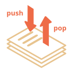
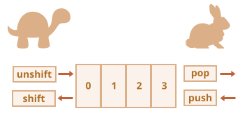
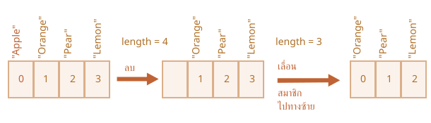
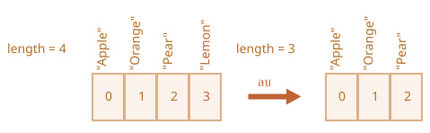

# อาร์เรย์

ออบเจ็กต์เหมาะกับการเก็บค่าหลายค่า โดยตั้งชื่อกำกับแต่ละค่าไว้

แต่ข้อมูลบางชุดต้องเรียงลำดับชัดเจนว่าอะไรเป็นตัวที่ 1 ตัวที่ 2 ตัวที่ 3 และต่อไปเรื่อย ๆ เช่น รายชื่อผู้ใช้ รายการสินค้า หรืออิลิเมนต์ HTML

ออบเจ็กต์ไม่เหมาะกับงานนี้ เพราะไม่มีเมธอดสำหรับจัดการลำดับของสมาชิก และเราแทรกพร็อพเพอร์ตี้ใหม่ไว้ "ระหว่าง" พร็อพเพอร์ตี้เดิมไม่ได้

JavaScript จึงมีโครงสร้างข้อมูลชื่อ `Array` สำหรับเก็บข้อมูลที่เรียงลำดับ

## การประกาศ

สร้างอาร์เรย์ว่างได้สองแบบ:

```js
let arr = new Array();
let arr = [];
```

ส่วนใหญ่นิยมใช้แบบที่สอง และใส่สมาชิกเริ่มต้นไว้ในวงเล็บเหลี่ยมได้เลย:

```js
let fruits = ["Apple", "Orange", "Plum"];
```

สมาชิกแต่ละตัวมีหมายเลขดัชนีกำกับ โดยเริ่มนับจากศูนย์

ใส่ดัชนีไว้ในวงเล็บเหลี่ยมเพื่ออ่านค่าสมาชิก:

```js run
let fruits = ["Apple", "Orange", "Plum"];

alert( fruits[0] ); // Apple
alert( fruits[1] ); // Orange
alert( fruits[2] ); // Plum
```

เปลี่ยนค่าสมาชิกได้แบบนี้:

```js
fruits[2] = 'Pear'; // ตอนนี้กลายเป็น ["Apple", "Orange", "Pear"]
```

หรือเพิ่มสมาชิกใหม่เข้าไปในอาร์เรย์:

```js
fruits[3] = 'Lemon'; // ตอนนี้กลายเป็น ["Apple", "Orange", "Pear", "Lemon"]
```

พร็อพเพอร์ตี้ `length` บอกจำนวนสมาชิกทั้งหมด:

```js run
let fruits = ["Apple", "Orange", "Plum"];

alert( fruits.length ); // 3
```

ส่งอาร์เรย์ทั้งก้อนไปให้ `alert` ได้ด้วย:

```js run
let fruits = ["Apple", "Orange", "Plum"];

alert( fruits ); // Apple,Orange,Plum
```

สมาชิกในอาร์เรย์จะเป็นข้อมูลชนิดไหนก็ได้

ตัวอย่างนี้เก็บทั้งสตริง ออบเจ็กต์ บูลีน และฟังก์ชันไว้ด้วยกัน:

```js run no-beautify
// ค่าหลายชนิดอยู่ในอาร์เรย์เดียวกัน
let arr = [ 'Apple', { name: 'John' }, true, function() { alert('hello'); } ];

// อ่านออบเจ็กต์ที่ดัชนี 1 แล้วแสดงชื่อ
alert( arr[1].name ); // John

// อ่านฟังก์ชันที่ดัชนี 3 แล้วเรียกใช้
arr[3](); // hello
```


````smart header="คอมมาท้ายรายการ"
อาร์เรย์ใส่คอมมาต่อท้ายสมาชิกตัวสุดท้ายได้เหมือนออบเจ็กต์:
```js
let fruits = [
  "Apple",
  "Orange",
  "Plum"*!*,*/!*
];
```

การเขียนแบบนี้ช่วยให้เพิ่มหรือลบสมาชิกง่ายขึ้น เพราะทุกรายการมีรูปแบบเหมือนกัน
````

## อ่านสมาชิกตัวสุดท้ายด้วย `at`

[recent browser="new"]

ถ้าต้องการอ่านสมาชิกตัวสุดท้ายของอาร์เรย์ เราอาจนึกถึงดัชนีลบอย่าง `fruits[-1]` เพราะบางภาษาใช้รูปแบบนี้ได้

แต่ JavaScript อ่านดัชนีในวงเล็บเหลี่ยมตามค่าที่เขียนตรง ๆ ดังนั้น `fruits[-1]` จึงได้ `undefined`

วิธีหนึ่งคือคำนวณดัชนีสุดท้ายเองด้วย `fruits[fruits.length - 1]`:

```js run
let fruits = ["Apple", "Orange", "Plum"];

alert( fruits[fruits.length-1] ); // Plum
```

วิธีนี้ต้องเขียนชื่อตัวแปรซ้ำสองครั้ง จึงดูยาวเกินจำเป็น

เมธอด `at` เขียนได้สั้นกว่า โดยใช้ `fruits.at(-1)`:

```js run
let fruits = ["Apple", "Orange", "Plum"];

// เหมือนกับ fruits[fruits.length-1]
alert( fruits.at(-1) ); // Plum
```

สรุปการทำงานของ `arr.at(i)` ได้ดังนี้:

- ถ้า `i >= 0` จะทำงานเหมือน `arr[i]`
- ถ้า `i` เป็นลบ จะนับตำแหน่งย้อนจากท้ายอาร์เรย์

## เมธอด `pop`/`push` และ `shift`/`unshift`

[คิว (queue)](https://en.wikipedia.org/wiki/Queue_(abstract_data_type)) เป็นหนึ่งในรูปแบบการใช้อาร์เรย์ที่พบบ่อย ในทางวิทยาการคอมพิวเตอร์ คิวคือชุดข้อมูลที่เรียงลำดับและทำสองอย่างนี้ได้:

- `push` เพิ่มสมาชิกต่อท้ายคิว
- `shift` นำสมาชิกตัวแรกออก แล้วเลื่อนสมาชิกตัวที่ 2 ขึ้นมาเป็นตัวแรก


อาร์เรย์มีเมธอดสำหรับทั้งสองอย่างนี้

ตัวอย่างที่พบได้บ่อยคือคิวข้อความซึ่งรอแสดงบนหน้าจอ

อาร์เรย์ยังใช้เป็นโครงสร้างข้อมูลอีกชนิดหนึ่งที่เรียกว่า [สแต็ก (stack)](https://en.wikipedia.org/wiki/Stack_(abstract_data_type)) ได้

สแต็กทำสองอย่างนี้:

- `push` เพิ่มสมาชิกไว้ที่ท้าย
- `pop` ดึงสมาชิกออกจากท้าย

เราจึงเพิ่มหรือนำสมาชิกออกตรง "ท้าย" อาร์เรย์เสมอ

ลองนึกถึงกองไพ่ที่วางไพ่ใบใหม่ไว้บนสุด และหยิบไพ่ออกจากด้านบน:



สแต็กจะนำสมาชิกที่เพิ่งเพิ่มล่าสุดออกมาก่อน หลักการนี้เรียกว่า LIFO (Last-In-First-Out)

ส่วนคิวจะนำสมาชิกที่เข้าก่อนออกก่อน จึงเรียกว่า FIFO (First-In-First-Out)

อาร์เรย์ใน JavaScript ใช้ได้ทั้งแบบคิวและสแต็ก เพราะเพิ่มหรือนำสมาชิกออกได้ทั้งต้นและท้ายอาร์เรย์

โครงสร้างข้อมูลที่ทำแบบนี้ได้เรียกว่า [คิวสองทาง (deque)](https://en.wikipedia.org/wiki/Double-ended_queue)

**เมธอดที่ทำงานกับท้ายอาร์เรย์:**

`pop`
: นำสมาชิกตัวสุดท้ายออกจากอาร์เรย์แล้วคืนค่านั้น:

    ```js run
    let fruits = ["Apple", "Orange", "Pear"];

    alert( fruits.pop() ); // นำ "Pear" ออกแล้วแสดงค่า

    alert( fruits ); // Apple, Orange
    ```

    ทั้ง `fruits.pop()` และ `fruits.at(-1)` คืนสมาชิกตัวสุดท้ายเหมือนกัน ต่างกันตรงที่ `fruits.pop()` นำสมาชิกนั้นออกจากอาร์เรย์ด้วย

`push`
: เพิ่มสมาชิกไว้ที่ท้ายอาร์เรย์:

    ```js run
    let fruits = ["Apple", "Orange"];

    fruits.push("Pear");

    alert( fruits ); // Apple, Orange, Pear
    ```

    `fruits.push(...)` ให้ผลเหมือน `fruits[fruits.length] = ...`

**เมธอดที่ทำงานกับต้นอาร์เรย์:**

`shift`
: นำสมาชิกตัวแรกออกจากอาร์เรย์แล้วคืนค่านั้น:

    ```js run
    let fruits = ["Apple", "Orange", "Pear"];

    alert( fruits.shift() ); // นำ Apple ออกแล้วแสดงค่า

    alert( fruits ); // Orange, Pear
    ```

`unshift`
: เพิ่มสมาชิกไว้ที่ต้นอาร์เรย์:

    ```js run
    let fruits = ["Orange", "Pear"];

    fruits.unshift('Apple');

    alert( fruits ); // Apple, Orange, Pear
    ```

`push` และ `unshift` เพิ่มสมาชิกหลายตัวพร้อมกันได้:

```js run
let fruits = ["Apple"];

fruits.push("Orange", "Peach");
fruits.unshift("Pineapple", "Lemon");

// ["Pineapple", "Lemon", "Apple", "Orange", "Peach"]
alert( fruits );
```

## กลไกภายใน

อาร์เรย์เป็นออบเจ็กต์ชนิดพิเศษ การอ่านค่าแบบ `arr[0]` ใช้รูปแบบวงเล็บเหลี่ยมเดียวกับ `obj[key]` โดย `arr` คือออบเจ็กต์ ส่วนตัวเลขทำหน้าที่เป็น key หรือชื่อพร็อพเพอร์ตี้

สิ่งที่อาร์เรย์เพิ่มเข้ามาคือเมธอดสำหรับจัดการข้อมูลที่เรียงลำดับและพร็อพเพอร์ตี้ `length` แต่ตัวอาร์เรย์เองยังเป็นออบเจ็กต์

JavaScript มีชนิดข้อมูลพื้นฐานเพียงแปดชนิดตามที่อธิบายในบท [ชนิดข้อมูล](info:types) อาร์เรย์จัดอยู่ในชนิดออบเจ็กต์ จึงมีพฤติกรรมแบบออบเจ็กต์ด้วย

ตัวอย่างเช่น เมื่อกำหนดอาร์เรย์ให้ตัวแปรใหม่ สิ่งที่ถูกคัดลอกคือค่าอ้างอิง:

```js run
let fruits = ["Banana"]

let arr = fruits; // คัดลอกค่าอ้างอิง ตัวแปรทั้งคู่จึงอ้างถึงอาร์เรย์เดียวกัน

alert( arr === fruits ); // true

arr.push("Pear"); // แก้ไขอาร์เรย์ผ่านค่าอ้างอิง

alert( fruits ); // Banana, Pear - ตอนนี้มีสมาชิก 2 ตัว
```

ความพิเศษอีกอย่างอยู่ที่การจัดเก็บภายใน กลไกที่ใช้รัน JavaScript หรือ JavaScript engine จะพยายามวางสมาชิกไว้ติดกันในหน่วยความจำตามลำดับเหมือนภาพในบทนี้

JavaScript engine ยังใช้วิธีปรับแต่งอื่น ๆ เพื่อให้อาร์เรย์ทำงานได้เร็วด้วย

แต่ประสิทธิภาพส่วนนี้อาจลดลงเมื่อเราเลิกใช้อาร์เรย์เป็นข้อมูลที่เรียงลำดับ แล้วนำไปใช้เหมือนออบเจ็กต์ทั่วไป

ในทางเทคนิค โค้ดแบบนี้เขียนได้:

```js
let fruits = []; // สร้างอาร์เรย์

fruits[99999] = 5; // กำหนดค่าที่ดัชนีซึ่งมากกว่า length หลายเท่า

fruits.age = 25; // สร้างพร็อพเพอร์ตี้ที่ตั้งชื่อเอง
```

เหตุผลที่ทำได้ก็เพราะอาร์เรย์เป็นออบเจ็กต์ จึงเพิ่มพร็อพเพอร์ตี้อะไรก็ได้

เมื่อ JavaScript engine เห็นว่าเราใช้อาร์เรย์เหมือนออบเจ็กต์ทั่วไป การปรับแต่งบางอย่างที่ออกแบบมาสำหรับอาร์เรย์อาจใช้ไม่ได้ ทำให้ประสิทธิภาพลดลง

รูปแบบที่ไม่ควรใช้กับอาร์เรย์มีดังนี้:

- เพิ่มพร็อพเพอร์ตี้ที่ไม่ใช่ตัวเลข เช่น `arr.test = 5`
- เว้นช่องว่าง เช่น ใส่ค่าให้ `arr[0]` แล้วข้ามไป `arr[1000]` โดยไม่มีค่าระหว่างนั้น
- ใส่ค่าย้อนลำดับ เช่น `arr[1000]`, `arr[999]` แล้วลดลงไปเรื่อย ๆ

มองอาร์เรย์เป็นโครงสร้างสำหรับ *ข้อมูลที่มีลำดับ* และใช้เมธอดที่เตรียมไว้ JavaScript engine จะได้จัดการข้อมูลต่อเนื่องนี้ได้เต็มที่

ถ้าต้องการตั้งชื่อพร็อพเพอร์ตี้เอง ออบเจ็กต์ธรรมดา `{}` มักเหมาะกว่า

## ประสิทธิภาพ

เมธอด `push`/`pop` ทำงานเร็ว ส่วน `shift`/`unshift` ช้ากว่า



ลองดูงานที่ต้องทำเมื่อเพิ่มหรือนำสมาชิกออกตรงต้นอาร์เรย์ เริ่มจากการเรียก:

```js
fruits.shift(); // นำสมาชิก 1 ตัวออกจากต้น
```

การนำสมาชิกที่ดัชนี `0` ออกอย่างเดียวยังไม่พอ เพราะสมาชิกที่เหลือต้องเลื่อนตำแหน่งและเปลี่ยนดัชนีด้วย

`shift` จึงต้องทำ 3 อย่าง:

1. ลบสมาชิกที่ดัชนี `0`
2. เลื่อนสมาชิกทั้งหมดไปทางซ้าย เปลี่ยนดัชนี `1` เป็น `0`, `2` เป็น `1` และต่อไปเรื่อย ๆ
3. อัปเดตพร็อพเพอร์ตี้ `length`



**ยิ่งอาร์เรย์มีสมาชิกมาก ก็ยิ่งต้องใช้เวลาและย้ายข้อมูลในหน่วยความจำมากขึ้น**

`unshift` เจองานคล้ายกัน การเพิ่มสมาชิกไว้ต้นอาร์เรย์ต้องเลื่อนสมาชิกเดิมไปทางขวาและเพิ่มดัชนีของทุกตัวก่อน

ส่วน `push`/`pop` ไม่ต้องเลื่อนสมาชิกตัวอื่น โดย `pop` เพียงลบดัชนีสุดท้ายแล้วลด `length`

เมื่อเรียก `pop`:

```js
fruits.pop(); // นำสมาชิก 1 ตัวออกจากท้าย
```



**`pop` ไม่ต้องเลื่อนสมาชิก เพราะสมาชิกตัวอื่นยังใช้ดัชนีเดิม จึงทำงานได้เร็วมาก**

`push` ก็ทำงานในลักษณะเดียวกัน

## ลูป

วิธีดั้งเดิมในการวนสมาชิกอาร์เรย์คือลูป `for` ที่ไล่ดัชนี:

```js run
let arr = ["Apple", "Orange", "Pear"];

*!*
for (let i = 0; i < arr.length; i++) {
*/!*
  alert( arr[i] );
}
```

อาร์เรย์ยังใช้ลูป `for..of` ได้ด้วย:

```js run
let fruits = ["Apple", "Orange", "Plum"];

// วนผ่านสมาชิกในอาร์เรย์
for (let fruit of fruits) {
  alert( fruit );
}
```

`for..of` ให้เฉพาะค่าของสมาชิก ไม่ได้ให้ดัชนีของสมาชิกตัวปัจจุบัน ส่วนใหญ่แค่นี้ก็เพียงพอแล้ว และยังเขียนสั้นกว่า

อาร์เรย์เป็นออบเจ็กต์ เราจึงเขียน `for..in` ได้เช่นกัน:

```js run
let arr = ["Apple", "Orange", "Pear"];

*!*
for (let key in arr) {
*/!*
  alert( arr[key] ); // Apple, Orange, Pear
}
```

แต่ไม่ควรทำแบบนี้ เพราะมีปัญหาสองข้อ:

1. ลูป `for..in` วนผ่าน *ทุกพร็อพเพอร์ตี้* ไม่ใช่เฉพาะพร็อพเพอร์ตี้ที่ใช้ตัวเลขเป็นชื่อ

    ในเบราว์เซอร์และสภาพแวดล้อมอื่นมีออบเจ็กต์แบบ "array-like" ซึ่ง *ดูคล้ายอาร์เรย์* เพราะมีพร็อพเพอร์ตี้ `length` และพร็อพเพอร์ตี้ที่เป็นดัชนี แต่ออบเจ็กต์เหล่านี้อาจมีพร็อพเพอร์ตี้หรือเมธอดอื่นปนอยู่ด้วย

    `for..in` จะวนผ่านส่วนเกินเหล่านี้ จึงอาจสร้างปัญหาเมื่อทำงานกับออบเจ็กต์แบบ array-like

2. JavaScript engine ปรับประสิทธิภาพลูป `for..in` สำหรับออบเจ็กต์ทั่วไป ไม่ใช่อาร์เรย์ จึงอาจช้ากว่าลูปที่ใช้กับอาร์เรย์โดยตรง ความต่างนี้มักสำคัญเฉพาะจุดที่เป็นคอขวด

สรุปคือไม่ควรใช้ `for..in` วนอาร์เรย์


## ทำความเข้าใจ `length`

พร็อพเพอร์ตี้ `length` อัปเดตอัตโนมัติเมื่ออาร์เรย์เปลี่ยน ที่จริงค่านี้ไม่ได้หมายถึงจำนวนสมาชิกเสมอไป แต่เท่ากับดัชนีตัวเลขที่มากที่สุดบวกหนึ่ง

ดังนั้นแค่ใส่สมาชิกหนึ่งตัวไว้ที่ดัชนีสูง ๆ ก็ทำให้ `length` สูงตาม:

```js run
let fruits = [];
fruits[123] = "Apple";

alert( fruits.length ); // 124
```

ปกติเราไม่ควรใช้อาร์เรย์แบบนี้

อีกจุดที่ควรรู้คือเรากำหนดค่าให้ `length` ได้

ถ้ากำหนด `length` ให้มากขึ้น อาร์เรย์จะยาวขึ้นแต่ไม่มีสมาชิกใหม่เพิ่มเข้ามา ส่วนการกำหนดให้สั้นลงจะตัดสมาชิกส่วนที่เกินทิ้งและเรียกคืนไม่ได้:

```js run
let arr = [1, 2, 3, 4, 5];

arr.length = 2; // ตัดให้เหลือสมาชิก 2 ตัว
alert( arr ); // [1, 2]

arr.length = 5; // เพิ่ม length กลับเป็นค่าเดิม
alert( arr[3] ); // undefined: ค่าที่ถูกลบไปแล้วไม่กลับมา
```

เพราะฉะนั้นวิธีที่ง่ายที่สุดในการล้างอาร์เรย์คือ `arr.length = 0;`


## new Array() [#new-array]

ยังสร้างอาร์เรย์ด้วย `new Array` ได้:

```js
let arr = *!*new Array*/!*("Apple", "Pear", "etc");
```

รูปแบบนี้ไม่ค่อยใช้กัน เพราะวงเล็บเหลี่ยม `[]` สั้นกว่า และ `new Array` ยังมีพฤติกรรมที่ชวนให้พลาด

ถ้าเรียก `new Array` ด้วยอาร์กิวเมนต์เดียวซึ่งเป็นตัวเลข จะได้อาร์เรย์ *ที่ไม่มีสมาชิก แต่มี `length` เท่ากับตัวเลขนั้น*

ตัวอย่างนี้ไม่ได้สร้างอาร์เรย์ที่มีสมาชิกเป็นเลข `2`:

```js run
let arr = new Array(2); // จะสร้างอาร์เรย์ [2] ไหม?

alert( arr[0] ); // undefined! ไม่มีสมาชิกเลย

alert( arr.length ); // length เท่ากับ 2
```

เพื่อเลี่ยงความสับสน ปกติจึงใช่วงเล็บเหลี่ยม เว้นแต่ตั้งใจใช้พฤติกรรมนี้ของ `new Array`

## อาร์เรย์หลายมิติ

สมาชิกของอาร์เรย์เป็นอาร์เรย์อีกชั้นได้ จึงสร้างอาร์เรย์หลายมิติขึ้นมา เช่น เมทริกซ์นี้:

```js run
let matrix = [
  [1, 2, 3],
  [4, 5, 6],
  [7, 8, 9]
];

alert( matrix[0][1] ); // 2 สมาชิกตัวที่สองของอาร์เรย์ด้านในชุดแรก
```

## toString

อาร์เรย์มีเมธอด `toString` ของตัวเอง เมธอดนี้คืนสตริงที่นำสมาชิกทั้งหมดมาคั่นด้วยคอมมา

เช่น:

```js run
let arr = [1, 2, 3];

alert( arr ); // 1,2,3
alert( String(arr) === '1,2,3' ); // true
```

ลองนำอาร์เรย์ไปบวกกับตัวเลข:

```js run
alert( [] + 1 ); // "1"
alert( [1] + 1 ); // "11"
alert( [1,2] + 1 ); // "1,21"
```

อาร์เรย์ไม่มี `Symbol.toPrimitive` และไม่มี `valueOf` ที่เหมาะกับการแปลงค่านี้ จึงเหลือเพียง `toString`

ผลคือ `[]` กลายเป็นสตริงว่าง, `[1]` กลายเป็น `"1"` และ `[1,2]` กลายเป็น `"1,2"`

เมื่อค่าข้างหนึ่งของตัวดำเนินการ `"+"` เป็นสตริง อีกข้างจะถูกแปลงเป็นสตริงด้วย การบวกด้านบนจึงเทียบได้กับ:

```js run
alert( "" + 1 ); // "1"
alert( "1" + 1 ); // "11"
alert( "1,2" + 1 ); // "1,21"
```

## อย่าเปรียบเทียบอาร์เรย์ด้วย `==`

JavaScript ไม่ได้ออกแบบตัวดำเนินการ `==` มาให้เปรียบเทียบอาร์เรย์เหมือนในบางภาษา

ตัวดำเนินการนี้มองอาร์เรย์เป็นออบเจ็กต์ทั่วไป ไม่ได้เปรียบเทียบสมาชิกของอาร์เรย์ให้เป็นกรณีพิเศษ

กฎที่เกี่ยวข้องมีดังนี้:

- ออบเจ็กต์สองตัวจะเท่ากันด้วย `==` ก็ต่อเมื่อทั้งคู่อ้างถึงออบเจ็กต์เดียวกัน
- ถ้าค่าข้างหนึ่งของ `==` เป็นออบเจ็กต์และอีกข้างเป็นค่าชนิดพื้นฐาน (primitive) ออบเจ็กต์จะถูกแปลงเป็น primitive ตามที่อธิบายในบท <info:object-toprimitive>
- `null` และ `undefined` เป็นข้อยกเว้น ทั้งคู่เท่ากันด้วย `==` แต่ไม่เท่ากับค่าอื่น

ส่วน `===` มีกฎง่ายกว่า เพราะไม่แปลงชนิดข้อมูล

ดังนั้นอาร์เรย์สองชุดจะไม่เท่ากันด้วย `==` เว้นแต่ค่าทั้งสองจะอ้างถึงอาร์เรย์เดียวกัน

เช่น:
```js run
alert( [] == [] ); // false
alert( [0] == [0] ); // false
```

อาร์เรย์ในแต่ละบรรทัดเป็นคนละออบเจ็กต์ จึงไม่เท่ากัน เพราะ `==` ไม่ได้ไล่เปรียบเทียบสมาชิกทีละตัว

เมื่อเปรียบเทียบอาร์เรย์กับค่าชนิดพื้นฐาน ผลลัพธ์อาจดูชวนสับสน:

```js run
alert( 0 == [] ); // true

alert('0' == [] ); // false
```

ทั้งสองบรรทัดเปรียบเทียบ primitive กับอาร์เรย์ซึ่งเป็นออบเจ็กต์ ดังนั้น `[]` จะถูกแปลงเป็น primitive ก่อน และได้สตริงว่าง `''`

จากนั้นจึงเปรียบเทียบ primitive ตามกฎในบท <info:type-conversions>:

```js run
// หลังจากแปลง [] เป็น '' แล้ว
alert( 0 == '' ); // true เพราะ '' ถูกแปลงเป็นเลข 0

alert('0' == '' ); // false ไม่มีการแปลงชนิด เป็นสตริงต่างกัน
```

ถ้าต้องการเปรียบเทียบอาร์เรย์ควรทำอย่างไร?

อย่าใช้ `==` แต่ให้ไล่เปรียบเทียบสมาชิกทีละตัวด้วยลูป หรือใช้เมธอดสำหรับวนสมาชิกที่จะเรียนในบทถัดไป

## สรุป

อาร์เรย์เป็นออบเจ็กต์ชนิดพิเศษสำหรับเก็บและจัดการข้อมูลที่เรียงลำดับ

การประกาศ:

```js
// วงเล็บเหลี่ยม (ใช้ทั่วไป)
let arr = [item1, item2...];

// new Array (แทบไม่ใช้)
let arr = new Array(item1, item2...);
```

`new Array(number)` สร้างอาร์เรย์ที่มี `length` ตามตัวเลขที่กำหนด แต่ไม่มีสมาชิก

- พร็อพเพอร์ตี้ `length` คือความยาวของอาร์เรย์ หรือถ้าพูดให้แม่นคือดัชนีตัวเลขที่มากที่สุดบวกหนึ่ง เมธอดของอาร์เรย์จะปรับค่านี้ให้อัตโนมัติ
- ถ้ากำหนด `length` ให้สั้นลง สมาชิกส่วนที่เกินจะถูกตัดทิ้ง

การดึงสมาชิก:

- ใช้ดัชนี เช่น `arr[0]`
- ใช้เมธอด `at(i)` ซึ่งรองรับดัชนีลบ ถ้า `i` เป็นลบจะนับย้อนจากท้ายอาร์เรย์ ส่วน `i >= 0` ทำงานเหมือน `arr[i]`

ใช้อาร์เรย์เป็นคิวสองทางได้ด้วยเมธอดเหล่านี้:

- `push(...items)` เพิ่ม `items` ไว้ที่ท้าย
- `pop()` นำสมาชิกท้ายออกแล้วคืนค่านั้น
- `shift()` นำสมาชิกต้นออกแล้วคืนค่านั้น
- `unshift(...items)` เพิ่ม `items` ไว้ที่ต้น

วิธีวนสมาชิกในอาร์เรย์:
  - `for (let i=0; i<arr.length; i++)` -- ใช้เมื่อต้องการดัชนี และรองรับเบราว์เซอร์เก่า
  - `for (let item of arr)` -- รูปแบบสมัยใหม่สำหรับอ่านเฉพาะค่าสมาชิก
  - `for (let i in arr)` -- ห้ามใช้

อย่าใช้ตัวดำเนินการ `==` รวมถึง `>`, `<` และตัวอื่นเปรียบเทียบอาร์เรย์ ตัวดำเนินการเหล่านี้มองอาร์เรย์เหมือนออบเจ็กต์ทั่วไป ไม่ได้ไล่เทียบสมาชิกให้

ถ้าต้องการเปรียบเทียบอาร์เรย์ ให้ใช้ลูป `for..of` ไล่เทียบสมาชิกทีละตัว

บทถัดไป <info:array-methods> จะลงรายละเอียดเมธอดสำหรับเพิ่ม นำออก อ่าน และเรียงลำดับสมาชิกในอาร์เรย์
