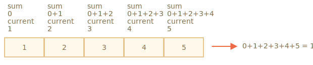

# เมธอดของอาร์เรย์

อาร์เรย์มีเมธอดให้ใช้มากมาย เพื่อให้เข้าใจง่ายขึ้น ในบทนี้จะแบ่งเมธอดออกเป็นกลุ่มๆ

## เพิ่ม/ลบรายการ

เราได้รู้จักเมธอดสำหรับเพิ่มและลบรายการจากต้นหรือท้ายอาร์เรย์ไปแล้ว:

- `arr.push(...items)` -- เพิ่มรายการที่ท้ายอาร์เรย์
- `arr.pop()` -- ดึงรายการออกจากท้ายอาร์เรย์
- `arr.shift()` -- ดึงรายการออกจากต้นอาร์เรย์
- `arr.unshift(...items)` -- เพิ่มรายการที่ต้นอาร์เรย์

มาดูเมธอดอื่นๆ เพิ่มเติมกัน

### splice

จะลบสมาชิกออกจากอาร์เรย์ได้อย่างไร?

เนื่องจากอาร์เรย์เป็นออบเจ็กต์ เราอาจลองใช้ `delete`:

```js run
let arr = ["I", "go", "home"];

delete arr[1]; // ลบ "go"

alert( arr[1] ); // undefined

// ตอนนี้ arr = ["I",  , "home"];
alert( arr.length ); // 3
```

สมาชิกถูกลบแล้ว แต่อาร์เรย์ยังมี 3 สมาชิกอยู่ จะเห็นว่า `arr.length == 3`

เป็นเรื่องปกติ เพราะ `delete obj.key` ลบค่าตาม `key` เท่านั้น สำหรับออบเจ็กต์ทั่วไปก็ใช้ได้ แต่สำหรับอาร์เรย์ เรามักต้องการให้สมาชิกที่เหลือเลื่อนมาเติมช่องที่ว่าง และอยากได้อาร์เรย์ที่สั้นลงด้วย

ดังนั้น จึงต้องใช้เมธอดพิเศษแทน

เมธอด [arr.splice](mdn:js/Array/splice) เปรียบเสมือนมีดพับอเนกประสงค์ของอาร์เรย์ ทำได้ทุกอย่าง: แทรก ลบ และแทนที่สมาชิก

ไวยากรณ์คือ:

```js
arr.splice(start[, deleteCount, elem1, ..., elemN])
```

เมธอดนี้แก้ไข `arr` โดยเริ่มจาก index `start`: ลบ `deleteCount` สมาชิก แล้วแทรก `elem1, ..., elemN` ลงในตำแหน่งนั้น และคืนค่าเป็นอาร์เรย์ของสมาชิกที่ถูกลบออก

วิธีที่ดีที่สุดในการทำความเข้าใจเมธอดนี้คือดูตัวอย่าง

เริ่มจากการลบก่อน:

```js run
let arr = ["I", "study", "JavaScript"];

*!*
arr.splice(1, 1); // จาก index 1 ลบ 1 สมาชิก
*/!*

alert( arr ); // ["I", "JavaScript"]
```

ง่ายใช่ไหม? เริ่มจาก index `1` แล้วลบ `1` สมาชิก

ในตัวอย่างถัดไป เราลบ 3 สมาชิกแล้วแทนด้วยอีก 2 สมาชิก:

```js run
let arr = [*!*"I", "study", "JavaScript",*/!* "right", "now"];

// ลบ 3 สมาชิกแรก แล้วแทนด้วยสมาชิกใหม่
arr.splice(0, 3, "Let's", "dance");

alert( arr ) // ตอนนี้คือ [*!*"Let's", "dance"*/!*, "right", "now"]
```

ต่อไปมาดูว่า `splice` คืนค่าเป็นอาร์เรย์ของสมาชิกที่ถูกลบ:

```js run
let arr = [*!*"I", "study",*/!* "JavaScript", "right", "now"];

// ลบ 2 สมาชิกแรก
let removed = arr.splice(0, 2);

alert( removed ); // "I", "study" <-- อาร์เรย์ของสมาชิกที่ถูกลบ
```

เมธอด `splice` ยังสามารถแทรกสมาชิกโดยไม่ต้องลบอะไรเลย เพียงกำหนด `deleteCount` เป็น `0`:

```js run
let arr = ["I", "study", "JavaScript"];

// จาก index 2
// ลบ 0 สมาชิก
// แล้วแทรก "complex" และ "language"
arr.splice(2, 0, "complex", "language");

alert( arr ); // "I", "study", "complex", "language", "JavaScript"
```

````smart header="ใช้ index ติดลบได้"
ในเมธอดนี้และเมธอดอาร์เรย์อื่นๆ สามารถใช้ index ติดลบได้ ซึ่งหมายถึงตำแหน่งนับจากท้ายอาร์เรย์ ดังนี้:

```js run
let arr = [1, 2, 5];

// จาก index -1 (หนึ่งขั้นจากท้าย)
// ลบ 0 สมาชิก
// แล้วแทรก 3 และ 4
arr.splice(-1, 0, 3, 4);

alert( arr ); // 1,2,3,4,5
```
````

### slice

เมธอด [arr.slice](mdn:js/Array/slice) ง่ายกว่า `arr.splice` มาก แม้จะดูคล้ายกัน

ไวยากรณ์คือ:

```js
arr.slice([start], [end])
```

เมธอดนี้คืนค่าเป็นอาร์เรย์ใหม่ โดยคัดลอกสมาชิกทุกตัวตั้งแต่ index `start` ถึง `end` (ไม่รวม `end`) ทั้ง `start` และ `end` ใช้ค่าติดลบได้ ซึ่งจะนับตำแหน่งจากท้ายอาร์เรย์

คล้ายกับเมธอด `str.slice` ของสตริง แต่แทนที่จะได้ substring กลับได้เป็น subarray แทน

ตัวอย่าง:

```js run
let arr = ["t", "e", "s", "t"];

alert( arr.slice(1, 3) ); // e,s (คัดลอกจาก index 1 ถึง 3)

alert( arr.slice(-2) ); // s,t (คัดลอกจาก index -2 ถึงท้ายอาร์เรย์)
```

เรายังสามารถเรียกใช้โดยไม่ระบุอาร์กิวเมนต์: `arr.slice()` จะสร้างสำเนาของ `arr` ซึ่งมักใช้เมื่อต้องการทำสำเนาสำหรับการแปลงข้อมูลที่ไม่ต้องการกระทบอาร์เรย์ต้นฉบับ

### concat

เมธอด [arr.concat](mdn:js/Array/concat) สร้างอาร์เรย์ใหม่ที่รวมค่าจากอาร์เรย์อื่นและรายการเพิ่มเติม

ไวยากรณ์คือ:

```js
arr.concat(arg1, arg2...)
```

รับอาร์กิวเมนต์กี่ตัวก็ได้ จะเป็นอาร์เรย์หรือค่าธรรมดาก็ได้

ผลลัพธ์คืออาร์เรย์ใหม่ที่ประกอบด้วยสมาชิกจาก `arr` ตามด้วย `arg1`, `arg2` เป็นต้น

ถ้าอาร์กิวเมนต์ `argN` เป็นอาร์เรย์ สมาชิกทุกตัวจะถูกคัดลอก มิฉะนั้นจะคัดลอกอาร์กิวเมนต์นั้นทั้งก้อน

ตัวอย่าง:

```js run
let arr = [1, 2];

// สร้างอาร์เรย์จาก: arr และ [3,4]
alert( arr.concat([3, 4]) ); // 1,2,3,4

// สร้างอาร์เรย์จาก: arr และ [3,4] และ [5,6]
alert( arr.concat([3, 4], [5, 6]) ); // 1,2,3,4,5,6

// สร้างอาร์เรย์จาก: arr และ [3,4] แล้วเพิ่มค่า 5 และ 6
alert( arr.concat([3, 4], 5, 6) ); // 1,2,3,4,5,6
```

โดยปกติ เมธอดนี้จะคัดลอกแค่สมาชิกจากอาร์เรย์ ส่วนออบเจ็กต์อื่นๆ แม้จะดูคล้ายอาร์เรย์ จะถูกเพิ่มเข้าไปทั้งก้อน:

```js run
let arr = [1, 2];

let arrayLike = {
  0: "something",
  length: 1
};

alert( arr.concat(arrayLike) ); // 1,2,[object Object]
```

...แต่ถ้าออบเจ็กต์ array-like มีพร็อพเพอร์ตี้พิเศษชื่อ `Symbol.isConcatSpreadable` `concat` จะถือว่ามันเป็นอาร์เรย์และเพิ่มสมาชิกแทน:

```js run
let arr = [1, 2];

let arrayLike = {
  0: "something",
  1: "else",
*!*
  [Symbol.isConcatSpreadable]: true,
*/!*
  length: 2
};

alert( arr.concat(arrayLike) ); // 1,2,something,else
```

## วนซ้ำด้วย forEach

เมธอด [arr.forEach](mdn:js/Array/forEach) ช่วยให้รันฟังก์ชันสำหรับสมาชิกทุกตัวในอาร์เรย์

ไวยากรณ์:
```js
arr.forEach(function(item, index, array) {
  // ... ทำบางอย่างกับ item
});
```

ตัวอย่างเช่น โค้ดนี้แสดงสมาชิกทุกตัวในอาร์เรย์:

```js run
// เรียก alert สำหรับสมาชิกแต่ละตัว
["Bilbo", "Gandalf", "Nazgul"].forEach(alert);
```

และโค้ดนี้แสดงข้อมูลตำแหน่งของแต่ละสมาชิกในอาร์เรย์:

```js run
["Bilbo", "Gandalf", "Nazgul"].forEach((item, index, array) => {
  alert(`${item} อยู่ที่ index ${index} ใน ${array}`);
});
```

ค่าที่ฟังก์ชันคืนค่ากลับมา (ถ้ามี) จะถูกทิ้งและไม่นำมาใช้งาน


## ค้นหาในอาร์เรย์

ทีนี้มาดูเมธอดสำหรับค้นหาข้อมูลในอาร์เรย์กัน

### indexOf/lastIndexOf และ includes

เมธอด [arr.indexOf](mdn:js/Array/indexOf) และ [arr.includes](mdn:js/Array/includes) มีไวยากรณ์คล้ายกัน และทำงานคล้ายกับเมธอดของสตริง แต่ทำงานกับสมาชิกแทนที่จะเป็นตัวอักษร:

- `arr.indexOf(item, from)` -- ค้นหา `item` โดยเริ่มจาก index `from` คืนค่า index ที่พบ ถ้าไม่พบคืน `-1`
- `arr.includes(item, from)` -- ค้นหา `item` โดยเริ่มจาก index `from` คืน `true` ถ้าพบ

โดยทั่วไปเมธอดเหล่านี้ใช้กับอาร์กิวเมนต์เดียวคือ `item` ที่ต้องการค้นหา ซึ่งจะค้นหาตั้งแต่ต้น

ตัวอย่าง:

```js run
let arr = [1, 0, false];

alert( arr.indexOf(0) ); // 1
alert( arr.indexOf(false) ); // 2
alert( arr.indexOf(null) ); // -1

alert( arr.includes(1) ); // true
```

โปรดสังเกตว่า `indexOf` ใช้การเปรียบเทียบแบบเข้มงวด `===` ดังนั้นถ้าค้นหา `false` จะพบ `false` เท่านั้น ไม่ใช่ศูนย์

ถ้าต้องการแค่ตรวจสอบว่า `item` มีอยู่ในอาร์เรย์หรือไม่ โดยไม่ต้องการ index ให้ใช้ `arr.includes` แทน

เมธอด [arr.lastIndexOf](mdn:js/Array/lastIndexOf) ทำงานเหมือน `indexOf` แต่ค้นหาจากขวาไปซ้าย

```js run
let fruits = ['Apple', 'Orange', 'Apple']

alert( fruits.indexOf('Apple') ); // 0 (Apple ตัวแรก)
alert( fruits.lastIndexOf('Apple') ); // 2 (Apple ตัวสุดท้าย)
```

````smart header="เมธอด `includes` รองรับ `NaN` อย่างถูกต้อง"
ข้อดีเล็กน้อยแต่น่าสนใจของ `includes` คือรองรับ `NaN` ได้อย่างถูกต้อง ต่างจาก `indexOf`:

```js run
const arr = [NaN];
alert( arr.indexOf(NaN) ); // -1 (ผิด ควรได้ 0)
alert( arr.includes(NaN) );// true (ถูกต้อง)
```
เพราะ `includes` ถูกเพิ่มเข้ามาใน JavaScript ในภายหลัง และใช้อัลกอริทึมเปรียบเทียบที่ทันสมัยกว่า
````

### find และ findIndex/findLastIndex

ลองนึกภาพว่าเรามีอาร์เรย์ของออบเจ็กต์ แล้วจะค้นหาออบเจ็กต์ที่ตรงตามเงื่อนไขได้อย่างไร?

เมธอด [arr.find(fn)](mdn:js/Array/find) ช่วยได้พอดี

ไวยากรณ์คือ:
```js
let result = arr.find(function(item, index, array) {
  // ถ้าคืนค่า true จะหยุดค้นหาและคืน item กลับ
  // ถ้าไม่พบจะคืน undefined
});
```

ฟังก์ชันจะถูกเรียกสำหรับสมาชิกทุกตัวในอาร์เรย์ ทีละตัว:

- `item` คือสมาชิก
- `index` คือ index ของสมาชิก
- `array` คืออาร์เรย์เอง

ถ้าฟังก์ชันคืน `true` การค้นหาจะหยุดและคืน `item` กลับ ถ้าไม่พบอะไร จะคืน `undefined`

ตัวอย่าง เรามีอาร์เรย์ของผู้ใช้ที่มีฟิลด์ `id` และ `name` แล้วหาผู้ใช้ที่มี `id == 1`:

```js run
let users = [
  {id: 1, name: "สมชาย"},
  {id: 2, name: "สมหญิง"},
  {id: 3, name: "มาลี"}
];

let user = users.find(item => item.id == 1);

alert(user.name); // สมชาย
```

ในชีวิตจริง อาร์เรย์ของออบเจ็กต์เป็นเรื่องที่พบบ่อยมาก ดังนั้นเมธอด `find` จึงมีประโยชน์มาก

สังเกตว่าในตัวอย่างนี้ เราส่งฟังก์ชัน `item => item.id == 1` ที่มีอาร์กิวเมนต์เดียวให้ `find` ซึ่งเป็นรูปแบบทั่วไป อาร์กิวเมนต์อื่นๆ ของฟังก์ชันนี้ใช้น้อยมาก

เมธอด [arr.findIndex](mdn:js/Array/findIndex) มีไวยากรณ์เหมือนกัน แต่คืน index ของสมาชิกที่พบแทนตัวสมาชิก ถ้าไม่พบจะคืน `-1`

เมธอด [arr.findLastIndex](mdn:js/Array/findLastIndex) คล้ายกับ `findIndex` แต่ค้นหาจากขวาไปซ้าย คล้ายกับ `lastIndexOf`

ตัวอย่าง:

```js run
let users = [
  {id: 1, name: "สมชาย"},
  {id: 2, name: "สมหญิง"},
  {id: 3, name: "มาลี"},
  {id: 4, name: "สมชาย"}
];

// หา index ของสมชายคนแรก
alert(users.findIndex(user => user.name == 'สมชาย')); // 0

// หา index ของสมชายคนสุดท้าย
alert(users.findLastIndex(user => user.name == 'สมชาย')); // 3
```

### filter

เมธอด `find` ค้นหาสมาชิกตัวเดียว (ตัวแรก) ที่ทำให้ฟังก์ชันคืน `true`

ถ้าอาจมีหลายตัวที่ตรงเงื่อนไข ให้ใช้ [arr.filter(fn)](mdn:js/Array/filter)

ไวยากรณ์คล้ายกับ `find` แต่ `filter` คืนอาร์เรย์ของสมาชิกทุกตัวที่ตรงเงื่อนไข:

```js
let results = arr.filter(function(item, index, array) {
  // ถ้าคืน true สมาชิกจะถูกเพิ่มใน results และวนต่อ
  // คืนอาร์เรย์ว่างถ้าไม่พบ
});
```

ตัวอย่าง:

```js run
let users = [
  {id: 1, name: "สมชาย"},
  {id: 2, name: "สมหญิง"},
  {id: 3, name: "มาลี"}
];

// คืนอาร์เรย์ของสองผู้ใช้แรก
let someUsers = users.filter(item => item.id < 3);

alert(someUsers.length); // 2
```

## แปลงอาร์เรย์

มาดูเมธอดสำหรับแปลงและจัดเรียงอาร์เรย์กัน

### map

เมธอด [arr.map](mdn:js/Array/map) เป็นหนึ่งในเมธอดที่มีประโยชน์และใช้บ่อยที่สุด

เมธอดนี้เรียกฟังก์ชันสำหรับสมาชิกแต่ละตัวในอาร์เรย์ แล้วคืนอาร์เรย์ของผลลัพธ์

ไวยากรณ์คือ:

```js
let result = arr.map(function(item, index, array) {
  // คืนค่าใหม่แทน item
});
```

ตัวอย่าง เราแปลงสมาชิกแต่ละตัวให้เป็นความยาวของมัน:

```js run
let lengths = ["Bilbo", "Gandalf", "Nazgul"].map(item => item.length);
alert(lengths); // 5,7,6
```

### sort(fn)

การเรียก [arr.sort()](mdn:js/Array/sort) จะเรียงลำดับอาร์เรย์ *แบบ in-place* นั่นคือเปลี่ยนลำดับสมาชิกในอาร์เรย์เดิม

เมธอดนี้ยังคืนอาร์เรย์ที่เรียงแล้วด้วย แต่ค่าที่คืนมักถูกละเว้น เพราะ `arr` เองถูกแก้ไขแล้ว

ตัวอย่าง:

```js run
let arr = [ 1, 2, 15 ];

// เมธอดนี้จัดเรียงเนื้อหาของ arr ใหม่
arr.sort();

alert( arr );  // *!*1, 15, 2*/!*
```

สังเกตเห็นอะไรแปลกๆ ไหม?

ลำดับกลายเป็น `1, 15, 2` ซึ่งไม่ถูกต้อง แต่ทำไม?

**สมาชิกถูกเรียงลำดับในรูปแบบสตริงโดยค่าเริ่มต้น**

สมาชิกทุกตัวจะถูกแปลงเป็นสตริงก่อนเปรียบเทียบ สำหรับสตริงจะใช้การเรียงแบบ lexicographic ซึ่ง `"2" > "15"` นั่นเอง

ถ้าต้องการกำหนดลำดับการเรียงเอง ต้องส่งฟังก์ชันเป็นอาร์กิวเมนต์ให้ `arr.sort()`

ฟังก์ชันนั้นควรเปรียบเทียบค่าสองค่าใดๆ และคืนค่า:

```js
function compare(a, b) {
  if (a > b) return 1; // ถ้าค่าแรกมากกว่าค่าที่สอง
  if (a == b) return 0; // ถ้าค่าเท่ากัน
  if (a < b) return -1; // ถ้าค่าแรกน้อยกว่าค่าที่สอง
}
```

ตัวอย่าง เรียงลำดับเป็นตัวเลข:

```js run
function compareNumeric(a, b) {
  if (a > b) return 1;
  if (a == b) return 0;
  if (a < b) return -1;
}

let arr = [ 1, 2, 15 ];

*!*
arr.sort(compareNumeric);
*/!*

alert(arr);  // *!*1, 2, 15*/!*
```

ตอนนี้ทำงานถูกต้องแล้ว

ลองคิดดูว่าเกิดอะไรขึ้น `arr` อาจเป็นอาร์เรย์ของอะไรก็ได้ใช่ไหม? อาจเป็นตัวเลข สตริง ออบเจ็กต์ หรืออะไรก็ตาม เรามี *ชุดของรายการ* บางอย่าง ในการเรียงลำดับ เราต้องมี *ฟังก์ชันเรียงลำดับ* ที่รู้วิธีเปรียบเทียบสมาชิก ค่าเริ่มต้นคือการเรียงแบบสตริง

เมธอด `arr.sort(fn)` ใช้อัลกอริทึมการเรียงลำดับทั่วไป เราไม่จำเป็นต้องรู้ว่ามันทำงานภายในอย่างไร (ส่วนใหญ่จะเป็น [quicksort](https://en.wikipedia.org/wiki/Quicksort) หรือ [Timsort](https://en.wikipedia.org/wiki/Timsort) ที่ปรับแต่งแล้ว) เมธอดจะวนผ่านอาร์เรย์ เปรียบเทียบสมาชิกด้วยฟังก์ชันที่ให้มา และจัดเรียงใหม่ สิ่งที่เราต้องทำมีแค่ระบุ `fn` สำหรับการเปรียบเทียบ

อนึ่ง ถ้าต้องการดูว่าสมาชิกไหนถูกเปรียบเทียบ แค่ alert ออกมาได้เลย:

```js run
[1, -2, 15, 2, 0, 8].sort(function(a, b) {
  alert( a + " <> " + b );
  return a - b;
});
```

อัลกอริทึมอาจเปรียบเทียบสมาชิกหนึ่งตัวกับหลายตัว แต่จะพยายามเปรียบเทียบให้น้อยครั้งที่สุด

````smart header="ฟังก์ชันเปรียบเทียบสามารถคืนค่าตัวเลขใดก็ได้"
จริงๆ แล้ว ฟังก์ชันเปรียบเทียบต้องคืนค่าบวกเพื่อบอกว่า "มากกว่า" และค่าลบเพื่อบอกว่า "น้อยกว่า" เท่านั้น

ทำให้เขียนฟังก์ชันได้สั้นลง:

```js run
let arr = [ 1, 2, 15 ];

arr.sort(function(a, b) { return a - b; });

alert(arr);  // *!*1, 2, 15*/!*
```
````

````smart header="ใช้ arrow function ให้กระชับ"
จำ [arrow function](info:arrow-functions-basics) ได้ไหม? เราใช้มันเพื่อเขียนการเรียงลำดับได้กระชับขึ้น:

```js
arr.sort( (a, b) => a - b );
```

ทำงานได้เหมือนกับเวอร์ชันยาวด้านบนทุกประการ
````

````smart header="ใช้ `localeCompare` สำหรับสตริง"
จำอัลกอริทึมการเปรียบเทียบ[สตริง](info:string#correct-comparisons) ได้ไหม? โดยค่าเริ่มต้นจะเปรียบเทียบตัวอักษรด้วยรหัสของมัน

สำหรับหลายภาษา ควรใช้เมธอด `str.localeCompare` เพื่อเรียงลำดับตัวอักษรให้ถูกต้อง เช่น `Ö`

ตัวอย่าง ลองเรียงชื่อประเทศในภาษาเยอรมัน:

```js run
let countries = ['Österreich', 'Andorra', 'Vietnam'];

alert( countries.sort( (a, b) => a > b ? 1 : -1) ); // Andorra, Vietnam, Österreich (ผิด)

alert( countries.sort( (a, b) => a.localeCompare(b) ) ); // Andorra,Österreich,Vietnam (ถูกต้อง!)
```
````

### reverse

เมธอด [arr.reverse](mdn:js/Array/reverse) กลับลำดับสมาชิกใน `arr`

ตัวอย่าง:

```js run
let arr = [1, 2, 3, 4, 5];
arr.reverse();

alert( arr ); // 5,4,3,2,1
```

เมธอดนี้ยังคืนอาร์เรย์ `arr` หลังจากกลับลำดับแล้วด้วย

### split และ join

ลองนึกถึงสถานการณ์จริง เรากำลังเขียนแอปส่งข้อความ และผู้ใช้พิมพ์รายชื่อผู้รับคั่นด้วยจุลภาค: `สมชาย, สมหญิง, มาลี` แต่สำหรับเรา อาร์เรย์ของชื่อสะดวกกว่าสตริงเดียวมาก จะแปลงได้อย่างไร?

เมธอด [str.split(delim)](mdn:js/String/split) ทำงานนี้ได้พอดี โดยแยกสตริงออกเป็นอาร์เรย์โดยใช้ตัวคั่น `delim`

ในตัวอย่างด้านล่าง เราแยกด้วยจุลภาคตามด้วยเว้นวรรค:

```js run
let names = 'Bilbo, Gandalf, Nazgul';

let arr = names.split(', ');

for (let name of arr) {
  alert( `ส่งข้อความถึง ${name}.` ); // ส่งข้อความถึง Bilbo  (และชื่ออื่นๆ)
}
```

เมธอด `split` มีอาร์กิวเมนต์ตัวเลขตัวที่สองที่ไม่บังคับ ซึ่งเป็นขีดจำกัดความยาวของอาร์เรย์ ถ้าระบุ สมาชิกส่วนเกินจะถูกละเว้น แต่ในทางปฏิบัติใช้น้อยมาก:

```js run
let arr = 'Bilbo, Gandalf, Nazgul, Saruman'.split(', ', 2);

alert(arr); // Bilbo, Gandalf
```

````smart header="แยกเป็นตัวอักษร"
การเรียก `split(s)` ด้วย `s` ว่างเปล่าจะแยกสตริงออกเป็นอาร์เรย์ของตัวอักษร:

```js run
let str = "test";

alert( str.split('') ); // t,e,s,t
```
````

การเรียก [arr.join(glue)](mdn:js/Array/join) ทำงานตรงข้ามกับ `split` โดยสร้างสตริงจากสมาชิกของ `arr` โดยเชื่อมด้วย `glue`

ตัวอย่าง:

```js run
let arr = ['Bilbo', 'Gandalf', 'Nazgul'];

let str = arr.join(';'); // เชื่อมอาร์เรย์เป็นสตริงด้วย ;

alert( str ); // Bilbo;Gandalf;Nazgul
```

### reduce/reduceRight

เมื่อต้องวนซ้ำในอาร์เรย์ เราใช้ `forEach`, `for` หรือ `for..of` ได้

เมื่อต้องวนซ้ำและคืนข้อมูลสำหรับแต่ละสมาชิก เราใช้ `map` ได้

เมธอด [arr.reduce](mdn:js/Array/reduce) และ [arr.reduceRight](mdn:js/Array/reduceRight) อยู่ในกลุ่มเดียวกัน แต่ซับซ้อนกว่าเล็กน้อย ใช้สำหรับคำนวณค่าเดียวจากอาร์เรย์

ไวยากรณ์คือ:

```js
let value = arr.reduce(function(accumulator, item, index, array) {
  // ...
}, [initial]);
```

ฟังก์ชันจะถูกเรียกสำหรับสมาชิกทุกตัวตามลำดับ และ "ส่งต่อ" ผลลัพธ์ไปยังการเรียกครั้งถัดไป

อาร์กิวเมนต์:

- `accumulator` -- ผลลัพธ์จากการเรียกฟังก์ชันครั้งก่อน ถ้าเป็นการเรียกครั้งแรกจะเท่ากับ `initial` (ถ้าระบุ)
- `item` -- สมาชิกในอาร์เรย์ปัจจุบัน
- `index` -- ตำแหน่งของสมาชิก
- `array` -- อาร์เรย์เอง

เมื่อฟังก์ชันถูกเรียก ผลลัพธ์จากการเรียกครั้งก่อนจะถูกส่งเป็นอาร์กิวเมนต์แรกของการเรียกครั้งถัดไป

กล่าวคือ อาร์กิวเมนต์แรกเป็น accumulator ที่เก็บผลลัพธ์รวมของการทำงานทั้งหมดก่อนหน้า และในตอนท้ายจะกลายเป็นผลลัพธ์ของ `reduce`

ฟังดูซับซ้อนใช่ไหม?

วิธีที่ง่ายที่สุดในการเข้าใจคือดูตัวอย่าง

ในตัวอย่างนี้เราหาผลรวมของอาร์เรย์ในบรรทัดเดียว:

```js run
let arr = [1, 2, 3, 4, 5];

let result = arr.reduce((sum, current) => sum + current, 0);

alert(result); // 15
```

ฟังก์ชันที่ส่งให้ `reduce` ใช้แค่ 2 อาร์กิวเมนต์ ซึ่งมักเพียงพอ

มาดูรายละเอียดว่าเกิดอะไรขึ้น:

1. ครั้งแรก `sum` คือค่า `initial` (อาร์กิวเมนต์สุดท้ายของ `reduce`) ซึ่งเท่ากับ `0` และ `current` คือสมาชิกแรกของอาร์เรย์ ซึ่งเท่ากับ `1` ดังนั้นผลลัพธ์ของฟังก์ชันคือ `1`
2. ครั้งที่สอง `sum = 1` เราบวกสมาชิกที่สอง (`2`) แล้วคืนค่ากลับ
3. ครั้งที่สาม `sum = 3` และบวกสมาชิกตัวถัดไป และต่อไปเรื่อยๆ...

ขั้นตอนการคำนวณ:



หรือในรูปแบบตาราง แต่ละแถวแสดงการเรียกฟังก์ชันสำหรับสมาชิกถัดไป:

|   |`sum`|`current`|ผลลัพธ์|
|---|-----|---------|---------|
|การเรียกครั้งที่ 1|`0`|`1`|`1`|
|การเรียกครั้งที่ 2|`1`|`2`|`3`|
|การเรียกครั้งที่ 3|`3`|`3`|`6`|
|การเรียกครั้งที่ 4|`6`|`4`|`10`|
|การเรียกครั้งที่ 5|`10`|`5`|`15`|

จะเห็นชัดว่าผลลัพธ์ของการเรียกครั้งก่อนกลายเป็นอาร์กิวเมนต์แรกของการเรียกครั้งถัดไปอย่างไร

เราสามารถละเว้นค่าเริ่มต้นได้:

```js run
let arr = [1, 2, 3, 4, 5];

// ลบค่าเริ่มต้นออกจาก reduce (ไม่มี 0)
let result = arr.reduce((sum, current) => sum + current);

alert( result ); // 15
```

ผลลัพธ์เหมือนกัน เพราะถ้าไม่มีค่าเริ่มต้น `reduce` จะใช้สมาชิกแรกของอาร์เรย์เป็นค่าเริ่มต้น และเริ่มวนซ้ำจากสมาชิกที่ 2

ตารางการคำนวณก็เหมือนกับด้านบน แค่ขาดแถวแรก

แต่การใช้แบบนี้ต้องระวังมาก ถ้าอาร์เรย์ว่างเปล่า การเรียก `reduce` โดยไม่มีค่าเริ่มต้นจะเกิดข้อผิดพลาด

ดูตัวอย่าง:

```js run
let arr = [];

// Error: Reduce of empty array with no initial value
// ถ้ามีค่าเริ่มต้น reduce จะคืนค่านั้นสำหรับอาร์เรย์ว่าง
arr.reduce((sum, current) => sum + current);
```

ดังนั้น แนะนำให้ระบุค่าเริ่มต้นเสมอ

เมธอด [arr.reduceRight](mdn:js/Array/reduceRight) ทำงานเหมือนกันแต่วนจากขวาไปซ้าย

## Array.isArray

อาร์เรย์ไม่ได้เป็น type แยกต่างหากในภาษา แต่อิงจากออบเจ็กต์

ดังนั้น `typeof` จึงไม่สามารถแยกออบเจ็กต์ธรรมดาจากอาร์เรย์ได้:

```js run
alert(typeof {}); // object
alert(typeof []); // object (เหมือนกัน)
```

...แต่อาร์เรย์ถูกใช้บ่อยมากจนมีเมธอดพิเศษสำหรับตรวจสอบ: [Array.isArray(value)](mdn:js/Array/isArray) คืน `true` ถ้า `value` เป็นอาร์เรย์ และคืน `false` มิฉะนั้น

```js run
alert(Array.isArray({})); // false

alert(Array.isArray([])); // true
```

## เมธอดส่วนใหญ่รองรับ "thisArg"

เกือบทุกเมธอดของอาร์เรย์ที่เรียกฟังก์ชัน เช่น `find`, `filter`, `map` (ยกเว้น `sort`) รับพารามิเตอร์เสริมตัวสุดท้ายที่เรียกว่า `thisArg`

พารามิเตอร์นี้ไม่ได้อธิบายในส่วนก่อนหน้า เพราะใช้น้อยมาก แต่เพื่อความสมบูรณ์เราควรพูดถึงมัน

ไวยากรณ์เต็มรูปแบบของเมธอดเหล่านี้:

```js
arr.find(func, thisArg);
arr.filter(func, thisArg);
arr.map(func, thisArg);
// ...
// thisArg คือพารามิเตอร์เสริมตัวสุดท้าย
```

ค่าของพารามิเตอร์ `thisArg` จะกลายเป็น `this` ของ `func`

ตัวอย่าง เราใช้เมธอดของออบเจ็กต์ `army` เป็นตัวกรอง และ `thisArg` ส่งบริบท:

```js run
let army = {
  minAge: 18,
  maxAge: 27,
  canJoin(user) {
    return user.age >= this.minAge && user.age < this.maxAge;
  }
};

let users = [
  {age: 16},
  {age: 20},
  {age: 23},
  {age: 30}
];

*!*
// หาผู้ใช้ที่ army.canJoin คืนค่า true
let soldiers = users.filter(army.canJoin, army);
*/!*

alert(soldiers.length); // 2
alert(soldiers[0].age); // 20
alert(soldiers[1].age); // 23
```

ถ้าในตัวอย่างด้านบนเราใช้ `users.filter(army.canJoin)` แล้ว `army.canJoin` จะถูกเรียกเป็นฟังก์ชันแบบ standalone ที่มี `this=undefined` ซึ่งจะเกิดข้อผิดพลาดทันที

การเรียก `users.filter(army.canJoin, army)` สามารถแทนด้วย `users.filter(user => army.canJoin(user))` ซึ่งทำงานเหมือนกัน รูปแบบหลังใช้บ่อยกว่า เพราะเข้าใจง่ายกว่าสำหรับคนส่วนใหญ่

## สรุป

สรุปเมธอดของอาร์เรย์:

- สำหรับเพิ่ม/ลบสมาชิก:
  - `push(...items)` -- เพิ่มสมาชิกที่ท้ายอาร์เรย์
  - `pop()` -- ดึงสมาชิกออกจากท้ายอาร์เรย์
  - `shift()` -- ดึงสมาชิกออกจากต้นอาร์เรย์
  - `unshift(...items)` -- เพิ่มสมาชิกที่ต้นอาร์เรย์
  - `splice(pos, deleteCount, ...items)` -- ที่ index `pos` ลบ `deleteCount` สมาชิกและแทรก `items`
  - `slice(start, end)` -- สร้างอาร์เรย์ใหม่ คัดลอกสมาชิกตั้งแต่ index `start` ถึง `end` (ไม่รวม) ลงไป
  - `concat(...items)` -- คืนอาร์เรย์ใหม่: คัดลอกสมาชิกทั้งหมดจากอาร์เรย์ปัจจุบันและเพิ่ม `items` ต่อท้าย ถ้า `items` ตัวไหนเป็นอาร์เรย์ สมาชิกของมันจะถูกนำมาใช้

- สำหรับค้นหาสมาชิก:
  - `indexOf/lastIndexOf(item, pos)` -- ค้นหา `item` โดยเริ่มจากตำแหน่ง `pos` คืน index หรือ `-1` ถ้าไม่พบ
  - `includes(value)` -- คืน `true` ถ้าอาร์เรย์มี `value` มิฉะนั้นคืน `false`
  - `find/filter(func)` -- กรองสมาชิกผ่านฟังก์ชัน คืนค่าแรก/ทั้งหมดที่ทำให้ฟังก์ชันคืน `true`
  - `findIndex` คล้ายกับ `find` แต่คืน index แทนค่า

- สำหรับวนซ้ำสมาชิก:
  - `forEach(func)` -- เรียก `func` สำหรับทุกสมาชิก ไม่คืนค่าใด

- สำหรับแปลงอาร์เรย์:
  - `map(func)` -- สร้างอาร์เรย์ใหม่จากผลลัพธ์ของการเรียก `func` สำหรับทุกสมาชิก
  - `sort(func)` -- เรียงลำดับอาร์เรย์แบบ in-place แล้วคืนค่ากลับ
  - `reverse()` -- กลับลำดับอาร์เรย์แบบ in-place แล้วคืนค่ากลับ
  - `split/join` -- แปลงสตริงเป็นอาร์เรย์และกลับกัน
  - `reduce/reduceRight(func, initial)` -- คำนวณค่าเดียวจากอาร์เรย์โดยเรียก `func` สำหรับทุกสมาชิกและส่งผลลัพธ์กลางระหว่างการเรียกแต่ละครั้ง

- นอกจากนี้:
  - `Array.isArray(value)` ตรวจสอบว่า `value` เป็นอาร์เรย์หรือไม่ ถ้าใช่คืน `true` มิฉะนั้นคืน `false`

โปรดสังเกตว่าเมธอด `sort`, `reverse` และ `splice` แก้ไขอาร์เรย์เดิมโดยตรง

เมธอดเหล่านี้เป็นเมธอดที่ใช้บ่อยที่สุด ครอบคลุม 99% ของกรณีการใช้งาน แต่ยังมีเมธอดอื่นๆ อีก:

- [arr.some(fn)](mdn:js/Array/some)/[arr.every(fn)](mdn:js/Array/every) ตรวจสอบอาร์เรย์

  ฟังก์ชัน `fn` ถูกเรียกสำหรับสมาชิกแต่ละตัวในอาร์เรย์ คล้ายกับ `map` ถ้าผลลัพธ์บางตัว/ทุกตัวเป็น `true` จะคืน `true` มิฉะนั้นคืน `false`

  เมธอดเหล่านี้ทำงานคล้ายกับตัวดำเนินการ `||` และ `&&`: ถ้า `fn` คืนค่า truthy `arr.some()` จะคืน `true` ทันทีและหยุดวนซ้ำ ถ้า `fn` คืนค่า falsy `arr.every()` จะคืน `false` ทันทีและหยุดวนซ้ำเช่นกัน

  เราสามารถใช้ `every` เพื่อเปรียบเทียบอาร์เรย์:

  ```js run
  function arraysEqual(arr1, arr2) {
    return arr1.length === arr2.length && arr1.every((value, index) => value === arr2[index]);
  }

  alert( arraysEqual([1, 2], [1, 2])); // true
  ```

- [arr.fill(value, start, end)](mdn:js/Array/fill) -- เติมอาร์เรย์ด้วยค่า `value` ซ้ำๆ ตั้งแต่ index `start` ถึง `end`

- [arr.copyWithin(target, start, end)](mdn:js/Array/copyWithin) -- คัดลอกสมาชิกจากตำแหน่ง `start` ถึง `end` ไปยัง *ตัวมันเอง* ที่ตำแหน่ง `target` (ทับค่าที่มีอยู่)

- [arr.flat(depth)](mdn:js/Array/flat)/[arr.flatMap(fn)](mdn:js/Array/flatMap) สร้างอาร์เรย์แบนใหม่จากอาร์เรย์หลายมิติ

ดูรายการเต็มได้ที่ [เอกสารอ้างอิง](mdn:js/Array)

มองเผินๆ อาจรู้สึกว่ามีเมธอดเยอะมากจนจำยาก แต่จริงๆ แล้วไม่ได้ยากขนาดนั้น

ผ่านตาสรุปเพื่อให้รู้ว่ามีอะไรบ้าง แล้วทำโจทย์ในบทนี้เพื่อฝึกฝน เพื่อให้มีประสบการณ์กับเมธอดของอาร์เรย์จริงๆ

หลังจากนั้น เมื่อใดก็ตามที่ต้องทำอะไรกับอาร์เรย์แต่ไม่รู้จะทำยังไง ก็มาดูสรุปตรงนี้แล้วหาเมธอดที่ใช่ ตัวอย่างจะช่วยให้เขียนได้อย่างถูกต้อง เดี๋ยวก็จะจำเมธอดต่างๆ ได้เองโดยไม่ต้องพยายาม
