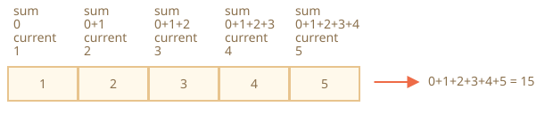

# เมธอด (method) ของอาร์เรย์ (array)

อาร์เรย์มีเมธอดให้เลือกใช้หลายอย่าง บทนี้จะแบ่งตามงานที่ต้องการทำ ทั้งเพิ่มหรือลบสมาชิก (element) ค้นหาข้อมูล และแปลงข้อมูล จะได้เลือกใช้ได้ตรงกับงาน

## เพิ่มและลบสมาชิก

จากบทก่อน เรารู้จักเมธอดสำหรับเพิ่มและลบสมาชิกที่ต้นหรือท้ายอาร์เรย์แล้ว:

- `arr.push(...items)` เพิ่มสมาชิกต่อท้ายอาร์เรย์
- `arr.pop()` ดึงสมาชิกตัวสุดท้ายออกจากอาร์เรย์
- `arr.shift()` ดึงสมาชิกตัวแรกออกจากอาร์เรย์
- `arr.unshift(...items)` เพิ่มสมาชิกที่ต้นอาร์เรย์

ทีนี้มาดูเมธอดอื่นที่ใช้จัดการสมาชิกในอาร์เรย์กัน

### splice

ถ้าต้องการลบสมาชิกที่อยู่กลางอาร์เรย์ล่ะ จะทำอย่างไร?

อาร์เรย์เป็นออบเจ็กต์ (object) จึงใช้ `delete` ได้ ลองดูว่าลบแล้วเกิดอะไรขึ้น:

```js run
let arr = ["I", "go", "home"];

delete arr[1]; // ลบ "go"

alert( arr[1] ); // undefined

// ตอนนี้ arr = ["I",  , "home"];
alert( arr.length ); // 3
```

ค่า `"go"` หายไปแล้ว แต่ตำแหน่งนั้นกลายเป็นช่องว่าง ส่วนความยาวของอาร์เรย์ไม่เปลี่ยน จึงได้ `arr.length == 3` เหมือนเดิม

เพราะ `delete obj.key` ลบค่าตาม `key` เท่านั้น ไม่ได้เลื่อนสมาชิกตัวอื่นมาแทนที่ ถ้าเป็นออบเจ็กต์ทั่วไปก็ตรงกับที่ต้องการ แต่เวลาลบสมาชิกจากอาร์เรย์ เรามักอยากให้สมาชิกที่เหลือเลื่อนมาปิดช่องว่าง และให้อาร์เรย์สั้นลงด้วย

งานแบบนี้ต้องใช้เมธอดของอาร์เรย์โดยเฉพาะ อย่าง [arr.splice](mdn:js/Array/splice) ซึ่งใช้ได้ทั้งแทรก ลบ และแทนที่สมาชิก

รูปแบบการเรียกใช้:

```js
arr.splice(start[, deleteCount, elem1, ..., elemN])
```

`splice` แก้ไข `arr` โดยเริ่มที่ตำแหน่ง `start` ตัวเลขที่ใช้ระบุตำแหน่งในอาร์เรย์นี้เรียกว่า index เมธอดจะลบสมาชิกออก `deleteCount` ตัว แล้วแทรก `elem1, ..., elemN` ลงไปแทน จากนั้นคืนค่าเป็นอาร์เรย์ที่เก็บสมาชิกที่ลบออก

ลองเริ่มจากการลบสมาชิกหนึ่งตัว:

```js run
let arr = ["I", "study", "JavaScript"];

*!*
arr.splice(1, 1); // จาก index 1 ลบ 1 สมาชิก
*/!*

alert( arr ); // ["I", "JavaScript"]
```

ใน `arr.splice(1, 1)` เลข `1` ตัวแรกบอกให้เริ่มที่ index `1` ซึ่งเป็นตำแหน่งของ `"study"` ส่วนเลข `1` ตัวที่สองบอกให้ลบหนึ่งตัว จึงเหลือ `"I"` กับ `"JavaScript"`

ถ้าส่งสมาชิกใหม่ตามเข้าไปด้วย `splice` จะแทรกสมาชิกเหล่านั้นแทนส่วนที่ลบ ตัวอย่างนี้ลบสามตัวแรก แล้วแทนด้วยสมาชิกใหม่สองตัว:

```js run
let arr = [*!*"I", "study", "JavaScript",*/!* "right", "now"];

// ลบ 3 สมาชิกแรก แล้วแทนด้วยสมาชิกใหม่
arr.splice(0, 3, "Let's", "dance");

alert( arr ) // ตอนนี้คือ [*!*"Let's", "dance"*/!*, "right", "now"]
```

นอกจากแก้อาร์เรย์เดิมแล้ว `splice` ยังคืนอาร์เรย์ของสมาชิกที่ลบออกมาให้เราใช้ต่อได้ด้วย:

```js run
let arr = [*!*"I", "study",*/!* "JavaScript", "right", "now"];

// ลบ 2 สมาชิกแรก
let removed = arr.splice(0, 2);

alert( removed ); // "I", "study" <-- อาร์เรย์ของสมาชิกที่ถูกลบ
```

ถ้าต้องการแทรกอย่างเดียว ให้กำหนด `deleteCount` เป็น `0` ตัวอย่างนี้แทรก `"complex"` กับ `"language"` ไว้ก่อน `"JavaScript"` โดยไม่ลบสมาชิกเดิม:

```js run
let arr = ["I", "study", "JavaScript"];

// จาก index 2
// ลบ 0 สมาชิก
// แล้วแทรก "complex" และ "language"
arr.splice(2, 0, "complex", "language");

alert( arr ); // "I", "study", "complex", "language", "JavaScript"
```

````smart header="ใช้ index ติดลบได้"
`splice` และเมธอดอาร์เรย์อื่น ๆ ที่รองรับ index ติดลบจะนับตำแหน่งจากท้ายอาร์เรย์ ตัวอย่างนี้เริ่มที่ `-1` ซึ่งเป็นตำแหน่งของสมาชิกตัวสุดท้าย แล้วแทรก `3` กับ `4` ไว้ก่อน `5`:

```js run
let arr = [1, 2, 5];

// จาก index -1 (หนึ่งขั้นจากท้าย)
// ลบ 0 สมาชิก
// แล้วแทรก 3 และ 4
arr.splice(-1, 0, 3, 4);

alert( arr ); // 1,2,3,4,5
```
````

### slice

[arr.slice](mdn:js/Array/slice) ชื่อคล้าย `splice` แต่ทำหน้าที่คัดลอกสมาชิกออกมาเป็นอาร์เรย์ใหม่ วิธีใช้มีดังนี้:

```js
arr.slice([start], [end])
```

`slice` คัดลอกสมาชิกตั้งแต่ index `start` ไปจนถึงก่อน `end` โดยไม่รวมสมาชิกที่ index `end` ทั้ง `start` และ `end` ใช้ค่าติดลบเพื่อนับจากท้ายอาร์เรย์ได้

หลักการเหมือน `str.slice` ของสตริง (string) ที่คัดลอกข้อความบางช่วง เพียงแต่ `arr.slice` ได้อาร์เรย์ที่คัดลอกสมาชิกบางช่วงมาแทน:

```js run
let arr = ["t", "e", "s", "t"];

alert( arr.slice(1, 3) ); // e,s (คัดลอกจาก index 1 ถึง 3)

alert( arr.slice(-2) ); // s,t (คัดลอกจาก index -2 ถึงท้ายอาร์เรย์)
```

ในตัวอย่าง `slice(1, 3)` คัดลอกสมาชิกที่ index `1` และ `2` ส่วน `slice(-2)` คัดลอกสองตัวสุดท้าย

เรียก `arr.slice()` โดยไม่ส่งอาร์กิวเมนต์ (argument) หรือค่าใดเข้าไปก็ได้ จะได้สำเนาของ `arr` ทั้งอาร์เรย์ วิธีนี้ใช้เมื่อต้องการนำสำเนาไปแปลงต่อ โดยไม่กระทบอาร์เรย์ต้นฉบับ

### concat

ถ้าต้องการนำอาร์เรย์หลายชุดมาต่อกัน หรือเพิ่มค่าอื่นเข้าไปด้วย ใช้ [arr.concat](mdn:js/Array/concat) เพื่อสร้างอาร์เรย์ใหม่ได้

รูปแบบการเรียกใช้:

```js
arr.concat(arg1, arg2...)
```

ส่งอาร์กิวเมนต์ได้กี่ตัวก็ได้ แต่ละตัวจะเป็นอาร์เรย์หรือค่าอื่นก็ได้

อาร์เรย์ผลลัพธ์จะเริ่มด้วยสมาชิกจาก `arr` แล้วต่อด้วยข้อมูลจาก `arg1`, `arg2` ตามลำดับ ถ้าอาร์กิวเมนต์ตัวไหนเป็นอาร์เรย์ `concat` จะคัดลอกสมาชิกแต่ละตัวมาต่อให้ แต่ถ้าเป็นค่าอื่น จะเพิ่มค่านั้นเป็นสมาชิกหนึ่งตัว

ลองดูทั้งการต่ออาร์เรย์และการเพิ่มค่าต่อท้าย:

```js run
let arr = [1, 2];

// สร้างอาร์เรย์จาก: arr และ [3,4]
alert( arr.concat([3, 4]) ); // 1,2,3,4

// สร้างอาร์เรย์จาก: arr และ [3,4] และ [5,6]
alert( arr.concat([3, 4], [5, 6]) ); // 1,2,3,4,5,6

// สร้างอาร์เรย์จาก: arr และ [3,4] แล้วเพิ่มค่า 5 และ 6
alert( arr.concat([3, 4], 5, 6) ); // 1,2,3,4,5,6
```

โดยปกติ `concat` จะแยกสมาชิกออกมาจากอาร์เรย์เท่านั้น ถ้าส่งออบเจ็กต์อื่นเข้าไป แม้จะมีโครงสร้างคล้ายอาร์เรย์ ก็จะเพิ่มออบเจ็กต์นั้นเป็นสมาชิกหนึ่งตัว:

```js run
let arr = [1, 2];

let arrayLike = {
  0: "something",
  length: 1
};

alert( arr.concat(arrayLike) ); // 1,2,[object Object]
```

ออบเจ็กต์ที่มีลักษณะคล้ายอาร์เรย์แบบนี้เรียกว่า array-like ถ้ากำหนดพร็อพเพอร์ตี้ (property) `Symbol.isConcatSpreadable` เป็น `true` ไว้ `concat` จะนำสมาชิกแต่ละตัวของออบเจ็กต์มาต่อให้ เหมือนที่ทำกับอาร์เรย์:

```js run
let arr = [1, 2];

let arrayLike = {
  0: "something",
  1: "else",
*!*
  [Symbol.isConcatSpreadable]: true,
*/!*
  length: 2
};

alert( arr.concat(arrayLike) ); // 1,2,something,else
```

## วนซ้ำด้วย forEach

ถ้าต้องการทำอะไรสักอย่างกับสมาชิกทีละตัว ใช้ [arr.forEach](mdn:js/Array/forEach) ได้ โดยส่งฟังก์ชัน (function) ที่ต้องการให้เรียกสำหรับสมาชิกแต่ละตัวเข้าไป

รูปแบบการเรียกใช้:
```js
arr.forEach(function(item, index, array) {
  // ... ทำบางอย่างกับ item
});
```

เช่น ส่ง `alert` เข้าไปเพื่อแสดงสมาชิกทีละตัว:

```js run
// เรียก alert สำหรับสมาชิกแต่ละตัว
["Bilbo", "Gandalf", "Nazgul"].forEach(alert);
```

`item` คือสมาชิกที่กำลังวนถึง ส่วน `index` คือตำแหน่งของสมาชิกนั้น และ `array` คืออาร์เรย์ที่กำลังวนอยู่ เรานำค่าเหล่านี้มาแสดงด้วยกันได้:

```js run
["Bilbo", "Gandalf", "Nazgul"].forEach((item, index, array) => {
  alert(`${item} is at index ${index} in ${array}`);
});
```

แม้ฟังก์ชันที่ส่งเข้าไปจะคืนค่าออกมา `forEach` ก็ไม่นำค่านั้นไปใช้


## ค้นหาในอาร์เรย์

เมธอดสำหรับค้นหามีให้เลือกตามสิ่งที่เรารู้ อาจค้นหาค่าที่ระบุไว้ หรือหาสมาชิกที่ตรงกับเงื่อนไข

### indexOf/lastIndexOf และ includes

[arr.indexOf](mdn:js/Array/indexOf) กับ [arr.includes](mdn:js/Array/includes) มีรูปแบบการเรียกคล้ายกัน และทำงานคล้ายเมธอดชื่อเดียวกันของสตริง เพียงแต่ค้นหาสมาชิกในอาร์เรย์แทนตัวอักษร:

- `arr.indexOf(item, from)` ค้นหา `item` โดยเริ่มจาก index `from` แล้วคืน index ที่พบ ถ้าไม่พบจะคืน `-1`
- `arr.includes(item, from)` ค้นหา `item` โดยเริ่มจาก index `from` แล้วคืน `true` ถ้าพบ

ปกติเราส่งแค่ `item` ที่ต้องการค้นหาได้เลย ถ้าไม่ระบุ `from` จะเริ่มค้นหาจากต้นอาร์เรย์

ลองดูตัวอย่างนี้:

```js run
let arr = [1, 0, false];

alert( arr.indexOf(0) ); // 1
alert( arr.indexOf(false) ); // 2
alert( arr.indexOf(null) ); // -1

alert( arr.includes(1) ); // true
```

สังเกตว่า `indexOf(false)` ได้ `2` ไม่ใช่ `1` เพราะ `indexOf` เปรียบเทียบด้วย `===` ซึ่งไม่แปลงชนิดของค่าก่อนเปรียบเทียบ หรือที่เรียกว่าการเปรียบเทียบแบบ strict equality จึงไม่นับ `0` ว่าเท่ากับ `false`

ถ้าต้องการรู้แค่ว่ามี `item` อยู่ในอาร์เรย์ไหม โดยไม่ต้องใช้ index ให้เลือก `arr.includes`

ส่วน [arr.lastIndexOf](mdn:js/Array/lastIndexOf) ทำงานเหมือน `indexOf` แต่ค้นหาจากขวาไปซ้าย ตัวอย่างนี้มี `'Apple'` สองตัว จึงได้คนละตำแหน่งตามทิศทางที่ค้นหา:

```js run
let fruits = ['Apple', 'Orange', 'Apple']

alert( fruits.indexOf('Apple') ); // 0 (Apple ตัวแรก)
alert( fruits.lastIndexOf('Apple') ); // 2 (Apple ตัวสุดท้าย)
```

````smart header="เมธอด `includes` รองรับ `NaN` อย่างถูกต้อง"
`includes` ใช้ตรวจว่ามี `NaN` อยู่ในอาร์เรย์ได้ แต่ `indexOf` หา `NaN` ไม่พบ:

```js run
const arr = [NaN];
alert( arr.indexOf(NaN) ); // -1 (indexOf หา NaN ไม่พบ)
alert( arr.includes(NaN) );// true (ถูกต้อง)
```
ที่ได้ `-1` เพราะ `indexOf` ใช้ `===` และ `NaN === NaN` ให้ผลเป็น `false` ส่วน `includes` ซึ่งเพิ่มเข้ามาใน JavaScript ภายหลัง ใช้วิธีเปรียบเทียบที่ถือว่า `NaN` เท่ากับ `NaN` จึงหาเจอ
````

### find และ findIndex/findLastIndex

ถ้ามีอาร์เรย์ของออบเจ็กต์ แล้วต้องการหาออบเจ็กต์ที่ตรงกับเงื่อนไข ให้ใช้ [arr.find(fn)](mdn:js/Array/find) โดยส่งฟังก์ชันสำหรับตรวจเงื่อนไขเข้าไป

รูปแบบการเรียกใช้:
```js
let result = arr.find(function(item, index, array) {
  // ถ้าคืนค่า true จะหยุดค้นหาและคืน item กลับ
  // ถ้าไม่พบจะคืน undefined
});
```

`find` เรียกฟังก์ชันกับสมาชิกทีละตัวตามลำดับ โดยส่งค่าเข้าไปให้ดังนี้:

- `item` คือสมาชิกที่กำลังตรวจ
- `index` คือ index ของสมาชิกนั้น
- `array` คืออาร์เรย์ที่กำลังค้นหา

เมื่อฟังก์ชันคืน `true` เมธอดจะหยุดค้นหาและคืนสมาชิก `item` ตัวนั้นทันที ถ้าค้นหาจนครบแล้วไม่พบ จะคืน `undefined`

เช่น อาร์เรย์ `users` เก็บออบเจ็กต์ของผู้ใช้ แต่ละคนมี `id` กับ `name` เราต้องการหาคนที่มี `id == 1`:

```js run
let users = [
  {id: 1, name: "John"},
  {id: 2, name: "Pete"},
  {id: 3, name: "Mary"}
];

let user = users.find(item => item.id == 1);

alert(user.name); // John
```

ตัวอย่างนี้ได้ออบเจ็กต์ของผู้ใช้ชื่อ `John` กลับมา `find` จึงเหมาะกับการค้นหาข้อมูลในอาร์เรย์ของออบเจ็กต์ ซึ่งเป็นรูปแบบที่พบได้บ่อยในงานจริง

ฟังก์ชัน `item => item.id == 1` ประกาศตัวรับค่า หรือพารามิเตอร์ (parameter) แค่ `item` เพราะใช้ตรวจเงื่อนไขได้ครบแล้ว ส่วน `index` กับ `array` มักไม่จำเป็นต้องใช้

ถ้าต้องการตำแหน่งของสมาชิกแทนตัวสมาชิก ให้ใช้ [arr.findIndex](mdn:js/Array/findIndex) ซึ่งมีรูปแบบการเรียกเหมือนกัน แต่คืน index ที่พบ หรือ `-1` ถ้าไม่พบ

ส่วน [arr.findLastIndex](mdn:js/Array/findLastIndex) ทำงานเหมือน `findIndex` แต่ค้นหาจากขวาไปซ้าย เช่นเดียวกับ `lastIndexOf`

ตัวอย่างนี้หาตำแหน่งผู้ใช้ชื่อ `John` คนแรกกับคนสุดท้าย:

```js run
let users = [
  {id: 1, name: "John"},
  {id: 2, name: "Pete"},
  {id: 3, name: "Mary"},
  {id: 4, name: "John"}
];

// หา index ของ John คนแรก
alert(users.findIndex(user => user.name == 'John')); // 0

// หา index ของ John คนสุดท้าย
alert(users.findLastIndex(user => user.name == 'John')); // 3
```

### filter

`find` หยุดที่สมาชิกตัวแรกที่ทำให้ฟังก์ชันคืน `true` ถ้าต้องการสมาชิกทุกตัวที่ตรงเงื่อนไข ให้ใช้ [arr.filter(fn)](mdn:js/Array/filter)

รูปแบบการเรียกคล้าย `find` แต่ `filter` จะเก็บสมาชิกที่ผ่านเงื่อนไขไว้ในอาร์เรย์ผลลัพธ์ แล้วตรวจตัวถัดไปจนครบ ถ้าไม่มีตัวไหนผ่าน จะได้อาร์เรย์ว่าง:

```js
let results = arr.filter(function(item, index, array) {
  // ถ้าคืน true สมาชิกจะถูกเพิ่มใน results และวนต่อ
  // คืนอาร์เรย์ว่างถ้าไม่พบ
});
```

ตัวอย่างนี้เลือกผู้ใช้ที่มี `id < 3` จึงได้อาร์เรย์ที่มีผู้ใช้สองคนแรก:

```js run
let users = [
  {id: 1, name: "John"},
  {id: 2, name: "Pete"},
  {id: 3, name: "Mary"}
];

// คืนอาร์เรย์ของสองผู้ใช้แรก
let someUsers = users.filter(item => item.id < 3);

alert(someUsers.length); // 2
```

## แปลงอาร์เรย์

ต่อไปเป็นเมธอดสำหรับแปลงข้อมูลและเปลี่ยนลำดับสมาชิกในอาร์เรย์

### map

[arr.map](mdn:js/Array/map) เป็นเมธอดที่ใช้บ่อย เมื่อต้องการแปลงสมาชิกแต่ละตัวแล้วเก็บค่าที่ได้ไว้ในอาร์เรย์ใหม่

`map` จะเรียกฟังก์ชันกับสมาชิกทีละตัว และนำค่าที่ฟังก์ชันคืนมาใส่ในอาร์เรย์ผลลัพธ์ตามลำดับ:

```js
let result = arr.map(function(item, index, array) {
  // คืนค่าใหม่แทน item
});
```

เช่น แปลงรายชื่อให้เป็นความยาวของชื่อแต่ละชื่อ:

```js run
let lengths = ["Bilbo", "Gandalf", "Nazgul"].map(item => item.length);
alert(lengths); // 5,7,6
```

ชื่อ `"Bilbo"`, `"Gandalf"` และ `"Nazgul"` ยาว `5`, `7` และ `6` ตัวอักษรตามลำดับ จึงได้อาร์เรย์ของความยาวเหล่านี้กลับมา

### sort(fn)

[arr.sort()](mdn:js/Array/sort) เรียงลำดับสมาชิกในอาร์เรย์เดิมโดยตรง การเปลี่ยนข้อมูลที่เดิมแบบนี้เรียกว่า *in-place*

เมธอดคืนอาร์เรย์ที่เรียงแล้วให้ด้วย แต่ปกติเราไม่จำเป็นต้องเก็บค่าที่คืนมา เพราะ `arr` เองก็เปลี่ยนไปแล้ว

ลองดูตัวอย่างนี้ ก่อนรันลองเดาว่าตัวเลขจะเรียงอย่างไร:

```js run
let arr = [ 1, 2, 15 ];

// เมธอดนี้จัดเรียงเนื้อหาของ arr ใหม่
arr.sort();

alert( arr );  // *!*1, 15, 2*/!*
```

ทำไมถึงได้ `1, 15, 2` ทั้งที่เราคาดว่าจะเรียงจากน้อยไปมาก?

**ถ้าไม่ส่งฟังก์ชันเปรียบเทียบเข้าไป `sort` จะเปรียบเทียบสมาชิกแบบสตริง**

ตอนเปรียบเทียบ `sort` จะแปลงสมาชิกเป็นสตริง แล้วเทียบตัวอักษรจากซ้ายไปขวา `"15"` ขึ้นต้นด้วย `"1"` จึงมาก่อน `"2"` เพราะการเปรียบเทียบสตริงให้ผลว่า `"2" > "15"`

ถ้าต้องการเรียงตามเกณฑ์ของเรา ให้ส่งฟังก์ชันเปรียบเทียบเป็นอาร์กิวเมนต์ของ `arr.sort()` ฟังก์ชันนี้รับค่าสองค่า แล้วคืนผลเพื่อบอกว่าค่าแรกมากกว่า เท่ากับ หรือน้อยกว่าค่าที่สอง:

```js
function compare(a, b) {
  if (a > b) return 1; // ถ้าค่าแรกมากกว่าค่าที่สอง
  if (a == b) return 0; // ถ้าค่าเท่ากัน
  if (a < b) return -1; // ถ้าค่าแรกน้อยกว่าค่าที่สอง
}
```

เช่น ถ้าต้องการเรียงตัวเลขจากน้อยไปมาก ให้ใช้ฟังก์ชันแบบนี้:

```js run
function compareNumeric(a, b) {
  if (a > b) return 1;
  if (a == b) return 0;
  if (a < b) return -1;
}

let arr = [ 1, 2, 15 ];

*!*
arr.sort(compareNumeric);
*/!*

alert(arr);  // *!*1, 2, 15*/!*
```

เมื่อเปรียบเทียบแบบตัวเลข ก็ได้ลำดับ `1, 2, 15` ตามที่ต้องการ

อาร์เรย์อาจเก็บตัวเลข สตริง ออบเจ็กต์ หรือค่าอื่น ๆ เกณฑ์ที่ใช้เรียงจึงขึ้นอยู่กับข้อมูล เรามีหน้าที่บอกว่าสมาชิกสองตัวควรมาก่อนหรือหลังกันอย่างไร ถ้าไม่บอก `sort` จะใช้การเปรียบเทียบแบบสตริง

ส่วนขั้นตอนในการเรียง หรืออัลกอริทึม (algorithm) นั้น `arr.sort(fn)` จัดการให้เอง โดยทั่วไปใช้ [quicksort](https://en.wikipedia.org/wiki/Quicksort) หรือ [Timsort](https://en.wikipedia.org/wiki/Timsort) ที่ปรับแต่งมาแล้ว เราไม่จำเป็นต้องรู้รายละเอียดภายใน เพียงส่ง `fn` สำหรับเปรียบเทียบเข้าไป เมธอดก็จะใช้ฟังก์ชันนั้นเปรียบเทียบสมาชิกและจัดลำดับให้

ถ้าอยากเห็นว่า `sort` หยิบสมาชิกคู่ไหนมาเปรียบเทียบบ้าง ลองใส่ `alert` ไว้ในฟังก์ชัน:

```js run
[1, -2, 15, 2, 0, 8].sort(function(a, b) {
  alert( a + " <> " + b );
  return a - b;
});
```

ระหว่างเรียง สมาชิกตัวหนึ่งอาจต้องเทียบกับสมาชิกหลายตัว อัลกอริทึมจะพยายามลดจำนวนครั้งที่ต้องเปรียบเทียบ

````smart header="ฟังก์ชันเปรียบเทียบคืนค่าตัวเลขใดก็ได้"
ค่าที่คืนไม่จำเป็นต้องเป็น `1` หรือ `-1` เท่านั้น ขอแค่เป็นค่าบวกเพื่อบอกว่า "มากกว่า" หรือค่าลบเพื่อบอกว่า "น้อยกว่า" ส่วนกรณีเท่ากันก็คืน `0` ตามเดิม

เมื่อเรียงตัวเลขจึงใช้ผลต่าง `a - b` แทนการเขียนเงื่อนไขทีละข้อได้:

```js run
let arr = [ 1, 2, 15 ];

arr.sort(function(a, b) { return a - b; });

alert(arr);  // *!*1, 2, 15*/!*
```
````

````smart header="ใช้ arrow function ให้กระชับ"
เราย่อฟังก์ชันเปรียบเทียบด้านบนด้วย [arrow function](info:arrow-functions-basics) ได้:

```js
arr.sort( (a, b) => a - b );
```

โค้ดนี้ทำงานเหมือนฟังก์ชันแบบเต็มด้านบน
````

````smart header="ใช้ `localeCompare` สำหรับสตริง"
ในหัวข้อ[การเปรียบเทียบสตริง](info:string#correct-comparisons) เราเห็นว่าการเปรียบเทียบโดยค่าเริ่มต้นจะดูรหัสของตัวอักษร แต่ลำดับรหัสอาจไม่ตรงกับลำดับตัวอักษรในภาษาที่เราใช้

ถ้าต้องการเรียงตามลำดับตัวอักษรของภาษา ให้ใช้ `str.localeCompare` เช่น การเรียงชื่อประเทศที่มีตัวอักษร `Ö` ในภาษาเยอรมัน

ลองดูตัวอย่าง:

```js run
let countries = ['Österreich', 'Andorra', 'Vietnam'];

alert( countries.sort( (a, b) => a > b ? 1 : -1) ); // Andorra, Vietnam, Österreich (ผิด)

alert( countries.sort( (a, b) => a.localeCompare(b) ) ); // Andorra,Österreich,Vietnam (ถูกต้อง!)
```

ตัวอย่างนี้ไม่ได้ระบุภาษาให้ `localeCompare` จึงใช้ภาษาเริ่มต้นของสภาพแวดล้อมที่รันโค้ด ลำดับในคอมเมนต์ตรงกับการเรียงแบบภาษาเยอรมัน แต่ภาษาอื่นอาจเรียงต่างกัน

ถ้าต้องการกำหนดให้เรียงแบบภาษาเยอรมัน ให้ส่งรหัสภาษา `'de'` เป็นอาร์กิวเมนต์ตัวที่สอง เช่น `a.localeCompare(b, 'de')`
````

### reverse

[arr.reverse](mdn:js/Array/reverse) กลับลำดับสมาชิกใน `arr` ให้เรียงจากท้ายมาต้น:

```js run
let arr = [1, 2, 3, 4, 5];
arr.reverse();

alert( arr ); // 5,4,3,2,1
```

เมธอดนี้คืน `arr` ที่กลับลำดับแล้วให้ด้วย

### split และ join

สมมติว่าเรากำลังเขียนแอปส่งข้อความ ผู้ใช้พิมพ์รายชื่อผู้รับมาเป็นสตริงเดียวว่า `John, Pete, Mary` แต่การส่งข้อความให้ทีละคนจะสะดวกกว่าถ้าเราแยกชื่อไว้ในอาร์เรย์

[str.split(delim)](mdn:js/String/split) ใช้แยกสตริงออกเป็นอาร์เรย์ โดยระบุ `delim` ว่าต้องการใช้อะไรเป็นตัวคั่น

ตัวอย่างนี้ใช้จุลภาคตามด้วยเว้นวรรค `', '` เป็นตัวคั่น จึงได้รายชื่อแยกกัน แล้วนำไปวนแสดงข้อความถึงแต่ละคน:

```js run
let names = 'Bilbo, Gandalf, Nazgul';

let arr = names.split(', ');

for (let name of arr) {
  alert( `A message to ${name}.` ); // A message to Bilbo  (and other names)
}
```

`split` รับอาร์กิวเมนต์ตัวที่สองเป็นตัวเลขสำหรับจำกัดความยาวของอาร์เรย์ผลลัพธ์ได้ ถ้าระบุไว้จะไม่นำสมาชิกส่วนที่เกินจำนวนนี้มาใส่ในอาร์เรย์ แต่การใช้งานทั่วไปมักไม่ต้องระบุ:

```js run
let arr = 'Bilbo, Gandalf, Nazgul, Saruman'.split(', ', 2);

alert(arr); // Bilbo, Gandalf
```

````smart header="แยกเป็นตัวอักษร"
เรียก `split('')` ด้วยสตริงว่างจะได้อาร์เรย์ของตัวอักษรทีละตัว:

```js run
let str = "test";

alert( str.split('') ); // t,e,s,t
```
````

ถ้าต้องการนำสมาชิกในอาร์เรย์กลับมาต่อเป็นสตริง ให้ใช้ [arr.join(glue)](mdn:js/Array/join) ซึ่งทำงานกลับทางกับ `split` โดยแทรก `glue` คั่นระหว่างสมาชิก

ตัวอย่างนี้ใช้ `';'` คั่นชื่อแต่ละชื่อ:

```js run
let arr = ['Bilbo', 'Gandalf', 'Nazgul'];

let str = arr.join(';'); // เชื่อมอาร์เรย์เป็นสตริงด้วย ;

alert( str ); // Bilbo;Gandalf;Nazgul
```

### reduce/reduceRight

เมื่อต้องการวนทำงานกับสมาชิกในอาร์เรย์ เราใช้ `forEach`, `for` หรือ `for..of` ได้ ส่วน `map` ใช้เมื่อต้องการแปลงสมาชิกแต่ละตัวแล้วเก็บผลลัพธ์ไว้ในอาร์เรย์ใหม่

แต่ถ้าต้องการคำนวณผลลัพธ์ค่าเดียวจากข้อมูลทั้งอาร์เรย์ เช่น ผลรวมของตัวเลขทั้งหมด ให้ใช้ [arr.reduce](mdn:js/Array/reduce) หรือ [arr.reduceRight](mdn:js/Array/reduceRight) วิธีทำงานมีรายละเอียดเพิ่มขึ้นเล็กน้อย เพราะต้องส่งผลจากการคำนวณแต่ละครั้งไปใช้ต่อ

รูปแบบการเรียกใช้:

```js
let value = arr.reduce(function(accumulator, item, index, array) {
  // ...
}, [initial]);
```

`reduce` เรียกฟังก์ชันกับสมาชิกตามลำดับ แล้วส่งค่าที่ฟังก์ชันคืนจากรอบก่อนเข้าไปในรอบถัดไปด้วย ฟังก์ชันจะได้รับอาร์กิวเมนต์ดังนี้:

- `accumulator` คือผลลัพธ์จากรอบก่อน ถ้าเป็นรอบแรกจะใช้ค่า `initial` เมื่อระบุไว้
- `item` คือสมาชิกที่กำลังนำมาคำนวณ
- `index` คือ index ของสมาชิกนั้น
- `array` คืออาร์เรย์ที่กำลังวนอยู่

`accumulator` จึงเป็นค่าที่เก็บผลสะสมจากการคำนวณรอบก่อน ๆ แต่ละรอบจะนำค่านี้ไปคำนวณร่วมกับสมาชิกถัดไป แล้วคืนผลเพื่อส่งต่ออีกครั้ง เมื่อทำจนครบ ผลที่ได้จากรอบสุดท้ายจะเป็นค่าที่ `reduce` คืนมา

ลองดูตัวอย่างหาผลรวมของตัวเลขในอาร์เรย์:

```js run
let arr = [1, 2, 3, 4, 5];

let result = arr.reduce((sum, current) => sum + current, 0);

alert(result); // 15
```

ฟังก์ชันที่ส่งให้ `reduce` ในตัวอย่างนี้รับแค่สองค่า โดยตั้งชื่อว่า `sum` กับ `current` การใช้งานส่วนใหญ่ก็ใช้เพียงสองค่านี้

ไล่ดูการคำนวณทีละรอบ:

1. รอบแรก `sum` เริ่มที่ `0` ซึ่งเป็นค่า `initial` ที่ส่งเป็นอาร์กิวเมนต์สุดท้ายของ `reduce` ส่วน `current` คือสมาชิกตัวแรก มีค่า `1` ฟังก์ชันจึงคืน `0 + 1` หรือ `1`
2. รอบที่สอง `sum` รับค่า `1` ที่รอบแรกคืนมา ส่วน `current` เป็นสมาชิกตัวที่สอง มีค่า `2` เมื่อนำมาบวกกันจึงคืน `3`
3. รอบที่สาม `sum` เป็น `3` แล้วนำไปบวกกับสมาชิกถัดไป จากนั้นทำเช่นนี้ต่อจนครบอาร์เรย์

ภาพนี้แสดงค่าที่ส่งต่อกันในแต่ละรอบ:



ตารางต่อไปนี้แสดงข้อมูลเดียวกัน แต่ละแถวคือการเรียกฟังก์ชันหนึ่งครั้ง:

|   |`sum`|`current`|ผลลัพธ์|
|---|-----|---------|---------|
|การเรียกครั้งที่ 1|`0`|`1`|`1`|
|การเรียกครั้งที่ 2|`1`|`2`|`3`|
|การเรียกครั้งที่ 3|`3`|`3`|`6`|
|การเรียกครั้งที่ 4|`6`|`4`|`10`|
|การเรียกครั้งที่ 5|`10`|`5`|`15`|

สังเกตว่าคอลัมน์ผลลัพธ์ของแต่ละแถวจะกลายเป็น `sum` ของแถวถัดไป สุดท้าย `reduce` จึงคืนค่า `15`

เราละค่าเริ่มต้นไว้ได้เช่นกัน:

```js run
let arr = [1, 2, 3, 4, 5];

// ลบค่าเริ่มต้นออกจาก reduce (ไม่มี 0)
let result = arr.reduce((sum, current) => sum + current);

alert( result ); // 15
```

ตัวอย่างนี้ได้ผลรวม `15` เหมือนเดิม เพราะเมื่อไม่ระบุ `initial` เมธอดจะใช้สมาชิกตัวแรกเป็นค่าเริ่มต้น แล้วเริ่มเรียกฟังก์ชันจากสมาชิกตัวที่สอง ตารางการคำนวณจึงเหมือนเดิม เพียงตัดแถวแรกออก

แต่มีข้อควรระวัง ถ้าอาร์เรย์ว่างและไม่ได้ระบุค่าเริ่มต้น `reduce` จะเกิดข้อผิดพลาด เพราะไม่มีสมาชิกตัวแรกให้ใช้เป็นค่าเริ่มต้น:

```js run
let arr = [];

// Error: Reduce of empty array with no initial value
// ถ้ามีค่าเริ่มต้น reduce จะคืนค่านั้นสำหรับอาร์เรย์ว่าง
arr.reduce((sum, current) => sum + current);
```

ถ้าระบุค่าเริ่มต้นไว้ เมื่อเจออาร์เรย์ว่าง `reduce` จะคืนค่านั้นได้เลย จึงแนะนำให้ระบุค่าเริ่มต้นเสมอ

ส่วน [arr.reduceRight](mdn:js/Array/reduceRight) ใช้หลักการเดียวกัน แต่ทำงานจากขวาไปซ้าย

## Array.isArray

ใน JavaScript อาร์เรย์เป็นออบเจ็กต์ ไม่ได้แยกเป็นชนิดข้อมูล (data type) อีกชนิดหนึ่ง `typeof` จึงแยกอาร์เรย์ออกจากออบเจ็กต์ทั่วไปไม่ได้:

```js run
alert(typeof {}); // object
alert(typeof []); // object (เหมือนกัน)
```

ถ้าต้องการตรวจว่าเป็นอาร์เรย์หรือไม่ ให้ใช้ [Array.isArray(value)](mdn:js/Array/isArray) เมธอดนี้คืน `true` เมื่อ `value` เป็นอาร์เรย์ และคืน `false` เมื่อไม่ใช่:

```js run
alert(Array.isArray({})); // false

alert(Array.isArray([])); // true
```

## เมธอดส่วนใหญ่รองรับ "thisArg"

เมธอดอาร์เรย์ที่เรียกฟังก์ชันเกือบทั้งหมด เช่น `find`, `filter` และ `map` รับพารามิเตอร์เสริมตัวสุดท้ายชื่อ `thisArg` ได้ ส่วน `sort` เป็นข้อยกเว้นที่ไม่รับพารามิเตอร์นี้

ที่ผ่านมาเรายังไม่ได้ใช้ `thisArg` เพราะใช้ไม่บ่อย ทีนี้มาดูรูปแบบการเรียกเมื่อระบุค่านี้ด้วย:

```js
arr.find(func, thisArg);
arr.filter(func, thisArg);
arr.map(func, thisArg);
// ...
// thisArg คือพารามิเตอร์เสริมตัวสุดท้าย
```

ค่าที่ส่งเป็น `thisArg` จะเป็น `this` ภายใน `func`

ตัวอย่างนี้ใช้เมธอด `army.canJoin` ตรวจว่าผู้ใช้มีอายุตั้งแต่ `minAge` แต่ไม่ถึง `maxAge` หรือไม่ เมธอดต้องอ่านค่าทั้งสองจาก `this` เราจึงส่ง `army` เป็น `thisArg` ให้ `filter` ด้วย:

```js run
let army = {
  minAge: 18,
  maxAge: 27,
  canJoin(user) {
    return user.age >= this.minAge && user.age < this.maxAge;
  }
};

let users = [
  {age: 16},
  {age: 20},
  {age: 23},
  {age: 30}
];

*!*
// หาผู้ใช้ที่ army.canJoin คืนค่า true
let soldiers = users.filter(army.canJoin, army);
*/!*

alert(soldiers.length); // 2
alert(soldiers[0].age); // 20
alert(soldiers[1].age); // 23
```

เมื่อ `this` เป็น `army` เมธอดก็อ่าน `minAge` และ `maxAge` ได้ จึงเลือกผู้ใช้อายุ `20` กับ `23` ปีออกมา

ถ้าเรียกแค่ `users.filter(army.canJoin)` เมธอด `filter` จะเรียก `army.canJoin` เป็นฟังก์ชันเดี่ยว ๆ โดยมี `this=undefined` จึงเกิดข้อผิดพลาดทันทีที่พยายามอ่าน `this.minAge`

อีกวิธีที่ให้ผลเหมือน `users.filter(army.canJoin, army)` คือเขียน `users.filter(user => army.canJoin(user))` รูปแบบหลังนี้ใช้บ่อยกว่า เพราะมองเห็นการเรียกเมธอดผ่าน `army` และตามการทำงานได้ง่ายกว่า

## สรุป

เลือกเมธอดตามงานที่ต้องการทำได้ดังนี้:

- เพิ่มและลบสมาชิก:
  - `push(...items)` เพิ่มสมาชิกต่อท้ายอาร์เรย์
  - `pop()` ดึงสมาชิกตัวสุดท้ายออก
  - `shift()` ดึงสมาชิกตัวแรกออก
  - `unshift(...items)` เพิ่มสมาชิกที่ต้นอาร์เรย์
  - `splice(pos, deleteCount, ...items)` เริ่มที่ index `pos` ลบสมาชิกออก `deleteCount` ตัว แล้วแทรก `items` ลงไป
  - `slice(start, end)` สร้างอาร์เรย์ใหม่ โดยคัดลอกสมาชิกตั้งแต่ index `start` ไปจนถึงก่อน `end`
  - `concat(...items)` สร้างอาร์เรย์ใหม่ โดยคัดลอกสมาชิกทั้งหมดของอาร์เรย์เดิม แล้วนำ `items` มาต่อท้าย ถ้าอาร์กิวเมนต์ตัวไหนเป็นอาร์เรย์ จะนำสมาชิกแต่ละตัวมาต่อให้

- ค้นหาสมาชิก:
  - `indexOf/lastIndexOf(item, pos)` ค้นหา `item` โดยเริ่มจากตำแหน่ง `pos` แล้วคืน index ที่พบ หรือ `-1` ถ้าไม่พบ
  - `includes(value)` คืน `true` ถ้าอาร์เรย์มี `value` และคืน `false` ถ้าไม่มี
  - `find/filter(func)` ใช้ `func` ตรวจเงื่อนไข โดย `find` คืนสมาชิกตัวแรกที่ทำให้ฟังก์ชันคืน `true` ส่วน `filter` คืนอาร์เรย์ของสมาชิกทุกตัวที่ผ่านเงื่อนไข
  - `findIndex` ทำงานเหมือน `find` แต่คืน index แทนตัวสมาชิก

- วนทำงานกับสมาชิก:
  - `forEach(func)` เรียก `func` กับสมาชิกแต่ละตัว โดยไม่นำผลจากฟังก์ชันมาคืนให้

- แปลงข้อมูลและเปลี่ยนลำดับ:
  - `map(func)` สร้างอาร์เรย์ใหม่จากค่าที่ `func` คืนมาเมื่อเรียกกับสมาชิกแต่ละตัว
  - `sort(func)` เรียงลำดับสมาชิกในอาร์เรย์เดิม แล้วคืนอาร์เรย์นั้น
  - `reverse()` กลับลำดับสมาชิกในอาร์เรย์เดิม แล้วคืนอาร์เรย์นั้น
  - `split/join` แยกสตริงเป็นอาร์เรย์ และนำสมาชิกในอาร์เรย์มาต่อเป็นสตริง
  - `reduce/reduceRight(func, initial)` คำนวณผลลัพธ์ค่าเดียวจากอาร์เรย์ โดยเรียก `func` กับสมาชิกทีละตัวและส่งผลสะสมจากรอบก่อนให้รอบถัดไป

- ตรวจว่าเป็นอาร์เรย์หรือไม่:
  - `Array.isArray(value)` คืน `true` ถ้า `value` เป็นอาร์เรย์ และคืน `false` ถ้าไม่ใช่

จำไว้ว่า `sort`, `reverse` และ `splice` แก้ไขอาร์เรย์เดิมโดยตรง

เมธอดที่เรียนมาครอบคลุมงานที่พบบ่อยเกือบทั้งหมดแล้ว แต่มีเมธอดอื่นให้เลือกใช้อีก:

- [arr.some(fn)](mdn:js/Array/some)/[arr.every(fn)](mdn:js/Array/every) ใช้ตรวจเงื่อนไขกับสมาชิกในอาร์เรย์

  ทั้งสองเมธอดเรียก `fn` กับสมาชิกทีละตัวคล้าย `map` โดย `some` คืน `true` ถ้ามีสมาชิกอย่างน้อยหนึ่งตัวผ่านเงื่อนไข ส่วน `every` คืน `true` เมื่อสมาชิกทุกตัวผ่านเงื่อนไข ถ้าไม่เป็นไปตามนั้นจะคืน `false`

  การหยุดตรวจมีหลักคล้ายตัวดำเนินการ (operator) `||` กับ `&&` เมื่อ `fn` คืนค่าที่ถือเป็นจริง หรือ truthy เมธอด `arr.some()` จะคืน `true` ทันทีโดยไม่ตรวจตัวที่เหลือ ส่วน `arr.every()` จะหยุดและคืน `false` ทันทีที่ `fn` คืนค่าที่ถือเป็นเท็จ หรือ falsy

  ตัวอย่างนี้ใช้ `every` เปรียบเทียบอาร์เรย์ โดยตรวจว่าความยาวเท่ากันและสมาชิกแต่ละตำแหน่งเท่ากัน:

  ```js run
  function arraysEqual(arr1, arr2) {
    return arr1.length === arr2.length && arr1.every((value, index) => value === arr2[index]);
  }

  alert( arraysEqual([1, 2], [1, 2])); // true
  ```

- [arr.fill(value, start, end)](mdn:js/Array/fill) เติมค่า `value` ซ้ำลงในอาร์เรย์ ตั้งแต่ index `start` ไปจนถึงก่อน `end`

- [arr.copyWithin(target, start, end)](mdn:js/Array/copyWithin) คัดลอกสมาชิกตั้งแต่ index `start` ไปจนถึงก่อน `end` ไปวางที่ตำแหน่ง `target` ใน *อาร์เรย์เดิม* โดยเขียนทับค่าที่มีอยู่

- [arr.flat(depth)](mdn:js/Array/flat)/[arr.flatMap(fn)](mdn:js/Array/flatMap) สร้างอาร์เรย์ใหม่โดยนำสมาชิกจากอาร์เรย์ที่ซ้อนอยู่ภายในออกมาเรียงต่อกัน

ดูรายการทั้งหมดได้ใน [เอกสารอ้างอิงเมธอดของอาร์เรย์](mdn:js/Array)

ไม่จำเป็นต้องจำทุกเมธอดให้ได้ในครั้งเดียว เริ่มจากอ่านสรุปให้รู้ว่ามีอะไรให้ใช้บ้าง แล้วลองทำแบบฝึกหัดท้ายบทเพื่อให้ได้ใช้เมธอดเหล่านี้กับโจทย์จริง

เมื่อเจองานเกี่ยวกับอาร์เรย์ที่ยังไม่รู้จะเขียนอย่างไร ให้กลับมาดูสรุป เลือกเมธอดที่ตรงกับงาน แล้วดูตัวอย่างประกอบ พอได้ใช้บ่อยขึ้นก็จะค่อย ๆ จำได้เอง
