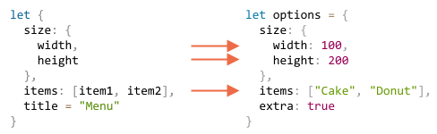

# แยกค่าด้วย destructuring

โครงสร้างข้อมูล (data structure) ที่ใช้กันมากที่สุดสองแบบใน JavaScript คือ `Object` และ `Array`

- ออบเจ็กต์ (object) เก็บข้อมูลหลายรายการไว้ด้วยกัน โดยใช้คีย์ (key) ระบุข้อมูลแต่ละรายการ
- อาร์เรย์ (array) เก็บข้อมูลหลายรายการเป็นลำดับ

เมื่อส่งข้อมูลเหล่านี้ให้ฟังก์ชัน (function) เราอาจไม่ได้ต้องการใช้ทุกค่า ฟังก์ชันอาจใช้สมาชิก (element) ของอาร์เรย์หรือพร็อพเพอร์ตี้ (property) ของออบเจ็กต์เพียงบางตัว

*Destructuring assignment* เป็นรูปแบบการเขียนที่ช่วยแยกค่าจากอาร์เรย์หรือออบเจ็กต์มาเก็บในตัวแปร (variable) หลายตัว ทำให้หยิบค่าเหล่านั้นมาใช้ได้สะดวกขึ้น

Destructuring ยังช่วยให้เขียนฟังก์ชันที่มีพารามิเตอร์ (parameter) หลายตัวและค่าเริ่มต้น (default value) ได้สะดวกด้วย เราจะได้เห็นตัวอย่างกันในบทนี้

## แยกค่าจากอาร์เรย์

ลองดูการแยกค่าจากอาร์เรย์มาเก็บในตัวแปร:

```js
// อาร์เรย์เก็บชื่อและนามสกุล
let arr = ["John", "Smith"]

*!*
// กำหนดค่าด้วย destructuring
// ให้ firstName = arr[0]
// และ surname = arr[1]
let [firstName, surname] = arr;
*/!*

alert(firstName); // John
alert(surname);  // Smith
```

ทีนี้เราก็ใช้ตัวแปร `firstName` และ `surname` ได้โดยตรง แทนการเข้าถึงสมาชิกผ่านอาร์เรย์

รูปแบบนี้ใช้ร่วมกับเมธอด (method) `split` หรือเมธอดอื่นที่คืนค่าเป็นอาร์เรย์ได้พอดี:

```js run
let [firstName, surname] = "John Smith".split(' ');
alert(firstName); // John
alert(surname);  // Smith
```

แม้รูปแบบการเขียนจะสั้น แต่ก็มีรายละเอียดที่ต้องรู้ ลองดูตัวอย่างต่อไปนี้

````smart header="Destructuring ไม่ได้เปลี่ยนอาร์เรย์เดิม"
คำว่า "destructuring assignment" หมายถึงการแยกค่าออกจากโครงสร้างแล้วคัดลอกไปเก็บในตัวแปร อาร์เรย์ต้นทางยังคงเดิม

การเขียนแบบนี้เป็นรูปย่อของโค้ดต่อไปนี้:
```js
// let [firstName, surname] = arr;
let firstName = arr[0];
let surname = arr[1];
```
````

````smart header="ใช้จุลภาคข้ามสมาชิกที่ไม่ต้องการ"
ถ้าไม่ต้องการสมาชิกตำแหน่งใด ให้เว้นชื่อตัวแปรในตำแหน่งนั้นไว้ แล้วใส่จุลภาคคั่นตามเดิม:

```js run
*!*
// ไม่ต้องการสมาชิกตัวที่สอง
let [firstName, , title] = ["Julius", "Caesar", "Consul", "of the Roman Republic"];
*/!*

alert( title ); // Consul
```

โค้ดนี้ข้ามสมาชิกตัวที่สอง แล้วนำตัวที่สามไปเก็บใน `title` ส่วนสมาชิกที่เหลือก็ข้ามไปเช่นกัน เพราะไม่มีตัวแปรรับค่า
````

````smart header="ด้านขวาใช้ iterable ชนิดใดก็ได้"

Destructuring แบบนี้ใช้ได้กับ iterable ทุกชนิด หรือข้อมูลที่วนอ่านค่าทีละตัวได้ รวมถึงสตริง (string) และ `Set`:

```js
let [a, b, c] = "abc"; // ["a", "b", "c"]
let [one, two, three] = new Set([1, 2, 3]);
```
ที่ทำได้ก็เพราะ destructuring วนอ่านค่าจากข้อมูลด้านขวาของ `=` แล้วนำแต่ละค่าไปกำหนดให้ตัวแปร คล้ายกับการใช้ `for..of` เพียงแต่เขียนได้สั้นกว่า
````


````smart header="ใช้พร็อพเพอร์ตี้เป็นปลายทางได้ด้วย"
ด้านซ้ายไม่จำเป็นต้องเป็นตัวแปรเสมอไป ขอเพียงเป็นสิ่งที่เรากำหนดค่าให้ได้

เช่น พร็อพเพอร์ตี้ของออบเจ็กต์:
```js run
let user = {};
[user.name, user.surname] = "John Smith".split(' ');

alert(user.name); // John
alert(user.surname); // Smith
```

````

````smart header="วนอ่านคู่คีย์และค่าด้วย .entries()"
ในบทก่อน เรารู้จักเมธอด [Object.entries(obj)](mdn:js/Object/entries) กันแล้ว

เรานำเมธอดนี้มาใช้ร่วมกับ destructuring เพื่อวนอ่านคีย์และค่าของออบเจ็กต์ทีละคู่ได้:

```js run
let user = {
  name: "John",
  age: 30
};

// วนอ่านคีย์และค่าทีละคู่
*!*
for (let [key, value] of Object.entries(user)) {
*/!*
  alert(`${key}:${value}`); // name:John ตามด้วย age:30
}
```

สำหรับ `Map` เขียนได้สั้นกว่านี้ เพราะ `Map` เป็น iterable อยู่แล้ว:

```js run
let user = new Map();
user.set("name", "John");
user.set("age", "30");

*!*
// Map วนอ่านเป็นคู่ [key, value] จึงใช้ destructuring ได้พอดี
for (let [key, value] of user) {
*/!*
  alert(`${key}:${value}`); // name:John ตามด้วย age:30
}
```
````

````smart header="สลับค่าของตัวแปร"
เรายังใช้ destructuring สลับค่าของตัวแปรสองตัวได้ด้วย:

```js run
let guest = "Jane";
let admin = "Pete";

// สลับค่าให้ guest=Pete และ admin=Jane
*!*
[guest, admin] = [admin, guest];
*/!*

alert(`${guest} ${admin}`); // Pete Jane (สลับค่าแล้ว)
```

โค้ดนี้สร้างอาร์เรย์ชั่วคราวจากค่าของตัวแปรทั้งสอง แล้วใช้ destructuring กำหนดค่ากลับให้ตัวแปรในลำดับที่สลับกัน

วิธีเดียวกันนี้ใช้สลับค่าของตัวแปรมากกว่าสองตัวได้ด้วย
````

### เก็บค่าที่เหลือด้วย rest '...'

ถ้าอาร์เรย์มีสมาชิกมากกว่าตัวแปรด้านซ้าย สมาชิกส่วนเกินจะถูกข้ามไป

ตัวอย่างนี้รับค่าเพียงสองตัวแรก ส่วนที่เหลือไม่ได้ใช้:

```js run
let [name1, name2] = ["Julius", "Caesar", "Consul", "of the Roman Republic"];

alert(name1); // Julius
alert(name2); // Caesar
// สมาชิกที่เหลือไม่ได้ถูกกำหนดให้ตัวแปรใด
```

ถ้าต้องการเก็บค่าที่เหลือทั้งหมดด้วย ให้เพิ่มตัวแปรอีกตัวแล้วใส่จุดสามจุด `"..."` ไว้ข้างหน้า:

```js run
let [name1, name2, *!*...rest*/!*] = ["Julius", "Caesar", *!*"Consul", "of the Roman Republic"*/!*];

*!*
// rest เป็นอาร์เรย์ที่เก็บสมาชิกตั้งแต่ตัวที่สามเป็นต้นไป
alert(rest[0]); // Consul
alert(rest[1]); // of the Roman Republic
alert(rest.length); // 2
*/!*
```

ค่าของ `rest` คืออาร์เรย์ที่รวมสมาชิกส่วนที่เหลือไว้

เราจะตั้งชื่อตัวแปรเป็นชื่ออื่นก็ได้ ไม่จำเป็นต้องชื่อ `rest` แต่ต้องมีจุดสามจุดนำหน้า และอยู่ท้ายสุดของ destructuring:

```js run
let [name1, name2, *!*...titles*/!*] = ["Julius", "Caesar", "Consul", "of the Roman Republic"];
// ตอนนี้ titles = ["Consul", "of the Roman Republic"]
```

### ค่าเริ่มต้น

ถ้าอาร์เรย์มีสมาชิกน้อยกว่าตัวแปรด้านซ้าย จะไม่เกิดข้อผิดพลาด ตัวแปรที่ไม่มีค่ามาให้จะได้ `undefined`:

```js run
*!*
let [firstName, surname] = [];
*/!*

alert(firstName); // undefined
alert(surname); // undefined
```

หากต้องการใช้ค่าเริ่มต้นแทนค่าที่ขาดไป ให้กำหนดด้วย `=`:

```js run
*!*
// กำหนดค่าเริ่มต้น
let [name = "Guest", surname = "Anonymous"] = ["Julius"];
*/!*

alert(name);    // Julius (ค่าจากอาร์เรย์)
alert(surname); // Anonymous (ใช้ค่าเริ่มต้น)
```

ค่าเริ่มต้นจะเป็นนิพจน์ (expression) ที่ซับซ้อนหรือการเรียกฟังก์ชันก็ได้ นิพจน์เหล่านี้จะทำงานเฉพาะเมื่อไม่มีค่ามาให้เท่านั้น

ตัวอย่างนี้ใช้ฟังก์ชัน `prompt` เพื่อขอค่าเริ่มต้นของตัวแปรทั้งสอง:

```js run
// เรียก prompt เฉพาะของ surname
let [name = prompt('name?'), surname = prompt('surname?')] = ["Julius"];

alert(name);    // Julius (ค่าจากอาร์เรย์)
alert(surname); // ค่าที่ได้จาก prompt
```

สังเกตว่า `prompt` จะทำงานเฉพาะของ `surname` ซึ่งไม่มีค่ามาให้ ส่วน `name` มีค่า `"Julius"` อยู่แล้ว

## แยกค่าจากออบเจ็กต์

Destructuring ใช้กับออบเจ็กต์ได้เช่นกัน โดยมีรูปแบบพื้นฐานดังนี้:

```js
let {var1, var2} = {var1:…, var2:…}
```

ด้านขวาคือออบเจ็กต์ที่ต้องการแยกค่า ส่วนด้านซ้ายเป็นรูปแบบที่ระบุว่าจะรับค่าจากพร็อพเพอร์ตี้ใดบ้าง ในกรณีพื้นฐานที่สุด เราเขียนชื่อตัวแปรไว้ใน `{...}` ให้ตรงกับชื่อพร็อพเพอร์ตี้

ตัวอย่างเช่น:

```js run
let options = {
  title: "Menu",
  width: 100,
  height: 200
};

*!*
let {title, width, height} = options;
*/!*

alert(title);  // Menu
alert(width);  // 100
alert(height); // 200
```

ค่าของ `options.title`, `options.width` และ `options.height` จะถูกกำหนดให้ตัวแปรที่มีชื่อตรงกัน

ลำดับชื่อด้านซ้ายไม่สำคัญ จะเขียนแบบนี้ก็ได้ผลเหมือนกัน:

```js
// สลับลำดับชื่อใน let {...}
let {height, width, title} = { title: "Menu", height: 200, width: 100 }
```

รูปแบบด้านซ้ายยังระบุได้ด้วยว่าจะนำค่าจากพร็อพเพอร์ตี้ใดไปเก็บในตัวแปรใด

ถ้าต้องการใช้ชื่อตัวแปรต่างจากชื่อพร็อพเพอร์ตี้ เช่น นำค่า `options.width` ไปเก็บในตัวแปร `w` ให้เขียนชื่อตัวแปรต่อจากเครื่องหมาย `:`:

```js run
let options = {
  title: "Menu",
  width: 100,
  height: 200
};

*!*
// { พร็อพเพอร์ตี้ต้นทาง: ตัวแปรปลายทาง }
let {width: w, height: h, title} = options;
*/!*

// width -> w
// height -> h
// title -> title

alert(title);  // Menu
alert(w);      // 100
alert(h);      // 200
```

ด้านซ้ายของ `:` คือชื่อพร็อพเพอร์ตี้ ส่วนด้านขวาคือตัวแปรที่จะรับค่า ในตัวอย่างนี้ `width` ไปอยู่ใน `w`, `height` ไปอยู่ใน `h` และ `title` ใช้ชื่อตัวแปรเดิม

สำหรับพร็อพเพอร์ตี้ที่อาจไม่มีอยู่ เรากำหนดค่าเริ่มต้นด้วย `"="` ได้:

```js run
let options = {
  title: "Menu"
};

*!*
let {width = 100, height = 200, title} = options;
*/!*

alert(title);  // Menu
alert(width);  // 100
alert(height); // 200
```

ค่าเริ่มต้นเป็นนิพจน์หรือการเรียกฟังก์ชันได้ เช่นเดียวกับการแยกค่าจากอาร์เรย์และการกำหนดค่าเริ่มต้นให้พารามิเตอร์ นิพจน์นั้นจะทำงานเมื่อไม่มีค่ามาให้

โค้ดนี้จึงเรียก `prompt` เพื่อถามค่า `width` แต่ไม่ถาม `title`:

```js run
let options = {
  title: "Menu"
};

*!*
let {width = prompt("width?"), title = prompt("title?")} = options;
*/!*

alert(title);  // Menu
alert(width);  // ค่าที่ได้จาก prompt
```

เรายังใช้ `:` ร่วมกับ `=` เพื่อเปลี่ยนชื่อตัวแปรและกำหนดค่าเริ่มต้นไปพร้อมกันได้:

```js run
let options = {
  title: "Menu"
};

*!*
let {width: w = 100, height: h = 200, title} = options;
*/!*

alert(title);  // Menu
alert(w);      // 100
alert(h);      // 200
```

แม้ออบเจ็กต์จะมีพร็อพเพอร์ตี้หลายตัว เราก็เลือกแยกออกมาเฉพาะค่าที่ต้องการได้:

```js run
let options = {
  title: "Menu",
  width: 100,
  height: 200
};

// แยกเฉพาะ title มาเก็บในตัวแปร
let { title } = options;

alert(title); // Menu
```

### เก็บพร็อพเพอร์ตี้ที่เหลือด้วย rest "..."

ถ้าออบเจ็กต์มีพร็อพเพอร์ตี้มากกว่าตัวแปรด้านซ้าย เราสามารถแยกบางค่าออกมาก่อน แล้วเก็บพร็อพเพอร์ตี้ที่เหลือไว้ด้วยกันได้

ใช้รูปแบบ rest ได้เหมือนกับอาร์เรย์ เบราว์เซอร์ปัจจุบันรองรับรูปแบบนี้แล้ว (ตรวจสอบ ณ 6 กันยายน 2026) แต่เบราว์เซอร์เก่าบางตัว เช่น IE ไม่รองรับ หากต้องรองรับเบราว์เซอร์เหล่านั้น ให้ใช้ Babel แปลงโค้ดก่อน

รูปแบบการเขียนเป็นดังนี้:

```js run
let options = {
  title: "Menu",
  height: 200,
  width: 100
};

*!*
// title = ค่าของพร็อพเพอร์ตี้ชื่อ title
// rest = ออบเจ็กต์ที่เก็บพร็อพเพอร์ตี้ที่เหลือ
let {title, ...rest} = options;
*/!*

// ตอนนี้ title="Menu", rest={height: 200, width: 100}
alert(rest.height);  // 200
alert(rest.width);   // 100
```

````smart header="ข้อควรระวังเมื่อไม่มี `let`"
ตัวอย่างที่ผ่านมา เราประกาศตัวแปรพร้อมกับกำหนดค่าโดยเขียน `let {…} = {…}` ถ้ามีตัวแปรอยู่แล้ว ก็ใช้ตัวแปรเหล่านั้นได้โดยไม่ต้องใส่ `let` แต่มีรายละเอียดที่ต้องระวัง

โค้ดนี้ใช้ไม่ได้:
```js run
let title, width, height;

// บรรทัดนี้เกิดข้อผิดพลาด
{title, width, height} = {title: "Menu", width: 200, height: 100};
```

เมื่อ JavaScript พบ `{...}` ในตำแหน่งที่ไม่ได้อยู่ภายในนิพจน์อื่น จะตีความว่าเป็นบล็อกโค้ด (code block) ซึ่งใช้รวมคำสั่ง (statement) ไว้ด้วยกัน เช่น:

```js run
{
  // บล็อกโค้ด
  let message = "Hello";
  // ...
  alert( message );
}
```

ตัวอย่างที่เกิดข้อผิดพลาดจึงถูกตีความว่าเป็นบล็อกโค้ด ทั้งที่เราต้องการกำหนดค่าด้วย destructuring

ให้ครอบนิพจน์ทั้งหมดด้วยวงเล็บ `(...)` เพื่อให้ JavaScript ตีความตามที่เราต้องการ:

```js run
let title, width, height;

// ครอบวงเล็บแล้วใช้ได้
*!*(*/!*{title, width, height} = {title: "Menu", width: 200, height: 100}*!*)*/!*;

alert( title ); // Menu
```
````

## แยกค่าจากโครงสร้างที่ซ้อนกัน

ถ้าออบเจ็กต์หรืออาร์เรย์มีออบเจ็กต์และอาร์เรย์อื่นซ้อนอยู่ภายใน เราเขียนรูปแบบด้านซ้ายให้ซ้อนกันตามนั้น เพื่อแยกค่าที่อยู่ลึกลงไปได้

ในตัวอย่างนี้ พร็อพเพอร์ตี้ `size` ของ `options` เก็บออบเจ็กต์อีกตัว ส่วน `items` เก็บอาร์เรย์ เราจึงเขียนด้านซ้ายให้มีโครงสร้างตรงกันเพื่อรับค่าจากทั้งสองส่วน:

```js run
let options = {
  size: {
    width: 100,
    height: 200
  },
  items: ["Cake", "Donut"],
  extra: true
};

// แบ่ง destructuring เป็นหลายบรรทัดเพื่อให้อ่านสะดวก
let {
  size: { // แยกค่าจาก size
    width,
    height
  },
  items: [item1, item2], // แยกค่าจาก items
  title = "Menu" // ไม่มีในออบเจ็กต์ จึงใช้ค่าเริ่มต้น
} = options;

alert(title);  // Menu
alert(width);  // 100
alert(height); // 200
alert(item1);  // Cake
alert(item2);  // Donut
```

ค่าจากพร็อพเพอร์ตี้ของ `options` จะไปอยู่ในตัวแปรที่ตรงกัน ยกเว้น `extra` ที่ไม่ได้ระบุไว้ด้านซ้าย:



เราจึงได้ตัวแปร `width`, `height`, `item1`, `item2` และ `title` ซึ่งใช้ค่าเริ่มต้น

สังเกตว่าไม่มีตัวแปรชื่อ `size` หรือ `items` เพราะเราแยกค่าภายในสองส่วนนี้ออกมาใช้

## รับพารามิเตอร์ฟังก์ชันด้วย destructuring

บางฟังก์ชันมีพารามิเตอร์หลายตัว และส่วนใหญ่ไม่จำเป็นต้องระบุค่า โดยเฉพาะฟังก์ชันที่ใช้สร้างส่วนติดต่อผู้ใช้ (user interface) ลองนึกถึงฟังก์ชันสร้างเมนูที่รับความกว้าง ความสูง ชื่อเมนู รายการในเมนู และค่าอื่น ๆ

ถ้าเขียนฟังก์ชันแบบนี้ ผู้เรียกจะใช้งานลำบาก:

```js
function showMenu(title = "Untitled", width = 200, height = 100, items = []) {
  // ...
}
```

เวลาเรียกฟังก์ชัน เราต้องจำลำดับของอาร์กิวเมนต์ (argument) ให้ได้ แม้ IDE จะช่วยแสดงข้อมูล โดยเฉพาะเมื่อโค้ดมีเอกสารอธิบายชัดเจน แต่ก็ยังต้องระวังลำดับอยู่ อีกปัญหาคือถ้าพารามิเตอร์ส่วนใหญ่ใช้ค่าเริ่มต้นได้แล้ว เราจะส่งเฉพาะค่าที่ต้องการเปลี่ยนอย่างไร

อาจต้องเขียนแบบนี้:

```js
// ส่ง undefined ในตำแหน่งที่ต้องการใช้ค่าเริ่มต้น
showMenu("My Menu", undefined, undefined, ["Item1", "Item2"])
```

ยิ่งมีพารามิเตอร์มาก โค้ดที่เรียกใช้ก็ยิ่งอ่านตามยาก

Destructuring ช่วยจัดการเรื่องนี้ได้ โดยรวมค่าที่ต้องการส่งไว้ในออบเจ็กต์เดียว แล้วให้ฟังก์ชันแยกค่าออกมาเป็นตัวแปรทันทีที่รับเข้ามา:

```js run
// ออบเจ็กต์ที่จะส่งให้ฟังก์ชัน
let options = {
  title: "My menu",
  items: ["Item1", "Item2"]
};

// ฟังก์ชันแยกค่าจากออบเจ็กต์มาเก็บในตัวแปรทันที
function showMenu(*!*{title = "Untitled", width = 200, height = 100, items = []}*/!*) {
  // title และ items ใช้ค่าจาก options
  // width และ height ใช้ค่าเริ่มต้น
  alert( `${title} ${width} ${height}` ); // My menu 200 100
  alert( items ); // Item1,Item2
}

showMenu(options);
```

เราจะใช้รูปแบบที่ซ้อนกัน หรือใช้ `:` เพื่อเปลี่ยนชื่อตัวแปรด้วยก็ได้:

```js run
let options = {
  title: "My menu",
  items: ["Item1", "Item2"]
};

*!*
function showMenu({
  title = "Untitled",
  width: w = 100,  // เก็บค่า width ใน w
  height: h = 200, // เก็บค่า height ใน h
  items: [item1, item2] // เก็บสมาชิกตัวแรกใน item1 และตัวที่สองใน item2
}) {
*/!*
  alert( `${title} ${w} ${h}` ); // My menu 100 200
  alert( item1 ); // Item1
  alert( item2 ); // Item2
}

showMenu(options);
```

รูปแบบเต็มเหมือนกับ destructuring ที่เราใช้กำหนดค่าให้ตัวแปร:
```js
function({
  incomingProperty: varName = defaultValue
  ...
})
```

เมื่อรับออบเจ็กต์เข้ามา ฟังก์ชันจะนำค่าของพร็อพเพอร์ตี้ `incomingProperty` ไปเก็บในตัวแปร `varName` และใช้ `defaultValue` เป็นค่าเริ่มต้น

การรับค่าแบบนี้ยังต้องมีอาร์กิวเมนต์ส่งให้ `showMenu()` หากย้อนกลับไปใช้ `showMenu` แบบแรกที่กำหนด `items = []` และต้องการใช้ค่าเริ่มต้นทุกตัว ให้ส่งออบเจ็กต์ว่างเข้าไป:

```js
showMenu({}); // ใช้ได้ ทุกตัวใช้ค่าเริ่มต้น

showMenu(); // เกิดข้อผิดพลาด
```

ถ้าต้องการเรียกฟังก์ชันโดยไม่ส่งอาร์กิวเมนต์เลย ให้กำหนด `{}` เป็นค่าเริ่มต้นของพารามิเตอร์ที่รับออบเจ็กต์ทั้งตัวด้วย:

```js run
function showMenu({ title = "Menu", width = 100, height = 200 }*!* = {}*/!*) {
  alert( `${title} ${width} ${height}` );
}

showMenu(); // Menu 100 200
```

เมื่อไม่ได้ส่งอาร์กิวเมนต์ ฟังก์ชันจะรับ `{}` เป็นค่าเริ่มต้น จึงมีออบเจ็กต์ให้ทำ destructuring ได้เสมอ

## สรุป

- Destructuring assignment ช่วยแยกค่าจากออบเจ็กต์หรืออาร์เรย์ไปเก็บในตัวแปรหลายตัวได้ในครั้งเดียว
- รูปแบบเต็มสำหรับออบเจ็กต์:
    ```js
    let {prop : varName = defaultValue, ...rest} = object
    ```

    ค่าของพร็อพเพอร์ตี้ `prop` จะไปอยู่ในตัวแปร `varName` ถ้าไม่มีพร็อพเพอร์ตี้นั้น จะใช้ค่าเริ่มต้นที่กำหนดไว้

    พร็อพเพอร์ตี้ที่ไม่ได้แยกออกมาจะถูกคัดลอกไปเก็บในออบเจ็กต์ `rest`

- รูปแบบเต็มสำหรับอาร์เรย์:

    ```js
    let [item1 = defaultValue, item2, ...rest] = array
    ```

    สมาชิกตัวแรกไปอยู่ใน `item1` ตัวที่สองไปอยู่ใน `item2` ส่วนที่เหลือรวมไว้ในอาร์เรย์ `rest`

- แยกค่าจากอาร์เรย์หรือออบเจ็กต์ที่ซ้อนกันได้ โดยเขียนรูปแบบด้านซ้ายให้มีโครงสร้างตรงกับข้อมูลด้านขวา
