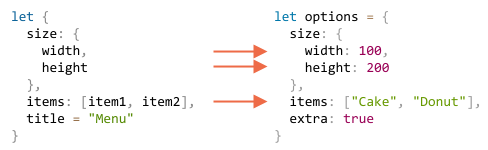

# Destructuring assignment

โครงสร้างข้อมูลที่ใช้บ่อยที่สุดสองอย่างใน JavaScript คือ `Object` และ `Array`

- ออบเจ็กต์ใช้เก็บข้อมูลแบบ key-value เป็นหน่วยเดียว
- อาร์เรย์ใช้เก็บข้อมูลเป็นรายการที่มีลำดับ

แต่ในทางปฏิบัติ เวลาส่งสิ่งเหล่านี้ไปให้ฟังก์ชัน มักต้องการแค่บางส่วน ไม่จำเป็นต้องใช้ทั้งหมด

*Destructuring assignment* คือไวยากรณ์พิเศษที่ช่วยให้ "แกะ" อาร์เรย์หรือออบเจ็กต์ออกเป็นตัวแปรหลายตัวได้ในคราวเดียว สะดวกกว่าการอ้างอิง index หรือ key ทีละตัวมาก

นอกจากนี้ destructuring ยังทำงานได้ดีกับฟังก์ชันที่มีพารามิเตอร์จำนวนมาก รวมถึงการกำหนดค่าเริ่มต้น เดี๋ยวจะเห็นกันเองว่าทรงพลังแค่ไหน

## Array destructuring

ตัวอย่างการแตกอาร์เรย์ออกเป็นตัวแปร:

```js
// มีอาร์เรย์ที่เก็บชื่อและนามสกุล
let arr = ["John", "Smith"]

*!*
// destructuring assignment
// กำหนด firstName = arr[0]
// และ surname = arr[1]
let [firstName, surname] = arr;
*/!*

alert(firstName); // John
alert(surname);  // Smith
```

ทีนี้ก็ทำงานกับตัวแปรได้เลย ไม่ต้องอ้างอิง index ของอาร์เรย์อีกต่อไป

ใช้ร่วมกับ `split` หรือเมธอดอื่นๆ ที่คืนค่าเป็นอาร์เรย์ก็ได้เลย:

```js run
let [firstName, surname] = "John Smith".split(' ');
alert(firstName); // John
alert(surname);  // Smith
```

ไวยากรณ์เรียบง่ายดี แต่มีรายละเอียดที่น่าสนใจซ่อนอยู่ มาดูตัวอย่างเพิ่มเติมกัน

````smart header="\"Destructuring\" ไม่ได้แปลว่า \"ทำลาย\""
ชื่อ "destructuring assignment" มาจากการที่มัน "แตกโครงสร้าง" ด้วยการคัดลอกค่าลงตัวแปร — อาร์เรย์ต้นฉบับไม่ได้ถูกแตะเลย

พูดง่ายๆ ก็คือ มันแค่เขียนสั้นลงจากนี้:
```js
// let [firstName, surname] = arr;
let firstName = arr[0];
let surname = arr[1];
```
````

````smart header="ข้ามสมาชิกที่ไม่ต้องการด้วยเครื่องหมายจุลภาค"
ใส่จุลภาคเพิ่มเพื่อข้ามสมาชิกที่ไม่ต้องการ:

```js run
*!*
// ไม่ต้องการสมาชิกตัวที่สอง
let [firstName, , title] = ["Julius", "Caesar", "Consul", "of the Roman Republic"];
*/!*

alert( title ); // Consul
```

สมาชิกตัวที่สองถูกข้ามไป ตัวที่สามไปที่ `title` ส่วนที่เหลือก็ตกไปเพราะไม่มีตัวแปรรับ
````

````smart header="ใช้ได้กับ iterable ใดๆ ทางขวามือ"

ทางขวามือไม่จำเป็นต้องเป็นอาร์เรย์เสมอไป ใช้ได้กับ iterable ใดก็ได้:

```js
let [a, b, c] = "abc"; // ["a", "b", "c"]
let [one, two, three] = new Set([1, 2, 3]);
```

เป็นเพราะ destructuring assignment ทำงานด้วยการ iterate ค่าทางขวา — พูดง่ายๆ คือเป็นน้ำตาลทางไวยากรณ์ของการใช้ `for..of` กับค่าทางขวาของ `=` แล้วกำหนดค่าให้ตัวแปรทีละตัวนั่นเอง
````


````smart header="กำหนดให้สิ่งใดก็ได้ทางซ้ายมือ"
ทางซ้ายมือไม่จำเป็นต้องเป็นตัวแปรเสมอไป ใช้ "สิ่งที่รับการกำหนดค่าได้" ก็ได้

เช่น พร็อพเพอร์ตี้ของออบเจ็กต์:
```js run
let user = {};
[user.name, user.surname] = "John Smith".split(' ');

alert(user.name); // John
alert(user.surname); // Smith
```

````

````smart header="วนลูปด้วย .entries()"
จำเมธอด [Object.entries(obj)](mdn:js/Object/entries) จากบทก่อนได้ไหม? นำมาใช้ร่วมกับ destructuring เพื่อวนลูปผ่าน key-value ของออบเจ็กต์ได้เลย:

```js run
let user = {
  name: "John",
  age: 30
};

// วนลูปผ่าน key-value
*!*
for (let [key, value] of Object.entries(user)) {
*/!*
  alert(`${key}:${value}`); // name:John แล้วก็ age:30
}
```

กรณีของ `Map` จะง่ายกว่าอีก เพราะ Map เป็น iterable อยู่แล้ว:

```js run
let user = new Map();
user.set("name", "John");
user.set("age", "30");

*!*
// Map iterate เป็นคู่ [key, value] สะดวกมากสำหรับ destructuring
for (let [key, value] of user) {
*/!*
  alert(`${key}:${value}`); // name:John แล้วก็ age:30
}
```
````

````smart header="เทคนิคสลับค่าตัวแปร"
destructuring มีเทคนิคที่รู้จักกันดีสำหรับสลับค่าตัวแปรสองตัว:

```js run
let guest = "Jane";
let admin = "Pete";

// สลับค่า: ให้ guest=Pete, admin=Jane
*!*
[guest, admin] = [admin, guest];
*/!*

alert(`${guest} ${admin}`); // Pete Jane (สลับสำเร็จ!)
```

สร้างอาร์เรย์ชั่วคราวขึ้นมาหนึ่งตัว แล้ว destructure กลับในลำดับที่สลับกัน ง่ายมากใช่ไหม?

ใช้วิธีเดิมนี้สลับมากกว่าสองตัวแปรก็ได้เช่นกัน
````

### The rest '...'

ถ้าอาร์เรย์ยาวกว่ารายการตัวแปรทางซ้าย สมาชิก "ส่วนเกิน" จะถูกละทิ้งโดยปริยาย

```js run
let [name1, name2] = ["Julius", "Caesar", "Consul", "of the Roman Republic"];

alert(name1); // Julius
alert(name2); // Caesar
// รายการที่เหลือไม่ได้ถูกกำหนดให้ที่ไหน
```

อยากเก็บส่วนที่เหลือไว้ด้วยไหม? ใช้จุดสามจุด `"..."` เพิ่มตัวแปรที่รับ "ส่วนที่เหลือ" ได้เลย:

```js run
let [name1, name2, *!*...rest*/!*] = ["Julius", "Caesar", *!*"Consul", "of the Roman Republic"*/!*];

*!*
// rest คืออาร์เรย์ของสมาชิก เริ่มตั้งแต่ตัวที่ 3
alert(rest[0]); // Consul
alert(rest[1]); // of the Roman Republic
alert(rest.length); // 2
*/!*
```

`rest` จะได้ค่าเป็นอาร์เรย์ของสมาชิกที่เหลือทั้งหมด

จะตั้งชื่ออื่นแทน `rest` ก็ได้ ขอแค่ใส่จุดสามจุดข้างหน้าและวางไว้เป็นตัวสุดท้ายเท่านั้น:

```js run
let [name1, name2, *!*...titles*/!*] = ["Julius", "Caesar", "Consul", "of the Roman Republic"];
// ตอนนี้ titles = ["Consul", "of the Roman Republic"]
```

### Default values

ถ้าอาร์เรย์สั้นกว่ารายการตัวแปรทางซ้าย จะไม่เกิด error แต่ตัวแปรที่ไม่มีค่าจะเป็น undefined:

```js run
*!*
let [firstName, surname] = [];
*/!*

alert(firstName); // undefined
alert(surname); // undefined
```

ถ้าต้องการค่า "เริ่มต้น" สำรองไว้แทน ระบุได้ด้วย `=`:

```js run
*!*
// ค่าเริ่มต้น
let [name = "Guest", surname = "Anonymous"] = ["Julius"];
*/!*

alert(name);    // Julius (มาจากอาร์เรย์)
alert(surname); // Anonymous (ใช้ค่าเริ่มต้น)
```

ค่าเริ่มต้นจะเป็นนิพจน์ที่ซับซ้อนหรือการเรียกฟังก์ชันก็ได้ โดยจะถูกประเมินผลก็ต่อเมื่อไม่มีค่ามาให้เท่านั้น

เช่น ใช้ `prompt` เป็นค่าเริ่มต้น:

```js run
// เรียก prompt เฉพาะสำหรับ surname เท่านั้น
let [name = prompt('name?'), surname = prompt('surname?')] = ["Julius"];

alert(name);    // Julius (มาจากอาร์เรย์)
alert(surname); // แล้วแต่ที่ป้อนใน prompt
```

`prompt` จะทำงานเฉพาะกับค่าที่หายไป (`surname`) เท่านั้น — `name` มีค่าอยู่แล้ว จึงไม่ถาม

## Object destructuring

ออบเจ็กต์ก็ destructure ได้เช่นกัน

ไวยากรณ์พื้นฐาน:

```js
let {var1, var2} = {var1:…, var2:…}
```

ทางขวาคือออบเจ็กต์ที่ต้องการแตกออก ทางซ้ายคือ "รูปแบบ" ที่ระบุพร็อพเพอร์ตี้ที่ต้องการ ในรูปแบบง่ายที่สุดคือรายชื่อตัวแปรอยู่ใน `{...}`

ตัวอย่าง:

```js run
let options = {
  title: "Menu",
  width: 100,
  height: 200
};

*!*
let {title, width, height} = options;
*/!*

alert(title);  // Menu
alert(width);  // 100
alert(height); // 200
```

พร็อพเพอร์ตี้ `options.title`, `options.width` และ `options.height` จะไปอยู่ในตัวแปรที่ชื่อตรงกัน

ลำดับไม่สำคัญ แบบนี้ก็ได้ผลเหมือนกัน:

```js
// เปลี่ยนลำดับใน let {...}
let {height, width, title} = { title: "Menu", height: 200, width: 100 }
```

รูปแบบทางซ้ายซับซ้อนกว่านี้ได้ด้วย — ระบุการจับคู่ระหว่างพร็อพเพอร์ตี้กับตัวแปรได้เลย

เช่น ถ้าอยากให้ `options.width` ไปที่ตัวแปรชื่อ `w` ใช้เครื่องหมายทวิภาคระบุชื่อตัวแปรได้:

```js run
let options = {
  title: "Menu",
  width: 100,
  height: 200
};

*!*
// { พร็อพเพอร์ตี้ต้นทาง: ตัวแปรปลายทาง }
let {width: w, height: h, title} = options;
*/!*

// width -> w
// height -> h
// title -> title

alert(title);  // Menu
alert(w);      // 100
alert(h);      // 200
```

เครื่องหมายทวิภาคอ่านว่า "อะไร : ไปที่ไหน" — `width` ไปที่ `w`, `height` ไปที่ `h`, `title` ใช้ชื่อเดิม

พร็อพเพอร์ตี้ที่อาจไม่มีในออบเจ็กต์ก็กำหนดค่าเริ่มต้นด้วย `"="` ได้:

```js run
let options = {
  title: "Menu"
};

*!*
let {width = 100, height = 200, title} = options;
*/!*

alert(title);  // Menu
alert(width);  // 100
alert(height); // 200
```

เช่นเดียวกับอาร์เรย์ ค่าเริ่มต้นจะเป็นนิพจน์หรือการเรียกฟังก์ชันก็ได้ และจะประเมินผลก็ต่อเมื่อไม่มีค่ามาให้เท่านั้น

ในตัวอย่างด้านล่าง `prompt` จะถามเฉพาะ `width` ที่หายไป แต่ไม่ถาม `title` ที่มีค่าอยู่แล้ว:

```js run
let options = {
  title: "Menu"
};

*!*
let {width = prompt("width?"), title = prompt("title?")} = options;
*/!*

alert(title);  // Menu
alert(width);  // (แล้วแต่ค่าที่ได้จาก prompt)
```

ใช้ทั้งทวิภาคและเครื่องหมายเท่ากับร่วมกันได้ด้วย:

```js run
let options = {
  title: "Menu"
};

*!*
let {width: w = 100, height: h = 200, title} = options;
*/!*

alert(title);  // Menu
alert(w);      // 100
alert(h);      // 200
```

ถ้าออบเจ็กต์มีพร็อพเพอร์ตี้เยอะ ก็ดึงแค่ที่ต้องการมาได้เลย:

```js run
let options = {
  title: "Menu",
  width: 100,
  height: 200
};

// ดึงเฉพาะ title มาเป็นตัวแปร
let { title } = options;

alert(title); // Menu
```

### The rest pattern "..."

แล้วถ้าออบเจ็กต์มีพร็อพเพอร์ตี้มากกว่าตัวแปรที่ต้องการล่ะ? เก็บบางส่วนแล้วโยน "ส่วนที่เหลือ" ไว้ที่ไหนสักที่ได้ไหม?

ได้เลย — ใช้ rest pattern เหมือนกับอาร์เรย์ บราวเซอร์สมัยใหม่ใช้ได้ทั้งนั้น (เก่ามากอย่าง IE อาจต้องใช้ Babel ช่วย)

```js run
let options = {
  title: "Menu",
  height: 200,
  width: 100
};

*!*
// title = พร็อพเพอร์ตี้ชื่อ title
// rest = ออบเจ็กต์ที่เก็บพร็อพเพอร์ตี้ที่เหลือ
let {title, ...rest} = options;
*/!*

// ตอนนี้ title="Menu", rest={height: 200, width: 100}
alert(rest.height);  // 200
alert(rest.width);   // 100
```

````smart header="ข้อควรระวังถ้าไม่มี `let`"
ตัวอย่างข้างบนประกาศตัวแปรพร้อมกับ destructuring เลย (`let {…} = {…}`) แต่จะใช้ตัวแปรที่ประกาศไว้ก่อนหน้าก็ได้ — แค่ต้องระวังเรื่องนี้:

```js run
let title, width, height;

// เกิดข้อผิดพลาดในบรรทัดนี้
{title, width, height} = {title: "Menu", width: 200, height: 100};
```

ปัญหาคือ JavaScript มองว่า `{...}` ที่ขึ้นต้นบรรทัดคือ code block ไม่ใช่ออบเจ็กต์ เช่นเดียวกับที่เราใช้ block จัดกลุ่มคำสั่งแบบนี้:

```js run
{
  // code block
  let message = "Hello";
  // ...
  alert( message );
}
```

แก้ได้ง่ายๆ ครอบด้วยวงเล็บ `(...)` เพื่อบอก JavaScript ว่านี่คือนิพจน์ ไม่ใช่ block:

```js run
let title, width, height;

// โอเคแล้ว
*!*(*/!*{title, width, height} = {title: "Menu", width: 200, height: 100}*!*)*/!*;

alert( title ); // Menu
```
````

## Nested destructuring

ถ้าออบเจ็กต์หรืออาร์เรย์ซ้อนกันอยู่ข้างใน รูปแบบทางซ้ายก็ซ้อนตามได้เช่นกัน เพื่อดึงข้อมูลจากส่วนที่ลึกกว่า

ในตัวอย่างด้านล่าง `options` มีออบเจ็กต์ซ้อนอยู่ใน `size` และอาร์เรย์ใน `items` รูปแบบทางซ้ายมีโครงสร้างตรงกันเพื่อดึงค่าออกมา:

```js run
let options = {
  size: {
    width: 100,
    height: 200
  },
  items: ["Cake", "Donut"],
  extra: true
};

// destructuring assignment แบ่งเขียนหลายบรรทัดเพื่อความชัดเจน
let {
  size: { // ใส่ size ที่นี่
    width,
    height
  },
  items: [item1, item2], // กำหนด items ที่นี่
  title = "Menu" // ไม่มีในออบเจ็กต์ (ใช้ค่าเริ่มต้น)
} = options;

alert(title);  // Menu
alert(width);  // 100
alert(height); // 200
alert(item1);  // Cake
alert(item2);  // Donut
```

พร็อพเพอร์ตี้ทั้งหมดของ `options` ถูกดึงออกมา ยกเว้น `extra` ที่ไม่ได้ระบุทางซ้าย:



ผลลัพธ์คือได้ตัวแปร `width`, `height`, `item1`, `item2` และ `title` (ซึ่งใช้ค่าเริ่มต้น)

สังเกตว่าไม่มีตัวแปรสำหรับ `size` และ `items` — เราดึงเฉพาะเนื้อหาข้างในออกมานั่นเอง

## Smart function parameters

ฟังก์ชัน user interface มักมีพารามิเตอร์เยอะมาก และส่วนใหญ่เป็น optional ทั้งนั้น ลองนึกภาพฟังก์ชันสร้างเมนูที่รับ ความกว้าง ความสูง หัวข้อ รายการ และอื่นๆ อีกมากมาย

วิธีเขียนแบบนี้ไม่ค่อยดีนัก:

```js
function showMenu(title = "Untitled", width = 200, height = 100, items = []) {
  // ...
}
```

ปัญหาคือต้องจำลำดับอาร์กิวเมนต์ แม้ IDE จะช่วยบอกได้บ้าง แต่ก็ยังน่าปวดหัว แล้วถ้าอยากเรียกโดยใช้แค่ค่าเริ่มต้นส่วนใหญ่ต้องเขียนยังไง?

ก็แบบนี้:

```js
// undefined ตรงที่ค่าเริ่มต้นใช้ได้
showMenu("My Menu", undefined, undefined, ["Item1", "Item2"])
```

น่าเกลียดมาก และยิ่งอ่านไม่รู้เรื่องถ้าพารามิเตอร์เพิ่มขึ้นอีก

destructuring ช่วยได้พอดี! ส่งพารามิเตอร์เป็นออบเจ็กต์ แล้วให้ฟังก์ชัน destructure เป็นตัวแปรตรงนั้นเลย:

```js run
// ส่งออบเจ็กต์ไปให้ฟังก์ชัน
let options = {
  title: "My menu",
  items: ["Item1", "Item2"]
};

// ...แล้วแตกออกเป็นตัวแปรตรงในพารามิเตอร์เลย
function showMenu(*!*{title = "Untitled", width = 200, height = 100, items = []}*/!*) {
  // title, items – มาจาก options
  // width, height – ใช้ค่าเริ่มต้น
  alert( `${title} ${width} ${height}` ); // My Menu 200 100
  alert( items ); // Item1, Item2
}

showMenu(options);
```

ใช้ destructuring ที่ซับซ้อนขึ้นได้อีก ทั้งออบเจ็กต์ซ้อนและการแมปชื่อด้วยทวิภาค:

```js run
let options = {
  title: "My menu",
  items: ["Item1", "Item2"]
};

*!*
function showMenu({
  title = "Untitled",
  width: w = 100,  // width ไปที่ w
  height: h = 200, // height ไปที่ h
  items: [item1, item2] // สมาชิกแรกของ items ไปที่ item1 ตัวที่สองไปที่ item2
}) {
*/!*
  alert( `${title} ${w} ${h}` ); // My Menu 100 200
  alert( item1 ); // Item1
  alert( item2 ); // Item2
}

showMenu(options);
```

ไวยากรณ์แบบเต็มเหมือนกับ destructuring assignment ทั่วไป:
```js
function({
  incomingProperty: varName = defaultValue
  ...
})
```

พร็อพเพอร์ตี้ `incomingProperty` จะไปอยู่ในตัวแปร `varName` โดยมีค่าเริ่มต้นเป็น `defaultValue`

อย่างไรก็ตาม ต้องระวังอยู่จุดหนึ่ง — destructuring แบบนี้สันนิษฐานว่า `showMenu()` ต้องได้รับอาร์กิวเมนต์เสมอ ถ้าอยากเรียกโดยไม่ส่งอะไรเลย ต้องส่งออบเจ็กต์ว่าง:

```js
showMenu({}); // โอเค ทุกค่าใช้ค่าเริ่มต้น

showMenu(); // แบบนี้จะ error
```

แก้ได้ง่ายๆ กำหนดให้ `{}` เป็นค่าเริ่มต้นของพารามิเตอร์ออบเจ็กต์ทั้งหมด:

```js run
function showMenu({ title = "Menu", width = 100, height = 200 }*!* = {}*/!*) {
  alert( `${title} ${width} ${height}` );
}

showMenu(); // Menu 100 200
```

ด้วยวิธีนี้ ถ้าไม่ส่งอาร์กิวเมนต์มา ค่าเริ่มต้นจะเป็น `{}` และ destructure ออกมาได้เสมอโดยไม่ error

## Summary

- Destructuring assignment ช่วยแตกออบเจ็กต์หรืออาร์เรย์ออกเป็นตัวแปรหลายตัวในคราวเดียว
- ไวยากรณ์แบบเต็มสำหรับออบเจ็กต์:
    ```js
    let {prop : varName = defaultValue, ...rest} = object
    ```

    พร็อพเพอร์ตี้ `prop` จะไปที่ตัวแปร `varName` ถ้าไม่มีพร็อพเพอร์ตี้นั้นจะใช้ `defaultValue` แทน ส่วนพร็อพเพอร์ตี้ที่ไม่ได้ระบุจะถูกรวบไว้ในออบเจ็กต์ `rest`

- ไวยากรณ์แบบเต็มสำหรับอาร์เรย์:

    ```js
    let [item1 = defaultValue, item2, ...rest] = array
    ```

    สมาชิกตัวแรกไปที่ `item1` ตัวที่สองไปที่ `item2` ส่วนที่เหลือทั้งหมดรวบเป็นอาร์เรย์ `rest`

- ดึงข้อมูลจากอาร์เรย์/ออบเจ็กต์ที่ซ้อนกันได้ โดยรูปแบบทางซ้ายต้องมีโครงสร้างตรงกับทางขวา
