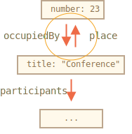

# เมธอด JSON และ toJSON

สมมติว่ามีออบเจ็กต์ที่ซับซ้อนและอยากแปลงให้เป็นสตริง — เพื่อส่งผ่านเครือข่ายหรือเพื่อ log ข้อมูล โดยสตริงนั้นควรครอบคลุมพร็อพเพอร์ตี้สำคัญทั้งหมดด้วย

วิธีง่ายๆ คือเขียน `toString` เองแบบนี้:

```js run
let user = {
  name: "John",
  age: 30,

*!*
  toString() {
    return `{name: "${this.name}", age: ${this.age}}`;
  }
*/!*
};

alert(user); // {name: "John", age: 30}
```

...แต่ระหว่างพัฒนา พร็อพเพอร์ตี้อาจถูกเพิ่ม เปลี่ยนชื่อ หรือลบออกได้ตลอด การอัปเดต `toString` ทุกครั้งจึงน่าเบื่อหน่าย แถมถ้าออบเจ็กต์ซับซ้อนและมีออบเจ็กต์ซ้อนอยู่ข้างใน ก็ต้องจัดการออบเจ็กต์ย่อยพวกนั้นด้วย

โชคดีที่ไม่ต้องเขียนโค้ดพวกนี้เอง — มีวิธีสำเร็จรูปที่ทำให้เราแล้ว

## JSON.stringify

[JSON](https://en.wikipedia.org/wiki/JSON) (JavaScript Object Notation) คือรูปแบบมาตรฐานสำหรับแทนค่าและออบเจ็กต์ กำหนดไว้ในสเปค [RFC 4627](https://tools.ietf.org/html/rfc4627) เดิมทีออกแบบมาเพื่อ JavaScript แต่ทุกวันนี้ภาษาอื่นๆ ก็มีไลบรารีรองรับ JSON เช่นกัน จึงแลกเปลี่ยนข้อมูลได้สะดวกมาก ไม่ว่า client จะเป็น JavaScript และ server จะเป็น Ruby/PHP/Java หรืออะไรก็ตาม

JavaScript มีเมธอดสำหรับจัดการ:

- `JSON.stringify` — แปลงออบเจ็กต์เป็น JSON
- `JSON.parse` — แปลง JSON กลับเป็นออบเจ็กต์

ลองดูตัวอย่างกับข้อมูลนักเรียน:
```js run
let student = {
  name: 'John',
  age: 30,
  isAdmin: false,
  courses: ['html', 'css', 'js'],
  spouse: null
};

*!*
let json = JSON.stringify(student);
*/!*

alert(typeof json); // เราได้สตริงแล้ว!

alert(json);
*!*
/* ออบเจ็กต์ที่เข้ารหัสเป็น JSON:
{
  "name": "John",
  "age": 30,
  "isAdmin": false,
  "courses": ["html", "css", "js"],
  "spouse": null
}
*/
*/!*
```

`JSON.stringify(student)` รับออบเจ็กต์แล้วแปลงเป็นสตริง

สตริง `json` ที่ได้นี้เรียกว่าออบเจ็กต์ที่ *JSON-encoded* หรือ *serialized* หรือ *stringified* หรือ *marshalled* — พร้อมส่งผ่านเครือข่ายหรือเก็บลง data store ได้เลย

ทว่าออบเจ็กต์ที่ JSON-encoded ต่างจาก object literal ตรงๆ อยู่บ้าง:

- สตริงใช้เครื่องหมายคำพูดคู่ ใน JSON ไม่มีคำพูดเดี่ยวหรือ backtick ดังนั้น `'John'` จะกลายเป็น `"John"`
- ชื่อพร็อพเพอร์ตี้ก็ใส่เครื่องหมายคำพูดคู่ด้วย นั่นเป็นกฎบังคับ ดังนั้น `age:30` จะกลายเป็น `"age":30`

`JSON.stringify` ยังใช้กับค่า primitive ได้ด้วย

JSON รองรับชนิดข้อมูลดังนี้:

- ออบเจ็กต์ `{ ... }`
- อาร์เรย์ `[ ... ]`
- Primitive:
    - สตริง,
    - ตัวเลข,
    - บูลีน `true/false`,
    - `null`

ตัวอย่าง:

```js run
// ตัวเลขใน JSON ก็คือตัวเลขธรรมดา
alert( JSON.stringify(1) ) // 1

// สตริงใน JSON ยังคงเป็นสตริง แต่ใส่เครื่องหมายคำพูดคู่
alert( JSON.stringify('test') ) // "test"

alert( JSON.stringify(true) ); // true

alert( JSON.stringify([1, 2, 3]) ); // [1,2,3]
```

JSON เป็นสเปคที่ไม่ขึ้นกับภาษาโปรแกรมใด เก็บได้แต่ข้อมูลล้วนๆ `JSON.stringify` จึงข้ามพร็อพเพอร์ตี้ที่เป็น JavaScript เฉพาะ

โดยเฉพาะ:

- พร็อพเพอร์ตี้ที่เป็นฟังก์ชัน (เมธอด)
- คีย์และค่าที่เป็น Symbol
- พร็อพเพอร์ตี้ที่เก็บค่า `undefined`

```js run
let user = {
  sayHi() { // ถูกข้าม
    alert("Hello");
  },
  [Symbol("id")]: 123, // ถูกข้าม
  something: undefined // ถูกข้าม
};

alert( JSON.stringify(user) ); // {} (ออบเจ็กต์ว่างเปล่า)
```

โดยส่วนใหญ่ก็ไม่มีปัญหา แต่ถ้าอยากควบคุมตรงนี้ เดี๋ยวเราจะดูวิธีกัน

ข้อดีอีกอย่างคือออบเจ็กต์ที่ซ้อนกันก็รองรับและแปลงให้อัตโนมัติ

ตัวอย่าง:

```js run
let meetup = {
  title: "Conference",
*!*
  room: {
    number: 23,
    participants: ["john", "ann"]
  }
*/!*
};

alert( JSON.stringify(meetup) );
/* โครงสร้างทั้งหมดถูกแปลงเป็น string:
{
  "title":"Conference",
  "room":{"number":23,"participants":["john","ann"]},
}
*/
```

แต่มีข้อจำกัดสำคัญคือต้องไม่มี circular reference

ตัวอย่าง:

```js run
let room = {
  number: 23
};

let meetup = {
  title: "Conference",
  participants: ["john", "ann"]
};

meetup.place = room;       // meetup อ้างอิงถึง room
room.occupiedBy = meetup; // room อ้างอิงถึง meetup

*!*
JSON.stringify(meetup); // Error: Converting circular structure to JSON
*/!*
```

การแปลงล้มเหลวเพราะอ้างอิงกันวนไม่รู้จบ: `room.occupiedBy` ชี้ไปที่ `meetup` และ `meetup.place` ก็ชี้กลับมาที่ `room`:




## การกรองและแปลงค่า: replacer

ไวยากรณ์เต็มของ `JSON.stringify` คือ:

```js
let json = JSON.stringify(value[, replacer, space])
```

value
: ค่าที่ต้องการเข้ารหัส

replacer
: อาร์เรย์ของพร็อพเพอร์ตี้ที่ต้องการเข้ารหัส หรือฟังก์ชัน `function(key, value)`

space
: จำนวน space สำหรับการจัดรูปแบบ

ปกติแล้ว `JSON.stringify` ใช้แค่อาร์กิวเมนต์แรก แต่ถ้าต้องการกรองหรือแปลงค่าระหว่างทาง เช่น ตัด circular reference ออก ก็ส่งอาร์กิวเมนต์ที่สองเข้าไปได้

ถ้าส่งเป็นอาร์เรย์ของชื่อพร็อพเพอร์ตี้ จะเข้ารหัสเฉพาะพร็อพเพอร์ตี้ที่ระบุเท่านั้น

ตัวอย่าง:

```js run
let room = {
  number: 23
};

let meetup = {
  title: "Conference",
  participants: [{name: "John"}, {name: "Alice"}],
  place: room // meetup อ้างอิงถึง room
};

room.occupiedBy = meetup; // room อ้างอิงถึง meetup

alert( JSON.stringify(meetup, *!*['title', 'participants']*/!*) );
// {"title":"Conference","participants":[{},{}]}
```

เข้มงวดไปนิดนึง — รายการพร็อพเพอร์ตี้นี้ใช้กับโครงสร้างทั้งหมด เลยทำให้ออบเจ็กต์ใน `participants` ว่างเปล่า เพราะ `name` ไม่ได้อยู่ในรายการ

ลองใส่พร็อพเพอร์ตี้ทุกตัว ยกเว้น `room.occupiedBy` ที่ทำให้เกิด circular reference:

```js run
let room = {
  number: 23
};

let meetup = {
  title: "Conference",
  participants: [{name: "John"}, {name: "Alice"}],
  place: room // meetup อ้างอิงถึง room
};

room.occupiedBy = meetup; // room อ้างอิงถึง meetup

alert( JSON.stringify(meetup, *!*['title', 'participants', 'place', 'name', 'number']*/!*) );
/*
{
  "title":"Conference",
  "participants":[{"name":"John"},{"name":"Alice"}],
  "place":{"number":23}
}
*/
```

ตอนนี้ทุกอย่างยกเว้น `occupiedBy` ก็ serialize ครบแล้ว แต่รายการพร็อพเพอร์ตี้ยาวเกินไปหน่อย

โชคดีที่ส่งฟังก์ชันแทนอาร์เรย์เป็น `replacer` ได้เช่นกัน

ฟังก์ชัน `replacer` จะถูกเรียกทีละคู่ `(key, value)` และควรคืนค่าที่จะใช้แทน หรือคืน `undefined` ถ้าต้องการข้ามพร็อพเพอร์ตี้นั้น

ในตัวอย่างนี้ เราคืน `value` ตามเดิมสำหรับทุกอย่าง ยกเว้น `occupiedBy` ที่คืน `undefined` เพื่อข้ามไป:

```js run
let room = {
  number: 23
};

let meetup = {
  title: "Conference",
  participants: [{name: "John"}, {name: "Alice"}],
  place: room // meetup อ้างอิงถึง room
};

room.occupiedBy = meetup; // room อ้างอิงถึง meetup

alert( JSON.stringify(meetup, function replacer(key, value) {
  alert(`${key}: ${value}`);
  return (key == 'occupiedBy') ? undefined : value;
}));

/* คู่ key:value ที่ส่งให้ replacer:
:             [object Object]
title:        Conference
participants: [object Object],[object Object]
0:            [object Object]
name:         John
1:            [object Object]
name:         Alice
place:        [object Object]
number:       23
occupiedBy: [object Object]
*/
```

สังเกตว่า `replacer` ได้รับทุกคู่ key/value รวมถึงออบเจ็กต์ซ้อนและรายการในอาร์เรย์ด้วย ทำงานแบบ recursive และ `this` ภายใน `replacer` คือออบเจ็กต์ที่มีพร็อพเพอร์ตี้ปัจจุบัน

การเรียกครั้งแรกนั้นพิเศษ — จะใช้ "wrapper object" แบบนี้: `{"": meetup}` นั่นคือคู่ `(key, value)` แรก มี key เป็นสตริงว่าง และ value คือออบเจ็กต์เป้าหมายทั้งหมด จึงเห็นบรรทัดแรกในตัวอย่างเป็น `":[object Object]"` นั่นเอง

แบบนี้ทำให้ `replacer` ทรงพลังมาก — วิเคราะห์ แทนที่ หรือข้ามทั้งออบเจ็กต์ก็ยังได้


## การจัดรูปแบบ: space

อาร์กิวเมนต์ที่สามของ `JSON.stringify(value, replacer, space)` คือจำนวน space สำหรับจัดรูปแบบให้อ่านง่าย

ผลลัพธ์ของ `JSON.stringify` ปกติไม่มีการเยื้องหรือ space เพิ่มเติมเลย — เพียงพอสำหรับส่งผ่านเครือข่าย แต่ถ้าอยากให้อ่านง่ายขึ้น ใส่ `space` เข้าไปได้

เช่น `space = 2` บอกให้ JavaScript แสดงออบเจ็กต์ซ้อนบนหลายบรรทัด โดยเยื้อง 2 space:

```js run
let user = {
  name: "John",
  age: 25,
  roles: {
    isAdmin: false,
    isEditor: true
  }
};

alert(JSON.stringify(user, null, 2));
/* เยื้องด้วย 2 space:
{
  "name": "John",
  "age": 25,
  "roles": {
    "isAdmin": false,
    "isEditor": true
  }
}
*/

/* สำหรับ JSON.stringify(user, null, 4) ผลลัพธ์จะเยื้องมากกว่า:
{
    "name": "John",
    "age": 25,
    "roles": {
        "isAdmin": false,
        "isEditor": true
    }
}
*/
```

อาร์กิวเมนต์ที่สามยังเป็นสตริงได้ด้วย ในกรณีนั้นสตริงนั้นจะใช้เป็นตัวเยื้องแทนจำนวน space

พารามิเตอร์ `space` มีไว้เพื่อ log และแสดงผลให้อ่านง่ายเท่านั้น ไม่มีผลต่อข้อมูล

## toJSON แบบกำหนดเอง

เหมือนกับ `toString` ที่ใช้แปลงเป็นสตริง ออบเจ็กต์สามารถมีเมธอด `toJSON` สำหรับแปลงเป็น JSON ได้ `JSON.stringify` จะเรียกเมธอดนี้อัตโนมัติถ้ามีอยู่

ตัวอย่าง:

```js run
let room = {
  number: 23
};

let meetup = {
  title: "Conference",
  date: new Date(Date.UTC(2017, 0, 1)),
  room
};

alert( JSON.stringify(meetup) );
/*
  {
    "title":"Conference",
*!*
    "date":"2017-01-01T00:00:00.000Z",  // (1)
*/!*
    "room": {"number":23}               // (2)
  }
*/
```

ตรง `(1)` จะเห็นว่า `date` กลายเป็นสตริง — เพราะออบเจ็กต์ Date มีเมธอด `toJSON` ในตัวที่คืนค่าสตริงในรูปแบบนั้นอยู่แล้ว

ทีนี้ลองเพิ่ม `toJSON` แบบกำหนดเองให้ `room` `(2)` ดูบ้าง:

```js run
let room = {
  number: 23,
*!*
  toJSON() {
    return this.number;
  }
*/!*
};

let meetup = {
  title: "Conference",
  room
};

*!*
alert( JSON.stringify(room) ); // 23
*/!*

alert( JSON.stringify(meetup) );
/*
  {
    "title":"Conference",
*!*
    "room": 23
*/!*
  }
*/
```

`toJSON` ทำงานทั้งเมื่อเรียกตรงๆ อย่าง `JSON.stringify(room)` และเมื่อ `room` ซ้อนอยู่ในออบเจ็กต์อื่น


## JSON.parse

หากต้องการ decode สตริง JSON กลับ ใช้เมธอด [JSON.parse](mdn:js/JSON/parse)

ไวยากรณ์:
```js
let value = JSON.parse(str[, reviver]);
```

str
: สตริง JSON ที่ต้องการ parse

reviver
: ฟังก์ชัน function(key,value) ไม่บังคับ — เรียกทีละคู่ `(key, value)` เพื่อแปลงค่าระหว่างการ parse

ตัวอย่าง:

```js run
// อาร์เรย์ที่ถูก stringify
let numbers = "[0, 1, 2, 3]";

numbers = JSON.parse(numbers);

alert( numbers[1] ); // 1
```

หรือถ้าเป็นออบเจ็กต์ซ้อนกัน:

```js run
let userData = '{ "name": "John", "age": 35, "isAdmin": false, "friends": [0,1,2,3] }';

let user = JSON.parse(userData);

alert( user.friends[1] ); // 1
```

JSON ซับซ้อนได้แค่ไหนก็ได้ ซ้อนออบเจ็กต์และอาร์เรย์ลึกกี่ชั้นก็ยังได้ แต่ต้องเป็นไปตามรูปแบบ JSON เสมอ

นี่คือข้อผิดพลาดที่เจอบ่อยเมื่อเขียน JSON ด้วยมือ (บางทีต้องเขียนเองตอน debug):

```js
let json = `{
  *!*name*/!*: "John",                     // ข้อผิดพลาด: ชื่อพร็อพเพอร์ตี้ไม่มีเครื่องหมายคำพูด
  "surname": *!*'Smith'*/!*,               // ข้อผิดพลาด: ใช้คำพูดเดี่ยวสำหรับค่า (ต้องใช้คู่)
  *!*'isAdmin'*/!*: false                  // ข้อผิดพลาด: ใช้คำพูดเดี่ยวสำหรับ key (ต้องใช้คู่)
  "birthday": *!*new Date(2000, 2, 3)*/!*, // ข้อผิดพลาด: ไม่อนุญาต "new" ใช้ได้แค่ค่าพื้นฐาน
  "friends": [0,1,2,3]              // ตรงนี้ถูกต้อง
}`;
```

อีกอย่างคือ JSON ไม่รองรับ comment — ใส่ไปก็จะทำให้ invalid ทันที

มีรูปแบบทางเลือกชื่อ [JSON5](https://json5.org/) ที่อนุญาต unquoted keys, comment และอื่นๆ แต่เป็น library แยกต่างหาก ไม่ได้อยู่ในสเปค JSON มาตรฐาน

ที่ JSON เข้มงวดขนาดนี้ไม่ใช่เพราะผู้พัฒนาขี้เกียจ แต่เพื่อให้สร้างอัลกอริทึม parse ที่ง่าย เชื่อถือได้ และรวดเร็วได้นั่นเอง

## การใช้ reviver

สมมติว่าได้รับออบเจ็กต์ `meetup` ที่ stringify แล้วมาจาก server

ข้อมูลหน้าตาแบบนี้:

```js
// title: (ชื่อการประชุม), date: (วันที่ประชุม)
let str = '{"title":"Conference","date":"2017-11-30T12:00:00.000Z"}';
```

...แล้วเราต้องการ *deserialize* มันกลับเป็นออบเจ็กต์ JavaScript

ลองเรียก `JSON.parse` ดู:

```js run
let str = '{"title":"Conference","date":"2017-11-30T12:00:00.000Z"}';

let meetup = JSON.parse(str);

*!*
alert( meetup.date.getDate() ); // เกิดข้อผิดพลาด!
*/!*
```

อุ๊ย! เกิดข้อผิดพลาด!

`meetup.date` เป็นสตริง ไม่ใช่ออบเจ็กต์ `Date` — `JSON.parse` ไม่มีทางรู้เองว่าต้องแปลงสตริงนั้นเป็น `Date`

แก้ได้โดยส่งฟังก์ชัน reviver เป็นอาร์กิวเมนต์ที่สอง โดยคืนทุกอย่างตามเดิม ยกเว้น `date` ที่แปลงเป็น `Date` ก่อน:

```js run
let str = '{"title":"Conference","date":"2017-11-30T12:00:00.000Z"}';

*!*
let meetup = JSON.parse(str, function(key, value) {
  if (key == 'date') return new Date(value);
  return value;
});
*/!*

alert( meetup.date.getDate() ); // ทำงานได้แล้ว!
```

วิธีนี้ใช้ได้กับออบเจ็กต์ซ้อนกันด้วยเช่นกัน:

```js run
let schedule = `{
  "meetups": [
    {"title":"Conference","date":"2017-11-30T12:00:00.000Z"},
    {"title":"Birthday","date":"2017-04-18T12:00:00.000Z"}
  ]
}`;

schedule = JSON.parse(schedule, function(key, value) {
  if (key == 'date') return new Date(value);
  return value;
});

*!*
alert( schedule.meetups[1].date.getDate() ); // ทำงานได้!
*/!*
```


## สรุป

- JSON คือรูปแบบข้อมูลมาตรฐานที่มีไลบรารีรองรับในเกือบทุกภาษา
- JSON รองรับออบเจ็กต์ธรรมดา อาร์เรย์ สตริง ตัวเลข บูลีน และ `null`
- JavaScript มีเมธอด [JSON.stringify](mdn:js/JSON/stringify) สำหรับ serialize และ [JSON.parse](mdn:js/JSON/parse) สำหรับ deserialize
- ทั้งสองเมธอดรองรับฟังก์ชัน transformer สำหรับอ่าน/เขียนแบบ custom ได้
- ถ้าออบเจ็กต์มีเมธอด `toJSON` ให้ `JSON.stringify` จะเรียกเมธอดนั้นอัตโนมัติ
