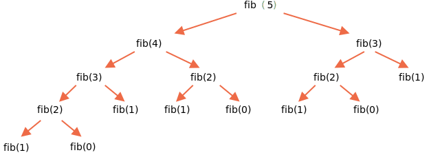

วิธีแรกที่ลองได้คือแบบเรียกซ้ำ

ตัวเลขฟีโบนักชีถูกนิยามแบบเรียกซ้ำอยู่แล้ว:

```js run
function fib(n) {
  return n <= 1 ? n : fib(n - 1) + fib(n - 2);
}

alert( fib(3) ); // 2
alert( fib(7) ); // 13
// fib(77); // จะช้ามาก!
```

...แต่ถ้า `n` มีค่ามาก จะช้ามากๆ เช่น `fib(77)` อาจทำให้ engine ค้างเลย เพราะกิน CPU ไปหมด

ที่เป็นแบบนี้เพราะฟังก์ชันเรียกซ้อนมากเกินไป ค่าเดิมๆ ถูกคำนวณซ้ำแล้วซ้ำอีก

ลองดูส่วนหนึ่งของการคำนวณ `fib(5)`:

```js no-beautify
...
fib(5) = fib(4) + fib(3)
fib(4) = fib(3) + fib(2)
...
```

จะเห็นว่าค่า `fib(3)` ถูกใช้ทั้งใน `fib(5)` และ `fib(4)` ดังนั้น `fib(3)` จะถูกเรียกและคำนวณซ้ำสองครั้งโดยอิสระต่อกัน

นี่คือต้นไม้การเรียกซ้ำทั้งหมด:



เห็นชัดเลยว่า `fib(3)` ถูกคำนวณสองครั้ง และ `fib(2)` ถูกคำนวณสามครั้ง จำนวนการคำนวณทั้งหมดเพิ่มขึ้นเร็วกว่า `n` มาก จนมหาศาลแม้แค่ `n=77`

เราแก้ปัญหาได้โดยจำค่าที่คำนวณไปแล้ว: ถ้า `fib(3)` คำนวณแล้วครั้งหนึ่ง ก็นำค่ากลับมาใช้ได้เลยในการคำนวณครั้งถัดไป

อีกทางเลือกหนึ่งคือเลิกใช้การเรียกซ้ำ แล้วใช้อัลกอริทึมแบบลูปแทนเลย

แทนที่จะเริ่มจาก `n` แล้วลดลง เราเริ่มจาก `1` กับ `2` แล้วหา `fib(3)` จากผลรวมของสองตัว จากนั้นหา `fib(4)` จากผลรวมของสองค่าก่อนหน้า แล้วก็ `fib(5)` ไล่ขึ้นไปเรื่อยๆ จนถึงค่าที่ต้องการ ในแต่ละรอบต้องจำแค่สองค่าก่อนหน้า

รายละเอียดขั้นตอนของอัลกอริทึมใหม่:

จุดเริ่มต้น:

```js
// a = fib(1), b = fib(2) ค่าเหล่านี้เท่ากับ 1 ตามนิยาม
let a = 1, b = 1;

// หา c = fib(3) จากผลรวม
let c = a + b;

/* ตอนนี้เรามี fib(1), fib(2), fib(3)
a  b  c
1, 1, 2
*/
```

ต่อไปเราต้องการ `fib(4) = fib(2) + fib(3)`

เลื่อนตัวแปร: `a,b` จะรับค่า `fib(2),fib(3)` แล้ว `c` จะเป็นผลรวม:

```js no-beautify
a = b; // ตอนนี้ a = fib(2)
b = c; // ตอนนี้ b = fib(3)
c = a + b; // c = fib(4)

/* ตอนนี้ลำดับเป็น:
   a  b  c
1, 1, 2, 3
*/
```

ขั้นตอนถัดไปก็ได้ตัวเลขในลำดับอีกตัว:

```js no-beautify
a = b; // ตอนนี้ a = fib(3)
b = c; // ตอนนี้ b = fib(4)
c = a + b; // c = fib(5)

/* ตอนนี้ลำดับเป็น (เพิ่มอีกหนึ่งตัว):
      a  b  c
1, 1, 2, 3, 5
*/
```

...ทำไปเรื่อยๆ จนได้ค่าที่ต้องการ วิธีนี้เร็วกว่าการเรียกซ้ำมาก และไม่มีการคำนวณซ้ำ

โค้ดเต็ม:

```js run
function fib(n) {
  let a = 1;
  let b = 1;
  for (let i = 3; i <= n; i++) {
    let c = a + b;
    a = b;
    b = c;
  }
  return b;
}

alert( fib(3) ); // 2
alert( fib(7) ); // 13
alert( fib(77) ); // 5527939700884757
```

ลูปเริ่มที่ `i=3` เพราะค่าแรกและค่าที่สองของลำดับถูกกำหนดไว้แล้วในตัวแปร `a=1`, `b=1`

วิธีนี้เรียกว่า [dynamic programming แบบ bottom-up](https://en.wikipedia.org/wiki/Dynamic_programming)
