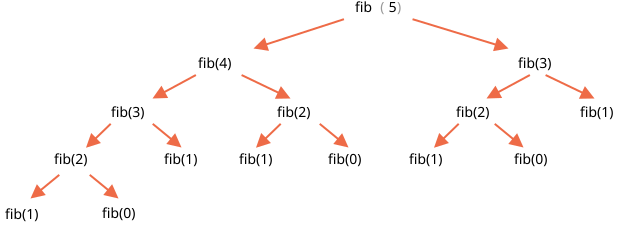

วิธีแรกที่เราอาจนึกถึงคือการเรียกซ้ำ (recursion)

นิยามของจำนวนฟีโบนักชี (Fibonacci numbers) อ้างถึงสองจำนวนก่อนหน้าอยู่แล้ว จึงเขียนฟังก์ชัน (function) ตามนิยามได้ดังนี้:

```js run
function fib(n) {
  return n <= 1 ? n : fib(n - 1) + fib(n - 2);
}

alert( fib(3) ); // 2
alert( fib(7) ); // 13
// fib(77); // จะช้ามาก!
```

แต่เมื่อ `n` มีค่ามาก วิธีนี้จะใช้เวลานานมาก เช่น `fib(77)` อาจทำให้โปรแกรมไม่ตอบสนองอยู่นาน เพราะต้องใช้เวลาประมวลผลจำนวนมาก

สาเหตุคือฟังก์ชันเรียกตัวเองหลายครั้ง และคำนวณหาค่าเดิมซ้ำไปซ้ำมา

ลองดูส่วนหนึ่งของการคำนวณ `fib(5)`:

```js no-beautify
...
fib(5) = fib(4) + fib(3)
fib(4) = fib(3) + fib(2)
...
```

ทั้ง `fib(5)` และ `fib(4)` ต่างก็ต้องใช้ค่า `fib(3)` โค้ดนี้จึงเรียก `fib(3)` สองครั้ง และคำนวณใหม่ตั้งแต่ต้นทุกครั้ง

ลองดูการเรียกทั้งหมดในแผนภาพต้นไม้ (tree):



จะเห็นว่า `fib(3)` ถูกคำนวณสองครั้ง และ `fib(2)` ถูกคำนวณสามครั้ง ยิ่ง `n` เพิ่มขึ้น จำนวนครั้งที่ต้องคำนวณยิ่งเพิ่มเร็วกว่า `n` มาก แม้ `n=77` ก็ต้องคำนวณเป็นจำนวนมหาศาลแล้ว

ทางแก้หนึ่งคือเก็บผลที่คำนวณแล้วไว้ เช่น เมื่อได้ค่า `fib(3)` แล้ว ครั้งต่อไปที่ต้องใช้ค่านี้ก็นำผลเดิมมาใช้ได้เลย

อีกทางเลือกคือเปลี่ยนวิธีคำนวณหรืออัลกอริทึม (algorithm) มาใช้ลูป (loop)

แทนที่จะเริ่มจากลำดับที่ `n` แล้วย้อนลงไป เราเริ่มจาก `fib(1)` กับ `fib(2)` ซึ่งมีค่า `1` ทั้งคู่ นำมาบวกกันเพื่อหา `fib(3)` แล้วใช้สองค่าล่าสุดหา `fib(4)` และ `fib(5)` ต่อไปจนถึงลำดับที่ต้องการ แต่ละรอบจึงต้องจำเพียงสองค่าก่อนหน้า

ลองไล่การทำงานของวิธีนี้ทีละขั้น

จุดเริ่มต้น:

```js
// a = fib(1), b = fib(2) ค่าเหล่านี้เท่ากับ 1 ตามนิยาม
let a = 1, b = 1;

// หา c = fib(3) จากผลรวม
let c = a + b;

/* ตอนนี้เรามี fib(1), fib(2), fib(3)
a  b  c
1, 1, 2
*/
```

ต่อไปเราต้องการ `fib(4) = fib(2) + fib(3)`

ให้ตัวแปร (variable) `a` กับ `b` เปลี่ยนไปเก็บ `fib(2)` กับ `fib(3)` ตามลำดับ แล้วคำนวณผลรวมใหม่ไว้ใน `c`:

```js no-beautify
a = b; // ตอนนี้ a = fib(2)
b = c; // ตอนนี้ b = fib(3)
c = a + b; // c = fib(4)

/* ตอนนี้ลำดับเป็น:
   a  b  c
1, 1, 2, 3
*/
```

ทำแบบเดิมอีกครั้งก็จะได้จำนวนถัดไปในลำดับ:

```js no-beautify
a = b; // ตอนนี้ a = fib(3)
b = c; // ตอนนี้ b = fib(4)
c = a + b; // c = fib(5)

/* ตอนนี้ลำดับเป็น (เพิ่มอีกหนึ่งตัว):
      a  b  c
1, 1, 2, 3, 5
*/
```

ทำต่อไปจนถึงลำดับที่ต้องการ วิธีนี้ไม่มีการคำนวณค่าเดิมซ้ำ จึงเร็วกว่าการเรียกซ้ำตามนิยามข้างต้นมาก

โค้ดเต็ม:

```js run
function fib(n) {
  let a = 1;
  let b = 1;
  for (let i = 3; i <= n; i++) {
    let c = a + b;
    a = b;
    b = c;
  }
  return b;
}

alert( fib(3) ); // 2
alert( fib(7) ); // 13
alert( fib(77) ); // 5527939700884757
```

ลูปเริ่มที่ `i=3` เพราะเรากำหนดสองค่าแรกของลำดับไว้แล้วด้วย `a=1` และ `b=1`

วิธีคำนวณจากค่าลำดับต้น ๆ ขึ้นไปแบบนี้เรียกว่า [dynamic programming แบบ bottom-up](https://en.wikipedia.org/wiki/Dynamic_programming)
