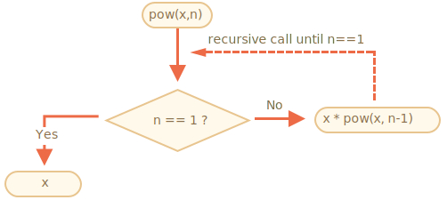
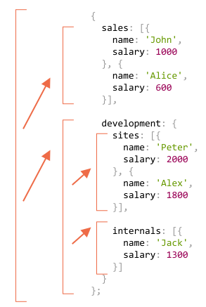
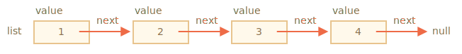
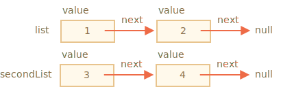
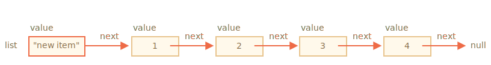
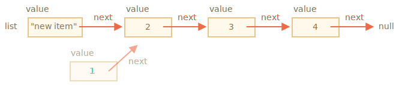

# การเรียกซ้ำ (Recursion) และสแต็ก

กลับมาศึกษาเรื่องฟังก์ชันกันต่อ คราวนี้เราจะเจาะลึกมากขึ้น

หัวข้อแรกที่เราจะพูดถึงคือ *การเรียกซ้ำ (recursion)*

ถ้าเขียนโปรแกรมมาบ้างแล้ว อาจจะคุ้นเคยกับเรื่องนี้อยู่ ข้ามบทนี้ไปได้เลย

การเรียกซ้ำเป็นรูปแบบการเขียนโปรแกรมที่มีประโยชน์เวลาที่โจทย์สามารถแตกออกเป็นโจทย์ย่อยที่เหมือนกันแต่ง่ายกว่า หรือเวลาที่โจทย์หนึ่งสามารถลดรูปเป็น "การกระทำง่ายๆ + โจทย์เดิมที่เล็กลง" หรืออย่างที่เราจะได้เห็นในบทนี้ ใช้จัดการโครงสร้างข้อมูลบางประเภทได้ดี

ในขั้นตอนการทำงานของฟังก์ชัน อาจมีการเรียกฟังก์ชันอื่นๆ อีกหลายตัว กรณีพิเศษอย่างหนึ่งก็คือเมื่อฟังก์ชัน *เรียกตัวเอง* นั่นแหละที่เราเรียกว่า *การเรียกซ้ำ (recursion)*

## สองวิธีคิด

เริ่มจากเรื่องง่ายๆ กันก่อน -- มาเขียนฟังก์ชัน `pow(x, n)` ที่ยกกำลัง `x` ด้วยจำนวนเต็มบวก `n` พูดง่ายๆ ก็คือ คูณ `x` ด้วยตัวเอง `n` ครั้ง

```js
pow(2, 2) = 4
pow(2, 3) = 8
pow(2, 4) = 16
```

มีสองวิธีในการเขียน

1. คิดแบบวนลูป: ใช้ `for` loop

    ```js run
    function pow(x, n) {
      let result = 1;

      // คูณ result ด้วย x จำนวน n ครั้งในลูป
      for (let i = 0; i < n; i++) {
        result *= x;
      }

      return result;
    }

    alert( pow(2, 3) ); // 8
    ```

2. คิดแบบเรียกซ้ำ: ลดรูปโจทย์แล้วเรียกตัวเอง

    ```js run
    function pow(x, n) {
      if (n == 1) {
        return x;
      } else {
        return x * pow(x, n - 1);
      }
    }

    alert( pow(2, 3) ); // 8
    ```

สังเกตว่าวิธีเรียกซ้ำนั้นแตกต่างจากวิธีแรกโดยสิ้นเชิง

เมื่อเรียก `pow(x, n)` การทำงานจะแยกออกเป็นสองทาง:

```js
              if n==1  = x
             /
pow(x, n) =
             \
              else     = x * pow(x, n - 1)
```

1. ถ้า `n == 1` ก็ง่ายเลย เราเรียกกรณีนี้ว่า *ฐานของการเรียกซ้ำ (base of recursion)* เพราะให้ผลลัพธ์ทันที: `pow(x, 1)` เท่ากับ `x`
2. กรณีอื่น เราสามารถเขียน `pow(x, n)` ในรูป `x * pow(x, n - 1)` ได้ ในทางคณิตศาสตร์คือ <code>x<sup>n</sup> = x * x<sup>n-1</sup></code> ตรงนี้เรียกว่า *ขั้นตอนการเรียกซ้ำ (recursive step)* — เราแปลงโจทย์ให้ง่ายลงโดยเหลือแค่การคูณด้วย `x` บวกกับการเรียก `pow` ที่ `n` ลดลง แล้วก็ลดลงเรื่อยๆ จนกว่า `n` จะถึง `1`

พูดอีกอย่างก็คือ `pow` *เรียกตัวเองซ้ำไปเรื่อยๆ* จนกว่า `n == 1`




ยกตัวอย่าง การคำนวณ `pow(2, 4)` ด้วยวิธีเรียกซ้ำจะมีขั้นตอนดังนี้:

1. `pow(2, 4) = 2 * pow(2, 3)`
2. `pow(2, 3) = 2 * pow(2, 2)`
3. `pow(2, 2) = 2 * pow(2, 1)`
4. `pow(2, 1) = 2`

การเรียกซ้ำจะลดรูปการเรียกฟังก์ชันให้ง่ายลงเรื่อยๆ จนกระทั่งผลลัพธ์ชัดเจน

````smart header="การเรียกซ้ำมักเขียนได้สั้นกว่า"
โค้ดแบบเรียกซ้ำมักสั้นกว่าแบบใช้ลูป

ตรงนี้เราเขียนใหม่ได้โดยใช้ตัวดำเนินการเงื่อนไข `?` แทน `if` ทำให้ `pow(x, n)` กระชับขึ้นแต่ยังอ่านง่าย:

```js run
function pow(x, n) {
  return (n == 1) ? x : (x * pow(x, n - 1));
}
```
````

จำนวนการเรียกซ้อนสูงสุด (รวมการเรียกครั้งแรกด้วย) เรียกว่า *ความลึกของการเรียกซ้ำ (recursion depth)* ในกรณีของเรา จะเท่ากับ `n` พอดี

JavaScript engine จำกัดความลึกของการเรียกซ้ำไว้ โดยทั่วไปเชื่อถือได้ที่ 10000 ชั้น บาง engine รองรับมากกว่านั้น แต่ 100000 ชั้นน่าจะเกินขีดจำกัดของ engine ส่วนใหญ่ มีการปรับแต่งประสิทธิภาพอัตโนมัติที่ช่วยได้ (เรียกว่า "tail calls optimizations") แต่ยังไม่รองรับทุกที่ และใช้ได้เฉพาะกรณีง่ายๆ เท่านั้น

ข้อจำกัดนี้ทำให้ใช้การเรียกซ้ำได้ไม่ทุกกรณี แต่ก็ยังมีประโยชน์อยู่มาก หลายโจทย์ที่ใช้วิธีคิดแบบเรียกซ้ำจะได้โค้ดที่เรียบง่ายและดูแลรักษาง่ายกว่า

## Execution context และสแต็ก

ทีนี้มาดูกันว่าการเรียกซ้ำทำงานอย่างไร เราจะเจาะลึกเข้าไปดูเบื้องหลังของฟังก์ชัน

ข้อมูลเกี่ยวกับการทำงานของฟังก์ชันที่กำลังรันอยู่จะถูกเก็บไว้ใน *execution context*

[Execution context](https://tc39.github.io/ecma262/#sec-execution-contexts) เป็นโครงสร้างข้อมูลภายในที่เก็บรายละเอียดการทำงานของฟังก์ชัน เช่น ตอนนี้ทำงานถึงบรรทัดไหนแล้ว ตัวแปรมีค่าอะไรบ้าง `this` ชี้ไปที่ไหน (ในตัวอย่างนี้ยังไม่ใช้) และรายละเอียดภายในอื่นๆ

การเรียกฟังก์ชันหนึ่งครั้ง จะมี execution context หนึ่งตัวผูกอยู่เสมอ

เมื่อฟังก์ชันเรียกฟังก์ชันซ้อน จะเกิดขั้นตอนดังนี้:

- ฟังก์ชันปัจจุบันถูกพักไว้ก่อน
- Execution context ของฟังก์ชันนั้นจะถูกเก็บไว้ในโครงสร้างข้อมูลพิเศษที่เรียกว่า *execution context stack*
- ฟังก์ชันซ้อนเริ่มทำงาน
- เมื่อทำงานเสร็จ execution context เดิมจะถูกดึงกลับมาจากสแต็ก แล้วฟังก์ชันเดิมก็ทำงานต่อจากจุดที่ค้างไว้

มาดูกันว่าเกิดอะไรขึ้นระหว่างการเรียก `pow(2, 3)`

### pow(2, 3)

ตอนเริ่มเรียก `pow(2, 3)` execution context จะเก็บตัวแปร `x = 2, n = 3` และการทำงานอยู่ที่บรรทัด `1` ของฟังก์ชัน

วาดออกมาเป็นแผนภาพได้แบบนี้:

<ul class="function-execution-context-list">
  <li>
    <span class="function-execution-context">Context: { x: 2, n: 3, at line 1 }</span>
    <span class="function-execution-context-call">pow(2, 3)</span>
  </li>
</ul>

นี่คือจุดที่ฟังก์ชันเริ่มทำงาน เงื่อนไข `n == 1` เป็นเท็จ จึงเข้าสู่สาขาที่สองของ `if`:

```js run
function pow(x, n) {
  if (n == 1) {
    return x;
  } else {
*!*
    return x * pow(x, n - 1);
*/!*
  }
}

alert( pow(2, 3) );
```


ตัวแปรยังเหมือนเดิม แต่บรรทัดเปลี่ยนไป ตอนนี้ context เป็นแบบนี้:

<ul class="function-execution-context-list">
  <li>
    <span class="function-execution-context">Context: { x: 2, n: 3, at line 5 }</span>
    <span class="function-execution-context-call">pow(2, 3)</span>
  </li>
</ul>

ในการคำนวณ `x * pow(x, n - 1)` เราต้องเรียก `pow` ซ้อนด้วยอาร์กิวเมนต์ใหม่ `pow(2, 2)`

### pow(2, 2)

ก่อนเรียกฟังก์ชันซ้อน JavaScript จะจำ execution context ปัจจุบันไว้ใน *execution context stack*

ตรงนี้เราเรียกฟังก์ชัน `pow` ตัวเดิม แต่ไม่ต่างจากการเรียกฟังก์ชันอื่นเลย ขั้นตอนเหมือนกันหมดสำหรับทุกฟังก์ชัน:

1. Context ปัจจุบันถูก "จดจำ" ไว้บนสุดของสแต็ก
2. สร้าง context ใหม่สำหรับการเรียกซ้อน
3. เมื่อการเรียกซ้อนเสร็จ -- context เดิมจะถูกดึงออกจากสแต็ก แล้วทำงานต่อ

นี่คือ context stack เมื่อเข้าสู่การเรียก `pow(2, 2)`:

<ul class="function-execution-context-list">
  <li>
    <span class="function-execution-context">Context: { x: 2, n: 2, at line 1 }</span>
    <span class="function-execution-context-call">pow(2, 2)</span>
  </li>
  <li>
    <span class="function-execution-context">Context: { x: 2, n: 3, at line 5 }</span>
    <span class="function-execution-context-call">pow(2, 3)</span>
  </li>
</ul>

Execution context ปัจจุบัน (ตัวใหม่) อยู่บนสุด (ตัวหนา) ส่วน context ที่เก็บไว้ก่อนหน้าอยู่ข้างล่าง

เมื่อการเรียกซ้อนเสร็จ เราสามารถกลับไปทำงานต่อใน context เดิมได้ง่ายๆ เพราะ context เก็บทั้งตัวแปรและตำแหน่งที่ค้างไว้

```smart
ในภาพเราใช้คำว่า "บรรทัด" (line) เพราะตัวอย่างของเรามีการเรียกซ้อนแค่ครั้งเดียวต่อบรรทัด แต่โดยทั่วไปบรรทัดเดียวอาจมีการเรียกซ้อนหลายครั้ง เช่น `pow(…) + pow(…) + somethingElse(…)`

พูดให้ถูกต้องกว่าก็คือ การทำงานจะกลับมาทำต่อ "ทันทีหลังจากการเรียกซ้อนเสร็จ"
```

### pow(2, 1)

กระบวนการเดิมซ้ำอีกครั้ง: เรียกซ้อนที่บรรทัด `5` ด้วยอาร์กิวเมนต์ `x=2`, `n=1`

สร้าง execution context ใหม่ ส่วนตัวก่อนหน้าถูกดันไปไว้บนสแต็ก:

<ul class="function-execution-context-list">
  <li>
    <span class="function-execution-context">Context: { x: 2, n: 1, at line 1 }</span>
    <span class="function-execution-context-call">pow(2, 1)</span>
  </li>
  <li>
    <span class="function-execution-context">Context: { x: 2, n: 2, at line 5 }</span>
    <span class="function-execution-context-call">pow(2, 2)</span>
  </li>
  <li>
    <span class="function-execution-context">Context: { x: 2, n: 3, at line 5 }</span>
    <span class="function-execution-context-call">pow(2, 3)</span>
  </li>
</ul>

ตอนนี้มี context เก่าอยู่ 2 ตัว และอีก 1 ตัวที่กำลังทำงานอยู่คือ `pow(2, 1)`

### ขาออก (The exit)

ระหว่างที่ `pow(2, 1)` ทำงาน คราวนี้ต่างจากก่อนหน้า เงื่อนไข `n == 1` เป็นจริง จึงเข้าสู่สาขาแรกของ `if`:

```js
function pow(x, n) {
  if (n == 1) {
*!*
    return x;
*/!*
  } else {
    return x * pow(x, n - 1);
  }
}
```

ไม่มีการเรียกซ้อนอีกแล้ว ฟังก์ชันจึงทำงานเสร็จและคืนค่า `2`

เมื่อฟังก์ชันทำงานเสร็จ execution context ของมันก็ไม่จำเป็นอีกต่อไป จึงถูกลบออกจากหน่วยความจำ แล้ว context ก่อนหน้าจะถูกดึงกลับมาจากสแต็ก:


<ul class="function-execution-context-list">
  <li>
    <span class="function-execution-context">Context: { x: 2, n: 2, at line 5 }</span>
    <span class="function-execution-context-call">pow(2, 2)</span>
  </li>
  <li>
    <span class="function-execution-context">Context: { x: 2, n: 3, at line 5 }</span>
    <span class="function-execution-context-call">pow(2, 3)</span>
  </li>
</ul>

`pow(2, 2)` กลับมาทำงานต่อ ตอนนี้ได้ผลลัพธ์จากการเรียก `pow(2, 1)` แล้ว จึงคำนวณ `x * pow(x, n - 1)` ได้ ซึ่งคืนค่า `4`

จากนั้น context ก่อนหน้าถูกดึงกลับมา:

<ul class="function-execution-context-list">
  <li>
    <span class="function-execution-context">Context: { x: 2, n: 3, at line 5 }</span>
    <span class="function-execution-context-call">pow(2, 3)</span>
  </li>
</ul>

เมื่อทำงานเสร็จ เราได้ผลลัพธ์ `pow(2, 3) = 8`

ความลึกของการเรียกซ้ำในกรณีนี้คือ **3**

จากภาพประกอบข้างต้นจะเห็นว่า ความลึกของการเรียกซ้ำเท่ากับจำนวน context สูงสุดในสแต็ก

สังเกตเรื่องการใช้หน่วยความจำด้วย แต่ละ context ต้องใช้หน่วยความจำ ในกรณีของเรา การยกกำลัง `n` ต้องใช้หน่วยความจำสำหรับ `n` context ครบทุกค่าของ `n` ที่ลดลงมา

อัลกอริทึมแบบใช้ลูปประหยัดหน่วยความจำกว่า:

```js
function pow(x, n) {
  let result = 1;

  for (let i = 0; i < n; i++) {
    result *= x;
  }

  return result;
}
```

`pow` แบบใช้ลูปใช้ context เดียว โดยเปลี่ยนค่า `i` กับ `result` ไปเรื่อยๆ ใช้หน่วยความจำน้อย คงที่ และไม่ขึ้นกับค่า `n`

**การเรียกซ้ำทุกแบบสามารถเขียนใหม่เป็นลูปได้ และแบบลูปมักจะมีประสิทธิภาพดีกว่า**

...แต่บางทีการเขียนใหม่เป็นลูปก็ไม่ง่าย โดยเฉพาะเมื่อฟังก์ชันเรียกซ้ำหลายทางตามเงื่อนไขต่างๆ แล้วรวมผลลัพธ์กัน หรือเมื่อการแตกกิ่งซับซ้อน อีกทั้งการปรับแต่งประสิทธิภาพอาจไม่จำเป็นและไม่คุ้มค่ากับความพยายาม

การเรียกซ้ำให้โค้ดที่สั้นกว่า เข้าใจง่ายกว่า และดูแลง่ายกว่า ไม่จำเป็นต้องปรับแต่งประสิทธิภาพทุกจุด สิ่งที่ต้องการจริงๆ คือโค้ดที่ดี นั่นจึงเป็นเหตุผลที่เรานิยมใช้การเรียกซ้ำ

## การท่องข้อมูลแบบเรียกซ้ำ (Recursive traversals)

การเรียกซ้ำมีประโยชน์อีกอย่างหนึ่งคือการท่องข้อมูลแบบเรียกซ้ำ

สมมติว่าเรามีบริษัทแห่งหนึ่ง โครงสร้างพนักงานสามารถแสดงเป็นออบเจ็กต์ได้แบบนี้:

```js
let company = {
  sales: [{
    name: 'John',
    salary: 1000
  }, {
    name: 'Alice',
    salary: 1600
  }],

  development: {
    sites: [{
      name: 'Peter',
      salary: 2000
    }, {
      name: 'Alex',
      salary: 1800
    }],

    internals: [{
      name: 'Jack',
      salary: 1300
    }]
  }
};
```

พูดง่ายๆ ก็คือ บริษัทมีหลายแผนก

- แผนกหนึ่งอาจมีอาร์เรย์ของพนักงาน เช่น แผนก `sales` มีพนักงาน 2 คน คือ John กับ Alice
- หรือแผนกหนึ่งอาจแบ่งออกเป็นแผนกย่อย เช่น `development` มี 2 สาขาคือ `sites` กับ `internals` แต่ละสาขาก็มีพนักงานของตัวเอง
- นอกจากนี้ เมื่อแผนกย่อยเติบโตขึ้น ก็อาจแบ่งออกเป็นแผนกย่อยลงไปอีก (หรือเป็นทีม)

    ยกตัวอย่าง แผนก `sites` ในอนาคตอาจแยกเป็นทีม `siteA` กับ `siteB` แล้วก็อาจแยกออกไปอีก ตรงนี้ยังไม่ได้อยู่ในภาพ แค่ให้จินตนาการไว้

ทีนี้ สมมติเราต้องการฟังก์ชันที่รวมเงินเดือนทั้งหมด จะทำยังไงดี?

ถ้าใช้วิธีวนลูปจะไม่ง่ายเลย เพราะโครงสร้างซับซ้อน ความคิดแรกอาจเป็นการใช้ `for` ลูปวนผ่าน `company` แล้วซ้อนลูปย่อยสำหรับแผนกระดับที่ 1 แต่แล้วก็ต้องซ้อนลูปอีกเพื่อวนพนักงานในแผนกระดับที่ 2 อย่าง `sites`... แล้วก็ต้องซ้อนอีกสำหรับแผนกระดับที่ 3 ที่อาจเกิดขึ้นในอนาคต? ถ้าซ้อนลูป 3-4 ชั้นเพื่อท่องข้อมูลในออบเจ็กต์เดียว โค้ดจะดูรกมาก

ลองใช้การเรียกซ้ำดีกว่า

จะเห็นว่าเมื่อฟังก์ชันรับแผนกมาเพื่อรวมเงินเดือน จะมีสองกรณี:

1. เป็นแผนก "ธรรมดา" ที่มี *อาร์เรย์* ของพนักงาน -- ก็รวมเงินเดือนด้วยลูปง่ายๆ ได้เลย
2. เป็น *ออบเจ็กต์* ที่มีแผนกย่อย `N` แผนก -- ก็เรียกซ้ำ `N` ครั้งเพื่อรวมเงินเดือนของแต่ละแผนกย่อย แล้วนำผลลัพธ์มารวมกัน

กรณีที่ 1 คือฐานของการเรียกซ้ำ เป็นกรณีง่ายๆ เมื่อได้รับอาร์เรย์

กรณีที่ 2 ที่ได้รับออบเจ็กต์คือขั้นตอนการเรียกซ้ำ โจทย์ที่ซับซ้อนจะถูกแตกออกเป็นโจทย์ย่อยตามแผนกต่างๆ ซึ่งอาจแตกย่อยออกไปอีก แต่สุดท้ายก็จะจบที่กรณีที่ (1)

อัลกอริทึมนี้อ่านจากโค้ดน่าจะเข้าใจง่ายกว่า:


```js run
let company = { // ออบเจ็กต์เดิม ย่อให้กระชับ
  sales: [{name: 'John', salary: 1000}, {name: 'Alice', salary: 1600 }],
  development: {
    sites: [{name: 'Peter', salary: 2000}, {name: 'Alex', salary: 1800 }],
    internals: [{name: 'Jack', salary: 1300}]
  }
};

// ฟังก์ชันทำงาน
*!*
function sumSalaries(department) {
  if (Array.isArray(department)) { // กรณีที่ (1)
    return department.reduce((prev, current) => prev + current.salary, 0); // รวมค่าในอาร์เรย์
  } else { // กรณีที่ (2)
    let sum = 0;
    for (let subdep of Object.values(department)) {
      sum += sumSalaries(subdep); // เรียกซ้ำสำหรับแผนกย่อย แล้วรวมผลลัพธ์
    }
    return sum;
  }
}
*/!*

alert(sumSalaries(company)); // 7700
```

โค้ดสั้นและเข้าใจง่ายใช่ไหม? นี่แหละพลังของการเรียกซ้ำ โค้ดนี้ใช้ได้กับแผนกย่อยกี่ระดับก็ได้

นี่คือแผนภาพการเรียก:



หลักการเห็นได้ชัดเลย: เมื่อเจอออบเจ็กต์ `{...}` ก็เรียกซ้ำต่อ ส่วนอาร์เรย์ `[...]` คือ "ใบ" ของต้นไม้การเรียกซ้ำ ซึ่งให้ผลลัพธ์ทันที

สังเกตว่าโค้ดนี้ใช้ฟีเจอร์ที่เราเรียนมาแล้ว:

- เมธอด `arr.reduce` ที่อธิบายไว้ในบท <info:array-methods> สำหรับรวมค่าในอาร์เรย์
- ลูป `for(val of Object.values(obj))` สำหรับวนผ่านค่าของออบเจ็กต์ โดย `Object.values` คืนค่าเป็นอาร์เรย์


## โครงสร้างข้อมูลแบบเรียกซ้ำ (Recursive structures)

โครงสร้างข้อมูลแบบเรียกซ้ำ คือโครงสร้างที่นิยามตัวเองซ้ำในส่วนย่อย

เราเพิ่งเห็นตัวอย่างจากโครงสร้างบริษัทข้างต้น

*แผนก* ของบริษัทอาจเป็น:
- อาร์เรย์ของพนักงาน
- หรือออบเจ็กต์ที่มี *แผนกย่อย* อยู่ภายใน

สำหรับเว็บเดเวลอปเปอร์ มีตัวอย่างที่คุ้นเคยกว่านี้อีก นั่นคือเอกสาร HTML และ XML

ในเอกสาร HTML *แท็ก HTML* หนึ่งตัวอาจมี:
- ข้อความ
- คอมเมนต์ HTML
- *แท็ก HTML* ตัวอื่นๆ (ซึ่งก็อาจมีข้อความ/คอมเมนต์/แท็กอื่นซ้อนลงไปอีก)

นี่ก็เป็นนิยามแบบเรียกซ้ำเช่นกัน

เพื่อให้เข้าใจมากขึ้น เราจะมาดูโครงสร้างแบบเรียกซ้ำอีกตัวหนึ่งชื่อว่า "Linked list" ซึ่งบางกรณีอาจเป็นทางเลือกที่ดีกว่าอาร์เรย์

### Linked list

สมมติเราต้องการเก็บรายการออบเจ็กต์ที่มีลำดับ

ทางเลือกที่นึกถึงก่อนก็คืออาร์เรย์:

```js
let arr = [obj1, obj2, obj3];
```

...แต่อาร์เรย์มีปัญหาอยู่อย่างหนึ่ง การ "ลบสมาชิก" และ "แทรกสมาชิก" นั้นค่อนข้างช้า เช่น `arr.unshift(obj)` ต้องขยับหมายเลขของสมาชิกทุกตัวเพื่อเปิดที่ว่างให้ `obj` ใหม่ ถ้าอาร์เรย์ใหญ่ก็กินเวลามาก `arr.shift()` ก็เช่นกัน

การเปลี่ยนแปลงโครงสร้างที่ไม่ต้องขยับหมายเลขทั้งหมดมีแค่ตัวที่ทำงานกับท้ายอาร์เรย์ คือ `arr.push/pop` ดังนั้น อาร์เรย์อาจช้ามากสำหรับคิวขนาดใหญ่ที่ต้องทำงานกับด้านหน้าบ่อยๆ

ถ้าต้องการแทรก/ลบที่รวดเร็วจริงๆ เราเลือกใช้โครงสร้างข้อมูลอีกแบบที่เรียกว่า [linked list](https://en.wikipedia.org/wiki/Linked_list)

*สมาชิกของ linked list* ถูกนิยามแบบเรียกซ้ำเป็นออบเจ็กต์ที่มี:
- `value` — ค่าที่เก็บไว้
- พร็อพเพอร์ตี้ `next` ที่ชี้ไปยัง *สมาชิกตัวถัดไป* ใน linked list หรือ `null` ถ้าเป็นตัวสุดท้าย

ตัวอย่าง:

```js
let list = {
  value: 1,
  next: {
    value: 2,
    next: {
      value: 3,
      next: {
        value: 4,
        next: null
      }
    }
  }
};
```

แสดงเป็นภาพได้แบบนี้:



อีกวิธีหนึ่งในการสร้าง:

```js no-beautify
let list = { value: 1 };
list.next = { value: 2 };
list.next.next = { value: 3 };
list.next.next.next = { value: 4 };
list.next.next.next.next = null;
```

แบบนี้เห็นชัดเจนขึ้นว่ามีออบเจ็กต์หลายตัว แต่ละตัวมี `value` และ `next` ชี้ไปหาตัวถัดไป ตัวแปร `list` คือออบเจ็กต์แรกในสาย เราสามารถตาม `next` ไปเรื่อยๆ จนถึงสมาชิกตัวไหนก็ได้

Linked list แบ่งออกเป็นหลายส่วนได้ง่าย แล้วเชื่อมกลับทีหลังก็ได้:

```js
let secondList = list.next.next;
list.next.next = null;
```



เชื่อมกลับ:

```js
list.next.next = secondList;
```

แน่นอนว่าเราแทรกหรือลบสมาชิกตรงไหนก็ได้

เช่น ถ้าจะเพิ่มค่าใหม่ไว้ข้างหน้า ก็แค่อัปเดตหัวของ list:

```js
let list = { value: 1 };
list.next = { value: 2 };
list.next.next = { value: 3 };
list.next.next.next = { value: 4 };

*!*
// เพิ่มค่าใหม่ไว้ข้างหน้า list
list = { value: "new item", next: list };
*/!*
```



ถ้าจะลบค่าตรงกลาง ก็เปลี่ยน `next` ของตัวก่อนหน้า:

```js
list.next = list.next.next;
```



เราทำให้ `list.next` ข้ามจากค่า `1` ไปที่ค่า `2` ค่า `1` ถูกตัดออกจากสายแล้ว ถ้าไม่มีที่ไหนอ้างอิงถึงอีก ก็จะถูกลบออกจากหน่วยความจำโดยอัตโนมัติ

ต่างจากอาร์เรย์ตรงที่ไม่ต้องขยับหมายเลขทั้งหมด เราจัดเรียงสมาชิกใหม่ได้ง่ายๆ

แน่นอนว่า linked list ไม่ได้ดีกว่าอาร์เรย์เสมอไป ไม่อย่างนั้นทุกคนคงใช้แต่ list กันแล้ว

ข้อเสียหลักคือเราเข้าถึงสมาชิกตามหมายเลขลำดับไม่ได้ง่ายๆ ถ้าเป็นอาร์เรย์ก็แค่ `arr[n]` ได้เลย แต่ใน linked list ต้องเริ่มจากตัวแรกแล้วตาม `next` ไป `N` ครั้งถึงจะได้สมาชิกตัวที่ N

...แต่ไม่ใช่ว่าเราต้องการแบบนั้นเสมอไป เช่น เมื่อต้องการคิว (queue) หรือ [deque](https://en.wikipedia.org/wiki/Double-ended_queue) ซึ่งเป็นโครงสร้างที่ต้องเพิ่ม/ลบสมาชิกจากทั้งสองด้านได้เร็วมาก แต่ไม่ต้องเข้าถึงตรงกลาง

Linked list ยังปรับปรุงเพิ่มเติมได้อีก:
- เพิ่มพร็อพเพอร์ตี้ `prev` ควบคู่กับ `next` เพื่อชี้ไปยังสมาชิกก่อนหน้า ให้ย้อนกลับได้ง่าย
- เพิ่มตัวแปรชื่อ `tail` ที่ชี้ไปยังสมาชิกตัวสุดท้ายของ list (และอัปเดตเมื่อเพิ่ม/ลบสมาชิกจากท้าย list)
- ...โครงสร้างข้อมูลปรับเปลี่ยนได้ตามความต้องการ

## สรุป

คำศัพท์:
- *การเรียกซ้ำ (Recursion)* คือศัพท์ทางโปรแกรมมิ่งที่หมายถึงฟังก์ชันเรียกตัวเอง ฟังก์ชันแบบเรียกซ้ำใช้แก้โจทย์ได้อย่างกระชับ

    เมื่อฟังก์ชันเรียกตัวเอง เรียกว่า *ขั้นตอนการเรียกซ้ำ (recursion step)* ส่วน *ฐานของการเรียกซ้ำ (basis)* คือกรณีที่อาร์กิวเมนต์ทำให้โจทย์ง่ายพอจนฟังก์ชันไม่ต้องเรียกต่อ

- [โครงสร้างข้อมูลแบบเรียกซ้ำ](https://en.wikipedia.org/wiki/Recursive_data_type) คือโครงสร้างข้อมูลที่นิยามตัวเองได้

    ยกตัวอย่าง linked list สามารถนิยามเป็นโครงสร้างข้อมูลที่ประกอบด้วยออบเจ็กต์ที่อ้างอิงไปยัง list อีกตัว (หรือ null)

    ```js
    list = { value, next -> list }
    ```

    ต้นไม้ (tree) เช่น ต้นไม้ของ HTML elements หรือต้นไม้แผนกในบทนี้ ก็เป็นโครงสร้างแบบเรียกซ้ำโดยธรรมชาติ — แต่ละกิ่งสามารถมีกิ่งย่อยซ้อนลงไปได้อีก

    ฟังก์ชันแบบเรียกซ้ำใช้ท่องข้อมูลเหล่านี้ได้ ดังที่เห็นในตัวอย่าง `sumSalary`

ฟังก์ชันแบบเรียกซ้ำทุกตัวสามารถเขียนใหม่เป็นแบบวนลูปได้ และบางครั้งก็จำเป็นเพื่อปรับแต่งประสิทธิภาพ แต่ในหลายๆ โจทย์ วิธีเรียกซ้ำเร็วพอ เขียนง่ายกว่า และดูแลง่ายกว่า
