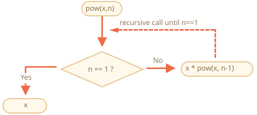
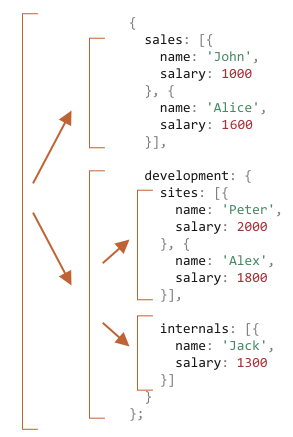
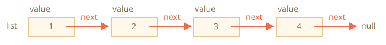
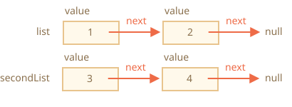
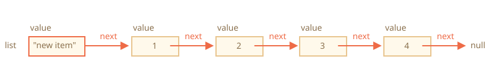
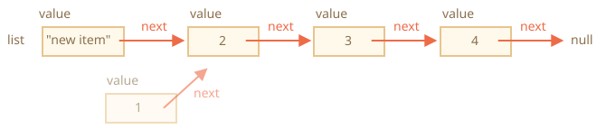

# การเรียกซ้ำ (recursion) และสแต็ก (stack)

กลับมาศึกษาเรื่องฟังก์ชัน (function) กันต่อ คราวนี้เราจะดูการทำงานของฟังก์ชันให้ละเอียดขึ้น

หัวข้อแรกคือ *การเรียกซ้ำ*

ถ้าเคยเขียนโปรแกรมและเข้าใจเรื่องนี้แล้ว จะข้ามบทนี้ไปก็ได้

การเรียกซ้ำเหมาะกับงานที่แบ่งเป็นงานย่อยชนิดเดียวกันได้ โดยแต่ละงานเล็กลงและทำได้ง่ายขึ้น บางงานก็แยกได้เป็นขั้นตอนสั้น ๆ หนึ่งขั้น กับงานเดิมที่เล็กลงอีกหนึ่งงาน นอกจากนี้ การเรียกซ้ำยังช่วยจัดการโครงสร้างข้อมูล (data structure) บางชนิดได้ ซึ่งเราจะได้เห็นตัวอย่างในบทนี้

ระหว่างทำงาน ฟังก์ชันอาจเรียกฟังก์ชันอื่นให้ช่วยทำงานได้ และอาจเรียก *ตัวเอง* ได้ด้วย กรณีหลังนี้เองที่เรียกว่า *การเรียกซ้ำ*

## สองวิธีคิด

ลองเริ่มจากฟังก์ชัน `pow(x, n)` ที่คำนวณ `x` ยกกำลัง `n` โดย `n` เป็นจำนวนเต็มบวก นั่นคือการนำ `x` จำนวน `n` ตัวมาคูณกัน

```js
pow(2, 2) = 4
pow(2, 3) = 8
pow(2, 4) = 16
```

มีสองวิธีในการเขียน

1. คิดแบบทำซ้ำทีละรอบ โดยใช้ลูป (loop) `for`

    ```js run
    function pow(x, n) {
      let result = 1;

      // คูณ result ด้วย x จำนวน n ครั้งในลูป
      for (let i = 0; i < n; i++) {
        result *= x;
      }

      return result;
    }

    alert( pow(2, 3) ); // 8
    ```

2. คิดแบบเรียกซ้ำ โดยลดขนาดโจทย์แล้วเรียกตัวเองให้คำนวณส่วนที่เหลือ

    ```js run
    function pow(x, n) {
      if (n == 1) {
        return x;
      } else {
        return x * pow(x, n - 1);
      }
    }

    alert( pow(2, 3) ); // 8
    ```

ลองดูวิธีเรียกซ้ำให้ละเอียดขึ้น วิธีนี้แบ่งการคำนวณต่างจากลูป

เมื่อเรียก `pow(x, n)` การทำงานจะแยกออกเป็นสองทาง:

```js
              if n==1  = x
             /
pow(x, n) =
             \
              else     = x * pow(x, n - 1)
```

1. ถ้า `n == 1` เราตอบได้ทันทีว่า `pow(x, 1)` เท่ากับ `x` จึงไม่ต้องเรียกตัวเองต่อ กรณีนี้เรียกว่า *ฐานของการเรียกซ้ำ (base of recursion)*
2. ถ้า `n` มากกว่า `1` เราเขียน `pow(x, n)` เป็น `x * pow(x, n - 1)` ได้ ตามสมการ <code>x<sup>n</sup> = x * x<sup>n-1</sup></code> นั่นคือให้ `pow` คำนวณกำลังที่น้อยลงหนึ่งก่อน แล้วนำผลมาคูณกับ `x` เราเรียกการลดขนาดโจทย์แล้วเรียกตัวเองแบบนี้ว่า *ขั้นตอนการเรียกซ้ำ (recursive step)* แต่ละครั้ง `n` จะลดลงเรื่อย ๆ จนถึง `1`

ดังนั้น `pow` จะ *เรียกตัวเองซ้ำ* จนกว่า `n == 1`




ยกตัวอย่าง การคำนวณ `pow(2, 4)` ด้วยวิธีเรียกซ้ำจะมีขั้นตอนดังนี้:

1. `pow(2, 4) = 2 * pow(2, 3)`
2. `pow(2, 3) = 2 * pow(2, 2)`
3. `pow(2, 2) = 2 * pow(2, 1)`
4. `pow(2, 1) = 2`

แต่ละครั้งที่เรียกตัวเอง ฟังก์ชันจะได้โจทย์ที่เล็กลง จนถึงกรณีที่หาคำตอบได้ทันทีโดยไม่ต้องเรียกต่อ

````smart header="การเรียกซ้ำมักเขียนได้สั้นกว่า"
โค้ดแบบเรียกซ้ำมักสั้นกว่าแบบใช้ลูป

ตัวอย่างนี้ใช้ตัวดำเนินการเงื่อนไข (conditional operator) `?` แทน `if` เพื่อเขียน `pow(x, n)` ให้สั้นลงได้ โดยยังเห็นทั้งสองกรณีชัดเจน:

```js run
function pow(x, n) {
  return (n == 1) ? x : (x * pow(x, n - 1));
}
```
````

จำนวนการเรียกฟังก์ชันที่ซ้อนกันมากที่สุด ณ ขณะหนึ่ง โดยนับการเรียกครั้งแรกด้วย เรียกว่า *ความลึกของการเรียกซ้ำ (recursion depth)* สำหรับ `pow` นี้ ความลึกเท่ากับ `n` พอดี

ความลึกที่รองรับขึ้นอยู่กับ JavaScript engine ซึ่งเป็นส่วนที่ประมวลผลโค้ด รวมถึงสภาพแวดล้อมที่ใช้รัน จึงไม่ควรถือว่าเรียกซ้ำได้ถึง 10,000 ชั้นเสมอ หากเรียกซ้อนกันลึกเกินขีดจำกัด โปรแกรมจะเกิดข้อผิดพลาด

บาง engine ลดการใช้สแต็กได้ด้วยวิธีที่เรียกว่า *tail call optimization* แต่ใช้ได้เฉพาะการเรียกที่เข้าเงื่อนไข เช่น ฟังก์ชันใน strict mode ที่คืนค่าจากการเรียกนั้นได้ทันที โดยไม่ต้องคำนวณอะไรต่อ ณ วันที่ 19 กันยายน 2026 เบราว์เซอร์ (browser) ยังไม่ได้รองรับวิธีนี้ทุกตัว และ `pow` ในตัวอย่างก็ใช้ไม่ได้ เพราะต้องรอผลจากการเรียกซ้ำมาคูณกับ `x` ก่อน

แม้จะมีข้อจำกัดเรื่องความลึก การเรียกซ้ำก็ยังใช้แก้โจทย์ได้หลากหลาย และในหลายกรณีช่วยให้โค้ดอ่านเข้าใจและดูแลต่อได้ง่ายขึ้น

## Execution context และสแต็ก

ทีนี้มาดูว่าระหว่างเรียกซ้ำ JavaScript เก็บข้อมูลอะไรไว้ และกลับมาทำงานต่อได้อย่างไร

JavaScript เก็บข้อมูลการทำงานของฟังก์ชันที่กำลังทำงานอยู่ไว้ใน *execution context*

[Execution context](https://tc39.github.io/ecma262/#sec-execution-contexts) เป็นโครงสร้างข้อมูลภายในที่เก็บตำแหน่งที่ฟังก์ชันทำงานอยู่ ค่าของตัวแปร (variable) ค่า `this` และรายละเอียดภายในอื่น ๆ ตัวอย่างในบทนี้ยังไม่ได้ใช้ `this`

การเรียกฟังก์ชันแต่ละครั้งมี execution context ของตัวเองหนึ่งชุด

เมื่อฟังก์ชันหนึ่งเรียกอีกฟังก์ชันซ้อนเข้าไป จะเกิดขั้นตอนดังนี้:

- พักการทำงานของฟังก์ชันปัจจุบันไว้ก่อน
- เก็บ execution context ของฟังก์ชันนั้นไว้ในสแต็กที่เรียกว่า *execution context stack*
- เริ่มทำงานในฟังก์ชันที่เพิ่งเรียก
- เมื่อฟังก์ชันที่เรียกทำงานเสร็จ ก็นำ execution context เดิมกลับมาจากสแต็ก เพื่อให้ฟังก์ชันที่พักไว้ทำงานต่อจากจุดเดิม

มาดูกันว่าเกิดอะไรขึ้นระหว่างการเรียก `pow(2, 3)`

### pow(2, 3)

ตอนเริ่มเรียก `pow(2, 3)` execution context เก็บค่าตัวแปร `x = 2, n = 3` และตำแหน่งการทำงานที่บรรทัด `1` ของฟังก์ชัน

วาดออกมาเป็นแผนภาพได้แบบนี้:

<ul class="function-execution-context-list">
  <li>
    <span class="function-execution-context">Context: { x: 2, n: 3, บรรทัด 1 }</span>
    <span class="function-execution-context-call">pow(2, 3)</span>
  </li>
</ul>

เมื่อฟังก์ชันเริ่มทำงาน เงื่อนไข `n == 1` เป็นเท็จ จึงไปทำงานในส่วน `else`:

```js run
function pow(x, n) {
  if (n == 1) {
    return x;
  } else {
*!*
    return x * pow(x, n - 1);
*/!*
  }
}

alert( pow(2, 3) );
```


ค่าตัวแปรยังเหมือนเดิม แต่ตำแหน่งการทำงานเปลี่ยนเป็นบรรทัด `5` ตอนนี้ context เป็นแบบนี้:

<ul class="function-execution-context-list">
  <li>
    <span class="function-execution-context">Context: { x: 2, n: 3, บรรทัด 5 }</span>
    <span class="function-execution-context-call">pow(2, 3)</span>
  </li>
</ul>

ก่อนจะคำนวณ `x * pow(x, n - 1)` ได้ ต้องเรียก `pow` ซ้อนอีกครั้ง โดยส่งอาร์กิวเมนต์ (argument) เป็น `2` กับ `2` นั่นคือ `pow(2, 2)`

### pow(2, 2)

ก่อนเรียกฟังก์ชันซ้อน JavaScript จะจำ execution context ปัจจุบันไว้ใน *execution context stack*

แม้ในตัวอย่างนี้จะเรียก `pow` ตัวเดิม แต่การจัดการ context ก็เหมือนกับการเรียกฟังก์ชันอื่น:

1. เก็บ context ปัจจุบันไว้บนสุดของสแต็ก
2. สร้าง context ใหม่สำหรับการเรียกซ้อน
3. เมื่อการเรียกซ้อนเสร็จ นำ context เดิมออกจากสแต็กแล้วกลับไปทำงานต่อ

นี่คือ context stack เมื่อเข้าสู่การเรียก `pow(2, 2)`:

<ul class="function-execution-context-list">
  <li>
    <span class="function-execution-context">Context: { x: 2, n: 2, บรรทัด 1 }</span>
    <span class="function-execution-context-call">pow(2, 2)</span>
  </li>
  <li>
    <span class="function-execution-context">Context: { x: 2, n: 3, บรรทัด 5 }</span>
    <span class="function-execution-context-call">pow(2, 3)</span>
  </li>
</ul>

ในแผนภาพ execution context ใหม่ที่กำลังทำงานอยู่แสดงเป็นตัวหนาด้านบน ส่วน context ของการเรียกก่อนหน้าอยู่ด้านล่าง

เมื่อการเรียกซ้อนเสร็จ ฟังก์ชันก่อนหน้าจึงทำงานต่อได้ เพราะ context เก็บทั้งค่าตัวแปรและตำแหน่งที่พักไว้

```smart
แผนภาพระบุตำแหน่งเป็น "บรรทัด" เพราะตัวอย่างนี้มีการเรียกฟังก์ชันซ้อนเพียงครั้งเดียวในแต่ละบรรทัด แต่โค้ดหนึ่งบรรทัดอาจเรียกหลายฟังก์ชันได้ เช่น `pow(…) + pow(…) + somethingElse(…)`

ถ้าจะระบุให้ตรงกว่านั้น ฟังก์ชันจะกลับมาทำงานต่อ "ที่ตำแหน่งถัดจากการเรียกซ้อนที่เพิ่งเสร็จ"
```

### pow(2, 1)

ขั้นตอนเดิมเกิดขึ้นอีกครั้งที่บรรทัด `5` คราวนี้เรียกซ้อนด้วยอาร์กิวเมนต์ `x=2`, `n=1`

JavaScript เก็บ context ก่อนหน้าไว้ในสแต็ก แล้วสร้าง execution context ใหม่สำหรับ `pow(2, 1)`:

<ul class="function-execution-context-list">
  <li>
    <span class="function-execution-context">Context: { x: 2, n: 1, บรรทัด 1 }</span>
    <span class="function-execution-context-call">pow(2, 1)</span>
  </li>
  <li>
    <span class="function-execution-context">Context: { x: 2, n: 2, บรรทัด 5 }</span>
    <span class="function-execution-context-call">pow(2, 2)</span>
  </li>
  <li>
    <span class="function-execution-context">Context: { x: 2, n: 3, บรรทัด 5 }</span>
    <span class="function-execution-context-call">pow(2, 3)</span>
  </li>
</ul>

ตอนนี้มี context ของการเรียกที่พักไว้ 2 ชุด และ context ที่กำลังทำงานอีก 1 ชุด ซึ่งเป็นของ `pow(2, 1)`

### คืนค่าและกลับไปทำงานต่อ

เมื่อ `pow(2, 1)` ทำงาน เงื่อนไข `n == 1` เป็นจริง จึงทำงานในส่วนแรกของ `if`:

```js
function pow(x, n) {
  if (n == 1) {
*!*
    return x;
*/!*
  } else {
    return x * pow(x, n - 1);
  }
}
```

ไม่มีการเรียกซ้อนอีกแล้ว ฟังก์ชันจึงทำงานเสร็จและคืนค่า `2`

เมื่อฟังก์ชันทำงานเสร็จ JavaScript ก็เลิกใช้ execution context ของการเรียกครั้งนี้ แล้วกลับไปใช้ context ก่อนหน้าที่อยู่บนสุดของสแต็ก:


<ul class="function-execution-context-list">
  <li>
    <span class="function-execution-context">Context: { x: 2, n: 2, บรรทัด 5 }</span>
    <span class="function-execution-context-call">pow(2, 2)</span>
  </li>
  <li>
    <span class="function-execution-context">Context: { x: 2, n: 3, บรรทัด 5 }</span>
    <span class="function-execution-context-call">pow(2, 3)</span>
  </li>
</ul>

`pow(2, 2)` กลับมาทำงานต่อ โดยได้ค่า `2` จาก `pow(2, 1)` แล้ว จึงคำนวณ `x * pow(x, n - 1)` เป็น `2 * 2` และคืนค่า `4`

จากนั้น context ก่อนหน้าถูกดึงกลับมา:

<ul class="function-execution-context-list">
  <li>
    <span class="function-execution-context">Context: { x: 2, n: 3, บรรทัด 5 }</span>
    <span class="function-execution-context-call">pow(2, 3)</span>
  </li>
</ul>

`pow(2, 3)` นำค่า `4` ที่ได้มาคูณกับ `2` แล้วคืนค่า `8` เป็นคำตอบสุดท้าย

ความลึกของการเรียกซ้ำในกรณีนี้คือ **3**

จากภาพประกอบข้างต้นจะเห็นว่า ความลึกของการเรียกซ้ำเท่ากับจำนวน context สูงสุดในสแต็ก

แต่ละ context ต้องใช้หน่วยความจำด้วย ในตัวอย่างนี้ การยกกำลัง `n` ต้องเก็บ context ไว้พร้อมกันมากที่สุด `n` ชุด ตามค่า `n` ที่ลดลงในการเรียกแต่ละครั้ง

วิธีคำนวณหรืออัลกอริทึม (algorithm) แบบใช้ลูปประหยัดหน่วยความจำกว่า:

```js
function pow(x, n) {
  let result = 1;

  for (let i = 0; i < n; i++) {
    result *= x;
  }

  return result;
}
```

`pow` แบบใช้ลูปใช้ context เพียงชุดเดียว แล้วเปลี่ยนค่า `i` กับ `result` ในแต่ละรอบ หน่วยความจำที่ใช้จึงมีปริมาณน้อยและคงที่ ไม่เพิ่มตาม `n`

**โค้ดแบบเรียกซ้ำทุกแบบเขียนใหม่เป็นลูปได้ และมักปรับแบบลูปให้ใช้ทรัพยากรน้อยกว่าได้**

แต่การเขียนใหม่อาจยุ่งยาก โดยเฉพาะฟังก์ชันที่เรียกซ้ำหลายครั้งตามเงื่อนไขต่าง ๆ แล้วนำผลมารวมกัน หรือมีทางแยกในการทำงานหลายทาง บางครั้งการปรับให้เร็วขึ้นหรือใช้หน่วยความจำน้อยลงก็ไม่จำเป็น และอาจไม่คุ้มกับเวลาที่ใช้แก้

การเรียกซ้ำอาจทำให้โค้ดสั้น อ่านเข้าใจง่าย และดูแลต่อได้สะดวก ถ้าโค้ดทำงานได้เร็วพออยู่แล้ว ก็ไม่จำเป็นต้องเปลี่ยนทุกจุดเป็นลูป

## การไล่ข้อมูลด้วยการเรียกซ้ำ (recursive traversal)

การเรียกซ้ำยังช่วยให้เราไล่ดูข้อมูลที่ซ้อนกันหลายระดับได้

สมมติว่าเราต้องการเก็บข้อมูลแผนกและพนักงานของบริษัทแห่งหนึ่ง เราเขียนเป็นออบเจ็กต์ (object) ได้แบบนี้:

```js
let company = {
  sales: [{
    name: 'John',
    salary: 1000
  }, {
    name: 'Alice',
    salary: 1600
  }],

  development: {
    sites: [{
      name: 'Peter',
      salary: 2000
    }, {
      name: 'Alex',
      salary: 1800
    }],

    internals: [{
      name: 'Jack',
      salary: 1300
    }]
  }
};
```

บริษัทนี้มีหลายแผนก แต่ละแผนกเก็บข้อมูลได้สองลักษณะ และอาจแบ่งย่อยลงไปได้อีก:

- แผนกอาจเก็บพนักงานไว้ในอาร์เรย์ (array) เช่น `sales` มีพนักงาน 2 คน คือ John กับ Alice
- หรือแผนกอาจแบ่งเป็นแผนกย่อย เช่น `development` มี `sites` กับ `internals` ซึ่งแต่ละแผนกย่อยก็มีพนักงานของตัวเอง
- ถ้าแผนกย่อยเติบโตขึ้น ก็อาจแบ่งเป็นแผนกหรือทีมย่อยลงไปได้อีก

    เช่น ในอนาคต `sites` อาจแยกเป็นทีม `siteA` กับ `siteB` และแต่ละทีมก็อาจแบ่งย่อยได้อีก แม้ตัวอย่างข้างต้นยังไม่มีทีมเหล่านี้ แต่เราควรเผื่อว่าโครงสร้างซ้อนกันได้หลายระดับ

ทีนี้เราจะเขียนฟังก์ชันรวมเงินเดือนของพนักงานทั้งบริษัทได้อย่างไร?

เราอาจเริ่มจากลูป `for` เพื่อไล่แผนกใน `company` แล้วซ้อนลูปเพื่อไล่ข้อมูลภายในแต่ละแผนก แต่เมื่อเจอแผนกย่อยอย่าง `sites` ก็ต้องเพิ่มลูปอีกชั้น ถ้าวันหนึ่งมีทีมย่อยลงไปอีก ก็ต้องเพิ่มอีก โค้ดที่ซ้อนลูปไว้ 3 หรือ 4 ชั้นเพื่ออ่านออบเจ็กต์เดียวจึงเริ่มอ่านและแก้ไขได้ลำบาก

ลองแยกงานนี้ด้วยวิธีคิดแบบเรียกซ้ำ

เมื่อฟังก์ชันรับข้อมูลแผนกมาเพื่อรวมเงินเดือน จะมีสองกรณี:

1. ข้อมูลเป็น *อาร์เรย์* ของพนักงาน ก็วนลูปรวมเงินเดือนของแต่ละคนได้เลย
2. ข้อมูลเป็น *ออบเจ็กต์* ที่เก็บแผนกย่อย `N` แผนก ก็เรียกตัวเอง `N` ครั้งเพื่อหาผลรวมเงินเดือนของแต่ละแผนกย่อย แล้วนำผลทั้งหมดมาบวกกัน

กรณีที่ 1 เป็นฐานของการเรียกซ้ำ เมื่อได้อาร์เรย์พนักงานมา ก็หาผลรวมได้โดยไม่ต้องเรียกตัวเองต่อ

กรณีที่ 2 เป็นขั้นตอนการเรียกซ้ำ เราแบ่งงานรวมเงินเดือนออกเป็นงานย่อยของแต่ละแผนก แผนกเหล่านั้นอาจมีแผนกย่อยลงไปอีก แต่สุดท้ายก็จะเจออาร์เรย์พนักงานตามกรณีที่ 1

เมื่อเขียนเป็นโค้ด จะเห็นทั้งสองกรณีดังนี้:


```js run
let company = { // ออบเจ็กต์เดิม ย่อให้กระชับ
  sales: [{name: 'John', salary: 1000}, {name: 'Alice', salary: 1600 }],
  development: {
    sites: [{name: 'Peter', salary: 2000}, {name: 'Alex', salary: 1800 }],
    internals: [{name: 'Jack', salary: 1300}]
  }
};

// ฟังก์ชันทำงาน
*!*
function sumSalaries(department) {
  if (Array.isArray(department)) { // กรณีที่ (1)
    return department.reduce((prev, current) => prev + current.salary, 0); // รวมค่าในอาร์เรย์
  } else { // กรณีที่ (2)
    let sum = 0;
    for (let subdep of Object.values(department)) {
      sum += sumSalaries(subdep); // เรียกซ้ำสำหรับแผนกย่อย แล้วรวมผลลัพธ์
    }
    return sum;
  }
}
*/!*

alert(sumSalaries(company)); // 7700
```

ฟังก์ชันนี้ใช้หลักการเดิมกับทุกแผนก จึงไม่ต้องเขียนลูปเพิ่มตามจำนวนระดับของแผนกย่อย

แผนภาพต่อไปนี้แสดงการเรียกฟังก์ชันเพื่อรวมเงินเดือน:



เมื่อเจอออบเจ็กต์ `{...}` ฟังก์ชันจะเรียกซ้ำเพื่ออ่านแผนกย่อย ส่วนอาร์เรย์ `[...]` คือจุดที่คำนวณผลรวมได้ทันทีโดยไม่ต้องเรียกซ้ำต่อ หากมองแผนภาพนี้เป็นต้นไม้ (tree) อาร์เรย์เหล่านี้ก็คือ "ใบ" ที่ปลายกิ่ง

โค้ดนี้ใช้สิ่งที่เราเรียนมาแล้วสองอย่าง:

- เมธอด (method) `arr.reduce` จากบท <info:array-methods> สำหรับรวมค่าในอาร์เรย์
- ลูป `for(val of Object.values(obj))` สำหรับวนผ่านค่าของออบเจ็กต์ โดย `Object.values` คืนค่าเป็นอาร์เรย์


## โครงสร้างข้อมูลแบบเรียกซ้ำ (recursive structure)

โครงสร้างข้อมูลแบบเรียกซ้ำ คือโครงสร้างที่มีส่วนย่อยซึ่งอธิบายด้วยนิยามเดียวกับโครงสร้างทั้งหมดได้

โครงสร้างบริษัทข้างต้นเป็นตัวอย่างหนึ่ง

*แผนก* ของบริษัทอาจเป็น:
- อาร์เรย์ของพนักงาน
- หรือออบเจ็กต์ที่มี *แผนกย่อย* อยู่ภายใน

คนเขียนเว็บอาจคุ้นเคยกับตัวอย่างในเอกสาร HTML และ XML มากกว่า

ในเอกสาร HTML ภายใน *แท็ก (tag) HTML* อาจมี:
- ข้อความ
- คอมเมนต์ (comment) HTML
- *แท็ก HTML* อื่น ๆ ซึ่งอาจมีข้อความ คอมเมนต์ หรือแท็กอื่นซ้อนลงไปอีก

นี่ก็เป็นนิยามแบบเรียกซ้ำเช่นกัน

ต่อไปเราจะดูโครงสร้างแบบเรียกซ้ำอีกชนิดหนึ่งชื่อว่า "linked list" หรือรายการที่สมาชิกแต่ละตัวเชื่อมไปยังตัวถัดไป ในบางงาน โครงสร้างนี้อาจเหมาะกว่าอาร์เรย์

### Linked list

สมมติเราต้องการเก็บรายการออบเจ็กต์ที่มีลำดับ

ทางเลือกที่นึกถึงก่อนก็คืออาร์เรย์:

```js
let arr = [obj1, obj2, obj3];
```

สิ่งที่ต้องคำนึงถึงคือเวลาในการแทรกและลบสมาชิก เช่น เมื่อใช้ `arr.unshift(obj)` เพื่อเพิ่ม `obj` ไว้ด้านหน้า หมายเลขตำแหน่งหรือดัชนี (index) ของสมาชิกเดิมทุกตัวต้องเลื่อนไปด้วย อาร์เรย์ขนาดใหญ่จึงอาจใช้เวลามาก การลบตัวแรกด้วย `arr.shift()` ก็ต้องเลื่อนดัชนีเช่นกัน

การเพิ่มและลบที่ท้ายอาร์เรย์ด้วย `arr.push/pop` ไม่ต้องเลื่อนดัชนีของสมาชิกที่เหลือ แต่ถ้าต้องเพิ่มหรือลบด้านหน้าบ่อย ๆ เช่น ใช้อาร์เรย์เป็นคิว (queue) ขนาดใหญ่ การทำงานอาจช้าลงได้

ถ้างานต้องแทรกหรือลบสมาชิกบ่อย ๆ เราอาจเลือกใช้ [linked list](https://en.wikipedia.org/wiki/Linked_list) แทน

เรานิยาม *สมาชิกของ linked list* แบบเรียกซ้ำได้ว่า เป็นออบเจ็กต์ที่มีพร็อพเพอร์ตี้ (property) ดังนี้:
- `value` เก็บค่าของสมาชิก
- `next` อ้างอิงถึง *สมาชิกตัวถัดไป* ของ linked list หรือเป็น `null` ถ้าไม่มีตัวถัดไปแล้ว

ตัวอย่าง:

```js
let list = {
  value: 1,
  next: {
    value: 2,
    next: {
      value: 3,
      next: {
        value: 4,
        next: null
      }
    }
  }
};
```

แสดงเป็นภาพได้แบบนี้:



อีกวิธีหนึ่งในการสร้าง:

```js no-beautify
let list = { value: 1 };
list.next = { value: 2 };
list.next.next = { value: 3 };
list.next.next.next = { value: 4 };
list.next.next.next.next = null;
```

โค้ดแบบนี้แสดงให้เห็นออบเจ็กต์แต่ละตัวชัดขึ้น ทุกตัวมี `value` และ `next` ที่เชื่อมไปยังตัวถัดไป ส่วนตัวแปร `list` อ้างอิงถึงออบเจ็กต์ตัวแรก เราจึงเริ่มจาก `list` แล้วตาม `next` ไปหาสมาชิกตัวใดก็ได้

เราแบ่ง linked list ออกเป็นหลายส่วน แล้วเชื่อมกลับภายหลังได้:

```js
let secondList = list.next.next;
list.next.next = null;
```



เชื่อมกลับ:

```js
list.next.next = secondList;
```

เรายังแทรกหรือลบสมาชิกที่ตำแหน่งอื่น ๆ ได้ด้วย

ตัวอย่างเช่น ถ้าจะเพิ่มสมาชิกไว้ด้านหน้า ให้เปลี่ยน `list` ไปอ้างอิงถึงสมาชิกใหม่ แล้วให้ `next` ของสมาชิกใหม่อ้างอิงถึงตัวแรกเดิม:

```js
let list = { value: 1 };
list.next = { value: 2 };
list.next.next = { value: 3 };
list.next.next.next = { value: 4 };
list.next.next.next.next = null;

*!*
// เพิ่มค่าใหม่ไว้ข้างหน้า list
list = { value: "new item", next: list };
*/!*
```



ถ้าจะลบสมาชิกตรงกลาง ให้เปลี่ยน `next` ของตัวก่อนหน้าเพื่อข้ามสมาชิกที่ต้องการลบ:

```js
list.next = list.next.next;
```



ตอนนี้ `list.next` ข้ามสมาชิกที่มีค่า `1` ไปยังสมาชิกที่มีค่า `2` สมาชิกค่า `1` จึงไม่อยู่ในรายการนี้อีก ถ้าไม่มีที่อื่นอ้างอิงถึงออบเจ็กต์นั้นแล้ว JavaScript ก็จะจัดการคืนหน่วยความจำให้โดยอัตโนมัติ

การเปลี่ยนลำดับสมาชิกด้วยวิธีนี้ไม่ต้องเลื่อนดัชนีของสมาชิกที่เหลืออย่างอาร์เรย์

อย่างไรก็ตาม linked list ก็มีข้อเสีย จึงไม่ได้เหมาะกว่าอาร์เรย์ในทุกงาน

ข้อเสียหลักคือการเข้าถึงสมาชิกตามตำแหน่ง อาร์เรย์เข้าถึงได้โดยตรงด้วย `arr[n]` แต่ linked list ต้องเริ่มจากสมาชิกตัวแรก แล้วตาม `next` ไปทีละตัวจนถึงตำแหน่งที่ต้องการ

บางงานไม่จำเป็นต้องเข้าถึงสมาชิกตรงกลาง เช่น งานที่ใช้คิว หรือ [deque](https://en.wikipedia.org/wiki/Double-ended_queue) ซึ่งต้องการเพิ่มและลบสมาชิกจากทั้งสองด้านได้รวดเร็ว

เราปรับ linked list ให้เหมาะกับการใช้งานได้อีก:
- เพิ่มพร็อพเพอร์ตี้ `prev` ควบคู่กับ `next` เพื่ออ้างอิงถึงสมาชิกก่อนหน้า จะได้ย้อนกลับไปหาได้
- เพิ่มตัวแปรชื่อ `tail` เพื่ออ้างอิงถึงสมาชิกตัวสุดท้าย และปรับค่าเมื่อเพิ่มหรือลบสมาชิกที่ท้ายรายการ
- ปรับโครงสร้างในรูปแบบอื่น ๆ ตามที่งานต้องการ

## สรุป

คำศัพท์:
- *การเรียกซ้ำ* คือการที่ฟังก์ชันเรียกตัวเอง วิธีนี้ช่วยให้เขียนคำตอบของบางโจทย์ได้กระชับ

    ช่วงที่ฟังก์ชันเรียกตัวเองคือ *ขั้นตอนการเรียกซ้ำ* ส่วน *ฐานของการเรียกซ้ำ* คือกรณีที่ค่าอาร์กิวเมนต์ทำให้ฟังก์ชันหาคำตอบได้โดยไม่ต้องเรียกตัวเองต่อ

- [โครงสร้างข้อมูลแบบเรียกซ้ำ](https://en.wikipedia.org/wiki/Recursive_data_type) คือโครงสร้างที่ใช้นิยามของตัวเองอธิบายส่วนย่อยได้

    เช่น linked list นิยามได้ว่าเป็นออบเจ็กต์ที่เก็บค่า และอ้างอิงถึง linked list ส่วนที่เหลือ หรือ `null` เมื่อไม่มีสมาชิกต่อแล้ว

    ```js
    list = { value, next -> list }
    ```

    โครงสร้างต้นไม้ เช่น ลำดับซ้อนขององค์ประกอบ (element) HTML หรือแผนกของบริษัทในบทนี้ ก็มีลักษณะเรียกซ้ำ เพราะแต่ละกิ่งอาจมีกิ่งย่อยซ้อนลงไปอีก

    เราใช้ฟังก์ชันแบบเรียกซ้ำไล่ข้อมูลเหล่านี้ได้ ดังที่เห็นในตัวอย่างการรวมเงินเดือน

ฟังก์ชันแบบเรียกซ้ำทุกตัวเขียนใหม่เป็นลูปได้ บางงานอาจจำเป็นต้องเปลี่ยนเพื่อให้ทำงานเร็วขึ้นหรือใช้หน่วยความจำน้อยลง แต่สำหรับหลายโจทย์ การเรียกซ้ำก็เร็วเพียงพอ เขียนได้สะดวก และดูแลต่อได้ง่ายกว่า
