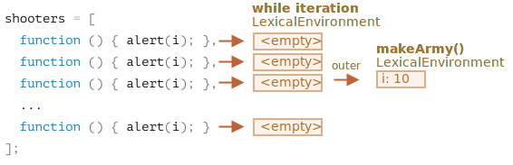
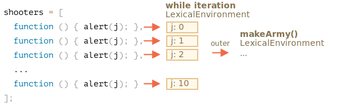
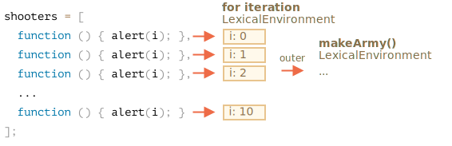

มาดูกันว่าเกิดอะไรขึ้นภายใน `makeArmy` แล้วจะเข้าใจคำตอบเอง

1. สร้างอาร์เรย์เปล่า `shooters`:

    ```js
    let shooters = [];
    ```
2. เติมฟังก์ชันเข้าไปด้วย `shooters.push(function)` ในลูป

    สมาชิกทุกตัวเป็นฟังก์ชัน อาร์เรย์ที่ได้จึงหน้าตาแบบนี้:

    ```js no-beautify
    shooters = [
      function () { alert(i); },
      function () { alert(i); },
      function () { alert(i); },
      function () { alert(i); },
      function () { alert(i); },
      function () { alert(i); },
      function () { alert(i); },
      function () { alert(i); },
      function () { alert(i); },
      function () { alert(i); }
    ];
    ```

3. อาร์เรย์ถูก return ออกจากฟังก์ชัน

    จากนั้น เมื่อเรียกสมาชิกตัวใดก็ตาม เช่น `army[5]()` จะดึงเอลิเมนต์ `army[5]` จากอาร์เรย์ (ซึ่งเป็นฟังก์ชัน) แล้วเรียกใช้

    ทำไมฟังก์ชันทุกตัวถึงแสดงค่าเดียวกันคือ `10`?

    เพราะไม่มีตัวแปร `i` ภายในฟังก์ชัน `shooter` เมื่อเรียกฟังก์ชัน จึงดึงค่า `i` จาก Lexical Environment ชั้นนอก

    แล้วค่าของ `i` จะเป็นเท่าไหร่?

    ลองดูจากซอร์สโค้ด:

    ```js
    function makeArmy() {
      ...
      let i = 0;
      while (i < 10) {
        let shooter = function() { // ฟังก์ชัน shooter
          alert( i ); // ควรแสดงหมายเลขของมัน
        };
        shooters.push(shooter); // เพิ่มฟังก์ชันเข้าอาร์เรย์
        i++;
      }
      ...
    }
    ```

    จะเห็นว่าฟังก์ชัน `shooter` ทุกตัวถูกสร้างใน Lexical Environment ของฟังก์ชัน `makeArmy()` แต่เมื่อเรียก `army[5]()` ตอนนั้น `makeArmy` ทำงานเสร็จแล้ว และค่าสุดท้ายของ `i` คือ `10` (`while` หยุดที่ `i=10`)

    ผลก็คือ ฟังก์ชัน `shooter` ทุกตัวดึงค่าเดียวกันจาก Lexical Environment ชั้นนอก นั่นคือค่าสุดท้าย `i=10`

    

    จากรูปด้านบนจะเห็นว่า ในแต่ละรอบของลูป `while {...}` จะสร้าง Lexical Environment ใหม่ ดังนั้นวิธีแก้คือ คัดลอกค่า `i` ไว้ในตัวแปรภายในบล็อก `while {...}` แบบนี้:

    ```js run
    function makeArmy() {
      let shooters = [];

      let i = 0;
      while (i < 10) {
        *!*
          let j = i;
        */!*
          let shooter = function() { // ฟังก์ชัน shooter
            alert( *!*j*/!* ); // ควรแสดงหมายเลขของมัน
          };
        shooters.push(shooter);
        i++;
      }

      return shooters;
    }

    let army = makeArmy();

    // ตอนนี้โค้ดทำงานถูกต้องแล้ว
    army[0](); // 0
    army[5](); // 5
    ```

    ตรงนี้ `let j = i` ประกาศตัวแปร `j` ที่เป็นของแต่ละรอบลูป แล้วคัดลอกค่า `i` ไป ค่า primitive ถูกคัดลอก "ตามค่า" ดังนั้นจึงได้สำเนาอิสระของ `i` ที่เป็นของรอบลูปปัจจุบัน

    shooters ทำงานถูกต้อง เพราะค่าของ `i` ตอนนี้อยู่ใกล้ขึ้น ไม่ได้อยู่ใน Lexical Environment ของ `makeArmy()` แต่อยู่ใน Lexical Environment ของรอบลูปปัจจุบัน:

    

    ปัญหานี้จะหายไปเลยถ้าใช้ `for` ตั้งแต่แรก แบบนี้:

    ```js run demo
    function makeArmy() {

      let shooters = [];

    *!*
      for(let i = 0; i < 10; i++) {
    */!*
        let shooter = function() { // ฟังก์ชัน shooter
          alert( i ); // ควรแสดงหมายเลขของมัน
        };
        shooters.push(shooter);
      }

      return shooters;
    }

    let army = makeArmy();

    army[0](); // 0
    army[5](); // 5
    ```

    หลักการเดียวกัน เพราะ `for` จะสร้าง Lexical Environment ใหม่ในแต่ละรอบ พร้อมตัวแปร `i` ของตัวเอง ดังนั้น `shooter` ที่สร้างในแต่ละรอบจะอ้างอิง `i` ของรอบนั้นโดยเฉพาะ

    

ตอนนี้ที่อ่านมาตั้งมาก แล้วสรุปก็แค่ใช้ `for` อาจรู้สึกว่าคุ้มไหมที่อ่าน?

ถ้าตอบได้ทันทีก็คงไม่ต้องอ่านคำเฉลย หวังว่าโจทย์ข้อนี้จะช่วยให้เข้าใจเรื่องนี้ได้ดีขึ้น

นอกจากนี้ ในการทำงานจริงก็มีกรณีที่ต้องใช้ `while` แทน `for` และปัญหาแบบนี้ก็เกิดขึ้นจริง

