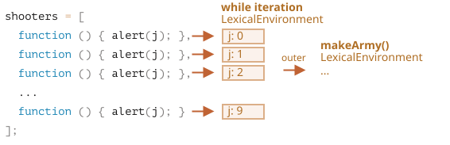
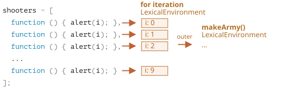

ลองไล่ดูการทำงานในฟังก์ชัน (function) `makeArmy` เพื่อหาว่าทำไมทุกตัวจึงแสดงเลขเดียวกัน

1. สร้างอาร์เรย์ (array) ว่างชื่อ `shooters`:

    ```js
    let shooters = [];
    ```
2. วนลูป (loop) เพื่อเพิ่มฟังก์ชันลงในอาร์เรย์ด้วย `shooters.push(function)`

    สมาชิกแต่ละตัวจึงเป็นฟังก์ชัน และอาร์เรย์ที่ได้มีลักษณะดังนี้:

    ```js no-beautify
    shooters = [
      function () { alert(i); },
      function () { alert(i); },
      function () { alert(i); },
      function () { alert(i); },
      function () { alert(i); },
      function () { alert(i); },
      function () { alert(i); },
      function () { alert(i); },
      function () { alert(i); },
      function () { alert(i); }
    ];
    ```

3. คืนอาร์เรย์ออกจากฟังก์ชัน

    เมื่อเรียกสมาชิก เช่น `army[5]()` โค้ดจะอ่านสมาชิกตำแหน่ง `army[5]` ซึ่งเป็นฟังก์ชัน แล้วเรียกฟังก์ชันนั้น

    แล้วทำไมทุกฟังก์ชันจึงแสดง `10` เหมือนกัน?

    ภายในฟังก์ชัน `shooter` ไม่มีตัวแปร (variable) `i` ของตัวเอง เมื่อเรียกใช้จึงต้องค้นหา `i` ใน Lexical Environment ชั้นนอก

    ลองดูว่าเมื่อถึงตอนนั้น `i` มีค่าเท่าไร:

    ```js
    function makeArmy() {
      ...
      let i = 0;
      while (i < 10) {
        let shooter = function() { // ฟังก์ชัน shooter
          alert( i ); // ควรแสดงหมายเลขของมัน
        };
        shooters.push(shooter); // เพิ่มฟังก์ชันเข้าอาร์เรย์
        i++;
      }
      ...
    }
    ```

    ฟังก์ชัน `shooter` ทุกตัวสร้างอยู่ภายใน `makeArmy()` และค้นหา `i` ย้อนไปถึง Lexical Environment ของการเรียก `makeArmy()` ครั้งเดียวกัน แต่เมื่อเรียก `army[5]()` นั้น `makeArmy` ทำงานเสร็จไปแล้ว ค่า `i` จึงเป็น `10` เพราะลูป `while` หยุดเมื่อ `i=10`

    ฟังก์ชันทุกตัวจึงอ่านค่า `i` ตัวเดียวกันจากชั้นนอก และได้ค่าสุดท้ายคือ `10`:
    

    บล็อก (block) `while {...}` มี Lexical Environment ใหม่ในแต่ละรอบอยู่แล้ว เราจึงแก้ได้ด้วยการคัดลอกค่า `i` มาเก็บในตัวแปรภายในบล็อกนี้:

    ```js run
    function makeArmy() {
      let shooters = [];

      let i = 0;
      while (i < 10) {
        *!*
          let j = i;
        */!*
          let shooter = function() { // ฟังก์ชัน shooter
            alert( *!*j*/!* ); // ควรแสดงหมายเลขของมัน
          };
        shooters.push(shooter);
        i++;
      }

      return shooters;
    }

    let army = makeArmy();

    // ตอนนี้โค้ดทำงานถูกต้องแล้ว
    army[0](); // 0
    army[5](); // 5
    ```

    คำสั่ง `let j = i` สร้างตัวแปร `j` แยกสำหรับรอบปัจจุบัน แล้วคัดลอกค่า `i` มาเก็บไว้ เนื่องจากตัวเลขเป็นค่า primitive การกำหนดค่านี้จึงคัดลอกตัวค่า ทำให้แต่ละรอบมีสำเนาที่เป็นอิสระจากกัน

    ทีนี้ `shooter` อ่านค่าจาก `j` ใน Lexical Environment ของรอบที่สร้างฟังก์ชันนั้น ค่าที่คัดลอกไว้จึงไม่เปลี่ยนตาม `i` ของ `makeArmy()`:
    

    อีกวิธีคือใช้ลูป `for` พร้อม `let` ตั้งแต่แรก:

    ```js run demo
    function makeArmy() {

      let shooters = [];

    *!*
      for(let i = 0; i < 10; i++) {
    */!*
        let shooter = function() { // ฟังก์ชัน shooter
          alert( i ); // ควรแสดงหมายเลขของมัน
        };
        shooters.push(shooter);
      }

      return shooters;
    }

    let army = makeArmy();

    army[0](); // 0
    army[5](); // 5
    ```

    วิธีนี้ใช้หลักการเดียวกัน เพราะ `for` สร้าง Lexical Environment ใหม่พร้อมตัวแปร `i` ของแต่ละรอบ ฟังก์ชัน `shooter` ที่สร้างในรอบไหนจึงอ่านค่า `i` ของรอบนั้น:
    

แม้ตัวอย่างนี้จะแก้ได้ด้วยการเปลี่ยนไปใช้ `for` แต่การไล่ดูแต่ละขั้นช่วยให้เราเข้าใจว่าฟังก์ชันอ่านตัวแปรจากที่ไหนและในเวลาใด

ในการใช้งานจริง บางกรณีเหมาะกับ `while` มากกว่า `for` หรืออาจมีโค้ดรูปแบบอื่นที่เจอปัญหาเดียวกัน ความเข้าใจเรื่องตัวแปรที่ฟังก์ชันใช้ร่วมกันจึงช่วยให้เราแก้กรณีเหล่านั้นได้ด้วย
