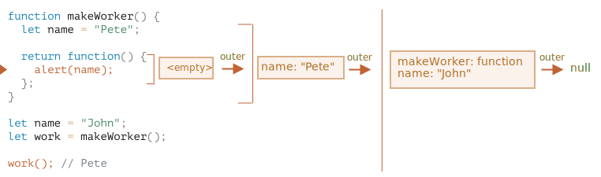

คำตอบคือ: **Pete**

ฟังก์ชัน `work()` ในโค้ดด้านล่างได้ค่า `name` จากตำแหน่งที่มันถูกสร้าง ผ่านการอ้างอิง Lexical Environment ชั้นนอก:

ดังนั้นผลลัพธ์คือ `"Pete"`

แต่ถ้าไม่มี `let name` ใน `makeWorker()` การค้นหาจะไล่ออกไปข้างนอกและใช้ตัวแปร global ตามที่เห็นในห่วงโซ่ด้านบน ในกรณีนั้นผลลัพธ์จะเป็น `"John"`
