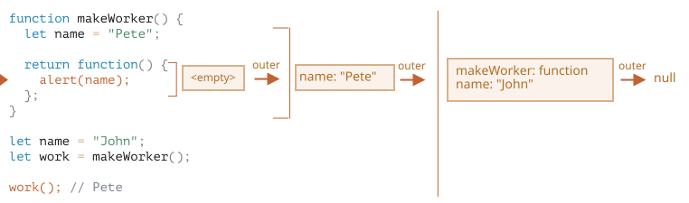

คำตอบคือ **`"Pete"`**

ฟังก์ชัน (function) `work()` อ่านตัวแปร (variable) `name` จากตำแหน่งที่สร้างฟังก์ชัน โดยตามการอ้างอิง (reference) ไปยัง Lexical Environment ชั้นนอก ซึ่งเป็นของการเรียก `makeWorker()`:

จึงได้ค่า `"Pete"`

ถ้าไม่มี `let name` ใน `makeWorker()` การค้นหาจะไล่ออกไปอีกชั้นจนถึงตัวแปรที่อยู่ระดับสคริปต์ (script) หรือ global ในกรณีนั้นจึงจะได้ค่า `"John"`
