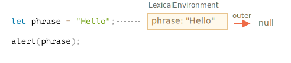
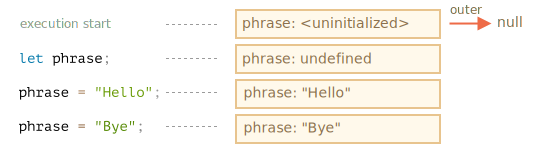
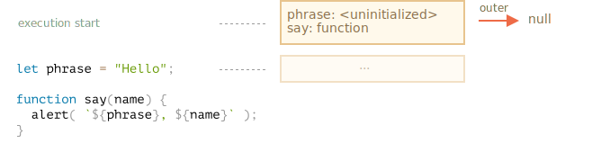
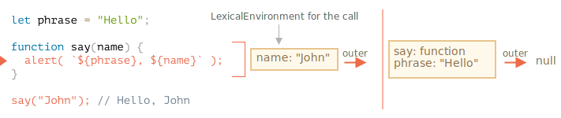
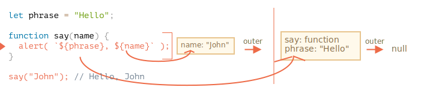
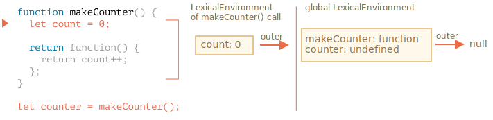
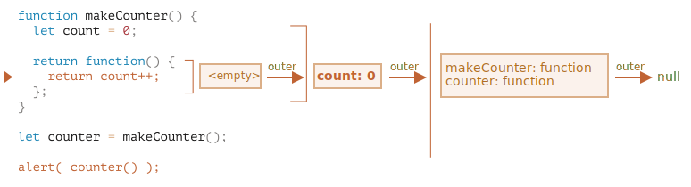
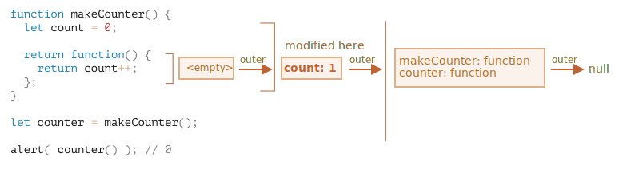

# สโคปของตัวแปรและคลอเชอร์ (Closure)

JavaScript เป็นภาษาที่เน้นการใช้งานฟังก์ชันเป็นหลัก เราสร้างฟังก์ชันได้ทุกเมื่อ ส่งผ่านเป็นอาร์กิวเมนต์ให้ฟังก์ชันอื่น แล้วค่อยเรียกใช้ทีหลังจากที่อื่นในโค้ดก็ได้

จากที่เราเรียนมาแล้ว ฟังก์ชันสามารถเข้าถึงตัวแปรภายนอก ("outer" variables) ได้

แต่ถ้าตัวแปรภายนอกเปลี่ยนค่าไปหลังจากสร้างฟังก์ชันแล้วล่ะ? ฟังก์ชันจะได้ค่าใหม่หรือค่าเก่า?

แล้วถ้าส่งฟังก์ชันไปเป็นอาร์กิวเมนต์ แล้วเรียกใช้จากที่อื่นในโค้ด จะยังเข้าถึงตัวแปรภายนอกจากที่ใหม่ได้ไหม?

มาขยายความรู้เพื่อทำความเข้าใจสถานการณ์เหล่านี้ รวมถึงกรณีที่ซับซ้อนกว่ากัน

```smart header="บทความนี้จะพูดถึงตัวแปร `let/const`"
ใน JavaScript มีวิธีประกาศตัวแปรอยู่ 3 แบบ คือ `let`, `const` (แบบใหม่) และ `var` (ตกค้างจากยุคเก่า)

- ในบทความนี้เราจะใช้ `let` ในตัวอย่างเป็นหลัก
- ตัวแปรที่ประกาศด้วย `const` ก็ทำงานเหมือนกัน ดังนั้นบทความนี้ครอบคลุม `const` ด้วยเช่นกัน
- `var` แบบเก่ามีความแตกต่างที่สำคัญบางประการ จะอธิบายเพิ่มในบทความ <info:var>
```

## บล็อกของโค้ด (Code blocks)

ถ้าประกาศตัวแปรภายในบล็อกโค้ด `{...}` ตัวแปรนั้นจะมองเห็นได้แค่ภายในบล็อกนั้นเท่านั้น

ยกตัวอย่าง:

```js run
{
  // ทำงานบางอย่างกับตัวแปรภายในที่ไม่ควรเห็นจากข้างนอก

  let message = "Hello"; // มองเห็นได้แค่ในบล็อกนี้

  alert(message); // Hello
}

alert(message); // Error: message is not defined
```

เราใช้วิธีนี้เพื่อแยกส่วนของโค้ดที่ทำงานเฉพาะของมันออกมา โดยมีตัวแปรที่ใช้เฉพาะภายในบล็อกนั้น:

```js run
{
  // แสดงข้อความ
  let message = "Hello";
  alert(message);
}

{
  // แสดงข้อความอีกอัน
  let message = "Goodbye";
  alert(message);
}
```

````smart header="ถ้าไม่มีบล็อกจะเกิด error"
โปรดสังเกตว่า ถ้าไม่แยกเป็นบล็อก จะเกิด error เมื่อใช้ `let` กับชื่อตัวแปรที่มีอยู่แล้ว:

```js run
// แสดงข้อความ
let message = "Hello";
alert(message);

// แสดงข้อความอีกอัน
*!*
let message = "Goodbye"; // Error: variable already declared
*/!*
alert(message);
```
````

สำหรับ `if`, `for`, `while` และอื่นๆ ตัวแปรที่ประกาศใน `{...}` ก็มองเห็นได้แค่ข้างในเช่นกัน:

```js run
if (true) {
  let phrase = "Hello!";

  alert(phrase); // Hello!
}

alert(phrase); // Error, no such variable!
```

ในที่นี้ หลังจาก `if` ทำงานเสร็จ `alert` ด้านล่างจะมองไม่เห็น `phrase` จึงเกิด error

นี่เป็นสิ่งที่ดี เพราะช่วยให้เราสร้างตัวแปรที่ใช้เฉพาะภายในบล็อก เช่น ตัวแปรที่ใช้เฉพาะในสาขาของ `if`

หลักการเดียวกันนี้ใช้ได้กับลูป `for` และ `while` ด้วย:

```js run
for (let i = 0; i < 3; i++) {
  // ตัวแปร i มองเห็นได้แค่ภายใน for นี้
  alert(i); // 0, จากนั้น 1, จากนั้น 2
}

alert(i); // Error, no such variable
```

ถึงแม้ `let i` จะดูเหมือนอยู่นอก `{...}` แต่โครงสร้าง `for` เป็นกรณีพิเศษ ตัวแปรที่ประกาศข้างในถือว่าเป็นส่วนหนึ่งของบล็อก

## ฟังก์ชันซ้อน (Nested functions)

ฟังก์ชันที่สร้างขึ้นภายในฟังก์ชันอื่น เราเรียกว่า "ฟังก์ชันซ้อน" (nested function)

ใน JavaScript ทำแบบนี้ได้ง่ายมาก

เราใช้เพื่อจัดระเบียบโค้ดได้ เช่นแบบนี้:

```js
function sayHiBye(firstName, lastName) {

  // ฟังก์ชันซ้อนที่เป็นตัวช่วย
  function getFullName() {
    return firstName + " " + lastName;
  }

  alert( "Hello, " + getFullName() );
  alert( "Bye, " + getFullName() );

}
```

ตรงนี้ฟังก์ชันซ้อน `getFullName()` ถูกสร้างขึ้นเพื่อความสะดวก มันเข้าถึงตัวแปรภายนอกได้ จึงคืนค่าชื่อเต็มได้ ฟังก์ชันซ้อนเป็นสิ่งที่พบได้บ่อยมากใน JavaScript

สิ่งที่น่าสนใจกว่านั้นคือ ฟังก์ชันซ้อนสามารถถูก return ออกมาได้ ไม่ว่าจะเป็นพร็อพเพอร์ตี้ของออบเจ็กต์ใหม่ หรือเป็นผลลัพธ์โดยตรง จากนั้นจะนำไปใช้ที่อื่นก็ได้ ไม่ว่าจะเรียกจากที่ไหน มันยังเข้าถึงตัวแปรภายนอกเดิมได้เสมอ

ตัวอย่างด้านล่าง `makeCounter` สร้างฟังก์ชัน "ตัวนับ" ที่คืนค่าตัวเลขถัดไปทุกครั้งที่เรียก:

```js run
function makeCounter() {
  let count = 0;

  return function() {
    return count++;
  };
}

let counter = makeCounter();

alert( counter() ); // 0
alert( counter() ); // 1
alert( counter() ); // 2
```

แม้จะเป็นโค้ดง่ายๆ แต่ถ้าดัดแปลงนิดหน่อยก็นำไปใช้งานจริงได้ เช่น เป็น[ตัวสร้างเลขสุ่ม](https://en.wikipedia.org/wiki/Pseudorandom_number_generator)สำหรับสร้างค่าสุ่มในการทดสอบอัตโนมัติ

โค้ดนี้ทำงานยังไง? ถ้าสร้างตัวนับหลายตัว แต่ละตัวจะเป็นอิสระจากกันไหม? เกิดอะไรขึ้นกับตัวแปรในนี้?

การเข้าใจเรื่องพวกนี้เป็นพื้นฐานสำคัญของ JavaScript และจะมีประโยชน์มากเมื่อเจอสถานการณ์ที่ซับซ้อนขึ้น ดังนั้นมาเจาะลึกกันเลย

## Lexical Environment

```warn header="เนื้อหาเชิงลึกอยู่ข้างหน้า!"
เราจะอธิบายรายละเอียดเชิงเทคนิคกันต่อไป

แม้จะอยากหลีกเลี่ยงรายละเอียดภาษาระดับต่ำ แต่ถ้าไม่เข้าใจตรงนี้ ความรู้จะไม่ครบถ้วน ดังนั้นเตรียมตัวให้พร้อม
```

เพื่อให้อธิบายได้ชัดเจน จะแบ่งเป็นหลายขั้นตอน

### ขั้นตอนที่ 1: ตัวแปร

ใน JavaScript ทุกฟังก์ชันที่กำลังทำงาน ทุกบล็อกโค้ด `{...}` และทั้งสคริปต์ จะมีออบเจ็กต์ภายใน (ซ่อนอยู่) ที่เรียกว่า *Lexical Environment*

ออบเจ็กต์ Lexical Environment ประกอบด้วย 2 ส่วน:

1. *Environment Record* -- ออบเจ็กต์ที่เก็บตัวแปรภายในทั้งหมดเป็นพร็อพเพอร์ตี้ (รวมถึงข้อมูลอื่นๆ เช่น ค่าของ `this`)
2. การอ้างอิงไปยัง *Lexical Environment ภายนอก* ที่เชื่อมกับโค้ดชั้นนอก

**"ตัวแปร" ก็คือพร็อพเพอร์ตี้หนึ่งของออบเจ็กต์ภายในพิเศษที่ชื่อ `Environment Record` นั่นเอง "การอ่านหรือเปลี่ยนค่าตัวแปร" ก็คือ "การอ่านหรือเปลี่ยนพร็อพเพอร์ตี้ของออบเจ็กต์ตัวนั้น"**

ในโค้ดง่ายๆ ที่ไม่มีฟังก์ชัน จะมี Lexical Environment แค่ตัวเดียว:



นี่คือ Lexical Environment แบบ *global* ที่เชื่อมกับทั้งสคริปต์

ในรูปด้านบน สี่เหลี่ยมคือ Environment Record (ที่เก็บตัวแปร) และลูกศรคือการอ้างอิงไปยังภายนอก Lexical Environment แบบ global ไม่มีการอ้างอิงภายนอก ลูกศรจึงชี้ไปที่ `null`

เมื่อโค้ดเริ่มทำงานและดำเนินต่อไป Lexical Environment จะเปลี่ยนแปลงไปเรื่อยๆ

ลองดูโค้ดที่ยาวขึ้นหน่อย:



สี่เหลี่ยมด้านขวาแสดงให้เห็นว่า Lexical Environment แบบ global เปลี่ยนแปลงอย่างไรระหว่างการทำงาน:

1. เมื่อสคริปต์เริ่มทำงาน Lexical Environment จะถูกเติมด้วยตัวแปรที่ประกาศไว้ทั้งหมด
    - ตอนแรกตัวแปรจะอยู่ในสถานะ "Uninitialized" ซึ่งเป็นสถานะภายในพิเศษ หมายความว่า engine รู้ว่ามีตัวแปรนี้อยู่ แต่ยังอ้างอิงไม่ได้จนกว่าจะประกาศด้วย `let` เหมือนกับว่าตัวแปรยังไม่มีอยู่
2. จากนั้น `let phrase` ปรากฏขึ้น ยังไม่มีการกำหนดค่า จึงเป็น `undefined` ตั้งแต่จุดนี้เป็นต้นไปเราใช้ตัวแปรนี้ได้
3. `phrase` ถูกกำหนดค่า
4. `phrase` เปลี่ยนค่า

ดูง่ายใช่ไหม?

- ตัวแปรคือพร็อพเพอร์ตี้ของออบเจ็กต์ภายในพิเศษ ที่เชื่อมกับบล็อก/ฟังก์ชัน/สคริปต์ที่กำลังทำงานอยู่
- การทำงานกับตัวแปรก็คือการทำงานกับพร็อพเพอร์ตี้ของออบเจ็กต์ตัวนั้น

```smart header="Lexical Environment เป็นออบเจ็กต์ตามสเปก"
"Lexical Environment" เป็นออบเจ็กต์ตามสเปกของภาษา (specification object) มีอยู่แค่ "ในทางทฤษฎี" ตาม[สเปกของภาษา](https://tc39.es/ecma262/#sec-lexical-environments)เพื่ออธิบายว่าสิ่งต่างๆ ทำงานอย่างไร เราไม่สามารถเข้าถึงออบเจ็กต์นี้ในโค้ดและจัดการโดยตรงได้

JavaScript engine อาจปรับแต่งการทำงาน เช่น ตัดตัวแปรที่ไม่ได้ใช้ออกเพื่อประหยัดหน่วยความจำ หรือทำเทคนิคอื่นๆ ภายใน ตราบใดที่พฤติกรรมที่มองเห็นยังคงเป็นไปตามที่อธิบายไว้
```

### ขั้นตอนที่ 2: Function Declaration

ฟังก์ชันก็เป็นค่าตัวหนึ่ง เหมือนกับตัวแปร

**ข้อแตกต่างคือ Function Declaration จะถูกเตรียมพร้อมใช้งานทันที**

เมื่อสร้าง Lexical Environment ขึ้นมา Function Declaration จะกลายเป็นฟังก์ชันที่พร้อมใช้ทันที (ต่างจาก `let` ที่ใช้ไม่ได้จนกว่าจะถึงบรรทัดที่ประกาศ)

นั่นเป็นเหตุผลว่าทำไมเราถึงเรียกใช้ฟังก์ชันที่ประกาศแบบ Function Declaration ได้ก่อนที่จะถึงบรรทัดประกาศ

ตัวอย่างเช่น สถานะเริ่มต้นของ Lexical Environment แบบ global เมื่อเราเพิ่มฟังก์ชันเข้ามา:



แน่นอนว่าพฤติกรรมนี้ใช้ได้กับ Function Declaration เท่านั้น ไม่ใช่ Function Expression ที่เราใส่ฟังก์ชันให้กับตัวแปร เช่น `let say = function(name)...`

### ขั้นตอนที่ 3: Lexical Environment ชั้นในและชั้นนอก

เมื่อฟังก์ชันทำงาน ณ ตอนเริ่มต้นการเรียก จะมี Lexical Environment ใหม่ถูกสร้างขึ้นโดยอัตโนมัติเพื่อเก็บตัวแปรภายในฟังก์ชันและพารามิเตอร์

ยกตัวอย่าง เมื่อเรียก `say("John")` จะเป็นแบบนี้ (การทำงานอยู่ที่บรรทัดที่มีลูกศรกำกับ):

<!--
    ```js
    let phrase = "Hello";

    function say(name) {
     alert( `${phrase}, ${name}` );
    }

    say("John"); // Hello, John
    ```-->



ระหว่างที่ฟังก์ชันทำงาน จะมี Lexical Environment 2 ตัว คือ ตัวชั้นใน (ของฟังก์ชัน) กับตัวชั้นนอก (global):

- Lexical Environment ชั้นในตรงกับการทำงานปัจจุบันของ `say` มีพร็อพเพอร์ตี้ตัวเดียวคือ `name` ซึ่งเป็นอาร์กิวเมนต์ของฟังก์ชัน เราเรียก `say("John")` ดังนั้นค่าของ `name` จึงเป็น `"John"`
- Lexical Environment ชั้นนอกคือ Lexical Environment แบบ global ที่มีตัวแปร `phrase` และตัวฟังก์ชันเอง

Lexical Environment ชั้นในมีการอ้างอิงไปยัง `outer` (ชั้นนอก)

**เมื่อโค้ดต้องการเข้าถึงตัวแปร จะค้นหาจาก Lexical Environment ชั้นในก่อน จากนั้นชั้นนอก แล้วก็ชั้นนอกถัดไปเรื่อยๆ จนถึงระดับ global**

ถ้าหาตัวแปรไม่เจอเลย ในโหมด strict จะเกิด error (ถ้าไม่ได้ใช้ `use strict` การกำหนดค่าให้ตัวแปรที่ไม่มีอยู่จะสร้างตัวแปร global ขึ้นมาใหม่ เพื่อรองรับโค้ดเก่า)

ในตัวอย่างนี้ การค้นหาเป็นดังนี้:

- ตัวแปร `name` -- `alert` ภายใน `say` พบได้ทันทีใน Lexical Environment ชั้นใน
- ตัวแปร `phrase` -- ไม่มีอยู่ในชั้นใน จึงไล่ตามการอ้างอิงไปยัง Lexical Environment ชั้นนอก และพบที่นั่น




### ขั้นตอนที่ 4: การ return ฟังก์ชัน

กลับมาที่ตัวอย่าง `makeCounter` กัน

```js
function makeCounter() {
  let count = 0;

  return function() {
    return count++;
  };
}

let counter = makeCounter();
```

ทุกครั้งที่เรียก `makeCounter()` จะสร้าง Lexical Environment ใหม่ขึ้นมาเพื่อเก็บตัวแปรของการเรียกครั้งนั้น

เราจึงมี Lexical Environment ซ้อนกัน 2 ชั้น เหมือนตัวอย่างก่อนหน้า:



สิ่งที่ต่างออกไปคือ ระหว่างที่ `makeCounter()` ทำงาน จะสร้างฟังก์ชันเล็กๆ แค่บรรทัดเดียว `return count++` ขึ้นมา แต่ยังไม่ได้รัน แค่สร้างเฉยๆ

ฟังก์ชันทุกตัวจะจดจำ Lexical Environment ที่มันถูกสร้างขึ้น ไม่มีอะไรมหัศจรรย์ ฟังก์ชันทุกตัวมีพร็อพเพอร์ตี้ซ่อน `[[Environment]]` ที่เก็บการอ้างอิงไปยัง Lexical Environment ที่ฟังก์ชันถูกสร้าง:


ดังนั้น `counter.[[Environment]]` จึงอ้างอิงไปยัง Lexical Environment `{count: 0}` นี่คือวิธีที่ฟังก์ชันจดจำว่ามันถูกสร้างที่ไหน ไม่ว่าจะเรียกจากที่ใดก็ตาม การอ้างอิง `[[Environment]]` ถูกตั้งค่าครั้งเดียวตอนสร้างฟังก์ชันแล้วไม่เปลี่ยนอีก

ต่อมาเมื่อเรียก `counter()` จะสร้าง Lexical Environment ใหม่สำหรับการเรียกครั้งนั้น และการอ้างอิง Lexical Environment ชั้นนอกจะมาจาก `counter.[[Environment]]`:



เมื่อโค้ดภายใน `counter()` หาตัวแปร `count` จะค้นหาจาก Lexical Environment ของตัวเองก่อน (ว่างเปล่า เพราะไม่มีตัวแปรภายใน) จากนั้นจึงค้นหาจาก Lexical Environment ของ `makeCounter()` ชั้นนอก ซึ่งพบและแก้ไขค่าที่นั่น

**ตัวแปรจะถูกอัปเดตใน Lexical Environment ที่มันอาศัยอยู่**

นี่คือสถานะหลังทำงานเสร็จ:



ถ้าเรียก `counter()` หลายครั้ง ตัวแปร `count` จะเพิ่มเป็น `2`, `3` ไปเรื่อยๆ ที่ตำแหน่งเดิม

```smart header="คลอเชอร์ (Closure)"
มีศัพท์ทั่วไปในการเขียนโปรแกรมคำหนึ่งคือ "คลอเชอร์" (closure) ที่นักพัฒนาควรรู้จัก

[คลอเชอร์](https://en.wikipedia.org/wiki/Closure_(computer_programming)) คือฟังก์ชันที่จดจำตัวแปรภายนอกและเข้าถึงได้ ในบางภาษาทำแบบนี้ไม่ได้ หรือต้องเขียนฟังก์ชันแบบพิเศษถึงจะทำได้ แต่ใน JavaScript ฟังก์ชันทุกตัวเป็นคลอเชอร์โดยธรรมชาติ (มีข้อยกเว้นเดียวที่จะอธิบายใน <info:new-function>)

กล่าวคือ ฟังก์ชันจดจำว่าถูกสร้างที่ไหนโดยอัตโนมัติผ่านพร็อพเพอร์ตี้ซ่อน `[[Environment]]` แล้วโค้ดของมันก็เข้าถึงตัวแปรภายนอกได้

เวลาสัมภาษณ์งาน ถ้าถูกถามว่า "คลอเชอร์คืออะไร?" คำตอบที่ดีคือ อธิบายนิยามของคลอเชอร์ พร้อมกับบอกว่าฟังก์ชันทุกตัวใน JavaScript เป็นคลอเชอร์ แล้วอาจเสริมรายละเอียดทางเทคนิคเกี่ยวกับพร็อพเพอร์ตี้ `[[Environment]]` และการทำงานของ Lexical Environment อีกเล็กน้อย
```

## การเก็บขยะ (Garbage collection)

โดยปกติ Lexical Environment จะถูกลบออกจากหน่วยความจำพร้อมกับตัวแปรทั้งหมด หลังจากฟังก์ชันทำงานเสร็จ เพราะไม่มีการอ้างอิงถึงอีกแล้ว เหมือนกับออบเจ็กต์ JavaScript ทั่วไปที่จะอยู่ในหน่วยความจำก็ต่อเมื่อยังมีการอ้างอิงถึง

อย่างไรก็ตาม ถ้ามีฟังก์ชันซ้อนที่ยังเข้าถึงได้หลังจากฟังก์ชันหลักทำงานเสร็จ มันจะมีพร็อพเพอร์ตี้ `[[Environment]]` ที่อ้างอิงไปยัง Lexical Environment

ในกรณีนั้น Lexical Environment ยังคงเข้าถึงได้แม้ฟังก์ชันจะทำงานเสร็จแล้ว จึงยังคงอยู่ในหน่วยความจำ

ยกตัวอย่าง:

```js
function f() {
  let value = 123;

  return function() {
    alert(value);
  }
}

let g = f(); // g.[[Environment]] เก็บการอ้างอิงไปยัง Lexical Environment
// ของการเรียก f() ครั้งนั้น
```

สังเกตว่าถ้าเรียก `f()` หลายครั้ง แล้วเก็บฟังก์ชันที่ได้ไว้ Lexical Environment ของแต่ละครั้งก็จะยังคงอยู่ในหน่วยความจำด้วย ในโค้ดด้านล่างมีทั้งหมด 3 ตัว:

```js
function f() {
  let value = Math.random();

  return function() { alert(value); };
}

// ฟังก์ชัน 3 ตัวในอาร์เรย์ แต่ละตัวเชื่อมไปยัง Lexical Environment
// ของการเรียก f() แต่ละครั้ง
let arr = [f(), f(), f()];
```

ออบเจ็กต์ Lexical Environment จะถูกลบเมื่อไม่มีอะไรอ้างอิงถึงอีกแล้ว (เหมือนออบเจ็กต์ทั่วไป) พูดง่ายๆ ก็คือ มันจะมีอยู่ตราบใดที่ยังมีฟังก์ชันซ้อนอย่างน้อยหนึ่งตัวที่อ้างอิงถึง

ในโค้ดด้านล่าง หลังจากลบฟังก์ชันซ้อนออก Lexical Environment ที่ห่อหุ้มอยู่ (รวมถึง `value`) ก็จะถูกล้างออกจากหน่วยความจำ:

```js
function f() {
  let value = 123;

  return function() {
    alert(value);
  }
}

let g = f(); // ตราบใดที่ฟังก์ชัน g ยังอยู่ value ก็จะอยู่ในหน่วยความจำ

g = null; // ...พอไม่มีการอ้างอิงแล้ว หน่วยความจำก็ถูกล้าง
```

### การปรับแต่งในการใช้งานจริง

อย่างที่เราเห็น ในทางทฤษฎี ตราบใดที่ฟังก์ชันยังอยู่ ตัวแปรภายนอกทั้งหมดก็จะถูกเก็บไว้ด้วย

แต่ในทางปฏิบัติ JavaScript engine พยายามปรับแต่งตรงนี้ โดยวิเคราะห์การใช้งานตัวแปร ถ้าเห็นชัดว่าตัวแปรภายนอกไม่ได้ถูกใช้ ก็จะลบออก

**ผลข้างเคียงที่สำคัญใน V8 (Chrome, Edge, Opera) คือ ตัวแปรที่ถูกลบจะใช้ไม่ได้ขณะ debug**

ลองรันตัวอย่างด้านล่างใน Chrome โดยเปิด Developer Tools

เมื่อหยุดที่ debugger ให้ลองพิมพ์ `alert(value)` ในคอนโซล

```js run
function f() {
  let value = Math.random();

  function g() {
    debugger; // ในคอนโซล: พิมพ์ alert(value); จะบอกว่าไม่มีตัวแปรนี้!
  }

  return g;
}

let g = f();
g();
```

อย่างที่เห็น ตัวแปรหายไป! ในทางทฤษฎีควรเข้าถึงได้ แต่ engine ปรับแต่งออกไปแล้ว

ปัญหานี้อาจนำไปสู่เรื่องน่าเวียนหัว (ที่อาจเสียเวลา debug) ตอน debug ตัวอย่างเช่น เราอาจเห็นตัวแปรภายนอกที่ชื่อเดียวกันแต่คนละตัวกับที่คาดไว้:

```js run global
let value = "Surprise!";

function f() {
  let value = "the closest value";

  function g() {
    debugger; // ในคอนโซล: พิมพ์ alert(value); จะได้ Surprise!
  }

  return g;
}

let g = f();
g();
```

ฟีเจอร์นี้ของ V8 เป็นสิ่งที่ควรรู้ไว้ ถ้า debug ด้วย Chrome/Edge/Opera ไม่ช้าก็เร็วจะเจอ

นี่ไม่ใช่บั๊กของ debugger แต่เป็นฟีเจอร์ของ V8 บางทีในอนาคตอาจมีการเปลี่ยนแปลง สามารถทดสอบได้เสมอโดยรันตัวอย่างในหน้านี้
