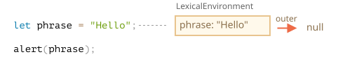
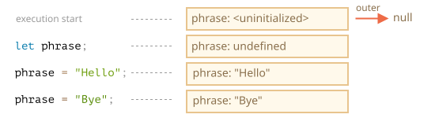
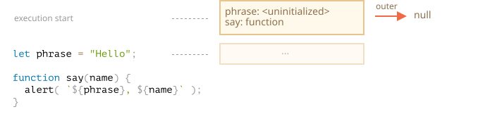
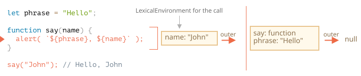
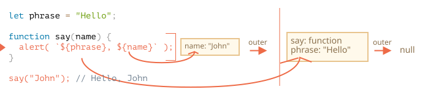
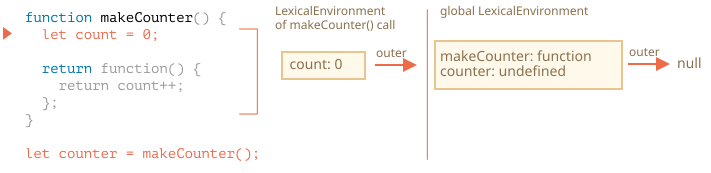
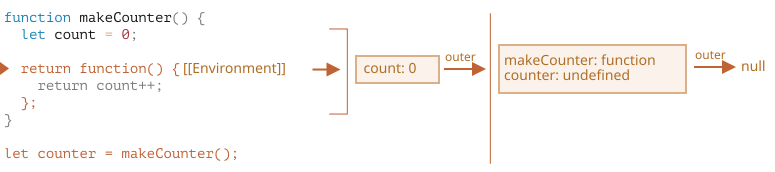
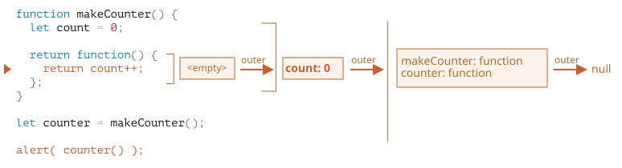
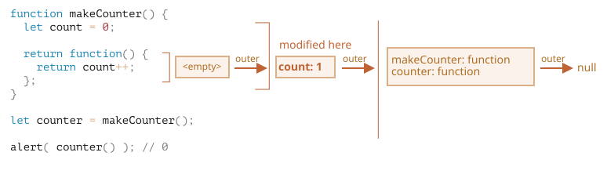

# สโคป (scope) ของตัวแปร (variable) และคลอเชอร์ (closure)

JavaScript ให้เราใช้ฟังก์ชัน (function) ได้หลายแบบ เราจะสร้างฟังก์ชันเมื่อไรก็ได้ ส่งเป็นอาร์กิวเมนต์ (argument) ให้ฟังก์ชันอื่น แล้วค่อยเรียกใช้จากส่วนอื่นของโค้ดในภายหลังก็ได้

เราเรียนมาแล้วว่าฟังก์ชันเข้าถึงตัวแปรที่อยู่ภายนอกตัวมันได้

แต่ถ้าตัวแปรภายนอกเปลี่ยนค่าหลังจากสร้างฟังก์ชันแล้ว ตอนเรียกใช้ฟังก์ชันจะอ่านค่าเดิมหรือค่าล่าสุด?

แล้วถ้าส่งฟังก์ชันไปเป็นอาร์กิวเมนต์และเรียกใช้จากที่อื่น ฟังก์ชันจะเข้าถึงตัวแปรภายนอกที่อยู่ตรงจุดเรียกใช้ได้หรือไม่?

บทนี้จะพาไล่ดูว่าฟังก์ชันค้นหาตัวแปรอย่างไร เพื่อให้ตอบคำถามเหล่านี้และเข้าใจกรณีที่ซับซ้อนขึ้นได้

```smart header="บทนี้กล่าวถึงตัวแปร `let/const`"
JavaScript มีวิธีประกาศตัวแปร 3 แบบ ได้แก่ `let`, `const` และ `var` ซึ่งเป็นรูปแบบที่ใช้กันมาก่อน

- ตัวอย่างในบทนี้ใช้ `let`
- ตัวแปรที่ประกาศด้วย `const` มีกฎเรื่องสโคปเหมือนกัน เนื้อหาในบทนี้จึงใช้กับ `const` ด้วย
- `var` มีกฎบางอย่างต่างออกไป เราจะเรียนเรื่องนี้ในบท <info:var>
```

## บล็อกโค้ด (code block)

สโคปของตัวแปรบอกว่าโค้ดส่วนใดเข้าถึงตัวแปรนั้นได้ ถ้าเราประกาศตัวแปรไว้ในบล็อกโค้ด `{...}` สโคปของตัวแปรก็จะอยู่ภายในบล็อกนั้น โค้ดข้างนอกจึงเข้าถึงไม่ได้

ลองดูตัวอย่างนี้:

```js run
{
  // ทำงานบางอย่างกับตัวแปรภายในที่ไม่ควรเห็นจากข้างนอก

  let message = "Hello"; // มองเห็นได้แค่ในบล็อกนี้

  alert(message); // Hello
}

alert(message); // Error: message is not defined
```

เราจึงแยกโค้ดแต่ละส่วนออกเป็นบล็อก เพื่อให้แต่ละส่วนมีตัวแปรของตัวเองได้:

```js run
{
  // แสดงข้อความ
  let message = "Hello";
  alert(message);
}

{
  // แสดงข้อความอีกอัน
  let message = "Goodbye";
  alert(message);
}
```

````smart header="ถ้าไม่แยกบล็อกจะเกิดข้อผิดพลาด (error)"
ถ้าเขียนโค้ดสองส่วนนี้ไว้ในบล็อกเดียวกัน การใช้ `let` ประกาศตัวแปรชื่อเดิมซ้ำจะทำให้เกิดข้อผิดพลาด:

```js run
// แสดงข้อความ
let message = "Hello";
alert(message);

// แสดงข้อความอีกอัน
*!*
let message = "Goodbye"; // Error: variable already declared
*/!*
alert(message);
```
````

กฎเดียวกันนี้ใช้กับบล็อกของ `if`, `for`, `while` และคำสั่งอื่น ๆ ด้วย ตัวแปรที่ประกาศใน `{...}` จะเข้าถึงได้เฉพาะจากภายในบล็อก:

```js run
if (true) {
  let phrase = "Hello!";

  alert(phrase); // Hello!
}

alert(phrase); // Error, no such variable!
```

หลังจากบล็อก `if` ทำงานเสร็จ `alert` ที่อยู่ข้างนอกจะเข้าถึง `phrase` ไม่ได้ จึงเกิดข้อผิดพลาด

เราจึงประกาศตัวแปรไว้ใช้เฉพาะในบล็อก `if` ที่ต้องการได้ โดยโค้ดภายนอกจะไม่เห็นตัวแปรนั้น

ลูป (loop) `for` และ `while` ก็ใช้หลักการเดียวกัน:

```js run
for (let i = 0; i < 3; i++) {
  // ตัวแปร i มองเห็นได้แค่ภายใน for นี้
  alert(i); // 0, จากนั้น 1, จากนั้น 2
}

alert(i); // Error, no such variable
```

แม้ `let i` จะเขียนอยู่นอก `{...}` แต่ `for` มีกฎเฉพาะสำหรับตัวแปรที่ประกาศตรงนี้ โดยให้ตัวแปรเป็นส่วนหนึ่งของลูปด้วย โค้ดหลังลูปจึงเข้าถึง `i` ไม่ได้

## ฟังก์ชันซ้อน (nested function)

ฟังก์ชันซ้อนคือฟังก์ชันที่สร้างอยู่ภายในฟังก์ชันอีกตัวหนึ่ง เราใช้วิธีนี้ช่วยจัดโค้ดใน JavaScript ได้ เช่น:

```js
function sayHiBye(firstName, lastName) {

  // ฟังก์ชันซ้อนที่เป็นตัวช่วย
  function getFullName() {
    return firstName + " " + lastName;
  }

  alert( "Hello, " + getFullName() );
  alert( "Bye, " + getFullName() );

}
```

ในตัวอย่างนี้ `getFullName()` ช่วยประกอบชื่อกับนามสกุลให้เรา ฟังก์ชันนี้เข้าถึง `firstName` และ `lastName` จากภายนอกได้ จึงคืนค่าชื่อเต็มให้โค้ดส่วนที่เรียกใช้ ฟังก์ชันซ้อนลักษณะนี้พบได้บ่อยใน JavaScript

เรายังคืนฟังก์ชันซ้อนออกไปให้โค้ดที่อื่นใช้ได้ด้วย จะคืนฟังก์ชันโดยตรง หรือเก็บเป็นพร็อพเพอร์ตี้ (property) ของออบเจ็กต์ (object) ใหม่แล้วคืนออบเจ็กต์นั้นก็ได้ ไม่ว่าจะนำไปเรียกที่ไหน ฟังก์ชันซ้อนก็ยังเข้าถึงตัวแปรภายนอกชุดเดิมได้

ตัวอย่างด้านล่าง `makeCounter` สร้างฟังก์ชันตัวนับที่คืนค่าตัวเลขถัดไปทุกครั้งที่เรียก:

```js run
function makeCounter() {
  let count = 0;

  return function() {
    return count++;
  };
}

let counter = makeCounter();

alert( counter() ); // 0
alert( counter() ); // 1
alert( counter() ); // 2
```

โค้ดลักษณะนี้นำไปดัดแปลงใช้จริงได้ เช่น ทำ[ตัวสร้างเลขสุ่ม](https://en.wikipedia.org/wiki/Pseudorandom_number_generator)เพื่อใช้ในการทดสอบอัตโนมัติ

แล้วตัวนับนี้ทำงานอย่างไร? ถ้าเรียก `makeCounter` เพื่อสร้างตัวนับหลายตัว แต่ละตัวจะนับแยกกันหรือไม่? ตัวแปร `count` จะเป็นอย่างไร?

การเข้าใจวิธีทำงานเบื้องหลังจะช่วยให้เราใช้ฟังก์ชันในกรณีที่ซับซ้อนขึ้นได้ ต่อไปเราจะค่อย ๆ ไล่ดูเรื่องนี้กัน

## Lexical Environment

```warn header="ส่วนนี้อธิบายการทำงานภายในภาษา"
เนื้อหาต่อจากนี้จะลงรายละเอียดทางเทคนิคมากขึ้น เพราะรายละเอียดเหล่านี้ช่วยอธิบายว่าฟังก์ชันค้นหาและจดจำตัวแปรได้อย่างไร
```

เราจะแบ่งคำอธิบายออกเป็นขั้น ๆ เพื่อให้ตามได้ทีละเรื่อง

### ขั้นตอนที่ 1: ตัวแปร

ใน JavaScript ฟังก์ชันที่กำลังทำงาน บล็อกโค้ด `{...}` และสคริปต์ (script) ทั้งชุด ต่างมีออบเจ็กต์ภายในที่เรียกว่า *Lexical Environment* เชื่อมอยู่ด้วย ออบเจ็กต์นี้ใช้เก็บข้อมูลเกี่ยวกับตัวแปรและการค้นหาตัวแปร

Lexical Environment ประกอบด้วย 2 ส่วน:

1. *Environment Record* เป็นออบเจ็กต์ที่เก็บตัวแปรภายใน (local variable) ทั้งหมดไว้เป็นพร็อพเพอร์ตี้ รวมถึงข้อมูลอื่น ๆ เช่น ค่าของ `this`
2. การอ้างอิง (reference) ไปยัง *Lexical Environment ชั้นนอก* ซึ่งเป็นของโค้ดที่ครอบส่วนนี้อยู่

**ในแบบจำลองนี้ ตัวแปรคือพร็อพเพอร์ตี้ของออบเจ็กต์ภายในที่ชื่อ `Environment Record` การอ่านหรือเปลี่ยนค่าตัวแปรก็คือการอ่านหรือเปลี่ยนค่าพร็อพเพอร์ตี้ในออบเจ็กต์นั้น**

โค้ดด้านล่างไม่มีฟังก์ชัน จึงมี Lexical Environment เพียงตัวเดียว:


เราเรียก Lexical Environment ที่เป็นของสคริปต์ทั้งชุดนี้ว่า *global* Lexical Environment

สี่เหลี่ยมในรูปแทน Environment Record ที่เก็บตัวแปร ส่วนลูกศรแทนการอ้างอิงไปยังชั้นนอก เนื่องจาก global Lexical Environment ไม่มีชั้นนอกถัดไป ลูกศรจึงชี้ไปที่ `null`

ข้อมูลใน Lexical Environment จะเปลี่ยนไปตามการทำงานของโค้ด ลองดูตัวอย่างที่ยาวขึ้นอีกหน่อย:


สี่เหลี่ยมทางขวาแสดงสถานะของ global Lexical Environment ในแต่ละช่วง:

1. เมื่อสคริปต์เริ่มทำงาน Lexical Environment จะมีข้อมูลของตัวแปรทุกตัวที่มีการประกาศไว้ในโค้ด แม้จะยังทำงานไม่ถึงบรรทัดที่ประกาศก็ตาม
    - ตอนแรกตัวแปรจะอยู่ในสถานะ "uninitialized" หมายความว่า engine ซึ่งเป็นตัวประมวลผล JavaScript รู้ว่ามีตัวแปรนี้ แต่ยังไม่ให้ใช้งานจนกว่าโค้ดจะทำงานถึงคำสั่ง `let` ที่ประกาศตัวแปรนั้น ถ้าพยายามใช้ก่อนหน้านั้นก็จะเกิดข้อผิดพลาด คล้ายกับใช้ตัวแปรที่ไม่มีอยู่
2. เมื่อถึง `let phrase` ตัวแปรยังไม่ได้รับค่าที่กำหนดเอง จึงมีค่าเป็น `undefined` ตั้งแต่จุดนี้เราจึงใช้ตัวแปรได้
3. จากนั้นโค้ดกำหนดค่าให้ `phrase`
4. แล้วจึงเปลี่ยนค่าของ `phrase` อีกครั้ง

สิ่งที่ต้องจำจากขั้นตอนนี้คือ:

- ตัวแปรเป็นพร็อพเพอร์ตี้ของออบเจ็กต์ภายในที่เชื่อมกับบล็อก ฟังก์ชัน หรือสคริปต์ที่กำลังทำงาน
- เมื่อเราอ่านหรือเปลี่ยนค่าตัวแปร เรากำลังอ่านหรือเปลี่ยนค่าพร็อพเพอร์ตี้ในออบเจ็กต์นั้น

```smart header="Lexical Environment เป็นออบเจ็กต์ตามข้อกำหนดของภาษา"
Lexical Environment เป็นออบเจ็กต์ในแบบจำลองของ[ข้อกำหนดภาษา](https://tc39.es/ecma262/#sec-lexical-environments) หรือ specification object ใช้อธิบายการทำงานของภาษา เราไม่สามารถเข้าถึงหรือแก้ไขออบเจ็กต์นี้โดยตรงจากโค้ดได้

JavaScript engine อาจจัดการข้อมูลภายในด้วยวิธีอื่น เช่น ตัดตัวแปรที่ไม่ได้ใช้ออกเพื่อประหยัดหน่วยความจำได้ ตราบใดที่พฤติกรรมที่โค้ดสังเกตได้ยังเป็นไปตามข้อกำหนด
```

### ขั้นตอนที่ 2: Function Declaration

ฟังก์ชันก็เป็นค่าชนิดหนึ่งที่เก็บในตัวแปรได้ แต่การประกาศแบบ Function Declaration มีจุดที่ต่างจากการประกาศตัวแปรด้วย `let`

**ฟังก์ชันที่ประกาศแบบ Function Declaration จะพร้อมให้เรียกใช้ทันทีที่สร้าง Lexical Environment**

ส่วนตัวแปรที่ประกาศด้วย `let` ต้องรอให้โค้ดทำงานถึงบรรทัดที่ประกาศก่อนจึงจะใช้ได้ ความต่างนี้เป็นเหตุผลที่เราเรียกฟังก์ชันแบบ Function Declaration ก่อนบรรทัดประกาศได้

เมื่อเพิ่มฟังก์ชันเข้ามา สถานะเริ่มต้นของ global Lexical Environment จะเป็นดังรูป:


กฎนี้ใช้กับ Function Declaration เท่านั้น ถ้าเป็น Function Expression ที่นำฟังก์ชันไปกำหนดให้ตัวแปร เช่น `let say = function(name)...` ฟังก์ชันจะยังไม่พร้อมใช้ตั้งแต่ต้นแบบนี้

### ขั้นตอนที่ 3: Lexical Environment ชั้นในและชั้นนอก

เมื่อเริ่มเรียกฟังก์ชัน จะมี Lexical Environment ใหม่สำหรับเก็บตัวแปรภายในและพารามิเตอร์ (parameter) ของการเรียกครั้งนั้น

ตัวอย่างนี้แสดงสถานะขณะเรียก `say("John")` โดยลูกศรในโค้ดชี้ไปยังบรรทัดที่กำลังทำงาน:

<!--
    ```js
    let phrase = "Hello";

    function say(name) {
     alert( `${phrase}, ${name}` );
    }

    say("John"); // Hello, John
    ```-->


ระหว่างการเรียกฟังก์ชันนี้ มี Lexical Environment อยู่สองชั้น:

- ชั้นในเป็นของการเรียก `say` ครั้งนี้ มีพร็อพเพอร์ตี้เดียวคือ `name` ซึ่งรับอาร์กิวเมนต์ที่ส่งให้ฟังก์ชัน เมื่อเรียก `say("John")` ค่าของ `name` จึงเป็น `"John"`
- ชั้นนอกคือ global Lexical Environment ซึ่งเก็บตัวแปร `phrase` และฟังก์ชัน `say`

Lexical Environment ชั้นในมีการอ้างอิงไปยังชั้นนอก

**เมื่อโค้ดต้องการใช้ตัวแปร จะค้นหาใน Lexical Environment ชั้นในก่อน ถ้าไม่พบก็จะค้นหาชั้นนอกถัดไป แล้วไล่ออกไปเรื่อย ๆ จนถึงชั้น global**

ถ้าค้นหาจนหมดแล้วยังไม่พบตัวแปร จะเกิดข้อผิดพลาดใน strict mode ส่วนการกำหนดค่าให้ตัวแปรที่ไม่มีอยู่โดยไม่ได้ใช้ `use strict` จะสร้างตัวแปร global ขึ้นมาใหม่ พฤติกรรมนี้มีไว้รองรับโค้ดเก่า

ในตัวอย่างนี้ การค้นหาทำงานดังนี้:

- เมื่อ `alert` ใน `say` ต้องการค่า `name` ก็พบตัวแปรนี้ใน Lexical Environment ชั้นในทันที
- เมื่อจะอ่าน `phrase` กลับไม่พบในชั้นใน จึงตามการอ้างอิงไปยังชั้นนอกและพบตัวแปรที่นั่น

การค้นหา `name` และ `phrase` จึงเกิดขึ้นคนละชั้นดังรูป:



### ขั้นตอนที่ 4: การคืนฟังก์ชัน

กลับมาดูตัวอย่าง `makeCounter` กันอีกครั้ง:

```js
function makeCounter() {
  let count = 0;

  return function() {
    return count++;
  };
}

let counter = makeCounter();
```

ทุกครั้งที่เริ่มเรียก `makeCounter()` จะมี Lexical Environment ใหม่สำหรับเก็บตัวแปรของการเรียกครั้งนั้น

เราจึงมี Lexical Environment สองชั้นเหมือนตัวอย่างก่อนหน้า:


จุดที่ต่างออกไปคือ ระหว่างที่ `makeCounter()` ทำงาน มันสร้างฟังก์ชันซ้อนที่มีโค้ดเพียงบรรทัดเดียวคือ `return count++` ตอนนี้แค่สร้างฟังก์ชัน ยังไม่ได้เรียกใช้

ฟังก์ชันทุกตัวจดจำ Lexical Environment ที่มันถูกสร้างไว้ โดยมีพร็อพเพอร์ตี้ภายในชื่อ `[[Environment]]` เก็บการอ้างอิงไปยัง Lexical Environment นั้น:


ในตัวอย่างนี้ `counter.[[Environment]]` อ้างอิงไปยัง Lexical Environment ที่มี `{count: 0}` ฟังก์ชันจึงจดจำตำแหน่งที่สร้างได้ ไม่ว่าจะถูกเรียกจากที่ไหน การอ้างอิงนี้กำหนดไว้ตั้งแต่ตอนสร้างฟังก์ชันและไม่เปลี่ยนไปตามตำแหน่งที่เรียกใช้

ต่อมาเมื่อเรียก `counter()` จะมี Lexical Environment ใหม่ของการเรียกครั้งนี้ โดยใช้การอ้างอิงจาก `counter.[[Environment]]` เป็นทางเชื่อมไปยังชั้นนอก:


เมื่อโค้ดใน `counter()` ต้องการค่า `count` มันจะค้นหาใน Lexical Environment ของตัวเองก่อน ซึ่งว่างอยู่เพราะไม่มีตัวแปรภายใน จากนั้นจึงค้นหาต่อใน Lexical Environment ของ `makeCounter()` ที่อยู่ชั้นนอก เมื่อพบ `count` ก็เปลี่ยนค่าของตัวแปรที่นั่น

**การเปลี่ยนค่าตัวแปรเกิดขึ้นใน Lexical Environment ที่เก็บตัวแปรนั้น**

หลังจากเรียก `counter()` ครั้งแรก สถานะจะเป็นดังนี้:


เมื่อเรียก `counter()` อีก ค่า `count` ในที่เดิมจะเพิ่มเป็น `2`, `3` และเพิ่มต่อไปในแต่ละครั้ง

```smart header="คลอเชอร์"
[คลอเชอร์](https://en.wikipedia.org/wiki/Closure_(computer_programming)) คือฟังก์ชันที่จดจำตัวแปรภายนอกและเข้าถึงตัวแปรเหล่านั้นได้ เป็นศัพท์ในการเขียนโปรแกรมที่ควรรู้จัก

บางภาษาไม่รองรับพฤติกรรมนี้ หรือต้องเขียนฟังก์ชันด้วยรูปแบบเฉพาะ แต่ฟังก์ชันใน JavaScript เป็นคลอเชอร์อยู่แล้ว โดยมีข้อยกเว้นหนึ่งกรณีที่จะอธิบายในบท <info:new-function>

กลไกที่ทำให้เป็นเช่นนี้คือพร็อพเพอร์ตี้ภายใน `[[Environment]]` ซึ่งจดจำ Lexical Environment ที่สร้างฟังก์ชันไว้ โค้ดในฟังก์ชันจึงเข้าถึงตัวแปรภายนอกได้

ถ้าถูกถามในการสัมภาษณ์งานว่า "คลอเชอร์คืออะไร?" เราอธิบายนิยามนี้และพฤติกรรมของฟังก์ชันใน JavaScript ได้ แล้วอาจเสริมว่า `[[Environment]]` และ Lexical Environment ทำงานร่วมกันอย่างไร
```

## การเก็บขยะ (garbage collection)

โดยปกติ เมื่อฟังก์ชันทำงานเสร็จและไม่มีทางเข้าถึง Lexical Environment ของการเรียกนั้นอีก ระบบจะคืนหน่วยความจำที่ใช้เก็บ Lexical Environment และตัวแปรภายใน หลักการเดียวกับออบเจ็กต์ JavaScript ทั่วไปที่ต้องเก็บไว้ตราบใดที่ยังเข้าถึงได้

แต่ถ้ายังมีฟังก์ชันซ้อนที่เข้าถึงได้อยู่หลังจากฟังก์ชันชั้นนอกทำงานเสร็จ พร็อพเพอร์ตี้ `[[Environment]]` ของฟังก์ชันซ้อนจะยังอ้างอิงไปยัง Lexical Environment ชั้นนอกนั้น

Lexical Environment จึงยังเข้าถึงได้และต้องอยู่ในหน่วยความจำต่อไป เช่น:

```js
function f() {
  let value = 123;

  return function() {
    alert(value);
  }
}

let g = f(); // g.[[Environment]] เก็บการอ้างอิงไปยัง Lexical Environment
// ของการเรียก f() ครั้งนั้น
```

ถ้าเรียก `f()` หลายครั้งและเก็บฟังก์ชันที่ได้จากแต่ละครั้งไว้ Lexical Environment ของการเรียกแต่ละครั้งก็จะยังอยู่ด้วย ในตัวอย่างนี้อาร์เรย์ (array) เก็บฟังก์ชันไว้ 3 ตัว จึงมี Lexical Environment ของ `f()` ที่ยังถูกเก็บไว้ 3 ตัวเช่นกัน:

```js
function f() {
  let value = Math.random();

  return function() { alert(value); };
}

// ฟังก์ชัน 3 ตัวในอาร์เรย์ แต่ละตัวเชื่อมไปยัง Lexical Environment
// ของการเรียก f() แต่ละครั้ง
let arr = [f(), f(), f()];
```

เช่นเดียวกับออบเจ็กต์ทั่วไป Lexical Environment จะถูกเก็บกวาดเมื่อไม่มีทางเข้าถึงอีกแล้ว ในตัวอย่างลักษณะนี้ ถ้ายังมีฟังก์ชันซ้อนที่เข้าถึงได้อ้างอิงอยู่ Lexical Environment ก็ยังต้องอยู่ด้วย

โค้ดด้านล่างเลิกอ้างอิงฟังก์ชันซ้อนด้วย `g = null` ทำให้ Lexical Environment ชั้นนอกของฟังก์ชันนั้น รวมถึง `value` ไม่มีทางเข้าถึงอีก และระบบจะเก็บกวาดหน่วยความจำส่วนนี้:

```js
function f() {
  let value = 123;

  return function() {
    alert(value);
  }
}

let g = f(); // ตราบใดที่ฟังก์ชัน g ยังอยู่ value ก็จะอยู่ในหน่วยความจำ

g = null; // ...พอไม่มีการอ้างอิงแล้ว หน่วยความจำก็ถูกล้าง
```

### การจัดการหน่วยความจำในทางปฏิบัติ

ตามแบบจำลองที่เราอธิบายมา ถ้าฟังก์ชันยังเข้าถึงได้ ตัวแปรภายนอกทั้งหมดก็จะยังถูกเก็บไว้

แต่ในทางปฏิบัติ JavaScript engine จะวิเคราะห์การใช้ตัวแปรด้วย ถ้าเห็นได้จากโค้ดว่าฟังก์ชันไม่ใช้ตัวแปรภายนอกตัวใด ก็อาจตัดตัวแปรนั้นออกเพื่อประหยัดหน่วยความจำ

**ผลที่ตามมาใน V8 ซึ่งใช้ใน Chrome, Edge และ Opera คือ เราอาจเข้าถึงตัวแปรที่ถูกตัดออกไปแล้วไม่ได้ขณะ debug**

ลองรันตัวอย่างด้านล่างใน Chrome โดยเปิด Developer Tools ไว้

เมื่อโค้ดหยุดที่ `debugger` ให้พิมพ์ `alert(value)` ใน Console:

```js run
function f() {
  let value = Math.random();

  function g() {
    debugger; // ในคอนโซล: พิมพ์ alert(value); จะบอกว่าไม่มีตัวแปรนี้!
  }

  return g;
}

let g = f();
g();
```

ตัวอย่างนี้จะแจ้งว่าไม่มีตัวแปร `value` แม้ตามแบบจำลองเราควรเข้าถึงได้ แต่ engine ตัดตัวแปรนี้ออกไปแล้ว

พฤติกรรมนี้อาจทำให้สับสนและเสียเวลาไล่หาปัญหาได้ ลองดูอีกกรณีที่มีตัวแปร `value` ชื่อเดียวกันทั้งภายใน `f()` และระดับสคริปต์:

```js run global
let value = "Surprise!";

function f() {
  let value = "the closest value";

  function g() {
    debugger; // ใน Console: alert(value) เกิด ReferenceError ใน Chrome 153
  }

  return g;
}

let g = f();
g();
```

เมื่อทดสอบทั้งสองตัวอย่างด้วย Chrome 153.0.8010.50 เมื่อวันที่ 19 กันยายน 2026 การพิมพ์ `alert(value)` ขณะหยุดที่ `debugger` ทำให้เกิด `ReferenceError: value is not defined` ในตัวอย่างหลัง เครื่องมือ debug ไม่ได้อ่านค่า `"Surprise!"` จากตัวแปรระดับสคริปต์มาแทน

ผลระหว่าง debug ขึ้นกับวิธีจัดการตัวแปรของ engine และอาจต่างกันตามเวอร์ชัน ถ้าใช้ Chrome, Edge หรือ Opera จึงควรลองตัวอย่างเหล่านี้กับเวอร์ชันที่ใช้อยู่ แทนที่จะคาดว่าผลจะเหมือนกันเสมอ
