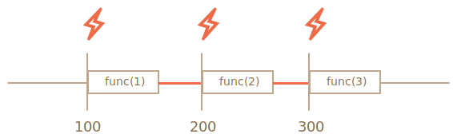
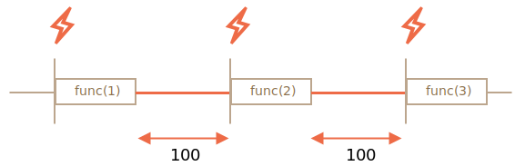

# การตั้งเวลา: setTimeout และ setInterval

บางครั้งเราไม่ได้ต้องการให้ฟังก์ชันทำงานทันที แต่ต้องการให้ทำงานในอีกสักพักหนึ่ง ซึ่งก็คือ "การตั้งเวลาเรียกฟังก์ชัน" (scheduling a call) นั่นเอง

เมธอดที่ใช้กันมี 2 ตัวด้วยกัน:

- `setTimeout` ใช้เรียกฟังก์ชัน **ครั้งเดียว** หลังจากผ่านไปตามเวลาที่กำหนด
- `setInterval` ใช้เรียกฟังก์ชัน **ซ้ำไปเรื่อยๆ** ตามช่วงเวลาที่กำหนด

เมธอดเหล่านี้ไม่ได้อยู่ในสเปกของ JavaScript โดยตรง แต่สภาพแวดล้อมส่วนใหญ่ก็มี internal scheduler และรองรับเมธอดเหล่านี้ โดยเฉพาะเบราว์เซอร์ทุกตัวและ Node.js

## setTimeout

ไวยากรณ์:

```js
let timerId = setTimeout(func|code, [delay], [arg1], [arg2], ...)
```

พารามิเตอร์:

`func|code`
: ฟังก์ชันหรือสตริงของโค้ดที่ต้องการเรียก
โดยปกติจะส่งเป็นฟังก์ชัน ส่งเป็นสตริงก็ได้เหมือนกัน (เนื่องจากเหตุผลทางประวัติศาสตร์) แต่ไม่แนะนำ

`delay`
: ระยะเวลาหน่วงก่อนเรียก หน่วยเป็นมิลลิวินาที (1000 ms = 1 วินาที) ค่าเริ่มต้นคือ 0

`arg1`, `arg2`...
: อาร์กิวเมนต์ที่จะส่งให้ฟังก์ชัน

ตัวอย่างนี้จะเรียก `sayHi()` หลังจากผ่านไป 1 วินาที:

```js run
function sayHi() {
  alert('Hello');
}

*!*
setTimeout(sayHi, 1000);
*/!*
```

พร้อมส่งอาร์กิวเมนต์:

```js run
function sayHi(phrase, who) {
  alert( phrase + ', ' + who );
}

*!*
setTimeout(sayHi, 1000, "Hello", "John"); // Hello, John
*/!*
```

ถ้าอาร์กิวเมนต์ตัวแรกเป็นสตริง JavaScript จะสร้างฟังก์ชันขึ้นมาจากสตริงนั้น

ดังนั้นโค้ดนี้ก็ใช้ได้เหมือนกัน:

```js run no-beautify
setTimeout("alert('Hello')", 1000);
```

แต่ไม่แนะนำให้ส่งเป็นสตริง ให้ใช้ arrow function แทนแบบนี้:

```js run no-beautify
setTimeout(() => alert('Hello'), 1000);
```

````smart header="ส่งฟังก์ชันเข้าไป ไม่ใช่เรียกฟังก์ชัน"
มือใหม่มักพลาดตรงที่ใส่วงเล็บ `()` ต่อท้ายฟังก์ชัน:

```js
// ผิด!
setTimeout(sayHi(), 1000);
```
แบบนี้ไม่ทำงาน เพราะ `setTimeout` ต้องการ **reference** ไปยังฟังก์ชัน แต่ `sayHi()` คือการเรียกฟังก์ชันทันที แล้วส่ง *ผลลัพธ์ที่ได้* ไปให้ `setTimeout` ซึ่งในกรณีนี้ `sayHi()` คืนค่า `undefined` (เพราะไม่ได้ return อะไร) จึงไม่มีอะไรถูกตั้งเวลาไว้เลย
````

### ยกเลิกด้วย clearTimeout

เมื่อเรียก `setTimeout` จะได้ "ตัวระบุ timer" (`timerId`) กลับมา ซึ่งใช้ยกเลิกการทำงานได้

ไวยากรณ์สำหรับยกเลิก:

```js
let timerId = setTimeout(...);
clearTimeout(timerId);
```

โค้ดด้านล่างตั้งเวลาเรียกฟังก์ชัน แล้วยกเลิกทิ้ง (เปลี่ยนใจ) ผลคือไม่มีอะไรเกิดขึ้น:

```js run no-beautify
let timerId = setTimeout(() => alert("never happens"), 1000);
alert(timerId); // ตัวระบุ timer

clearTimeout(timerId);
alert(timerId); // ตัวระบุเดิม (ไม่ได้กลายเป็น null หลังยกเลิก)
```

จะเห็นจาก `alert` ว่าในเบราว์เซอร์ ตัวระบุ timer จะเป็นตัวเลข ส่วนสภาพแวดล้อมอื่นอาจเป็นอย่างอื่นก็ได้ เช่น Node.js จะคืนค่าเป็น timer object ที่มีเมธอดเพิ่มเติม

เมธอดเหล่านี้ไม่มีสเปกกลาง จึงไม่มีปัญหาอะไร

สำหรับเบราว์เซอร์ timer อธิบายไว้ใน [ส่วน timers](https://html.spec.whatwg.org/multipage/timers-and-user-prompts.html#timers) ของ HTML Living Standard

## setInterval

เมธอด `setInterval` มีไวยากรณ์เหมือน `setTimeout`:

```js
let timerId = setInterval(func|code, [delay], [arg1], [arg2], ...)
```

อาร์กิวเมนต์ทุกตัวมีความหมายเหมือนกัน แต่ต่างจาก `setTimeout` ตรงที่ `setInterval` จะเรียกฟังก์ชัน **ซ้ำไปเรื่อยๆ** ตามช่วงเวลาที่กำหนด ไม่ใช่แค่ครั้งเดียว

หยุดการเรียกซ้ำได้ด้วย `clearInterval(timerId)`

ตัวอย่างนี้จะแสดงข้อความทุกๆ 2 วินาที แล้วหยุดหลังจาก 5 วินาที:

```js run
// ทำซ้ำทุก 2 วินาที
let timerId = setInterval(() => alert('tick'), 2000);

// หยุดหลังจาก 5 วินาที
setTimeout(() => { clearInterval(timerId); alert('stop'); }, 5000);
```

```smart header="เวลายังเดินต่อขณะที่ `alert` แสดงอยู่"
ในเบราว์เซอร์ส่วนใหญ่ รวมถึง Chrome และ Firefox ตัวจับเวลาภายในจะยังคง "เดิน" อยู่ขณะที่แสดง `alert/confirm/prompt`

ดังนั้น ถ้ารันโค้ดด้านบนแล้วไม่ปิดหน้าต่าง `alert` สักพัก พอปิดปุ๊บ `alert` ถัดไปจะแสดงขึ้นมาทันที ทำให้ช่วงเวลาระหว่าง alert แต่ละครั้งสั้นกว่า 2 วินาที
```

## setTimeout แบบซ้อน

การทำอะไรสักอย่างซ้ำๆ ตามเวลาทำได้ 2 วิธี

วิธีแรกคือใช้ `setInterval` อีกวิธีคือใช้ `setTimeout` แบบซ้อน แบบนี้:

```js
/** แทนที่จะใช้:
let timerId = setInterval(() => alert('tick'), 2000);
*/

let timerId = setTimeout(function tick() {
  alert('tick');
*!*
  timerId = setTimeout(tick, 2000); // (*)
*/!*
}, 2000);
```

`setTimeout` ด้านบนจะตั้งเวลาเรียกครั้งถัดไปตรงท้ายของการเรียกปัจจุบัน `(*)`

`setTimeout` แบบซ้อนยืดหยุ่นกว่า `setInterval` ตรงที่เราปรับเวลาของการเรียกครั้งถัดไปได้ตามผลลัพธ์ของครั้งปัจจุบัน

สมมติว่าเราต้องเขียนเซอร์วิสที่ส่ง request ไปยังเซิร์ฟเวอร์ทุกๆ 5 วินาทีเพื่อขอข้อมูล แต่ถ้าเซิร์ฟเวอร์โหลดหนัก ก็ค่อยๆ ยืดช่วงเวลาออกเป็น 10, 20, 40 วินาที...

pseudocode จะเป็นแบบนี้:
```js
let delay = 5000;

let timerId = setTimeout(function request() {
  ...send request...

  if (request failed due to server overload) {
    // ยืดช่วงเวลาสำหรับการเรียกครั้งถัดไป
    delay *= 2;
  }

  timerId = setTimeout(request, delay);

}, delay);
```


นอกจากนี้ ถ้าฟังก์ชันที่ตั้งเวลาไว้ใช้ CPU หนัก เราก็สามารถวัดเวลาที่ใช้ในการประมวลผลแล้วปรับเวลาเรียกครั้งถัดไปได้อีกด้วย

**`setTimeout` แบบซ้อนช่วยให้กำหนดเวลาหน่วงระหว่างการเรียกแต่ละครั้งได้แม่นยำกว่า `setInterval`**

มาเปรียบเทียบโค้ด 2 แบบกัน แบบแรกใช้ `setInterval`:

```js
let i = 1;
setInterval(function() {
  func(i++);
}, 100);
```

แบบที่สองใช้ `setTimeout` แบบซ้อน:

```js
let i = 1;
setTimeout(function run() {
  func(i++);
  setTimeout(run, 100);
}, 100);
```

สำหรับ `setInterval` ตัว internal scheduler จะเรียก `func(i++)` ทุกๆ 100ms:



สังเกตเห็นอะไรไหม?

**เวลาหน่วงจริงระหว่างการเรียก `func` แต่ละครั้งของ `setInterval` จะ *น้อยกว่า* ที่กำหนดไว้ในโค้ด!**

เป็นเรื่องปกติ เพราะเวลาที่ `func` ใช้ประมวลผลจะ "กินเวลา" ส่วนหนึ่งของช่วงเวลาที่กำหนดไว้

อาจเกิดกรณีที่ `func` ใช้เวลาประมวลผลนานกว่าที่คาดไว้ คือเกิน 100ms

ในกรณีนี้ engine จะรอให้ `func` ทำงานเสร็จก่อน แล้วค่อยเช็ค scheduler ถ้าถึงเวลาแล้วก็จะเรียกอีกครั้ง *ทันที*

ในกรณีสุดโต่ง ถ้าฟังก์ชันทำงานนานกว่า `delay` ทุกครั้ง ก็จะถูกเรียกซ้ำโดยไม่มีช่วงหยุดเลย

สำหรับ `setTimeout` แบบซ้อน ภาพจะเป็นแบบนี้:



**`setTimeout` แบบซ้อนรับประกันว่าจะมีเวลาหน่วงขั้นต่ำ (100ms ในตัวอย่างนี้) ระหว่างจุดสิ้นสุดของการเรียกครั้งหนึ่งกับจุดเริ่มต้นของการเรียกครั้งถัดไป**

เนื่องจากการเรียกครั้งใหม่จะถูกตั้งเวลาไว้ตอนท้ายของการเรียกครั้งก่อนเสมอ

````smart header="การเก็บขยะกับคอลแบ็กของ setInterval/setTimeout"
เมื่อส่งฟังก์ชันเข้าไปใน `setInterval/setTimeout` ระบบจะสร้าง internal reference ไปยังฟังก์ชันนั้นและเก็บไว้ใน scheduler ซึ่งป้องกันไม่ให้ฟังก์ชันถูกเก็บขยะ แม้จะไม่มี reference อื่นไปยังฟังก์ชันนั้นอยู่เลย

```js
// ฟังก์ชันจะอยู่ในหน่วยความจำจนกว่า scheduler จะเรียก
setTimeout(function() {...}, 100);
```

สำหรับ `setInterval` ฟังก์ชันจะอยู่ในหน่วยความจำจนกว่าจะเรียก `clearInterval`

แต่มีผลข้างเคียงอยู่ ฟังก์ชันจะอ้างอิงถึง outer Lexical Environment ด้วย ดังนั้นตราบใดที่ฟังก์ชันยังอยู่ ตัวแปรภายนอกก็จะยังอยู่เช่นกัน ซึ่งอาจกินหน่วยความจำมากกว่าตัวฟังก์ชันเสียอีก เพราะฉะนั้นเมื่อไม่ต้องการฟังก์ชันที่ตั้งเวลาไว้แล้ว ควรยกเลิกทิ้ง แม้ว่าฟังก์ชันจะเล็กก็ตาม
````

## setTimeout แบบหน่วงศูนย์

มีกรณีพิเศษคือ `setTimeout(func, 0)` หรือเขียนสั้นๆ ว่า `setTimeout(func)`

วิธีนี้จะตั้งเวลาให้ `func` ทำงานเร็วที่สุดเท่าที่จะเป็นไปได้ แต่ scheduler จะเรียกฟังก์ชันหลังจากสคริปต์ปัจจุบันทำงานเสร็จแล้วเท่านั้น

พูดง่ายๆ ก็คือ ฟังก์ชันจะถูกเรียก "ทันที" หลังจากโค้ดปัจจุบันจบ

ตัวอย่างนี้จะแสดง "Hello" ก่อน แล้วตามด้วย "World" ทันที:

```js run
setTimeout(() => alert("World"));

alert("Hello");
```

บรรทัดแรก "จองคิวเรียกฟังก์ชันหลังจาก 0ms" แต่ scheduler จะ "เช็คคิว" หลังจากสคริปต์ปัจจุบันเสร็จแล้วเท่านั้น ดังนั้น `"Hello"` จึงแสดงก่อน แล้ว `"World"` ถึงจะตามมา

กรณีใช้งาน setTimeout แบบหน่วงศูนย์ในเบราว์เซอร์ขั้นสูงขึ้นจะกล่าวถึงในบท <info:event-loop>

````smart header="หน่วงศูนย์จริงๆ แล้วไม่ใช่ศูนย์ (ในเบราว์เซอร์)"
ในเบราว์เซอร์มีข้อจำกัดเรื่องความถี่ที่ timer ซ้อนกันจะทำงานได้ ตาม [HTML Living Standard](https://html.spec.whatwg.org/multipage/timers-and-user-prompts.html#timers) ระบุว่า: "หลังจาก timer ซ้อนกัน 5 ชั้น ช่วงเวลาจะถูกบังคับให้เป็นอย่างน้อย 4 มิลลิวินาที"

มาดูว่าหมายความว่าอย่างไรจากตัวอย่างด้านล่าง `setTimeout` ในโค้ดนี้จะตั้งเวลาเรียกตัวเองซ้ำด้วย delay เป็นศูนย์ แต่ละครั้งจะบันทึกเวลาจริงจากการเรียกครั้งก่อนไว้ในอาร์เรย์ `times` มาดูกันว่า delay จริงๆ เป็นเท่าไหร่:

```js run
let start = Date.now();
let times = [];

setTimeout(function run() {
  times.push(Date.now() - start); // บันทึก delay จากการเรียกครั้งก่อน

  if (start + 100 < Date.now()) alert(times); // แสดง delay ทั้งหมดหลังจากผ่านไป 100ms
  else setTimeout(run); // ถ้ายังไม่ถึง ตั้งเวลาเรียกใหม่
});

// ตัวอย่างผลลัพธ์:
// 1,1,1,1,9,15,20,24,30,35,40,45,50,55,59,64,70,75,80,85,90,95,100
```

timer รอบแรกๆ จะทำงานทันที (ตามที่สเปกระบุไว้) หลังจากนั้นจะเริ่มเห็น `9, 15, 20, 24...` ซึ่งเป็นผลจาก delay บังคับขั้นต่ำ 4ms ขึ้นไปนั่นเอง

ใช้ `setInterval` แทน `setTimeout` ก็ได้ผลเหมือนกัน: `setInterval(f)` จะเรียก `f` รอบแรกๆ ด้วย delay เป็นศูนย์ แล้วหลังจากนั้นจะมี delay 4ms ขึ้นไป

ข้อจำกัดนี้มีมาตั้งแต่สมัยก่อน และสคริปต์จำนวนมากพึ่งพาพฤติกรรมนี้อยู่ จึงยังคงอยู่ด้วยเหตุผลทางประวัติศาสตร์

สำหรับ JavaScript ฝั่งเซิร์ฟเวอร์ไม่มีข้อจำกัดนี้ และยังมีวิธีอื่นในการตั้งเวลา asynchronous job แบบทันทีอีกด้วย เช่น [setImmediate](https://nodejs.org/api/timers.html#timers_setimmediate_callback_args) ใน Node.js ข้อจำกัดนี้จึงเป็นเรื่องเฉพาะเบราว์เซอร์เท่านั้น
````

## สรุป

- เมธอด `setTimeout(func, delay, ...args)` และ `setInterval(func, delay, ...args)` ช่วยให้เรียกฟังก์ชันครั้งเดียว/ซ้ำๆ หลังจากผ่านไป `delay` มิลลิวินาที
- ยกเลิกการทำงานได้ด้วย `clearTimeout/clearInterval` โดยส่งค่าที่ได้จาก `setTimeout/setInterval` เข้าไป
- `setTimeout` แบบซ้อนเป็นทางเลือกที่ยืดหยุ่นกว่า `setInterval` และยังกำหนดเวลา *ระหว่าง* การเรียกแต่ละครั้งได้แม่นยำกว่าด้วย
- การตั้งเวลาแบบหน่วงศูนย์ด้วย `setTimeout(func, 0)` (หรือ `setTimeout(func)`) ใช้เมื่อต้องการเรียกฟังก์ชัน "เร็วที่สุดเท่าที่จะได้ แต่ต้องรอให้สคริปต์ปัจจุบันเสร็จก่อน"
- เบราว์เซอร์จำกัด delay ขั้นต่ำของ `setTimeout` หรือ `setInterval` ที่ซ้อนกันตั้งแต่ 5 ชั้นขึ้นไปไว้ที่ 4ms ด้วยเหตุผลทางประวัติศาสตร์

อย่าลืมว่าเมธอดตั้งเวลาทั้งหมดไม่ได้ *รับประกัน* ว่า delay จะตรงเป๊ะ

ตัวอย่างเช่น timer ในเบราว์เซอร์อาจช้าลงได้จากหลายสาเหตุ:
- CPU โหลดหนัก
- แท็บเบราว์เซอร์อยู่ในโหมดพื้นหลัง
- แล็ปท็อปอยู่ในโหมดประหยัดแบตเตอรี่

ทั้งหมดนี้อาจทำให้ความละเอียดขั้นต่ำของ timer (delay ขั้นต่ำ) เพิ่มขึ้นเป็น 300ms หรือแม้แต่ 1000ms ขึ้นอยู่กับเบราว์เซอร์และการตั้งค่าประสิทธิภาพระดับ OS
