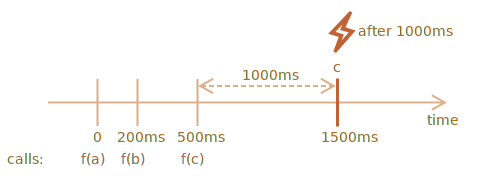

importance: 5

---

# Debounce decorator

ผลลัพธ์ของ decorator `debounce(f, ms)` คือ wrapper ที่จะระงับการเรียก `f` จนกว่าจะผ่านไป `ms` มิลลิวินาทีโดยไม่มีการเรียกเข้ามาอีก (ช่วง "พักเย็น") จากนั้นจึงเรียก `f` หนึ่งครั้งด้วยอาร์กิวเมนต์ล่าสุด

พูดง่ายๆ `debounce` ก็เหมือนเลขาที่รับ "สายโทรศัพท์" แล้วรอจนกว่าจะเงียบไป `ms` มิลลิวินาที จากนั้นจึงส่งต่อข้อมูลจากสายล่าสุดให้ "เจ้านาย" (เรียกฟังก์ชัน `f` จริงๆ)

ยกตัวอย่าง สมมติเรามีฟังก์ชัน `f` แล้วแทนที่ด้วย `f = debounce(f, 1000)`

ถ้า wrapped function ถูกเรียกที่ 0ms, 200ms และ 500ms แล้วไม่มีการเรียกอีก ฟังก์ชัน `f` จริงจะถูกเรียกแค่ครั้งเดียวที่ 1500ms คือหลังจากช่วงพักเย็น 1000ms นับจากการเรียกครั้งสุดท้าย



...และจะได้รับอาร์กิวเมนต์ของการเรียกครั้งสุดท้ายเท่านั้น การเรียกก่อนหน้าจะถูกเพิกเฉย

นี่คือตัวอย่างโค้ด (ใช้ debounce decorator จาก[ไลบรารี Lodash](https://lodash.com/docs/4.17.15#debounce)):

```js
let f = _.debounce(alert, 1000);

f("a");
setTimeout( () => f("b"), 200);
setTimeout( () => f("c"), 500);
// debounced function รอ 1000ms หลังการเรียกครั้งสุดท้าย แล้วจึงรัน: alert("c")
```

ทีนี้มาดูตัวอย่างจริง สมมติผู้ใช้กำลังพิมพ์อะไรบางอย่าง แล้วเราต้องการส่ง request ไปเซิร์ฟเวอร์เมื่อพิมพ์เสร็จ

ไม่มีประโยชน์ที่จะส่ง request ทุกครั้งที่กดตัวอักษร เราควรรอ แล้วค่อยส่งผลลัพธ์ทั้งหมดไปทีเดียว

ในเว็บเบราว์เซอร์ เราตั้ง event handler ได้ ซึ่งก็คือฟังก์ชันที่ถูกเรียกทุกครั้งที่ input field เปลี่ยนแปลง ปกติ event handler จะถูกเรียกถี่มาก ทุกครั้งที่กดปุ่ม แต่ถ้าเรา `debounce` มันด้วย 1000ms จะถูกเรียกแค่ครั้งเดียว หลังจาก 1000ms นับจากการพิมพ์ครั้งสุดท้าย

```online

ในตัวอย่าง live นี้ handler จะแสดงผลลัพธ์ในกล่องด้านล่าง ลองพิมพ์ดู:

[iframe border=1 src="debounce" height=200]

เห็นไหม? input ช่องที่สองเรียก debounced function ดังนั้นเนื้อหาจะถูกประมวลผลหลังจาก 1000ms นับจากการพิมพ์ครั้งสุดท้าย
```

สรุปแล้ว `debounce` เหมาะสำหรับจัดการเหตุการณ์ที่มาต่อเนื่อง ไม่ว่าจะเป็นการกดปุ่ม การเลื่อนเมาส์ หรืออื่นๆ

มันจะรอตามเวลาที่กำหนดหลังจากการเรียกครั้งสุดท้าย แล้วจึงรันฟังก์ชันเพื่อประมวลผลลัพธ์

โจทย์คือให้เขียน `debounce` decorator

คำใบ้: ถ้าคิดดีๆ แล้วใช้แค่ไม่กี่บรรทัดเอง :)
