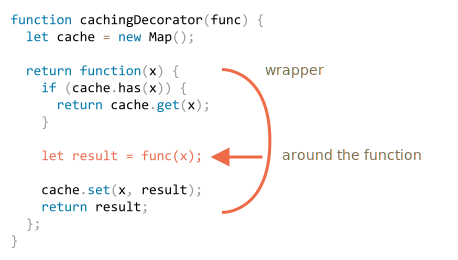

# Decorator และการส่งต่อด้วย call/apply

JavaScript มีความยืดหยุ่นสูงมากเวลาจัดการกับฟังก์ชัน เราสามารถส่งฟังก์ชันไปมา ใช้เป็นออบเจ็กต์ได้ และในบทนี้เราจะมาดูวิธี *ส่งต่อ* การเรียกฟังก์ชัน (forwarding) และ *ตกแต่ง* ฟังก์ชัน (decorating) กัน

## Transparent caching

สมมติว่าเรามีฟังก์ชัน `slow(x)` ที่ใช้ CPU หนักมาก แต่ผลลัพธ์คงที่ — สำหรับค่า `x` เดิมจะได้ผลลัพธ์เดิมเสมอ

ถ้าฟังก์ชันนี้ถูกเรียกบ่อยๆ เราอาจจะอยากแคช (จดจำ) ผลลัพธ์เอาไว้ จะได้ไม่ต้องคำนวณซ้ำ

แต่แทนที่จะไปเพิ่มฟีเจอร์นี้เข้าไปใน `slow()` ตรงๆ เราจะสร้างฟังก์ชัน wrapper ครอบอีกที เพื่อเพิ่มความสามารถด้านการแคชเข้าไป ซึ่งวิธีนี้มีข้อดีหลายอย่างอย่างที่เราจะได้เห็นกัน

มาดูโค้ดกัน แล้วค่อยอธิบายทีหลัง:

```js run
function slow(x) {
  // อาจมีงานหนักๆ ที่ใช้ CPU สูงอยู่ตรงนี้
  alert(`Called with ${x}`);
  return x;
}

function cachingDecorator(func) {
  let cache = new Map();

  return function(x) {
    if (cache.has(x)) {    // ถ้ามี key นี้ในแคชแล้ว
      return cache.get(x); // ก็อ่านผลลัพธ์จากแคชเลย
    }

    let result = func(x);  // ถ้ายังไม่มี ก็เรียกฟังก์ชันจริง

    cache.set(x, result);  // แล้วเก็บผลลัพธ์ลงแคช
    return result;
  };
}

slow = cachingDecorator(slow);

alert( slow(1) ); // slow(1) ถูกแคชไว้ แล้วคืนค่าผลลัพธ์
alert( "Again: " + slow(1) ); // คืนค่าผลลัพธ์ของ slow(1) จากแคช

alert( slow(2) ); // slow(2) ถูกแคชไว้ แล้วคืนค่าผลลัพธ์
alert( "Again: " + slow(2) ); // คืนค่าผลลัพธ์ของ slow(2) จากแคช
```

จากโค้ดด้านบน `cachingDecorator` คือ *decorator* — ฟังก์ชันพิเศษที่รับฟังก์ชันอื่นเข้ามาแล้วปรับเปลี่ยนพฤติกรรมของมัน

แนวคิดก็คือ เราสามารถเรียก `cachingDecorator` กับฟังก์ชันไหนก็ได้ แล้วมันจะคืน wrapper ที่มีการแคชให้ สะดวกมากเพราะถ้ามีหลายฟังก์ชันที่ต้องการฟีเจอร์นี้ เราแค่เอา `cachingDecorator` ไปครอบมันก็พอ

นอกจากนี้ การแยกโลจิกการแคชออกจากฟังก์ชันหลัก ยังทำให้โค้ดของฟังก์ชันหลักเรียบง่ายขึ้นด้วย

ผลลัพธ์ของ `cachingDecorator(func)` คือ "wrapper" — `function(x)` ที่ "ครอบ" การเรียก `func(x)` ด้วยโลจิกการแคช:



จากมุมมองของโค้ดภายนอก ฟังก์ชัน `slow` ที่ถูกครอบแล้วยังทำงานเหมือนเดิม แค่เพิ่มความสามารถด้านการแคชเข้ามา

สรุปแล้ว การใช้ `cachingDecorator` แยกต่างหากแทนที่จะไปแก้โค้ดของ `slow` โดยตรง มีข้อดีหลายอย่าง:

- `cachingDecorator` นำกลับมาใช้ซ้ำได้ เอาไปใช้กับฟังก์ชันอื่นได้เลย
- โลจิกการแคชแยกออกมาต่างหาก ไม่ไปเพิ่มความซับซ้อนให้กับ `slow`
- สามารถรวม decorator หลายตัวเข้าด้วยกันได้ ถ้าต้องการ (จะเห็นตัวอย่างเพิ่มเติมภายหลัง)

## ใช้ "func.call" เพื่อกำหนด context

decorator สำหรับแคชที่เราสร้างไว้ด้านบน ยังใช้กับเมธอดของออบเจ็กต์ไม่ได้

ตัวอย่างเช่น ในโค้ดด้านล่าง `worker.slow()` จะพังหลังจากถูก decorate:

```js run
// เราจะเพิ่มแคชให้ worker.slow
let worker = {
  someMethod() {
    return 1;
  },

  slow(x) {
    // งานหนักที่ใช้ CPU สูงอยู่ตรงนี้
    alert("Called with " + x);
    return x * this.someMethod(); // (*)
  }
};

// โค้ดเหมือนเดิม
function cachingDecorator(func) {
  let cache = new Map();
  return function(x) {
    if (cache.has(x)) {
      return cache.get(x);
    }
*!*
    let result = func(x); // (**)
*/!*
    cache.set(x, result);
    return result;
  };
}

alert( worker.slow(1) ); // เมธอดเดิมทำงานได้ปกติ

worker.slow = cachingDecorator(worker.slow); // เพิ่มแคชเข้าไป

*!*
alert( worker.slow(2) ); // เกิดข้อผิดพลาด! Cannot read property 'someMethod' of undefined
*/!*
```

error เกิดขึ้นที่บรรทัด `(*)` ตอนที่พยายามเข้าถึง `this.someMethod` แล้วล้มเหลว เห็นสาเหตุไหม?

เหตุผลก็เพราะ wrapper เรียกฟังก์ชันเดิมด้วย `func(x)` ที่บรรทัด `(**)` ซึ่งเมื่อเรียกแบบนี้ ฟังก์ชันจะได้ `this = undefined`

จะเห็นอาการเดียวกันถ้าลองรัน:

```js
let func = worker.slow;
func(2);
```

wrapper ส่งต่อการเรียกไปยังเมธอดเดิม แต่ไม่ได้ส่ง context `this` ไปด้วย จึงเกิด error

มาแก้ปัญหานี้กัน

มีเมธอด built-in อยู่ตัวหนึ่งคือ [func.call(context, ...args)](mdn:js/Function/call) ที่ช่วยให้เราเรียกฟังก์ชันพร้อมกำหนดค่า `this` ได้เอง

ไวยากรณ์คือ:

```js
func.call(context, arg1, arg2, ...)
```

มันจะรัน `func` โดยกำหนด `this` เป็นอาร์กิวเมนต์ตัวแรก และตัวถัดไปเป็นอาร์กิวเมนต์ของฟังก์ชัน

พูดง่ายๆ ก็คือ สองบรรทัดนี้ทำงานเกือบเหมือนกัน:
```js
func(1, 2, 3);
func.call(obj, 1, 2, 3)
```

ทั้งสองเรียก `func` ด้วยอาร์กิวเมนต์ `1`, `2` และ `3` ต่างกันแค่ `func.call` จะกำหนด `this` เป็น `obj` ด้วย

ลองดูตัวอย่าง เราเรียก `sayHi` ในบริบทของออบเจ็กต์ต่างกัน: `sayHi.call(user)` จะรัน `sayHi` โดยกำหนด `this=user` และบรรทัดถัดไปกำหนด `this=admin`:

```js run
function sayHi() {
  alert(this.name);
}

let user = { name: "John" };
let admin = { name: "Admin" };

// ใช้ call เพื่อส่งออบเจ็กต์ต่างๆ เข้าไปเป็น "this"
sayHi.call( user ); // John
sayHi.call( admin ); // Admin
```

และตรงนี้เราใช้ `call` เพื่อเรียก `say` พร้อมกำหนด context และข้อความ:


```js run
function say(phrase) {
  alert(this.name + ': ' + phrase);
}

let user = { name: "John" };

// user กลายเป็น this และ "Hello" เป็นอาร์กิวเมนต์ตัวแรก
say.call( user, "Hello" ); // John: Hello
```

ในกรณีของเรา สามารถใช้ `call` ใน wrapper เพื่อส่ง context ไปยังฟังก์ชันเดิมได้แบบนี้:

```js run
let worker = {
  someMethod() {
    return 1;
  },

  slow(x) {
    alert("Called with " + x);
    return x * this.someMethod(); // (*)
  }
};

function cachingDecorator(func) {
  let cache = new Map();
  return function(x) {
    if (cache.has(x)) {
      return cache.get(x);
    }
*!*
    let result = func.call(this, x); // ตอนนี้ "this" ถูกส่งต่อไปอย่างถูกต้องแล้ว
*/!*
    cache.set(x, result);
    return result;
  };
}

worker.slow = cachingDecorator(worker.slow); // เพิ่มแคชเข้าไป

alert( worker.slow(2) ); // ทำงานได้แล้ว
alert( worker.slow(2) ); // ทำงานได้ ไม่ได้เรียกฟังก์ชันเดิม (ใช้จากแคช)
```

ตอนนี้ทุกอย่างทำงานได้ถูกต้องแล้ว

เพื่อให้เห็นภาพชัดๆ มาดูกันว่า `this` ถูกส่งต่อไปอย่างไร:

1. หลังจาก decorate แล้ว `worker.slow` จะกลายเป็น wrapper `function (x) { ... }`
2. เมื่อเรียก `worker.slow(2)` wrapper จะได้ `2` เป็นอาร์กิวเมนต์ และ `this=worker` (เป็นออบเจ็กต์ที่อยู่ก่อนจุด)
3. ภายใน wrapper ถ้ายังไม่มีผลลัพธ์ในแคช `func.call(this, x)` จะส่ง `this` ปัจจุบัน (`=worker`) และอาร์กิวเมนต์ (`=2`) ไปยังเมธอดเดิม

## รองรับหลายอาร์กิวเมนต์

ทีนี้มาทำให้ `cachingDecorator` ใช้งานได้หลากหลายขึ้น ตอนนี้มันรองรับแค่ฟังก์ชันที่รับอาร์กิวเมนต์ตัวเดียว

แล้วถ้าต้องการแคชเมธอด `worker.slow` ที่รับหลายอาร์กิวเมนต์ล่ะ?

```js
let worker = {
  slow(min, max) {
    return min + max; // สมมติว่าเป็นงานหนัก
  }
};

// ต้องจำผลลัพธ์สำหรับอาร์กิวเมนต์ชุดเดียวกัน
worker.slow = cachingDecorator(worker.slow);
```

ก่อนหน้านี้ เราแค่ใช้ `cache.set(x, result)` เพื่อบันทึกผลลัพธ์ และ `cache.get(x)` เพื่อดึงมาใช้ แต่ตอนนี้เราต้องจำผลลัพธ์สำหรับ *การรวมกัน* ของอาร์กิวเมนต์ `(min,max)` ซึ่ง `Map` รับค่าเดียวเป็น key เท่านั้น

มีวิธีแก้หลายทาง:

1. สร้างโครงสร้างข้อมูลแบบ map-like ใหม่ (หรือใช้ third-party) ที่รองรับหลาย key
2. ใช้ map ซ้อนกัน: `cache.set(min)` จะเป็น `Map` ที่เก็บคู่ `(max, result)` แล้วดึงผลลัพธ์ด้วย `cache.get(min).get(max)`
3. รวมสองค่าเป็นค่าเดียว ในกรณีนี้เราใช้สตริง `"min,max"` เป็น key ของ `Map` ได้เลย และเพื่อความยืดหยุ่น เราสามารถให้ decorator รับ *hashing function* ที่ช่วยรวมหลายค่าเป็นค่าเดียว

สำหรับงานจริงส่วนใหญ่ วิธีที่ 3 ก็เพียงพอแล้ว เราจะใช้วิธีนี้

อีกอย่างที่ต้องแก้คือ แทนที่จะส่งแค่ `x` เราต้องส่งอาร์กิวเมนต์ทั้งหมดเข้า `func.call` ใน `function()` เราสามารถดึง pseudo-array ของอาร์กิวเมนต์ได้จาก `arguments` ดังนั้น `func.call(this, x)` จะเปลี่ยนเป็น `func.call(this, ...arguments)`

นี่คือ `cachingDecorator` เวอร์ชันที่ทรงพลังขึ้น:

```js run
let worker = {
  slow(min, max) {
    alert(`Called with ${min},${max}`);
    return min + max;
  }
};

function cachingDecorator(func, hash) {
  let cache = new Map();
  return function() {
*!*
    let key = hash(arguments); // (*)
*/!*
    if (cache.has(key)) {
      return cache.get(key);
    }

*!*
    let result = func.call(this, ...arguments); // (**)
*/!*

    cache.set(key, result);
    return result;
  };
}

function hash(args) {
  return args[0] + ',' + args[1];
}

worker.slow = cachingDecorator(worker.slow, hash);

alert( worker.slow(3, 5) ); // ทำงานได้
alert( "Again " + worker.slow(3, 5) ); // เหมือนเดิม (จากแคช)
```

ตอนนี้รองรับอาร์กิวเมนต์กี่ตัวก็ได้แล้ว (แต่ hash function ต้องปรับให้รองรับด้วย ซึ่งเราจะพูดถึงวิธีที่น่าสนใจด้านล่าง)

มีการเปลี่ยนแปลงสองจุด:

- บรรทัด `(*)` เรียก `hash` เพื่อสร้าง key เดียวจาก `arguments` ตรงนี้เราใช้ฟังก์ชัน "joining" ง่ายๆ ที่แปลงอาร์กิวเมนต์ `(3, 5)` เป็น key `"3,5"` กรณีที่ซับซ้อนกว่านี้อาจต้องใช้ hashing function แบบอื่น
- จากนั้นบรรทัด `(**)` ใช้ `func.call(this, ...arguments)` เพื่อส่งทั้ง context และอาร์กิวเมนต์ทั้งหมดที่ wrapper ได้รับ (ไม่ใช่แค่ตัวแรก) ไปยังฟังก์ชันเดิม

## func.apply

แทนที่จะใช้ `func.call(this, ...arguments)` เราสามารถใช้ `func.apply(this, arguments)` ก็ได้

ไวยากรณ์ของเมธอด built-in [func.apply](mdn:js/Function/apply) คือ:

```js
func.apply(context, args)
```

มันจะรัน `func` โดยกำหนด `this=context` และใช้ออบเจ็กต์แบบ array-like `args` เป็นรายการอาร์กิวเมนต์

ข้อแตกต่างทางไวยากรณ์ระหว่าง `call` กับ `apply` มีแค่อย่างเดียว — `call` รับอาร์กิวเมนต์เป็นรายการ ส่วน `apply` รับเป็นออบเจ็กต์แบบ array-like

ดังนั้นสองบรรทัดนี้จึงเกือบเหมือนกัน:

```js
func.call(context, ...args);
func.apply(context, args);
```

ทั้งสองเรียก `func` ด้วย context และอาร์กิวเมนต์เดียวกัน

มีข้อแตกต่างเล็กน้อยเกี่ยวกับ `args`:

- spread syntax `...` สามารถส่ง *iterable* `args` เป็นรายการให้ `call` ได้
- `apply` รับเฉพาะ *array-like* `args` เท่านั้น

...สำหรับออบเจ็กต์ที่เป็นทั้ง iterable และ array-like (เช่นอาร์เรย์จริงๆ) จะใช้ตัวไหนก็ได้ แต่ `apply` น่าจะเร็วกว่า เพราะ JavaScript engine ส่วนใหญ่ optimize ไว้ดีกว่า

การส่งต่ออาร์กิวเมนต์ทั้งหมดพร้อม context ไปยังอีกฟังก์ชันหนึ่ง เรียกว่า *call forwarding*

รูปแบบที่ง่ายที่สุดก็คือ:

```js
let wrapper = function() {
  return func.apply(this, arguments);
};
```

เมื่อโค้ดภายนอกเรียก `wrapper` ดังกล่าว จะแยกไม่ออกเลยว่ากำลังเรียก wrapper หรือฟังก์ชันเดิม `func`

## ยืมเมธอดมาใช้ (Method borrowing) [#method-borrowing]

ทีนี้มาปรับปรุง hashing function กันอีกนิด:

```js
function hash(args) {
  return args[0] + ',' + args[1];
}
```

ตอนนี้มันรองรับแค่สองอาร์กิวเมนต์ ถ้าทำให้รวมอาร์กิวเมนต์กี่ตัวก็ได้จะดีกว่า

วิธีที่น่าจะนึกออกก่อนคือใช้เมธอด [arr.join](mdn:js/Array/join):

```js
function hash(args) {
  return args.join();
}
```

...แต่ว่าใช้ไม่ได้ เพราะเราเรียก `hash(arguments)` ซึ่งออบเจ็กต์ `arguments` เป็นทั้ง iterable และ array-like แต่ไม่ใช่อาร์เรย์จริงๆ

การเรียก `join` จึงล้มเหลว ดังที่เห็นด้านล่าง:

```js run
function hash() {
*!*
  alert( arguments.join() ); // Error: arguments.join is not a function
*/!*
}

hash(1, 2);
```

แต่ก็ยังมีวิธีง่ายๆ ที่จะใช้ array join ได้:

```js run
function hash() {
*!*
  alert( [].join.call(arguments) ); // 1,2
*/!*
}

hash(1, 2);
```

เทคนิคนี้เรียกว่า *method borrowing* (การยืมเมธอด)

เราหยิบ (ยืม) เมธอด join มาจากอาร์เรย์ธรรมดา (`[].join`) แล้วใช้ `[].join.call` เพื่อรันมันในบริบทของ `arguments`

ทำไมถึงใช้ได้?

เพราะอัลกอริทึมภายในของเมธอด `arr.join(glue)` นั้นเรียบง่ายมาก

ตามสเปกคร่าวๆ ทำงานดังนี้:

1. กำหนดให้ `glue` เป็นอาร์กิวเมนต์ตัวแรก หรือถ้าไม่มีก็ใช้จุลภาค `","`
2. กำหนดให้ `result` เป็นสตริงว่าง
3. ต่อ `this[0]` เข้ากับ `result`
4. ต่อ `glue` และ `this[1]`
5. ต่อ `glue` และ `this[2]`
6. ...ทำแบบนี้ไปจนถึง `this.length` รายการ
7. คืนค่า `result`

จะเห็นว่า join เอา `this` มาเชื่อม `this[0]`, `this[1]` ...เข้าด้วยกัน มันถูกเขียนมาให้รองรับ array-like `this` ตัวใดก็ได้ (ไม่ใช่เรื่องบังเอิญ เมธอดหลายตัวก็ทำแบบนี้) จึงใช้กับ `this=arguments` ได้เช่นกัน

## Decorator กับพร็อพเพอร์ตี้ของฟังก์ชัน

โดยทั่วไปการแทนที่ฟังก์ชันหรือเมธอดด้วยเวอร์ชันที่ decorate แล้วจะปลอดภัย ยกเว้นอยู่อย่างหนึ่ง — ถ้าฟังก์ชันเดิมมีพร็อพเพอร์ตี้ติดอยู่ เช่น `func.calledCount` หรืออะไรก็ตาม ตัว decorator จะไม่มีพร็อพเพอร์ตี้เหล่านั้น เพราะมันเป็นแค่ wrapper จึงต้องระวังตรงนี้ด้วย

ยกตัวอย่าง ถ้า `slow` มีพร็อพเพอร์ตี้ติดอยู่ `cachingDecorator(slow)` ที่ได้มาจะเป็น wrapper ที่ไม่มีพร็อพเพอร์ตี้เหล่านั้น

decorator บางตัวอาจมีพร็อพเพอร์ตี้ของตัวเอง เช่น decorator ที่นับจำนวนครั้งที่ฟังก์ชันถูกเรียก หรือใช้เวลานานเท่าไหร่ แล้วเปิดให้เข้าถึงข้อมูลเหล่านี้ผ่านพร็อพเพอร์ตี้ของ wrapper

มีวิธีสร้าง decorator ที่เข้าถึงพร็อพเพอร์ตี้ของฟังก์ชันเดิมได้ แต่ต้องใช้ออบเจ็กต์ `Proxy` พิเศษมาครอบฟังก์ชัน ซึ่งเราจะพูดถึงในบทความ <info:proxy#proxy-apply>

## สรุป

*Decorator* คือ wrapper ที่ครอบฟังก์ชันเพื่อปรับเปลี่ยนพฤติกรรม โดยงานหลักยังคงเป็นของฟังก์ชันเดิม

มองว่า decorator เป็น "ฟีเจอร์" หรือ "ความสามารถ" ที่เพิ่มเข้าไปในฟังก์ชันก็ได้ จะเพิ่มกี่ตัวก็ได้ โดยไม่ต้องแก้โค้ดเดิมเลย!

ในการสร้าง `cachingDecorator` เราได้เรียนรู้เมธอดเหล่านี้:

- [func.call(context, arg1, arg2...)](mdn:js/Function/call) -- เรียก `func` ด้วย context และอาร์กิวเมนต์ที่กำหนด
- [func.apply(context, args)](mdn:js/Function/apply) -- เรียก `func` โดยส่ง `context` เป็น `this` และ array-like `args` เป็นรายการอาร์กิวเมนต์

*call forwarding* ทั่วไปจะใช้ `apply`:

```js
let wrapper = function() {
  return original.apply(this, arguments);
};
```

เรายังได้เห็นตัวอย่างของ *method borrowing* ที่เราหยิบเมธอดจากออบเจ็กต์หนึ่งมา `call` ในบริบทของอีกออบเจ็กต์หนึ่ง การหยิบเมธอดของอาร์เรย์มาใช้กับ `arguments` เป็นเรื่องที่พบได้บ่อย อีกทางเลือกหนึ่งคือใช้ rest parameters ซึ่งเป็นอาร์เรย์จริง

Decorator มีอีกหลายรูปแบบนอกจากนี้ ลองทดสอบความเข้าใจด้วยโจทย์ฝึกหัดในบทนี้กัน
