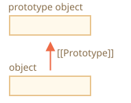
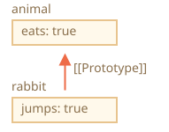
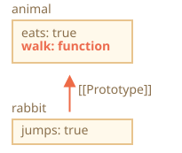
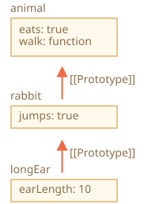
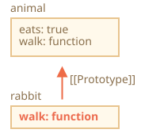
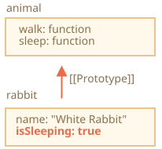
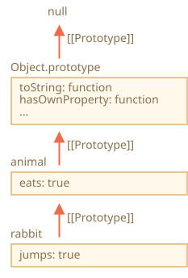

# การสืบทอดแบบโปรโตไทป์ (Prototypal inheritance)

ในการเขียนโปรแกรม เรามักต้องการนำสิ่งที่มีอยู่แล้วมาต่อยอด

ยกตัวอย่างเช่น เรามีออบเจ็กต์ `user` ที่มีพร็อพเพอร์ตี้และเมธอดต่างๆ แล้วอยากจะสร้าง `admin` กับ `guest` ที่ปรับเปลี่ยนจาก `user` เล็กน้อย เราอยากนำสิ่งที่มีอยู่ใน `user` มาใช้ซ้ำได้เลย ไม่ต้องก๊อปปี้หรือเขียนเมธอดใหม่ แค่สร้างออบเจ็กต์ใหม่ต่อยอดจาก `user` ได้เลย

*การสืบทอดแบบโปรโตไทป์ (Prototypal inheritance)* เป็นฟีเจอร์ของภาษาที่ช่วยเรื่องนี้ได้พอดี

## [[Prototype]]

ออบเจ็กต์ใน JavaScript มีพร็อพเพอร์ตี้พิเศษที่ซ่อนอยู่ชื่อ `[[Prototype]]` (ตามชื่อในสเปค) ซึ่งมีค่าเป็น `null` หรือเป็นการอ้างอิงไปยังออบเจ็กต์อีกตัวหนึ่ง ออบเจ็กต์ตัวนั้นเราเรียกว่า "โปรโตไทป์" (prototype):



เวลาอ่านพร็อพเพอร์ตี้จาก `object` แล้วหาไม่เจอ JavaScript จะไปหาจากโปรโตไทป์ให้โดยอัตโนมัติ ในการเขียนโปรแกรมเราเรียกกลไกนี้ว่า "การสืบทอดแบบโปรโตไทป์" (prototypal inheritance) ต่อจากนี้เราจะได้เห็นตัวอย่างมากมาย รวมถึงฟีเจอร์เจ๋งๆ ที่สร้างอยู่บนพื้นฐานของกลไกนี้

`[[Prototype]]` เป็นพร็อพเพอร์ตี้ภายในที่ซ่อนอยู่ แต่มีหลายวิธีในการกำหนดค่าได้

วิธีหนึ่งคือใช้ชื่อพิเศษ `__proto__` แบบนี้:

```js run
let animal = {
  eats: true
};
let rabbit = {
  jumps: true
};

*!*
rabbit.__proto__ = animal; // กำหนดให้ rabbit.[[Prototype]] = animal
*/!*
```

ทีนี้ถ้าเราอ่านพร็อพเพอร์ตี้จาก `rabbit` แล้วหาไม่เจอ JavaScript จะไปดึงจาก `animal` ให้เอง

ลองดูตัวอย่าง:

```js
let animal = {
  eats: true
};
let rabbit = {
  jumps: true
};

*!*
rabbit.__proto__ = animal; // (*)
*/!*

// ตอนนี้เราหาพร็อพเพอร์ตี้ทั้งสองตัวได้จาก rabbit:
*!*
alert( rabbit.eats ); // true (**)
*/!*
alert( rabbit.jumps ); // true
```

บรรทัด `(*)` กำหนดให้ `animal` เป็นโปรโตไทป์ของ `rabbit`

จากนั้นเมื่อ `alert` พยายามอ่านพร็อพเพอร์ตี้ `rabbit.eats` `(**)` ซึ่งไม่มีอยู่ใน `rabbit` JavaScript จะไล่ตาม `[[Prototype]]` ขึ้นไปจนเจอใน `animal` (ดูจากล่างขึ้นบน):



ตรงนี้เราพูดได้ว่า "`animal` เป็นโปรโตไทป์ของ `rabbit`" หรือ "`rabbit` สืบทอดมาจาก `animal` ผ่านโปรโตไทป์"

ดังนั้นถ้า `animal` มีพร็อพเพอร์ตี้และเมธอดที่มีประโยชน์อยู่เยอะ สิ่งเหล่านั้นจะใช้ได้จาก `rabbit` โดยอัตโนมัติ พร็อพเพอร์ตี้แบบนี้เรียกว่า "สืบทอดมา" (inherited)

ถ้า `animal` มีเมธอดอยู่ เราก็เรียกใช้จาก `rabbit` ได้เลย:

```js run
let animal = {
  eats: true,
*!*
  walk() {
    alert("Animal walk");
  }
*/!*
};

let rabbit = {
  jumps: true,
  __proto__: animal
};

// walk ถูกดึงมาจากโปรโตไทป์
*!*
rabbit.walk(); // Animal walk
*/!*
```

เมธอดถูกดึงมาจากโปรโตไทป์โดยอัตโนมัติ ตามภาพนี้:



ห่วงโซ่โปรโตไทป์ (prototype chain) ยาวกว่านี้ก็ได้:

```js run
let animal = {
  eats: true,
  walk() {
    alert("Animal walk");
  }
};

let rabbit = {
  jumps: true,
*!*
  __proto__: animal
*/!*
};

let longEar = {
  earLength: 10,
*!*
  __proto__: rabbit
*/!*
};

// walk ถูกดึงมาจากห่วงโซ่โปรโตไทป์
longEar.walk(); // Animal walk
alert(longEar.jumps); // true (มาจาก rabbit)
```



ตอนนี้ถ้าเราอ่านอะไรจาก `longEar` แล้วหาไม่เจอ JavaScript จะไปหาใน `rabbit` ก่อน แล้วค่อยไปหาใน `animal` ต่อ

มีข้อจำกัดอยู่ 2 ข้อ:

1. การอ้างอิงจะวนเป็นวงกลมไม่ได้ ถ้าพยายามกำหนด `__proto__` ให้เป็นวง JavaScript จะฟ้อง error
2. ค่าของ `__proto__` ต้องเป็นออบเจ็กต์หรือ `null` เท่านั้น ชนิดอื่นจะถูกเพิกเฉย

อีกอย่างที่ค่อนข้างชัดอยู่แล้ว แต่อยากบอกไว้: ออบเจ็กต์หนึ่งตัวมี `[[Prototype]]` ได้แค่ตัวเดียว จะสืบทอดจากสองออบเจ็กต์พร้อมกันไม่ได้

```smart header="`__proto__` เป็น getter/setter เก่าแก่ของ `[[Prototype]]`"
ข้อผิดพลาดที่พบบ่อยสำหรับนักพัฒนามือใหม่คือสับสนระหว่างสองสิ่งนี้

ควรรู้ว่า `__proto__` *ไม่ใช่สิ่งเดียวกัน*กับพร็อพเพอร์ตี้ภายใน `[[Prototype]]` แต่เป็น getter/setter ของ `[[Prototype]]` ต่างหาก ต่อไปเราจะเจอสถานการณ์ที่ความแตกต่างนี้สำคัญ ตอนนี้แค่จำไว้ก่อนนะ

`__proto__` ถือว่าเก่าไปแล้ว มีอยู่ด้วยเหตุผลทางประวัติศาสตร์ JavaScript สมัยใหม่แนะนำให้ใช้ `Object.getPrototypeOf/Object.setPrototypeOf` แทน ซึ่งเราจะพูดถึงภายหลัง

ตามสเปค `__proto__` ต้องซัพพอร์ตในเบราว์เซอร์เท่านั้น แต่ในทางปฏิบัติทุกสภาพแวดล้อมรวมถึงฝั่งเซิร์ฟเวอร์ก็ซัพพอร์ต `__proto__` ด้วย จึงใช้ได้อย่างปลอดภัย

เนื่องจาก `__proto__` อ่านเข้าใจง่ายกว่า เราจึงใช้ในตัวอย่างต่างๆ
```

## การเขียนค่าไม่ผ่านโปรโตไทป์

โปรโตไทป์ถูกใช้เฉพาะตอน*อ่าน*พร็อพเพอร์ตี้เท่านั้น

การเขียนหรือลบจะทำกับตัวออบเจ็กต์โดยตรง

ในตัวอย่างด้านล่าง เรากำหนดเมธอด `walk` ของ `rabbit` เอง:

```js run
let animal = {
  eats: true,
  walk() {
    /* rabbit จะไม่ใช้เมธอดนี้ */
  }
};

let rabbit = {
  __proto__: animal
};

*!*
rabbit.walk = function() {
  alert("Rabbit! Bounce-bounce!");
};
*/!*

rabbit.walk(); // Rabbit! Bounce-bounce!
```

จากนี้ไป การเรียก `rabbit.walk()` จะเจอเมธอดในตัวออบเจ็กต์ทันทีและรันเลย โดยไม่ต้องไปหาจากโปรโตไทป์:



แต่มีข้อยกเว้นสำหรับ accessor property เนื่องจากฟังก์ชัน setter เป็นตัวจัดการการกำหนดค่า ดังนั้นการเขียนค่าให้พร็อพเพอร์ตี้แบบนี้ก็เหมือนกับการเรียกฟังก์ชันนั่นเอง

ด้วยเหตุนี้ `admin.fullName` จึงทำงานได้ถูกต้องในโค้ดด้านล่าง:

```js run
let user = {
  name: "John",
  surname: "Smith",

  set fullName(value) {
    [this.name, this.surname] = value.split(" ");
  },

  get fullName() {
    return `${this.name} ${this.surname}`;
  }
};

let admin = {
  __proto__: user,
  isAdmin: true
};

alert(admin.fullName); // John Smith (*)

// setter ทำงาน!
admin.fullName = "Alice Cooper"; // (**)

alert(admin.fullName); // Alice Cooper, สถานะของ admin เปลี่ยน
alert(user.fullName); // John Smith, สถานะของ user ไม่ถูกแตะต้อง
```

ในบรรทัด `(*)` พร็อพเพอร์ตี้ `admin.fullName` มี getter อยู่ในโปรโตไทป์ `user` จึงเรียก getter ตัวนั้น ส่วนบรรทัด `(**)` มี setter อยู่ในโปรโตไทป์ จึงเรียก setter แทน

## ค่าของ "this"

คำถามที่น่าสนใจจากตัวอย่างข้างบนคือ: ค่าของ `this` ใน `set fullName(value)` คืออะไร? พร็อพเพอร์ตี้ `this.name` กับ `this.surname` ถูกเขียนลงใน `user` หรือ `admin` กันแน่?

คำตอบง่ายมาก: โปรโตไทป์ไม่ส่งผลต่อ `this` เลย

**ไม่ว่าจะเจอเมธอดที่ไหน จะอยู่ในตัวออบเจ็กต์หรือโปรโตไทป์ก็ตาม เวลาเรียกเมธอด `this` จะเป็นออบเจ็กต์ที่อยู่หน้าจุดเสมอ**

ดังนั้นเมื่อเรียก setter ด้วย `admin.fullName=` ค่า `this` จะเป็น `admin` ไม่ใช่ `user`

เรื่องนี้สำคัญมากๆ เพราะเราอาจมีออบเจ็กต์ใหญ่ที่มีเมธอดเยอะ แล้วมีออบเจ็กต์อื่นสืบทอดมา เวลาออบเจ็กต์ลูกเรียกใช้เมธอดที่สืบทอดมา จะแก้ไขแค่สถานะของตัวเองเท่านั้น ไม่กระทบออบเจ็กต์ต้นทาง

ยกตัวอย่าง ที่นี่ `animal` ทำหน้าที่เป็น "คลังเก็บเมธอด" แล้ว `rabbit` ก็มาใช้เมธอดเหล่านั้น

การเรียก `rabbit.sleep()` จะกำหนดค่า `this.isSleeping` บนออบเจ็กต์ `rabbit`:

```js run
// animal มีเมธอดต่างๆ
let animal = {
  walk() {
    if (!this.isSleeping) {
      alert(`I walk`);
    }
  },
  sleep() {
    this.isSleeping = true;
  }
};

let rabbit = {
  name: "White Rabbit",
  __proto__: animal
};

// แก้ไขค่า rabbit.isSleeping
rabbit.sleep();

alert(rabbit.isSleeping); // true
alert(animal.isSleeping); // undefined (ไม่มีพร็อพเพอร์ตี้นี้ในโปรโตไทป์)
```

ผลลัพธ์เป็นภาพแบบนี้:



ถ้ามีออบเจ็กต์อื่นอย่าง `bird`, `snake` ฯลฯ สืบทอดมาจาก `animal` ก็จะเข้าถึงเมธอดของ `animal` ได้เหมือนกัน แต่ `this` ในแต่ละการเรียกเมธอดจะเป็นออบเจ็กต์ตัวที่เรียก (ตัวหน้าจุด) ไม่ใช่ `animal` ดังนั้นเวลาเขียนข้อมูลลง `this` ข้อมูลจะเก็บอยู่ในออบเจ็กต์แต่ละตัว

สรุปก็คือ เมธอดแชร์กันได้ แต่สถานะของแต่ละออบเจ็กต์แยกกัน

## ลูป for..in

ลูป `for..in` จะวนรวมพร็อพเพอร์ตี้ที่สืบทอดมาด้วย

ลองดูตัวอย่าง:

```js run
let animal = {
  eats: true
};

let rabbit = {
  jumps: true,
  __proto__: animal
};

*!*
// Object.keys คืนเฉพาะ key ของตัวเอง
alert(Object.keys(rabbit)); // jumps
*/!*

*!*
// for..in วนทั้ง key ของตัวเองและ key ที่สืบทอดมา
for(let prop in rabbit) alert(prop); // jumps, แล้วก็ eats
*/!*
```

ถ้าไม่ต้องการแบบนั้น และอยากตัดพร็อพเพอร์ตี้ที่สืบทอดมาออก มีเมธอดสำเร็จรูป [obj.hasOwnProperty(key)](https://developer.mozilla.org/en-US/docs/Web/JavaScript/Reference/Global_Objects/Object/hasOwnProperty) ซึ่งจะคืนค่า `true` ถ้า `obj` มีพร็อพเพอร์ตี้ชื่อ `key` เป็นของตัวเอง (ไม่ได้สืบทอดมา)

เราจึงกรองพร็อพเพอร์ตี้ที่สืบทอดมาออกได้ (หรือจะทำอะไรอื่นก็ได้):

```js run
let animal = {
  eats: true
};

let rabbit = {
  jumps: true,
  __proto__: animal
};

for(let prop in rabbit) {
  let isOwn = rabbit.hasOwnProperty(prop);

  if (isOwn) {
    alert(`Our: ${prop}`); // Our: jumps
  } else {
    alert(`Inherited: ${prop}`); // Inherited: eats
  }
}
```

ห่วงโซ่การสืบทอดในที่นี้เป็นแบบนี้: `rabbit` สืบทอดจาก `animal` ซึ่งสืบทอดจาก `Object.prototype` (เพราะ `animal` เป็นออบเจ็กต์ลิเทอรัล `{...}` จึงเป็นค่าเริ่มต้น) แล้วถัดขึ้นไปก็เป็น `null`:



ลองสังเกตสิ่งที่น่าสนใจอย่างหนึ่ง เมธอด `rabbit.hasOwnProperty` มาจากไหน? เราไม่ได้ประกาศเอง ไล่ดูตามห่วงโซ่ก็จะเห็นว่าเมธอดนี้มาจาก `Object.prototype.hasOwnProperty` พูดง่ายๆ ก็คือสืบทอดมานั่นเอง

...แต่ทำไม `hasOwnProperty` ไม่โผล่ในลูป `for..in` เหมือน `eats` กับ `jumps` ล่ะ ในเมื่อ `for..in` วนรวมพร็อพเพอร์ตี้ที่สืบทอดมาด้วย?

คำตอบง่ายมาก: เพราะ `hasOwnProperty` ไม่ใช่ enumerable เหมือนพร็อพเพอร์ตี้อื่นๆ ทั้งหมดของ `Object.prototype` ที่มี flag `enumerable:false` อยู่ และ `for..in` จะวนเฉพาะพร็อพเพอร์ตี้ที่เป็น enumerable เท่านั้น จึงไม่แสดง `hasOwnProperty` และพร็อพเพอร์ตี้อื่นๆ ของ `Object.prototype`

```smart header="เมธอดดึง key/value อื่นๆ เกือบทั้งหมดจะข้ามพร็อพเพอร์ตี้ที่สืบทอดมา"
เมธอดดึง key/value อื่นๆ เกือบทั้งหมด เช่น `Object.keys`, `Object.values` ฯลฯ จะข้ามพร็อพเพอร์ตี้ที่สืบทอดมา

เมธอดเหล่านี้ทำงานกับตัวออบเจ็กต์เองเท่านั้น พร็อพเพอร์ตี้จากโปรโตไทป์*ไม่ถูกนับรวม*
```

## สรุป

- ออบเจ็กต์ทุกตัวใน JavaScript มีพร็อพเพอร์ตี้ซ่อน `[[Prototype]]` ซึ่งมีค่าเป็นออบเจ็กต์อีกตัวหรือ `null`
- เราเข้าถึงได้ผ่าน `obj.__proto__` (เป็น getter/setter เก่าแก่ ยังมีวิธีอื่นที่จะพูดถึงเร็วๆ นี้)
- ออบเจ็กต์ที่ `[[Prototype]]` อ้างอิงถึงเรียกว่า "โปรโตไทป์"
- ถ้าเราอ่านพร็อพเพอร์ตี้ของ `obj` หรือเรียกเมธอดแล้วหาไม่เจอ JavaScript จะไปหาจากโปรโตไทป์ให้
- การเขียนหรือลบจะทำกับตัวออบเจ็กต์โดยตรง ไม่ผ่านโปรโตไทป์ (ยกเว้นกรณีที่เป็น setter)
- ถ้าเรียก `obj.method()` แล้วเมธอดมาจากโปรโตไทป์ `this` ก็ยังอ้างถึง `obj` อยู่ดี ดังนั้นเมธอดจะทำงานกับออบเจ็กต์ปัจจุบันเสมอ แม้จะเป็นเมธอดที่สืบทอดมา
- ลูป `for..in` จะวนทั้งพร็อพเพอร์ตี้ของตัวเองและที่สืบทอดมา ส่วนเมธอดดึง key/value อื่นๆ จะทำงานกับตัวออบเจ็กต์เองเท่านั้น
