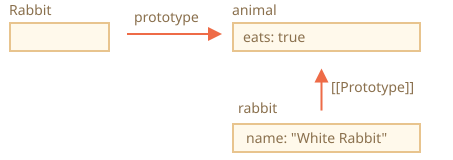
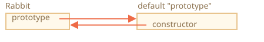
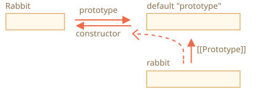

# F.prototype

จำได้ไหมว่าเราสามารถสร้างออบเจ็กต์ใหม่ด้วยคอนสตรักเตอร์ฟังก์ชัน เช่น `new F()`

ถ้า `F.prototype` เป็นออบเจ็กต์ ตัวดำเนินการ `new` จะนำมันไปตั้งค่าเป็น `[[Prototype]]` ให้กับออบเจ็กต์ใหม่

```smart
JavaScript มีการสืบทอดแบบโปรโตไทป์ตั้งแต่แรกเริ่มเลย ถือเป็นหนึ่งในฟีเจอร์หลักของภาษา

แต่ในสมัยก่อนยังเข้าถึงมันโดยตรงไม่ได้ วิธีเดียวที่ใช้ได้อย่างน่าเชื่อถือคือพร็อพเพอร์ตี้ `"prototype"` ของคอนสตรักเตอร์ฟังก์ชัน ซึ่งจะอธิบายในบทนี้ จึงยังมีโค้ดจำนวนมากที่ใช้วิธีนี้อยู่
```

สิ่งที่ควรรู้คือ `F.prototype` ในที่นี้หมายถึงพร็อพเพอร์ตี้ธรรมดาที่ชื่อ `"prototype"` บน `F` ฟังดูคล้ายกับคำว่า "โปรโตไทป์" ในเชิงแนวคิด แต่จริงๆ แล้วเป็นแค่พร็อพเพอร์ตี้ปกติที่ชื่อนี้เท่านั้น

ลองดูตัวอย่าง:

```js run
let animal = {
  eats: true
};

function Rabbit(name) {
  this.name = name;
}

*!*
Rabbit.prototype = animal;
*/!*

let rabbit = new Rabbit("White Rabbit"); //  rabbit.__proto__ == animal

alert( rabbit.eats ); // true
```

การเขียน `Rabbit.prototype = animal` มีความหมายว่า "เมื่อสร้าง `new Rabbit` ขึ้นมา ให้กำหนด `[[Prototype]]` ของมันเป็น `animal`"

ภาพรวมจะเป็นแบบนี้:



ในรูป `"prototype"` คือลูกศรแนวนอน หมายถึงพร็อพเพอร์ตี้ธรรมดา ส่วน `[[Prototype]]` คือลูกศรแนวตั้ง หมายถึงการที่ `rabbit` สืบทอดมาจาก `animal`

```smart header="`F.prototype` ใช้แค่ตอน `new F` เท่านั้น"
พร็อพเพอร์ตี้ `F.prototype` จะถูกใช้เฉพาะตอนเรียก `new F` เพื่อกำหนด `[[Prototype]]` ให้กับออบเจ็กต์ใหม่

ถ้าหลังจากสร้างออบเจ็กต์ไปแล้ว เราเปลี่ยน `F.prototype` (`F.prototype = <ออบเจ็กต์อื่น>`) ออบเจ็กต์ใหม่ที่สร้างจาก `new F` จะได้ `[[Prototype]]` เป็นออบเจ็กต์ตัวใหม่ แต่ออบเจ็กต์เดิมที่สร้างไปก่อนหน้ายังคงอ้างอิงไปยังตัวเก่าอยู่
```

## Default F.prototype กับ constructor property

ทุกฟังก์ชันจะมีพร็อพเพอร์ตี้ `"prototype"` อยู่แล้ว แม้เราจะไม่ได้กำหนดเอง

ค่าเริ่มต้นของ `"prototype"` เป็นออบเจ็กต์ที่มีพร็อพเพอร์ตี้ `constructor` ชี้กลับไปยังตัวฟังก์ชันเอง

แบบนี้:

```js
function Rabbit() {}

/* prototype เริ่มต้น
Rabbit.prototype = { constructor: Rabbit };
*/
```



ลองตรวจสอบดู:

```js run
function Rabbit() {}
// ค่าเริ่มต้น:
// Rabbit.prototype = { constructor: Rabbit }

alert( Rabbit.prototype.constructor == Rabbit ); // true
```

ถ้าเราไม่ไปแก้ไขอะไร พร็อพเพอร์ตี้ `constructor` จะถูกส่งต่อไปยัง rabbit ทุกตัวผ่าน `[[Prototype]]`:

```js run
function Rabbit() {}
// ค่าเริ่มต้น:
// Rabbit.prototype = { constructor: Rabbit }

let rabbit = new Rabbit(); // สืบทอดจาก {constructor: Rabbit}

alert(rabbit.constructor == Rabbit); // true (มาจาก prototype)
```



เราสามารถใช้พร็อพเพอร์ตี้ `constructor` สร้างออบเจ็กต์ใหม่โดยใช้คอนสตรักเตอร์เดียวกับที่สร้างออบเจ็กต์เดิมได้

ลองดูตัวอย่าง:

```js run
function Rabbit(name) {
  this.name = name;
  alert(name);
}

let rabbit = new Rabbit("White Rabbit");

*!*
let rabbit2 = new rabbit.constructor("Black Rabbit");
*/!*
```

วิธีนี้มีประโยชน์มากเวลาที่เรามีออบเจ็กต์อยู่แล้ว แต่ไม่รู้ว่ามันถูกสร้างด้วยคอนสตรักเตอร์ตัวไหน (เช่น มาจาก library ภายนอก) แล้วต้องการสร้างออบเจ็กต์อีกตัวที่เป็นชนิดเดียวกัน

แต่สิ่งสำคัญที่สุดเกี่ยวกับ `"constructor"` ก็คือ...

**...JavaScript ไม่ได้รับประกันว่าค่าของ `"constructor"` จะถูกต้องเสมอไป**

ใช่ มันมีอยู่ใน `"prototype"` เริ่มต้นของฟังก์ชัน แต่แค่นั้นเอง หลังจากนั้นจะเกิดอะไรขึ้นก็ขึ้นอยู่กับเราทั้งหมด

โดยเฉพาะถ้าเราเขียนทับ prototype เริ่มต้นทั้งก้อน `constructor` ก็จะหายไปด้วย

ยกตัวอย่าง:

```js run
function Rabbit() {}
Rabbit.prototype = {
  jumps: true
};

let rabbit = new Rabbit();
*!*
alert(rabbit.constructor === Rabbit); // false
*/!*
```

ดังนั้น ถ้าต้องการรักษา `"constructor"` ไว้ เราควรเพิ่ม/ลบพร็อพเพอร์ตี้ใน `"prototype"` ที่มีอยู่แล้ว แทนที่จะเขียนทับทั้งก้อน:

```js
function Rabbit() {}

// ไม่ได้เขียนทับ Rabbit.prototype ทั้งหมด
// แค่เพิ่มพร็อพเพอร์ตี้เข้าไป
Rabbit.prototype.jumps = true
// Rabbit.prototype.constructor เริ่มต้นยังคงอยู่
```

หรืออีกวิธีหนึ่งคือสร้าง `constructor` กลับมาเองด้วยมือ:

```js
Rabbit.prototype = {
  jumps: true,
*!*
  constructor: Rabbit
*/!*
};

// ตอนนี้ constructor ก็ถูกต้องแล้ว เพราะเราเพิ่มมันกลับเข้าไปเอง
```


## สรุป

ในบทนี้เราได้อธิบายวิธีการกำหนด `[[Prototype]]` ให้กับออบเจ็กต์ที่สร้างผ่านคอนสตรักเตอร์ฟังก์ชันแบบคร่าวๆ ในบทต่อไปเราจะได้เห็นรูปแบบการเขียนโปรแกรมขั้นสูงที่ใช้หลักการนี้

เนื้อหาทั้งหมดค่อนข้างตรงไปตรงมา แค่มีจุดที่ควรจำไว้:

- พร็อพเพอร์ตี้ `F.prototype` (อย่าสับสนกับ `[[Prototype]]`) จะกำหนด `[[Prototype]]` ให้กับออบเจ็กต์ใหม่เมื่อเรียก `new F()`
- ค่าของ `F.prototype` ต้องเป็นออบเจ็กต์หรือ `null` เท่านั้น ค่าอื่นจะไม่ทำงาน
- พร็อพเพอร์ตี้ `"prototype"` จะมีผลพิเศษแบบนี้เฉพาะเมื่อตั้งค่าไว้บนคอนสตรักเตอร์ฟังก์ชัน และเรียกใช้ด้วย `new` เท่านั้น

ถ้าเป็นออบเจ็กต์ธรรมดา `prototype` ก็แค่พร็อพเพอร์ตี้ปกติ ไม่มีอะไรพิเศษ:
```js
let user = {
  name: "John",
  prototype: "Bla-bla" // ไม่มีอะไรวิเศษเลย
};
```

ฟังก์ชันทุกตัวจะมี `F.prototype = { constructor: F }` เป็นค่าเริ่มต้น ดังนั้นเราจึงสามารถเข้าถึงคอนสตรักเตอร์ของออบเจ็กต์ได้ผ่านพร็อพเพอร์ตี้ `"constructor"` ของมัน
