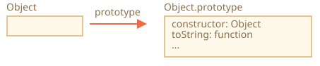
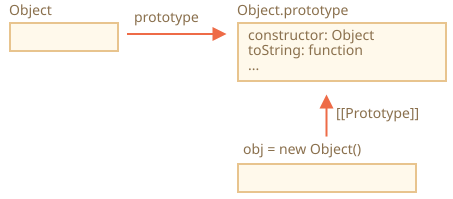
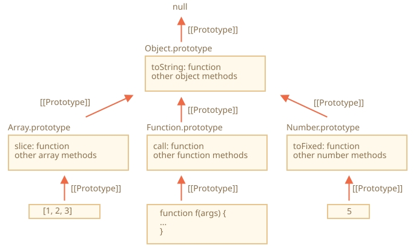
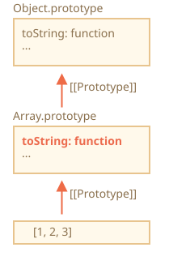

# โปรโตไทป์ของออบเจ็กต์มาตรฐาน (Native prototypes)

พร็อพเพอร์ตี้ `"prototype"` ถูกใช้งานอย่างกว้างขวางใน JavaScript เอง คอนสตรักเตอร์มาตรฐานทุกตัวล้วนใช้ทั้งนั้น

เรามาดูรายละเอียดกันก่อน แล้วค่อยดูว่าจะนำไปใช้เพิ่มความสามารถให้กับออบเจ็กต์มาตรฐานได้อย่างไร

## Object.prototype

ลองมาแสดงผลออบเจ็กต์เปล่าดู:

```js run
let obj = {};
alert( obj ); // "[object Object]" ?
```

โค้ดที่สร้างสตริง `"[object Object]"` อยู่ที่ไหนกัน? นั่นคือเมธอด `toString` ที่มีอยู่แล้วในตัว แต่มันอยู่ตรงไหนล่ะ? ก็ `obj` ว่างเปล่านี่นา!

...แต่จริงๆ แล้ว `obj = {}` ก็เหมือนกับ `obj = new Object()` นั่นเอง โดย `Object` คือคอนสตรักเตอร์มาตรฐาน ที่มี `prototype` ชี้ไปยังออบเจ็กต์ขนาดใหญ่ซึ่งมีเมธอด `toString` และเมธอดอื่นๆ อยู่

หน้าตาเป็นแบบนี้:



เมื่อเรียก `new Object()` (หรือสร้างออบเจ็กต์แบบย่อ `{...}`) ค่า `[[Prototype]]` จะถูกตั้งเป็น `Object.prototype` ตามกฎที่เราพูดถึงในบทก่อนหน้า:



ดังนั้นเมื่อเรียก `obj.toString()` เมธอดนี้จึงถูกหยิบมาจาก `Object.prototype` นั่นเอง

ลองพิสูจน์ได้แบบนี้:

```js run
let obj = {};

alert(obj.__proto__ === Object.prototype); // true

alert(obj.toString === obj.__proto__.toString); //true
alert(obj.toString === Object.prototype.toString); //true
```

สังเกตว่าเหนือ `Object.prototype` ขึ้นไปไม่มี `[[Prototype]]` อีกแล้ว:

```js run
alert(Object.prototype.__proto__); // null
```

## โปรโตไทป์ของออบเจ็กต์มาตรฐานตัวอื่นๆ

ออบเจ็กต์มาตรฐานอื่นๆ อย่าง `Array`, `Date`, `Function` ก็เก็บเมธอดไว้ในโปรโตไทป์เช่นกัน

ยกตัวอย่าง เวลาสร้างอาร์เรย์ `[1, 2, 3]` ภายในจะใช้คอนสตรักเตอร์ `new Array()` เป็นค่าเริ่มต้น ทำให้ `Array.prototype` กลายเป็นโปรโตไทป์ของอาร์เรย์นั้นและเตรียมเมธอดต่างๆ ไว้ให้ วิธีนี้ช่วยประหยัดหน่วยความจำได้มาก

ตามสเปก โปรโตไทป์มาตรฐานทั้งหมดจะมี `Object.prototype` อยู่บนสุดของสาย เพราะเหตุนี้บางคนจึงบอกว่า "ทุกอย่างสืบทอดมาจากออบเจ็กต์"

ภาพรวมเป็นแบบนี้ (แสดง 3 ตัวมาตรฐานให้พอดี):



ลองตรวจสอบโปรโตไทป์ด้วยตัวเอง:

```js run
let arr = [1, 2, 3];

// สืบทอดมาจาก Array.prototype?
alert( arr.__proto__ === Array.prototype ); // true

// แล้วต่อไปจาก Object.prototype?
alert( arr.__proto__.__proto__ === Object.prototype ); // true

// บนสุดคือ null
alert( arr.__proto__.__proto__.__proto__ ); // null
```

เมธอดในโปรโตไทป์อาจซ้ำกันได้ เช่น `Array.prototype` มี `toString` ของตัวเองที่แสดงสมาชิกคั่นด้วยจุลภาค:

```js run
let arr = [1, 2, 3]
alert(arr); // 1,2,3 <-- ผลลัพธ์จาก Array.prototype.toString
```

อย่างที่เราเห็น `Object.prototype` ก็มี `toString` เหมือนกัน แต่เนื่องจาก `Array.prototype` อยู่ใกล้กว่าในสายโปรโตไทป์ จึงใช้เวอร์ชันของอาร์เรย์แทน





เครื่องมือสำหรับนักพัฒนาในเบราว์เซอร์อย่าง Chrome developer console ก็แสดงการสืบทอดนี้ได้เช่นกัน (อาจต้องใช้ `console.dir` สำหรับออบเจ็กต์มาตรฐาน):


ออบเจ็กต์มาตรฐานตัวอื่นก็ทำงานในลักษณะเดียวกัน แม้แต่ฟังก์ชัน -- ฟังก์ชันก็เป็นออบเจ็กต์ของคอนสตรักเตอร์ `Function` มาตรฐาน เมธอดต่างๆ (`call`/`apply` และอื่นๆ) จึงอยู่ใน `Function.prototype` นอกจากนี้ฟังก์ชันยังมี `toString` ของตัวเองอีกด้วย

```js run
function f() {}

alert(f.__proto__ == Function.prototype); // true
alert(f.__proto__.__proto__ == Object.prototype); // true, สืบทอดมาจากออบเจ็กต์
```

## ค่าพื้นฐาน (Primitives)

เรื่องที่ซับซ้อนที่สุดเกิดขึ้นกับสตริง ตัวเลข และบูลีน

อย่างที่ทราบ ค่าเหล่านี้ไม่ใช่ออบเจ็กต์ แต่ถ้าเราลองเข้าถึงพร็อพเพอร์ตี้ JavaScript จะสร้างออบเจ็กต์ห่อหุ้ม (wrapper object) ชั่วคราวขึ้นมาโดยใช้คอนสตรักเตอร์ `String`, `Number` และ `Boolean` เพื่อเตรียมเมธอดให้ใช้ แล้วก็หายไป

ออบเจ็กต์เหล่านี้ถูกสร้างขึ้นโดยที่เราไม่เห็น และเอนจินส่วนใหญ่จะปรับแต่ง (optimize) จนไม่ต้องสร้างจริงๆ แต่ในสเปกอธิบายไว้อย่างนี้ เมธอดของออบเจ็กต์เหล่านี้ก็อยู่ในโปรโตไทป์เช่นกัน ใช้งานได้ผ่าน `String.prototype`, `Number.prototype` และ `Boolean.prototype`

```warn header="ค่า `null` และ `undefined` ไม่มีออบเจ็กต์ห่อหุ้ม"
ค่าพิเศษอย่าง `null` และ `undefined` แตกต่างออกไป เพราะไม่มีออบเจ็กต์ห่อหุ้ม จึงไม่มีเมธอดหรือพร็อพเพอร์ตี้ให้ใช้ และไม่มีโปรโตไทป์ที่เกี่ยวข้องด้วย
```

## การแก้ไขโปรโตไทป์มาตรฐาน [#native-prototype-change]

โปรโตไทป์มาตรฐานสามารถแก้ไขได้ เช่น ถ้าเราเพิ่มเมธอดลงใน `String.prototype` สตริงทุกตัวก็จะใช้เมธอดนั้นได้:

```js run
String.prototype.show = function() {
  alert(this);
};

"BOOM!".show(); // BOOM!
```

ระหว่างพัฒนา เราอาจนึกอยากได้เมธอดใหม่ๆ แล้วอยากเพิ่มเข้าไปในโปรโตไทป์มาตรฐาน แต่โดยทั่วไปแล้ว นี่ไม่ใช่ความคิดที่ดี

```warn
โปรโตไทป์เป็นของส่วนกลาง จึงเกิดการชนกันได้ง่าย ถ้าไลบรารีสองตัวเพิ่มเมธอด `String.prototype.show` ทั้งคู่ ตัวหนึ่งจะเขียนทับเมธอดของอีกตัว

ดังนั้นโดยทั่วไป การแก้ไขโปรโตไทป์มาตรฐานจึงถือว่าไม่ดี
```

**ในการเขียนโปรแกรมยุคใหม่ มีกรณีเดียวที่ยอมรับให้แก้ไขโปรโตไทป์มาตรฐานได้ นั่นคือ polyfilling**

Polyfilling คือการสร้างเมธอดทดแทนสำหรับเมธอดที่มีอยู่ในสเปกของ JavaScript แต่เอนจินบางตัวยังไม่รองรับ

เราจึงเขียนขึ้นมาเองแล้วเพิ่มเข้าไปในโปรโตไทป์มาตรฐานได้

ตัวอย่างเช่น:

```js run
if (!String.prototype.repeat) { // ถ้ายังไม่มีเมธอดนี้
  // เพิ่มเข้าไปในโปรโตไทป์

  String.prototype.repeat = function(n) {
    // ทำซ้ำสตริง n ครั้ง

    // จริงๆ แล้วโค้ดควรจะซับซ้อนกว่านี้อีกนิด
    // (อัลกอริทึมเต็มอยู่ในสเปก)
    // แต่ polyfill ที่ไม่สมบูรณ์ก็มักจะใช้งานได้ดีพอ
    return new Array(n + 1).join(this);
  };
}

alert( "La".repeat(3) ); // LaLaLa
```


## การยืมเมธอดจากโปรโตไทป์

ในบท <info:call-apply-decorators#method-borrowing> เราได้พูดถึงการยืมเมธอด (method borrowing)

คือการหยิบเมธอดจากออบเจ็กต์หนึ่งไปใช้กับอีกออบเจ็กต์หนึ่ง

เมธอดจากโปรโตไทป์มาตรฐานมักถูกยืมไปใช้บ่อย

ยกตัวอย่าง ถ้าเรากำลังสร้างออบเจ็กต์ที่คล้ายอาร์เรย์ (array-like) อาจอยากคัดลอกเมธอดบางตัวของ `Array` มาใช้

เช่น

```js run
let obj = {
  0: "Hello",
  1: "world!",
  length: 2,
};

*!*
obj.join = Array.prototype.join;
*/!*

alert( obj.join(',') ); // Hello,world!
```

วิธีนี้ใช้ได้เพราะอัลกอริทึมภายในของเมธอด `join` สนใจแค่ index ที่ถูกต้องกับพร็อพเพอร์ตี้ `length` เท่านั้น ไม่ได้ตรวจว่าเป็นอาร์เรย์จริงหรือเปล่า เมธอดมาตรฐานหลายตัวก็ทำงานในลักษณะนี้

อีกทางเลือกหนึ่งคือตั้ง `obj.__proto__` ให้ชี้ไปที่ `Array.prototype` เพื่อให้เมธอดของ `Array` ทั้งหมดพร้อมใช้ใน `obj` โดยอัตโนมัติ

แต่วิธีนี้ทำไม่ได้ถ้า `obj` สืบทอดจากออบเจ็กต์อื่นอยู่แล้ว อย่าลืมว่าเราสืบทอดได้จากออบเจ็กต์เดียวเท่านั้น

การยืมเมธอดนั้นยืดหยุ่นกว่า เพราะสามารถผสมความสามารถจากหลายออบเจ็กต์เข้าด้วยกันได้ตามต้องการ

## สรุป

- ออบเจ็กต์มาตรฐานทั้งหมดใช้รูปแบบเดียวกัน:
    - เมธอดต่างๆ ถูกเก็บไว้ในโปรโตไทป์ (`Array.prototype`, `Object.prototype`, `Date.prototype` เป็นต้น)
    - ตัวออบเจ็กต์เองเก็บแค่ข้อมูล (สมาชิกของอาร์เรย์ พร็อพเพอร์ตี้ของออบเจ็กต์ วันที่)
- ค่าพื้นฐาน (primitives) ก็เก็บเมธอดไว้ในโปรโตไทป์ของออบเจ็กต์ห่อหุ้มเช่นกัน: `Number.prototype`, `String.prototype` และ `Boolean.prototype` มีเพียง `undefined` กับ `null` เท่านั้นที่ไม่มีออบเจ็กต์ห่อหุ้ม
- โปรโตไทป์มาตรฐานสามารถแก้ไขหรือเพิ่มเมธอดใหม่ได้ แต่ไม่แนะนำให้ทำ กรณีเดียวที่ยอมรับได้คือเมื่อต้องการเพิ่ม polyfill สำหรับเมธอดที่อยู่ในมาตรฐานแล้วแต่เอนจินยังไม่รองรับ
