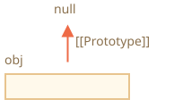

# เมธอดของโปรโตไทป์ และออบเจ็กต์ที่ไม่มี __proto__

ในบทแรกของหมวดนี้ เราได้กล่าวไปว่ามีเมธอดสมัยใหม่สำหรับกำหนดโปรโตไทป์

การกำหนดหรืออ่านค่าโปรโตไทป์ด้วย `obj.__proto__` ถือว่าล้าสมัยไปแล้ว และอยู่ในสถานะค่อนข้างจะ deprecated (ถูกย้ายไปอยู่ใน "Annex B" ของมาตรฐาน JavaScript ซึ่งมีไว้สำหรับเบราว์เซอร์เท่านั้น)

เมธอดสมัยใหม่สำหรับอ่าน/กำหนดโปรโตไทป์มีดังนี้:

- [Object.getPrototypeOf(obj)](mdn:js/Object/getPrototypeOf) -- คืนค่า `[[Prototype]]` ของ `obj`
- [Object.setPrototypeOf(obj, proto)](mdn:js/Object/setPrototypeOf) -- กำหนด `[[Prototype]]` ของ `obj` ให้เป็น `proto`

การใช้ `__proto__` ที่ยังถือว่ายอมรับได้ มีเพียงกรณีเดียว คือใช้เป็นพร็อพเพอร์ตี้ตอนสร้างออบเจ็กต์ใหม่: `{ __proto__: ... }`

แม้กระนั้น ก็ยังมีเมธอดเฉพาะสำหรับเรื่องนี้เช่นกัน:

- [Object.create(proto[, descriptors])](mdn:js/Object/create) -- สร้างออบเจ็กต์ว่างโดยมี `proto` เป็น `[[Prototype]]` พร้อมทั้งกำหนด property descriptor เพิ่มเติมได้

ตัวอย่างเช่น:

```js run
let animal = {
  eats: true
};

// สร้างออบเจ็กต์ใหม่โดยมี animal เป็นโปรโตไทป์
*!*
let rabbit = Object.create(animal); // เหมือนกับ {__proto__: animal}
*/!*

alert(rabbit.eats); // true

*!*
alert(Object.getPrototypeOf(rabbit) === animal); // true
*/!*

*!*
Object.setPrototypeOf(rabbit, {}); // เปลี่ยนโปรโตไทป์ของ rabbit เป็น {}
*/!*
```

`Object.create` มีความสามารถมากกว่านั้น เพราะรับอาร์กิวเมนต์ตัวที่สองได้ด้วย คือ property descriptor

เราสามารถกำหนดพร็อพเพอร์ตี้เพิ่มเติมให้ออบเจ็กต์ใหม่ได้แบบนี้:

```js run
let animal = {
  eats: true
};

let rabbit = Object.create(animal, {
  jumps: {
    value: true
  }
});

alert(rabbit.jumps); // true
```

รูปแบบของ descriptor เหมือนกับที่อธิบายไว้ในบท <info:property-descriptors>

นอกจากนี้ `Object.create` ยังใช้โคลนออบเจ็กต์ได้ละเอียดกว่าการคัดลอกพร็อพเพอร์ตี้ด้วย `for..in`:

```js
let clone = Object.create(
  Object.getPrototypeOf(obj), Object.getOwnPropertyDescriptors(obj)
);
```

การเรียกแบบนี้จะสร้างสำเนาที่เหมือน `obj` ทุกประการ ไม่ว่าจะเป็นพร็อพเพอร์ตี้แบบ enumerable หรือ non-enumerable, data property หรือ getter/setter ทุกอย่างรวมถึง `[[Prototype]]` ที่ถูกต้องด้วย


## ประวัติย่อ

มีวิธีจัดการ `[[Prototype]]` มากมายหลายแบบ เป็นอย่างนี้ได้อย่างไร? ทำไมถึงซับซ้อนขนาดนี้?

คำตอบก็คือเรื่องของประวัติศาสตร์

การสืบทอดแบบโปรโตไทป์มีอยู่ในภาษาตั้งแต่แรกเริ่ม แต่วิธีจัดการค่อยๆ เปลี่ยนไปตามกาลเวลา:

- พร็อพเพอร์ตี้ `prototype` ของคอนสตรักเตอร์ฟังก์ชันใช้งานได้มาตั้งแต่ยุคแรกๆ เลย เป็นวิธีดั้งเดิมที่สุดในการสร้างออบเจ็กต์พร้อมกำหนดโปรโตไทป์
- ต่อมาในปี 2012 `Object.create` ถูกเพิ่มเข้ามาในมาตรฐาน ทำให้สร้างออบเจ็กต์พร้อมกำหนดโปรโตไทป์ได้ แต่ยังอ่าน/เปลี่ยนโปรโตไทป์ไม่ได้ เบราว์เซอร์บางตัวจึงทำ accessor `__proto__` ที่ไม่เป็นมาตรฐานขึ้นมา เพื่อให้อ่าน/เปลี่ยนโปรโตไทป์ได้ทุกเมื่อ
- ต่อมาในปี 2015 `Object.setPrototypeOf` และ `Object.getPrototypeOf` ถูกเพิ่มเข้ามาในมาตรฐาน ให้ทำงานเดียวกับ `__proto__` ได้ เนื่องจาก `__proto__` ถูกใช้ไปทั่วแล้ว จึงถูกทำเป็น deprecated และถูกย้ายไปอยู่ใน Annex B ของมาตรฐาน ซึ่งเป็นตัวเลือกสำหรับสภาพแวดล้อมที่ไม่ใช่เบราว์เซอร์
- ต่อมาในปี 2022 `__proto__` ได้รับอนุญาตให้ใช้ใน object literal `{...}` อย่างเป็นทางการ (ย้ายออกจาก Annex B) แต่ห้ามใช้ในรูปแบบ getter/setter อย่าง `obj.__proto__` (ยังอยู่ใน Annex B)

ทำไม `__proto__` ถึงถูกแทนที่ด้วยฟังก์ชัน `getPrototypeOf/setPrototypeOf`?

ทำไม `__proto__` ถึงถูก "ฟื้นฟู" เพียงบางส่วน โดยอนุญาตให้ใช้ใน `{...}` ได้ แต่ห้ามใช้เป็น getter/setter?

คำถามนี้น่าสนใจทีเดียว ก่อนจะตอบได้ เราต้องเข้าใจก่อนว่า `__proto__` มีปัญหาอะไร

คำตอบจะมาในหัวข้อถัดไปเลย

```warn header="อย่าเปลี่ยน `[[Prototype]]` ของออบเจ็กต์ที่มีอยู่แล้ว ถ้าความเร็วเป็นเรื่องสำคัญ"
ในทางเทคนิค เราอ่าน/กำหนด `[[Prototype]]` ได้ทุกเมื่อ แต่โดยปกติเรากำหนดแค่ครั้งเดียวตอนสร้างออบเจ็กต์ แล้วไม่แก้ไขอีก เช่น `rabbit` สืบทอดจาก `animal` แล้วก็จะเป็นอย่างนั้นตลอดไป

JavaScript engine ถูกปรับแต่งมาให้รองรับกรณีนี้โดยเฉพาะ การเปลี่ยนโปรโตไทป์ "ระหว่างทาง" ด้วย `Object.setPrototypeOf` หรือ `obj.__proto__=` จึงเป็นคำสั่งที่ช้ามาก เพราะทำให้ engine optimize การเข้าถึงพร็อพเพอร์ตี้ไม่ได้ ควรหลีกเลี่ยง ยกเว้นจะรู้ว่ากำลังทำอะไรอยู่ หรือความเร็วไม่ใช่เรื่องสำคัญสำหรับงานนั้น
```

## ออบเจ็กต์ "ว่างเปล่าจริงๆ" [#very-plain]

อย่างที่เราทราบ ออบเจ็กต์สามารถใช้เป็น associative array สำหรับเก็บคู่ key/value ได้

...แต่ถ้าลองเก็บ key ที่*ผู้ใช้ป้อนเข้ามา* (เช่น พจนานุกรมที่ผู้ใช้พิมพ์เอง) จะพบปัญหาแปลกๆ อย่างหนึ่ง: key ทุกตัวใช้ได้ปกติ ยกเว้น `"__proto__"`

ลองดูตัวอย่างนี้:

```js run
let obj = {};

let key = prompt("What's the key?", "__proto__");
obj[key] = "some value";

alert(obj[key]); // [object Object] ไม่ใช่ "some value"!
```

ถ้าผู้ใช้พิมพ์ `__proto__` การกำหนดค่าในบรรทัดที่ 4 จะถูกเพิกเฉย!

คนทั่วไปอาจแปลกใจ แต่สำหรับเราเข้าใจได้ไม่ยาก เพราะพร็อพเพอร์ตี้ `__proto__` มีลักษณะพิเศษ — ค่าต้องเป็นออบเจ็กต์หรือ `null` เท่านั้น สตริงจะเป็นโปรโตไทป์ไม่ได้ การกำหนดค่าสตริงให้ `__proto__` จึงถูกเพิกเฉย

แต่เราไม่ได้*ตั้งใจ*จะทำแบบนี้ ใช่ไหม? เราแค่อยากเก็บคู่ key/value แต่ key ชื่อ `"__proto__"` กลับเก็บไม่ได้ นี่คือบั๊กชัดๆ!

ในตัวอย่างนี้ผลกระทบอาจยังไม่ร้ายแรง แต่ในกรณีอื่นเราอาจเก็บออบเจ็กต์แทนที่จะเป็นสตริง ซึ่งจะทำให้โปรโตไทป์ถูกเปลี่ยนจริงๆ และโปรแกรมจะทำงานผิดพลาดอย่างคาดไม่ถึง

ที่แย่กว่านั้นคือ นักพัฒนาส่วนใหญ่ไม่คิดถึงความเป็นไปได้นี้เลย ทำให้บั๊กแบบนี้สังเกตได้ยาก และอาจกลายเป็นช่องโหว่ด้านความปลอดภัยได้ โดยเฉพาะเมื่อใช้ JavaScript ฝั่งเซิร์ฟเวอร์

ปัญหาเดียวกันอาจเกิดขึ้นเมื่อกำหนดค่าให้ `obj.toString` เพราะเป็นเมธอดที่มีอยู่แล้วในออบเจ็กต์

แล้วจะหลีกเลี่ยงปัญหานี้ได้อย่างไร?

วิธีแรก เปลี่ยนไปใช้ `Map` แทนออบเจ็กต์ธรรมดา แค่นี้ก็หมดปัญหา:

```js run
let map = new Map();

let key = prompt("What's the key?", "__proto__");
map.set(key, "some value");

alert(map.get(key)); // "some value" (ตามที่ตั้งใจไว้)
```

...แต่ไวยากรณ์ของ `Object` ก็ดึงดูดใจกว่า เพราะเขียนได้กระชับ

โชคดีที่เรา*ยังใช้*ออบเจ็กต์ได้ เพราะผู้สร้างภาษาได้คิดเรื่องนี้ไว้นานแล้ว

อย่างที่ทราบ `__proto__` ไม่ได้เป็นพร็อพเพอร์ตี้ของออบเจ็กต์โดยตรง แต่เป็น accessor property ของ `Object.prototype`:


ดังนั้นเวลาอ่านหรือเขียน `obj.__proto__` จริงๆ แล้วจะไปเรียก getter/setter จากโปรโตไทป์ ซึ่งจะอ่าน/กำหนดค่า `[[Prototype]]`

อย่างที่กล่าวไว้ตอนต้นของหมวดนี้: `__proto__` เป็นแค่ทางเข้าถึง `[[Prototype]]` ไม่ใช่ตัว `[[Prototype]]` เอง

ทีนี้ ถ้าเราต้องการใช้ออบเจ็กต์เป็น associative array โดยไม่มีปัญหาเหล่านี้ ก็ทำได้ด้วยเทคนิคเล็กๆ:

```js run
*!*
let obj = Object.create(null);
// หรือ: obj = { __proto__: null }
*/!*

let key = prompt("What's the key?", "__proto__");
obj[key] = "some value";

alert(obj[key]); // "some value"
```

`Object.create(null)` สร้างออบเจ็กต์ว่างที่ไม่มีโปรโตไทป์ (`[[Prototype]]` เป็น `null`):



เมื่อไม่มี getter/setter ที่สืบทอดมาสำหรับ `__proto__` จึงถูกจัดการเป็น data property ธรรมดา ตัวอย่างข้างต้นจึงทำงานได้ถูกต้อง

ออบเจ็กต์แบบนี้เรียกว่า "very plain" หรือ "pure dictionary" เพราะเรียบง่ายกว่าออบเจ็กต์ธรรมดา `{...}` เสียอีก

ข้อเสียคือ ออบเจ็กต์แบบนี้ไม่มีเมธอดมาตรฐานของออบเจ็กต์เลย เช่น `toString`:

```js run
*!*
let obj = Object.create(null);
*/!*

alert(obj); // Error (ไม่มี toString)
```

...แต่สำหรับ associative array แล้วก็ไม่เป็นปัญหาอะไร

สังเกตว่าเมธอดส่วนใหญ่ที่เกี่ยวกับออบเจ็กต์จะอยู่ในรูป `Object.something(...)` เช่น `Object.keys(obj)` ซึ่งไม่ได้อยู่ในโปรโตไทป์ จึงยังใช้กับออบเจ็กต์แบบนี้ได้ปกติ:


```js run
let chineseDictionary = Object.create(null);
chineseDictionary.hello = "你好";
chineseDictionary.bye = "再见";

alert(Object.keys(chineseDictionary)); // hello,bye
```

## สรุป

- สร้างออบเจ็กต์พร้อมกำหนดโปรโตไทป์ได้ 2 วิธี:

    - ใช้ literal syntax: `{ __proto__: ... }` กำหนดพร็อพเพอร์ตี้หลายตัวพร้อมกันได้
    - หรือใช้ [Object.create(proto[, descriptors])](mdn:js/Object/create) กำหนด property descriptor ได้

    `Object.create` ยังช่วยให้ shallow-copy ออบเจ็กต์พร้อม descriptor ทั้งหมดได้ง่ายๆ:

    ```js
    let clone = Object.create(Object.getPrototypeOf(obj), Object.getOwnPropertyDescriptors(obj));
    ```

- เมธอดสมัยใหม่สำหรับอ่าน/กำหนดโปรโตไทป์:

    - [Object.getPrototypeOf(obj)](mdn:js/Object/getPrototypeOf) -- คืนค่า `[[Prototype]]` ของ `obj` (ทำงานเหมือน `__proto__` getter)
    - [Object.setPrototypeOf(obj, proto)](mdn:js/Object/setPrototypeOf) -- กำหนด `[[Prototype]]` ของ `obj` เป็น `proto` (ทำงานเหมือน `__proto__` setter)

- ไม่แนะนำให้ใช้ `__proto__` getter/setter ที่ built-in มาให้ ตอนนี้อยู่ใน Annex B ของมาตรฐานแล้ว

- เรายังได้เรียนรู้ออบเจ็กต์ที่ไม่มีโปรโตไทป์ สร้างด้วย `Object.create(null)` หรือ `{__proto__: null}`

    ออบเจ็กต์เหล่านี้ใช้เป็น dictionary สำหรับเก็บ key อะไรก็ได้ (รวมถึง key ที่ผู้ใช้ป้อนเข้ามา)

    ปกติแล้วออบเจ็กต์จะสืบทอดเมธอด built-in และ `__proto__` getter/setter มาจาก `Object.prototype` ทำให้ key เหล่านั้นถูก "จอง" ไว้แล้ว และอาจทำให้เกิดผลข้างเคียงที่ไม่ต้องการ แต่ถ้าโปรโตไทป์เป็น `null` ออบเจ็กต์จะว่างเปล่าจริงๆ
